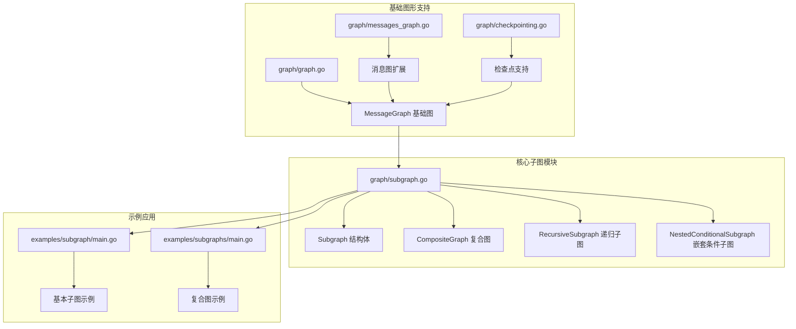
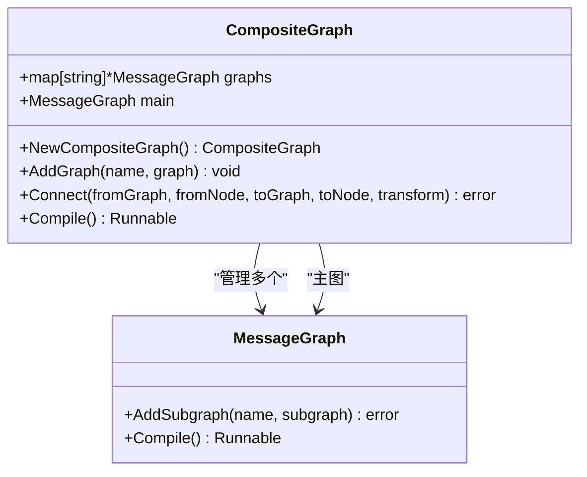
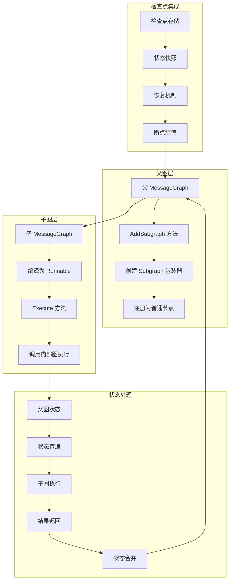
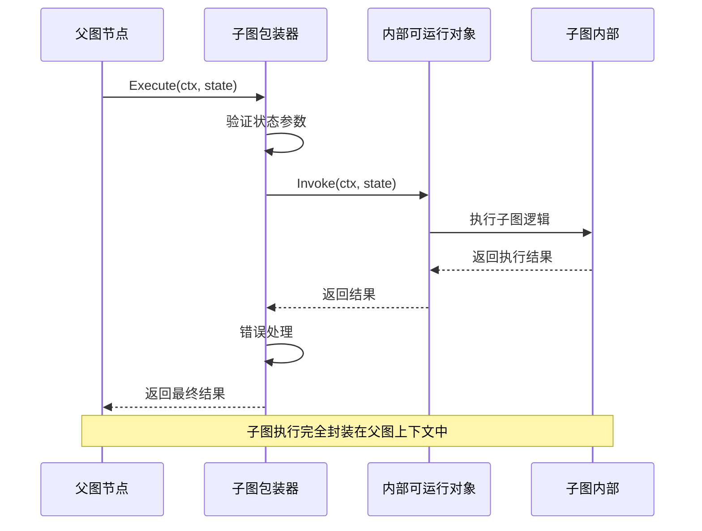
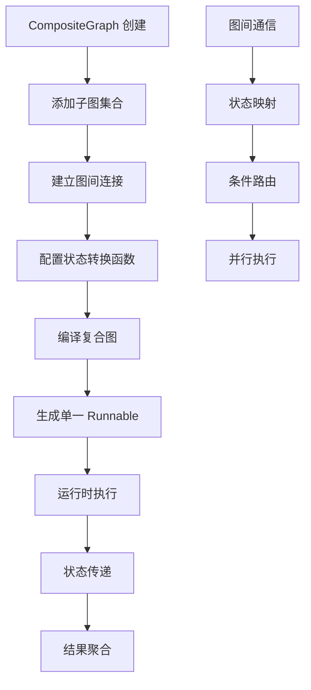
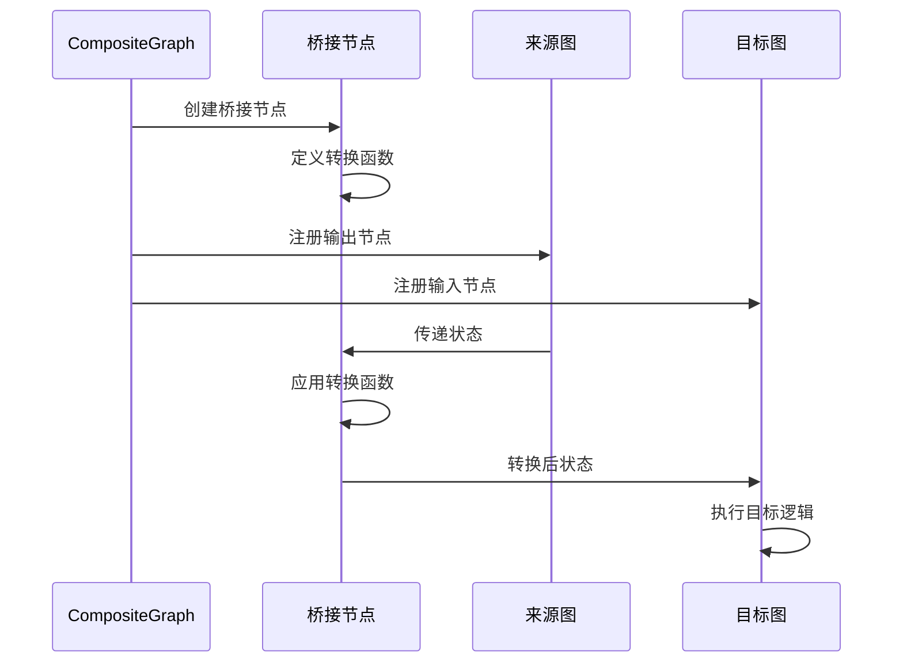
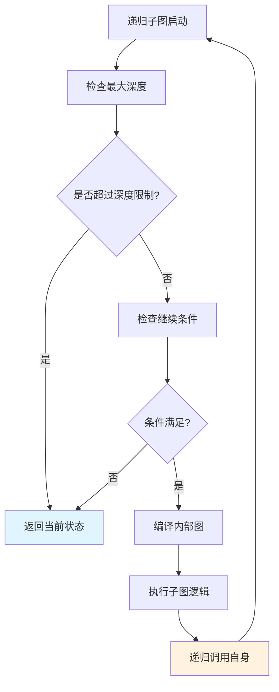
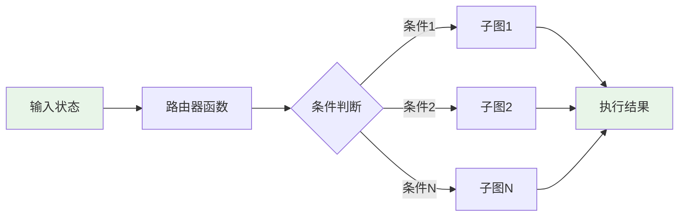
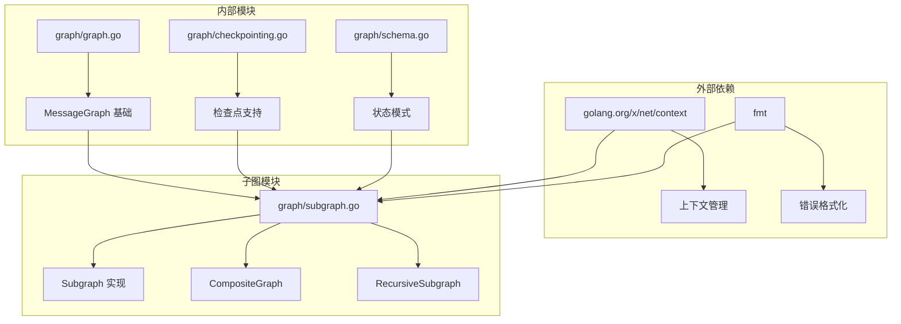
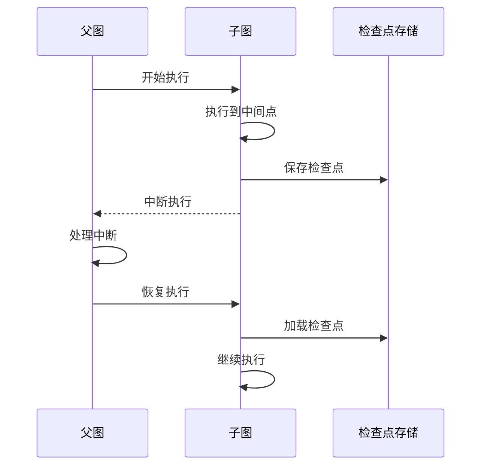

# 子图

<cite>
**本文档中引用的文件**
- [graph/subgraph.go](file://graph/subgraph.go)
- [examples/subgraph/main.go](file://examples/subgraph/main.go)
- [examples/subgraphs/main.go](file://examples/subgraphs/main.go)
- [examples/subgraph/README.md](file://examples/subgraph/README.md)
- [examples/subgraphs/README.md](file://examples/subgraphs/README.md)
- [graph/graph.go](file://graph/graph.go)
- [graph/messages_graph.go](file://graph/messages_graph.go)
- [graph/checkpointing.go](file://graph/checkpointing.go)
- [graph/checkpointing_test.go](file://graph/checkpointing_test.go)
- [graph/update_state_test.go](file://graph/update_state_test.go)
</cite>

## 目录
1. [简介](#简介)
2. [项目结构](#项目结构)
3. [核心组件](#核心组件)
4. [架构概览](#架构概览)
5. [详细组件分析](#详细组件分析)
6. [依赖关系分析](#依赖关系分析)
7. [性能考虑](#性能考虑)
8. [故障排除指南](#故障排除指南)
9. [结论](#结论)

## 简介

LangGraphGo 的子图（Subgraph）功能是一个强大的模块化设计特性，允许开发者将复杂的业务流程分解为可复用的模块化组件。通过子图结构体，可以将一个完整的图（如 StateGraph 或 MessageGraph）嵌入到另一个父图中作为一个节点来执行，从而实现工作流的层次化组织和逻辑复用。

子图功能的核心价值在于：
- **模块化设计**：将复杂的工作流分解为更小、更易管理的组件
- **代码复用**：创建可在多个地方或项目中重复使用的流程组件
- **状态共享**：在父子图之间自动传递状态并合并结果
- **层次化架构**：构建具有清晰层级结构的工作流程

## 项目结构

LangGraphGo 的子图功能主要分布在以下关键文件中：



**图表来源**
- [graph/subgraph.go](file://graph/subgraph.go#L1-L200)
- [examples/subgraph/main.go](file://examples/subgraph/main.go#L1-L166)
- [examples/subgraphs/main.go](file://examples/subgraphs/main.go#L1-L59)

**章节来源**
- [graph/subgraph.go](file://graph/subgraph.go#L1-L200)
- [examples/subgraph/main.go](file://examples/subgraph/main.go#L1-L166)
- [examples/subgraphs/main.go](file://examples/subgraphs/main.go#L1-L59)

## 核心组件

### Subgraph 结构体

Subgraph 是子图功能的核心数据结构，它封装了一个嵌套的图并提供了执行接口：

```mermaid
classDiagram
class Subgraph {
+string name
+MessageGraph graph
+Runnable runnable
+NewSubgraph(name, graph) Subgraph
+Execute(ctx, state) interface{}
}
class MessageGraph {
+map nodes
+[]Edge edges
+map conditionalEdges
+string entryPoint
+AddNode(name, fn) void
+AddEdge(from, to) void
+Compile() Runnable
}
class Runnable {
+MessageGraph graph
+Tracer tracer
+Invoke(ctx, state) interface{}
+InvokeWithConfig(ctx, state, config) interface{}
}
Subgraph --> MessageGraph : "包含"
Subgraph --> Runnable : "编译为"
MessageGraph --> Runnable : "编译产生"
```

**图表来源**
- [graph/subgraph.go](file://graph/subgraph.go#L8-L13)
- [graph/graph.go](file://graph/graph.go#L74-L93)
- [graph/graph.go](file://graph/graph.go#L140-L146)

### CompositeGraph 复合图

CompositeGraph 提供了将多个子图组合成单一可执行实体的能力：



**图表来源**
- [graph/subgraph.go](file://graph/subgraph.go#L56-L67)
- [graph/subgraph.go](file://graph/subgraph.go#L96-L106)

**章节来源**
- [graph/subgraph.go](file://graph/subgraph.go#L8-L13)
- [graph/subgraph.go](file://graph/subgraph.go#L56-L67)

## 架构概览

子图系统的整体架构展示了从简单子图到复杂复合图的演进过程：



**图表来源**
- [graph/subgraph.go](file://graph/subgraph.go#L38-L47)
- [graph/subgraph.go](file://graph/subgraph.go#L29-L36)
- [graph/checkpointing.go](file://graph/checkpointing.go#L12-L20)

## 详细组件分析

### Subgraph 执行流程

子图的 Execute 方法是整个子图功能的核心，它接管父图的执行流程并运行内部图：



**图表来源**
- [graph/subgraph.go](file://graph/subgraph.go#L29-L36)

#### Execute 方法实现细节

Execute 方法的设计遵循简洁性和可靠性的原则：

1. **状态验证**：接收父图传递的状态参数
2. **内部调用**：通过编译后的 Runnable 对象执行子图
3. **错误处理**：提供详细的错误信息，包括子图名称
4. **结果返回**：将子图执行结果直接返回给父图

**章节来源**
- [graph/subgraph.go](file://graph/subgraph.go#L29-L36)

### 复合图架构

CompositeGraph 提供了更高级的子图组合能力，支持多图协作和状态转换：



**图表来源**
- [graph/subgraph.go](file://graph/subgraph.go#L70-L96)

#### 连接机制

CompositeGraph 的 Connect 方法实现了图间的智能连接：



**图表来源**
- [graph/subgraph.go](file://graph/subgraph.go#L75-L91)

**章节来源**
- [graph/subgraph.go](file://graph/subgraph.go#L70-L96)

### 递归子图功能

RecursiveSubgraph 允许子图在其内部调用自身，实现迭代处理模式：



**图表来源**
- [graph/subgraph.go](file://graph/subgraph.go#L135-L159)

#### 递归执行策略

递归子图的执行遵循严格的控制流程：

1. **深度检查**：防止无限递归导致栈溢出
2. **条件验证**：基于状态和深度动态决定是否继续
3. **动态编译**：每次递归都重新编译内部图
4. **状态累积**：将每次递归的结果传递给下一次调用

**章节来源**
- [graph/subgraph.go](file://graph/subgraph.go#L108-L159)

### 嵌套条件子图

NestedConditionalSubgraph 提供了在子图内部实现条件路由的能力：



**图表来源**
- [graph/subgraph.go](file://graph/subgraph.go#L173-L199)

**章节来源**
- [graph/subgraph.go](file://graph/subgraph.go#L173-L199)

## 依赖关系分析

子图功能的依赖关系展现了其在 LangGraphGo 生态系统中的核心地位：



**图表来源**
- [graph/subgraph.go](file://graph/subgraph.go#L1-L7)
- [graph/graph.go](file://graph/graph.go#L1-L20)

### 关键依赖说明

1. **上下文管理**：确保子图执行的生命周期控制
2. **错误处理**：提供详细的错误信息和调试支持
3. **图形基础**：依赖 MessageGraph 的核心功能
4. **状态管理**：与检查点系统紧密集成

**章节来源**
- [graph/subgraph.go](file://graph/subgraph.go#L1-L7)
- [graph/graph.go](file://graph/graph.go#L1-L20)

## 性能考虑

子图功能在设计时充分考虑了性能优化：

### 编译时优化

- **延迟编译**：子图仅在需要时才编译，避免不必要的资源消耗
- **缓存机制**：编译后的 Runnable 对象被缓存，避免重复编译
- **内存管理**：合理管理子图对象的生命周期

### 执行时优化

- **状态传递效率**：最小化状态复制和序列化开销
- **错误传播**：快速失败机制减少无效执行
- **并发安全**：确保多线程环境下的安全性

### 检查点集成

子图与检查点系统的集成提供了持久化和恢复能力：



**图表来源**
- [graph/checkpointing.go](file://graph/checkpointing.go#L12-L20)

## 故障排除指南

### 常见问题及解决方案

#### 1. 子图编译失败

**症状**：调用 NewSubgraph 或 AddSubgraph 时返回错误
**原因**：子图配置不正确或缺少入口点
**解决方案**：
- 确保子图设置了有效的入口点
- 检查节点定义是否完整
- 验证边连接的正确性

#### 2. 状态传递异常

**症状**：子图执行时状态类型不匹配
**原因**：父图和子图的状态模式不兼容
**解决方案**：
- 使用兼容的状态模式
- 在连接处添加状态转换函数
- 确保状态结构的一致性

#### 3. 递归深度溢出

**症状**：RecursiveSubgraph 执行时出现栈溢出
**原因**：递归条件始终为真或深度设置过大
**解决方案**：
- 设置合理的最大深度限制
- 改进递归终止条件
- 添加深度监控和日志

**章节来源**
- [graph/subgraph.go](file://graph/subgraph.go#L16-L26)
- [graph/subgraph.go](file://graph/subgraph.go#L135-L159)

## 结论

LangGraphGo 的子图功能为复杂工作流的设计和实现提供了强大而灵活的工具。通过模块化的设计理念，它成功地解决了大型系统中代码组织和逻辑复用的挑战。

### 主要优势

1. **模块化架构**：将复杂系统分解为可管理的组件
2. **代码复用**：创建可在多个场景中重复使用的流程模板
3. **状态一致性**：提供可靠的父子图状态共享机制
4. **扩展性强**：支持从简单子图到复杂复合图的各种使用场景

### 最佳实践建议

1. **合理分层**：根据业务逻辑的复杂度设计合适的层次结构
2. **状态设计**：保持状态模式的一致性和兼容性
3. **错误处理**：充分利用详细的错误信息进行调试
4. **性能监控**：关注子图执行的性能指标和资源使用情况

子图功能不仅提升了代码的可维护性和可扩展性，更为构建企业级的智能工作流系统奠定了坚实的基础。随着项目的不断发展，这一功能将继续发挥其在复杂业务场景中的重要作用。