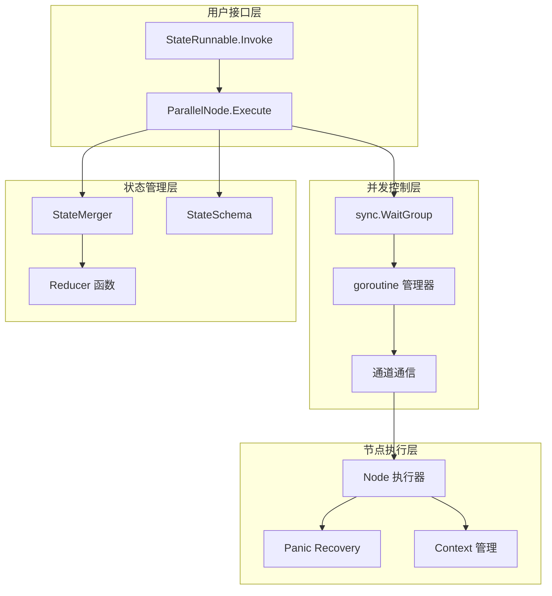
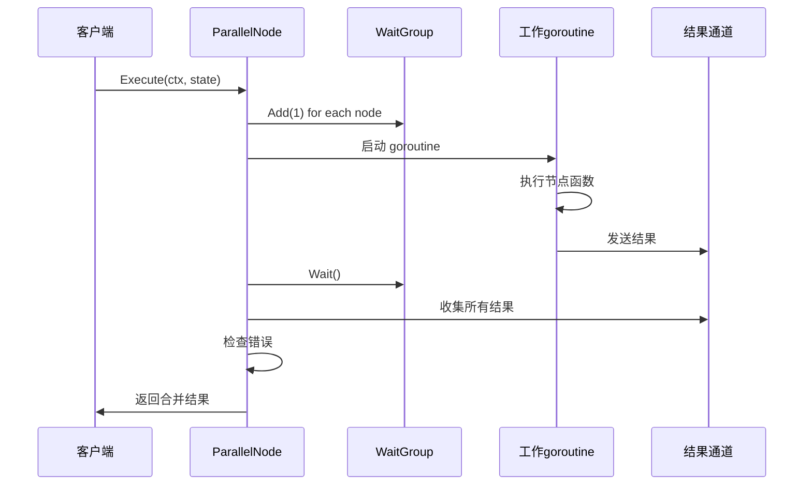
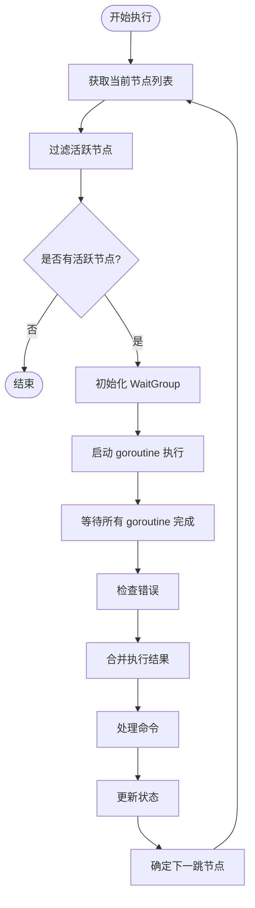
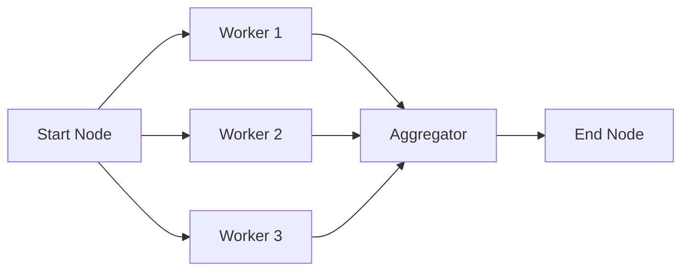
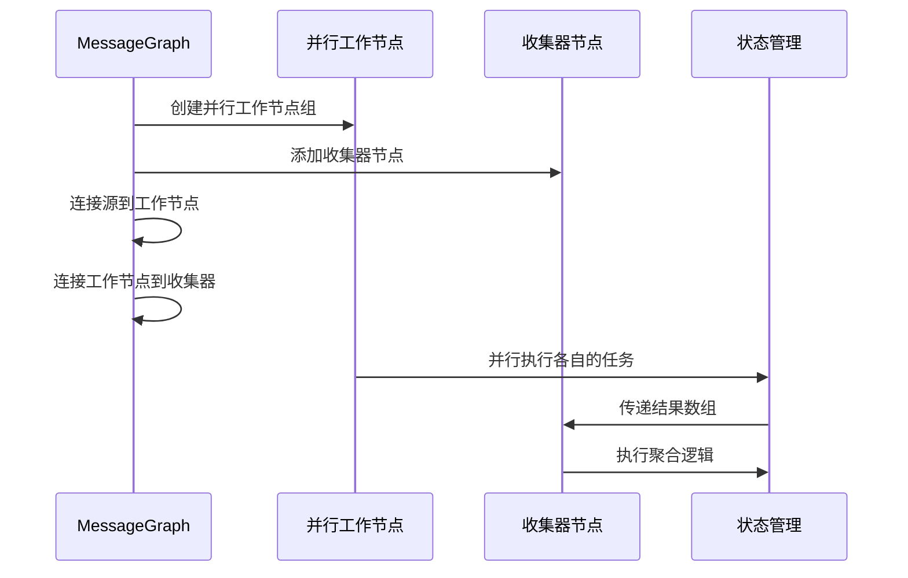
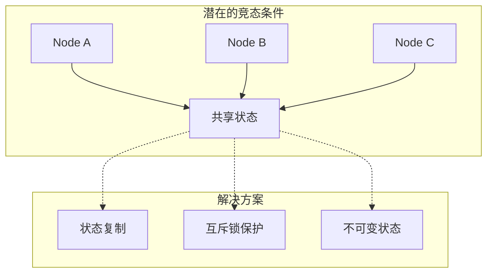
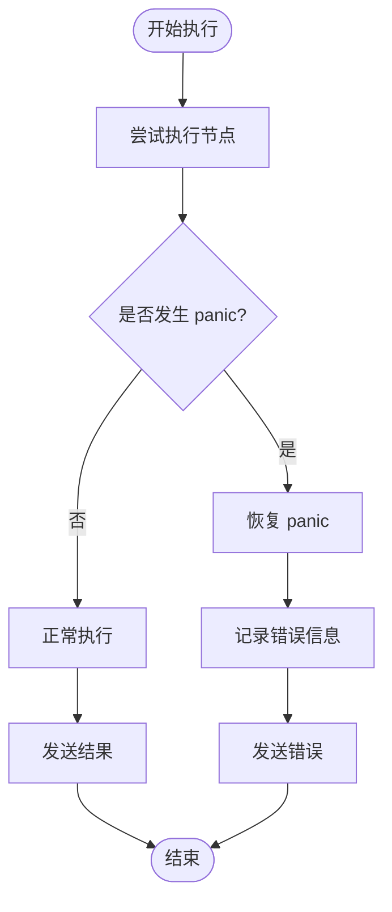
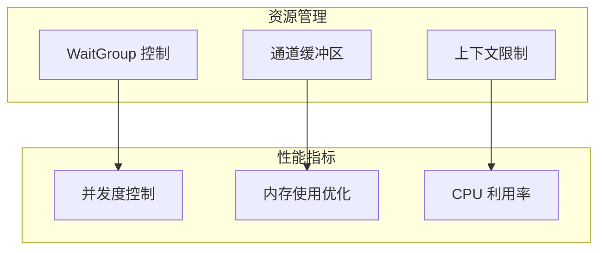
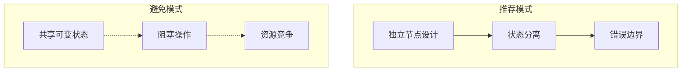

# 并行执行

<cite>
**本文档中引用的文件**
- [examples/parallel_execution/main.go](file://examples/parallel_execution/main.go)
- [graph/parallel.go](file://graph/parallel.go)
- [graph/state_graph.go](file://graph/state_graph.go)
- [graph/schema.go](file://graph/schema.go)
- [graph/parallel_execution_test.go](file://graph/parallel_execution_test.go)
- [examples/parallel_execution/README.md](file://examples/parallel_execution/README.md)
</cite>

## 目录
1. [简介](#简介)
2. [并行执行架构概述](#并行执行架构概述)
3. [核心组件分析](#核心组件分析)
4. [Invoke 方法中的并行执行机制](#invoke-方法中的并行执行机制)
5. [Fan-out/Fan-in 模式](#fan-outfan-in-模式)
6. [状态合并策略](#状态合并策略)
7. [线程安全与并发访问](#线程安全与并发访问)
8. [错误处理与恢复](#错误处理与恢复)
9. [性能优化考虑](#性能优化考虑)
10. [最佳实践指南](#最佳实践指南)
11. [总结](#总结)

## 简介

LangGraphGo 的并行执行功能是提升工作流效率的关键特性，它允许在同一执行批次中同时启动多个活动节点，从而显著提高处理速度。该系统基于节点级别的并行模型，通过 Go 语言的 goroutine 和 sync.WaitGroup 实现高效的并发控制。

并行执行的核心价值在于：
- **提升执行效率**：多个独立任务可以同时进行
- **简化开发复杂度**：开发者只需定义节点关系，系统自动处理并发
- **灵活的状态管理**：提供多种状态合并策略
- **完善的错误处理**：确保系统的稳定性和可靠性

## 并行执行架构概述

LangGraphGo 的并行执行架构采用分层设计，包含以下关键层次：



**图表来源**
- [graph/state_graph.go](file://graph/state_graph.go#L115-L296)
- [graph/parallel.go](file://graph/parallel.go#L23-L82)

## 核心组件分析

### ParallelNode 结构体

ParallelNode 是并行执行的核心数据结构，负责管理一组可以同时执行的节点：

```mermaid
classDiagram
class ParallelNode {
+[]Node nodes
+string name
+Execute(ctx, state) (interface{}, error)
}
class Node {
+string Name
+func Function
}
class MessageGraph {
+AddParallelNodes(groupName, nodes)
+FanOutFanIn(source, workers, collector, workerFuncs, collectFunc)
}
ParallelNode --> Node : "包含多个"
MessageGraph --> ParallelNode : "创建并管理"
```

**图表来源**
- [graph/parallel.go](file://graph/parallel.go#L10-L21)

### 并行执行流程

并行执行的完整流程包括初始化、并发执行、结果收集和错误处理等阶段：



**图表来源**
- [graph/parallel.go](file://graph/parallel.go#L24-L82)

**章节来源**
- [graph/parallel.go](file://graph/parallel.go#L10-L82)

## Invoke 方法中的并行执行机制

在 StateRunnable 的 Invoke 方法中，系统通过精心设计的执行循环实现并行节点的并发处理：

### 执行循环架构



**图表来源**
- [graph/state_graph.go](file://graph/state_graph.go#L127-L296)

### 并发执行实现细节

在 Invoke 方法的第143-166行，系统实现了基于 goroutine 的并行执行：

1. **WaitGroup 初始化**：为每个节点创建一个 goroutine 计数器
2. **goroutine 启动**：使用匿名函数启动并发执行
3. **结果收集**：通过共享数组收集执行结果
4. **错误处理**：维护错误列表以便统一处理

**章节来源**
- [graph/state_graph.go](file://graph/state_graph.go#L143-L166)

## Fan-out/Fan-in 模式

Fan-out/Fan-in 是并行执行中最常见的模式，通过从单一源节点向多个目标节点分发任务来实现并行处理。

### 基本 Fan-out 模式



**图表来源**
- [examples/parallel_execution/main.go](file://examples/parallel_execution/main.go#L66-L74)

### FanOutFanIn 方法实现

MessageGraph 提供了专门的方法来简化 Fan-out/Fan-in 模式的实现：



**图表来源**
- [graph/parallel.go](file://graph/parallel.go#L154-L177)

**章节来源**
- [examples/parallel_execution/main.go](file://examples/parallel_execution/main.go#L66-L77)
- [graph/parallel.go](file://graph/parallel.go#L154-L177)

## 状态合并策略

LangGraphGo 提供了三种主要的状态合并策略来处理并行节点的输出结果：

### 1. StateMerger 接口

StateMerger 是最灵活的合并策略，允许开发者自定义合并逻辑：

```mermaid
classDiagram
class StateMerger {
<<interface>>
+Merge(ctx, current, newStates) (interface{}, error)
}
class MapSchema {
+map[string]Reducer Reducers
+Update(current, new) (interface{}, error)
}
class ParallelNode {
+Execute(ctx, state) (interface{}, error)
}
StateMerger --> ParallelNode : "用于并行执行"
MapSchema --> ParallelNode : "用于消息图"
```

**图表来源**
- [graph/state_graph.go](file://graph/state_graph.go#L210-L215)
- [graph/schema.go](file://graph/schema.go#L12-L19)

### 2. StateSchema 策略

对于基于 Schema 的状态管理，系统使用预定义的 Reducer 函数：

| Reducer 类型 | 功能描述 | 使用场景 |
|-------------|----------|----------|
| OverwriteReducer | 覆盖旧值 | 简单状态更新 |
| AppendReducer | 追加新值 | 列表累积 |
| 自定义 Reducer | 开发者定义 | 复杂业务逻辑 |

### 3. 默认合并策略

如果没有指定合并策略，系统采用最后结果覆盖的方式：

**章节来源**
- [graph/state_graph.go](file://graph/state_graph.go#L200-L219)
- [graph/schema.go](file://graph/schema.go#L12-L19)

## 线程安全与并发访问

并行执行中的线程安全是一个关键问题，特别是在状态是可变对象的情况下。

### 状态共享的风险



### 开发者责任

LangGraphGo 不自动处理状态的并发访问安全，开发者需要：

1. **状态复制**：在并发节点间传递状态时进行深拷贝
2. **同步机制**：使用互斥锁保护共享资源
3. **不可变设计**：优先使用不可变数据结构

### 示例中的线程安全实践

在测试用例中展示了如何使用互斥锁来确保状态更新的线程安全：

**章节来源**
- [graph/parallel_execution_test.go](file://graph/parallel_execution_test.go#L14-L24)

## 错误处理与恢复

并行执行中的错误处理采用多层次的策略，确保系统的稳定性和可靠性。

### Panic 恢复机制

ParallelNode 实现了完善的 panic 恢复机制：



**图表来源**
- [graph/parallel.go](file://graph/parallel.go#L41-L48)

### 错误传播策略

1. **立即失败**：任一节点失败导致整个并行组失败
2. **错误收集**：收集所有节点的错误信息
3. **上下文取消**：支持通过 Context 取消长时间运行的节点

### 并行错误处理测试

测试用例展示了错误处理的正确行为：

**章节来源**
- [graph/parallel.go](file://graph/parallel.go#L41-L48)
- [graph/parallel_test.go](file://graph/parallel_test.go#L181-L212)

## 性能优化考虑

并行执行的性能优化涉及多个方面，从硬件资源利用到算法效率。

### Goroutine 管理



### 性能监控点

1. **并发度监控**：跟踪活跃 goroutine 数量
2. **内存使用**：监控状态副本的内存占用
3. **执行时间**：测量并行执行的总耗时

### 优化建议

- **合理设置并发度**：避免过多的 goroutine 导致调度开销
- **状态大小控制**：限制单次并行执行的状态大小
- **超时设置**：为长时间运行的节点设置合理的超时

## 最佳实践指南

基于对 LangGraphGo 并行执行机制的深入分析，以下是推荐的最佳实践：

### 设计原则

1. **无状态优先**：尽量设计无状态的节点函数
2. **幂等性保证**：确保节点函数的幂等性
3. **错误隔离**：避免节点间的错误传播

### 实现模式



### 配置建议

| 场景类型 | 推荐配置 | 注意事项 |
|---------|----------|----------|
| CPU 密集型 | 较小并发度 | 避免过度竞争 |
| IO 密集型 | 较大并发度 | 充分利用等待时间 |
| 内存密集型 | 保守并发度 | 监控内存使用 |

### 测试策略

1. **并发测试**：验证多节点并发执行的正确性
2. **压力测试**：测试高并发场景下的稳定性
3. **错误注入**：模拟各种错误情况的处理

**章节来源**
- [examples/parallel_execution/main.go](file://examples/parallel_execution/main.go#L1-L97)
- [graph/parallel_execution_test.go](file://graph/parallel_execution_test.go#L110-L180)

## 总结

LangGraphGo 的并行执行功能通过精心设计的架构实现了高效、可靠的并发处理能力。其核心优势包括：

### 技术优势

- **简洁的 API**：通过简单的节点关系定义实现复杂的并行逻辑
- **完善的错误处理**：多层次的错误捕获和恢复机制
- **灵活的状态管理**：支持多种状态合并策略
- **良好的性能表现**：基于 Go 语言的原生并发支持

### 应用价值

并行执行功能特别适用于：
- **数据处理流水线**：多个独立的数据转换步骤
- **API 调用聚合**：同时调用多个外部服务
- **批量任务处理**：大规模数据的并行处理
- **微服务编排**：协调多个微服务的执行顺序

### 发展方向

随着分布式计算需求的增长，LangGraphGo 的并行执行功能将继续演进，可能的发展方向包括：
- **动态负载均衡**：根据系统负载调整并发度
- **智能错误恢复**：基于机器学习的错误预测和恢复
- **跨节点状态共享**：更高效的状态同步机制
- **监控和可观测性**：更完善的性能监控工具

通过深入理解和正确应用并行执行功能，开发者可以构建出高性能、高可靠性的工作流系统，充分发挥现代多核处理器的计算能力。