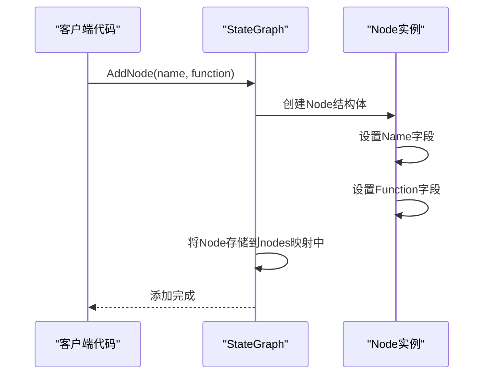
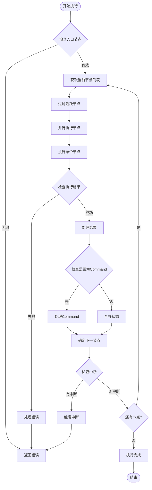
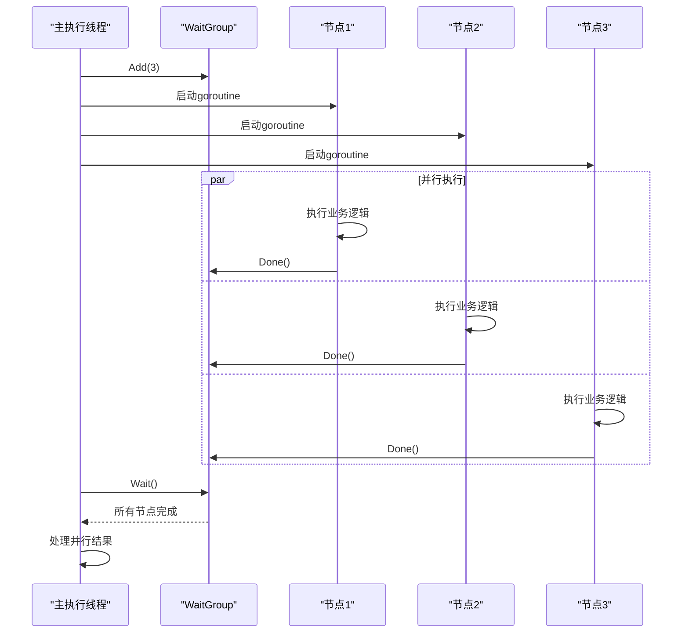
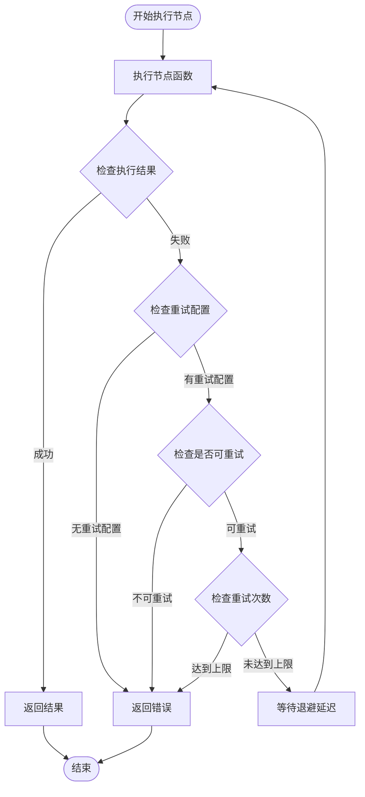
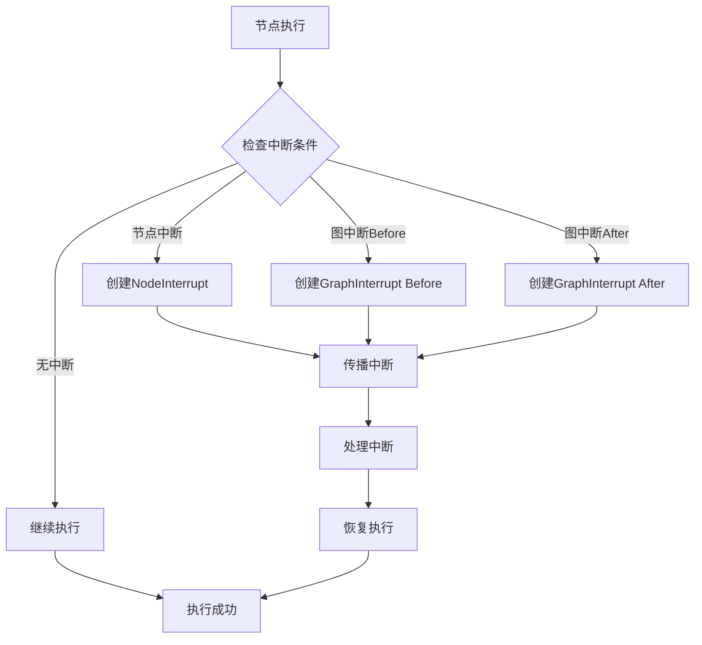
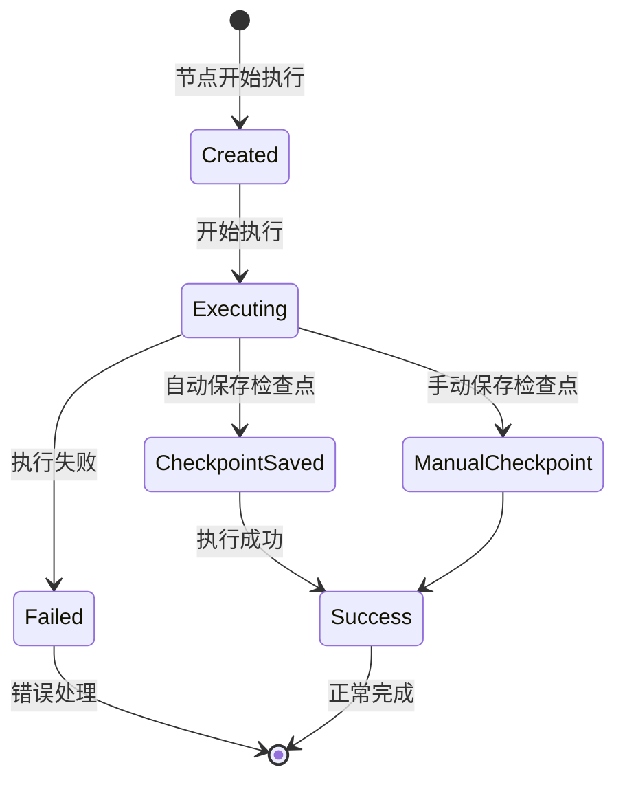
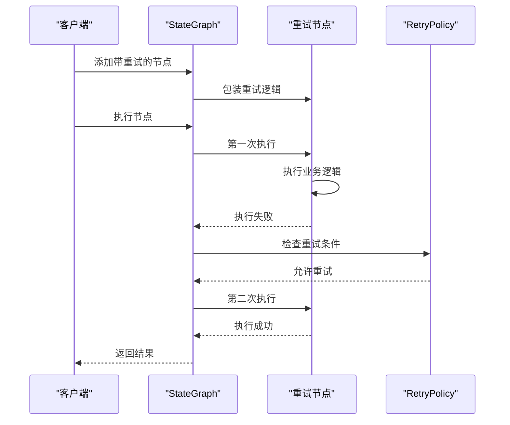

# 节点

<cite>
**本文档中引用的文件**
- [graph.go](file://graph/graph.go)
- [state_graph.go](file://graph/state_graph.go)
- [main.go](file://examples/basic_example/main.go)
- [retry.go](file://graph/retry.go)
- [interrupt_test.go](file://graph/interrupt_test.go)
- [checkpointing.go](file://graph/checkpointing.go)
- [command.go](file://graph/command.go)
- [errors.go](file://graph/errors.go)
</cite>

## 目录
1. [简介](#简介)
2. [Node 结构体详解](#node-结构体详解)
3. [节点注册与添加](#节点注册与添加)
4. [节点执行机制](#节点执行机制)
5. [并行执行环境下的节点行为](#并行执行环境下的节点行为)
6. [节点级别的重试机制](#节点级别的重试机制)
7. [错误处理与中断信号](#错误处理与中断信号)
8. [节点与检查点的交互](#节点与检查点的交互)
9. [实际应用示例](#实际应用示例)
10. [最佳实践与设计原则](#最佳实践与设计原则)

## 简介

在 langgraphgo 中，节点（Node）是构建工作流的基本执行单元。每个节点代表一个独立的功能模块，负责处理特定的业务逻辑。节点通过函数的形式承载业务逻辑，接收上下文和状态作为输入，返回更新后的状态和错误信息。

节点的设计遵循函数式编程的原则，具有以下核心特征：
- **无状态性**：节点本身不维护状态，所有状态都通过输入参数传递
- **纯函数性**：相同的输入总是产生相同的输出
- **可组合性**：多个节点可以组合成复杂的工作流
- **可扩展性**：支持重试、超时、熔断等多种增强功能

## Node 结构体详解

Node 结构体是 langgraphgo 中节点的核心数据结构，定义了节点的基本属性和行为。

```mermaid
classDiagram
class Node {
+string Name
+func(ctx Context, state interface{}) (interface{}, error) Function
+GetName() string
+GetFunction() Function
+Execute(ctx Context, state interface{}) (interface{}, error)
}
class MessageGraph {
+map[string]Node nodes
+AddNode(name string, fn Function)
+Invoke(ctx Context, state interface{}) (interface{}, error)
}
class StateGraph {
+map[string]Node nodes
+*RetryPolicy retryPolicy
+AddNode(name string, fn Function)
+executeNodeWithRetry(ctx Context, node Node, state interface{}) (interface{}, error)
}
MessageGraph --> Node : "包含"
StateGraph --> Node : "包含"
StateGraph --> RetryPolicy : "使用"
```

**图表来源**
- [graph.go](file://graph/graph.go#L52-L59)
- [state_graph.go](file://graph/state_graph.go#L11-L32)

### 核心字段说明

#### Name 字段
- **类型**: `string`
- **作用**: 作为节点的唯一标识符，在图中必须保持唯一性
- **用途**: 用于节点间的连接、路由决策和调试追踪
- **命名规范**: 建议使用描述性的名称，如 `"data_validation"`、`"email_processor"`

#### Function 字段
- **类型**: `func(ctx Context, state interface{}) (interface{}, error)`
- **作用**: 承载节点的业务逻辑，是节点的核心执行函数
- **参数**:
  - `ctx`: 上下文对象，提供取消信号和超时控制
  - `state`: 当前状态，可以是任意类型，通常为结构体或映射
- **返回值**:
  - `interface{}`: 更新后的状态
  - `error`: 执行过程中产生的错误

**节来源**
- [graph.go](file://graph/graph.go#L52-L59)

## 节点注册与添加

langgraphgo 提供了两种主要的图类型来管理节点：MessageGraph 和 StateGraph。它们都提供了添加节点的方法，但各自有不同的特性和用途。

### MessageGraph.AddNode 方法

MessageGraph 是最基础的图类型，适用于简单的消息传递模式。


**图表来源**
- [graph.go](file://graph/graph.go#L103-L109)

### StateGraph.AddNode 方法

StateGraph 提供了更丰富的功能，包括重试机制和状态管理。



**图表来源**
- [state_graph.go](file://graph/state_graph.go#L58-L64)

### 添加节点的具体实践

在 examples/basic_example/main.go 中展示了节点添加的实际应用：

**节来源**
- [main.go](file://examples/basic_example/main.go#L27-L30)

## 节点执行机制

节点的执行是通过图的编译和运行阶段完成的。在执行过程中，节点按照预定义的顺序和规则进行调用。



**图表来源**
- [graph.go](file://graph/graph.go#L175-L491)

### 执行流程详解

1. **入口验证**: 确保图的入口节点已设置
2. **节点过滤**: 移除标记为 END 的节点
3. **并行执行**: 使用 goroutine 并行执行所有活跃节点
4. **结果处理**: 处理节点返回的结果和命令
5. **状态合并**: 根据图的策略合并多个节点的状态
6. **路由决策**: 基于静态边或条件边确定下一组节点

**节来源**
- [graph.go](file://graph/graph.go#L224-L491)

## 并行执行环境下的节点行为

langgraphgo 支持节点的并行执行，这是提高工作流性能的关键特性。



**图表来源**
- [graph.go](file://graph/graph.go#L250-L316)

### 并行执行的特点

1. **独立性**: 每个节点在独立的 goroutine 中执行
2. **隔离性**: 节点间不共享状态，避免竞态条件
3. **容错性**: 单个节点的失败不会影响其他节点
4. **性能**: 充分利用多核 CPU 资源

### 注意事项

- **状态安全**: 如果状态是可变对象，需要确保线程安全
- **资源竞争**: 避免多个节点同时访问共享资源
- **错误传播**: 需要正确处理和传播节点执行错误

**节来源**
- [graph.go](file://graph/graph.go#L250-L316)

## 节点级别的重试机制

StateGraph 提供了内置的重试机制，可以在节点执行失败时自动重试。



**图表来源**
- [state_graph.go](file://graph/state_graph.go#L299-L338)

### RetryPolicy 配置

RetryPolicy 定义了重试行为的各个方面：

| 字段 | 类型 | 默认值 | 说明 |
|------|------|--------|------|
| MaxRetries | int | 1 | 最大重试次数 |
| BackoffStrategy | BackoffStrategy | FixedBackoff | 退避策略 |
| RetryableErrors | []string | nil | 可重试的错误模式 |

### 退避策略

1. **FixedBackoff**: 固定时间间隔
2. **ExponentialBackoff**: 指数退避（1s, 2s, 4s, 8s...）
3. **LinearBackoff**: 线性退避（1s, 2s, 3s, 4s...）

**节来源**
- [state_graph.go](file://graph/state_graph.go#L34-L48)
- [state_graph.go](file://graph/state_graph.go#L299-L338)

## 错误处理与中断信号

langgraphgo 提供了完善的错误处理和中断机制，确保工作流的可靠性和可控性。

### 错误类型

```mermaid
classDiagram
class Error {
<<abstract>>
}
class NodeInterrupt {
+string Node
+interface{} Value
+Error() string
}
class GraphInterrupt {
+string Node
+interface{} State
+[]string NextNodes
+interface{} InterruptValue
+Error() string
}
class StandardError {
+string Message
+Error() string
}
Error <|-- NodeInterrupt
Error <|-- GraphInterrupt
Error <|-- StandardError
```

**图表来源**
- [errors.go](file://graph/errors.go#L5-L10)
- [graph.go](file://graph/graph.go#L24-L41)

### 中断机制

#### NodeInterrupt
- **触发时机**: 节点主动请求中断
- **用途**: 用于需要外部输入或人工干预的场景
- **处理方式**: 返回 NodeInterrupt 错误，包含中断值

#### GraphInterrupt  
- **触发时机**: 图级别中断（InterruptBefore/InterruptAfter）
- **用途**: 控制整个工作流的执行流程
- **处理方式**: 返回 GraphInterrupt 错误，包含当前状态和下一节点

### 中断处理流程



**图表来源**
- [graph.go](file://graph/graph.go#L320-L341)
- [interrupt_test.go](file://graph/interrupt_test.go#L30-L63)

**节来源**
- [errors.go](file://graph/errors.go#L5-L10)
- [graph.go](file://graph/graph.go#L24-L41)
- [interrupt_test.go](file://graph/interrupt_test.go#L30-L63)

## 节点与检查点的交互

检查点机制为节点提供了状态持久化的支持，确保在故障恢复时能够从正确的状态继续执行。

### 检查点生命周期



### 检查点配置

| 配置项 | 类型 | 说明 |
|--------|------|------|
| Store | CheckpointStore | 存储后端（内存、PostgreSQL、SQLite、Redis） |
| AutoSave | bool | 是否自动保存检查点 |
| SaveInterval | time.Duration | 自动保存间隔 |
| MaxCheckpoints | int | 最大检查点数量 |

### 检查点与节点的交互

1. **自动保存**: 在节点执行完成后自动保存检查点
2. **手动保存**: 节点可以主动请求保存检查点
3. **恢复执行**: 从检查点恢复时重新执行节点
4. **状态查询**: 获取特定检查点的状态信息

**节来源**
- [checkpointing.go](file://graph/checkpointing.go#L12-L19)
- [checkpointing.go](file://graph/checkpointing.go#L188-L201)

## 实际应用示例

### 基础节点示例

在 basic_example 中展示了最基本的节点定义和使用：

**节来源**
- [main.go](file://examples/basic_example/main.go#L27-L30)

### 带重试的节点

使用 StateGraph 的重试机制：



### 带中断的节点

处理需要人工干预的场景：

**节来源**
- [interrupt_test.go](file://graph/interrupt_test.go#L12-L20)

## 最佳实践与设计原则

### 节点设计原则

1. **单一职责**: 每个节点只负责一个明确的功能
2. **幂等性**: 节点应该能够安全地重复执行
3. **无副作用**: 节点不应该修改外部状态
4. **快速执行**: 节点应该尽快完成执行

### 错误处理最佳实践

1. **明确错误分类**: 区分可重试和不可重试的错误
2. **有意义的错误信息**: 提供有助于诊断问题的错误信息
3. **适当的重试策略**: 根据错误类型选择合适的重试策略
4. **超时控制**: 为长时间运行的节点设置合理的超时

### 性能优化建议

1. **合理使用并行**: 在不影响状态安全的前提下使用并行执行
2. **避免阻塞操作**: 节点中避免使用阻塞的 I/O 操作
3. **状态优化**: 设计轻量级的状态结构
4. **资源管理**: 及时释放不需要的资源

### 可维护性考虑

1. **清晰的命名**: 使用描述性的节点名称
2. **文档化**: 为复杂节点提供详细的文档
3. **测试覆盖**: 确保节点有足够的测试覆盖率
4. **监控支持**: 在节点中添加适当的日志和指标

通过遵循这些原则和最佳实践，可以构建出健壮、高效且易于维护的节点系统，充分发挥 langgraphgo 工作流框架的优势。