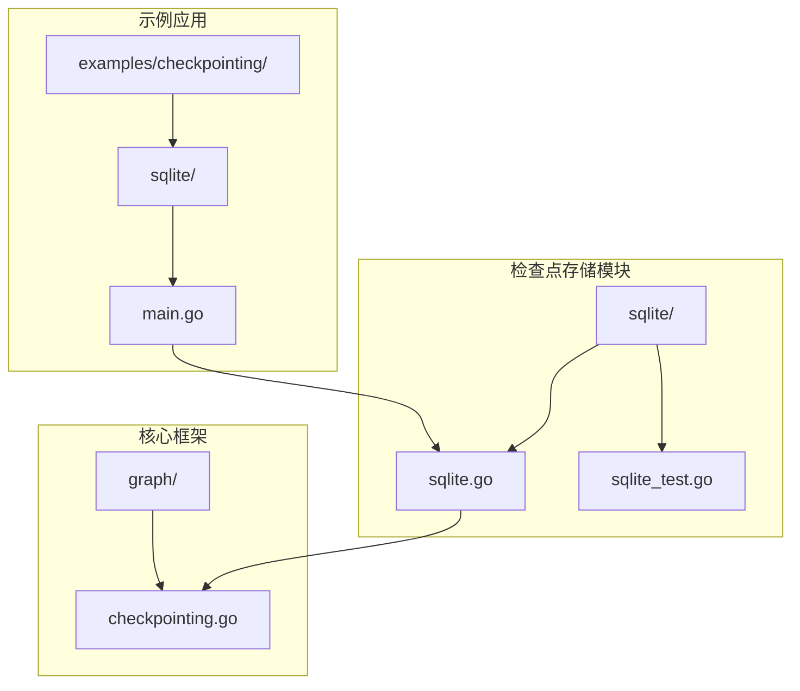
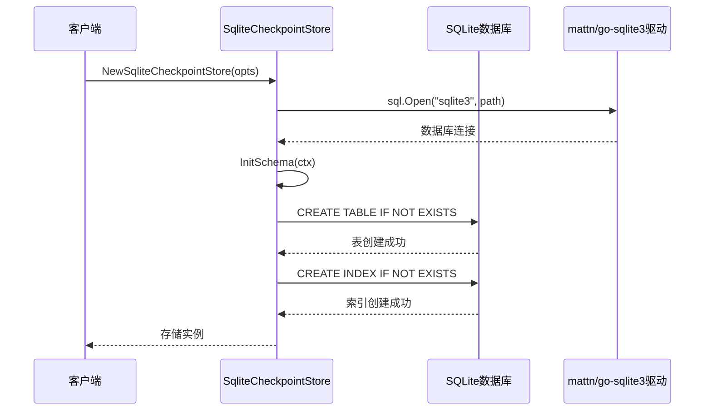
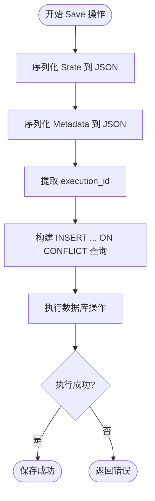
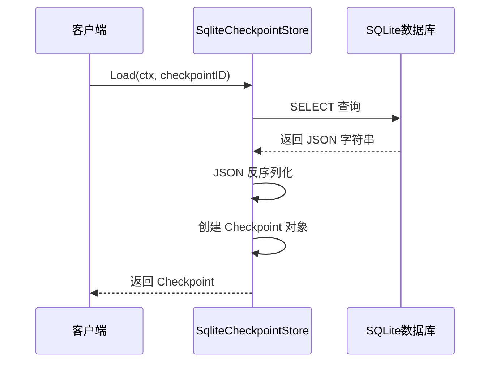
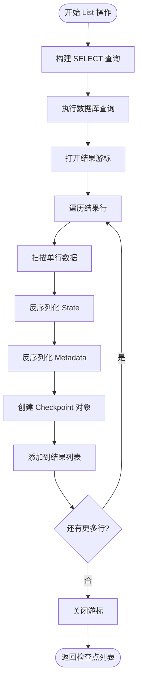

# SQLite 存储 (SqliteCheckpointStore)

<cite>
**本文档中引用的文件**
- [sqlite.go](file://checkpoint/sqlite/sqlite.go)
- [sqlite_test.go](file://checkpoint/sqlite/sqlite_test.go)
- [main.go](file://examples/checkpointing/sqlite/main.go)
- [checkpointing.go](file://graph/checkpointing.go)
- [go.mod](file://go.mod)
</cite>

## 目录
1. [简介](#简介)
2. [项目结构](#项目结构)
3. [核心组件](#核心组件)
4. [架构概览](#架构概览)
5. [详细组件分析](#详细组件分析)
6. [数据库表结构设计](#数据库表结构设计)
7. [操作流程分析](#操作流程分析)
8. [性能优化与配置](#性能优化与配置)
9. [故障排除指南](#故障排除指南)
10. [结论](#结论)

## 简介

SqliteCheckpointStore 是 LangGraphGo 框架中为轻量级应用和边缘设备提供的嵌入式数据库解决方案。它通过 `mattn/go-sqlite3` 驱动直接操作本地 SQLite 数据库文件，为需要结构化持久化但资源受限的应用场景提供了理想的替代方案。

该存储实现完全避免了独立数据库服务的部署和维护成本，同时保持了与 PostgreSQL 等关系型数据库相似的表结构设计和查询接口。通过事务机制保证数据一致性，支持完整的检查点生命周期管理。

## 项目结构



**图表来源**
- [sqlite.go](file://checkpoint/sqlite/sqlite.go#L1-L236)
- [main.go](file://examples/checkpointing/sqlite/main.go#L1-L147)

**章节来源**
- [sqlite.go](file://checkpoint/sqlite/sqlite.go#L1-L236)
- [main.go](file://examples/checkpointing/sqlite/main.go#L1-L147)

## 核心组件

### SqliteCheckpointStore 结构体

SqliteCheckpointStore 是 SQLite 检查点存储的核心实现，包含两个关键字段：

- **db**: 数据库连接指针，使用标准 `database/sql` 包管理 SQLite 连接
- **tableName**: 自定义表名，默认为 "checkpoints"，支持用户自定义表名以适应不同的应用场景

### SqliteOptions 配置结构

SqliteOptions 提供了 SQLite 存储的配置选项：
- **Path**: 数据库文件路径，支持文件系统路径或内存数据库（":memory:"）
- **TableName**: 可选的自定义表名，默认使用 "checkpoints"

**章节来源**
- [sqlite.go](file://checkpoint/sqlite/sqlite.go#L13-L23)

## 架构概览

```mermaid
classDiagram
class SqliteCheckpointStore {
-db *sql.DB
-tableName string
+NewSqliteCheckpointStore(opts SqliteOptions) *SqliteCheckpointStore
+InitSchema(ctx Context) error
+Save(ctx Context, checkpoint *Checkpoint) error
+Load(ctx Context, checkpointID string) *Checkpoint
+List(ctx Context, executionID string) []*Checkpoint
+Delete(ctx Context, checkpointID string) error
+Clear(ctx Context, executionID string) error
+Close() error
}
class CheckpointStore {
<<interface>>
+Save(ctx Context, checkpoint *Checkpoint) error
+Load(ctx Context, checkpointID string) *Checkpoint
+List(ctx Context, executionID string) []*Checkpoint
+Delete(ctx Context, checkpointID string) error
+Clear(ctx Context, executionID string) error
}
class Checkpoint {
+ID string
+NodeName string
+State interface{}
+Metadata map[string]interface{}
+Timestamp time.Time
+Version int
}
SqliteCheckpointStore ..|> CheckpointStore
SqliteCheckpointStore --> Checkpoint : "manages"
```

**图表来源**
- [sqlite.go](file://checkpoint/sqlite/sqlite.go#L13-L236)
- [checkpointing.go](file://graph/checkpointing.go#L22-L37)

## 详细组件分析

### 数据库初始化与模式创建



**图表来源**
- [sqlite.go](file://checkpoint/sqlite/sqlite.go#L25-L47)
- [sqlite.go](file://checkpoint/sqlite/sqlite.go#L50-L70)

### Save 操作的 SQL 查询逻辑

Save 操作实现了 UPSERT 功能，确保检查点的原子性更新：



**图表来源**
- [sqlite.go](file://checkpoint/sqlite/sqlite.go#L77-L121)

### Load 操作的数据反序列化



**图表来源**
- [sqlite.go](file://checkpoint/sqlite/sqlite.go#L123-L162)

**章节来源**
- [sqlite.go](file://checkpoint/sqlite/sqlite.go#L77-L236)

## 数据库表结构设计

### 表结构对比

| 字段名 | 数据类型 | 约束 | 描述 |
|--------|----------|------|------|
| id | TEXT | PRIMARY KEY | 检查点唯一标识符 |
| execution_id | TEXT | NOT NULL | 执行会话标识符，用于分组检查点 |
| node_name | TEXT | NOT NULL | 触发检查点的节点名称 |
| state | TEXT | NOT NULL | 节点状态的 JSON 序列化字符串 |
| metadata | TEXT | NULLABLE | 元数据信息的 JSON 序列化字符串 |
| timestamp | DATETIME | NOT NULL | 检查点创建时间戳 |
| version | INTEGER | NOT NULL | 版本号，支持并发控制 |

### 索引设计

- **主键索引**: 在 `id` 字段上建立主键索引，确保唯一性约束
- **执行索引**: 在 `execution_id` 字段上建立复合索引，优化按执行会话查询性能

### 与 PostgreSQL 的兼容性

SqliteCheckpointStore 的表结构设计与 PostgreSQL 实现保持高度兼容，主要差异在于：

1. **数据类型映射**: SQLite 使用动态类型系统，而 PostgreSQL 使用强类型
2. **索引语法**: SQLite 使用 `CREATE INDEX IF NOT EXISTS`，PostgreSQL 使用 `CREATE INDEX IF NOT EXISTS`
3. **参数占位符**: SQLite 使用 `?` 占位符，PostgreSQL 使用 `$1` 占位符

**章节来源**
- [sqlite.go](file://checkpoint/sqlite/sqlite.go#L52-L63)

## 操作流程分析

### List 操作的批量查询处理



**图表来源**
- [sqlite.go](file://checkpoint/sqlite/sqlite.go#L164-L215)

### Delete 和 Clear 操作的批量清理

这两个操作都使用 DELETE 语句进行批量清理：

- **Delete**: 删除单个检查点，基于 `id` 字段匹配
- **Clear**: 清理指定执行会话的所有检查点，基于 `execution_id` 字段匹配

**章节来源**
- [sqlite.go](file://checkpoint/sqlite/sqlite.go#L217-L236)

## 性能优化与配置

### 数据库文件路径配置

| 配置方式 | 示例 | 适用场景 | 性能特点 |
|----------|------|----------|----------|
| 文件路径 | "./checkpoints.db" | 生产环境 | 持久化存储，适合长期运行 |
| 内存数据库 | ":memory:" | 测试环境 | 无磁盘 I/O，极高性能 |
| 临时文件 | "file::memory:?cache=shared" | 临时测试 | 支持多连接共享内存 |

### 并发访问限制

SQLite 的并发访问特性：

1. **读写锁机制**: 支持多个并发读取，但写入时会阻塞其他写入操作
2. **WAL 模式**: 启用 WAL 模式可以提高并发性能
3. **连接池限制**: 建议限制最大连接数以避免资源耗尽

### 性能调优建议

1. **启用 WAL 模式**: 在数据库连接后执行 `PRAGMA journal_mode=WAL;`
2. **设置同步模式**: 根据数据重要性调整 `PRAGMA synchronous=NORMAL;`
3. **索引优化**: 确保在 `execution_id` 字段上有适当的索引
4. **批量操作**: 对于大量检查点操作，考虑批量处理

### 内存使用优化

对于资源受限的边缘设备：

1. **定期清理**: 实施检查点清理策略，限制最大数量
2. **压缩存储**: 考虑对大型状态进行压缩存储
3. **懒加载**: 实现检查点的延迟加载机制

**章节来源**
- [main.go](file://examples/checkpointing/sqlite/main.go#L21-L38)
- [sqlite_test.go](file://checkpoint/sqlite/sqlite_test.go#L13-L16)

## 故障排除指南

### 常见错误及解决方案

| 错误类型 | 可能原因 | 解决方案 |
|----------|----------|----------|
| 数据库连接失败 | 文件权限不足 | 检查数据库文件权限，确保可读写 |
| 表创建失败 | 路径不存在 | 确保数据库目录存在，必要时自动创建 |
| 查询超时 | 数据库锁定 | 检查是否有长时间运行的事务 |
| 内存不足 | 大量检查点堆积 | 实施检查点清理策略 |

### 调试技巧

1. **启用日志**: 设置适当的日志级别跟踪数据库操作
2. **监控性能**: 使用 SQLite 的内置统计功能监控查询性能
3. **备份验证**: 定期验证数据库文件的完整性

### 最佳实践

1. **优雅关闭**: 确保在程序退出时正确关闭数据库连接
2. **错误处理**: 实施完善的错误处理和重试机制
3. **版本兼容**: 注意 SQLite 版本兼容性和功能差异

**章节来源**
- [sqlite.go](file://checkpoint/sqlite/sqlite.go#L25-L47)
- [sqlite_test.go](file://checkpoint/sqlite/sqlite_test.go#L12-L83)

## 结论

SqliteCheckpointStore 为 LangGraphGo 框架提供了一个轻量级、高性能的检查点存储解决方案。它通过以下特性满足了资源受限但需要结构化持久化的应用场景需求：

1. **嵌入式设计**: 无需独立数据库服务，简化部署和运维
2. **兼容性强**: 与 PostgreSQL 实现保持表结构和接口兼容
3. **事务保证**: 通过 SQLite 的 ACID 特性保证数据一致性
4. **灵活配置**: 支持自定义表名和数据库路径配置
5. **性能优化**: 针对不同使用场景提供多种配置选项

该实现特别适合以下应用场景：
- 边缘计算设备
- 移动应用程序
- 微服务架构中的本地缓存
- 开发和测试环境
- 小规模生产部署

通过合理的配置和优化，SqliteCheckpointStore 能够在保持高性能的同时提供可靠的持久化能力，是 LangGraphGo 框架中不可或缺的存储组件。