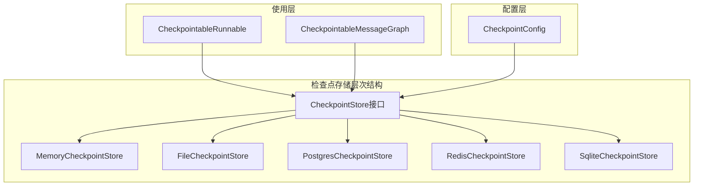
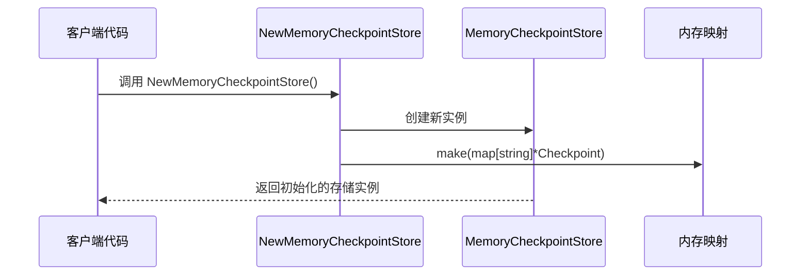
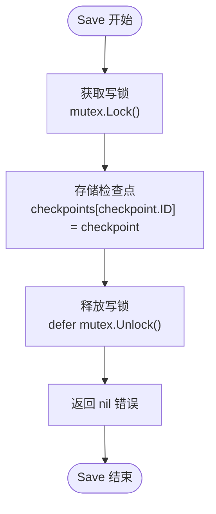
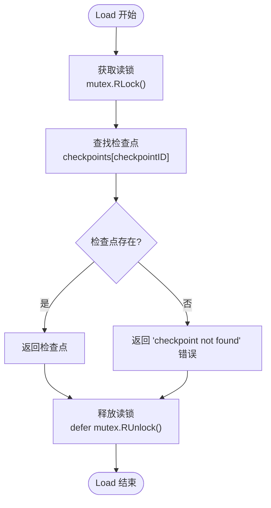
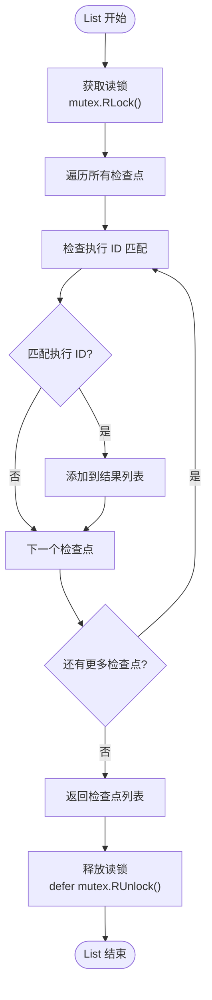
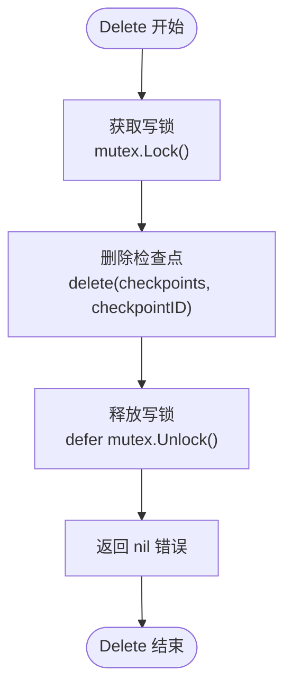
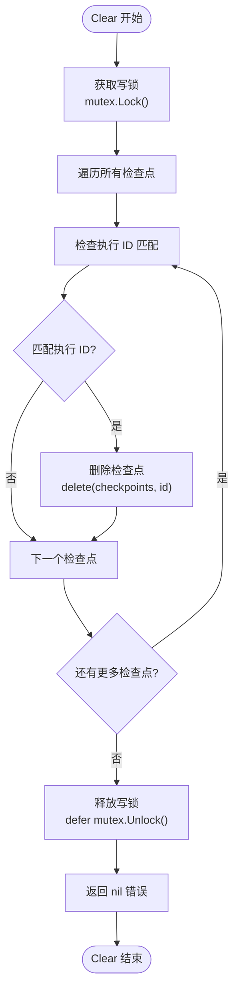
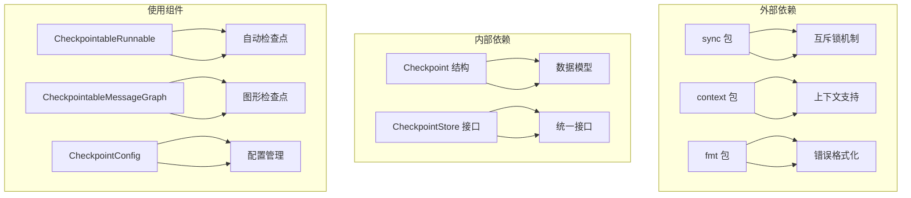
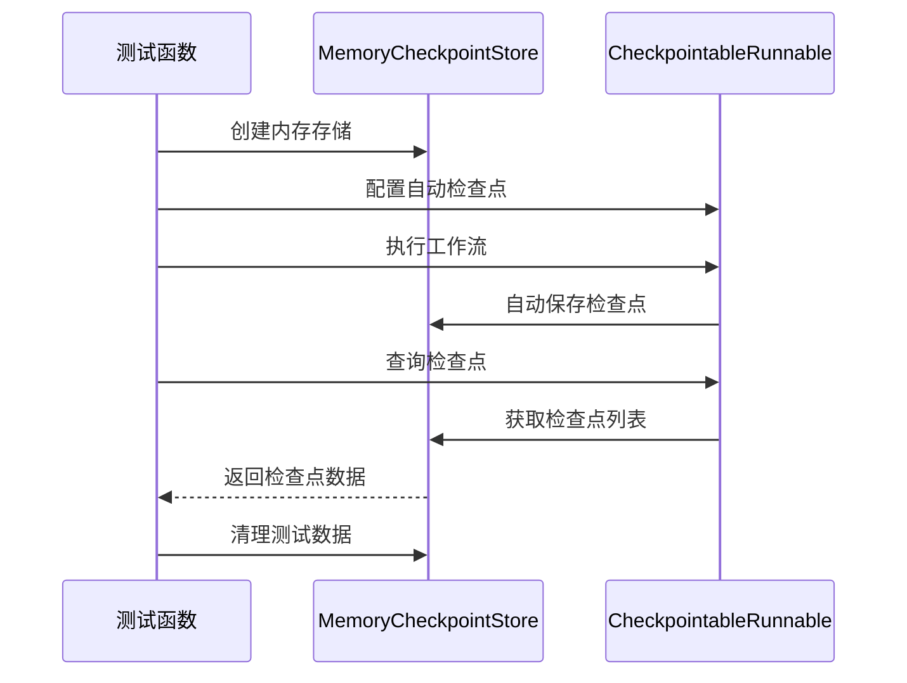

# 内存存储 (MemoryCheckpointStore)

<cite>
**本文档中引用的文件**
- [checkpointing.go](file://graph/checkpointing.go)
- [checkpointing_test.go](file://graph/checkpointing_test.go)
- [main.go](file://examples\checkpointing\main.go)
- [main.go](file://examples\basic_example\main.go)
</cite>

## 目录
1. [简介](#简介)
2. [项目结构](#项目结构)
3. [核心组件](#核心组件)
4. [架构概览](#架构概览)
5. [详细组件分析](#详细组件分析)
6. [依赖关系分析](#依赖关系分析)
7. [性能考虑](#性能考虑)
8. [故障排除指南](#故障排除指南)
9. [结论](#结论)

## 简介

MemoryCheckpointStore 是 LangGraphGo 框架中的一个内存检查点存储实现，专门设计用于开发测试和无持久化需求的场景。它使用并发安全的内存映射（sync.Map）来临时存储检查点数据，提供了极低的读写延迟，但需要注意的是，进程终止后所有数据都会丢失。

该存储实现遵循统一的 CheckpointStore 接口，确保与其他存储实现（如 PostgreSQL、Redis、SQLite）的一致性设计，便于在不同环境中切换存储后端。

## 项目结构

MemoryCheckpointStore 的实现位于 `graph/checkpointing.go` 文件中，与整个检查点系统的核心功能紧密集成：



**图表来源**
- [checkpointing.go](file://graph/checkpointing.go#L22-L37)
- [checkpointing.go](file://graph/checkpointing.go#L40-L44)

**章节来源**
- [checkpointing.go](file://graph/checkpointing.go#L1-L560)

## 核心组件

MemoryCheckpointStore 的核心组件包括：

### 数据结构
- **MemoryCheckpointStore 结构体**：包含检查点映射和互斥锁
- **Checkpoint 结构体**：表示单个检查点的所有信息
- **CheckpointConfig 配置**：控制检查点行为的配置选项

### 并发控制
- 使用 `sync.RWMutex` 实现读写并发控制
- 支持多个读取者同时访问或单个写入者独占访问

### 接口实现
- 完全实现了 CheckpointStore 接口的所有方法
- 提供 Save、Load、List、Delete、Clear 操作

**章节来源**
- [checkpointing.go](file://graph/checkpointing.go#L40-L44)
- [checkpointing.go](file://graph/checkpointing.go#L12-L20)

## 架构概览

MemoryCheckpointStore 采用简洁的内存存储架构，通过 Go 的内置 map 和 sync 包实现并发安全的数据存储：

```mermaid
classDiagram
class MemoryCheckpointStore {
+map[string]*Checkpoint checkpoints
+sync.RWMutex mutex
+NewMemoryCheckpointStore() *MemoryCheckpointStore
+Save(ctx, checkpoint) error
+Load(ctx, checkpointID) *Checkpoint, error
+List(ctx, executionID) []*Checkpoint, error
+Delete(ctx, checkpointID) error
+Clear(ctx, executionID) error
}
class Checkpoint {
+string ID
+string NodeName
+interface{} State
+map[string]interface{} Metadata
+time.Time Timestamp
+int Version
}
class CheckpointStore {
<<interface>>
+Save(ctx, checkpoint) error
+Load(ctx, checkpointID) *Checkpoint, error
+List(ctx, executionID) []*Checkpoint, error
+Delete(ctx, checkpointID) error
+Clear(ctx, executionID) error
}
MemoryCheckpointStore ..|> CheckpointStore
MemoryCheckpointStore --> Checkpoint : stores
```

**图表来源**
- [checkpointing.go](file://graph/checkpointing.go#L40-L44)
- [checkpointing.go](file://graph/checkpointing.go#L12-L20)
- [checkpointing.go](file://graph/checkpointing.go#L22-L37)

## 详细组件分析

### 初始化和创建

MemoryCheckpointStore 通过工厂函数 `NewMemoryCheckpointStore()` 创建实例：



**图表来源**
- [checkpointing.go](file://graph/checkpointing.go#L46-L50)

### Save 操作实现

Save 操作负责将检查点保存到内存存储中：



**图表来源**
- [checkpointing.go](file://graph/checkpointing.go#L53-L59)

### Load 操作实现

Load 操作从内存中检索指定 ID 的检查点：



**图表来源**
- [checkpointing.go](file://graph/checkpointing.go#L62-L72)

### List 操作实现

List 操作返回特定执行 ID 的所有检查点：



**图表来源**
- [checkpointing.go](file://graph/checkpointing.go#L75-L87)

### Delete 操作实现

Delete 操作移除指定 ID 的检查点：



**图表来源**
- [checkpointing.go](file://graph/checkpointing.go#L90-L96)

### Clear 操作实现

Clear 操作移除特定执行 ID 的所有检查点：



**图表来源**
- [checkpointing.go](file://graph/checkpointing.go#L99-L110)

**章节来源**
- [checkpointing.go](file://graph/checkpointing.go#L53-L110)

## 依赖关系分析

MemoryCheckpointStore 与其他组件的依赖关系：



**图表来源**
- [checkpointing.go](file://graph/checkpointing.go#L1-L10)
- [checkpointing.go](file://graph/checkpointing.go#L22-L37)

**章节来源**
- [checkpointing.go](file://graph/checkpointing.go#L1-L10)
- [checkpointing.go](file://graph/checkpointing.go#L22-L37)

## 性能考虑

### 优势特性

1. **极低延迟**：由于数据完全存储在内存中，读写操作几乎无延迟
2. **高并发支持**：使用读写锁实现高效的并发访问控制
3. **简单高效**：无需外部依赖，部署简单

### 性能特征

| 操作类型 | 延迟特征 | 并发支持 | 内存使用 |
|---------|---------|---------|---------|
| Save | O(1) 常数时间 | 写锁保护 | 线性增长 |
| Load | O(1) 常数时间 | 读锁保护 | 固定开销 |
| List | O(n) 线性时间 | 读锁保护 | 线性增长 |
| Delete | O(1) 常数时间 | 写锁保护 | 线性减少 |
| Clear | O(n) 线性时间 | 写锁保护 | 线性减少 |

### 限制因素

1. **数据持久性**：进程重启后数据完全丢失
2. **内存限制**：受系统内存容量限制
3. **单机部署**：无法在多节点环境中共享状态

## 故障排除指南

### 常见问题及解决方案

#### 1. 检查点未找到错误
**症状**：调用 Load 或其他操作时返回 "checkpoint not found" 错误
**原因**：检查点可能已被删除或不存在
**解决方案**：
- 确认检查点是否已正确保存
- 检查执行 ID 是否匹配
- 验证检查点 ID 是否正确

#### 2. 内存泄漏问题
**症状**：长时间运行后内存使用持续增长
**原因**：检查点数量过多且未及时清理
**解决方案**：
- 设置合理的 MaxCheckpoints 限制
- 定期调用 Clear 方法清理过期检查点
- 监控内存使用情况

#### 3. 并发访问冲突
**症状**：出现竞态条件或数据不一致
**原因**：多个 goroutine 同时访问存储
**解决方案**：
- 确保正确使用 CheckpointableRunnable 的自动检查点功能
- 避免直接对存储进行并发操作

**章节来源**
- [checkpointing_test.go](file://graph/checkpointing_test.go#L60-L74)
- [checkpointing_test.go](file://graph/checkpointing_test.go#L133-L166)

## 最佳实践

### 单元测试中的使用

MemoryCheckpointStore 在单元测试中表现出色：



**图表来源**
- [checkpointing_test.go](file://graph/checkpointing_test.go#L18-L58)
- [main.go](file://examples\checkpointing\main.go#L22-L27)

### 生产环境注意事项

虽然 MemoryCheckpointStore 不适用于生产环境，但在以下场景中可以作为开发和测试工具：

1. **快速原型开发**：验证检查点逻辑而不依赖外部存储
2. **单元测试**：提供快速、可靠的测试环境
3. **本地开发**：简化开发流程，无需配置数据库
4. **性能测试**：评估应用性能而不受存储瓶颈影响

### 迁移到生产环境

当需要迁移到生产环境时，建议的存储选择：

1. **PostgreSQL**：适合需要强一致性和复杂查询的应用
2. **Redis**：适合需要高性能和缓存特性的应用
3. **SQLite**：适合轻量级和嵌入式应用
4. **文件存储**：适合简单的文件系统部署

**章节来源**
- [main.go](file://examples\checkpointing\main.go#L18-L27)
- [main.go](file://examples\basic_example\main.go#L87-L91)

## 结论

MemoryCheckpointStore 是 LangGraphGo 框架中一个精心设计的内存存储实现，具有以下特点：

### 主要优势
- **简单易用**：API 设计简洁，易于理解和使用
- **高性能**：内存操作带来极低的延迟和高吞吐量
- **并发安全**：内置读写锁机制确保线程安全
- **接口一致**：与所有其他存储实现保持接口兼容

### 适用场景
- 开发和测试环境
- 单次执行的工作流
- 对数据持久性要求不高的场景
- 快速原型开发

### 限制和替代方案
由于缺乏持久化能力，MemoryCheckpointStore 不适用于生产环境。对于生产部署，应考虑使用 PostgreSQL、Redis 或 SQLite 等持久化存储解决方案。

通过理解 MemoryCheckpointStore 的实现原理和使用场景，开发者可以更好地利用 LangGraphGo 框架的检查点功能，在不同的开发阶段选择合适的存储策略。