# 持久化检查点

<cite>
**本文档中引用的文件**
- [checkpointing.go](file://graph/checkpointing.go)
- [store.go](file://store/checkpoint.go)
- [memory/doc.go](file://store/memory/doc.go)
- [file/doc.go](file://store/file/doc.go)
- [doc.go](file://store/doc.go)
- [main.go](file://examples/checkpointing/main.go)
- [postgres/main.go](file://examples/checkpointing/postgres/main.go)
- [redis/main.go](file://examples/checkpointing/redis/main.go)
- [sqlite/main.go](file://examples/checkpointing/sqlite/main.go)
- [README.md](file://examples/checkpointing/README.md)
- [checkpointing_test.go](file://graph/checkpointing_test.go)
- [time_travel/README_CN.md](file://examples/time_travel/README_CN.md)
</cite>

## 更新摘要
**已做更改**
- 更新了检查点存储后端的包路径，从 `checkpoint` 包重构至 `store` 包
- 添加了 `NewFileCheckpointStore` 函数以支持文件存储
- 更新了所有相关引用和接口定义
- 修正了 CheckpointStore 接口的文档说明

## 目录
1. [简介](#简介)
2. [检查点核心概念](#检查点核心概念)
3. [Checkpoint 结构体详解](#checkpoint-结构体详解)
4. [CheckpointStore 接口契约](#checkpointstore-接口契约)
5. [检查点存储后端](#检查点存储后端)
6. [CheckpointableRunnable 和 CheckpointListener](#checkpointablerunnable-和-checkpointlistener)
7. [配置和使用](#配置和使用)
8. [应用场景](#应用场景)
9. [最佳实践](#最佳实践)
10. [总结](#总结)

## 简介

持久化检查点（Checkpointing）是 LangGraphGo 框架中的核心功能，为复杂、长时间运行的应用程序提供了强大的状态管理和容错能力。检查点系统允许应用程序在执行过程中自动保存状态快照，从而实现故障恢复、人机交互和时间旅行等高级功能。

检查点系统解决了以下关键问题：
- **容错性**：当应用程序崩溃时，可以从最近的检查点恢复
- **人机协作**：支持暂停执行等待人工输入或决策
- **状态管理**：提供完整的执行历史记录和状态回溯能力
- **分布式一致性**：确保多实例环境下的状态同步

## 检查点核心概念

### 执行线程（Execution Thread）

每个检查点都与一个唯一的执行线程相关联，用于隔离不同的执行上下文。执行线程 ID 通常由框架自动生成，但也可以手动指定。

### 检查点标识符

每个检查点都有一个全局唯一的标识符，格式为 `checkpoint_<timestamp>`，其中 timestamp 是纳秒级的时间戳。

### 版本控制

检查点系统采用版本控制机制，每次状态更新都会递增版本号，支持状态历史追踪和并发控制。

## Checkpoint 结构体详解

检查点结构体是整个检查点系统的核心数据结构，包含了执行过程中的完整状态信息。

```mermaid
classDiagram
class Checkpoint {
+string ID
+string NodeName
+interface{} State
+map[string]interface{} Metadata
+time.Time Timestamp
+int Version
+MarshalJSON() []byte
+UnmarshalJSON([]byte) error
}
class CheckpointConfig {
+CheckpointStore Store
+bool AutoSave
+time.Duration SaveInterval
+int MaxCheckpoints
}
class CheckpointStore {
<<interface>>
+Save(ctx, checkpoint) error
+Load(ctx, checkpointID) *Checkpoint
+List(ctx, executionID) []*Checkpoint
+Delete(ctx, checkpointID) error
+Clear(ctx, executionID) error
}
Checkpoint --> CheckpointConfig : "配置"
CheckpointConfig --> CheckpointStore : "使用"
```

**图表来源**
- [store.go](file://store/checkpoint.go#L8-L15)
- [checkpointing.go](file://graph/checkpointing.go#L31-L43)

### 字段详解

#### ID（字符串）
- **类型**：`string`
- **含义**：检查点的唯一标识符
- **生成方式**：基于时间戳的自动生成
- **用途**：作为检查点的主键，在存储后端中唯一标识每个检查点

#### NodeName（字符串）
- **类型**：`string`
- **含义**：触发检查点保存的节点名称
- **用途**：记录状态快照是在哪个处理节点创建的，有助于调试和状态追踪

#### State（任意类型）
- **类型**：`interface{}`
- **含义**：当前的执行状态
- **序列化**：通过 JSON 编码存储
- **用途**：保存完整的状态信息，支持任意复杂的数据结构

#### Metadata（元数据映射）
- **类型**：`map[string]interface{}`
- **含义**：附加的元数据信息
- **常用键**：
  - `"execution_id"`：执行线程标识符
  - `"event"`：事件类型标记
  - `"source"`：状态来源标识
  - `"updated_by"`：最后更新节点

#### Timestamp（时间戳）
- **类型**：`time.Time`
- **含义**：检查点创建的时间
- **精度**：纳秒级
- **用途**：排序和时间范围查询

#### Version（版本号）
- **类型**：`int`
- **含义**：状态版本号
- **初始值**：1
- **递增规则**：每次状态更新时递增
- **用途**：支持状态历史追踪和并发控制

**章节来源**
- [store.go](file://store/checkpoint.go#L8-L15)

## CheckpointStore 接口契约

CheckpointStore 接口定义了检查点存储的标准契约，所有存储后端都必须实现这些方法。

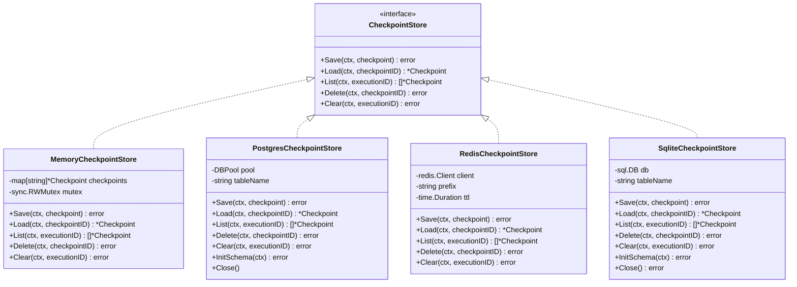

**图表来源**
- [store.go](file://store/checkpoint.go#L18-L34)
- [postgres.go](file://store/postgres/postgres.go#L22-L25)
- [redis.go](file://store/redis/redis.go#L13-L18)
- [sqlite.go](file://store/sqlite/sqlite.go#L13-L17)

### 核心方法职责

#### Save 方法
- **职责**：保存检查点到存储后端
- **参数**：上下文和检查点对象
- **错误处理**：返回保存失败的错误信息
- **幂等性**：支持重复保存同一检查点

#### Load 方法
- **职责**：根据检查点 ID 加载特定的检查点
- **参数**：上下文和检查点 ID
- **返回值**：检查点对象或加载失败的错误
- **错误处理**：当检查点不存在时返回特定错误

#### List 方法
- **职责**：列出指定执行线程的所有检查点
- **参数**：上下文和执行线程 ID
- **返回值**：检查点列表，按时间顺序排列
- **用途**：支持状态历史查看和时间旅行

#### Delete 方法
- **职责**：删除指定的检查点
- **参数**：上下文和检查点 ID
- **副作用**：清理相关的索引和关联数据
- **错误处理**：返回删除失败的错误

#### Clear 方法
- **职责**：删除指定执行线程的所有检查点
- **参数**：上下文和执行线程 ID
- **批量操作**：高效处理大量检查点
- **完整性**：确保所有相关数据都被清理

**章节来源**
- [store.go](file://store/checkpoint.go#L18-L34)

## 检查点存储后端

LangGraphGo 提供了多种存储后端，满足不同场景的需求。

### 内存存储（MemoryCheckpointStore）

内存存储是最简单的实现，适用于测试和开发环境。

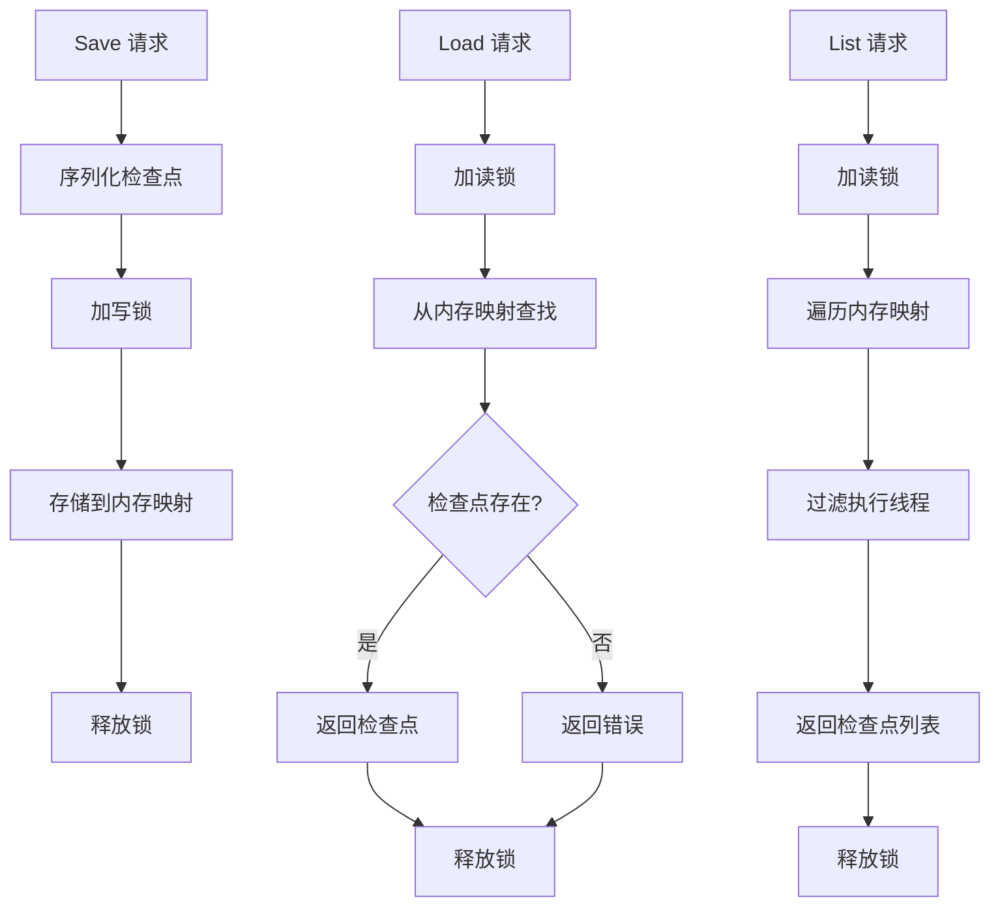

**图表来源**
- [memory/doc.go](file://store/memory/doc.go)
- [checkpointing.go](file://graph/checkpointing.go#L20-L23)

**特点**：
- **性能**：最快的访问速度
- **持久性**：非持久化存储，重启丢失
- **适用场景**：单元测试、快速原型开发

### PostgreSQL 存储（PostgresCheckpointStore）

关系型数据库存储，提供生产级别的可靠性和查询能力。

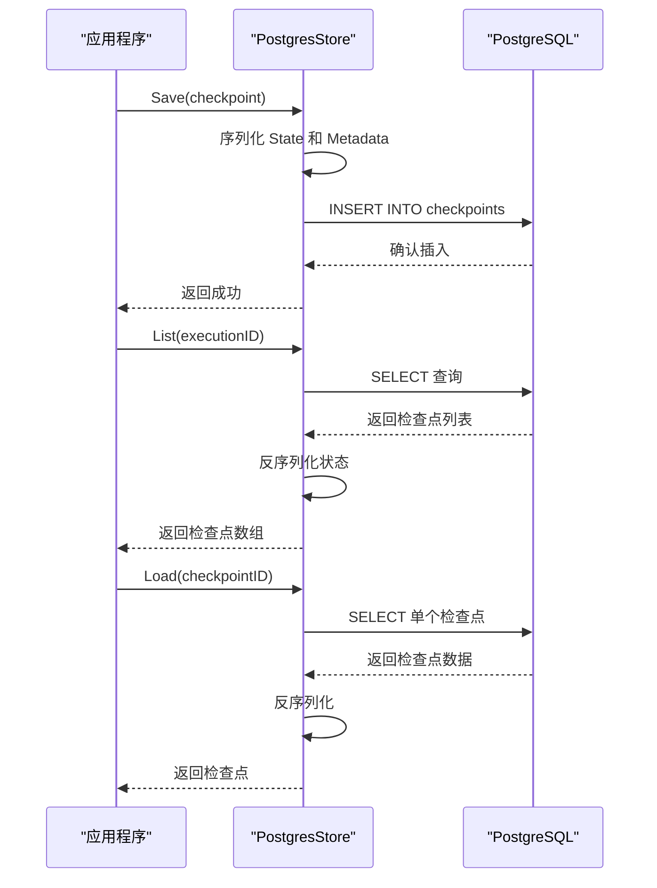

**图表来源**
- [postgres.go](file://store/postgres/postgres.go#L91-L135)
- [postgres.go](file://store/postgres/postgres.go#L137-L176)

**特点**：
- **可靠性**：ACID 事务保证
- **查询能力**：支持复杂的查询和分析
- **扩展性**：支持大规模部署
- **索引优化**：执行线程 ID 索引加速查询

### Redis 存储（RedisCheckpointStore）

高性能缓存存储，适合需要快速访问的场景。

**特点**：
- **性能**：极低延迟的键值访问
- **过期策略**：可配置的 TTL 自动清理
- **内存效率**：压缩存储减少内存占用
- **网络优化**：管道操作批量处理

### SQLite 存储（SqliteCheckpointStore）

轻量级文件数据库，适合单机部署。

**特点**：
- **简单部署**：无需独立数据库服务
- **文件存储**：本地文件系统持久化
- **跨平台**：支持所有主流操作系统
- **兼容性**：标准 SQL 接口

### 文件存储（FileCheckpointStore）

基于文件系统的检查点存储，提供持久化能力。

**特点**：
- **持久性**：检查点数据保存在磁盘文件中
- **简单性**：无需数据库服务，直接文件读写
- **可移植性**：检查点文件可轻松备份和迁移
- **适用场景**：单机应用、边缘计算、资源受限环境

**章节来源**
- [file/doc.go](file://store/file/doc.go)
- [checkpointing.go](file://graph/checkpointing.go#L25-L28)
- [postgres.go](file://store/postgres/postgres.go#L22-L25)
- [redis.go](file://store/redis/redis.go#L13-L18)
- [sqlite.go](file://store/sqlite/sqlite.go#L13-L17)

## CheckpointableRunnable 和 CheckpointListener

这两个组件协同工作，实现了自动化的检查点管理。

### CheckpointableRunnable

CheckpointableRunnable 是核心的执行器，包装了可监听的消息图并添加了检查点功能。

```mermaid
classDiagram
class CheckpointableRunnable {
-ListenableRunnable runnable
-CheckpointConfig config
-string executionID
+Invoke(ctx, initialState) interface{}
+InvokeWithConfig(ctx, initialState, config) interface{}
+SaveCheckpoint(ctx, nodeName, state) error
+LoadCheckpoint(ctx, checkpointID) *Checkpoint
+ListCheckpoints(ctx) []*Checkpoint
+ResumeFromCheckpoint(ctx, checkpointID) interface{}
+ClearCheckpoints(ctx) error
+GetState(ctx, config) *StateSnapshot
+UpdateState(ctx, config, values, asNode) *Config
}
class CheckpointListener {
-CheckpointStore store
-string executionID
-bool autoSave
+OnGraphStep(ctx, stepNode, state)
}
class ListenableRunnable {
+Invoke(ctx, initialState) interface{}
+Compile() *CompiledRunnable
}
CheckpointableRunnable --> ListenableRunnable : "包装"
CheckpointableRunnable --> CheckpointListener : "使用"
CheckpointListener --> CheckpointStore : "保存检查点"
```

**图表来源**
- [checkpointing.go](file://graph/checkpointing.go#L56-L69)
- [checkpointing.go](file://graph/checkpointing.go#L158-L165)

### CheckpointListener

CheckpointListener 是回调处理器，在执行过程中自动创建检查点。

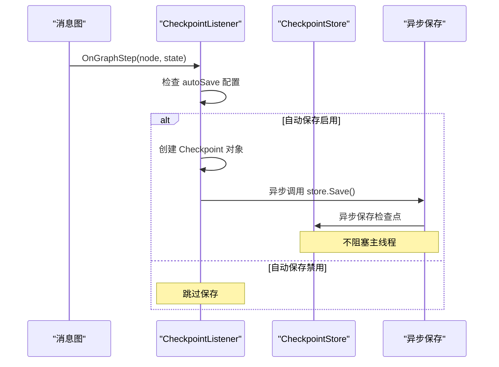

**图表来源**
- [checkpointing.go](file://graph/checkpointing.go#L158-L203)

### 协同工作机制

1. **初始化阶段**：创建 CheckpointableRunnable 并设置配置
2. **执行阶段**：每执行一个节点，CheckpointListener 自动保存检查点
3. **手动干预**：支持手动保存、加载和恢复检查点
4. **状态管理**：提供状态查询和更新功能

**章节来源**
- [checkpointing.go](file://graph/checkpointing.go#L56-L203)

## 配置和使用

### 基础配置

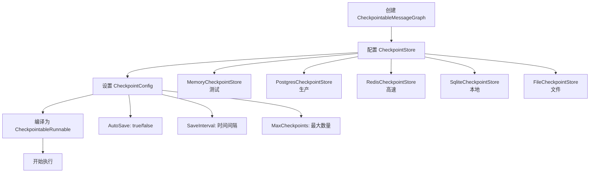

**图表来源**
- [main.go](file://examples/checkpointing/main.go#L21-L27)
- [checkpointing.go](file://graph/checkpointing.go#L31-L43)

### 高级功能

#### 手动检查点管理

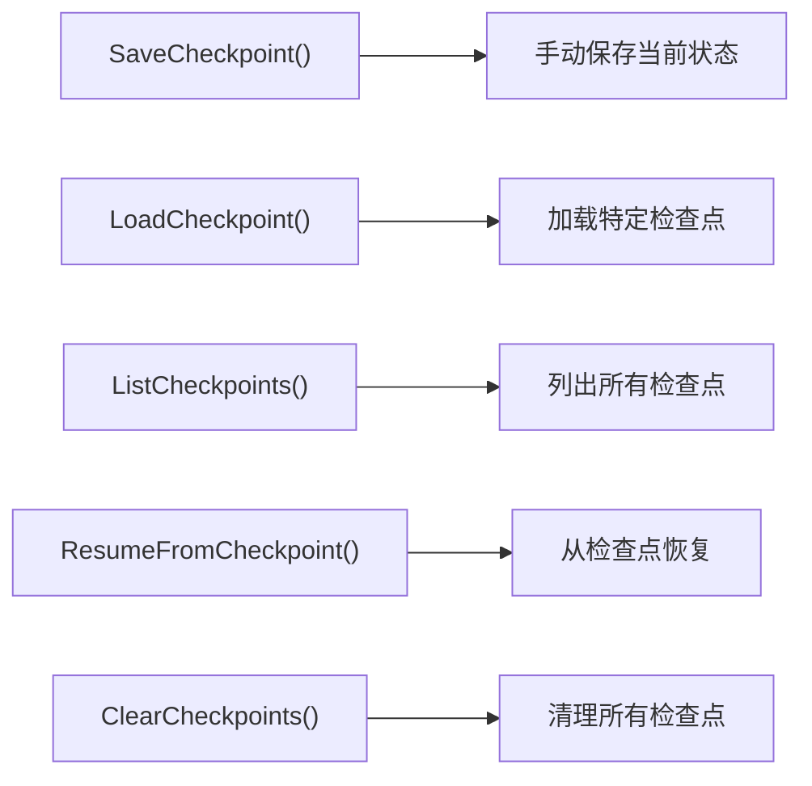

**图表来源**
- [checkpointing.go](file://graph/checkpointing.go#L104-L155)

#### 状态快照和更新

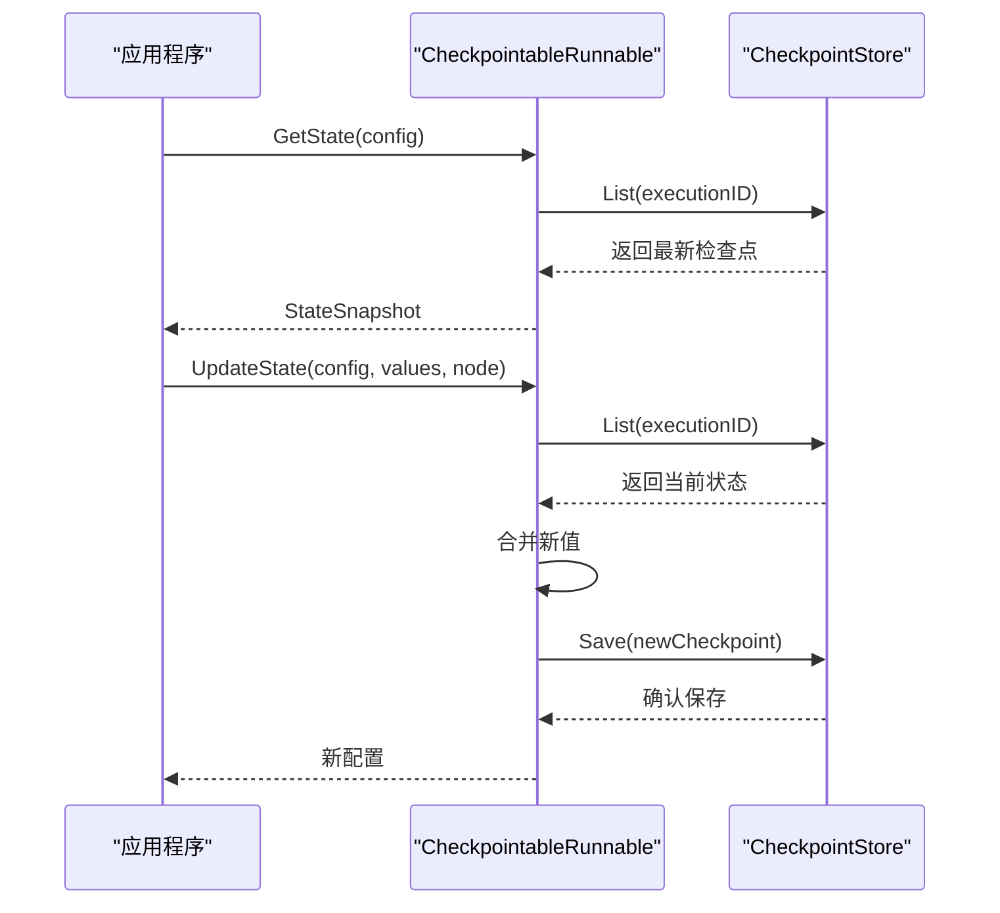

**图表来源**
- [checkpointing.go](file://graph/checkpointing.go#L270-L427)

**章节来源**
- [main.go](file://examples/checkpointing/main.go#L21-L27)
- [checkpointing.go](file://graph/checkpointing.go#L31-L43)
- [checkpointing.go](file://graph/checkpointing.go#L104-L155)

## 应用场景

### 长时间运行的任务

对于需要数小时甚至数天才能完成的任务，检查点系统提供了重要的容错能力。

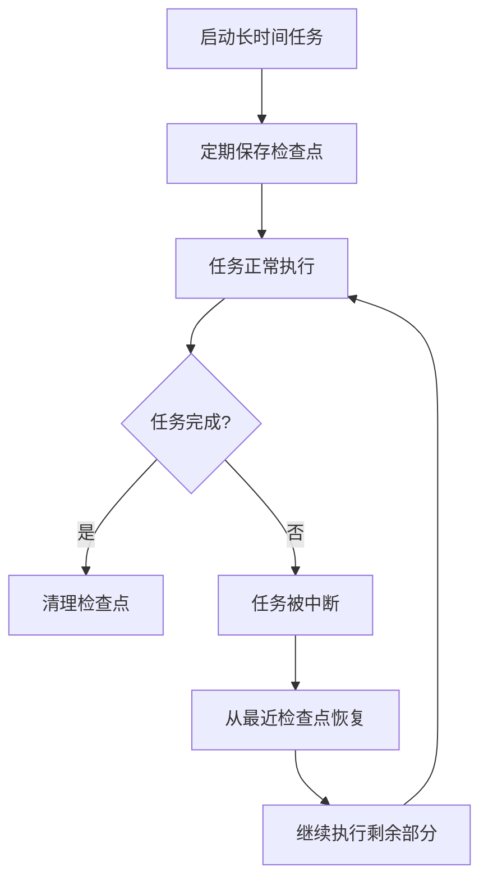

**优势**：
- **断点续传**：避免重新开始耗时任务
- **资源利用**：最大化计算资源利用率
- **可靠性**：减少因意外中断导致的损失

### 人机协作（HITL）

检查点系统支持复杂的交互式工作流程。

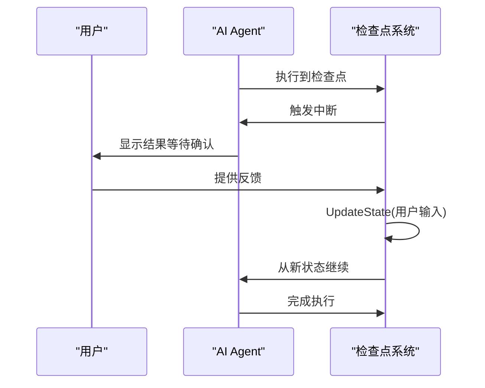

**应用场景**：
- **内容审核**：人工审核生成的内容
- **决策支持**：专家参与关键决策过程
- **质量控制**：人工验证自动化结果

### 时间旅行（Time Travel）

检查点系统支持状态的历史追溯和修改。

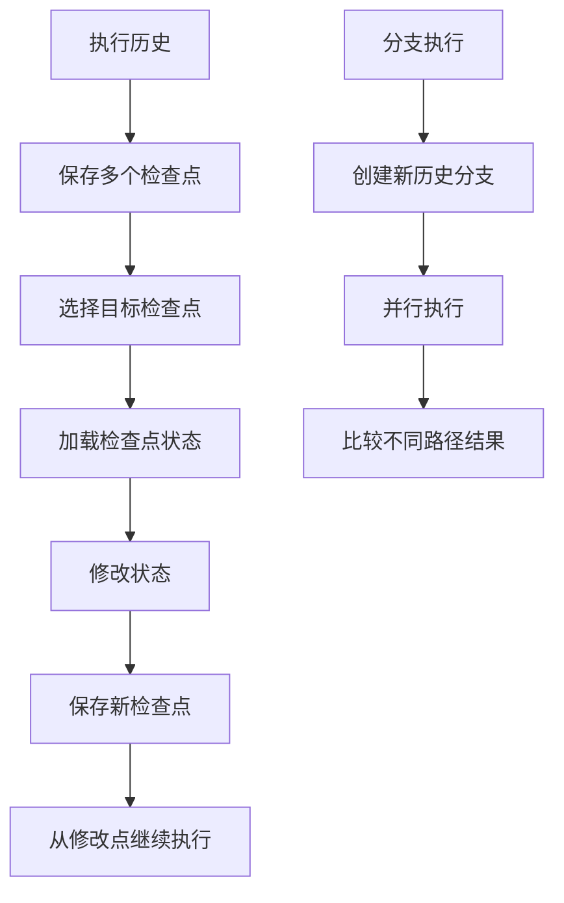

**用途**：
- **调试**：重现和分析执行问题
- **假设分析**：探索"如果...会怎样？"的问题
- **实验设计**：对比不同策略的效果

**章节来源**
- [time_travel/README_CN.md](file://examples/time_travel/README_CN.md#L1-L25)

## 最佳实践

### 存储后端选择指南

| 场景 | 推荐存储 | 原因 |
|------|----------|------|
| 开发测试 | MemoryCheckpointStore | 快速、简单 |
| 生产部署 | PostgresCheckpointStore | 可靠、可扩展 |
| 高性能需求 | RedisCheckpointStore | 低延迟、高吞吐 |
| 单机部署 | SqliteCheckpointStore | 无外部依赖 |
| 文件持久化 | FileCheckpointStore | 简单、可移植 |

### 性能优化建议

1. **合理配置自动保存**：
   ```go
   config := graph.CheckpointConfig{
       AutoSave:       true,
       SaveInterval:   30 * time.Second,  // 根据任务特性调整
       MaxCheckpoints: 10,                // 控制存储空间
   }
   ```

2. **批量操作优化**：
   - 使用 `List()` 获取多个检查点
   - 批量删除不需要的检查点
   - 定期清理过期的检查点

3. **并发安全**：
   - 所有存储后端都内置了并发保护
   - 异步保存避免阻塞主线程
   - 使用适当的锁策略

### 错误处理策略

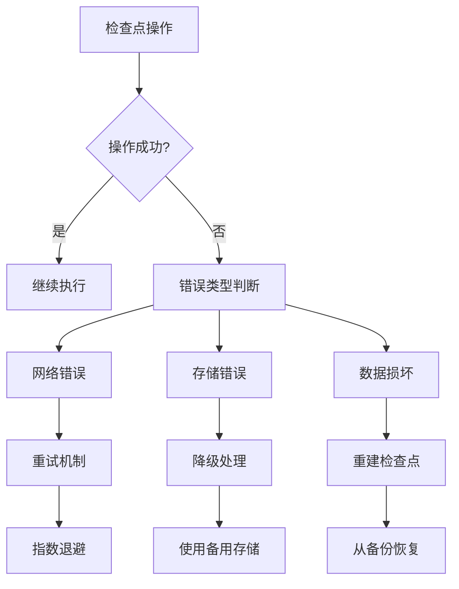

### 数据迁移和备份

1. **定期备份**：将检查点数据导出到安全位置
2. **版本兼容**：确保检查点格式的向后兼容
3. **增量同步**：只传输变化的部分
4. **验证机制**：备份完成后验证数据完整性

**章节来源**
- [checkpointing.go](file://graph/checkpointing.go#L31-L43)
- [postgres.go](file://store/postgres/postgres.go#L28-L32)
- [redis.go](file://store/redis/redis.go#L29-L47)

## 总结

持久化检查点系统是 LangGraphGo 框架的核心功能之一，为复杂应用提供了强大的状态管理和容错能力。通过本文档的详细介绍，我们可以看到：

### 核心价值

1. **可靠性**：通过自动保存和恢复机制，大大提高了应用程序的可靠性
2. **灵活性**：支持多种存储后端和配置选项，适应不同场景需求
3. **可扩展性**：良好的接口设计支持自定义存储后端
4. **易用性**：简洁的 API 设计降低了使用门槛

### 技术特点

- **标准化接口**：统一的 CheckpointStore 接口简化了存储后端的选择
- **自动管理**：CheckpointListener 实现了透明的自动检查点保存
- **状态快照**：完整的状态保存支持精确的恢复和调试
- **并发安全**：所有操作都考虑了并发安全性

### 应用前景

检查点系统不仅解决了当前的技术挑战，还为未来的创新应用奠定了基础：

- **智能代理**：支持复杂的交互式工作流程
- **分布式系统**：为微服务架构提供状态管理能力
- **边缘计算**：在资源受限环境中提供可靠的执行保障
- **AI 应用**：为大型语言模型提供状态持久化支持

通过合理使用检查点系统，开发者可以构建更加可靠、灵活和强大的应用程序，真正实现"永不丢失状态"的愿景。