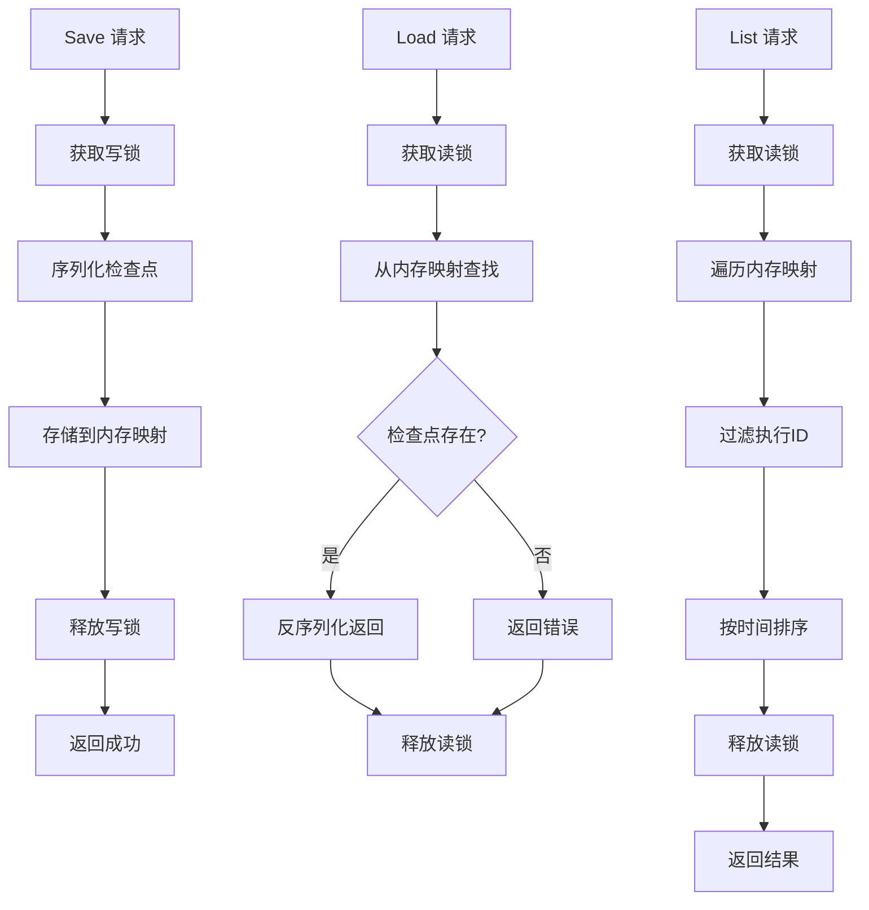
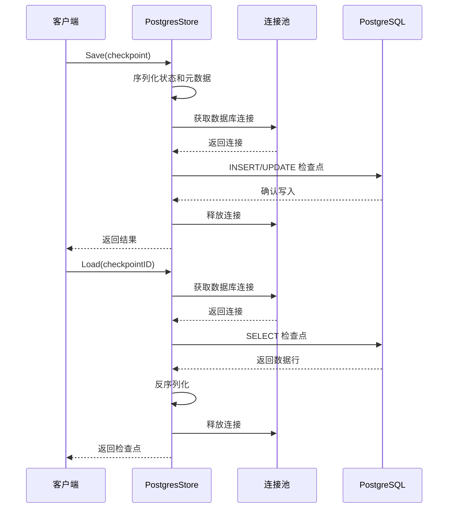
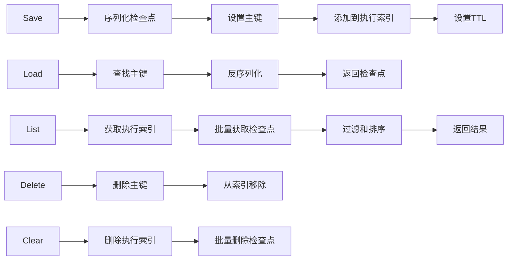
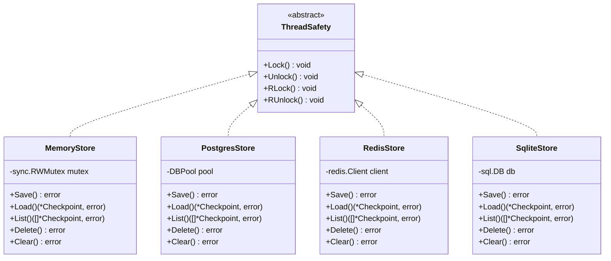
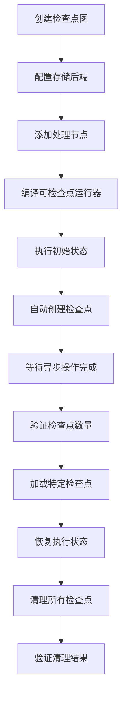

# 检查点存储接口技术文档

<cite>
**本文档中引用的文件**
- [graph/checkpointing.go](file://graph/checkpointing.go)
- [checkpoint/postgres/postgres.go](file://checkpoint/postgres/postgres.go)
- [checkpoint/redis/redis.go](file://checkpoint/redis/redis.go)
- [checkpoint/sqlite/sqlite.go](file://checkpoint/sqlite/sqlite.go)
- [examples/checkpointing/main.go](file://examples/checkpointing/main.go)
- [graph/checkpointing_test.go](file://graph/checkpointing_test.go)
- [checkpoint/postgres/postgres_test.go](file://checkpoint/postgres/postgres_test.go)
- [checkpoint/redis/redis_test.go](file://checkpoint/redis/redis_test.go)
- [checkpoint/sqlite/sqlite_test.go](file://checkpoint/sqlite/sqlite_test.go)
</cite>

## 目录
1. [简介](#简介)
2. [接口定义](#接口定义)
3. [核心数据结构](#核心数据结构)
4. [五种核心方法详解](#五种核心方法详解)
5. [存储后端实现](#存储后端实现)
6. [线程安全与上下文处理](#线程安全与上下文处理)
7. [测试用例分析](#测试用例分析)
8. [最佳实践](#最佳实践)
9. [故障排除指南](#故障排除指南)
10. [总结](#总结)

## 简介

CheckpointStore 接口是 langgraphgo 框架中的核心组件，负责管理图执行过程中的状态快照（检查点）。该接口提供了一个统一的抽象层，使得框架能够无缝集成多种后端存储系统，包括内存、PostgreSQL、Redis 和 SQLite 等。通过抽象化设计，开发者可以轻松切换不同的存储后端，而无需修改业务逻辑代码。

## 接口定义

CheckpointStore 接口定义了五个核心方法，每个方法都针对不同的检查点操作进行了专门设计：

```mermaid
classDiagram
class CheckpointStore {
<<interface>>
+Save(ctx Context, checkpoint *Checkpoint) error
+Load(ctx Context, checkpointID string) (*Checkpoint, error)
+List(ctx Context, executionID string) ([]*Checkpoint, error)
+Delete(ctx Context, checkpointID string) error
+Clear(ctx Context, executionID string) error
}
class Checkpoint {
+string ID
+string NodeName
+interface{} State
+map[string]interface{} Metadata
+time.Time Timestamp
+int Version
}
class MemoryCheckpointStore {
-map[string]*Checkpoint checkpoints
-sync.RWMutex mutex
+Save(ctx Context, checkpoint *Checkpoint) error
+Load(ctx Context, checkpointID string) (*Checkpoint, error)
+List(ctx Context, executionID string) ([]*Checkpoint, error)
+Delete(ctx Context, checkpointID string) error
+Clear(ctx Context, executionID string) error
}
class PostgresCheckpointStore {
-DBPool pool
-string tableName
+Save(ctx Context, checkpoint *Checkpoint) error
+Load(ctx Context, checkpointID string) (*Checkpoint, error)
+List(ctx Context, executionID string) ([]*Checkpoint, error)
+Delete(ctx Context, checkpointID string) error
+Clear(ctx Context, executionID string) error
}
class RedisCheckpointStore {
-redis.Client client
-string prefix
-time.Duration ttl
+Save(ctx Context, checkpoint *Checkpoint) error
+Load(ctx Context, checkpointID string) (*Checkpoint, error)
+List(ctx Context, executionID string) ([]*Checkpoint, error)
+Delete(ctx Context, checkpointID string) error
+Clear(ctx Context, executionID string) error
}
class SqliteCheckpointStore {
-sql.DB db
-string tableName
+Save(ctx Context, checkpoint *Checkpoint) error
+Load(ctx Context, checkpointID string) (*Checkpoint, error)
+List(ctx Context, executionID string) ([]*Checkpoint, error)
+Delete(ctx Context, checkpointID string) error
+Clear(ctx Context, executionID string) error
}
CheckpointStore <|.. MemoryCheckpointStore
CheckpointStore <|.. PostgresCheckpointStore
CheckpointStore <|.. RedisCheckpointStore
CheckpointStore <|.. SqliteCheckpointStore
CheckpointStore --> Checkpoint : manages
```

**图表来源**
- [graph/checkpointing.go](file://graph/checkpointing.go#L22-L37)
- [checkpoint/postgres/postgres.go](file://checkpoint/postgres/postgres.go#L22-L250)
- [checkpoint/redis/redis.go](file://checkpoint/redis/redis.go#L13-L212)
- [checkpoint/sqlite/sqlite.go](file://checkpoint/sqlite/sqlite.go#L13-L236)

**章节来源**
- [graph/checkpointing.go](file://graph/checkpointing.go#L22-L37)

## 核心数据结构

### Checkpoint 结构体

Checkpoint 结构体是检查点的核心数据模型，包含了执行过程中保存的状态信息：

| 字段名 | 类型 | 描述 | 必需性 |
|--------|------|------|--------|
| ID | string | 唯一标识符，用于定位特定检查点 | 必需 |
| NodeName | string | 触发检查点的节点名称 | 必需 |
| State | interface{} | 图的当前状态，可以是任意可序列化的数据结构 | 必需 |
| Metadata | map[string]interface{} | 元数据信息，通常包含执行ID等上下文信息 | 可选 |
| Timestamp | time.Time | 创建时间戳 | 必需 |
| Version | int | 版本号，用于冲突检测和并发控制 | 必需 |

**章节来源**
- [graph/checkpointing.go](file://graph/checkpointing.go#L12-L20)

## 五种核心方法详解

### 1. Save 方法 - 持久化检查点

**方法签名：**
```go
Save(ctx context.Context, checkpoint *Checkpoint) error
```

**功能描述：**
Save 方法负责将检查点数据持久化到选定的存储后端。该方法需要处理以下关键任务：

- **数据序列化**：将 Checkpoint 对象转换为适合存储的格式
- **元数据提取**：从 Metadata 中提取执行ID等关键信息
- **事务处理**：确保数据写入的原子性和一致性
- **错误处理**：优雅处理各种存储异常情况

**参数说明：**
- `ctx`：上下文对象，支持超时和取消操作
- `checkpoint`：要保存的检查点对象，包含完整状态信息

**返回值：**
- `error`：成功时返回 nil，失败时返回具体错误信息

**可能的错误类型：**
- 存储连接失败
- 数据序列化错误
- 权限不足
- 磁盘空间不足

**章节来源**
- [graph/checkpointing.go](file://graph/checkpointing.go#L24)
- [checkpoint/postgres/postgres.go](file://checkpoint/postgres/postgres.go#L91-L135)
- [checkpoint/redis/redis.go](file://checkpoint/redis/redis.go#L57-L84)
- [checkpoint/sqlite/sqlite.go](file://checkpoint/sqlite/sqlite.go#L77-L121)

### 2. Load 方法 - 按ID加载检查点

**方法签名：**
```go
Load(ctx context.Context, checkpointID string) (*Checkpoint, error)
```

**功能描述：**
Load 方法根据检查点ID从存储中检索特定的检查点。该方法实现了精确查找机制：

- **唯一标识**：使用检查点ID进行精确匹配
- **反序列化**：将存储格式的数据还原为 Checkpoint 对象
- **完整性验证**：确保加载的数据完整且有效
- **错误传播**：明确区分不存在和加载失败的情况

**参数说明：**
- `ctx`：上下文对象，支持异步操作和超时控制
- `checkpointID`：目标检查点的唯一标识符

**返回值：**
- `*Checkpoint`：找到的检查点对象指针
- `error`：如果检查点不存在或加载失败，返回相应错误

**可能的错误类型：**
- 检查点不存在：`checkpoint not found: {checkpointID}`
- 存储访问失败
- 数据损坏或格式错误
- 网络连接问题

**章节来源**
- [graph/checkpointing.go](file://graph/checkpointing.go#L27)
- [checkpoint/postgres/postgres.go](file://checkpoint/postgres/postgres.go#L137-L176)
- [checkpoint/redis/redis.go](file://checkpoint/redis/redis.go#L86-L103)
- [checkpoint/sqlite/sqlite.go](file://checkpoint/sqlite/sqlite.go#L123-L162)

### 3. List 方法 - 根据执行ID列出所有检查点

**方法签名：**
```go
List(ctx context.Context, executionID string) ([]*Checkpoint, error)
```

**功能描述：**
List 方法返回指定执行流程中所有的检查点，按时间顺序排列。该方法提供了完整的执行历史视图：

- **范围查询**：基于执行ID过滤相关检查点
- **排序机制**：按照时间戳升序排列，确保执行顺序
- **批量加载**：一次性获取所有相关检查点
- **内存优化**：合理处理大量检查点的场景

**参数说明：**
- `ctx`：上下文对象，支持长时间运行的操作
- `executionID`：目标执行流程的唯一标识符

**返回值：**
- `[]*Checkpoint`：按时间顺序排列的检查点列表
- `error`：操作失败时返回具体错误

**预期行为：**
- 返回空切片而非nil表示没有检查点
- 按时间戳升序排列，便于追踪执行进度
- 支持大数量级的检查点（理论上）

**章节来源**
- [graph/checkpointing.go](file://graph/checkpointing.go#L30)
- [checkpoint/postgres/postgres.go](file://checkpoint/postgres/postgres.go#L178-L229)
- [checkpoint/redis/redis.go](file://checkpoint/redis/redis.go#L105-L155)
- [checkpoint/sqlite/sqlite.go](file://checkpoint/sqlite/sqlite.go#L164-L215)

### 4. Delete 方法 - 删除指定检查点

**方法签名：**
```go
Delete(ctx context.Context, checkpointID string) error
```

**功能描述：**
Delete 方法移除指定的检查点，支持清理不再需要的历史数据。该方法确保数据的一致性：

- **精确删除**：基于检查点ID进行精确匹配删除
- **级联清理**：同时清理相关的索引和关联数据
- **幂等性**：重复删除同一个检查点不会产生错误
- **资源回收**：释放被删除检查点占用的存储空间

**参数说明：**
- `ctx`：上下文对象，支持异步删除操作
- `checkpointID`：要删除的检查点唯一标识符

**返回值：**
- `error`：删除成功返回 nil，失败返回具体错误

**可能的错误类型：**
- 检查点不存在
- 存储权限不足
- 并发删除冲突
- 网络中断

**章节来源**
- [graph/checkpointing.go](file://graph/checkpointing.go#L33)
- [checkpoint/postgres/postgres.go](file://checkpoint/postgres/postgres.go#L231-L239)
- [checkpoint/redis/redis.go](file://checkpoint/redis/redis.go#L157-L181)
- [checkpoint/sqlite/sqlite.go](file://checkpoint/sqlite/sqlite.go#L217-L225)

### 5. Clear 方法 - 清除某次执行的所有检查点

**方法签名：**
```go
Clear(ctx context.Context, executionID string) error
```

**功能描述：**
Clear 方法删除指定执行流程中的所有检查点，常用于清理完成的执行历史。该方法提供批量操作能力：

- **范围删除**：基于执行ID删除所有相关检查点
- **事务保证**：确保整个删除过程的原子性
- **性能优化**：利用数据库的批量删除功能
- **资源释放**：彻底清理执行历史占用的空间

**参数说明：**
- `ctx`：上下文对象，支持长时间运行的批量操作
- `executionID`：要清理的执行流程唯一标识符

**返回值：**
- `error`：删除成功返回 nil，失败返回具体错误

**可能的错误类型：**
- 执行ID不存在
- 存储系统过载
- 权限验证失败
- 网络连接中断

**章节来源**
- [graph/checkpointing.go](file://graph/checkpointing.go#L36)
- [checkpoint/postgres/postgres.go](file://checkpoint/postgres/postgres.go#L241-L249)
- [checkpoint/redis/redis.go](file://checkpoint/redis/redis.go#L183-L211)
- [checkpoint/sqlite/sqlite.go](file://checkpoint/sqlite/sqlite.go#L227-L236)

## 存储后端实现

### 内存存储（MemoryCheckpointStore）

内存存储是最简单的实现，适用于测试和短期运行的应用程序：



**图表来源**
- [graph/checkpointing.go](file://graph/checkpointing.go#L40-L111)

**特点：**
- 高性能，无I/O开销
- 数据易失性，进程重启后丢失
- 线程安全，使用读写锁保护
- 适合开发和测试环境

**章节来源**
- [graph/checkpointing.go](file://graph/checkpointing.go#L40-L111)

### PostgreSQL 存储（PostgresCheckpointStore）

PostgreSQL 实现提供了企业级的持久化能力和复杂查询支持：



**图表来源**
- [checkpoint/postgres/postgres.go](file://checkpoint/postgres/postgres.go#L91-L250)

**特点：**
- 强一致性保证
- 支持复杂查询和索引
- 高可用性和容灾能力
- 适合生产环境部署

**章节来源**
- [checkpoint/postgres/postgres.go](file://checkpoint/postgres/postgres.go#L22-L250)

### Redis 存储（RedisCheckpointStore）

Redis 实现提供了高性能的缓存式存储解决方案：



**图表来源**
- [checkpoint/redis/redis.go](file://checkpoint/redis/redis.go#L57-L212)

**特点：**
- 超高读写性能
- 内置过期机制
- 支持数据结构丰富
- 适合高频访问场景

**章节来源**
- [checkpoint/redis/redis.go](file://checkpoint/redis/redis.go#L13-L212)

### SQLite 存储（SqliteCheckpointStore）

SQLite 实现提供了轻量级的本地存储方案：

**特点：**
- 单文件部署，无外部依赖
- 自包含的数据库引擎
- 良好的兼容性和稳定性
- 适合嵌入式和小型应用

**章节来源**
- [checkpoint/sqlite/sqlite.go](file://checkpoint/sqlite/sqlite.go#L13-L236)

## 线程安全与上下文处理

### 线程安全保证

所有存储后端都实现了适当的线程安全机制：



**图表来源**
- [graph/checkpointing.go](file://graph/checkpointing.go#L40-L111)
- [checkpoint/postgres/postgres.go](file://checkpoint/postgres/postgres.go#L22-L250)
- [checkpoint/redis/redis.go](file://checkpoint/redis/redis.go#L13-L212)
- [checkpoint/sqlite/sqlite.go](file://checkpoint/sqlite/sqlite.go#L13-L236)

### 上下文感知处理

接口契约要求实现者正确处理 `context.Context` 参数：

**超时和取消支持：**
- 所有方法接收上下文参数
- 支持操作超时控制
- 正确响应取消信号

**资源管理：**
- 数据库连接池管理
- 网络连接生命周期
- 文件句柄及时释放

**章节来源**
- [graph/checkpointing.go](file://graph/checkpointing.go#L22-L37)

## 测试用例分析

### 基础功能测试

测试用例覆盖了接口的基本功能验证：

| 测试场景 | 验证内容 | 预期结果 |
|----------|----------|----------|
| SaveAndLoad | 保存和加载检查点的完整性 | 成功且数据一致 |
| LoadNonExistent | 加载不存在的检查点 | 返回特定错误 |
| List | 列出指定执行的所有检查点 | 按时间顺序正确返回 |
| Delete | 删除指定检查点 | 检查点不再存在 |
| Clear | 清除执行的所有检查点 | 所有相关检查点被删除 |

**章节来源**
- [graph/checkpointing_test.go](file://graph/checkpointing_test.go#L19-L691)

### 存储后端专项测试

每种存储后端都有专门的测试套件：

**PostgreSQL 测试重点：**
- 数据库连接和断开
- SQL 查询和更新
- 事务处理和回滚
- 并发访问控制

**Redis 测试重点：**
- 键值操作和过期
- 集合操作和索引
- 管道操作和批处理
- 内存管理和清理

**SQLite 测试重点：**
- 数据库初始化和迁移
- 本地文件操作
- 事务和约束
- 性能基准测试

**章节来源**
- [checkpoint/postgres/postgres_test.go](file://checkpoint/postgres/postgres_test.go#L15-L90)
- [checkpoint/redis/redis_test.go](file://checkpoint/redis/redis_test.go#L14-L89)
- [checkpoint/sqlite/sqlite_test.go](file://checkpoint/sqlite/sqlite_test.go#L12-L83)

### 集成测试场景

完整的集成测试验证了端到端的工作流程：



**图表来源**
- [examples/checkpointing/main.go](file://examples/checkpointing/main.go#L17-L119)

**章节来源**
- [graph/checkpointing_test.go](file://graph/checkpointing_test.go#L536-L691)

## 最佳实践

### 选择合适的存储后端

**内存存储适用场景：**
- 开发和测试环境
- 短期运行的应用
- 不需要持久化的场景

**PostgreSQL 适用场景：**
- 生产环境部署
- 大规模数据存储
- 复杂查询需求
- 高并发访问

**Redis 适用场景：**
- 高频访问的缓存场景
- 实时状态监控
- 分布式系统协调
- TTL 数据管理

**SQLite 适用场景：**
- 嵌入式应用
- 小型项目
- 单机部署
- 简单状态管理

### 性能优化建议

**批量操作：**
- 使用管道或批处理减少网络往返
- 合理设置事务边界
- 利用数据库索引加速查询

**内存管理：**
- 及时清理不需要的检查点
- 设置合理的TTL值
- 监控内存使用情况

**并发控制：**
- 使用适当的锁策略
- 避免死锁和竞态条件
- 合理设计数据访问模式

### 错误处理策略

**重试机制：**
- 网络异常的自动重试
- 临时性错误的处理
- 指数退避算法

**降级策略：**
- 主存储失败时的备用方案
- 只读模式下的功能限制
- 缓存失效时的处理

## 故障排除指南

### 常见问题诊断

**检查点加载失败：**
1. 检查存储连接是否正常
2. 验证检查点ID的有效性
3. 确认数据序列化格式
4. 查看存储后端的日志

**性能问题：**
1. 分析查询执行计划
2. 检查索引使用情况
3. 监控资源使用率
4. 优化批量操作

**数据一致性问题：**
1. 验证事务处理逻辑
2. 检查并发访问控制
3. 确认数据版本管理
4. 分析网络分区影响

### 监控和调试

**关键指标：**
- 操作延迟分布
- 错误率统计
- 资源使用率
- 并发度监控

**调试工具：**
- 日志级别调整
- 性能剖析工具
- 数据库监控
- 网络诊断

## 总结

CheckpointStore 接口通过其简洁而强大的设计，为 langgraphgo 框架提供了灵活的状态管理能力。五个核心方法涵盖了检查点生命周期的各个方面，从创建到销毁的完整流程。多样的存储后端实现满足了不同场景的需求，从开发测试到生产部署的各种环境。

接口的设计充分考虑了线程安全和上下文感知的要求，确保在高并发环境下也能稳定运行。完善的测试覆盖和错误处理机制为生产环境的可靠性提供了保障。

通过遵循最佳实践和故障排除指南，开发者可以充分利用这个接口的强大功能，构建健壮和高效的图执行系统。随着框架的发展，这个接口将继续演进，以适应新的需求和技术挑战。