# 检查点数据模型

<cite>
**本文档中引用的文件**
- [graph/checkpointing.go](file://graph/checkpointing.go)
- [checkpoint/postgres/postgres.go](file://checkpoint/postgres/postgres.go)
- [checkpoint/redis/redis.go](file://checkpoint/redis/redis.go)
- [checkpoint/sqlite/sqlite.go](file://checkpoint/sqlite/sqlite.go)
- [examples/checkpointing/main.go](file://examples/checkpointing/main.go)
- [examples/checkpointing/postgres/main.go](file://examples/checkpointing/postgres/main.go)
- [examples/checkpointing/redis/main.go](file://examples/checkpointing/redis/main.go)
- [examples/checkpointing/sqlite/main.go](file://examples/checkpointing/sqlite/main.go)
- [examples/human_in_the_loop/main.go](file://examples/human_in_the_loop/main.go)
- [examples/time_travel/main.go](file://examples/time_travel/main.go)
</cite>

## 目录
1. [简介](#简介)
2. [检查点结构体详解](#检查点结构体详解)
3. [持久化存储实现](#持久化存储实现)
4. [检查点在图执行中的作用](#检查点在图执行中的作用)
5. [版本控制与状态合并](#版本控制与状态合并)
6. [实际使用场景](#实际使用场景)
7. [最佳实践](#最佳实践)
8. [总结](#总结)

## 简介

检查点（Checkpoint）是 LangGraphGo 中用于保存和恢复图执行状态的核心数据模型。它作为某一时刻执行状态的完整快照，在复杂、长时间运行或关键的应用中发挥着至关重要的作用。检查点不仅支持故障恢复和状态持久化，还为人在回路（Human-in-the-loop）工作流和时间旅行调试提供了基础能力。

## 检查点结构体详解

### 核心字段定义

检查点结构体包含了六个核心字段，每个字段都有其特定的用途和意义：

```mermaid
classDiagram
class Checkpoint {
+string ID
+string NodeName
+interface{} State
+map[string]interface{} Metadata
+time.Time Timestamp
+int Version
+MarshalJSON() []byte
+UnmarshalJSON([]byte) error
}
class CheckpointStore {
<<interface>>
+Save(ctx, checkpoint) error
+Load(ctx, checkpointID) Checkpoint
+List(ctx, executionID) []Checkpoint
+Delete(ctx, checkpointID) error
+Clear(ctx, executionID) error
}
class MemoryCheckpointStore {
+map[string]Checkpoint checkpoints
+sync.RWMutex mutex
+Save(ctx, checkpoint) error
+Load(ctx, checkpointID) Checkpoint
+List(ctx, executionID) []Checkpoint
+Delete(ctx, checkpointID) error
+Clear(ctx, executionID) error
}
CheckpointStore <|.. MemoryCheckpointStore
CheckpointStore <|.. PostgresCheckpointStore
CheckpointStore <|.. RedisCheckpointStore
CheckpointStore <|.. SqliteCheckpointStore
```

**图表来源**
- [graph/checkpointing.go](file://graph/checkpointing.go#L12-L19)
- [checkpoint/postgres/postgres.go](file://checkpoint/postgres/postgres.go#L23-L26)
- [checkpoint/redis/redis.go](file://checkpoint/redis/redis.go#L13-L18)
- [checkpoint/sqlite/sqlite.go](file://checkpoint/sqlite/sqlite.go#L13-L17)

### 字段详细说明

#### 1. ID（唯一标识符）
- **类型**: `string`
- **用途**: 每个检查点的唯一标识符，确保不同检查点之间的区分
- **生成方式**: 通过 `generateCheckpointID()` 函数生成，基于时间戳
- **特点**: 全局唯一，便于快速定位和检索

#### 2. NodeName（执行节点名称）
- **类型**: `string`
- **用途**: 记录检查点创建时正在执行的节点名称
- **意义**: 帮助理解状态是在哪个处理阶段被捕获的
- **应用场景**: 在恢复执行时确定从哪个节点继续

#### 3. State（当前图状态）
- **类型**: `interface{}`
- **用途**: 存储图的完整状态信息，可以是任意类型的结构
- **特点**: 支持复杂的数据结构，包括嵌套对象和数组
- **序列化**: 通过 JSON 编码存储，支持跨平台传输

#### 4. Metadata（元数据映射）
- **类型**: `map[string]interface{}`
- **用途**: 存储上下文信息和额外的元数据
- **常见键值**:
  - `"execution_id"`: 执行线程的唯一标识
  - `"event"`: 触发检查点的事件类型
  - `"source"`: 检查点的来源描述
  - `"updated_by"`: 更新状态的节点名称

#### 5. Timestamp（时间戳）
- **类型**: `time.Time`
- **用途**: 记录检查点创建的时间
- **功能**: 支持按时间顺序排序和查询
- **精度**: 纳秒级精度，确保时间顺序的准确性

#### 6. Version（版本号）
- **类型**: `int`
- **用途**: 版本控制机制，支持状态合并和冲突解决
- **增长规则**: 每次状态更新时递增
- **重要性**: 在并发场景下确保状态的一致性

**章节来源**
- [graph/checkpointing.go](file://graph/checkpointing.go#L12-L19)

## 持久化存储实现

### 多存储后端支持

LangGraphGo 提供了四种不同的检查点存储实现，满足不同场景的需求：

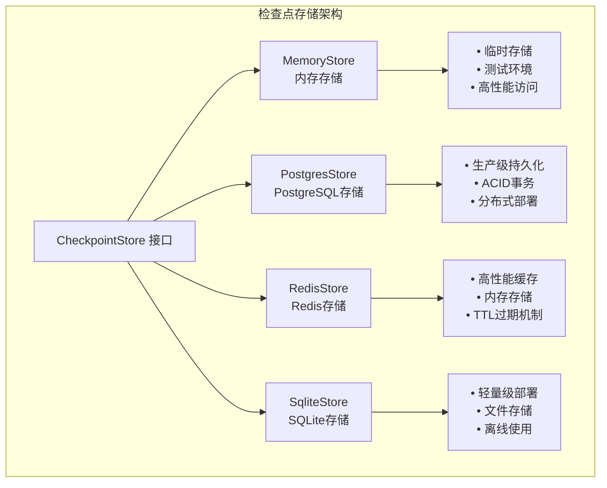

**图表来源**
- [checkpoint/postgres/postgres.go](file://checkpoint/postgres/postgres.go#L23-L26)
- [checkpoint/redis/redis.go](file://checkpoint/redis/redis.go#L13-L18)
- [checkpoint/sqlite/sqlite.go](file://checkpoint/sqlite/sqlite.go#L13-L17)

### 存储后端特性对比

| 特性 | 内存存储 | PostgreSQL | Redis | SQLite |
|------|----------|------------|-------|--------|
| **持久性** | ✗ | ✓ | ✓ | ✓ |
| **性能** | 极高 | 高 | 最高 | 中等 |
| **并发支持** | ✓ | ✓ | ✓ | ✓ |
| **事务支持** | ✗ | ✓ | ✓ | ✓ |
| **部署复杂度** | 最低 | 中等 | 中等 | 最低 |
| **适用场景** | 测试、开发 | 生产环境 | 高频缓存 | 离线应用 |

### JSON 序列化机制

所有存储实现都依赖于 Go 的标准 JSON 序列化机制来处理状态数据：

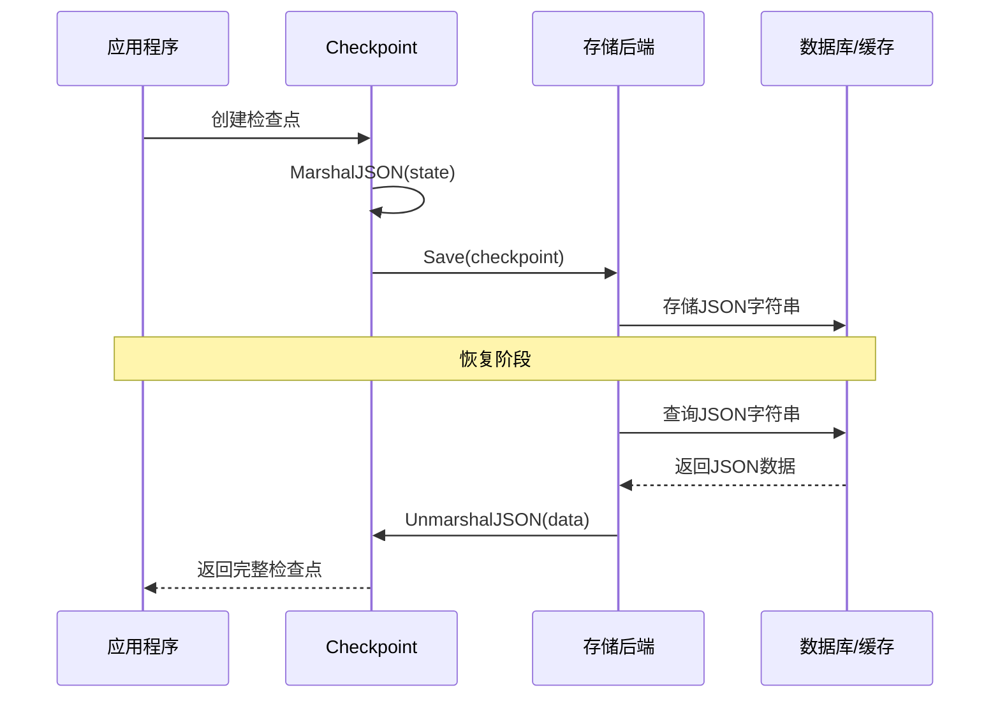

**图表来源**
- [checkpoint/postgres/postgres.go](file://checkpoint/postgres/postgres.go#L92-L135)
- [checkpoint/redis/redis.go](file://checkpoint/redis/redis.go#L57-L102)
- [checkpoint/sqlite/sqlite.go](file://checkpoint/sqlite/sqlite.go#L77-L121)

**章节来源**
- [checkpoint/postgres/postgres.go](file://checkpoint/postgres/postgres.go#L92-L135)
- [checkpoint/redis/redis.go](file://checkpoint/redis/redis.go#L57-L102)
- [checkpoint/sqlite/sqlite.go](file://checkpoint/sqlite/sqlite.go#L77-L121)

## 检查点在图执行中的作用

### 自动检查点监听器

检查点监听器（CheckpointListener）是自动捕获执行状态的核心组件：

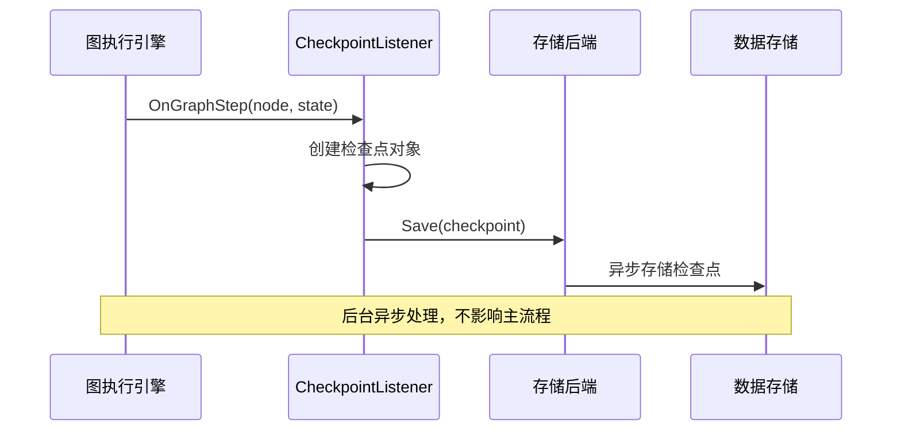

**图表来源**
- [graph/checkpointing.go](file://graph/checkpointing.go#L296-L330)

### 手动检查点保存

除了自动捕获，开发者还可以手动保存检查点：

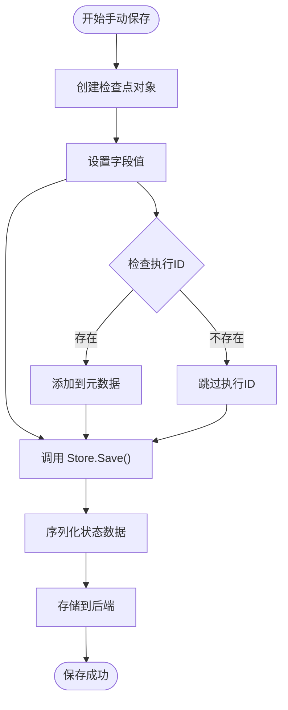

**图表来源**
- [graph/checkpointing.go](file://graph/checkpointing.go#L253-L267)

### 检查点生命周期管理

检查点的完整生命周期包括创建、存储、检索和清理：

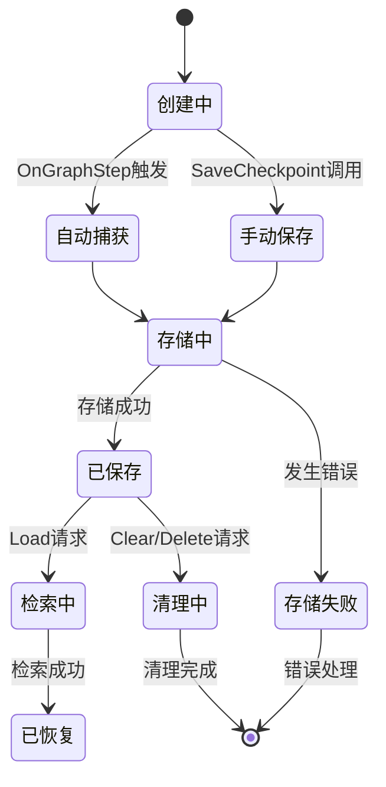

**章节来源**
- [graph/checkpointing.go](file://graph/checkpointing.go#L296-L330)
- [graph/checkpointing.go](file://graph/checkpointing.go#L253-L267)

## 版本控制与状态合并

### 版本控制机制

版本号系统确保在并发场景下的状态一致性：

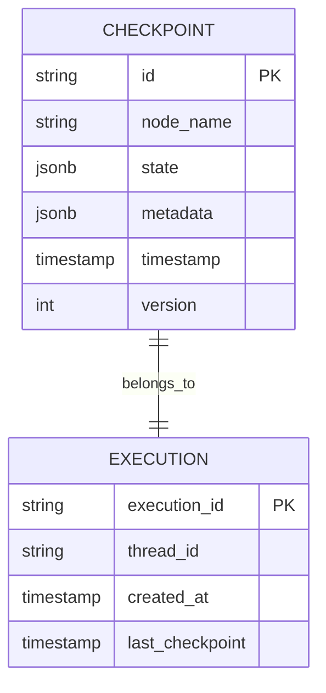

**图表来源**
- [graph/checkpointing.go](file://graph/checkpointing.go#L535-L547)

### 状态合并策略

当需要更新状态时，系统采用智能合并策略：

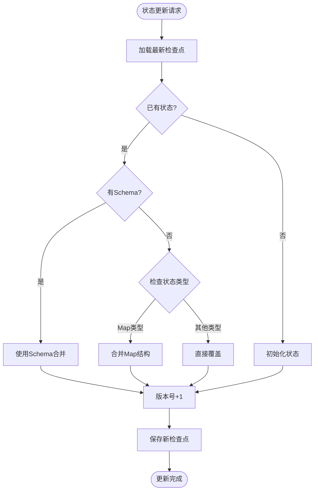

**图表来源**
- [graph/checkpointing.go](file://graph/checkpointing.go#L466-L558)

### 并发控制

版本控制系统防止并发更新导致的数据丢失：

| 场景 | 版本号变化 | 结果 |
|------|------------|------|
| 正常更新 | +1 | 成功 |
| 并发冲突 | +1 | 成功（乐观锁） |
| 数据损坏 | 不变 | 失败 |
| 删除后重建 | 重置为1 | 新的历史分支 |

**章节来源**
- [graph/checkpointing.go](file://graph/checkpointing.go#L535-L547)
- [graph/checkpointing.go](file://graph/checkpointing.go#L466-L558)

## 实际使用场景

### 人在回路（Human-in-the-loop）工作流

检查点在人在回路场景中发挥核心作用：

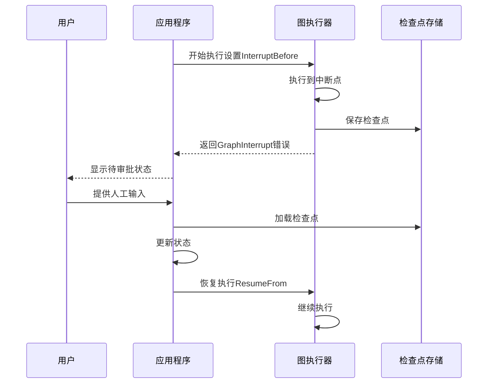

**图表来源**
- [examples/human_in_the_loop/main.go](file://examples/human_in_the_loop/main.go#L67-L118)

### 故障恢复与重启

在长时间运行的任务中，检查点提供可靠的恢复机制：

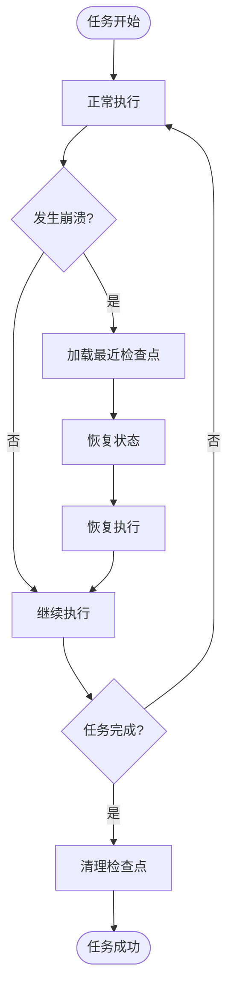

### 时间旅行调试

检查点支持复杂的调试场景，允许开发者"回到过去"：

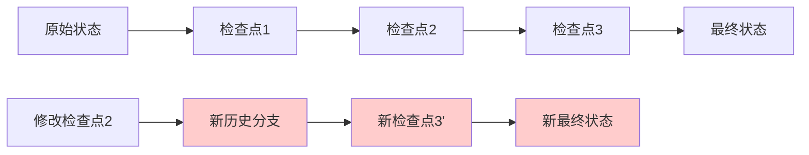

**图表来源**
- [examples/time_travel/main.go](file://examples/time_travel/main.go#L1-L56)

### 长时间运行的工作流

对于需要数天甚至数周才能完成的任务，检查点确保不会丢失进度：

| 场景 | 检查点频率 | 存储策略 | 恢复能力 |
|------|------------|----------|----------|
| 短期任务 | 每步骤 | 内存存储 | 完全恢复 |
| 长期任务 | 每小时 | 持久化存储 | 部分恢复 |
| 关键任务 | 每分钟 | 多副本存储 | 高可用恢复 |
| 开发测试 | 每次迭代 | 临时存储 | 快速回滚 |

**章节来源**
- [examples/human_in_the_loop/main.go](file://examples/human_in_the_loop/main.go#L67-L118)
- [examples/time_travel/main.go](file://examples/time_travel/main.go#L1-L56)

## 最佳实践

### 检查点配置建议

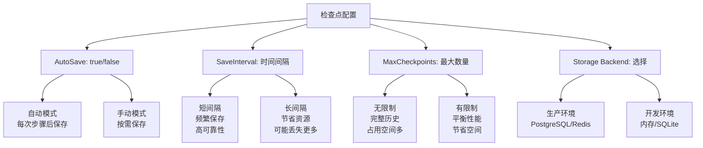

### 性能优化策略

1. **批量操作**: 在可能的情况下批量处理检查点
2. **异步存储**: 使用异步方式保存检查点，避免阻塞主流程
3. **压缩存储**: 对大型状态数据启用压缩
4. **TTL管理**: 为临时检查点设置合理的过期时间

### 错误处理与监控

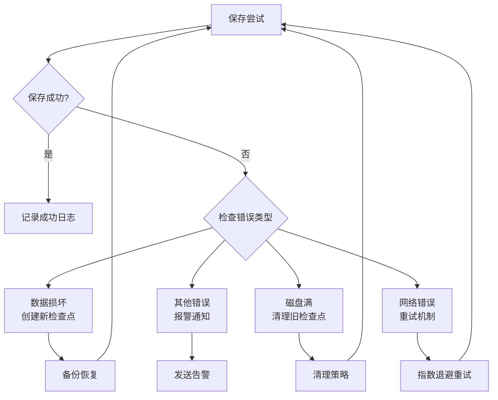

### 数据安全考虑

1. **加密存储**: 对敏感状态数据进行加密
2. **访问控制**: 实施严格的访问权限管理
3. **审计日志**: 记录所有检查点操作
4. **备份策略**: 定期备份重要检查点

**章节来源**
- [examples/checkpointing/main.go](file://examples/checkpointing/main.go#L22-L27)
- [examples/checkpointing/postgres/main.go](file://examples/checkpointing/postgres/main.go#L48-L54)
- [examples/checkpointing/redis/main.go](file://examples/checkpointing/redis/main.go#L38-L44)
- [examples/checkpointing/sqlite/main.go](file://examples/checkpointing/sqlite/main.go#L42-L48)

## 总结

检查点数据模型是 LangGraphGo 架构中的核心组件，它通过六个精心设计的字段提供了完整的状态捕获和恢复能力。从简单的内存存储到复杂的分布式数据库，多种存储后端满足不同场景的需求。版本控制机制确保了并发环境下的数据一致性，而灵活的配置选项使得开发者可以根据具体需求优化性能和可靠性。

在实际应用中，检查点不仅支持基本的故障恢复功能，还为高级场景如人在回路工作流、时间旅行调试和长时间运行的任务提供了坚实的基础。通过遵循最佳实践和合理配置，开发者可以构建出既可靠又高效的图执行系统。

随着 AI 应用复杂性的不断增加，检查点技术的重要性将日益凸显，它将继续在构建可信赖的智能系统中发挥关键作用。