# 核心概念

<cite>
**本文档中引用的文件**
- [state_graph.go](file://graph/state_graph.go)
- [graph.go](file://graph/graph.go)
- [schema.go](file://graph/schema.go)
- [checkpointing.go](file://graph/checkpointing.go)
- [streaming.go](file://graph/streaming.go)
- [listeners.go](file://graph/listeners.go)
- [main.go](file://examples/basic_example/main.go)
- [main.go](file://examples/state_schema/main.go)
- [main.go](file://examples/checkpointing/main.go)
- [main.go](file://examples/streaming_modes/main.go)
</cite>

## 目录
1. [简介](#简介)
2. [图结构工作流概述](#图结构工作流概述)
3. [节点与边](#节点与边)
4. [StateGraph 设计](#stategraph-设计)
5. [状态模式与更新机制](#状态模式与更新机制)
6. [持久化检查点](#持久化检查点)
7. [流式输出与监听器](#流式输出与监听器)
8. [错误处理与重试策略](#错误处理与重试策略)
9. [总结](#总结)

## 简介

LangGraphGo 是一个基于图结构的工作流引擎，它将应用程序逻辑建模为有向无环图（DAG），其中节点表示处理步骤，边表示数据流向。这种设计提供了高度的灵活性、可组合性和可观测性，特别适用于复杂的 AI 应用程序和数据处理管道。

## 图结构工作流概述

### 基本架构

LangGraphGo 的核心是基于图的执行模型，它将应用程序分解为独立的处理单元（节点），并通过连接这些单元来定义执行流程。

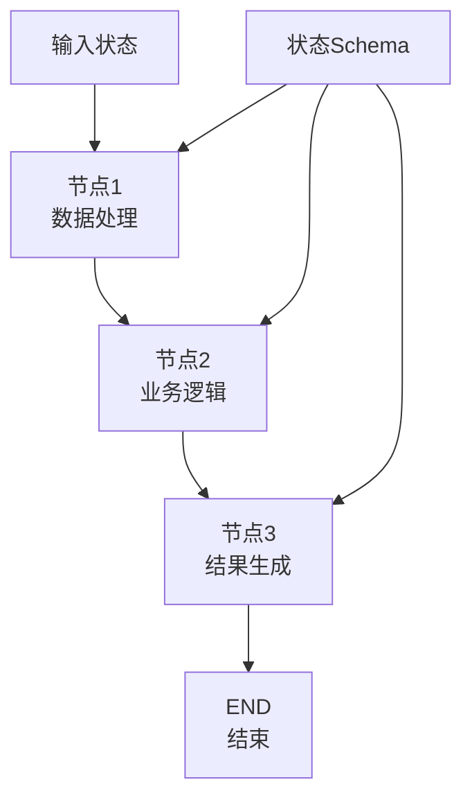

**图表来源**
- [graph.go](file://graph/graph.go#L52-L60)
- [state_graph.go](file://graph/state_graph.go#L11-L32)

### 执行模型

图结构工作流采用并行执行模型，在每个步骤中可以同时执行多个节点，然后通过状态合并机制统一处理结果。

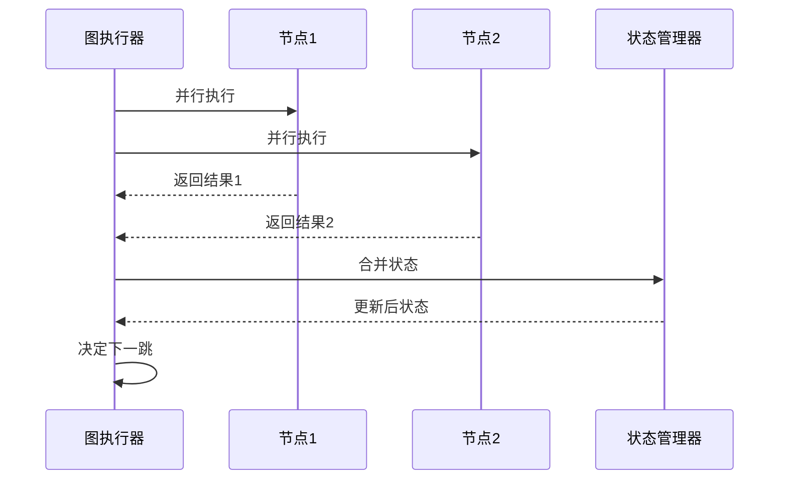

**图表来源**
- [state_graph.go](file://graph/state_graph.go#L143-L166)
- [graph.go](file://graph/graph.go#L249-L316)

**章节来源**
- [graph.go](file://graph/graph.go#L1-L492)
- [state_graph.go](file://graph/state_graph.go#L1-L458)

## 节点与边

### 节点（Node）

节点是图中的基本执行单元，每个节点都有唯一的名称和关联的处理函数。

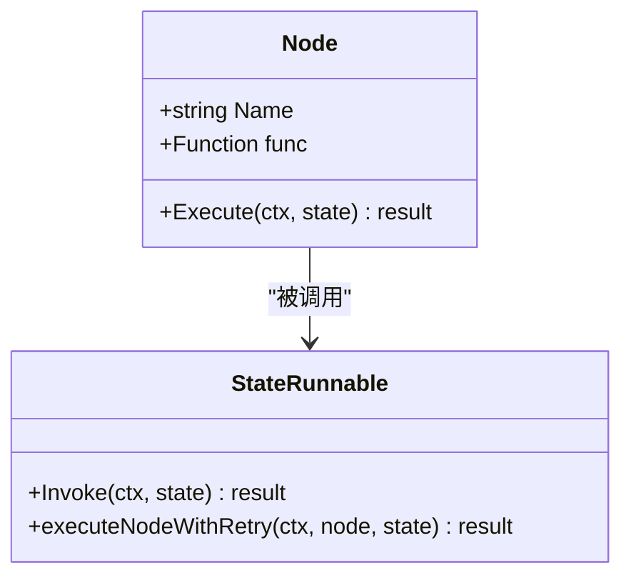

**图表来源**
- [graph.go](file://graph/graph.go#L52-L60)
- [state_graph.go](file://graph/state_graph.go#L99-L102)

#### 节点特性

1. **唯一标识**: 每个节点必须有唯一的名称
2. **函数绑定**: 关联具体的处理逻辑
3. **状态感知**: 接收当前状态作为输入
4. **并行执行**: 支持多节点并发执行

### 边（Edge）

边定义了节点之间的连接关系，控制数据流向和执行顺序。

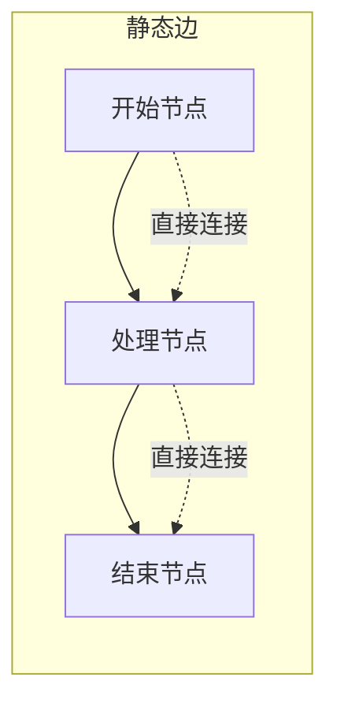

**图表来源**
- [graph.go](file://graph/graph.go#L62-L70)
- [state_graph.go](file://graph/state_graph.go#L67-L71)

#### 边类型

1. **静态边**: 预定义的固定连接关系
2. **条件边**: 基于状态动态决定的连接
3. **扇出边**: 从单个节点到多个目标节点的连接

### 条件边（Conditional Edge）

条件边允许根据运行时状态动态选择下一个执行路径。

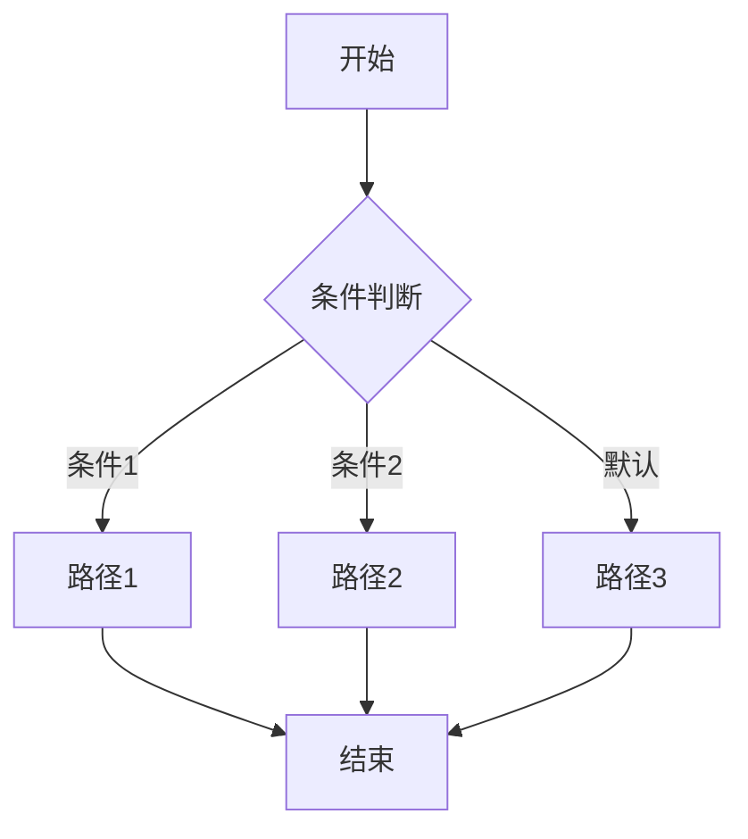

**图表来源**
- [state_graph.go](file://graph/state_graph.go#L74-L77)
- [graph.go](file://graph/graph.go#L119-L122)

### 入口点（Entry Point）

入口点定义了图执行的起始位置，是整个工作流的入口。

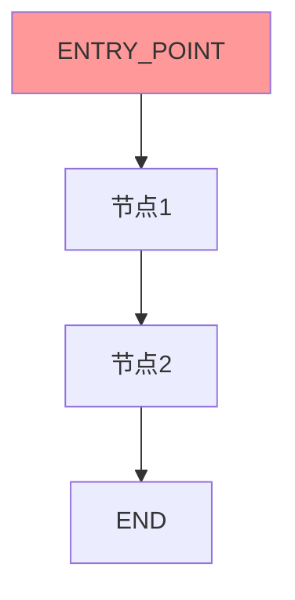

**图表来源**
- [state_graph.go](file://graph/state_graph.go#L79-L82)
- [graph.go](file://graph/graph.go#L125-L128)

**章节来源**
- [graph.go](file://graph/graph.go#L52-L139)
- [state_graph.go](file://graph/state_graph.go#L58-L89)

## StateGraph 设计

### 核心结构

StateGraph 是 LangGraphGo 的核心组件，它封装了整个图的状态管理和执行逻辑。

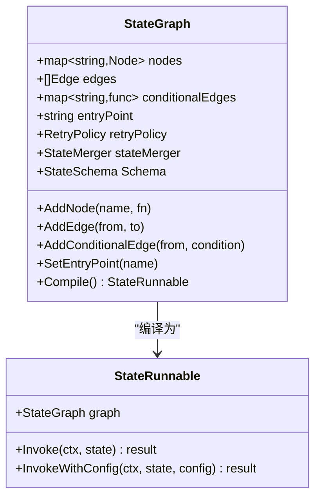

**图表来源**
- [state_graph.go](file://graph/state_graph.go#L11-L32)
- [state_graph.go](file://graph/state_graph.go#L99-L102)

### 状态管理

StateGraph 通过状态模式来管理应用程序状态，确保状态的一致性和可预测性。

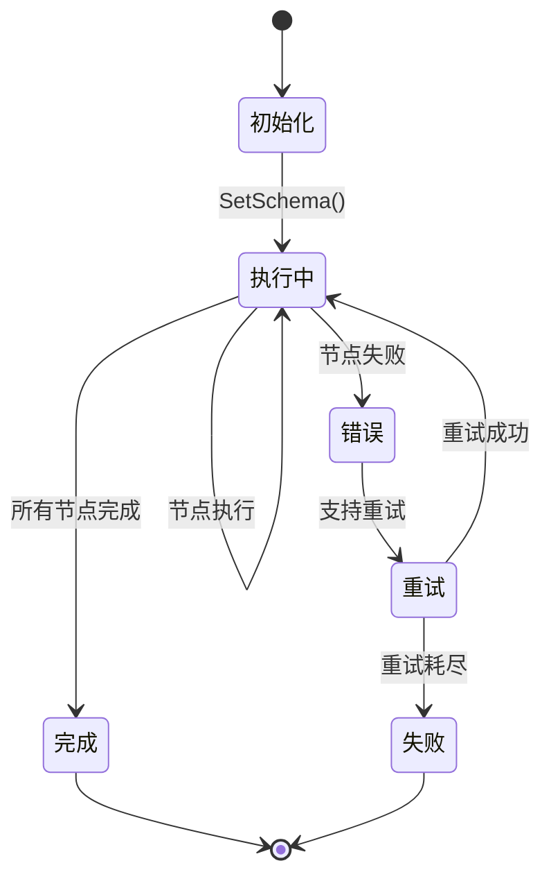

**图表来源**
- [state_graph.go](file://graph/state_graph.go#L115-L296)
- [schema.go](file://graph/schema.go#L12-L19)

### 并发执行机制

StateGraph 支持并行节点执行，通过 WaitGroup 确保所有节点完成后再继续下一步。

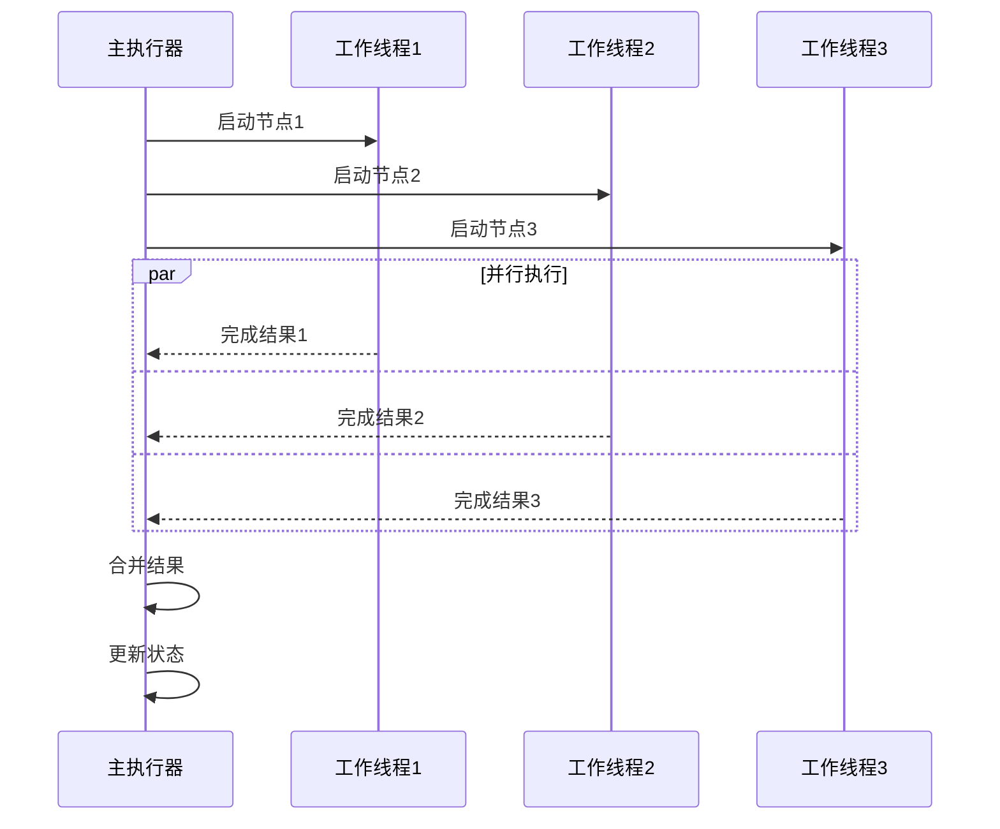

**图表来源**
- [state_graph.go](file://graph/state_graph.go#L143-L166)

**章节来源**
- [state_graph.go](file://graph/state_graph.go#L1-L458)

## 状态模式与更新机制

### StateSchema 接口

StateSchema 定义了状态的结构和更新逻辑，提供了类型安全的状态管理。

```mermaid
classDiagram
class StateSchema {
<<interface>>
+Init() interface{}
+Update(current, new) interface{}
}
class CleaningStateSchema {
<<interface>>
+Cleanup(state) interface{}
}
class MapSchema {
+map~string,Reducer~ Reducers
+map~string,bool~ EphemeralKeys
+RegisterReducer(key, reducer)
+RegisterChannel(key, reducer, isEphemeral)
+Init() interface{}
+Update(current, new) interface{}
+Cleanup(state) interface{}
}
StateSchema <|-- CleaningStateSchema
StateSchema <|-- MapSchema
```

**图表来源**
- [schema.go](file://graph/schema.go#L12-L27)
- [schema.go](file://graph/schema.go#L29-L42)

### Reducer 函数

Reducer 定义了如何将新状态值合并到现有状态中。

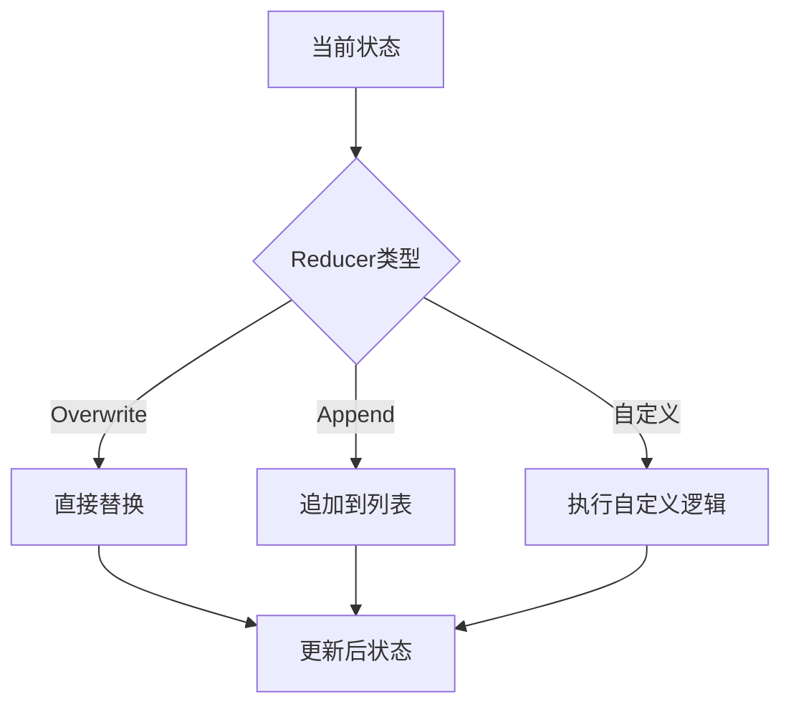

**图表来源**
- [schema.go](file://graph/schema.go#L8-L11)
- [schema.go](file://graph/schema.go#L141-L186)

### 状态更新流程

状态更新遵循严格的合并规则，确保数据一致性。

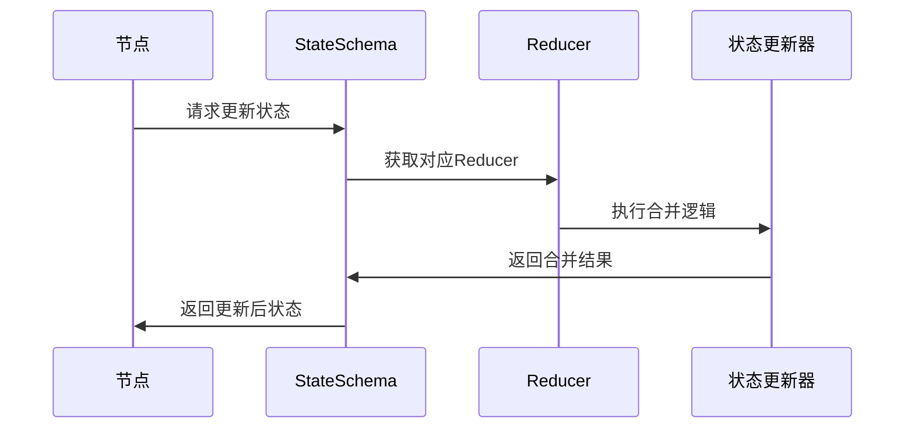

**图表来源**
- [schema.go](file://graph/schema.go#L62-L99)
- [state_graph.go](file://graph/state_graph.go#L200-L216)

### 通道与临时状态

MapSchema 支持通道概念，可以定义哪些键是临时的，在每步执行后自动清理。

**章节来源**
- [schema.go](file://graph/schema.go#L1-L186)

## 持久化检查点

### 检查点存储接口

检查点系统提供了可靠的状态持久化机制，支持容错和恢复。

```mermaid
classDiagram
class CheckpointStore {
<<interface>>
+Save(ctx, checkpoint) error
+Load(ctx, id) Checkpoint
+List(ctx, executionID) []Checkpoint
+Delete(ctx, id) error
+Clear(ctx, executionID) error
}
class Checkpoint {
+string ID
+string NodeName
+interface{} State
+map~string,interface{}~ Metadata
+time.Time Timestamp
+int Version
}
class MemoryCheckpointStore {
+map~string,Checkpoint~ checkpoints
+sync.RWMutex mutex
+Save(ctx, checkpoint) error
+Load(ctx, id) Checkpoint
+List(ctx, executionID) []Checkpoint
+Delete(ctx, id) error
+Clear(ctx, executionID) error
}
class CheckpointableRunnable {
+ListenableRunnable runnable
+CheckpointConfig config
+string executionID
+SaveCheckpoint(ctx, nodeName, state) error
+LoadCheckpoint(ctx, id) Checkpoint
+ListCheckpoints(ctx) []Checkpoint
+ResumeFromCheckpoint(ctx, id) interface{}
+GetState(ctx, config) StateSnapshot
+UpdateState(ctx, config, values, asNode) Config
}
CheckpointStore <|-- MemoryCheckpointStore
CheckpointStore <-- Checkpoint
CheckpointableRunnable --> CheckpointStore
```

**图表来源**
- [checkpointing.go](file://graph/checkpointing.go#L23-L38)
- [checkpointing.go](file://graph/checkpointing.go#L12-L20)
- [checkpointing.go](file://graph/checkpointing.go#L40-L51)

### 自动检查点机制

检查点系统支持自动保存和手动保存两种模式。

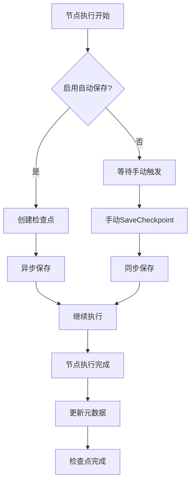

**图表来源**
- [checkpointing.go](file://graph/checkpointing.go#L297-L330)
- [checkpointing.go](file://graph/checkpointing.go#L230-L251)

### 恢复机制

检查点系统支持从中断点恢复执行，提供强大的容错能力。

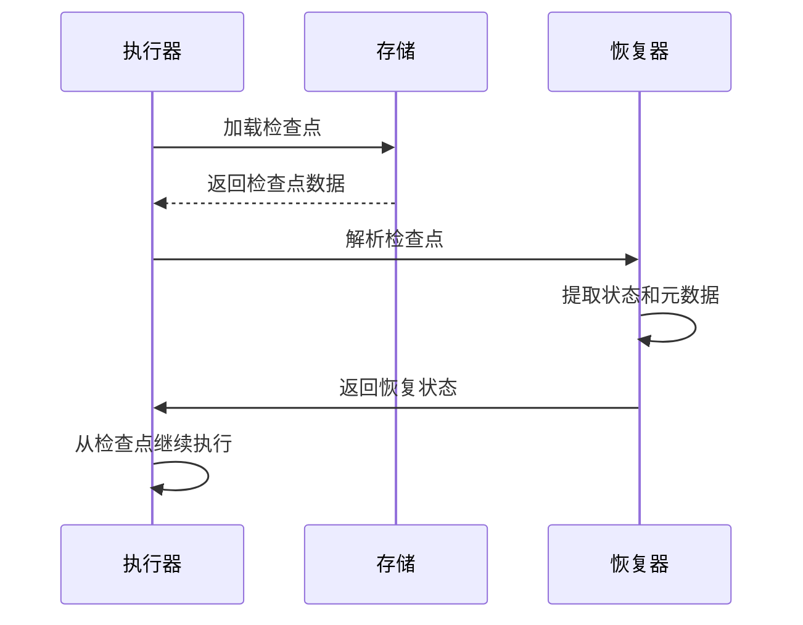

**图表来源**
- [checkpointing.go](file://graph/checkpointing.go#L279-L290)
- [checkpointing.go](file://graph/checkpointing.go#L397-L463)

### 状态快照

StateSnapshot 提供了完整的状态视图，包括时间戳、元数据和配置信息。

**章节来源**
- [checkpointing.go](file://graph/checkpointing.go#L1-L560)

## 流式输出与监听器

### 监听器架构

监听器系统提供了事件驱动的可观测性机制，支持多种事件类型的捕获和处理。

```mermaid
classDiagram
class NodeListener {
<<interface>>
+OnNodeEvent(ctx, event, nodeName, state, err)
}
class ListenableNode {
+Node Node
+[]NodeListener listeners
+sync.RWMutex mutex
+AddListener(listener)
+RemoveListener(listener)
+NotifyListeners(ctx, event, state, err)
+Execute(ctx, state) result
}
class StreamingListener {
+chan~StreamEvent~ eventChan
+StreamConfig config
+int droppedEvents
+bool closed
+emitEvent(event)
+shouldEmit(event) bool
+handleBackpressure()
}
class StreamEvent {
+time.Time Timestamp
+string NodeName
+NodeEvent Event
+interface{} State
+error Error
+map~string,interface{}~ Metadata
+time.Duration Duration
}
NodeListener <|-- StreamingListener
ListenableNode --> NodeListener : "通知"
StreamingListener --> StreamEvent : "生成"
```

**图表来源**
- [listeners.go](file://graph/listeners.go#L51-L55)
- [listeners.go](file://graph/listeners.go#L89-L102)
- [streaming.go](file://graph/streaming.go#L66-L70)
- [streaming.go](file://graph/streaming.go#L66-L87)

### 事件类型

系统定义了丰富的事件类型来覆盖各种执行场景。

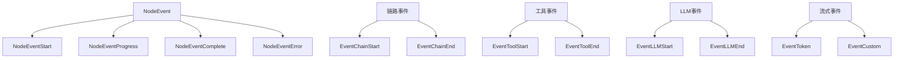

**图表来源**
- [listeners.go](file://graph/listeners.go#L10-L49)

### 流式模式

流式输出支持多种模式，满足不同的监控和调试需求。

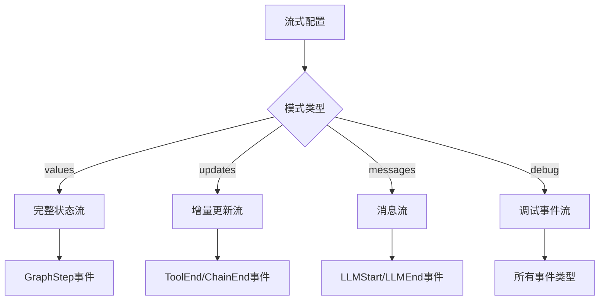

**图表来源**
- [streaming.go](file://graph/streaming.go#L9-L21)
- [streaming.go](file://graph/streaming.go#L112-L133)

### 背压处理

流式系统实现了智能的背压处理机制，防止快速生产者淹没消费者。

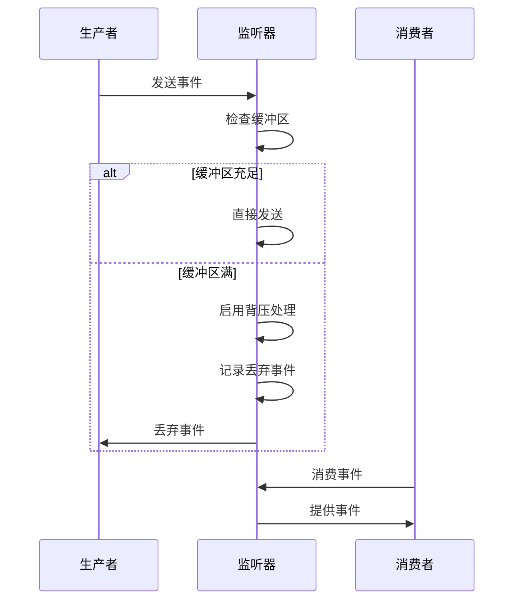

**图表来源**
- [streaming.go](file://graph/streaming.go#L84-L109)
- [streaming.go](file://graph/streaming.go#L252-L268)

**章节来源**
- [listeners.go](file://graph/listeners.go#L1-L335)
- [streaming.go](file://graph/streaming.go#L1-L476)

## 错误处理与重试策略

### 重试策略配置

LangGraphGo 提供了灵活的错误处理和重试机制。

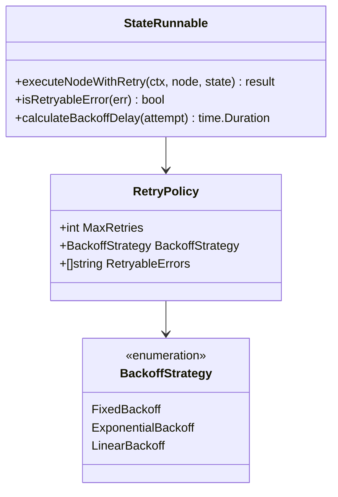

**图表来源**
- [state_graph.go](file://graph/state_graph.go#L34-L48)
- [state_graph.go](file://graph/state_graph.go#L397-L458)

### 重试算法

系统支持多种退避策略来优化重试行为。

```mermaid
flowchart TD
A[节点执行失败] --> B{是否可重试?}
B --> |否| C[返回最终错误]
B --> |是| D{达到最大重试次数?}
D --> |是| C
D --> |否| E{退避策略}
E --> |Fixed| F[固定延迟1秒]
E --> |Exponential| G[指数退避: 1s, 2s, 4s...]
E --> |Linear| H[线性退避: 1s, 2s, 3s...]
F --> I[等待延迟]
G --> I
H --> I
I --> J[重新执行节点]
J --> K{执行成功?}
K --> |是| L[返回结果]
K --> |否| D
```

**图表来源**
- [state_graph.go](file://graph/state_graph.go#L299-L339)
- [state_graph.go](file://graph/state_graph.go#L375-L395)

### 错误分类

系统能够智能地识别和处理不同类型的错误。

```mermaid
graph TD
A[错误发生] --> B{错误类型}
B --> |网络错误| C[可重试]
B --> |认证错误| D[不可重试]
B --> |超时错误| C
B --> |业务逻辑错误| D
C --> E[应用重试策略]
D --> F[立即失败]
```

**图表来源**
- [state_graph.go](file://graph/state_graph.go#L341-L355)

**章节来源**
- [state_graph.go](file://graph/state_graph.go#L34-L395)

## 总结

LangGraphGo 的核心概念构成了一个强大而灵活的工作流引擎，其主要特点包括：

### 架构优势

1. **模块化设计**: 清晰的职责分离，便于扩展和维护
2. **类型安全**: 强类型的状态管理和事件处理
3. **并发友好**: 内置并行执行和状态同步机制
4. **可观测性**: 完整的监听器和流式输出系统

### 核心价值

1. **容错能力**: 检查点系统提供可靠的错误恢复
2. **可调试性**: 丰富的事件系统支持深度调试
3. **可扩展性**: 插件式的监听器和状态管理
4. **性能优化**: 智能的重试和背压处理

### 应用场景

LangGraphGo 特别适合以下应用场景：
- 复杂的 AI 工作流处理
- 数据管道和 ETL 系统
- 微服务编排和协调
- 实时数据处理和分析

通过深入理解这些核心概念，开发者可以更好地利用 LangGraphGo 构建健壮、可维护的应用程序。