# 事件通道与结果处理

<cite>
**本文档中引用的文件**
- [streaming.go](file://graph/streaming.go)
- [listeners.go](file://graph/listeners.go)
- [builtin_listeners.go](file://graph/builtin_listeners.go)
- [main.go](file://examples/streaming_pipeline/main.go)
- [main.go](file://examples/streaming_modes/main.go)
- [main.go](file://examples/listeners/main.go)
</cite>

## 目录
1. [简介](#简介)
2. [StreamResult 结构体概述](#streamresult-结构体概述)
3. [核心通道详解](#核心通道详解)
4. [事件消费机制](#事件消费机制)
5. [结果处理流程](#结果处理流程)
6. [错误处理策略](#错误处理策略)
7. [流式执行结束检测](#流式执行结束检测)
8. [取消机制](#取消机制)
9. [实际应用示例](#实际应用示例)
10. [最佳实践](#最佳实践)
11. [总结](#总结)

## 简介

LangGraph Go 提供了强大的流式执行能力，通过 `StreamResult` 结构体暴露的四个核心通道，开发者可以实现实时的异步流式处理。这种设计模式特别适用于需要实时反馈的场景，如长文本生成、复杂数据处理管道等。

`StreamResult` 结构体是流式执行的核心组件，它封装了四个专门的通道：
- `Events`：实时事件通道
- `Result`：最终结果通道  
- `Errors`：错误信息通道
- `Done`：完成通知通道

以及一个取消函数 `Cancel`，用于主动终止流式执行。

## StreamResult 结构体概述

`StreamResult` 是流式执行的结果容器，包含了所有必要的通信通道和控制机制：

```mermaid
classDiagram
class StreamResult {
+Events <-chan StreamEvent
+Result <-chan interface{}
+Errors <-chan error
+Done <-chan struct{}
+Cancel context.CancelFunc
}
class StreamEvent {
+Timestamp time.Time
+NodeName string
+Event NodeEvent
+State interface{}
+Error error
+Metadata map[string]interface{}
+Duration time.Duration
}
class StreamingListener {
+eventChan chan<- StreamEvent
+config StreamConfig
+emitEvent(event StreamEvent)
+shouldEmit(event StreamEvent) bool
}
StreamResult --> StreamEvent : "包含"
StreamingListener --> StreamEvent : "生成"
StreamResult --> StreamingListener : "使用"
```

**图表来源**
- [streaming.go](file://graph/streaming.go#L48-L64)
- [listeners.go](file://graph/listeners.go#L65-L87)

**章节来源**
- [streaming.go](file://graph/streaming.go#L48-L64)

## 核心通道详解

### Events 通道：实时事件流

`Events` 通道是流式执行中最重要也是最活跃的通道，它持续不断地向消费者提供实时的节点执行信息。

#### 特性
- **类型**：`<-chan StreamEvent`
- **用途**：接收实时的节点执行事件
- **行为**：在执行过程中持续发送事件，直到执行完成
- **缓冲**：可配置的缓冲区大小

#### 事件类型
`StreamEvent` 包含以下关键信息：
- **时间戳**：事件发生的时间
- **节点名称**：触发事件的节点标识
- **事件类型**：具体的事件状态（开始、完成、错误等）
- **当前状态**：节点执行时的状态信息
- **错误信息**：如果事件表示错误，则包含具体错误
- **元数据**：额外的事件相关信息

### Result 通道：最终结果传递

`Result` 通道负责传递流式执行的最终结果。

#### 特性
- **类型**：`<-chan interface{}`
- **用途**：接收执行完成后的最终结果
- **行为**：只发送一次，执行完成后关闭
- **缓冲**：单个元素缓冲区

#### 使用场景
- 获取计算的最终输出
- 验证执行是否成功
- 后续处理逻辑的输入

### Errors 通道：错误信息收集

`Errors` 通道专门用于报告执行过程中出现的任何错误。

#### 特性
- **类型**：`<-chan error`
- **用途**：接收执行过程中的错误信息
- **行为**：错误发生时发送，执行完成后关闭
- **缓冲**：单个元素缓冲区

#### 错误处理策略
- **及时捕获**：错误发生时立即通知
- **错误分类**：区分不同类型的错误
- **恢复机制**：基于错误信息决定后续操作

### Done 通道：执行完成信号

`Done` 通道是一个特殊的通道，当流式执行完成时会被关闭。

#### 特性
- **类型**：`<-chan struct{}`
- **用途**：通知执行完成
- **行为**：执行完成后自动关闭
- **用途**：同步点，用于检测执行结束

**章节来源**
- [streaming.go](file://graph/streaming.go#L48-L64)

## 事件消费机制

### for range 循环消费 Events 通道

消费 `Events` 通道的标准模式是使用 `for range` 循环，这种方式能够优雅地处理通道关闭的情况：

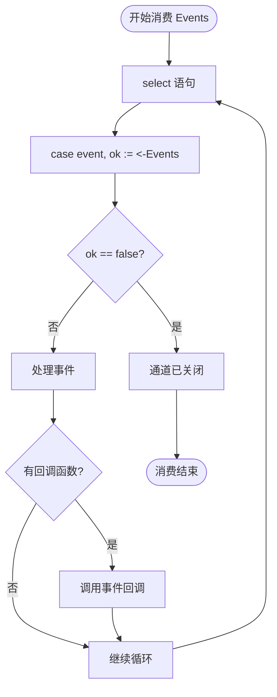

**图表来源**
- [streaming.go](file://graph/streaming.go#L430-L442)

### 事件回调函数

事件回调函数是处理实时事件的核心机制，它允许开发者自定义事件处理逻辑：

#### 回调签名
```go
func(event StreamEvent)
```

#### 常见处理模式
- **日志记录**：记录事件时间和类型
- **UI 更新**：更新用户界面状态
- **指标收集**：统计执行性能
- **业务逻辑**：触发特定业务动作

### 事件过滤与处理

`StreamingListener` 内置了事件过滤机制，根据配置的 `StreamMode` 过滤事件：

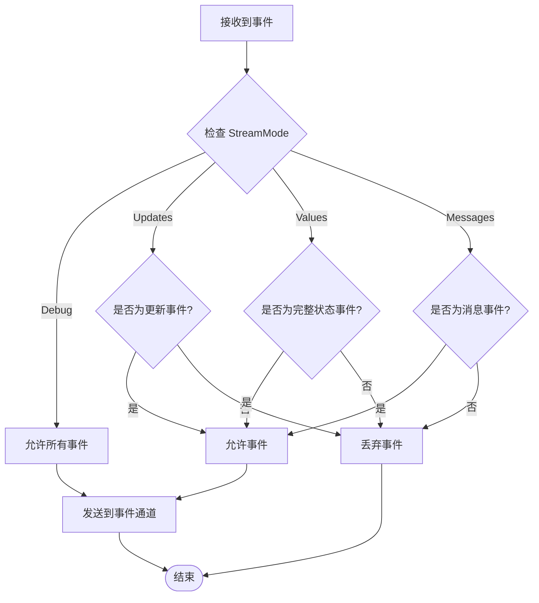

**图表来源**
- [streaming.go](file://graph/streaming.go#L112-L132)

**章节来源**
- [streaming.go](file://graph/streaming.go#L430-L442)
- [streaming.go](file://graph/streaming.go#L112-L132)

## 结果处理流程

### Result 通道消费

`Result` 通道的消费相对简单，因为它只发送一次最终结果：

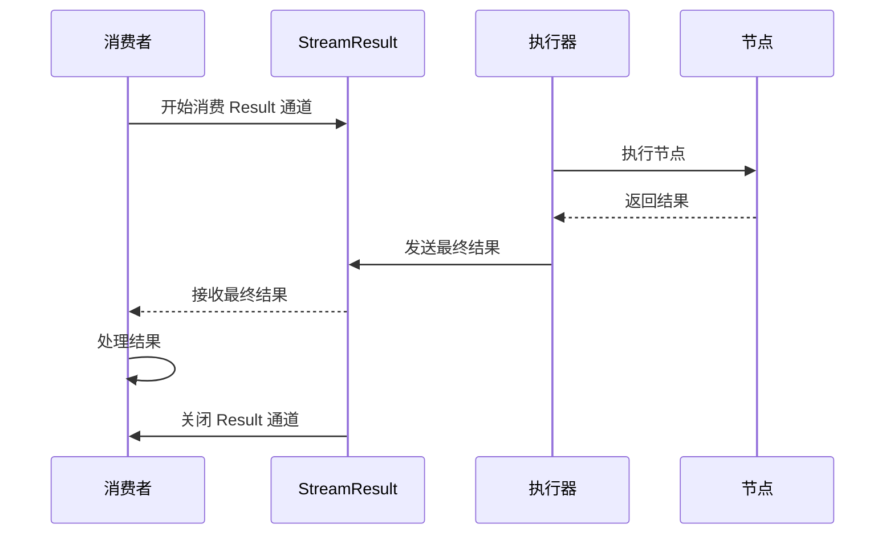

**图表来源**
- [streaming.go](file://graph/streaming.go#L444-L448)

### 结果回调函数

结果回调函数提供了处理最终结果的统一接口：

#### 回调签名
```go
func(result interface{}, err error)
```

#### 处理逻辑
- **结果验证**：检查结果的有效性
- **错误处理**：处理执行过程中的错误
- **后续操作**：基于结果执行后续逻辑

### 异步处理模式

`ExecuteWithCallback` 方法展示了异步处理的最佳实践：

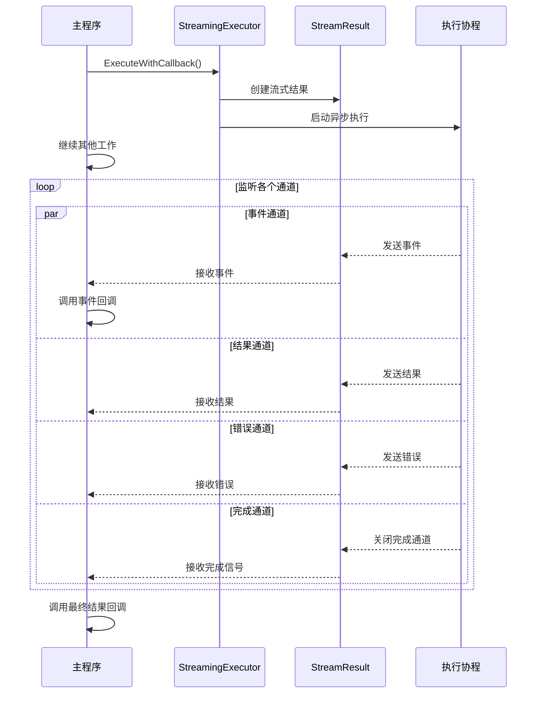

**图表来源**
- [streaming.go](file://graph/streaming.go#L416-L464)

**章节来源**
- [streaming.go](file://graph/streaming.go#L444-L448)
- [streaming.go](file://graph/streaming.go#L416-L464)

## 错误处理策略

### Errors 通道监控

错误处理是流式执行的重要组成部分，通过专门的错误通道可以实现健壮的错误处理机制：

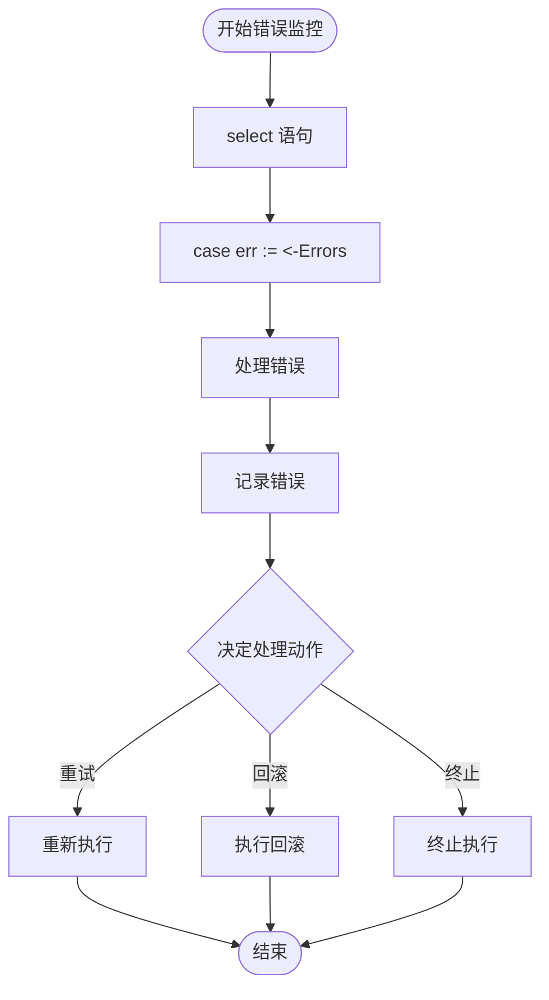

**图表来源**
- [streaming.go](file://graph/streaming.go#L450-L454)

### 错误类型分类

系统支持多种错误类型的处理：

#### 执行错误
- **节点错误**：特定节点执行失败
- **连接错误**：外部服务连接问题
- **资源错误**：内存、磁盘等资源不足

#### 业务错误
- **验证错误**：输入数据不符合要求
- **权限错误**：访问权限不足
- **业务规则错误**：违反业务逻辑

### 错误恢复机制

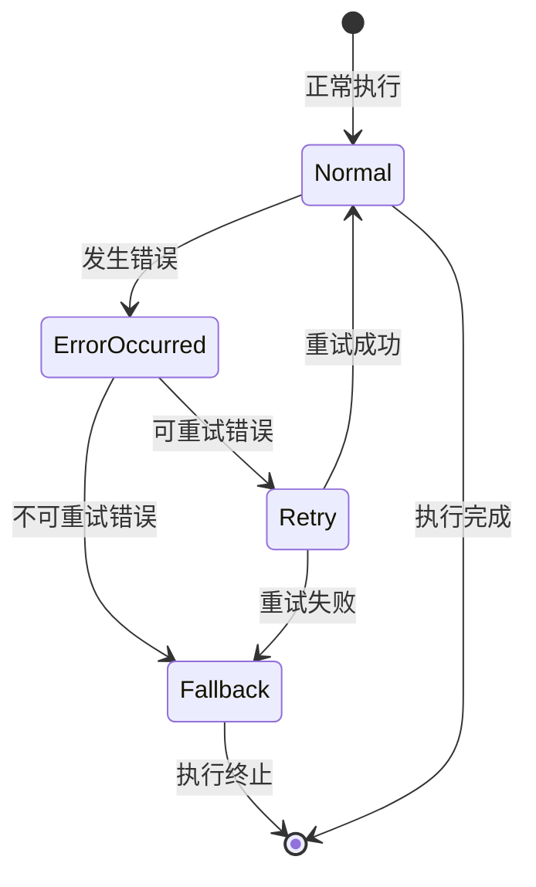

**章节来源**
- [streaming.go](file://graph/streaming.go#L450-L454)

## 流式执行结束检测

### Done 通道的作用

`Done` 通道是检测流式执行结束的关键机制，它提供了可靠的同步点：

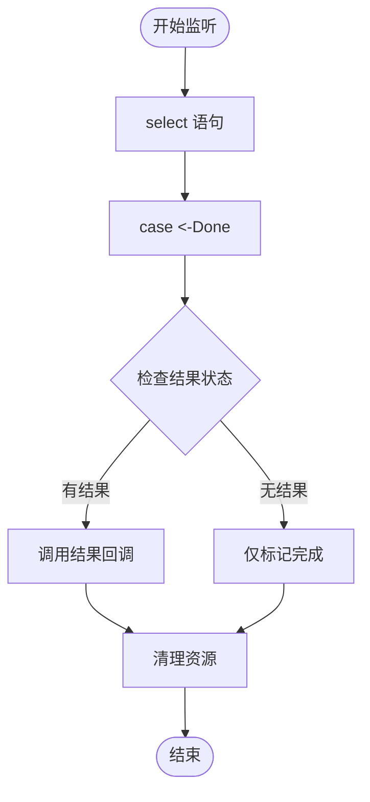

**图表来源**
- [streaming.go](file://graph/streaming.go#L455-L459)

### 综合结束检测

系统采用多通道协调的方式来确保正确检测执行结束：

#### 检测条件
- **事件通道关闭**：所有事件发送完毕
- **结果通道关闭**：最终结果已发送
- **错误通道关闭**：错误信息已发送
- **Done 通道关闭**：执行完成信号

#### 同步机制
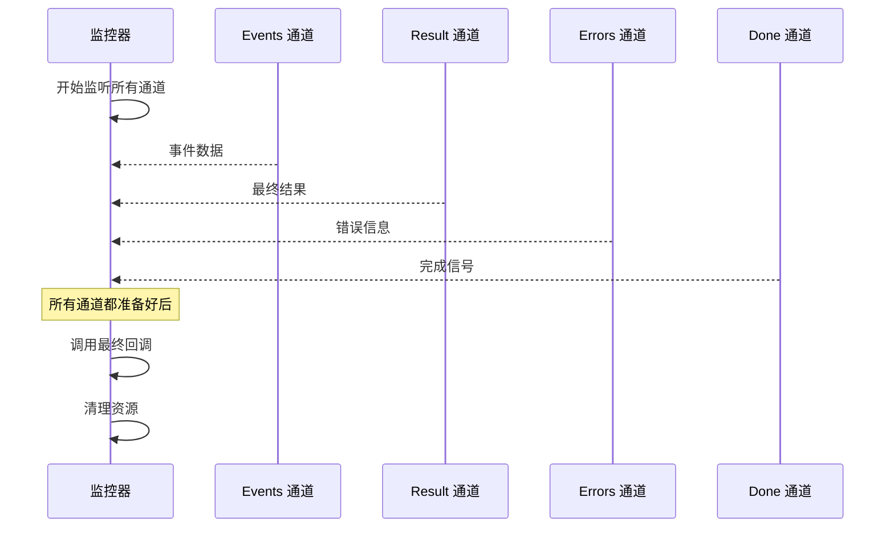

**图表来源**
- [streaming.go](file://graph/streaming.go#L430-L459)

**章节来源**
- [streaming.go](file://graph/streaming.go#L455-L459)

## 取消机制

### Cancel 函数的使用

`Cancel` 函数提供了主动终止流式执行的能力，这对于响应用户请求或资源管理至关重要：

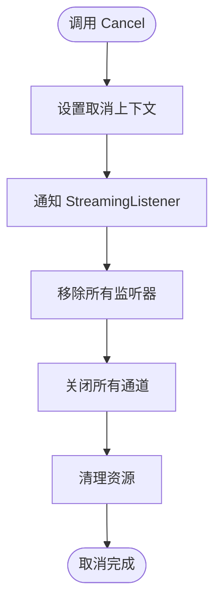

**图表来源**
- [streaming.go](file://graph/streaming.go#L424-L424)

### 取消时机选择

#### 自动取消
- **超时**：执行时间超过限制
- **完成**：正常执行完成
- **错误**：发生不可恢复的错误

#### 手动取消
- **用户请求**：用户主动停止
- **资源限制**：系统资源不足
- **业务决策**：业务逻辑要求停止

### 取消安全机制

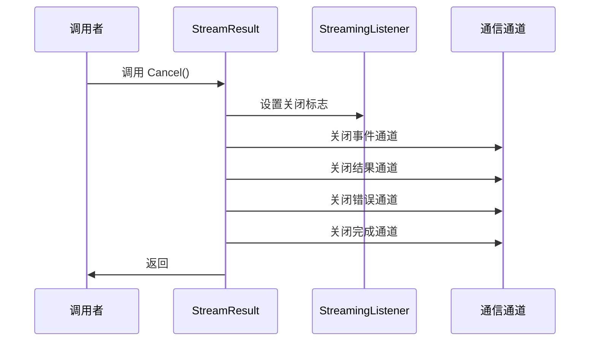

**图表来源**
- [streaming.go](file://graph/streaming.go#L424-L424)

**章节来源**
- [streaming.go](file://graph/streaming.go#L424-L424)

## 实际应用示例

### ExecuteWithCallback 使用示例

`ExecuteWithCallback` 方法展示了如何将事件回调与结果回调结合，实现高效的异步流式处理：

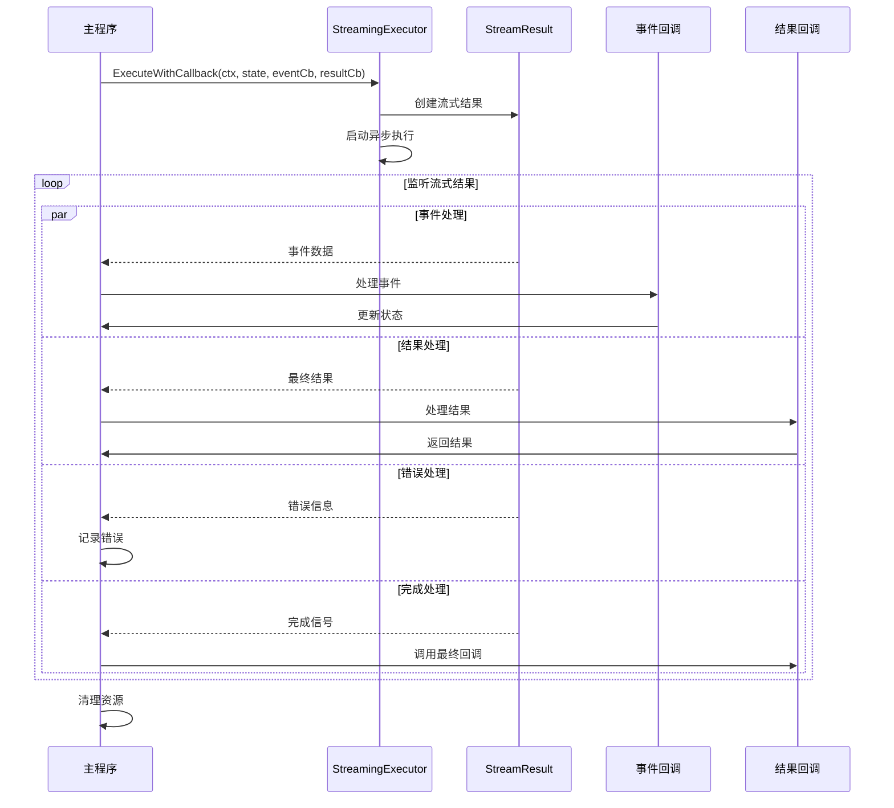

**图表来源**
- [main.go](file://examples/streaming_pipeline/main.go#L52-L69)

### 多监听器集成

在实际应用中，通常会集成多个监听器来满足不同的需求：

#### 监听器类型
- **ProgressListener**：进度跟踪
- **ChatListener**：聊天风格输出
- **MetricsListener**：性能指标收集
- **LoggingListener**：日志记录

#### 集成模式
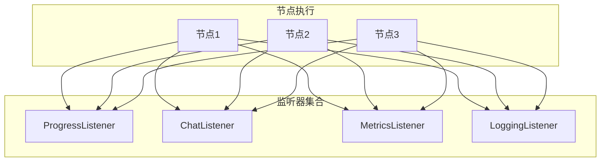

**图表来源**
- [main.go](file://examples/streaming_pipeline/main.go#L32-L42)

### 流式模式配置

不同的应用场景需要不同的流式模式配置：

#### 模式对比
| 模式 | 描述 | 适用场景 | 性能影响 |
|------|------|----------|----------|
| Debug | 发送所有事件 | 开发调试 | 较高 |
| Updates | 发送节点输出 | 进度显示 | 中等 |
| Values | 发送完整状态 | 状态监控 | 较高 |
| Messages | 发送消息内容 | 实时聊天 | 低 |

**章节来源**
- [main.go](file://examples/streaming_pipeline/main.go#L52-L69)
- [main.go](file://examples/streaming_pipeline/main.go#L32-L42)
- [main.go](file://examples/streaming_modes/main.go#L32-L50)

## 最佳实践

### 通道消费模式

#### 1. 使用 select 语句
```go
for {
    select {
    case event, ok := <-streamResult.Events:
        if !ok {
            // 事件通道关闭
            break
        }
        processEvent(event)
        
    case result := <-streamResult.Result:
        handleResult(result)
        
    case err := <-streamResult.Errors:
        handleError(err)
        
    case <-streamResult.Done:
        finalizeExecution()
        return
    }
}
```

#### 2. 错误处理优先级
- **立即处理**：致命错误立即终止
- **延迟处理**：非致命错误累积处理
- **优雅降级**：部分功能失效时的处理

#### 3. 资源清理
```go
defer func() {
    // 确保取消执行
    if streamResult.Cancel != nil {
        streamResult.Cancel()
    }
    
    // 等待所有通道关闭
    // 清理临时资源
}()
```

### 性能优化建议

#### 1. 缓冲区配置
- **小缓冲区**：低延迟，高 CPU 使用
- **大缓冲区**：高吞吐量，可能增加延迟
- **动态调整**：根据负载动态调整

#### 2. 事件过滤
- **合理配置模式**：避免发送不必要的事件
- **批量处理**：合并相似事件减少开销
- **异步处理**：将耗时操作移到后台

#### 3. 并发控制
```go
// 控制并发监听器数量
const maxListeners = 10

// 使用工作池处理事件
workerPool := make(chan struct{}, maxListeners)
```

### 错误处理策略

#### 1. 分层错误处理
- **传输层**：网络、IO 错误
- **业务层**：业务逻辑错误
- **应用层**：用户交互错误

#### 2. 错误恢复机制
- **重试策略**：指数退避、最大重试次数
- **熔断器**：防止级联故障
- **降级服务**：部分功能不可用时的处理

#### 3. 监控与告警
- **错误率监控**：实时监控错误发生频率
- **性能指标**：响应时间、吞吐量等
- **健康检查**：定期检查系统状态

## 总结

`StreamResult` 结构体提供的四个核心通道构成了 LangGraph Go 流式执行的基础架构，它们协同工作实现了高效、可靠的异步处理能力：

### 核心优势
- **实时性**：通过 Events 通道提供实时的节点执行信息
- **可靠性**：Result 和 Errors 通道确保结果和错误的完整传递
- **可控性**：Done 通道和 Cancel 函数提供精确的执行控制
- **灵活性**：支持多种流式模式和自定义回调

### 应用价值
- **用户体验**：提供实时反馈，提升用户满意度
- **系统性能**：异步处理提高系统吞吐量
- **错误处理**：完善的错误处理机制保证系统稳定性
- **开发效率**：清晰的 API 设计降低开发复杂度

### 技术特点
- **Go 原生设计**：充分利用 Go 语言的并发特性
- **类型安全**：强类型定义确保编译时错误检查
- **扩展性强**：支持自定义监听器和回调函数
- **配置灵活**：丰富的配置选项适应不同需求

通过合理使用 `StreamResult` 的各个通道，开发者可以构建出高性能、高可用的流式处理系统，满足现代应用对实时性和可靠性的双重需求。