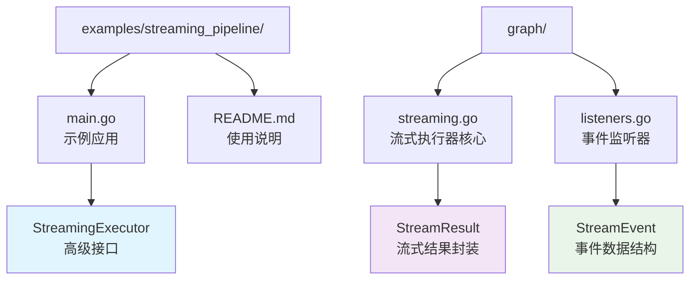
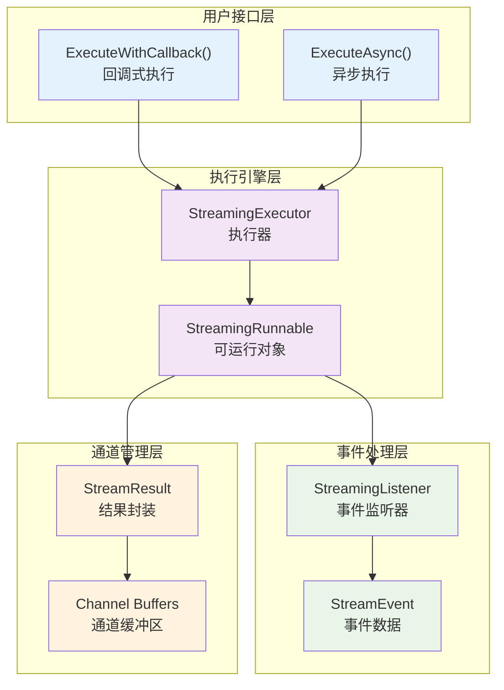
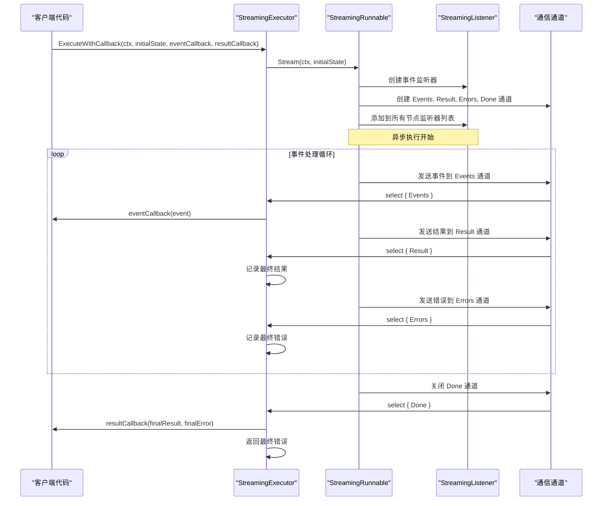
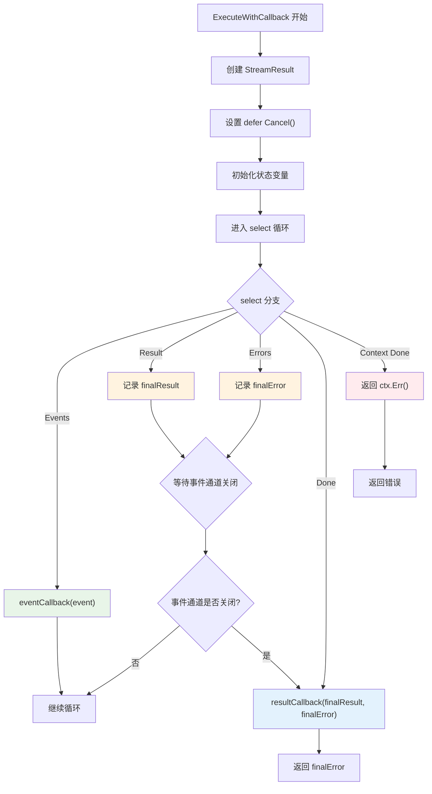
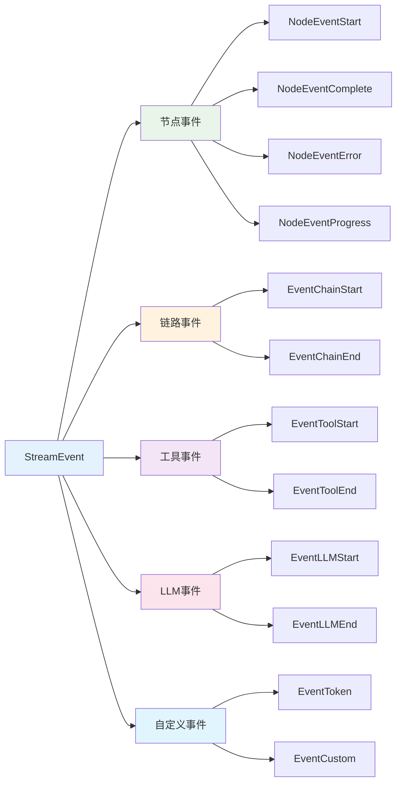
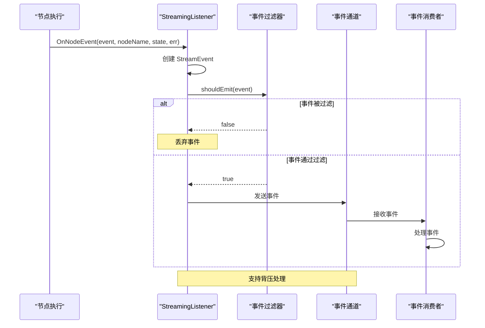
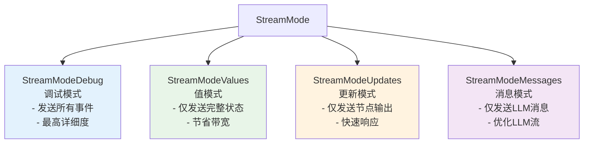
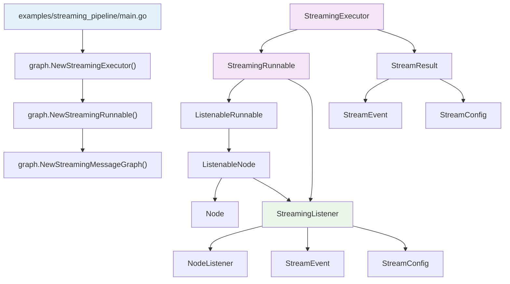

# 流式执行器

<cite>
**本文档中引用的文件**
- [examples/streaming_pipeline/main.go](file://examples/streaming_pipeline/main.go)
- [examples/streaming_pipeline/README.md](file://examples/streaming_pipeline/README.md)
- [graph/streaming.go](file://graph/streaming.go)
- [graph/listeners.go](file://graph/listeners.go)
</cite>

## 目录
1. [简介](#简介)
2. [项目结构](#项目结构)
3. [核心组件](#核心组件)
4. [架构概览](#架构概览)
5. [详细组件分析](#详细组件分析)
6. [依赖关系分析](#依赖关系分析)
7. [性能考虑](#性能考虑)
8. [故障排除指南](#故障排除指南)
9. [结论](#结论)

## 简介

`StreamingExecutor` 是 LangGraphGo 框架中的高级接口，专门设计用于处理异步流式执行场景。它提供了简洁而强大的回调式编程模型，通过封装复杂的通道监听逻辑，使开发者能够轻松处理实时事件和最终结果。

该执行器的核心价值在于：
- **简化异步编程**：通过 `ExecuteWithCallback` 方法封装复杂的 select 逻辑
- **实时事件处理**：支持实时接收和处理流式事件
- **灵活的结果处理**：提供专门的回调机制处理最终结果
- **错误优雅处理**：统一的错误传播和处理机制
- **资源管理**：自动的上下文取消和资源清理

## 项目结构

LangGraphGo 的流式执行器相关文件组织如下：



**图表来源**
- [examples/streaming_pipeline/main.go](file://examples/streaming_pipeline/main.go#L1-L80)
- [graph/streaming.go](file://graph/streaming.go#L402-L476)
- [graph/listeners.go](file://graph/listeners.go#L1-L335)

**章节来源**
- [examples/streaming_pipeline/main.go](file://examples/streaming_pipeline/main.go#L1-L80)
- [examples/streaming_pipeline/README.md](file://examples/streaming_pipeline/README.md#L1-L25)

## 核心组件

### StreamingExecutor 结构体

`StreamingExecutor` 是流式执行器的主要入口点，它封装了对 `StreamingRunnable` 的访问：

```mermaid
classDiagram
class StreamingExecutor {
+runnable *StreamingRunnable
+NewStreamingExecutor(runnable) *StreamingExecutor
+ExecuteWithCallback(ctx, initialState, eventCallback, resultCallback) error
+ExecuteAsync(ctx, initialState) *StreamResult
}
class StreamingRunnable {
+runnable *ListenableRunnable
+config StreamConfig
+Stream(ctx, initialState) *StreamResult
}
class StreamResult {
+Events <-chan StreamEvent
+Result <-chan interface{}
+Errors <-chan error
+Done <-chan struct{}
+Cancel context.CancelFunc
}
StreamingExecutor --> StreamingRunnable : "使用"
StreamingRunnable --> StreamResult : "返回"
```

**图表来源**
- [graph/streaming.go](file://graph/streaming.go#L402-L476)

### StreamResult 数据结构

`StreamResult` 封装了流式执行的所有输出通道，提供了统一的访问接口：

| 字段 | 类型 | 描述 |
|------|------|------|
| Events | <-chan StreamEvent | 实时事件通道，接收运行时事件 |
| Result | <-chan interface{} | 最终结果通道，接收执行完成后的结果 |
| Errors | <-chan error | 错误通道，接收执行过程中发生的错误 |
| Done | <-chan struct{} | 完成信号通道，当流式执行结束时关闭 |
| Cancel | context.CancelFunc | 取消函数，用于主动停止流式执行 |

**章节来源**
- [graph/streaming.go](file://graph/streaming.go#L48-L64)

## 架构概览

流式执行器采用分层架构设计，从底层到顶层依次为：



**图表来源**
- [graph/streaming.go](file://graph/streaming.go#L402-L476)

## 详细组件分析

### ExecuteWithCallback 方法详解

`ExecuteWithCallback` 是流式执行器的核心方法，它封装了复杂的 select 监听逻辑，为开发者提供简洁的回调式编程模型。

#### 方法签名和参数



**图表来源**
- [graph/streaming.go](file://graph/streaming.go#L414-L464)

#### 复杂 select 逻辑的封装

`ExecuteWithCallback` 方法内部实现了复杂的 select 逻辑，处理以下情况：

1. **事件通道处理** (`case event, ok := <-streamResult.Events:`)
   - 接收实时事件并调用用户提供的 `eventCallback`
   - 处理通道关闭情况（`!ok`）

2. **结果通道处理** (`case result := <-streamResult.Result:`)
   - 记录最终结果但不立即返回
   - 等待事件通道完全关闭后再处理

3. **错误通道处理** (`case err := <-streamResult.Errors:`)
   - 记录最终错误但不立即返回
   - 等待事件通道完全关闭后再处理

4. **完成信号处理** (`case <-streamResult.Done:`)
   - 所有通道都已关闭时触发
   - 调用 `resultCallback` 处理最终结果

5. **上下文取消处理** (`case <-ctx.Done():`)
   - 处理外部取消信号
   - 返回上下文错误

#### 回调函数的作用域



**图表来源**
- [graph/streaming.go](file://graph/streaming.go#L430-L464)

**章节来源**
- [graph/streaming.go](file://graph/streaming.go#L414-L464)

### ExecuteAsync 方法详解

`ExecuteAsync` 方法提供了更精细的控制，直接返回 `StreamResult` 对象，允许调用者自行管理通道的读取和资源清理。

#### 使用场景对比

| 方法 | 返回值 | 控制粒度 | 适用场景 |
|------|--------|----------|----------|
| `ExecuteWithCallback` | error | 高级 | 简单的事件处理和结果收集 |
| `ExecuteAsync` | *StreamResult | 低级 | 需要自定义事件处理逻辑 |

#### ExecuteAsync 的优势

1. **完全控制权**：调用者可以自定义事件处理逻辑
2. **资源管理灵活性**：可以手动管理通道的关闭时机
3. **并发处理能力**：可以在多个 goroutine 中处理不同通道
4. **错误处理定制**：可以根据业务需求定制错误处理策略

**章节来源**
- [graph/streaming.go](file://graph/streaming.go#L467-L469)

### StreamEvent 事件系统

流式执行器基于丰富的事件系统，支持多种类型的事件：

#### 事件类型分类



**图表来源**
- [graph/listeners.go](file://graph/listeners.go#L10-L49)

#### 事件处理流程



**图表来源**
- [graph/streaming.go](file://graph/streaming.go#L84-L133)

**章节来源**
- [graph/listeners.go](file://graph/listeners.go#L65-L87)
- [graph/streaming.go](file://graph/streaming.go#L84-L133)

### StreamConfig 配置系统

流式执行器提供了灵活的配置选项，支持不同的流式模式和性能调优：

#### 配置参数详解

| 参数 | 类型 | 默认值 | 描述 |
|------|------|--------|------|
| BufferSize | int | 1000 | 事件通道缓冲区大小 |
| EnableBackpressure | bool | true | 是否启用背压处理 |
| MaxDroppedEvents | int | 100 | 最大丢弃事件数 |
| Mode | StreamMode | StreamModeDebug | 流式模式 |

#### StreamMode 模式说明



**图表来源**
- [graph/streaming.go](file://graph/streaming.go#L9-L21)

**章节来源**
- [graph/streaming.go](file://graph/streaming.go#L23-L46)

## 依赖关系分析

流式执行器的依赖关系体现了清晰的分层架构：



**图表来源**
- [examples/streaming_pipeline/main.go](file://examples/streaming_pipeline/main.go#L1-L80)
- [graph/streaming.go](file://graph/streaming.go#L402-L476)

**章节来源**
- [examples/streaming_pipeline/main.go](file://examples/streaming_pipeline/main.go#L1-L80)
- [graph/streaming.go](file://graph/streaming.go#L402-L476)

## 性能考虑

### 通道缓冲区优化

流式执行器通过合理的缓冲区配置来平衡内存使用和性能：

- **默认缓冲区大小**：1000个事件
- **动态调整**：根据实际负载调整缓冲区大小
- **背压处理**：在高负载情况下优雅降级

### 并发处理策略

- **异步事件通知**：使用 goroutine 处理事件通知
- **无锁设计**：关键路径使用原子操作
- **资源池化**：重用事件对象减少 GC 压力

### 内存管理

- **及时清理**：执行完成后自动清理资源
- **上下文取消**：支持优雅的中断机制
- **通道关闭**：确保所有通道正确关闭

## 故障排除指南

### 常见问题及解决方案

#### 1. 事件丢失问题

**症状**：某些事件没有被接收到

**原因分析**：
- 通道缓冲区溢出
- 事件过滤器配置不当
- 监听器注册失败

**解决方案**：
```go
// 增加缓冲区大小
config := graph.DefaultStreamConfig()
config.BufferSize = 5000
config.EnableBackpressure = true

// 设置合适的流式模式
config.Mode = graph.StreamModeUpdates // 仅接收重要事件
```

#### 2. 内存泄漏问题

**症状**：长时间运行后内存持续增长

**原因分析**：
- 未正确调用 `Cancel()` 函数
- 事件处理逻辑阻塞
- 上下文未正确传递

**解决方案**：
```go
executor := graph.NewStreamingExecutor(streamingRunnable)

// 使用 defer 确保资源清理
defer func() {
    if streamResult != nil {
        streamResult.Cancel()
    }
}()

// 或者使用 context 包含取消功能
ctx, cancel := context.WithTimeout(context.Background(), 30*time.Second)
defer cancel()

err := executor.ExecuteWithCallback(ctx, initialState, eventCallback, resultCallback)
```

#### 3. 性能瓶颈问题

**症状**：事件处理延迟过高

**原因分析**：
- 事件处理逻辑过于复杂
- 并发度不足
- 网络或 I/O 瓶颈

**解决方案**：
```go
// 使用 ExecuteAsync 获取更多控制权
streamResult := executor.ExecuteAsync(ctx, initialState)

// 自定义并发处理
go func() {
    for event := range streamResult.Events {
        // 异步处理事件
        go processEventAsync(event)
    }
}()

// 监控错误和完成状态
go func() {
    if err := <-streamResult.Errors; err != nil {
        log.Printf("执行错误: %v", err)
    }
    <-streamResult.Done
    log.Println("执行完成")
}()
```

**章节来源**
- [graph/streaming.go](file://graph/streaming.go#L25-L46)
- [examples/streaming_pipeline/main.go](file://examples/streaming_pipeline/main.go#L52-L70)

## 结论

`StreamingExecutor` 高级接口为 LangGraphGo 提供了强大而灵活的流式执行能力。通过封装复杂的通道监听逻辑，它为开发者提供了简洁的回调式编程模型，同时保留了足够的灵活性以满足各种应用场景的需求。

### 主要优势

1. **简化开发**：通过 `ExecuteWithCallback` 提供开箱即用的事件处理
2. **灵活控制**：`ExecuteAsync` 允许深度定制事件处理逻辑
3. **丰富事件**：完整的事件系统支持各种监控和调试需求
4. **性能优化**：智能的缓冲区管理和背压处理
5. **错误处理**：统一的错误传播和优雅的资源清理

### 最佳实践建议

1. **选择合适的执行方式**：简单场景使用 `ExecuteWithCallback`，复杂场景使用 `ExecuteAsync`
2. **合理配置流式模式**：根据实际需求选择合适的 `StreamMode`
3. **注意资源管理**：始终确保正确清理资源和处理上下文取消
4. **监控性能指标**：关注事件处理延迟和内存使用情况
5. **测试异常场景**：验证错误处理和资源清理的正确性

通过合理使用 `StreamingExecutor`，开发者可以构建高性能、可维护的流式处理应用程序，充分利用 LangGraphGo 框架的强大功能。