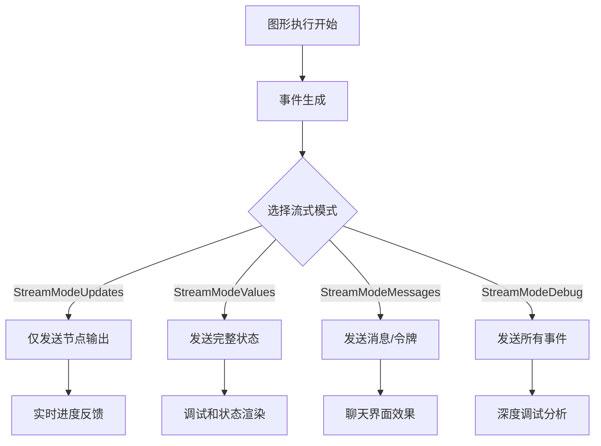
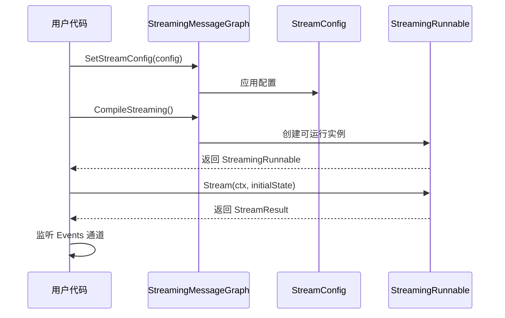
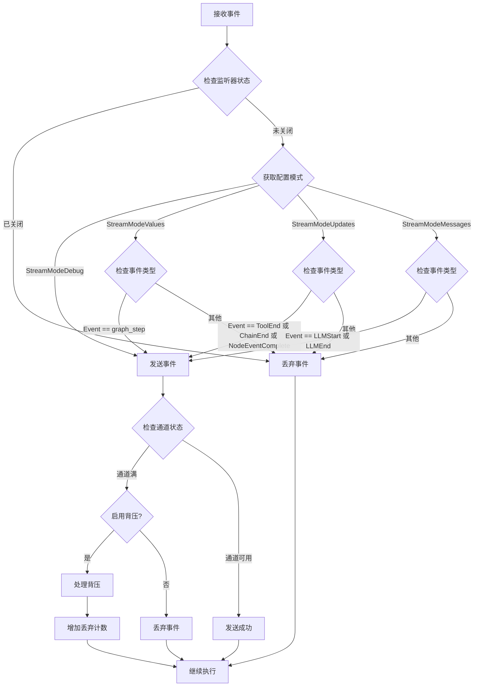
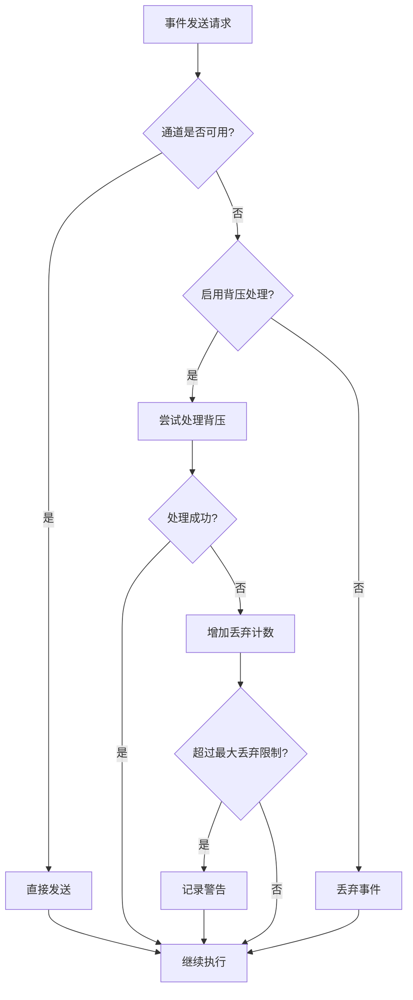

# 流式模式

<cite>
**本文档中引用的文件**
- [examples/streaming_modes/main.go](file://examples/streaming_modes/main.go)
- [examples/streaming_modes/README.md](file://examples/streaming_modes/README.md)
- [examples/streaming_pipeline/main.go](file://examples/streaming_pipeline/main.go)
- [graph/streaming.go](file://graph/streaming.go)
- [graph/streaming_test.go](file://graph/streaming_test.go)
- [graph/callbacks.go](file://graph/callbacks.go)
- [graph/listeners.go](file://graph/listeners.go)
</cite>

## 目录
1. [简介](#简介)
2. [流式模式概述](#流式模式概述)
3. [四种流式模式详解](#四种流式模式详解)
4. [架构设计](#架构设计)
5. [配置与使用](#配置与使用)
6. [事件过滤机制](#事件过滤机制)
7. [实际应用示例](#实际应用示例)
8. [性能考虑](#性能考虑)
9. [故障排除指南](#故障排除指南)
10. [总结](#总结)

## 简介

在 LangGraph Go 中，流式模式（Streaming Modes）提供了一种强大而灵活的方式来处理长运行的 LLM 链和复杂代理工作流。传统的批处理方式要求用户等待整个流程完成后才能看到结果，但在许多现代应用场景中，用户期望获得实时反馈。流式模式通过实时事件流的方式，让用户能够在流程执行过程中获得即时的状态更新和进度反馈。

## 流式模式概述

流式模式的核心思想是为不同的使用场景提供不同粒度的事件流视图。系统支持四种主要的流式模式，每种模式都针对特定的应用需求进行了优化：



**图表来源**
- [graph/streaming.go](file://graph/streaming.go#L112-L132)

## 四种流式模式详解

### StreamModeUpdates - 更新模式

**适用场景：** 展示节点执行进度、工具执行状态、链式操作完成情况

**特点：**
- 只发送节点输出（ToolEnd、ChainEnd、NodeEventComplete）
- 提供简洁的执行进度信息
- 适合构建进度指示器和状态监控

**典型用途：**
- 显示"步骤 1 完成"、"工具已执行"等进度信息
- 构建实时状态面板
- 监控长时间运行的操作

**节来源**
- [examples/streaming_modes/main.go](file://examples/streaming_modes/main.go#L32-L35)
- [graph/streaming.go](file://graph/streaming.go#L124-L126)

### StreamModeValues - 值模式

**适用场景：** 调试、完整状态渲染、UI 渲染整个上下文

**特点：**
- 发送每一步后的完整图状态
- 包含完整的状态信息
- 适合调试和状态可视化

**典型用途：**
- 调试复杂的多步骤流程
- 渲染包含完整上下文的用户界面
- 状态快照和历史记录

**节来源**
- [graph/streaming.go](file://graph/streaming.go#L117-L123)
- [graph/streaming_test.go](file://graph/streaming_test.go#L25-L30)

### StreamModeMessages - 消息模式（计划中）

**适用场景：** 类似 ChatGPT 的逐字输出效果

**特点：**
- 发送 LLM 生成的消息和令牌
- 支持打字机效果
- 实现流畅的文本生成体验

**预期功能：**
- 实时显示生成的文本
- 支持中断和恢复生成过程
- 提供自然的对话体验

**节来源**
- [examples/streaming_modes/README.md](file://examples/streaming_modes/README.md#L10-L11)

### StreamModeDebug - 调试模式

**适用场景：** 深度调试、内部事件检查、开发阶段分析

**特点：**
- 发射所有内部事件
- 最详细的执行跟踪
- 用于问题诊断和性能分析

**典型用途：**
- 开发和调试阶段
- 性能瓶颈分析
- 内部流程验证

**节来源**
- [graph/streaming.go](file://graph/streaming.go#L114-L115)

## 架构设计

流式模式的实现采用了分层架构设计，确保了灵活性和可扩展性：

```mermaid
classDiagram
class StreamingRunnable {
+runnable ListenableRunnable
+config StreamConfig
+Stream(ctx, initialState) StreamResult
}
class StreamingListener {
+eventChan chan~StreamEvent~
+config StreamConfig
+mutex sync.RWMutex
+droppedEvents int
+closed bool
+emitEvent(event) void
+shouldEmit(event) bool
+handleBackpressure() void
}
class StreamConfig {
+BufferSize int
+EnableBackpressure bool
+MaxDroppedEvents int
+Mode StreamMode
}
class StreamResult {
+Events chan~StreamEvent~
+Result chan~interface~{}
+Errors chan~error~
+Done chan~struct~{}
+Cancel context.CancelFunc
}
class StreamEvent {
+Timestamp time.Time
+NodeName string
+Event NodeEvent
+State interface{}
+Error error
+Metadata map~string,interface{}
}
StreamingRunnable --> StreamResult : "创建"
StreamingRunnable --> StreamingListener : "使用"
StreamingListener --> StreamEvent : "生成"
StreamConfig --> StreamingListener : "配置"
```

**图表来源**
- [graph/streaming.go](file://graph/streaming.go#L270-L358)
- [graph/streaming.go](file://graph/streaming.go#L66-L82)
- [graph/streaming.go](file://graph/streaming.go#L24-L36)

**节来源**
- [graph/streaming.go](file://graph/streaming.go#L270-L358)

## 配置与使用

### 基本配置

通过 `SetStreamConfig` 方法可以轻松配置不同的流式模式：



**图表来源**
- [examples/streaming_modes/main.go](file://examples/streaming_modes/main.go#L32-L35)
- [graph/streaming.go](file://graph/streaming.go#L382-L389)

### 默认配置

系统提供了合理的默认配置，确保开箱即用：

| 配置项 | 默认值 | 说明 |
|--------|--------|------|
| BufferSize | 1000 | 事件通道缓冲区大小 |
| EnableBackpressure | true | 是否启用背压处理 |
| MaxDroppedEvents | 100 | 最大丢弃事件数量 |
| Mode | StreamModeDebug | 默认调试模式 |

**节来源**
- [graph/streaming.go](file://graph/streaming.go#L38-L46)

## 事件过滤机制

`shouldEmit` 函数是流式模式的核心过滤逻辑，它根据当前配置的模式决定是否发送特定事件：



**图表来源**
- [graph/streaming.go](file://graph/streaming.go#L112-L132)
- [graph/streaming.go](file://graph/streaming.go#L84-L109)

**节来源**
- [graph/streaming.go](file://graph/streaming.go#L112-L132)

## 实际应用示例

### 基础更新模式示例

以下展示了如何使用更新模式来实现实时进度反馈：

**节来源**
- [examples/streaming_modes/main.go](file://examples/streaming_modes/main.go#L15-L54)

### 高级流水线示例

更复杂的流水线配置展示了多种监听器的组合使用：

**节来源**
- [examples/streaming_pipeline/main.go](file://examples/streaming_pipeline/main.go#L12-L80)

### 测试用例分析

通过测试用例可以更好地理解各种模式的行为：

**节来源**
- [graph/streaming_test.go](file://graph/streaming_test.go#L10-L105)

## 性能考虑

### 背压处理

系统实现了智能的背压处理机制，防止内存溢出：



**图表来源**
- [graph/streaming.go](file://graph/streaming.go#L252-L261)

### 缓冲区管理

合理配置缓冲区大小对性能至关重要：

| 场景 | 推荐缓冲区大小 | 说明 |
|------|----------------|------|
| 实时交互 | 100-500 | 快速响应需求 |
| 批处理 | 1000-5000 | 平衡性能和内存 |
| 调试模式 | 5000+ | 记录完整历史 |

**节来源**
- [graph/streaming.go](file://graph/streaming.go#L252-L261)

## 故障排除指南

### 常见问题及解决方案

| 问题 | 可能原因 | 解决方案 |
|------|----------|----------|
| 事件丢失 | 缓冲区太小 | 增加 BufferSize |
| 性能下降 | 启用背压处理 | 调整 MaxDroppedEvents |
| 内存泄漏 | 未正确关闭通道 | 确保调用 Cancel() |
| 模式不生效 | 配置时机错误 | 在 CompileStreaming() 前设置 |

### 调试技巧

1. **使用调试模式**：在开发阶段使用 `StreamModeDebug` 获取最详细的事件流
2. **监控丢弃事件**：通过 `GetDroppedEventsCount()` 检查背压情况
3. **合理配置缓冲区**：根据实际负载调整缓冲区大小
4. **及时清理资源**：确保在不再需要时调用取消函数

**节来源**
- [graph/streaming.go](file://graph/streaming.go#L263-L268)

## 总结

LangGraph Go 的流式模式提供了一个强大而灵活的框架，用于处理各种实时数据流场景。通过四种不同的模式，开发者可以根据具体需求选择最适合的事件流粒度：

- **StreamModeUpdates** 适用于需要简洁进度反馈的应用
- **StreamModeValues** 适合调试和状态可视化
- **StreamModeMessages** 将支持未来的聊天界面功能
- **StreamModeDebug** 为开发和调试提供了完整的事件追踪

系统的分层架构设计确保了良好的可扩展性和维护性，而智能的背压处理机制则保证了在高负载情况下的稳定性。通过合理的配置和使用，流式模式能够显著提升用户体验，特别是在处理长时间运行的任务时。