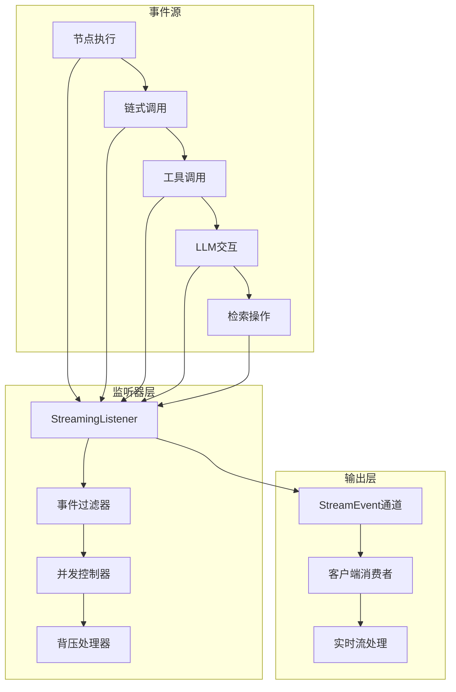
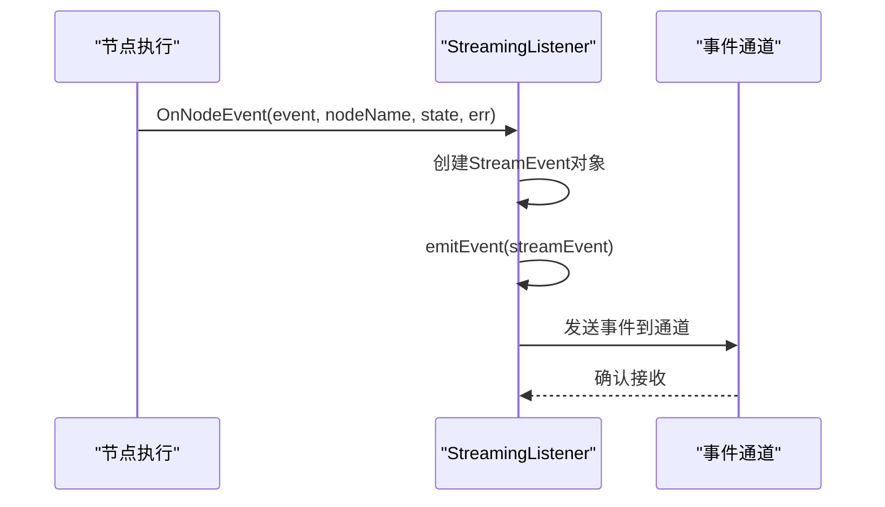
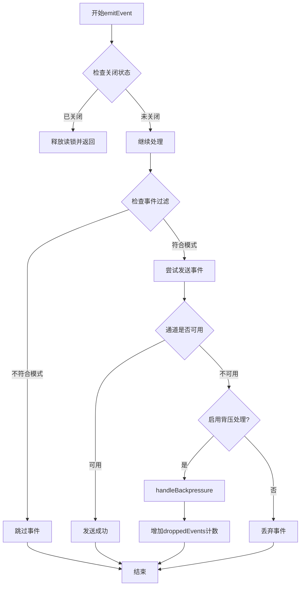
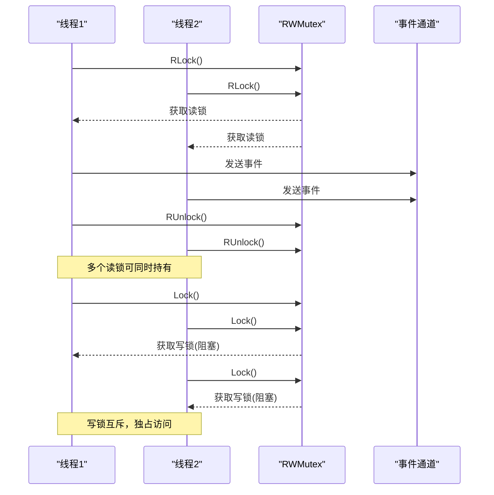
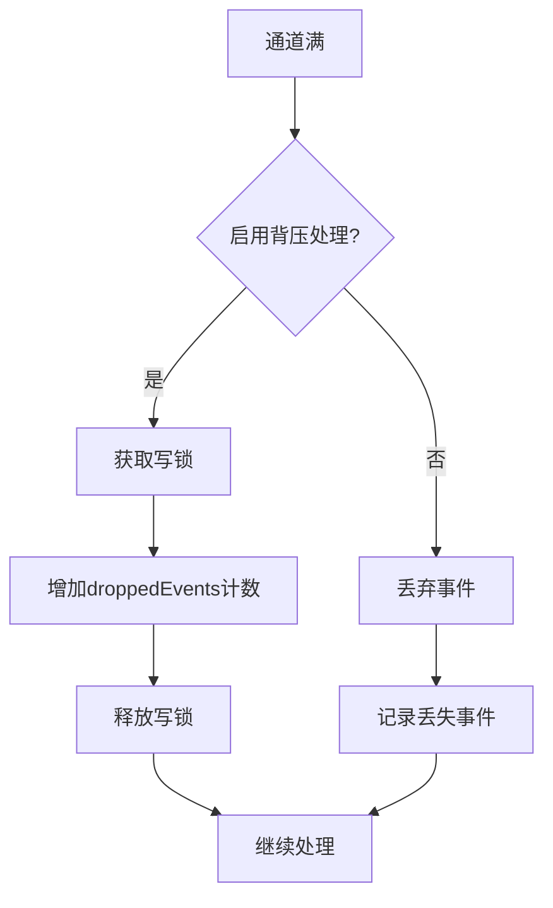
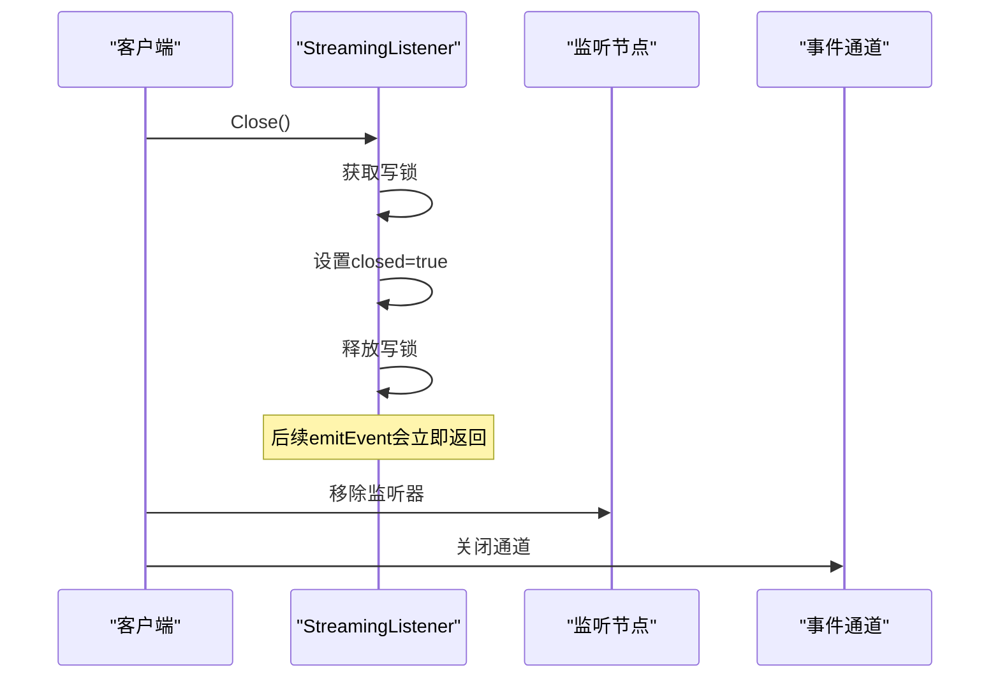
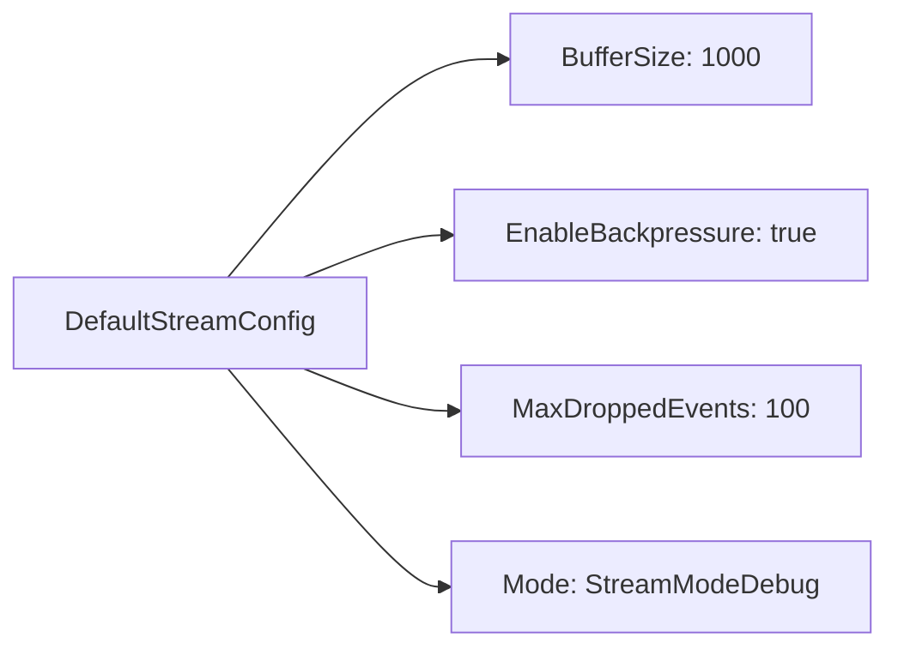
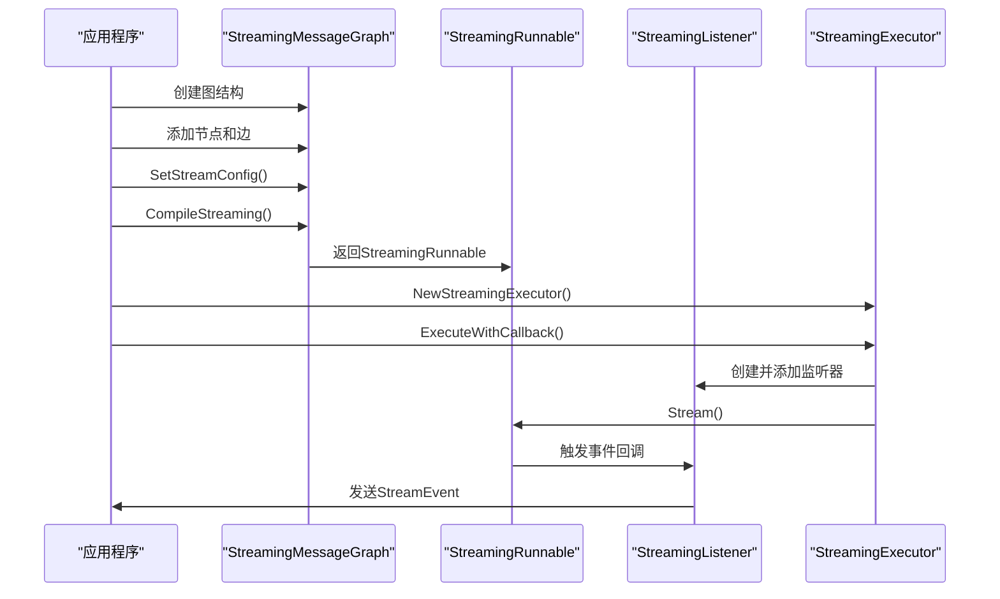
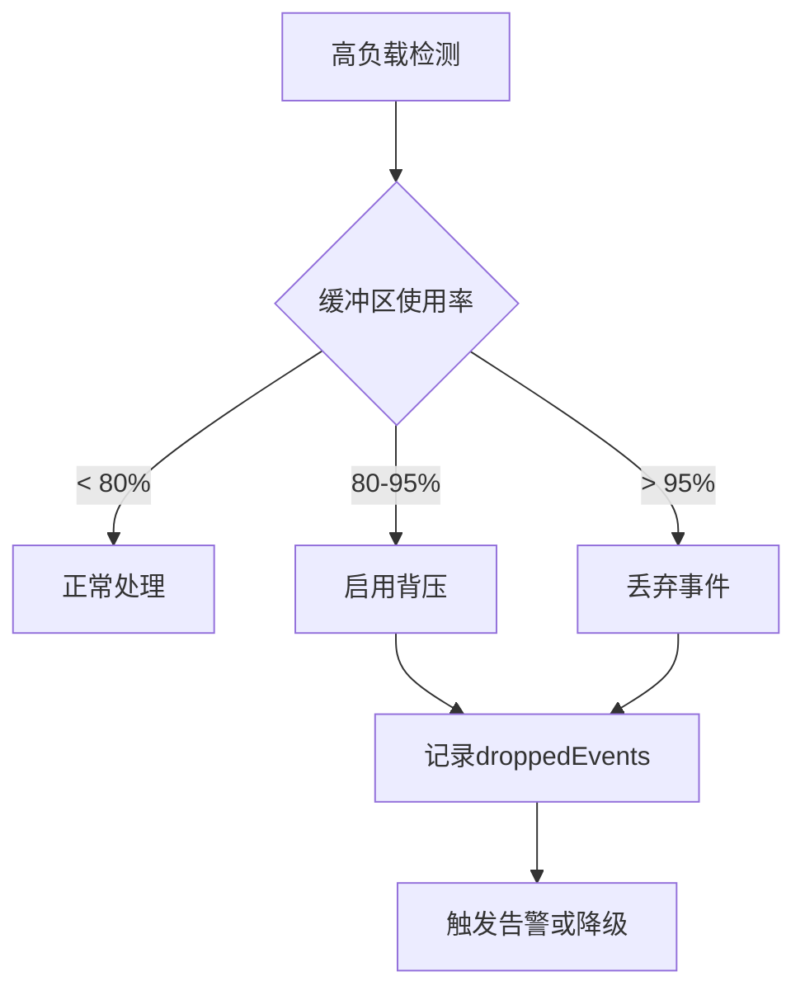

# 流式监听器

<cite>
**本文档中引用的文件**
- [graph/streaming.go](file://graph/streaming.go)
- [graph/listeners.go](file://graph/listeners.go)
- [graph/callbacks.go](file://graph/callbacks.go)
- [examples/streaming_modes/main.go](file://examples/streaming_modes/main.go)
- [examples/streaming_pipeline/main.go](file://examples/streaming_pipeline/main.go)
- [graph/streaming_test.go](file://graph/streaming_test.go)
</cite>

## 目录
1. [简介](#简介)
2. [核心架构](#核心架构)
3. [结构体设计](#结构体设计)
4. [接口实现](#接口实现)
5. [事件处理机制](#事件处理机制)
6. [并发控制与背压处理](#并发控制与背压处理)
7. [配置系统](#配置系统)
8. [使用示例](#使用示例)
9. [性能考虑](#性能考虑)
10. [故障排除指南](#故障排除指南)
11. [总结](#总结)

## 简介

`StreamingListener` 是 LangGraphGo 框架中的核心组件，负责捕获图执行过程中的各类事件并将其转换为标准化的 `StreamEvent` 对象。它实现了 `NodeListener` 和 `CallbackHandler` 接口，提供了实时事件流式传输功能，支持多种流模式和背压处理策略。

该监听器采用非阻塞发送机制，通过通道缓冲区和并发控制确保高吞吐量的同时避免内存泄漏。其设计充分考虑了生产环境中的可靠性需求，提供了完善的错误处理和资源管理机制。

## 核心架构

`StreamingListener` 在整个框架中扮演着事件收集和分发的核心角色，其架构设计体现了以下关键原则：



**图表来源**
- [graph/streaming.go](file://graph/streaming.go#L66-L74)
- [graph/listeners.go](file://graph/listeners.go#L51-L55)

## 结构体设计

`StreamingListener` 采用了简洁而高效的结构设计，包含以下核心字段：

```mermaid
classDiagram
class StreamingListener {
+chan~StreamEvent~ eventChan
+StreamConfig config
+sync.RWMutex mutex
+int droppedEvents
+bool closed
+NewStreamingListener(eventChan, config) StreamingListener
+emitEvent(event) void
+shouldEmit(event) bool
+handleBackpressure() void
+Close() void
+GetDroppedEventsCount() int
}
class StreamConfig {
+int BufferSize
+bool EnableBackpressure
+int MaxDroppedEvents
+StreamMode Mode
}
class StreamEvent {
+time.Time Timestamp
+string NodeName
+NodeEvent Event
+interface{} State
+error Error
+map[string]interface{} Metadata
+time.Duration Duration
}
StreamingListener --> StreamConfig : "配置"
StreamingListener --> StreamEvent : "发送"
```

**图表来源**
- [graph/streaming.go](file://graph/streaming.go#L66-L74)
- [graph/streaming.go](file://graph/streaming.go#L24-L36)
- [graph/listeners.go](file://graph/listeners.go#L65-L87)

### 字段详解

| 字段 | 类型 | 作用 | 默认值 |
|------|------|------|--------|
| `eventChan` | `chan<- StreamEvent` | 事件输出通道 | 必需参数 |
| `config` | `StreamConfig` | 流配置参数 | 默认配置 |
| `mutex` | `sync.RWMutex` | 并发控制锁 | 内部使用 |
| `droppedEvents` | `int` | 被丢弃事件计数 | 0 |
| `closed` | `bool` | 关闭状态标志 | false |

**章节来源**
- [graph/streaming.go](file://graph/streaming.go#L66-L74)

## 接口实现

`StreamingListener` 实现了两个核心接口，提供了全面的事件监听能力：

### NodeListener 接口

该接口负责处理节点级别的事件：



**图表来源**
- [graph/streaming.go](file://graph/streaming.go#L135-L145)
- [graph/listeners.go](file://graph/listeners.go#L51-L55)

### CallbackHandler 接口

该接口处理更高级别的回调事件：

| 方法 | 触发时机 | 事件类型 | 参数说明 |
|------|----------|----------|----------|
| `OnChainStart` | 链开始执行 | `EventChainStart` | 输入状态和元数据 |
| `OnChainEnd` | 链执行完成 | `EventChainEnd` | 输出结果 |
| `OnChainError` | 链执行出错 | `NodeEventError` | 错误信息 |
| `OnLLMStart` | LLM调用开始 | `EventLLMStart` | 提示词和元数据 |
| `OnLLMEnd` | LLM调用结束 | `EventLLMEnd` | 响应内容 |
| `OnLLMError` | LLM调用出错 | `NodeEventError` | 错误信息 |
| `OnToolStart` | 工具调用开始 | `EventToolStart` | 输入字符串和元数据 |
| `OnToolEnd` | 工具调用结束 | `EventToolEnd` | 输出结果 |
| `OnToolError` | 工具调用出错 | `NodeEventError` | 错误信息 |

**章节来源**
- [graph/streaming.go](file://graph/streaming.go#L149-L222)
- [graph/callbacks.go](file://graph/callbacks.go#L9-L29)

## 事件处理机制

### emitEvent 方法详解

`emitEvent` 是 `StreamingListener` 的核心方法，负责将内部事件转换为 `StreamEvent` 并通过通道发送：



**图表来源**
- [graph/streaming.go](file://graph/streaming.go#L84-L109)

### 事件过滤机制

`shouldEmit` 方法根据配置的流模式决定是否发送事件：

| 模式 | 过滤规则 | 示例事件 |
|------|----------|----------|
| `StreamModeDebug` | 所有事件都发送 | 完整的调试信息 |
| `StreamModeValues` | 仅 `graph_step` 事件 | 节点状态更新 |
| `StreamModeUpdates` | 节点输出事件 | `ToolEnd`、`ChainEnd`、`NodeEventComplete` |
| `StreamModeMessages` | LLM相关事件 | `LLMStart`、`LLMEnd` |

**章节来源**
- [graph/streaming.go](file://graph/streaming.go#L111-L132)

## 并发控制与背压处理

### 并发控制机制

`StreamingListener` 使用 `sync.RWMutex` 实现高效的并发控制：



**图表来源**
- [graph/streaming.go](file://graph/streaming.go#L86-L91)
- [graph/streaming.go](file://graph/streaming.go#L246-L249)

### 背压处理策略

当事件通道满时，`handleBackpressure` 方法提供简单的背压处理：



**图表来源**
- [graph/streaming.go](file://graph/streaming.go#L252-L261)

### Close 方法的安全性

`Close` 方法确保监听器安全关闭，防止向已关闭的通道发送数据：



**图表来源**
- [graph/streaming.go](file://graph/streaming.go#L245-L249)

**章节来源**
- [graph/streaming.go](file://graph/streaming.go#L84-L109)
- [graph/streaming.go](file://graph/streaming.go#L252-L261)
- [graph/streaming.go](file://graph/streaming.go#L245-L249)

## 配置系统

### StreamConfig 结构

`StreamConfig` 提供了灵活的配置选项：

| 配置项 | 类型 | 默认值 | 说明 |
|--------|------|--------|------|
| `BufferSize` | `int` | 1000 | 事件通道缓冲区大小 |
| `EnableBackpressure` | `bool` | true | 是否启用背压处理 |
| `MaxDroppedEvents` | `int` | 100 | 最大允许丢弃事件数 |
| `Mode` | `StreamMode` | `StreamModeDebug` | 流模式设置 |

### 默认配置

`DefaultStreamConfig` 提供了生产环境推荐的默认配置：



**图表来源**
- [graph/streaming.go](file://graph/streaming.go#L38-L46)

**章节来源**
- [graph/streaming.go](file://graph/streaming.go#L23-L46)

## 使用示例

### 基本使用模式

以下是 `StreamingListener` 的典型使用流程：



**图表来源**
- [examples/streaming_modes/main.go](file://examples/streaming_modes/main.go#L15-L54)
- [examples/streaming_pipeline/main.go](file://examples/streaming_pipeline/main.go#L12-L80)

### 不同流模式的应用

| 模式 | 适用场景 | 性能特点 | 数据量 |
|------|----------|----------|--------|
| `StreamModeDebug` | 开发调试 | 全量事件，无过滤 | 最大 |
| `StreamModeValues` | 状态跟踪 | 只发送状态变化 | 中等 |
| `StreamModeUpdates` | 输出监控 | 只发送节点输出 | 较小 |
| `StreamModeMessages` | LLM流式 | 只发送LLM相关事件 | 最小 |

**章节来源**
- [examples/streaming_modes/main.go](file://examples/streaming_modes/main.go#L15-L54)
- [examples/streaming_pipeline/main.go](file://examples/streaming_pipeline/main.go#L12-L80)
- [graph/streaming_test.go](file://graph/streaming_test.go#L10-L105)

## 性能考虑

### 内存管理

`StreamingListener` 通过以下机制优化内存使用：

1. **通道缓冲区控制**：通过 `BufferSize` 参数限制内存占用
2. **事件过滤**：减少不必要的事件传输
3. **及时清理**：在关闭时移除监听器引用

### 并发优化

1. **读写分离**：使用 `RWMutex` 支持多读者并发
2. **非阻塞发送**：使用 `select` 语句避免阻塞
3. **异步处理**：事件处理在独立 goroutine 中进行

### 背压处理

当系统负载过高时，`StreamingListener` 提供了多层次的保护机制：



## 故障排除指南

### 常见问题及解决方案

| 问题 | 症状 | 原因 | 解决方案 |
|------|------|------|----------|
| 事件丢失 | 部分事件未收到 | 缓冲区满且背压禁用 | 增加缓冲区或启用背压 |
| 内存泄漏 | 内存持续增长 | 通道未正确关闭 | 确保调用 Close() 方法 |
| 性能下降 | 事件延迟增加 | 并发竞争严重 | 优化事件过滤逻辑 |
| 死锁 | 程序挂起 | 锁竞争或通道阻塞 | 检查锁获取顺序和超时 |

### 监控指标

建议监控以下关键指标：

1. **droppedEvents**：被丢弃事件的数量
2. **channel 使用率**：事件通道的填充程度
3. **事件处理延迟**：从事件产生到发送的时间
4. **并发线程数**：同时处理事件的 goroutine 数量

### 调试技巧

1. **启用 Debug 模式**：使用 `StreamModeDebug` 获取完整事件流
2. **检查配置**：验证 `StreamConfig` 设置是否合理
3. **监控资源**：定期检查内存和 CPU 使用情况
4. **日志记录**：在关键位置添加日志以便追踪

**章节来源**
- [graph/streaming.go](file://graph/streaming.go#L263-L268)

## 总结

`StreamingListener` 是 LangGraphGo 框架中一个精心设计的组件，它成功地平衡了性能、可靠性和易用性。通过实现标准接口、提供灵活的配置选项和完善的并发控制机制，它为构建实时事件驱动的应用程序提供了强大的基础设施。

其主要优势包括：

1. **高性能**：非阻塞发送和并发控制确保高吞吐量
2. **可靠性**：完善的错误处理和资源管理机制
3. **灵活性**：多种流模式和配置选项适应不同需求
4. **可扩展性**：模块化设计便于功能扩展

对于开发者而言，理解 `StreamingListener` 的设计原理和使用方法，有助于更好地利用 LangGraphGo 构建高效、可靠的流式应用系统。