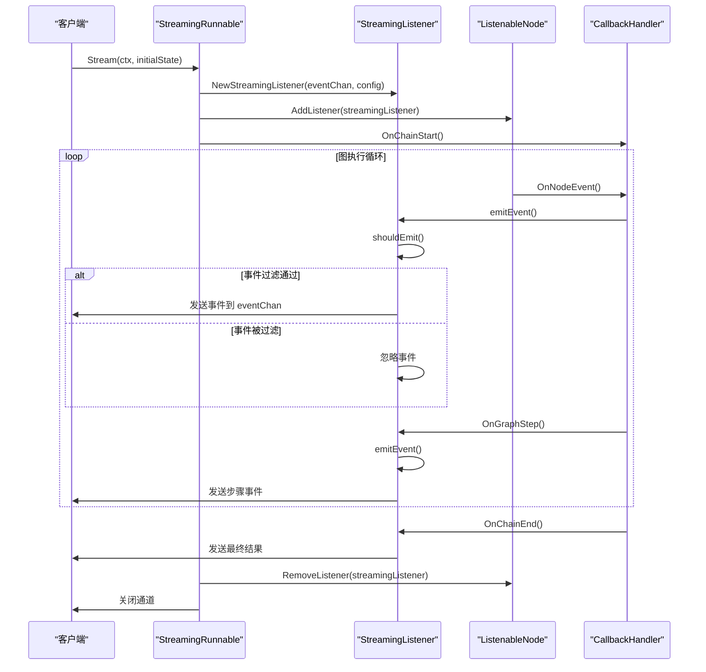
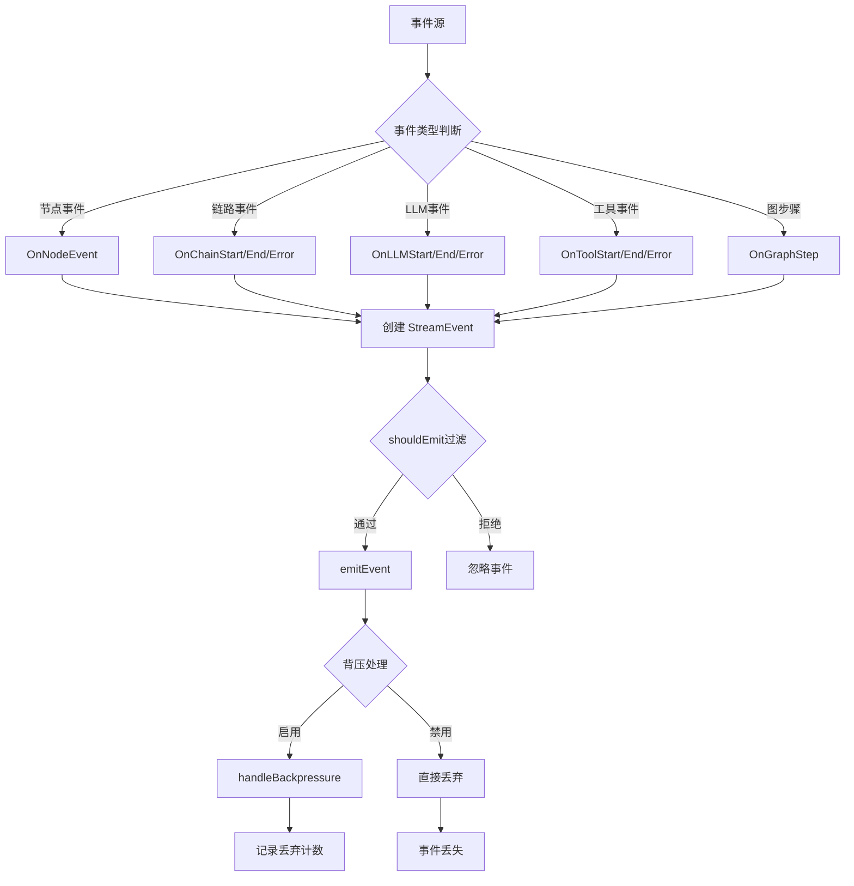
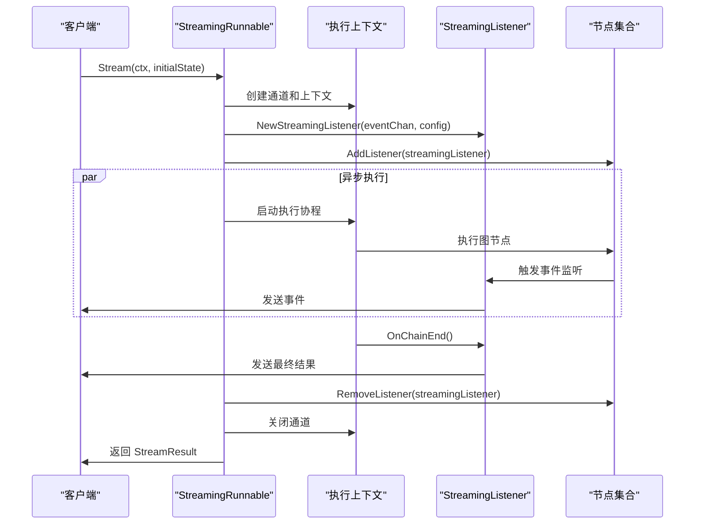
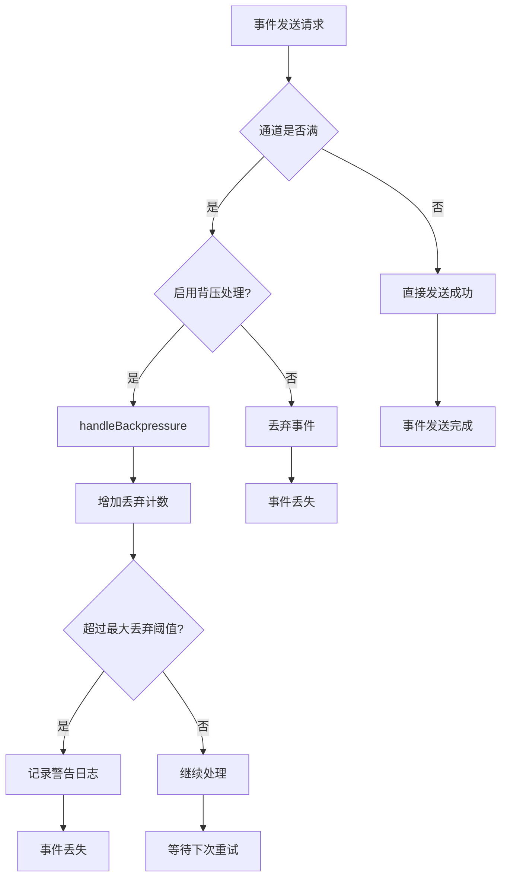

# 流式输出

<cite>
**本文档中引用的文件**
- [streaming.go](file://graph/streaming.go)
- [listeners.go](file://graph/listeners.go)
- [callbacks.go](file://graph/callbacks.go)
- [main.go](file://examples/streaming_modes/main.go)
- [main.go](file://examples/streaming_pipeline/main.go)
- [streaming_test.go](file://graph/streaming_test.go)
- [README.md](file://examples/streaming_modes/README.md)
</cite>

## 目录
1. [简介](#简介)
2. [核心概念](#核心概念)
3. [StreamMode 枚举详解](#streammode-枚举详解)
4. [StreamConfig 配置结构](#streamconfig-配置结构)
5. [StreamingListener 实现机制](#streaminglistener-实现机制)
6. [StreamResult 数据结构](#streamresult-数据结构)
7. [StreamingRunnable 执行流程](#streamingrunnable-执行流程)
8. [实际应用示例](#实际应用示例)
9. [背压处理策略](#背压处理策略)
10. [性能优化建议](#性能优化建议)
11. [总结](#总结)

## 简介

LangGraph Go 的流式输出机制提供了一套完整的实时事件流处理系统，允许开发者在图执行过程中捕获和处理各种事件。该机制支持多种流式模式，能够满足从简单的进度跟踪到复杂的实时交互等各种应用场景。

流式输出的核心优势在于：
- **实时性**：事件在发生时立即传递，无需等待整个流程完成
- **灵活性**：支持多种过滤模式，可根据需求定制事件流
- **可扩展性**：通过监听器模式支持自定义事件处理逻辑
- **可靠性**：内置背压处理和错误恢复机制

## 核心概念

### 事件类型层次结构

```mermaid
classDiagram
class NodeEvent {
<<enumeration>>
+NodeEventStart
+NodeEventProgress
+NodeEventComplete
+NodeEventError
+EventChainStart
+EventChainEnd
+EventToolStart
+EventToolEnd
+EventLLMStart
+EventLLMEnd
+EventToken
+EventCustom
}
class StreamEvent {
+time.Time Timestamp
+string NodeName
+NodeEvent Event
+interface{} State
+error Error
+map[string]interface{} Metadata
+time.Duration Duration
}
class CallbackHandler {
<<interface>>
+OnChainStart()
+OnChainEnd()
+OnChainError()
+OnLLMStart()
+OnLLMEnd()
+OnLLMError()
+OnToolStart()
+OnToolEnd()
+OnToolError()
+OnRetrieverStart()
+OnRetrieverEnd()
+OnRetrieverError()
}
class GraphCallbackHandler {
<<interface>>
+OnGraphStep()
}
class StreamingListener {
+chan~StreamEvent~ eventChan
+StreamConfig config
+sync.RWMutex mutex
+int droppedEvents
+bool closed
+emitEvent()
+shouldEmit()
+handleBackpressure()
}
NodeEvent --> StreamEvent : "包含"
CallbackHandler <|-- GraphCallbackHandler : "继承"
GraphCallbackHandler <|.. StreamingListener : "实现"
CallbackHandler <|.. StreamingListener : "实现"
```

**图表来源**
- [listeners.go](file://graph/listeners.go#L10-L49)
- [streaming.go](file://graph/streaming.go#L66-L82)
- [callbacks.go](file://graph/callbacks.go#L8-L30)

### 流程架构图



**图表来源**
- [streaming.go](file://graph/streaming.go#L289-L357)
- [streaming.go](file://graph/streaming.go#L135-L245)

## StreamMode 枚举详解

StreamMode 定义了四种不同的流式输出模式，每种模式都有其特定的应用场景和过滤逻辑。

### 模式对比表

| 模式 | 描述 | 适用场景 | 过滤条件 |
|------|------|----------|----------|
| `StreamModeValues` | 输出完整状态 | 调试、UI 渲染 | 仅接收 `graph_step` 事件 |
| `StreamModeUpdates` | 输出节点更新 | 进度跟踪、状态监控 | 接收 `ToolEnd`、`ChainEnd`、`NodeEventComplete` 事件 |
| `StreamModeMessages` | 输出 LLM 消息 | 实时聊天、文本生成 | 接收 `LLMStart`、`LLMEnd` 事件 |
| `StreamModeDebug` | 输出所有事件 | 深度调试、开发测试 | 接收所有事件 |

### 详细说明

#### StreamModeValues - 完整状态模式
- **特点**：每次节点执行完成后发送完整的图状态
- **用途**：主要用于调试和可视化，能够看到整个执行过程的状态变化
- **事件类型**：主要关注 `graph_step` 自定义事件
- **性能影响**：可能产生大量数据，适合短流程或低频执行

#### StreamModeUpdates - 更新模式
- **特点**：只发送节点的输出结果，不包含完整状态
- **用途**：适用于需要跟踪每个节点执行结果的场景
- **事件类型**：`ToolEnd`、`ChainEnd`、`NodeEventComplete`
- **性能优势**：数据量相对较小，适合长时间运行的流程

#### StreamModeMessages - 消息模式
- **特点**：专门用于 LLM 对话场景，输出令牌或消息
- **用途**：实现实时文本生成效果，类似于 ChatGPT 的逐字输出
- **事件类型**：`LLMStart`、`LLMEnd`
- **技术要求**：需要 LLM 组件支持流式响应

#### StreamModeDebug - 调试模式
- **特点**：输出所有内部事件，提供最详细的执行信息
- **用途**：开发阶段的深度调试，问题排查
- **事件类型**：所有可用事件类型
- **性能开销**：最高，不适合生产环境

**章节来源**
- [streaming.go](file://graph/streaming.go#L12-L21)

## StreamConfig 配置结构

StreamConfig 提供了对流式行为的精细控制，包含以下关键参数：

### 参数详解

| 参数名 | 类型 | 默认值 | 描述 | 性能影响 |
|--------|------|--------|------|----------|
| `BufferSize` | int | 1000 | 事件通道缓冲区大小 | 影响内存使用和背压处理能力 |
| `EnableBackpressure` | bool | true | 是否启用背压处理 | 控制事件丢失率 |
| `MaxDroppedEvents` | int | 100 | 最大丢弃事件数 | 超出后触发警告 |
| `Mode` | StreamMode | StreamModeDebug | 流式输出模式 | 决定事件过滤规则 |

### 配置策略

#### 高吞吐量场景
```go
config := StreamConfig{
    BufferSize:         5000,
    EnableBackpressure: false,
    MaxDroppedEvents:   500,
    Mode:               StreamModeUpdates,
}
```

#### 低延迟场景  
```go
config := StreamConfig{
    BufferSize:         100,
    EnableBackpressure: true,
    MaxDroppedEvents:   10,
    Mode:               StreamModeDebug,
}
```

#### 生产环境推荐
```go
config := StreamConfig{
    BufferSize:         2000,
    EnableBackpressure: true,
    MaxDroppedEvents:   200,
    Mode:               StreamModeValues,
}
```

**章节来源**
- [streaming.go](file://graph/streaming.go#L24-L46)

## StreamingListener 实现机制

StreamingListener 是流式输出的核心组件，它同时实现了 `NodeListener` 和 `CallbackHandler` 接口，负责捕获和过滤事件。

### 核心功能架构



**图表来源**
- [streaming.go](file://graph/streaming.go#L135-L245)
- [streaming.go](file://graph/streaming.go#L112-L133)

### 事件过滤机制

`shouldEmit` 方法根据当前配置的 `StreamMode` 来决定是否发送事件：

```mermaid
flowchart TD
A[shouldEmit调用] --> B{检查配置模式}
B --> |StreamModeDebug| C[返回true - 发送所有事件]
B --> |StreamModeValues| D{检查事件类型}
D --> |event.Event == "graph_step"| E[返回true]
D --> |其他事件| F[返回false]
B --> |StreamModeUpdates| G{检查事件类型}
G --> |EventToolEnd 或 EventChainEnd 或 NodeEventComplete| H[返回true]
G --> |其他事件| F
B --> |StreamModeMessages| I{检查事件类型}
I --> |EventLLMStart 或 EventLLMEnd| J[返回true]
I --> |其他事件| F
```

**图表来源**
- [streaming.go](file://graph/streaming.go#L112-L133)

### 并发安全设计

StreamingListener 使用读写锁确保线程安全：

- **读操作**：检查关闭状态和配置
- **写操作**：修改状态、处理背压、更新统计
- **互斥访问**：保护共享资源，避免竞态条件

**章节来源**
- [streaming.go](file://graph/streaming.go#L66-L82)
- [streaming.go](file://graph/streaming.go#L112-L133)

## StreamResult 数据结构

StreamResult 包含四个重要的通道，提供了完整的流式执行结果访问：

### 通道功能说明

| 通道名 | 类型 | 用途 | 关闭时机 |
|--------|------|------|----------|
| `Events` | `<-chan StreamEvent` | 实时事件流 | 图执行完成时 |
| `Result` | `<-chan interface{}` | 最终执行结果 | 成功完成时 |
| `Errors` | `<-chan error` | 错误信息 | 发生错误时 |
| `Done` | `<-chan struct{}` | 完成信号 | 所有通道关闭时 |

### 使用模式

#### 基本消费模式
```go
streamResult := runnable.Stream(ctx, initialState)
for {
    select {
    case event, ok := <-streamResult.Events:
        if !ok { break }
        processEvent(event)
    case result, ok := <-streamResult.Result:
        if ok { handleResult(result) }
    case err, ok := <-streamResult.Errors:
        if ok { handleError(err) }
    case <-streamResult.Done:
        return
    }
}
```

#### 简化回调模式
```go
executor := NewStreamingExecutor(runnable)
err := executor.ExecuteWithCallback(
    ctx, 
    initialState,
    func(event StreamEvent) { /* 实时处理 */ },
    func(result interface{}, err error) { /* 最终处理 */ },
)
```

**章节来源**
- [streaming.go](file://graph/streaming.go#L48-L64)

## StreamingRunnable 执行流程

StreamingRunnable 是流式执行的主要入口点，它封装了完整的执行生命周期管理。

### 执行生命周期



**图表来源**
- [streaming.go](file://graph/streaming.go#L289-L357)

### 资源管理策略

#### 生命周期管理
1. **初始化阶段**：创建通道、监听器、上下文
2. **执行阶段**：添加监听器到所有节点，启动异步执行
3. **清理阶段**：移除监听器，关闭通道，释放资源

#### 错误处理机制
- **异常恢复**：捕获执行过程中的任何错误
- **优雅关闭**：确保资源正确释放
- **状态同步**：使用延迟函数保证清理顺序

**章节来源**
- [streaming.go](file://graph/streaming.go#L289-L357)

## 实际应用示例

### 基础流式模式示例

参考 `examples/streaming_modes/main.go`，展示了如何在不同模式下处理流式数据：

#### 更新模式 (Updates Mode)
```go
// 配置为更新模式
g.SetStreamConfig(graph.StreamConfig{
    Mode: graph.StreamModeUpdates,
})

// 执行并处理事件
streamResult := runnable.Stream(context.Background(), nil)
for event := range streamResult.Events {
    fmt.Printf("[%s] Node: %s, Event: %s, State: %v\n",
        event.Timestamp.Format("15:04:05"),
        event.NodeName,
        event.Event,
        event.State)
}
```

#### 消息模式 (Messages Mode)
```go
// 配置为消息模式
g.SetStreamConfig(graph.StreamConfig{
    Mode: graph.StreamModeMessages,
})

// 处理 LLM 令牌流
streamResult := runnable.Stream(context.Background(), userInput)
for event := range streamResult.Events {
    if event.Event == graph.EventLLMEnd {
        fmt.Print(event.State)
    }
}
```

### 高级管道示例

参考 `examples/streaming_pipeline/main.go`，展示了复杂场景下的流式处理：

#### 多监听器组合
```go
// 添加多个监听器
progressListener := graph.NewProgressListener()
chatListener := graph.NewChatListener()
metricsListener := graph.NewMetricsListener()

// 将监听器绑定到节点
analyze.AddListener(progressListener)
analyze.AddListener(chatListener)
analyze.AddListener(metricsListener)

// 统一处理所有事件
executor.ExecuteWithCallback(ctx, input, 
    func(event graph.StreamEvent) {
        fmt.Printf("[%s] Event: %s from %s\n",
            time.Now().Format("15:04:05.000"),
            event.Event, event.NodeName)
    },
    func(result interface{}, err error) {
        // 处理最终结果
    },
)
```

### Web 应用集成

#### SSE (Server-Sent Events) 实现
```go
func streamHandler(w http.ResponseWriter, r *http.Request) {
    // 设置 SSE 头部
    w.Header().Set("Content-Type", "text/event-stream")
    w.Header().Set("Cache-Control", "no-cache")
    w.Header().Set("Connection", "keep-alive")
    
    // 创建流式执行器
    executor := graph.NewStreamingExecutor(runnable)
    
    // 执行并发送事件
    executor.ExecuteWithCallback(r.Context(), input,
        func(event graph.StreamEvent) {
            // 发送事件到客户端
            fmt.Fprintf(w, "data: %v\n\n", event)
            w.(http.Flusher).Flush()
        },
        func(result interface{}, err error) {
            // 发送完成信号
            fmt.Fprintf(w, "data: [DONE]\n\n")
            w.(http.Flusher).Flush()
        },
    )
}
```

**章节来源**
- [main.go](file://examples/streaming_modes/main.go#L15-L55)
- [main.go](file://examples/streaming_pipeline/main.go#L12-L80)

## 背压处理策略

背压处理是流式输出系统的关键特性，防止快速产生的事件淹没消费者。

### 背压检测机制



**图表来源**
- [streaming.go](file://graph/streaming.go#L84-L109)
- [streaming.go](file://graph/streaming.go#L252-L261)

### 配置优化策略

#### 高吞吐量场景
```go
config := StreamConfig{
    BufferSize:         5000,      // 增大缓冲区
    EnableBackpressure: false,     // 禁用背压，允许丢弃
    MaxDroppedEvents:   1000,      // 允许更多丢弃
}
```

#### 低延迟场景
```go
config := StreamConfig{
    BufferSize:         100,       // 减小缓冲区
    EnableBackpressure: true,      // 启用背压
    MaxDroppedEvents:   10,        // 严格限制丢弃
}
```

#### 生产环境平衡
```go
config := StreamConfig{
    BufferSize:         2000,      // 中等缓冲区
    EnableBackpressure: true,      // 启用背压
    MaxDroppedEvents:   200,       // 适度限制丢弃
}
```

### 监控和诊断

#### 丢弃事件统计
```go
// 获取丢弃事件数量
droppedCount := streamingListener.GetDroppedEventsCount()
if droppedCount > 0 {
    log.Printf("警告: 已丢弃 %d 个事件", droppedCount)
}
```

#### 性能指标收集
```go
type MetricsCollector struct {
    totalEvents     int64
    droppedEvents   int64
    processingTime  time.Duration
}

func (mc *MetricsCollector) RecordEvent(duration time.Duration) {
    atomic.AddInt64(&mc.totalEvents, 1)
    mc.processingTime += duration
}
```

**章节来源**
- [streaming.go](file://graph/streaming.go#L252-L268)

## 性能优化建议

### 内存优化

#### 缓冲区大小调优
- **小流程 (< 10 个节点)**：BufferSize = 100-500
- **中等流程 (10-50 个节点)**：BufferSize = 1000-3000  
- **大型流程 (> 50 个节点)**：BufferSize = 5000+

#### 事件序列化优化
```go
// 避免深拷贝
type OptimizedStreamEvent struct {
    Timestamp time.Time
    NodeName  string
    EventType string
    StateRef  unsafe.Pointer // 使用指针避免复制
    Error     error
    Metadata  map[string]interface{}
}
```

### 并发优化

#### 监听器并发处理
```go
// 使用工作池模式
type EventWorkerPool struct {
    workers    int
    jobQueue   chan StreamEvent
    workerWg   sync.WaitGroup
}

func (p *EventWorkerPool) ProcessEvent(event StreamEvent) {
    p.jobQueue <- event
}

func (p *EventWorkerPool) Start() {
    for i := 0; i < p.workers; i++ {
        p.workerWg.Add(1)
        go func() {
            defer p.workerWg.Done()
            for event := range p.jobQueue {
                // 处理事件
            }
        }()
    }
}
```

### 网络优化

#### 批量发送策略
```go
type BatchSender struct {
    batchSize    int
    batchTimeout time.Duration
    events       []StreamEvent
    flushCh      chan struct{}
}

func (bs *BatchSender) AddEvent(event StreamEvent) {
    bs.events = append(bs.events, event)
    if len(bs.events) >= bs.batchSize {
        bs.flushCh <- struct{}{}
    }
}

func (bs *BatchSender) Flush() {
    if len(bs.events) > 0 {
        // 批量发送事件
        bs.sendBatch(bs.events)
        bs.events = nil
    }
}
```

### 监控和告警

#### 关键指标监控
```go
type StreamingMetrics struct {
    ActiveListeners    int
    EventRate          float64
    DropRate           float64
    AverageProcessingTime time.Duration
    ChannelUtilization float64
}

func (sm *StreamingMetrics) Collect() {
    // 收集各种指标
    sm.DropRate = float64(sm.DroppedEvents) / float64(sm.TotalEvents)
    sm.ChannelUtilization = float64(sm.ActiveChannels) / float64(sm.MaxChannels)
}
```

## 总结

LangGraph Go 的流式输出机制提供了一个强大而灵活的实时事件处理框架。通过合理配置 `StreamMode`、`StreamConfig` 参数，结合 `StreamingListener` 的事件过滤和 `StreamingRunnable` 的执行管理，开发者可以构建出高性能、可扩展的流式应用。

### 核心优势

1. **多模式支持**：四种不同的流式模式满足各种应用场景需求
2. **灵活配置**：丰富的配置选项允许针对具体场景进行优化
3. **可靠机制**：完善的背压处理和错误恢复确保系统稳定性
4. **易于集成**：清晰的 API 设计便于与现有系统集成

### 最佳实践

1. **选择合适的模式**：根据具体需求选择 `StreamModeUpdates` 或 `StreamModeValues`
2. **合理配置缓冲区**：根据流量特征调整 `BufferSize` 和 `MaxDroppedEvents`
3. **实施背压策略**：在高负载场景下启用背压处理
4. **监控关键指标**：定期检查事件处理速率和丢弃率

通过深入理解和正确使用这些机制，开发者可以构建出响应迅速、用户体验优秀的流式应用系统。