# 状态归约器

<cite>
**本文档中引用的文件**
- [graph/schema.go](file://graph/schema.go)
- [examples/state_schema/main.go](file://examples/state_schema/main.go)
- [examples/custom_reducer/main.go](file://examples/custom_reducer/main.go)
- [graph/schema_test.go](file://graph/schema_test.go)
- [graph/add_messages.go](file://graph/add_messages.go)
- [graph/messages_graph.go](file://graph/messages_graph.go)
</cite>

## 目录
1. [简介](#简介)
2. [Reducer 基础概念](#reducer-基础概念)
3. [内置 Reducer 类型](#内置-reducer-类型)
4. [自定义 Reducer 实现](#自定义-reducer-实现)
5. [Schema 注册机制](#schema-注册机制)
6. [实际应用示例](#实际应用示例)
7. [最佳实践指南](#最佳实践指南)
8. [性能优化建议](#性能优化建议)
9. [常见使用场景](#常见使用场景)
10. [故障排除指南](#故障排除指南)

## 简介

Reducer（归约器）是 LangGraphGo 中用于控制状态更新行为的核心机制。它定义了如何将新状态值合并到现有状态中，为不同的数据字段提供了精确的状态管理策略。通过 Reducer，开发者可以实现复杂的合并逻辑，如累加、追加、去重等操作。

Reducer 的核心作用是：
- **精确控制状态更新**：为不同类型的字段定义特定的合并策略
- **类型安全**：确保状态更新过程中的类型一致性
- **灵活性**：支持自定义合并逻辑以满足特定业务需求
- **可扩展性**：允许动态注册新的合并规则

## Reducer 基础概念

### Reducer 接口定义

Reducer 在 LangGraphGo 中被定义为一个函数类型，具有以下签名：

```mermaid
classDiagram
class Reducer {
<<function>>
+func(current, new interface{}) (interface{}, error)
}
class StateSchema {
<<interface>>
+Init() interface{}
+Update(current, new interface{}) (interface{}, error)
}
class MapSchema {
+Reducers map[string]Reducer
+EphemeralKeys map[string]bool
+RegisterReducer(key string, reducer Reducer)
+Update(current, new interface{}) (interface{}, error)
}
StateSchema <|-- MapSchema
MapSchema --> Reducer : "uses"
```

**图表来源**
- [graph/schema.go](file://graph/schema.go#L8-L10)
- [graph/schema.go](file://graph/schema.go#L12-L19)

### Reducer 函数签名详解

Reducer 函数接收两个参数并返回合并后的结果：

| 参数 | 类型 | 描述 |
|------|------|------|
| current | interface{} | 当前状态值，可能是 nil 或现有值 |
| new | interface{} | 新的状态更新值 |
| 返回值 | (interface{}, error) | 合并后的状态值和可能的错误 |

### 状态更新流程

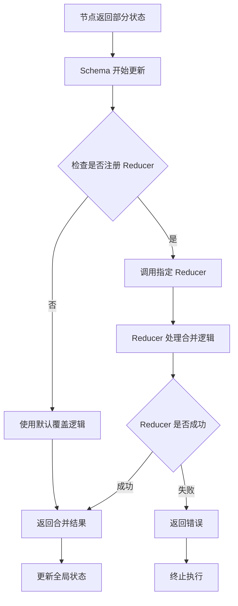

**节来源**
- [graph/schema.go](file://graph/schema.go#L62-L99)

## 内置 Reducer 类型

LangGraphGo 提供了两种主要的内置 Reducer 类型，满足常见的状态更新需求。

### OverwriteReducer（覆盖归约器）

OverwriteReducer 是默认的归约器，当没有为特定字段注册自定义 Reducer 时自动使用。

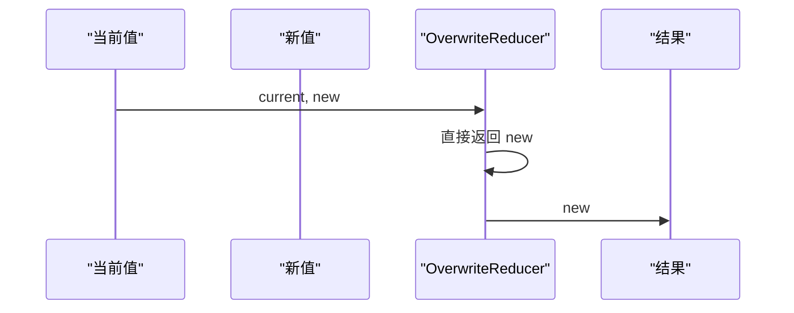

**图表来源**
- [graph/schema.go](file://graph/schema.go#L141-L144)

**特点：**
- **简单直接**：新值完全替换旧值
- **无条件覆盖**：不进行任何合并逻辑
- **默认行为**：未注册 Reducer 的字段使用此逻辑

### AppendReducer（追加归约器）

AppendReducer 专门用于处理列表类型的字段，支持将新元素追加到现有列表中。

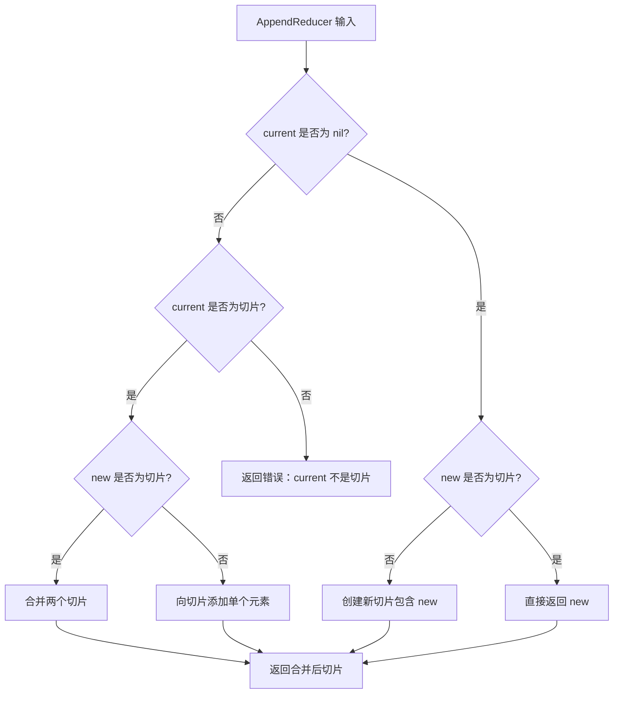

**图表来源**
- [graph/schema.go](file://graph/schema.go#L146-L185)

**功能特性：**
- **智能类型推导**：根据新值类型自动创建相应切片
- **灵活追加**：支持切片到切片和元素到切片的追加
- **类型安全**：使用反射确保类型兼容性
- **错误处理**：对类型不匹配的情况提供明确错误

**节来源**
- [graph/schema.go](file://graph/schema.go#L146-L185)

## 自定义 Reducer 实现

自定义 Reducer 允许开发者实现特定的合并逻辑，以满足复杂的业务需求。

### SumReducer（求和归约器）

SumReducer 展示了如何为数值字段实现累加逻辑：

```mermaid
classDiagram
class SumReducer {
+func(current, new interface{}) (interface{}, error)
-checkTypes(current, new) bool
-performAddition(c, n int) int
}
note for SumReducer "实现计数器字段的累加逻辑<br/>支持 nil 值初始化和类型验证"
```

**图表来源**
- [examples/state_schema/main.go](file://examples/state_schema/main.go#L11-L22)

**实现要点：**
- **空值处理**：当 current 为 nil 时直接返回 new
- **类型断言**：确保当前值和新值都是 int 类型
- **错误处理**：提供详细的类型错误信息
- **数学运算**：执行简单的加法操作

### SetReducer（集合归约器）

SetReducer 展示了如何实现去重集合的合并策略：

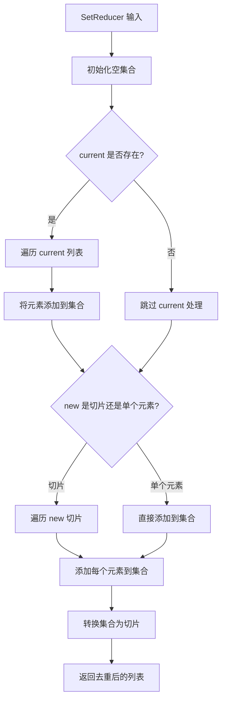

**图表来源**
- [examples/custom_reducer/main.go](file://examples/custom_reducer/main.go#L11-L42)

**实现特点：**
- **去重机制**：使用 map[string]bool 确保元素唯一性
- **灵活输入**：支持切片和单个元素的合并
- **类型安全**：严格处理字符串类型的数据
- **内存效率**：使用预分配容量优化切片增长

**节来源**
- [examples/state_schema/main.go](file://examples/state_schema/main.go#L11-L22)
- [examples/custom_reducer/main.go](file://examples/custom_reducer/main.go#L11-L42)

## Schema 注册机制

MapSchema 提供了灵活的 Reducer 注册机制，允许为不同字段配置特定的合并逻辑。

### RegisterReducer 方法

```mermaid
classDiagram
class MapSchema {
+Reducers map[string]Reducer
+EphemeralKeys map[string]bool
+RegisterReducer(key string, reducer Reducer)
+RegisterChannel(key string, reducer Reducer, isEphemeral bool)
+Update(current, new interface{}) (interface{}, error)
}
note for MapSchema "支持通道定义和瞬态键管理<br/>提供灵活的状态管理模式"
```

**图表来源**
- [graph/schema.go](file://graph/schema.go#L30-L47)

### 注册流程详解

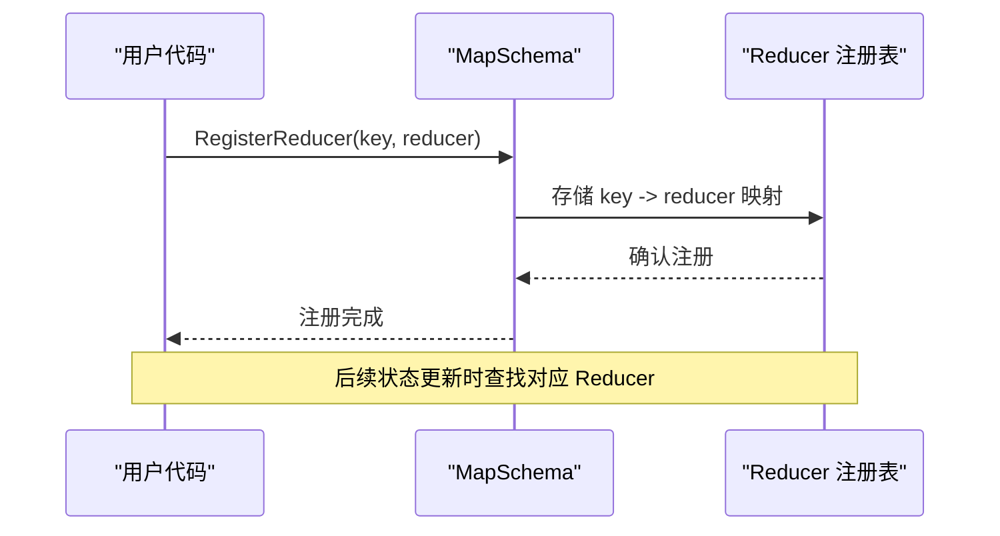

**图表来源**
- [graph/schema.go](file://graph/schema.go#L44-L47)

### RegisterChannel 方法

RegisterChannel 提供了更高级的功能，除了注册 Reducer 外还支持瞬态键标记：

| 参数 | 类型 | 描述 |
|------|------|------|
| key | string | 字段名称 |
| reducer | Reducer | 归约器函数 |
| isEphemeral | bool | 是否为瞬态键 |

**节来源**
- [graph/schema.go](file://graph/schema.go#L44-L55)

## 实际应用示例

### State Schema 示例

State Schema 示例展示了如何组合多种 Reducer 实现复杂的状态管理：

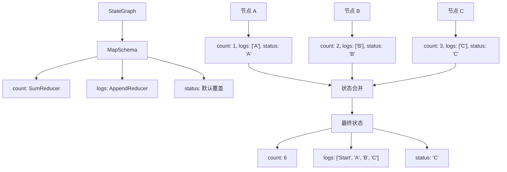

**图表来源**
- [examples/state_schema/main.go](file://examples/state_schema/main.go#L24-L104)

### Custom Reducer 示例

Custom Reducer 示例展示了去重集合的实现：

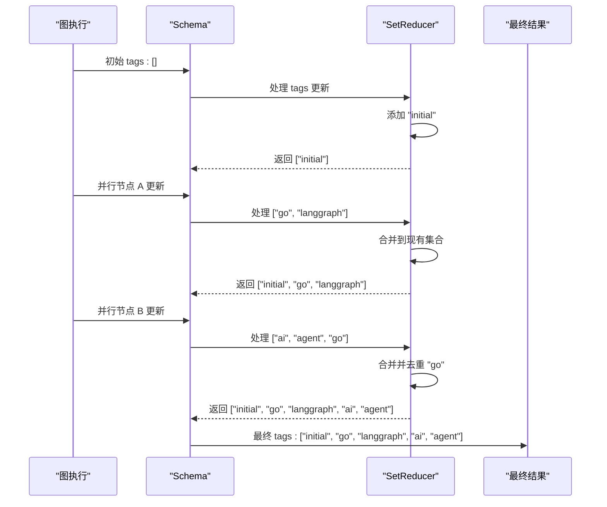

**图表来源**
- [examples/custom_reducer/main.go](file://examples/custom_reducer/main.go#L44-L92)

**节来源**
- [examples/state_schema/main.go](file://examples/state_schema/main.go#L24-L104)
- [examples/custom_reducer/main.go](file://examples/custom_reducer/main.go#L44-L92)

## 最佳实践指南

### Reducer 设计原则

1. **单一职责**：每个 Reducer 只负责一种特定的合并逻辑
2. **幂等性**：相同的输入总是产生相同的结果
3. **可预测性**：合并逻辑应该是直观和可预测的
4. **错误处理**：提供清晰的错误信息和适当的错误类型

### 类型安全最佳实践

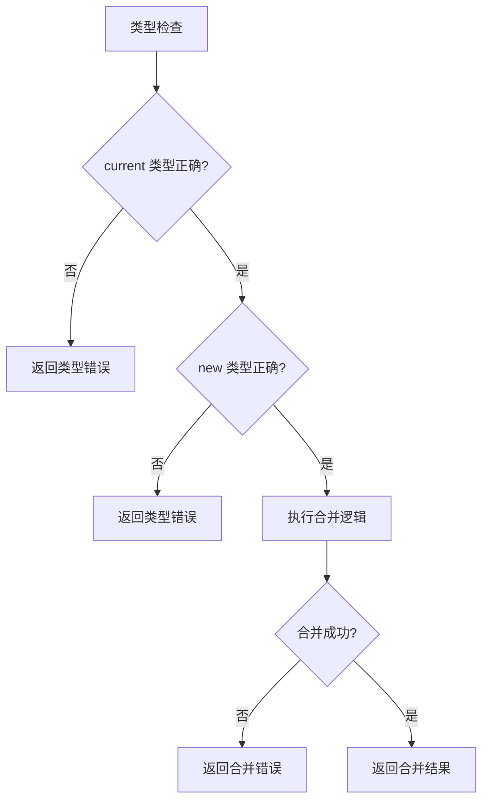

### 错误处理策略

| 错误类型 | 处理方式 | 示例场景 |
|----------|----------|----------|
| 类型不匹配 | 返回格式化的错误信息 | current 不是期望的类型 |
| 空值处理 | 提供合理的默认行为 | nil 值的初始化逻辑 |
| 合并失败 | 返回详细的错误描述 | 数学运算溢出或无效操作 |
| 状态不一致 | 记录警告并继续 | 非关键字段的合并问题 |

### 性能考虑因素

- **避免不必要的类型断言**：缓存类型信息减少重复检查
- **最小化内存分配**：预分配切片容量，重用对象
- **早期退出**：在检测到错误时立即返回
- **批量处理**：对于大量数据，考虑批量合并策略

## 性能优化建议

### 内存优化

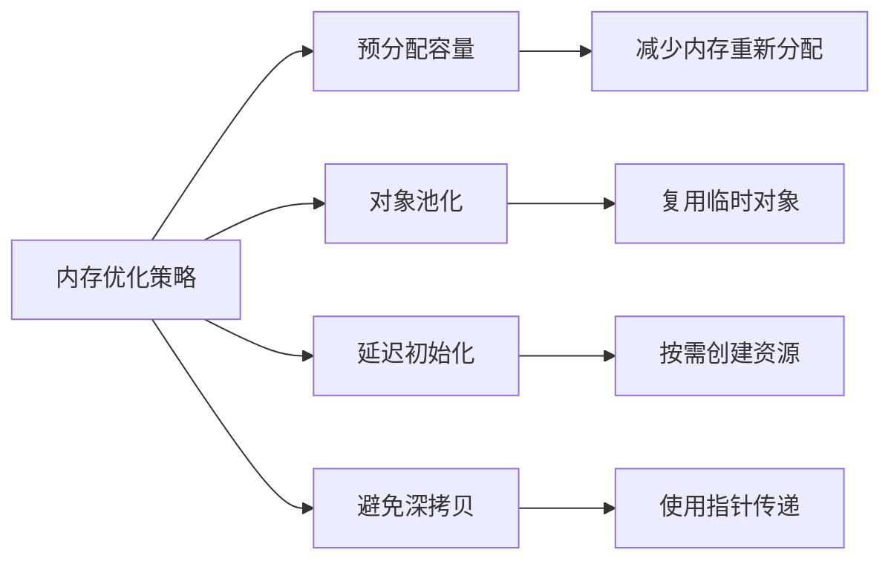

### 算法优化

- **哈希表优化**：使用合适的初始容量避免扩容
- **切片操作优化**：利用切片的 append 特性
- **反射优化**：缓存反射类型信息
- **并发安全**：在必要时使用同步原语

### 测试和监控

- **基准测试**：为关键 Reducer 编写性能测试
- **内存分析**：监控内存使用模式
- **吞吐量测量**：评估高负载下的表现
- **错误率跟踪**：监控 Reducer 执行成功率

## 常见使用场景

### 消息追加场景

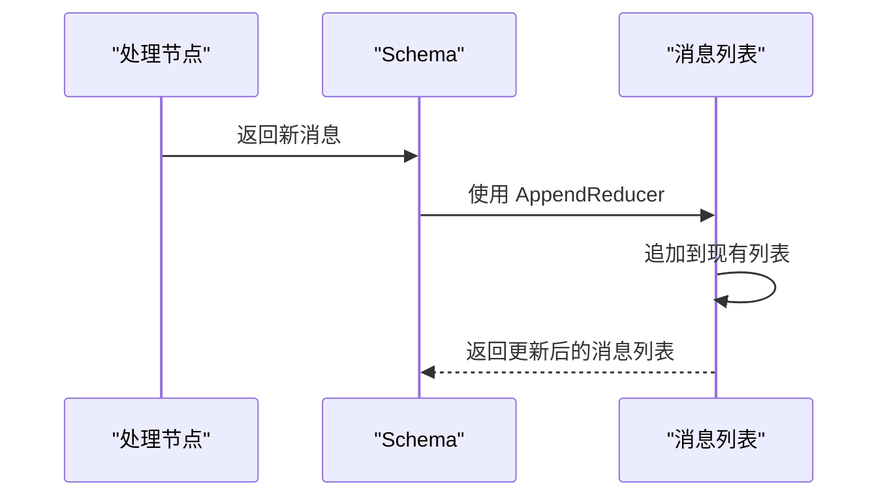

**适用字段：**
- 对话历史记录
- 操作日志
- 事件流
- 审计跟踪

### 数值统计场景

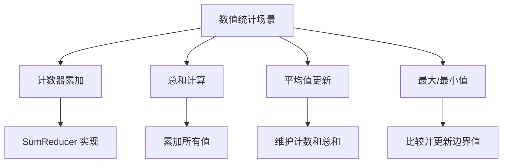

**适用字段：**
- 用户访问次数
- 错误发生频率
- 数据处理总量
- 性能指标统计

### 标签合并场景

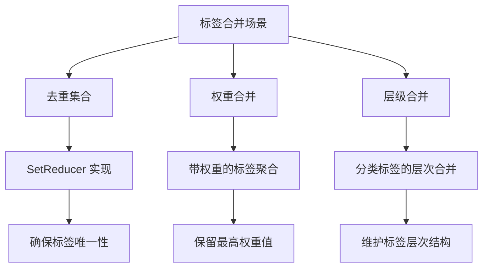

**适用字段：**
- 文档标签系统
- 用户兴趣标签
- 分类标签树
- 权重标签聚合

### 状态标志场景

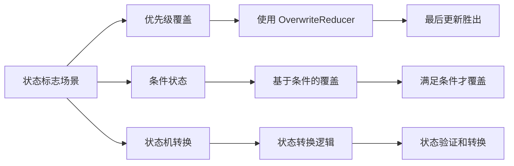

**适用字段：**
- 处理状态标识
- 错误级别标记
- 完成进度指示
- 权限级别设置

## 故障排除指南

### 常见错误及解决方案

| 错误类型 | 症状 | 解决方案 |
|----------|------|----------|
| 类型断言失败 | 运行时 panic | 添加类型检查和错误处理 |
| 空指针异常 | nil 值导致错误 | 实现 nil 值的安全处理 |
| 内存泄漏 | 内存使用持续增长 | 检查对象生命周期和引用关系 |
| 性能瓶颈 | 执行时间过长 | 优化算法复杂度和内存使用 |

### 调试技巧

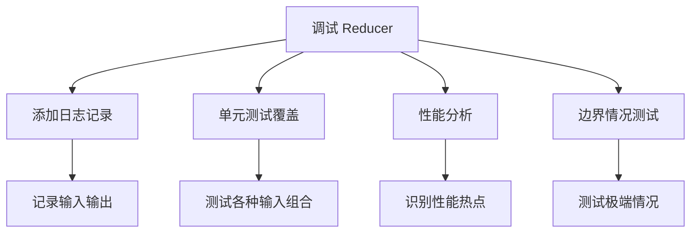

### 监控和诊断

- **执行时间监控**：跟踪 Reducer 的执行耗时
- **错误率统计**：监控 Reducer 失败率
- **内存使用分析**：观察内存分配模式
- **并发冲突检测**：识别潜在的竞态条件

### 最佳实践检查清单

- [ ] 实现适当的类型检查
- [ ] 提供清晰的错误信息
- [ ] 处理边界情况
- [ ] 编写充分的单元测试
- [ ] 考虑并发安全性
- [ ] 优化内存使用
- [ ] 添加必要的日志记录
- [ ] 进行性能基准测试

通过遵循这些指导原则和最佳实践，开发者可以有效地使用 LangGraphGo 的 Reducer 机制来构建健壮、高效的分布式状态管理系统。