# 状态模式

<cite>
**本文档引用的文件**
- [schema.go](file://graph/schema.go)
- [state_graph.go](file://graph/state_graph.go)
- [main.go](file://examples/state_schema/main.go)
- [checkpointing.go](file://graph/checkpointing.go)
- [streaming.go](file://graph/streaming.go)
- [schema_test.go](file://graph/schema_test.go)
- [streaming_test.go](file://graph/streaming_test.go)
- [update_state_test.go](file://graph/update_state_test.go)
- [messages_graph.go](file://graph/messages_graph.go)
- [main.go](file://examples/memory_basic/main.go)
</cite>

## 目录
1. [简介](#简介)
2. [StateSchema 接口设计](#stateschema-接口设计)
3. [MapSchema 实现详解](#mapschema-实现详解)
4. [StateSchema 与 StateGraph 集成](#stateschema-与-stategraph-集成)
5. [状态更新机制](#状态更新机制)
6. [检查点持久化集成](#检查点持久化集成)
7. [流式输出协同机制](#流式输出协同机制)
8. [最佳实践指南](#最佳实践指南)
9. [故障排除](#故障排除)
10. [总结](#总结)

## 简介

StateSchema 是 langgraphgo 中状态管理的核心契约，它定义了应用程序状态结构的规范和更新逻辑。通过 StateSchema 接口，开发者可以精确控制状态的初始化、更新和清理过程，确保状态变更的可预测性和一致性。

StateSchema 的设计理念源于对复杂状态管理需求的抽象，它允许开发者为不同类型的状态字段定义专门的更新策略（reducers），从而实现灵活且类型安全的状态操作。

## StateSchema 接口设计

StateSchema 接口是状态管理的基础契约，定义了两个核心方法：

```mermaid
classDiagram
class StateSchema {
<<interface>>
+Init() interface{}
+Update(current, new interface{}) (interface{}, error)
}
class CleaningStateSchema {
<<interface>>
+Cleanup(state interface{}) interface{}
}
class MapSchema {
+Reducers map[string]Reducer
+EphemeralKeys map[string]bool
+Init() interface{}
+Update(current, new interface{}) (interface{}, error)
+Cleanup(state interface{}) interface{}
+RegisterReducer(key string, reducer Reducer)
+RegisterChannel(key string, reducer Reducer, isEphemeral bool)
}
StateSchema <|-- CleaningStateSchema : extends
StateSchema <|.. MapSchema : implements
CleaningStateSchema <|.. MapSchema : implements
```

**图表来源**
- [schema.go](file://graph/schema.go#L12-L27)
- [schema.go](file://graph/schema.go#L29-L33)

### Init() 方法设计

Init() 方法负责返回应用程序的初始状态结构。这个方法的重要性体现在：

1. **状态标准化**: 确保每个新的执行实例都有统一的初始状态结构
2. **类型安全**: 返回 interface{} 类型，允许灵活的状态结构定义
3. **空状态处理**: 为后续的状态更新提供干净的起点

### Update() 方法设计

Update() 方法实现了状态合并的核心逻辑，它采用以下策略：

1. **增量更新**: 只更新发生变化的字段，保持未修改字段不变
2. **类型检查**: 验证当前状态和新状态都是 map[string]interface{} 类型
3. **深度复制**: 创建状态的副本以避免直接修改原始数据
4. **错误传播**: 提供详细的错误信息帮助调试

**章节来源**
- [schema.go](file://graph/schema.go#L12-L18)
- [schema.go](file://graph/schema.go#L57-L60)
- [schema.go](file://graph/schema.go#L62-L99)

## MapSchema 实现详解

MapSchema 是 StateSchema 接口的主要实现，专门为 map[string]interface{} 类型的状态提供了灵活的状态管理能力。

### 构造函数与初始化

MapSchema 使用工厂模式创建实例，通过 NewMapSchema() 函数：

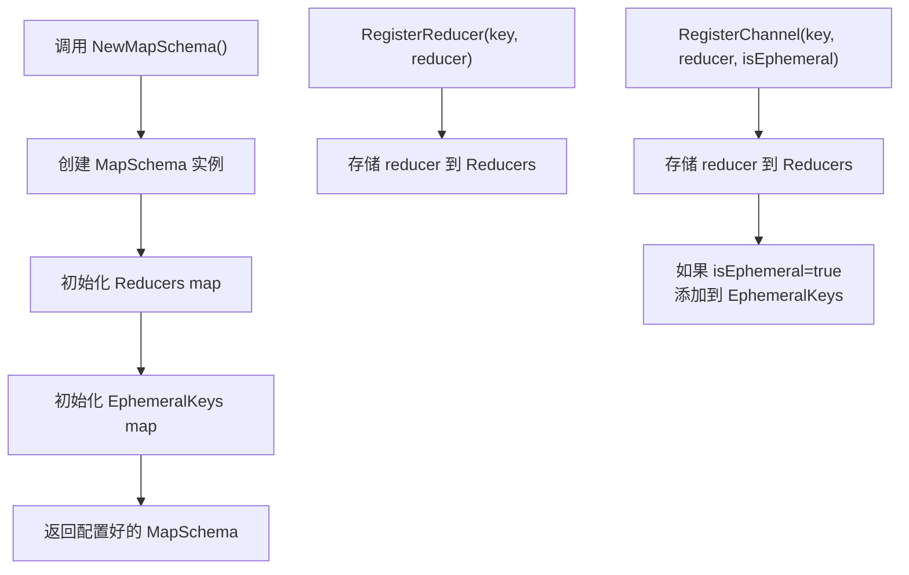

**图表来源**
- [schema.go](file://graph/schema.go#L37-L42)
- [schema.go](file://graph/schema.go#L44-L55)

### Reducer 注册机制

MapSchema 支持两种注册方式：

1. **RegisterReducer**: 为特定键注册 reducer
2. **RegisterChannel**: 同时注册 reducer 和设置临时性标志

这种设计允许开发者：
- 为不同字段定义专门的更新逻辑
- 区分持久状态和临时状态
- 实现复杂的业务规则

### 状态更新算法

MapSchema 的 Update() 方法实现了智能的状态合并算法：

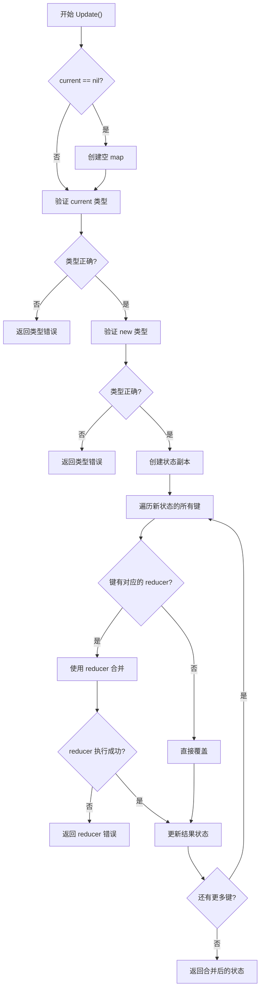

**图表来源**
- [schema.go](file://graph/schema.go#L62-L99)

**章节来源**
- [schema.go](file://graph/schema.go#L37-L55)
- [schema.go](file://graph/schema.go#L62-L99)

## StateSchema 与 StateGraph 集成

StateSchema 与 StateGraph 的集成是 langgraphgo 状态管理的核心机制。

### 集成架构

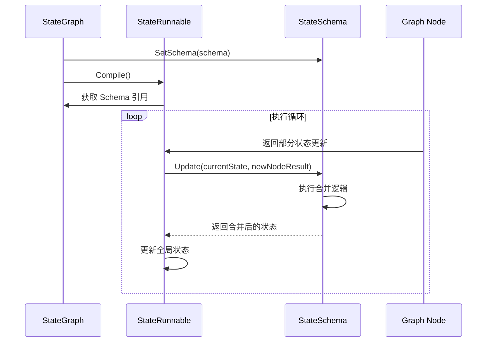

**图表来源**
- [state_graph.go](file://graph/state_graph.go#L94-L97)
- [state_graph.go](file://graph/state_graph.go#L200-L209)

### 生命周期管理

StateGraph 在执行过程中维护 StateSchema 的生命周期：

1. **编译阶段**: 设置 Schema 引用
2. **执行阶段**: 在每次节点执行后调用 Update()
3. **清理阶段**: 如果是 CleaningStateSchema，调用 Cleanup()

### 执行流程

StateRunnable 的 InvokeWithConfig 方法展示了 StateSchema 的实际使用：

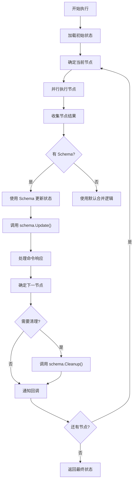

**图表来源**
- [state_graph.go](file://graph/state_graph.go#L120-L296)

**章节来源**
- [state_graph.go](file://graph/state_graph.go#L94-L97)
- [state_graph.go](file://graph/state_graph.go#L120-L296)

## 状态更新机制

StateSchema 的状态更新机制是其核心功能，支持多种更新策略和场景。

### 内置 Reducers

langgraphgo 提供了两种内置的 Reducer 函数：

#### OverwriteReducer
最简单的更新策略，直接用新值替换旧值：

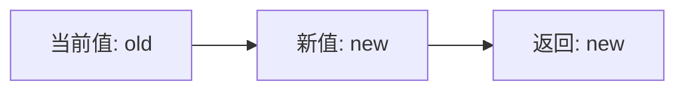

**图表来源**
- [schema.go](file://graph/schema.go#L141-L143)

#### AppendReducer
支持向集合类型（切片）追加元素：

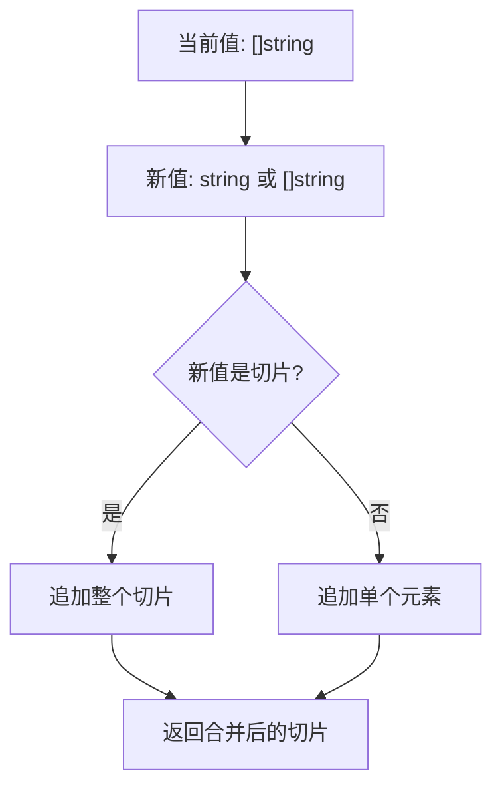

**图表来源**
- [schema.go](file://graph/schema.go#L146-L185)

### 自定义 Reducer 设计

开发者可以创建自定义 Reducer 来满足特定业务需求：

```mermaid
classDiagram
class Reducer {
<<function>>
+func(current, new interface{}) (interface{}, error)
}
class SumReducer {
+func(current, new interface{}) (interface{}, error)
}
class CustomLogicReducer {
+func(current, new interface{}) (interface{}, error)
}
Reducer <|.. SumReducer
Reducer <|.. CustomLogicReducer
```

**图表来源**
- [schema.go](file://graph/schema.go#L8-L10)
- [main.go](file://examples/state_schema/main.go#L11-L22)

### 类型安全处理

StateSchema 实现了多层次的类型安全保护：

1. **编译时检查**: 通过接口约束确保实现正确
2. **运行时验证**: 在 Update() 方法中验证类型
3. **错误处理**: 提供详细的错误信息

**章节来源**
- [schema.go](file://graph/schema.go#L141-L185)
- [main.go](file://examples/state_schema/main.go#L11-L22)
- [schema.go](file://graph/schema.go#L68-L76)

## 检查点持久化集成

StateSchema 与检查点系统的深度集成确保了状态变更的持久化和可恢复性。

### 检查点创建流程

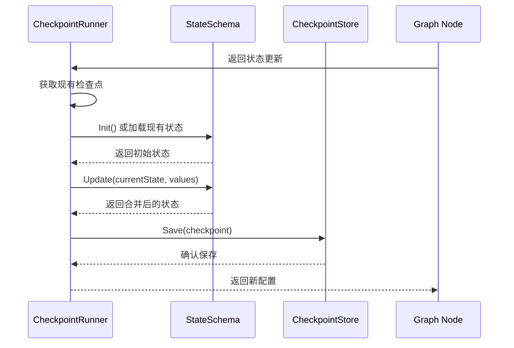

**图表来源**
- [checkpointing.go](file://graph/checkpointing.go#L481-L559)

### 状态恢复机制

检查点系统利用 StateSchema 来恢复和重建状态：

1. **初始化**: 使用 Schema.Init() 创建基础状态
2. **增量恢复**: 使用 Schema.Update() 逐步应用检查点
3. **版本管理**: 维护状态版本号确保一致性

### 错误恢复策略

当状态恢复失败时，系统采用以下策略：

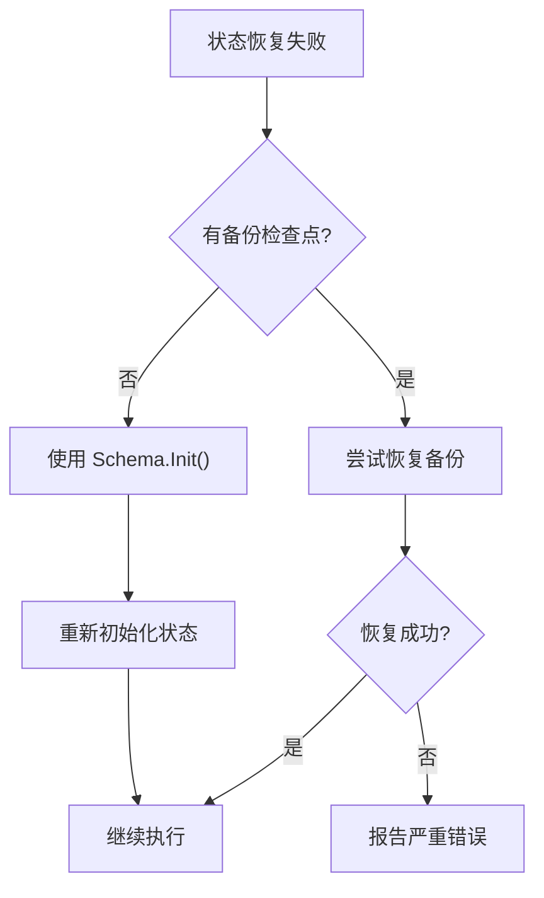

**章节来源**
- [checkpointing.go](file://graph/checkpointing.go#L481-L559)

## 流式输出协同机制

StateSchema 与流式输出系统的协同工作确保了实时状态变化的可见性。

### 流式事件生成

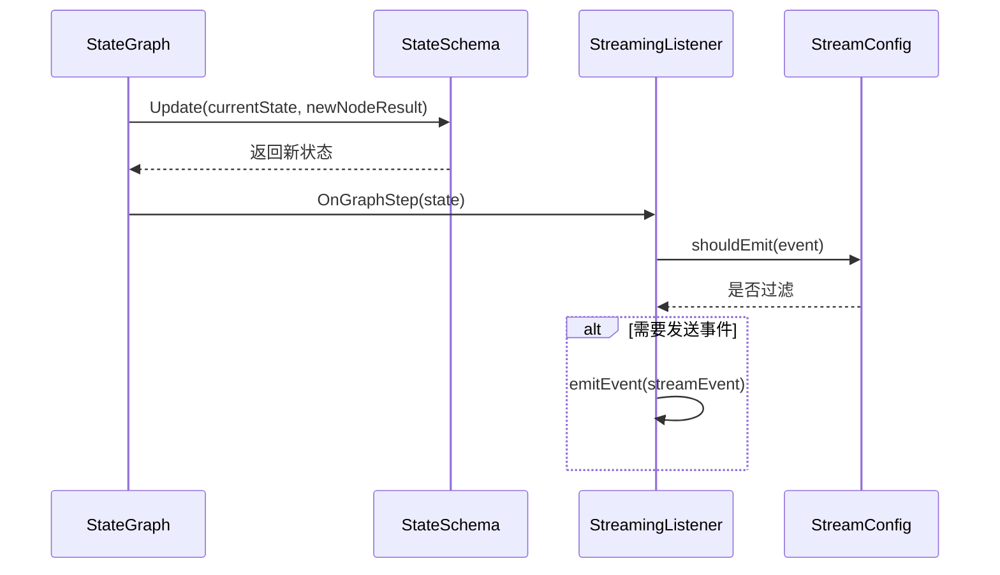

**图表来源**
- [streaming.go](file://graph/streaming.go#L135-L146)
- [state_graph.go](file://graph/state_graph.go#L282-L293)

### 流式模式支持

StateSchema 支持多种流式输出模式：

| 模式 | 描述 | 状态可见性 |
|------|------|------------|
| StreamModeValues | 发送完整状态 | 每次更新都包含完整状态 |
| StreamModeUpdates | 发送状态变更 | 只发送节点输出的变更 |
| StreamModeMessages | 发送消息内容 | 专注于 LLM 消息流 |
| StreamModeDebug | 发送所有事件 | 最详细的调试信息 |

### 背压处理

流式系统实现了智能的背压处理机制：

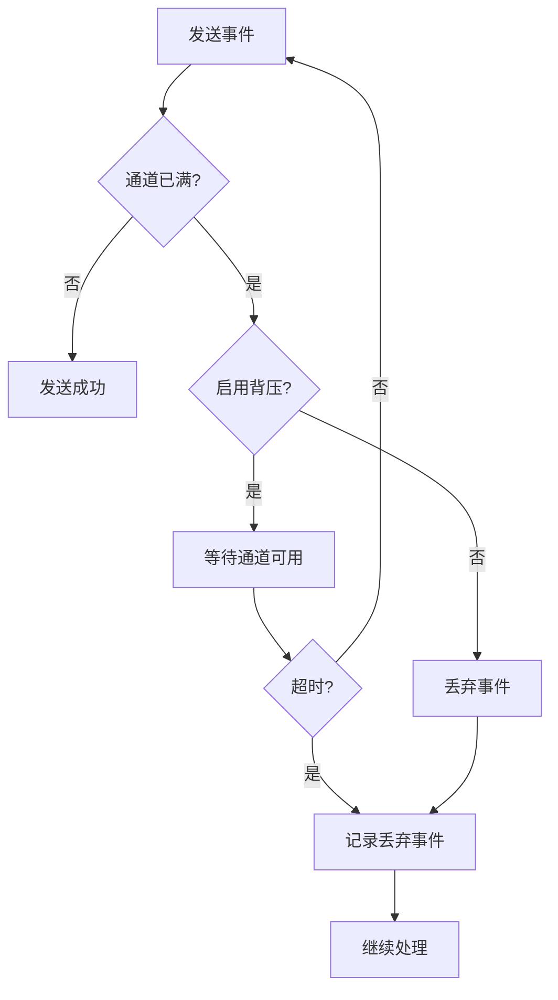

**图表来源**
- [streaming.go](file://graph/streaming.go#L84-L109)

**章节来源**
- [streaming.go](file://graph/streaming.go#L135-L146)
- [streaming.go](file://graph/streaming.go#L112-L133)
- [streaming.go](file://graph/streaming.go#L84-L109)

## 最佳实践指南

### 定义自定义状态模式

#### 1. 基础状态结构设计

```mermaid
classDiagram
class CustomState {
+string Status
+int Count
+[]string Messages
+map[string]interface{} Metadata
}
class StateSchemaImpl {
+Init() interface{}
+Update(current, new interface{}) (interface{}, error)
}
CustomState --> StateSchemaImpl : managed by
```

#### 2. Reducer 选择策略

根据字段特性选择合适的 Reducer：

| 字段类型 | 推荐 Reducer | 说明 |
|----------|--------------|------|
| 计数器 | SumReducer | 数值累加 |
| 消息列表 | AppendReducer | 文本追加 |
| 状态标志 | OverwriteReducer | 状态切换 |
| 配置对象 | 自定义 Reducer | 复杂合并逻辑 |

#### 3. 类型安全处理

实现强类型的 StateSchema：

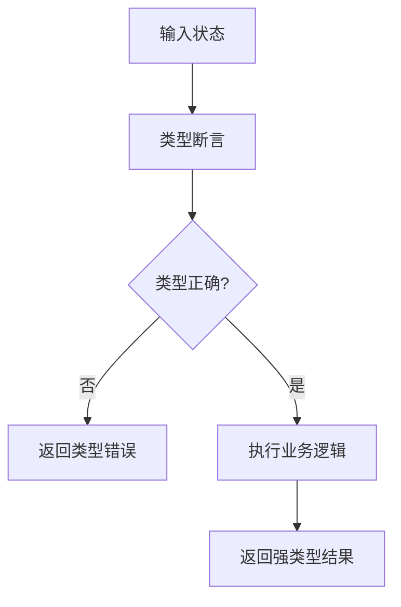

### 错误恢复策略

#### 1. 渐进式恢复

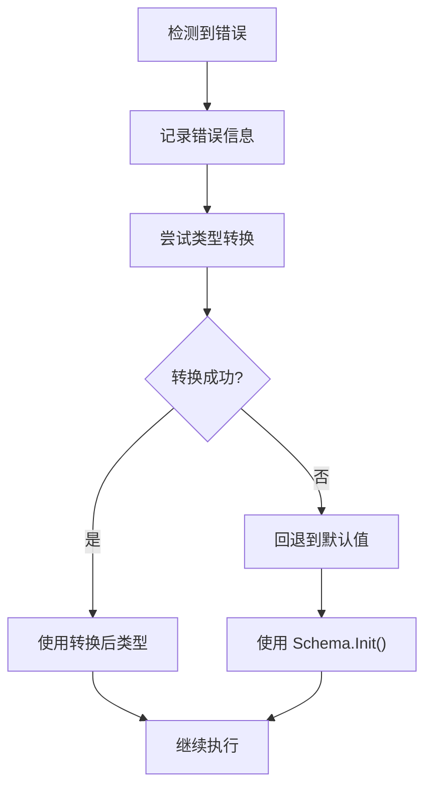

#### 2. 状态验证

在状态更新后进行验证：

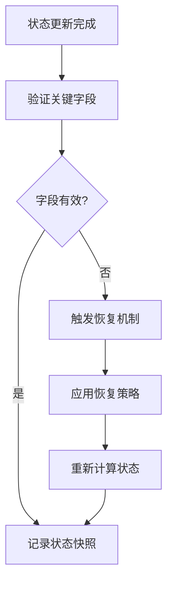

### 性能优化建议

#### 1. 内存管理

- 使用对象池减少内存分配
- 实现状态压缩机制
- 及时清理不需要的临时状态

#### 2. 并发安全

- 使用读写锁保护共享状态
- 实现无锁的数据结构
- 合理使用原子操作

**章节来源**
- [main.go](file://examples/state_schema/main.go#L11-L22)
- [schema_test.go](file://graph/schema_test.go#L10-L91)

## 故障排除

### 常见问题诊断

#### 1. 类型不匹配错误

**症状**: Update() 方法返回类型错误
**原因**: 当前状态或新状态不是 map[string]interface{}
**解决方案**: 
- 检查 Schema.Init() 的返回值
- 验证节点返回的状态格式
- 添加类型检查和转换逻辑

#### 2. 状态丢失问题

**症状**: 某些字段在状态更新后消失
**原因**: Reducer 实现错误或默认覆盖行为
**解决方案**:
- 检查 Reducer 的合并逻辑
- 使用 OverwriteReducer 明确指定覆盖行为
- 添加状态完整性检查

#### 3. 性能问题

**症状**: 状态更新速度慢
**原因**: 复杂的 Reducer 或大量状态字段
**解决方案**:
- 优化 Reducer 算法
- 减少不必要的状态字段
- 实现状态缓存机制

### 调试技巧

#### 1. 状态跟踪

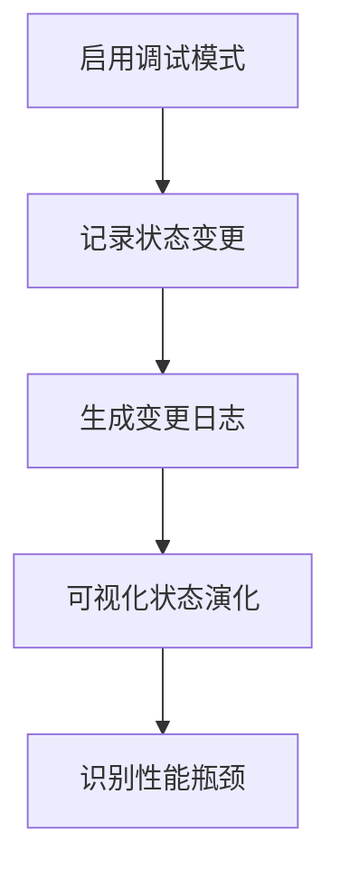

#### 2. 单元测试

为 StateSchema 编写全面的测试：

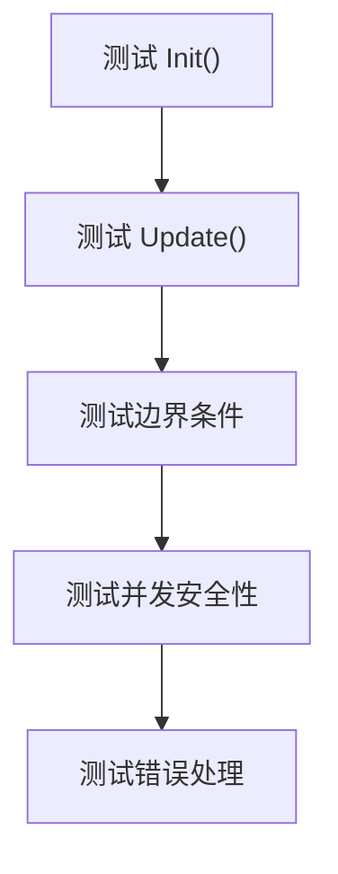

**章节来源**
- [schema_test.go](file://graph/schema_test.go#L10-L91)
- [streaming_test.go](file://graph/streaming_test.go#L10-L104)

## 总结

StateSchema 接口是 langgraphgo 状态管理系统的核心，它通过清晰的契约设计和灵活的实现机制，为复杂的应用程序状态管理提供了强大的基础设施。

### 关键优势

1. **类型安全**: 通过接口约束确保实现正确性
2. **灵活性**: 支持多种更新策略和自定义逻辑
3. **可扩展性**: 易于添加新的 Reducer 和状态类型
4. **集成性**: 与检查点、流式输出等特性无缝集成

### 设计原则

1. **单一职责**: 每个 Reducer 只负责特定字段的更新
2. **开放封闭**: 对扩展开放，对修改封闭
3. **依赖倒置**: 依赖抽象而非具体实现
4. **组合优于继承**: 通过组合多个 Reducer 实现复杂逻辑

### 未来发展方向

随着应用程序复杂度的增加，StateSchema 可能的发展方向包括：

- 更强的类型系统支持
- 分布式状态同步机制
- 更智能的冲突解决策略
- 更完善的性能监控和优化工具

通过深入理解和正确使用 StateSchema，开发者可以构建出既强大又可靠的状态管理解决方案，为复杂的业务逻辑提供坚实的基础。