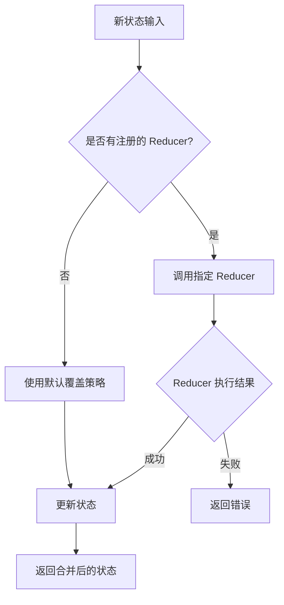
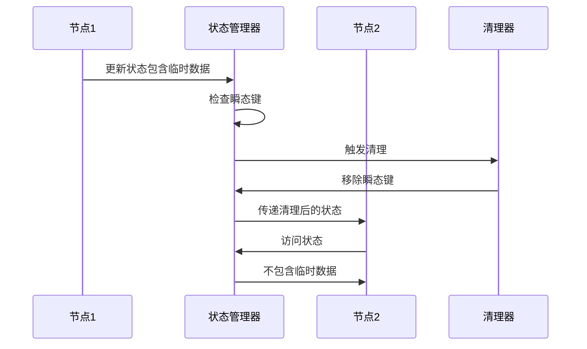
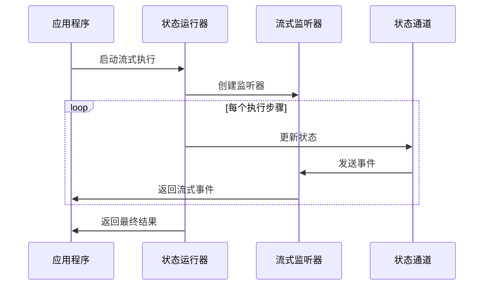

# 状态管理

<cite>
**本文档中引用的文件**
- [schema.go](file://graph/schema.go)
- [schema_test.go](file://graph/schema_test.go)
- [state_graph.go](file://graph/state_graph.go)
- [streaming.go](file://graph/streaming.go)
- [checkpointing.go](file://graph/checkpointing.go)
- [custom_reducer/main.go](file://examples/custom_reducer/main.go)
- [state_schema/main.go](file://examples/state_schema/main.go)
- [ephemeral_channels/main.go](file://examples/ephemeral_channels/main.go)
- [streaming_modes/main.go](file://examples/streaming_modes/main.go)
</cite>

## 目录
1. [简介](#简介)
2. [StateSchema 接口设计](#stateschema-接口设计)
3. [MapSchema 核心实现](#mapschema-核心实现)
4. [Reduction 函数系统](#reduction-函数系统)
5. [瞬态通道机制](#瞬态通道机制)
6. [持久化检查点](#持久化检查点)
7. [流式输出状态管理](#流式输出状态管理)
8. [实际应用示例](#实际应用示例)
9. [最佳实践与性能考虑](#最佳实践与性能考虑)
10. [总结](#总结)

## 简介

LangGraphGo 的状态管理系统是整个框架的核心，它提供了一套完整且灵活的状态管理模式，支持复杂的工作流编排和状态演化。该系统通过 StateSchema 接口定义了状态的基本结构和更新逻辑，并通过 Reducer 函数提供了精确的状态合并控制能力。

状态管理系统的主要特点包括：
- **类型安全的状态管理**：通过接口定义确保状态操作的一致性
- **灵活的更新策略**：支持多种状态合并模式（覆盖、追加、自定义）
- **瞬态通道支持**：允许在执行过程中自动清理临时状态
- **持久化能力**：支持将状态保存到各种存储介质
- **流式处理**：提供实时状态变化的监听和处理能力

## StateSchema 接口设计

StateSchema 接口是整个状态管理系统的基础抽象，它定义了状态的基本行为规范。

```mermaid
classDiagram
class StateSchema {
<<interface>>
+Init() interface{}
+Update(current, new interface{}) (interface{}, error)
}
class CleaningStateSchema {
<<interface>>
+Cleanup(state interface{}) interface{}
}
class MapSchema {
+Reducers map[string]Reducer
+EphemeralKeys map[string]bool
+RegisterReducer(key string, reducer Reducer)
+RegisterChannel(key string, reducer Reducer, isEphemeral bool)
+Init() interface{}
+Update(current, new interface{}) (interface{}, error)
+Cleanup(state interface{}) interface{}
}
StateSchema <|-- CleaningStateSchema : extends
StateSchema <|.. MapSchema : implements
CleaningStateSchema <|.. MapSchema : implements
```

**图表来源**
- [schema.go](file://graph/schema.go#L12-L27)

### StateSchema 接口方法

StateSchema 接口定义了两个核心方法：

1. **Init() 方法**：返回状态的初始值，通常是一个空的状态对象
2. **Update() 方法**：将新的状态更新合并到当前状态中

### CleaningStateSchema 扩展接口

CleaningStateSchema 在 StateSchema 基础上增加了 Cleanup 方法，用于支持瞬态通道的自动清理功能。

**章节来源**
- [schema.go](file://graph/schema.go#L12-L27)

## MapSchema 核心实现

MapSchema 是 StateSchema 接口的主要实现，专门用于管理基于键值对的状态映射。

```mermaid
classDiagram
class MapSchema {
+Reducers map[string]Reducer
+EphemeralKeys map[string]bool
+RegisterReducer(key string, reducer Reducer)
+RegisterChannel(key string, reducer Reducer, isEphemeral bool)
+Init() interface{}
+Update(current, new interface{}) (interface{}, error)
+Cleanup(state interface{}) interface{}
}
class Reducer {
<<function>>
+func(current, new interface{}) (interface{}, error)
}
MapSchema --> Reducer : uses
```

**图表来源**
- [schema.go](file://graph/schema.go#L29-L137)

### MapSchema 的核心特性

1. **键值映射管理**：通过 `Reducers` 字典维护每个状态键对应的更新函数
2. **瞬态键跟踪**：通过 `EphemeralKeys` 字典标识需要在每步执行后清理的键
3. **默认覆盖策略**：未注册的键使用默认的覆盖更新策略

### 注册机制

MapSchema 提供了两种注册方法：

- **RegisterReducer**：仅注册更新函数，适用于持久状态
- **RegisterChannel**：同时注册更新函数和瞬态标志，适用于临时状态

**章节来源**
- [schema.go](file://graph/schema.go#L36-L55)

## Reduction 函数系统

Reduction 函数是状态管理系统的核心组件，负责定义具体的状态合并逻辑。



**图表来源**
- [schema.go](file://graph/schema.go#L62-L99)

### 内置 Reducer 类型

#### OverwriteReducer
最简单的更新策略，直接用新值替换旧值。

#### AppendReducer
支持向现有集合添加新元素，具有智能类型推断能力：
- 支持单个元素追加
- 支持切片到切片的合并
- 自动创建目标类型的切片

#### 自定义 Reducer
开发者可以实现任意复杂的更新逻辑，如 SetReducer 实现的去重合并。

**章节来源**
- [schema.go](file://graph/schema.go#L141-L185)
- [custom_reducer/main.go](file://examples/custom_reducer/main.go#L12-L42)

## 瞬态通道机制

瞬态通道（Ephemeral Channels）是 LangGraphGo 状态管理系统的重要特性，允许在执行过程中自动清理临时状态。



**图表来源**
- [schema.go](file://graph/schema.go#L102-L137)
- [ephemeral_channels/main.go](file://examples/ephemeral_channels/main.go#L17-L21)

### 瞬态通道的工作原理

1. **注册阶段**：通过 `RegisterChannel` 方法标记某个键为瞬态
2. **执行阶段**：每次节点执行完成后，状态管理器自动清理瞬态键
3. **访问阶段**：后续节点无法访问已被清理的瞬态数据

### 应用场景

- **临时计算结果**：避免污染长期状态
- **中间处理数据**：保持状态的清晰性
- **安全敏感数据**：防止敏感信息被意外保留

**章节来源**
- [schema.go](file://graph/schema.go#L102-L137)
- [ephemeral_channels/main.go](file://examples/ephemeral_channels/main.go#L17-L74)

## 持久化检查点

状态管理系统与持久化层紧密集成，支持将状态保存到各种存储介质中。

```mermaid
classDiagram
class Checkpoint {
+ID string
+NodeName string
+State interface{}
+Metadata map[string]interface{}
+Timestamp time.Time
+Version int
}
class CheckpointStore {
<<interface>>
+Save(ctx context.Context, checkpoint *Checkpoint) error
+Load(ctx context.Context, checkpointID string) (*Checkpoint, error)
+List(ctx context.Context, executionID string) ([]*Checkpoint, error)
+Delete(ctx context.Context, checkpointID string) error
+Clear(ctx context.Context, executionID string) error
}
class MemoryCheckpointStore {
+checkpoints map[string]*Checkpoint
+mutex sync.RWMutex
}
class PostgresCheckpointStore {
+pool DBPool
+tableName string
}
class SqliteCheckpointStore {
+db *sql.DB
+tableName string
}
CheckpointStore <|.. MemoryCheckpointStore : implements
CheckpointStore <|.. PostgresCheckpointStore : implements
CheckpointStore <|.. SqliteCheckpointStore : implements
```

**图表来源**
- [checkpointing.go](file://graph/checkpointing.go#L12-L38)

### 检查点的生命周期

1. **创建**：在节点执行前后自动创建检查点
2. **保存**：将状态序列化并存储到持久化介质
3. **加载**：从存储中恢复状态
4. **清理**：删除不再需要的检查点

### 检查点在状态管理中的作用

- **容错恢复**：在执行中断后可以从最近的检查点恢复
- **版本控制**：支持状态的历史版本追踪
- **并发控制**：确保状态变更的一致性

**章节来源**
- [checkpointing.go](file://graph/checkpointing.go#L12-L485)

## 流式输出状态管理

状态管理系统提供了强大的流式处理能力，支持实时监听状态变化。



**图表来源**
- [streaming.go](file://graph/streaming.go#L66-L200)
- [state_graph.go](file://graph/state_graph.go#L115-L200)

### 流式模式类型

1. **StreamModeValues**：发送完整的状态快照
2. **StreamModeUpdates**：发送节点输出的增量更新
3. **StreamModeMessages**：专门发送 LLM 相关的消息
4. **StreamModeDebug**：发送所有类型的调试事件

### 流式监听器架构

```mermaid
classDiagram
class StreamingListener {
+eventChan chan~StreamEvent~
+config StreamConfig
+droppedEvents int
+closed bool
+emitEvent(event StreamEvent)
+shouldEmit(event StreamEvent) bool
+OnNodeEvent(ctx context.Context, event NodeEvent, nodeName string, state interface{}, err error)
}
class StreamConfig {
+BufferSize int
+EnableBackpressure bool
+MaxDroppedEvents int
+Mode StreamMode
}
class StreamEvent {
+Timestamp time.Time
+NodeName string
+Event NodeEvent
+State interface{}
+Error error
+Metadata map[string]interface{}
}
StreamingListener --> StreamConfig : uses
StreamingListener --> StreamEvent : creates
```

**图表来源**
- [streaming.go](file://graph/streaming.go#L66-L146)

**章节来源**
- [streaming.go](file://graph/streaming.go#L9-L21)
- [streaming_modes/main.go](file://examples/streaming_modes/main.go#L15-L55)

## 实际应用示例

### 基本状态模式示例

基本的状态管理展示了如何使用 MapSchema 来定义不同类型的状态更新策略。

**章节来源**
- [state_schema/main.go](file://examples/state_schema/main.go#L24-L105)

### 自定义 Reducer 示例

展示了如何实现复杂的去重合并逻辑，用于管理标签等集合类型的状态。

**章节来源**
- [custom_reducer/main.go](file://examples/custom_reducer/main.go#L12-L93)

### 瞬态通道示例

演示了如何使用瞬态通道来管理临时数据，确保这些数据不会影响后续的执行步骤。

**章节来源**
- [ephemeral_channels/main.go](file://examples/ephemeral_channels/main.go#L11-L75)

## 最佳实践与性能考虑

### 状态设计原则

1. **单一职责**：每个状态键应该有明确的用途和更新逻辑
2. **不可变性**：尽量避免直接修改状态，而是返回新的状态副本
3. **类型安全**：使用强类型来减少运行时错误
4. **最小化状态**：只存储必要的状态信息

### 性能优化策略

1. **选择合适的 Reducer**：根据数据特征选择最优的更新策略
2. **合理使用瞬态通道**：及时清理不需要的临时数据
3. **批量处理**：对于大量状态更新，考虑批量处理机制
4. **内存管理**：注意状态大小，避免内存泄漏

### 错误处理

1. **验证输入**：在 Reducer 中验证输入数据的有效性
2. **优雅降级**：当 Reducer 失败时提供合理的默认行为
3. **日志记录**：记录状态变更的详细信息以便调试

## 总结

LangGraphGo 的状态管理系统通过精心设计的接口和实现，提供了一个强大而灵活的状态管理解决方案。StateSchema 接口定义了状态的基本行为，MapSchema 提供了具体的实现，Reduction 函数系统支持复杂的更新逻辑，瞬态通道机制确保了状态的清洁性，持久化检查点提供了容错能力，而流式输出则支持实时的状态监控。

这套系统不仅保证了状态变更的可预测性和一致性，还为构建复杂的工作流应用提供了坚实的基础。开发者可以通过自定义 Reducer 来满足特定的业务需求，通过瞬态通道来管理临时数据，通过持久化检查点来确保系统的可靠性，并通过流式输出来实现实时的状态监控。

这种模块化的设计使得状态管理系统既易于理解和使用，又具备足够的灵活性来应对各种复杂的业务场景。无论是简单的状态跟踪还是复杂的工作流编排，LangGraphGo 的状态管理系统都能提供合适的支持。