# 瞬态通道

<cite>
**本文档中引用的文件**
- [graph/schema.go](file://graph/schema.go)
- [examples/ephemeral_channels/main.go](file://examples/ephemeral_channels/main.go)
- [examples/ephemeral_channels/README.md](file://examples/ephemeral_channels/README.md)
- [examples/ephemeral_channels/README_CN.md](file://examples/ephemeral_channels/README_CN.md)
- [graph/state_graph.go](file://graph/state_graph.go)
- [graph/graph.go](file://graph/graph.go)
- [graph/channel_test.go](file://graph/channel_test.go)
- [examples/state_schema/main.go](file://examples/state_schema/main.go)
</cite>

## 目录
1. [引言](#引言)
2. [设计目的与核心概念](#设计目的与核心概念)
3. [技术架构分析](#技术架构分析)
4. [MapSchema 实现详解](#mapschema-实现详解)
5. [执行流程与生命周期管理](#执行流程与生命周期管理)
6. [具体用例分析](#具体用例分析)
7. [与持久化检查点的关系](#与持久化检查点的关系)
8. [最佳实践指南](#最佳实践指南)
9. [潜在陷阱与调试技巧](#潜在陷阱与调试技巧)
10. [总结](#总结)

## 引言

瞬态通道（Ephemeral Channels）是 LangGraphGo 中一个重要的设计概念，它为复杂工作流中的临时状态管理提供了优雅的解决方案。在有状态的应用程序中，不是所有数据都需要在整个对话历史中持久保存。某些数据具有短暂的生命周期，仅在紧接的下一步或特定的超步（并行执行块）中有效，之后应当被丢弃。

瞬态通道通过自动清理机制，确保临时数据不会污染后续的执行步骤，从而维护了系统的清晰性和性能。这种设计特别适用于需要处理中间计算结果、临时标志或一次性数据传递的场景。

## 设计目的与核心概念

### 核心设计目标

瞬态通道的设计围绕以下核心目标展开：

1. **自动清理机制**：标记为瞬态的通道在步骤完成后会自动从状态中清除
2. **作用域隔离**：防止临时数据泄漏到未来的执行步骤中，减少上下文污染
3. **配置灵活性**：通过 `RegisterChannel` 方法的 `isEphemeral` 标志进行精确控制
4. **性能优化**：避免不必要的状态持久化，提升执行效率

### 关键术语定义

- **瞬态通道（Ephemeral Channel）**：标记为临时的通道，在步骤完成后自动清理
- **超步（Super-step）**：LangGraph 中的并行执行单元，通常包含多个节点的并发执行
- **步骤（Step）**：执行的基本单位，超步结束后会触发清理操作
- **持久化通道（Persistent Channel）**：正常状态字段，保持在整个执行过程中

## 技术架构分析

### 清理状态架构接口

瞬态通道的实现基于 `CleaningStateSchema` 接口，这是对基础 `StateSchema` 接口的扩展：

```mermaid
classDiagram
class StateSchema {
<<interface>>
+Init() interface{}
+Update(current, new) (interface{}, error)
}
class CleaningStateSchema {
<<interface>>
+Cleanup(state) interface{}
}
class MapSchema {
+Reducers map[string]Reducer
+EphemeralKeys map[string]bool
+RegisterChannel(key, reducer, isEphemeral)
+Cleanup(state) interface{}
}
StateSchema <|-- CleaningStateSchema
CleaningStateSchema <|.. MapSchema
```

**图表来源**
- [graph/schema.go](file://graph/schema.go#L12-L27)

### 架构层次结构

瞬态通道的实现涉及多个层次的组件协作：

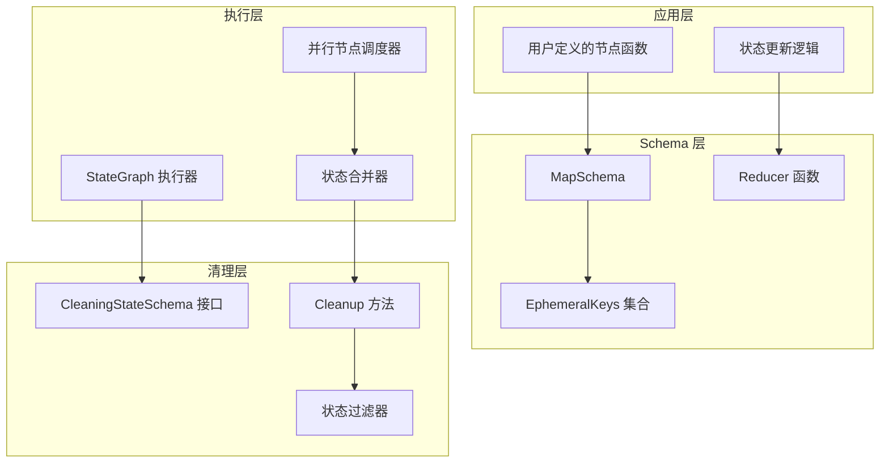

**图表来源**
- [graph/schema.go](file://graph/schema.go#L29-L137)
- [graph/state_graph.go](file://graph/state_graph.go#L10-L32)

**章节来源**
- [graph/schema.go](file://graph/schema.go#L12-L27)

## MapSchema 实现详解

### 数据结构设计

`MapSchema` 是瞬态通道功能的核心实现，它维护两个关键的数据结构：

```mermaid
classDiagram
class MapSchema {
+Reducers map[string]Reducer
+EphemeralKeys map[string]bool
+RegisterReducer(key, reducer)
+RegisterChannel(key, reducer, isEphemeral)
+Update(current, new) (interface{}, error)
+Cleanup(state) interface{}
}
note for MapSchema "EphemeralKeys 存储标记为临时的键名集合"
note for MapSchema "Reducers 定义各键的更新逻辑"
```

**图表来源**
- [graph/schema.go](file://graph/schema.go#L31-L33)

### 关键方法实现

#### RegisterChannel 方法

`RegisterChannel` 方法是配置瞬态通道的核心入口：

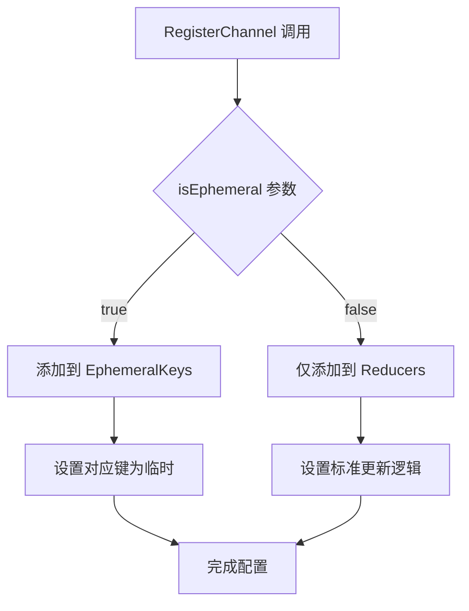

**图表来源**
- [graph/schema.go](file://graph/schema.go#L49-L54)

#### Cleanup 方法实现

`Cleanup` 方法负责在步骤结束时清理临时数据：

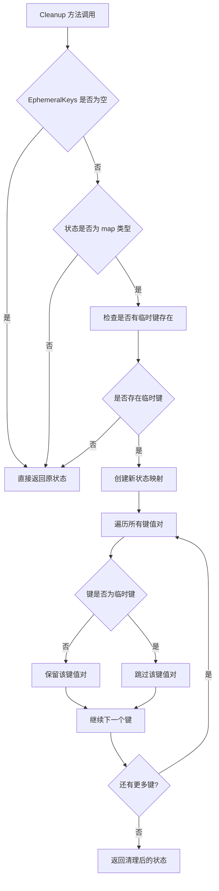

**图表来源**
- [graph/schema.go](file://graph/schema.go#L102-L136)

**章节来源**
- [graph/schema.go](file://graph/schema.go#L29-L137)

## 执行流程与生命周期管理

### 步骤执行循环

LangGraph 的执行流程遵循严格的步骤模式，瞬态通道的清理发生在每个步骤的特定阶段：

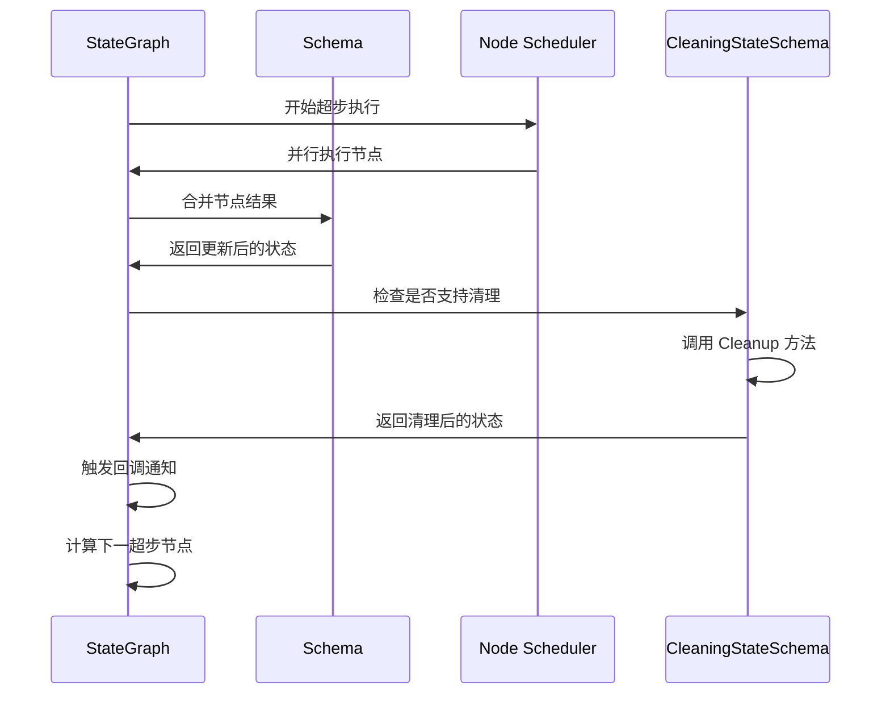

**图表来源**
- [graph/state_graph.go](file://graph/state_graph.go#L120-L281)
- [graph/graph.go](file://graph/graph.go#L450-L464)

### 生命周期阶段

瞬态通道的生命周期严格遵循以下阶段：

1. **定义阶段**：通过 `RegisterChannel` 明确标记临时键
2. **执行阶段**：在当前步骤中可用，可以被读取和写入
3. **合并阶段**：节点结果合并到主状态中
4. **清理阶段**：步骤结束时自动清理临时键
5. **验证阶段**：后续步骤无法访问已清理的临时数据

### 清理时机分析

清理操作发生在以下关键时间点：

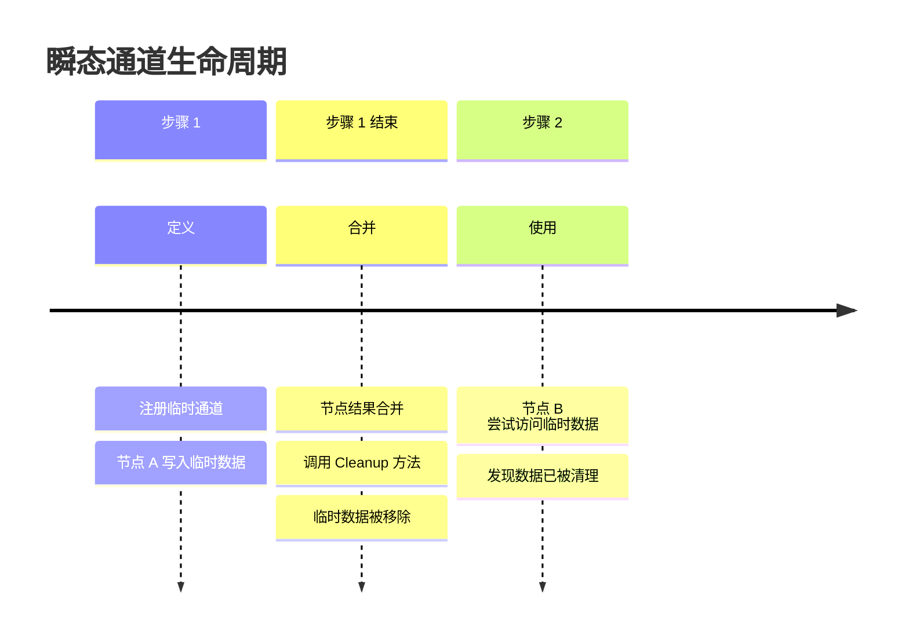

**图表来源**
- [graph/state_graph.go](file://graph/state_graph.go#L277-L280)

**章节来源**
- [graph/state_graph.go](file://graph/state_graph.go#L120-L281)
- [graph/graph.go](file://graph/graph.go#L450-L464)

## 具体用例分析

### 基础生产者-消费者示例

让我们深入分析 `examples/ephemeral_channels/main.go` 中的经典用例：

#### Schema 配置

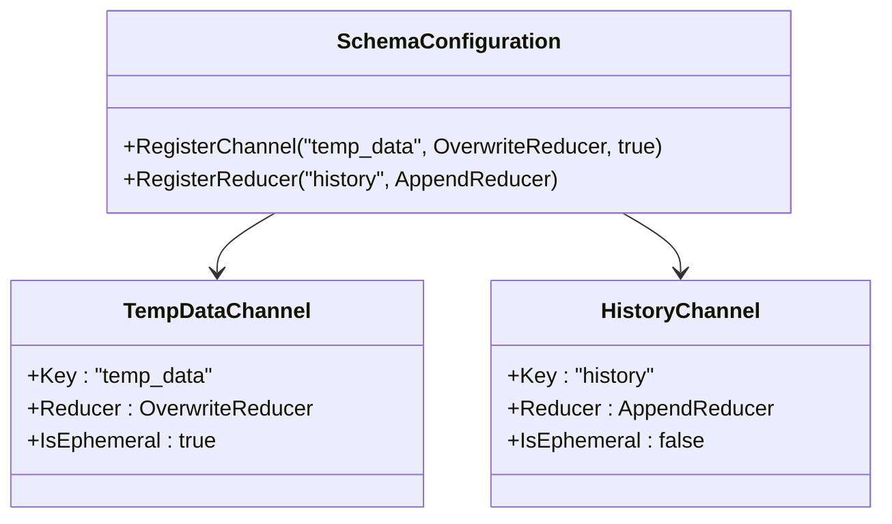

**图表来源**
- [examples/ephemeral_channels/main.go](file://examples/ephemeral_channels/main.go#L17-L21)

#### 执行流程分析

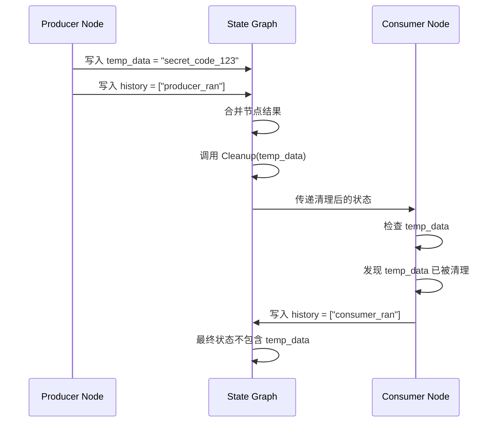

**图表来源**
- [examples/ephemeral_channels/main.go](file://examples/ephemeral_channels/main.go#L24-L51)

### 测试用例验证

测试用例进一步验证了瞬态通道的行为：

| 步骤 | 操作 | 状态变化 | 验证结果 |
|------|------|----------|----------|
| 1 | 节点 A 执行 | `temp=1, count=1` | 临时数据写入 |
| 2 | 步骤结束 | 调用 Cleanup | `temp` 被移除 |
| 3 | 节点 B 执行 | `temp` 不可用 | 验证清理成功 |
| 4 | 最终状态 | `count=11, temp` 缺失 | 确认作用域隔离 |

**章节来源**
- [examples/ephemeral_channels/main.go](file://examples/ephemeral_channels/main.go#L14-L75)
- [graph/channel_test.go](file://graph/channel_test.go#L9-L74)

## 与持久化检查点的关系

### 检查点机制概述

LangGraphGo 支持多种检查点存储方式（PostgreSQL、Redis、SQLite），这些机制主要用于：

1. **状态持久化**：在长时间运行的工作流中保存中间状态
2. **故障恢复**：系统崩溃后能够从最近的检查点恢复
3. **并发控制**：支持多线程或多实例的协调执行

### 瞬态通道 vs 检查点

两者在功能上存在明确的分工：

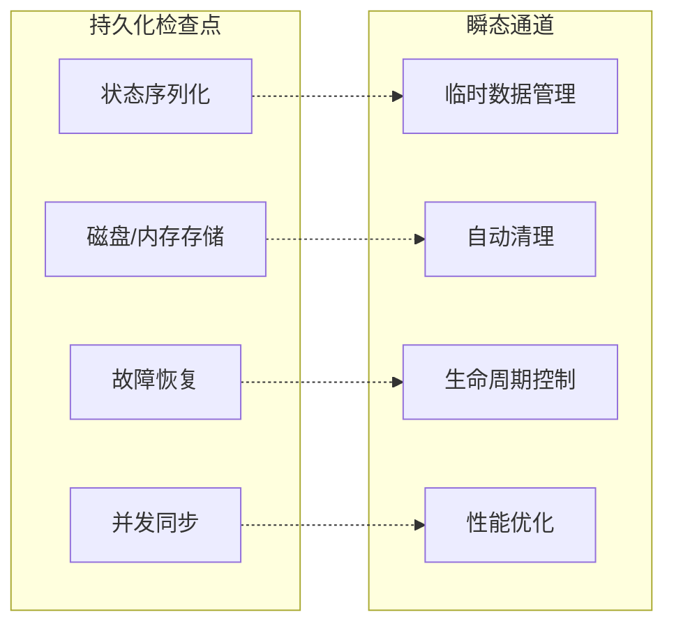

### 协作模式

在实际应用中，瞬态通道与检查点协同工作：

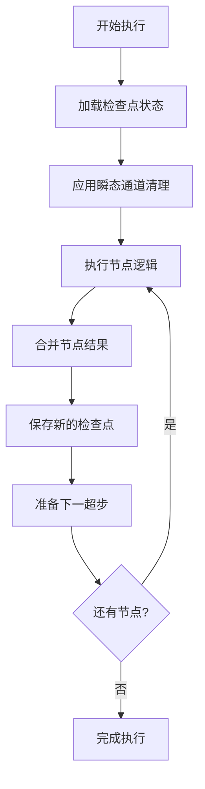

**图表来源**
- [graph/state_graph.go](file://graph/state_graph.go#L277-L280)

**章节来源**
- [graph/state_graph.go](file://graph/state_graph.go#L200-L281)

## 最佳实践指南

### 适用场景识别

#### 推荐使用瞬态通道的场景

1. **中间计算结果**：算法过程中的临时变量
2. **临时标志**：触发条件但不需要长期存在的标志位
3. **一次性数据**：只在当前步骤有意义的数据
4. **敏感信息**：临时密码、令牌等敏感数据
5. **调试信息**：临时调试状态或日志记录

#### 不适合使用瞬态通道的场景

1. **关键业务状态**：需要持久化的业务数据
2. **历史记录**：需要保留的执行历史
3. **配置参数**：长期有效的配置信息
4. **共享资源**：需要跨步骤共享的数据

### 配置最佳实践

#### Schema 设计原则

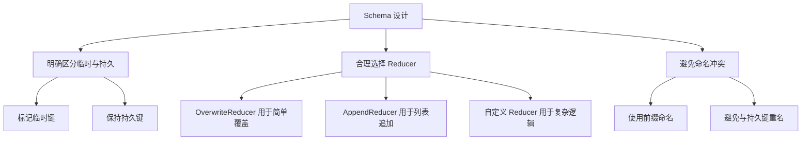

#### 性能优化建议

1. **最小化临时数据量**：只存储真正需要的临时信息
2. **及时清理**：依赖自动清理机制，避免手动干预
3. **合理分组**：将相关的临时数据放在同一个通道中
4. **监控内存使用**：关注瞬态通道对内存的影响

### 与常规状态字段的交互模式

#### 数据流向管理

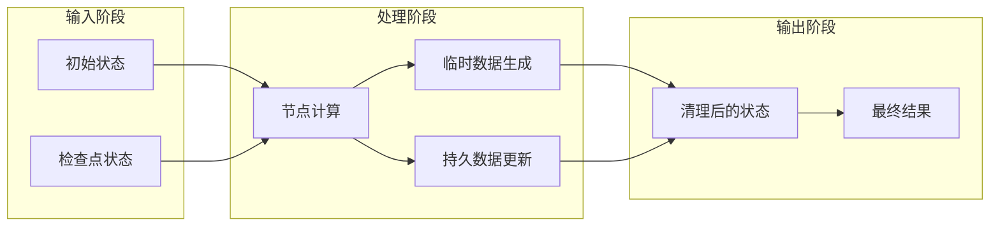

**章节来源**
- [examples/ephemeral_channels/main.go](file://examples/ephemeral_channels/main.go#L17-L21)
- [examples/state_schema/main.go](file://examples/state_schema/main.go#L28-L40)

## 潜在陷阱与调试技巧

### 常见陷阱

#### 1. 错误的生命周期理解

**问题描述**：开发者可能错误地认为瞬态数据在同一步内仍然可用

**解决方案**：理解 LangGraph 的步骤模型，瞬态数据在步骤结束时就被清理

#### 2. 临时数据依赖

**问题描述**：节点之间错误地依赖临时数据

**解决方案**：使用持久化通道传递需要跨步骤的数据

#### 3. 性能误解

**问题描述**：认为瞬态通道会显著提升性能

**解决方案**：瞬态通道主要解决的是状态管理和内存优化，而非性能瓶颈

### 调试技巧

#### 1. 状态检查工具

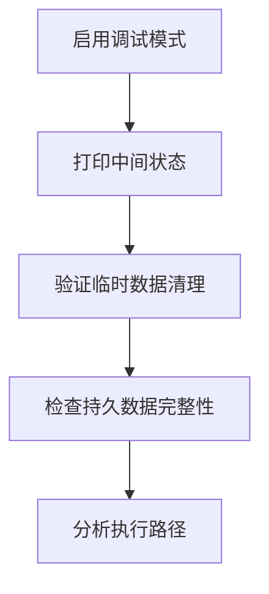

#### 2. 日志记录策略

建议在关键位置添加日志：

- 节点开始执行时记录输入状态
- 节点完成时记录输出状态
- 清理操作前后对比状态差异

#### 3. 单元测试方法

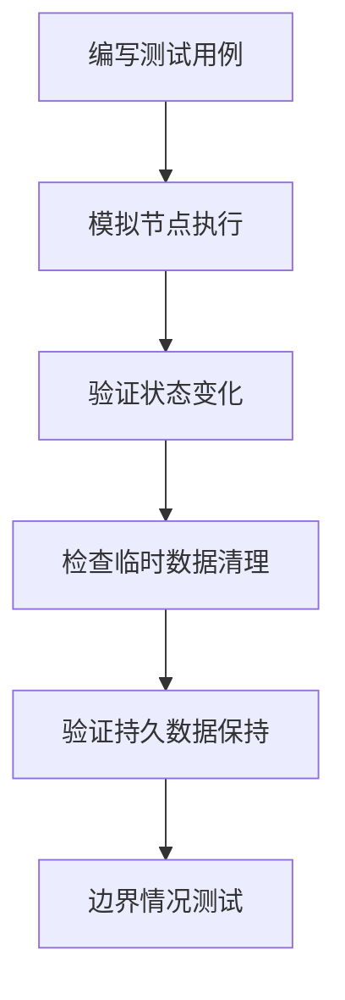

### 故障排除清单

| 问题类型 | 检查项目 | 解决方案 |
|----------|----------|----------|
| 数据丢失 | 瞬态通道配置 | 检查 `isEphemeral` 标志 |
| 性能问题 | 内存使用情况 | 分析临时数据大小 |
| 逻辑错误 | 状态流转 | 验证节点间数据传递 |
| 清理失败 | Schema 实现 | 检查 `Cleanup` 方法 |

**章节来源**
- [graph/channel_test.go](file://graph/channel_test.go#L9-L74)
- [examples/ephemeral_channels/README.md](file://examples/ephemeral_channels/README.md#L1-L48)

## 总结

瞬态通道作为 LangGraphGo 的重要特性，为复杂工作流中的临时状态管理提供了优雅的解决方案。通过自动清理机制，它有效地解决了状态污染问题，同时保持了系统的简洁性和性能。

### 核心价值

1. **自动化管理**：无需手动干预，系统自动处理临时数据的生命周期
2. **清晰的职责分离**：临时数据与持久数据的明确区分
3. **性能优化**：减少不必要的状态持久化开销
4. **开发体验提升**：简化了临时状态的管理复杂度

### 应用建议

- 在设计阶段就考虑哪些数据应该是临时的
- 合理配置 Schema，避免过度使用瞬态通道
- 充分利用自动清理机制，减少手动状态管理
- 结合检查点机制，实现临时与持久状态的平衡

瞬态通道的设计体现了 LangGraphGo 对现代工作流系统需求的深刻理解，它不仅解决了技术问题，更为开发者提供了一个清晰、高效的编程模型。