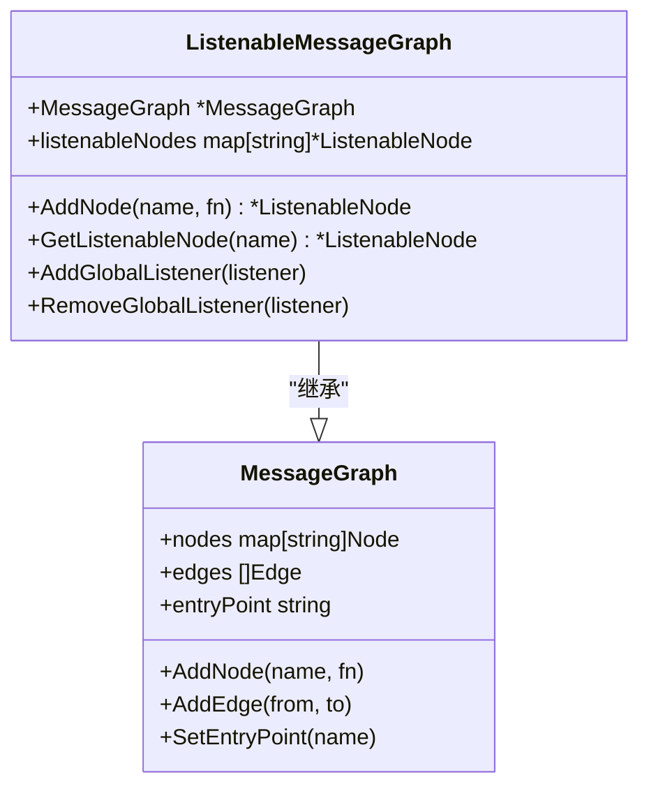
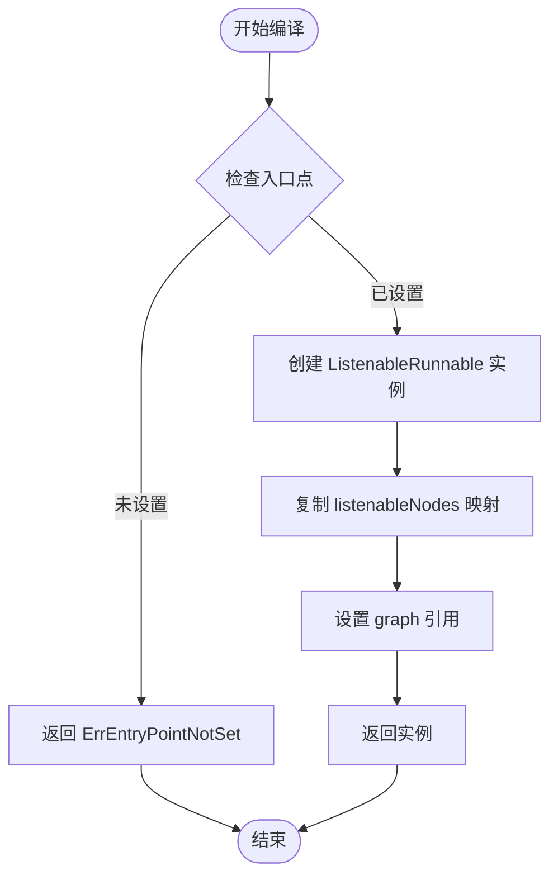
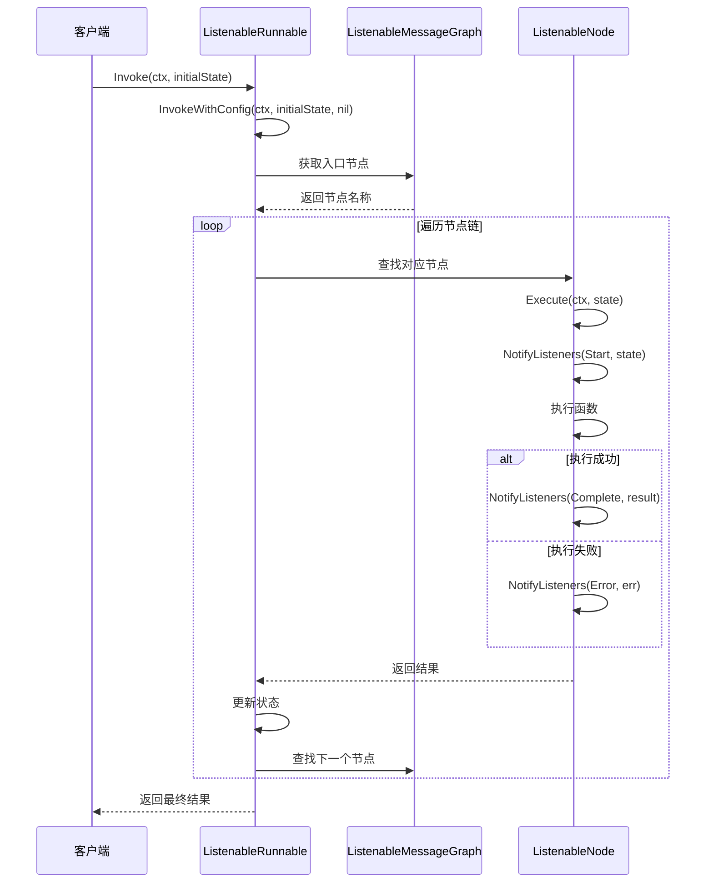
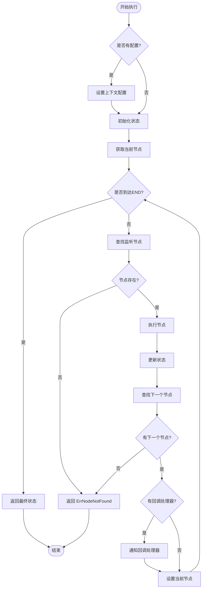
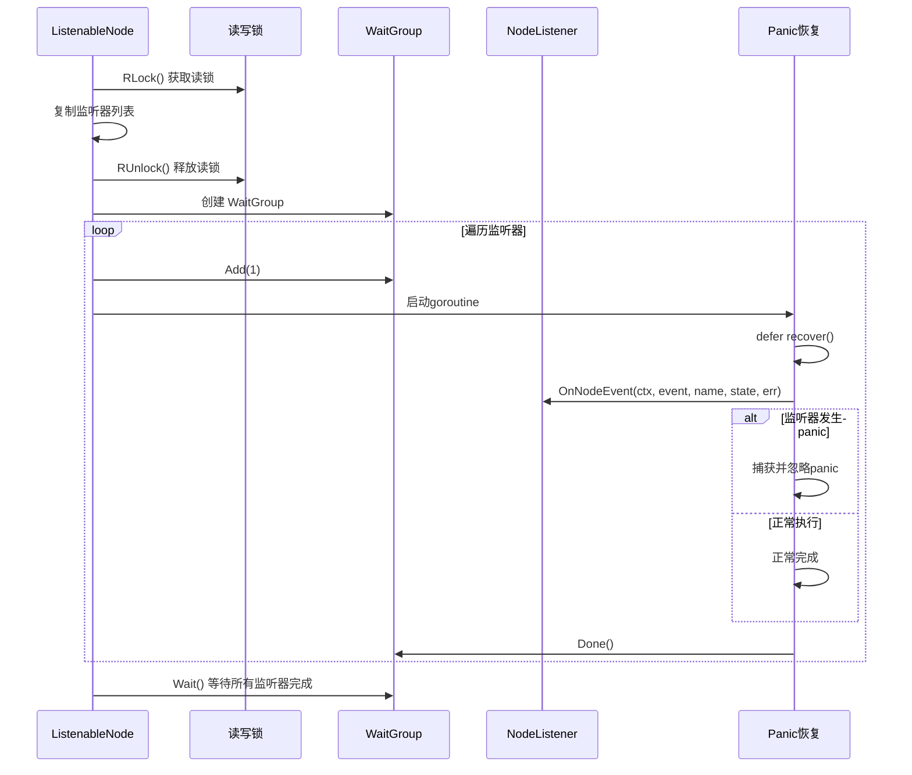
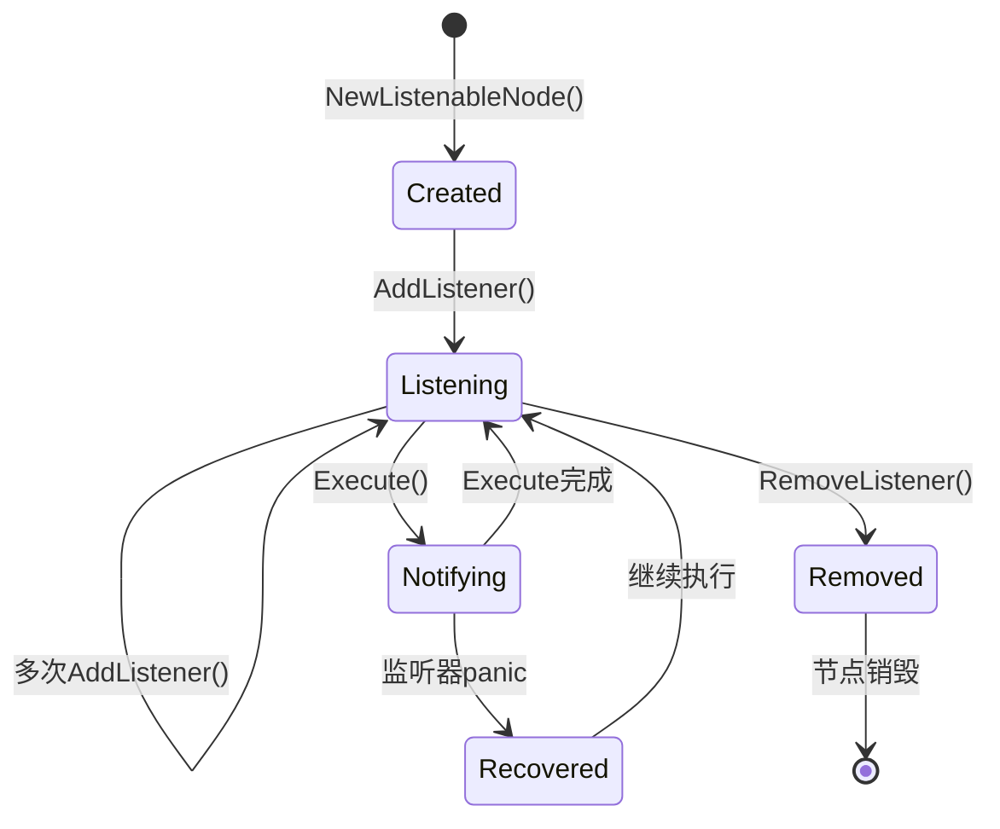
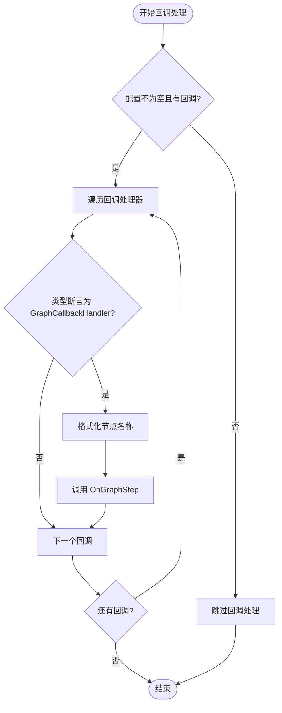
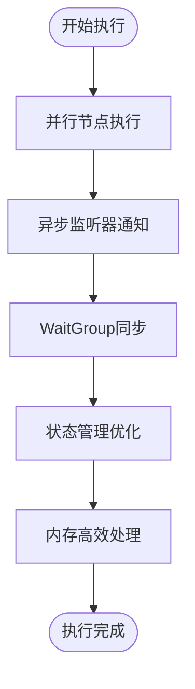
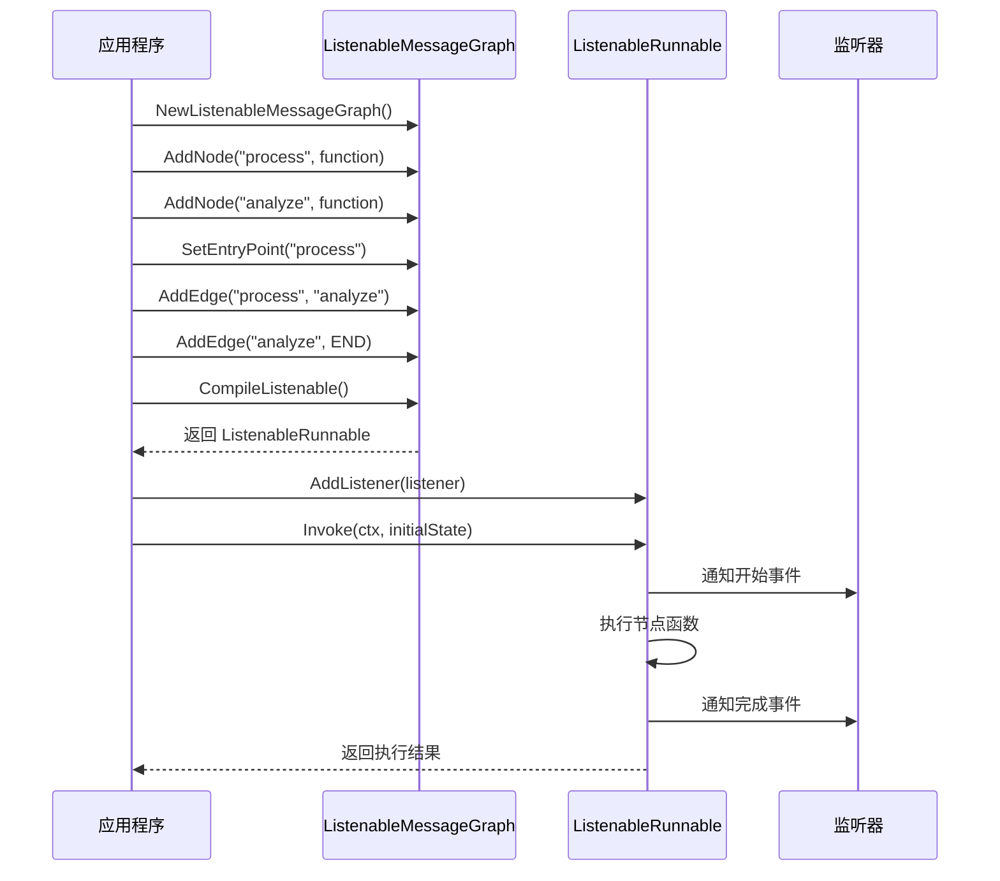

# 可监听可运行实例

<cite>
**本文档中引用的文件**
- [listeners.go](file://graph/listeners.go)
- [callbacks.go](file://graph/callbacks.go)
- [streaming.go](file://graph/streaming.go)
- [utils.go](file://graph/utils.go)
- [listeners_test.go](file://graph/listeners_test.go)
- [main.go](file://examples/listeners/main.go)
</cite>

## 目录
1. [简介](#简介)
2. [核心结构体架构](#核心结构体架构)
3. [CompileListenable 编译阶段](#compilelistenable-编译阶段)
4. [Invoke 和 InvokeWithConfig 执行流程](#invoke-和-invokewithconfig-执行流程)
5. [监听器系统设计](#监听器系统设计)
6. [回调处理器集成](#回调处理器集成)
7. [性能优化特性](#性能优化特性)
8. [实际应用示例](#实际应用示例)
9. [总结](#总结)

## 简介

ListenableRunnable 是 langgraphgo 框架中的核心组件，它扩展了基础的可运行实例（Runnable）功能，提供了完整的事件监听和回调处理能力。该组件作为监听体系的最终执行入口，在保持执行逻辑与监听解耦的同时，为开发者提供了强大的可观测性和可扩展性。

## 核心结构体架构

### ListenableRunnable 结构体

ListenableRunnable 是一个轻量级的包装器，它将 ListenableMessageGraph 的监听能力封装到可执行实例中：

```mermaid
classDiagram
class ListenableRunnable {
+graph *ListenableMessageGraph
+listenableNodes map[string]*ListenableNode
+Invoke(ctx, initialState) (interface{}, error)
+InvokeWithConfig(ctx, initialState, config) (interface{}, error)
+GetGraph() *Exporter
}
class ListenableMessageGraph {
+MessageGraph *MessageGraph
+listenableNodes map[string]*ListenableNode
+CompileListenable() (*ListenableRunnable, error)
+AddNode(name, fn) *ListenableNode
+GetListenableNode(name) *ListenableNode
+AddGlobalListener(listener)
+RemoveGlobalListener(listener)
}
class ListenableNode {
+Node
+listeners []NodeListener
+mutex sync.RWMutex
+Execute(ctx, state) (interface{}, error)
+NotifyListeners(ctx, event, state, err)
+AddListener(listener) *ListenableNode
+RemoveListener(listener)
+GetListeners() []NodeListener
}
class NodeListener {
<<interface>>
+OnNodeEvent(ctx, event, nodeName, state, err)
}
ListenableRunnable --> ListenableMessageGraph : "包含"
ListenableMessageGraph --> ListenableNode : "管理多个"
ListenableNode --> NodeListener : "支持多个"
```

**图表来源**
- [listeners.go](file://graph/listeners.go#L236-L240)
- [listeners.go](file://graph/listeners.go#L187-L191)
- [listeners.go](file://graph/listeners.go#L89-L102)

### ListenableMessageGraph 结构体

ListenableMessageGraph 扩展了基础的消息图功能，添加了监听节点的映射管理：



**图表来源**
- [listeners.go](file://graph/listeners.go#L187-L191)
- [listeners.go](file://graph/listeners.go#L193-L201)

**章节来源**
- [listeners.go](file://graph/listeners.go#L236-L251)

## CompileListenable 编译阶段

CompileListenable 方法是构建可监听可运行实例的关键步骤，它负责验证图的完整性并创建最终的执行实例：

### 编译过程详解



**图表来源**
- [listeners.go](file://graph/listeners.go#L242-L251)

### 编译阶段的核心职责

1. **入口点验证**：确保图具有明确的起始节点
2. **节点映射复制**：将所有监听节点从图中复制到可运行实例
3. **引用建立**：建立可运行实例与底层图的关联关系

**章节来源**
- [listeners.go](file://graph/listeners.go#L242-L251)

## Invoke 和 InvokeWithConfig 执行流程

### Invoke 方法执行流程

Invoke 方法提供最简化的执行接口，内部委托给 InvokeWithConfig：



**图表来源**
- [listeners.go](file://graph/listeners.go#L254-L257)
- [listeners.go](file://graph/listeners.go#L259-L328)

### InvokeWithConfig 方法执行流程

InvokeWithConfig 提供了更灵活的执行控制，支持配置参数和回调处理器：



**图表来源**
- [listeners.go](file://graph/listeners.go#L259-L328)

### 执行流程的关键特性

1. **状态管理**：支持自定义状态模式和默认状态替换
2. **错误处理**：完整的错误传播机制
3. **状态清理**：支持临时状态的自动清理
4. **回调集成**：无缝集成回调处理器

**章节来源**
- [listeners.go](file://graph/listeners.go#L254-L328)

## 监听器系统设计

### ListenableNode 的监听机制

ListenableNode 通过 NotifyListeners 方法实现了异步事件通知系统：



**图表来源**
- [listeners.go](file://graph/listeners.go#L128-L157)

### 监听器生命周期管理



**图表来源**
- [listeners.go](file://graph/listeners.go#L104-L127)

### 监听器系统的核心优势

1. **并发安全**：使用读写锁保护监听器列表
2. **异步通知**：监听器通知在独立goroutine中执行
3. **异常隔离**：监听器panic不会影响主执行流程
4. **批量操作**：支持全局监听器添加和移除

**章节来源**
- [listeners.go](file://graph/listeners.go#L128-L175)

## 回调处理器集成

### GraphCallbackHandler 接口

GraphCallbackHandler 扩展了标准的 CallbackHandler，专门用于图级别的步骤通知：

```mermaid
classDiagram
class CallbackHandler {
<<interface>>
+OnChainStart(ctx, serialized, inputs, runID, parentRunID, tags, metadata)
+OnChainEnd(ctx, outputs, runID)
+OnChainError(ctx, err, runID)
+OnLLMStart(ctx, serialized, prompts, runID, parentRunID, tags, metadata)
+OnLLMEnd(ctx, response, runID)
+OnLLMError(ctx, err, runID)
+OnToolStart(ctx, serialized, inputStr, runID, parentRunID, tags, metadata)
+OnToolEnd(ctx, output, runID)
+OnToolError(ctx, err, runID)
+OnRetrieverStart(ctx, serialized, query, runID, parentRunID, tags, metadata)
+OnRetrieverEnd(ctx, documents, runID)
+OnRetrieverError(ctx, err, runID)
}
class GraphCallbackHandler {
<<interface>>
+OnGraphStep(ctx, stepNode, state)
}
class Config {
+Callbacks []CallbackHandler
+Metadata map[string]interface{}
+Tags []string
+Configurable map[string]interface{}
+RunName string
+Timeout *time.Duration
+InterruptBefore []string
+InterruptAfter []string
+ResumeFrom []string
+ResumeValue interface{}
}
GraphCallbackHandler --|> CallbackHandler : "继承"
Config --> CallbackHandler : "包含多个"
```

**图表来源**
- [callbacks.go](file://graph/callbacks.go#L8-L37)
- [callbacks.go](file://graph/callbacks.go#L39-L71)

### 回调处理器的类型断言逻辑

在 InvokeWithConfig 方法中，回调处理器的集成采用了类型断言机制：



**图表来源**
- [listeners.go](file://graph/listeners.go#L315-L322)

### 回调处理器的集成优势

1. **类型安全**：通过类型断言确保只调用兼容的方法
2. **格式化适配**：自动将节点名称格式化为数组形式
3. **条件执行**：只有兼容的处理器才会被调用
4. **扩展性**：支持多种类型的回调处理器共存

**章节来源**
- [listeners.go](file://graph/listeners.go#L315-L322)
- [callbacks.go](file://graph/callbacks.go#L32-L37)

## 性能优化特性

### 并发执行优化

ListenableRunnable 在执行过程中采用了多项性能优化策略：



### 性能优化技术

1. **异步监听器通知**：监听器通知在独立goroutine中执行，避免阻塞主流程
2. **WaitGroup 同步**：确保所有监听器完成后再继续执行
3. **读写锁保护**：最小化锁竞争，提高并发性能
4. **panic 恢复**：防止监听器异常影响整体执行

### 内存管理优化

1. **监听器列表复制**：在通知前复制监听器列表，避免迭代时修改
2. **状态传递优化**：支持自定义状态模式，减少不必要的状态拷贝
3. **资源清理**：支持临时状态的自动清理机制

**章节来源**
- [listeners.go](file://graph/listeners.go#L128-L157)

## 实际应用示例

### 基础使用示例

以下展示了 ListenableRunnable 的典型使用模式：



**图表来源**
- [main.go](file://examples/listeners/main.go#L12-L132)

### 多监听器组合使用

在实际应用中，可以同时使用多种类型的监听器：

1. **进度监听器**：跟踪执行进度和状态
2. **指标监听器**：收集性能指标和统计数据
3. **聊天监听器**：提供用户友好的执行反馈
4. **日志监听器**：记录详细的执行日志

### 流式执行集成

ListenableRunnable 还可以与流式执行系统无缝集成：

```mermaid
classDiagram
class StreamingRunnable {
+runnable *ListenableRunnable
+config StreamConfig
+Stream(ctx, initialState) *StreamResult
}
class ListenableRunnable {
+InvokeWithConfig(ctx, initialState, config) (interface{}, error)
}
class StreamingListener {
+OnNodeEvent(ctx, event, nodeName, state, err)
+Close()
+GetDroppedEventsCount() int
}
StreamingRunnable --> ListenableRunnable : "包装"
StreamingRunnable --> StreamingListener : "使用"
ListenableRunnable --> StreamingListener : "添加监听器"
```

**图表来源**
- [streaming.go](file://graph/streaming.go#L270-L287)
- [streaming.go](file://graph/streaming.go#L290-L357)

**章节来源**
- [main.go](file://examples/listeners/main.go#L12-L132)
- [streaming.go](file://graph/streaming.go#L270-L357)

## 总结

ListenableRunnable 作为 langgraphgo 框架的核心组件，成功地将监听能力和可执行性结合在一起。它的设计体现了以下几个关键原则：

### 设计优势

1. **关注点分离**：执行逻辑与监听机制完全解耦
2. **异步非阻塞**：监听器通知采用异步模式，不影响主执行流程
3. **异常安全**：完善的panic恢复机制，确保系统稳定性
4. **高度可扩展**：支持多种类型的监听器和回调处理器
5. **性能优化**：并发执行和内存管理优化

### 架构价值

ListenableRunnable 不仅是一个简单的包装器，更是整个监听体系的最终执行入口。它通过精心设计的接口和执行流程，为开发者提供了一个强大而灵活的可观测性平台，同时保持了良好的性能特征和易用性。

这种设计使得开发者可以在不修改业务逻辑的情况下，轻松地添加监控、日志、指标收集等功能，真正实现了横切关注点的优雅分离。