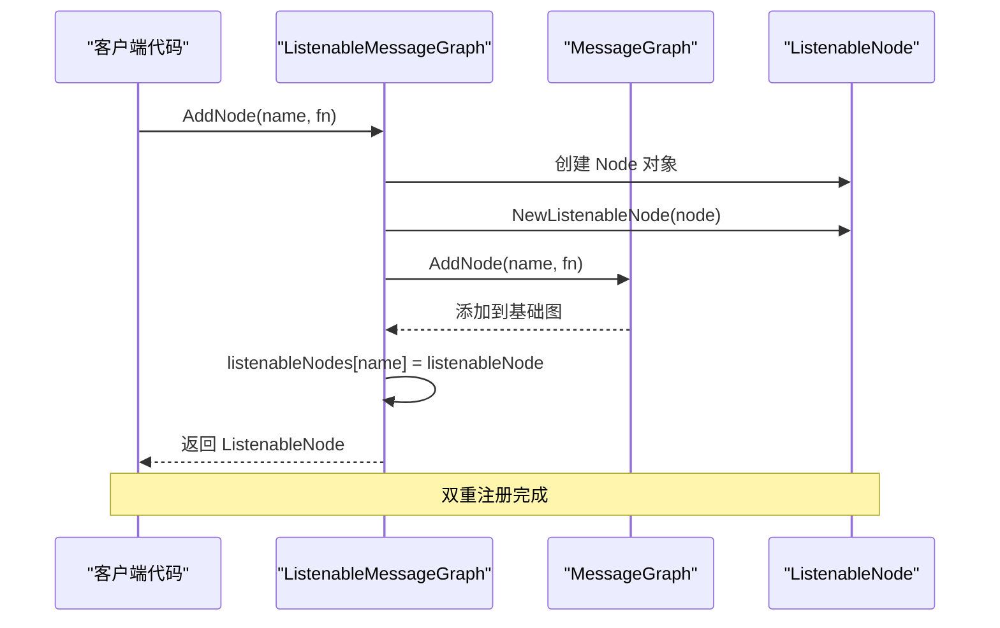
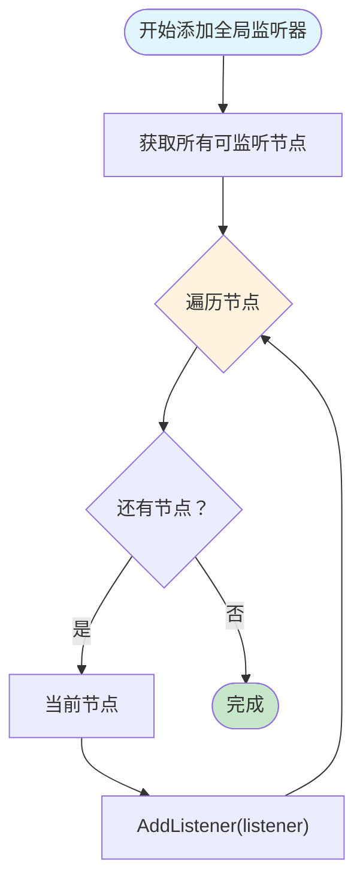
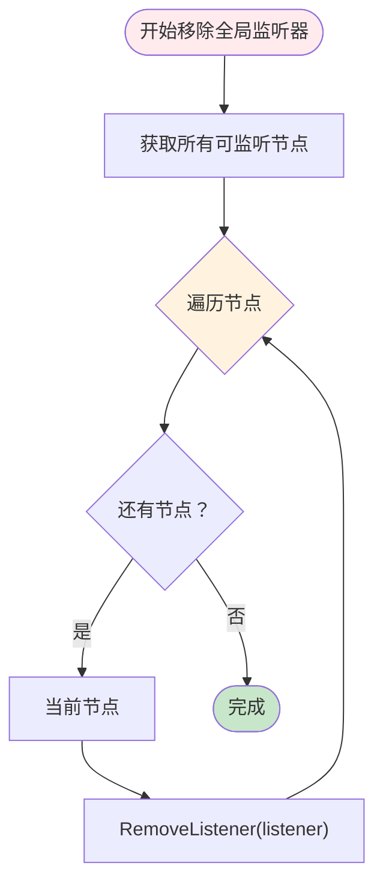
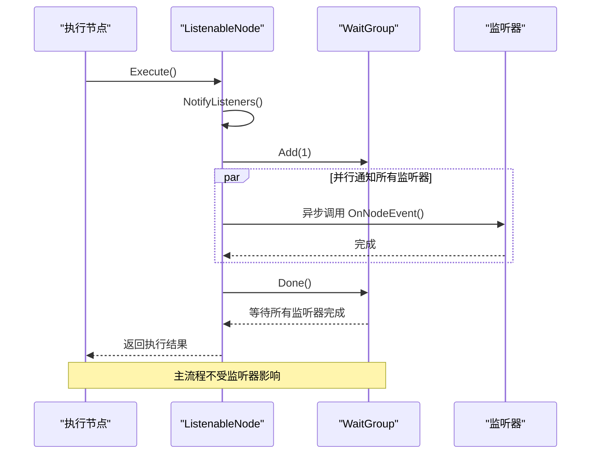

# 可监听图

<cite>
**本文档中引用的文件**
- [graph/listeners.go](file://graph/listeners.go)
- [graph/graph.go](file://graph/graph.go)
- [graph/builtin_listeners.go](file://graph/builtin_listeners.go)
- [examples/listeners/main.go](file://examples/listeners/main.go)
- [graph/listeners_test.go](file://graph/listeners_test.go)
- [graph/builtin_listeners_test.go](file://graph/builtin_listeners_test.go)
</cite>

## 目录
1. [简介](#简介)
2. [核心设计目标](#核心设计目标)
3. [架构概览](#架构概览)
4. [ListenableMessageGraph 类型分析](#listenablemessagegraph-类型分析)
5. [双重注册机制详解](#双重注册机制详解)
6. [全局监听器管理](#全局监听器管理)
7. [内置监听器应用](#内置监听器应用)
8. [性能考虑](#性能考虑)
9. [最佳实践](#最佳实践)
10. [总结](#总结)

## 简介

ListenableMessageGraph 是 langgraphgo 框架中的一个核心类型，它扩展了基础的 MessageGraph 类型，为图中的节点提供了强大的监听器支持。通过维护一个专门的 listenableNodes 映射，该类型实现了细粒度的节点级事件监控和全局策略部署能力。

这种设计使得开发者能够在不改变原有执行流程的前提下，轻松地添加各种类型的监控、日志记录、性能分析等功能，为复杂的业务流程提供了可观测性和可调试性。

## 核心设计目标

ListenableMessageGraph 的设计围绕以下几个核心目标：

### 1. 继承与增强
- **向后兼容**：完全继承 MessageGraph 的所有功能
- **透明增强**：对现有代码无需修改即可获得监听能力
- **渐进式采用**：可以逐步添加监听器功能

### 2. 节点级精细化控制
- **独立监听器管理**：每个节点都可以独立配置监听器
- **灵活组合**：支持多个监听器同时作用于同一个节点
- **优先级控制**：明确的监听器执行顺序和优先级

### 3. 全局策略部署
- **批量操作**：支持对所有节点批量添加或移除监听器
- **统一管理**：提供全局监听器生命周期管理
- **策略复用**：可以在不同图实例间复用监听器策略

### 4. 性能优化
- **异步通知**：监听器通知采用异步方式，避免阻塞主执行流程
- **并发安全**：使用读写锁确保多 goroutine 环境下的安全性
- **资源隔离**：监听器异常不会影响主执行流程

## 架构概览

ListenableMessageGraph 采用了经典的装饰器模式，通过嵌套 MessageGraph 实现功能增强：

```mermaid
classDiagram
class MessageGraph {
+nodes map[string]Node
+edges []Edge
+entryPoint string
+AddNode(name string, fn func) void
+AddEdge(from, to string) void
+SetEntryPoint(name string) void
}
class ListenableMessageGraph {
+*MessageGraph
+listenableNodes map[string]*ListenableNode
+AddNode(name string, fn func) *ListenableNode
+GetListenableNode(name string) *ListenableNode
+AddGlobalListener(listener NodeListener) void
+RemoveGlobalListener(listener NodeListener) void
}
class ListenableNode {
+Node
+listeners []NodeListener
+mutex sync.RWMutex
+Execute(ctx context.Context, state interface{}) (interface{}, error)
+AddListener(listener NodeListener) *ListenableNode
+RemoveListener(listener NodeListener) void
+NotifyListeners(ctx context.Context, event NodeEvent, state interface{}, err error) void
}
class NodeListener {
<<interface>>
+OnNodeEvent(ctx context.Context, event NodeEvent, nodeName string, state interface{}, err error) void
}
MessageGraph <|-- ListenableMessageGraph : "继承"
ListenableMessageGraph --> ListenableNode : "管理"
ListenableNode --> NodeListener : "使用"
```

**图表来源**
- [graph/listeners.go](file://graph/listeners.go#L89-L94)
- [graph/listeners.go](file://graph/listeners.go#L188-L190)
- [graph/graph.go](file://graph/graph.go#L74-L92)

## ListenableMessageGraph 类型分析

### 结构定义

ListenableMessageGraph 通过嵌套 MessageGraph 实现功能扩展：

```mermaid
classDiagram
class ListenableMessageGraph {
+*MessageGraph
+listenableNodes map[string]*ListenableNode
+NewListenableMessageGraph() *ListenableMessageGraph
+AddNode(name string, fn func) *ListenableNode
+GetListenableNode(name string) *ListenableNode
+AddGlobalListener(listener NodeListener) void
+RemoveGlobalListener(listener NodeListener) void
+CompileListenable() (*ListenableRunnable, error)
}
class ListenableNode {
+Node
+listeners []NodeListener
+mutex sync.RWMutex
+NewListenableNode(node Node) *ListenableNode
+Execute(ctx context.Context, state interface{}) (interface{}, error)
+AddListener(listener NodeListener) *ListenableNode
+RemoveListener(listener NodeListener) void
+GetListeners() []NodeListener
+NotifyListeners(ctx context.Context, event NodeEvent, state interface{}, err error) void
}
ListenableMessageGraph --> ListenableNode : "维护映射"
ListenableNode --> Node : "嵌套"
```

**图表来源**
- [graph/listeners.go](file://graph/listeners.go#L188-L190)
- [graph/listeners.go](file://graph/listeners.go#L89-L94)

### 核心方法分析

#### NewListenableMessageGraph 构造函数
构造函数初始化了两个关键组件：
- **MessageGraph 基础**：继承所有基础图功能
- **listenableNodes 映射**：用于存储可监听节点的映射表

#### GetListenableNode 查询方法
该方法提供了对特定节点的直接访问能力，允许外部代码获取节点的监听器状态或进行进一步的操作。

**节来源**
- [graph/listeners.go](file://graph/listeners.go#L193-L198)
- [graph/listeners.go](file://graph/listeners.go#L217-L220)

## 双重注册机制详解

### AddNode 方法的双重注册过程

AddNode 方法是 ListenableMessageGraph 的核心创新，它实现了双重注册机制：



**图表来源**
- [graph/listeners.go](file://graph/listeners.go#L201-L214)

### 注册机制的详细步骤

1. **节点对象创建**：首先创建标准的 Node 对象
2. **可监听节点包装**：使用 NewListenableNode 包装成 ListenableNode
3. **基础图注册**：调用父类的 AddNode 方法注册到基础图
4. **映射表更新**：将 ListenableNode 存储到 listenableNodes 映射中

这种双重注册确保了：
- **功能完整性**：既保持了基础图的功能，又增加了监听能力
- **查询便利性**：可以通过名称快速获取可监听节点
- **一致性保证**：两种注册方式保持同步

**节来源**
- [graph/listeners.go](file://graph/listeners.go#L201-L214)

## 全局监听器管理

### AddGlobalListener 批量注册

全局监听器提供了统一的策略部署能力：



**图表来源**
- [graph/listeners.go](file://graph/listeners.go#L222-L226)

### RemoveGlobalListener 批量移除

全局监听器的移除同样采用批量操作模式，确保一致性：



**图表来源**
- [graph/listeners.go](file://graph/listeners.go#L229-L233)

### 优先级和协作关系

全局监听器与单节点监听器之间存在明确的优先级关系：

1. **全局监听器优先级较低**：作为默认策略存在
2. **单节点监听器优先级较高**：可以覆盖全局策略
3. **监听器执行顺序**：先执行全局监听器，再执行节点特定监听器
4. **去重机制**：相同的监听器不会被重复添加

**节来源**
- [graph/listeners.go](file://graph/listeners.go#L222-L233)

## 内置监听器应用

### 进度监听器 (ProgressListener)

进度监听器提供了直观的执行进度展示：

| 功能特性 | 描述 | 配置选项 |
|---------|------|----------|
| 时间显示 | 显示事件发生的时间戳 | WithTiming(bool) |
| 详情输出 | 显示当前状态信息 | WithDetails(bool) |
| 自定义消息 | 为特定节点设置自定义消息 | SetNodeStep(nodeName, step) |
| 输出格式 | 支持自定义前缀和输出流 | WithPrefix(string), Writer |

### 性能指标监听器 (MetricsListener)

性能指标监听器专注于收集和分析执行数据：

| 指标类别 | 收集内容 | 访问方法 |
|---------|----------|----------|
| 执行次数 | 各节点的执行总次数 | GetNodeExecutions() |
| 平均时长 | 各节点的平均执行时间 | GetNodeAverageDuration() |
| 错误统计 | 各节点的错误发生次数 | GetNodeErrors() |
| 总体统计 | 图的总体执行次数 | GetTotalExecutions() |

### 聊天风格监听器 (ChatListener)

聊天风格监听器提供友好的实时反馈：

| 特性 | 实现方式 | 使用场景 |
|------|----------|----------|
| 自定义消息 | SetNodeMessage() | 业务语义化描述 |
| 时间戳 | WithTime() | 实时反馈需求 |
| Emoji 表情 | 内置表情符号 | 用户体验优化 |
| 流式输出 | Writer 接口 | 实时通信场景 |

### 日志监听器 (LoggingListener)

日志监听器提供结构化的日志记录：

| 日志级别 | 触发事件 | 配置选项 |
|---------|----------|----------|
| Debug | 进度事件 | WithLogLevel(LogLevelDebug) |
| Info | 开始/完成事件 | WithLogLevel(LogLevelInfo) |
| Warn | 警告事件 | WithLogLevel(LogLevelWarn) |
| Error | 错误事件 | WithLogLevel(LogLevelError) |
| 状态包含 | 是否包含状态信息 | WithState(bool) |

**节来源**
- [examples/listeners/main.go](file://examples/listeners/main.go#L16-L30)
- [graph/builtin_listeners.go](file://graph/builtin_listeners.go#L14-L433)

## 性能考虑

### 异步通知机制

ListenableNode 采用了异步通知机制来避免阻塞主执行流程：



**图表来源**
- [graph/listeners.go](file://graph/listeners.go#L128-L156)

### 并发安全设计

- **读写锁保护**：使用 sync.RWMutex 确保监听器列表的并发安全
- **无锁读取**：对于只读操作（如 GetListeners）使用读锁
- **原子操作**：关键状态变更采用原子操作

### 资源隔离策略

- **panic 恢复**：监听器中的 panic 不会传播到主执行流程
- **超时控制**：监听器执行超时不会影响整体执行
- **内存管理**：及时清理不再使用的监听器引用

**节来源**
- [graph/listeners.go](file://graph/listeners.go#L128-L156)
- [graph/listeners.go](file://graph/listeners.go#L105-L125)

## 最佳实践

### 监听器选择指南

1. **开发阶段**：使用 ProgressListener 和 LoggingListener
2. **生产环境**：使用 MetricsListener 进行性能监控
3. **用户界面**：使用 ChatListener 提供友好反馈
4. **运维监控**：结合多种监听器实现全面监控

### 性能优化建议

1. **合理选择监听器**：根据实际需求选择合适的监听器类型
2. **避免过度监听**：不要为每个节点都添加过多监听器
3. **异步处理**：对于耗时的监听器逻辑应采用异步处理
4. **资源清理**：及时移除不再需要的监听器

### 错误处理策略

1. **监听器异常**：监听器中的错误不应影响主流程
2. **资源泄漏**：确保监听器正确注册和注销
3. **状态一致性**：监听器不应修改执行状态

### 测试和调试

1. **单元测试**：为自定义监听器编写单元测试
2. **集成测试**：测试监听器与图执行的集成效果
3. **性能测试**：评估监听器对执行性能的影响
4. **监控验证**：验证监听器数据收集的准确性

## 总结

ListenableMessageGraph 通过巧妙的设计实现了以下核心价值：

### 技术创新点

1. **双重注册机制**：在保持向后兼容的同时提供增强功能
2. **细粒度控制**：支持节点级别的监听器配置
3. **全局策略**：提供统一的监听器管理策略
4. **异步通知**：确保监听器不影响主执行流程

### 应用价值

1. **可观测性**：为复杂业务流程提供全面的监控能力
2. **可调试性**：简化问题定位和性能分析
3. **可扩展性**：支持灵活的功能扩展和定制
4. **易用性**：提供开箱即用的内置监听器

### 发展方向

随着系统的演进，ListenableMessageGraph 可以进一步扩展：
- **分布式监控**：支持跨服务的监听器聚合
- **实时分析**：集成实时数据分析能力
- **可视化界面**：提供图形化的监控界面
- **智能告警**：基于机器学习的异常检测

这种设计不仅满足了当前的监控需求，还为未来的功能扩展奠定了坚实的基础，是 langgraphgo 框架中一个精心设计的核心组件。