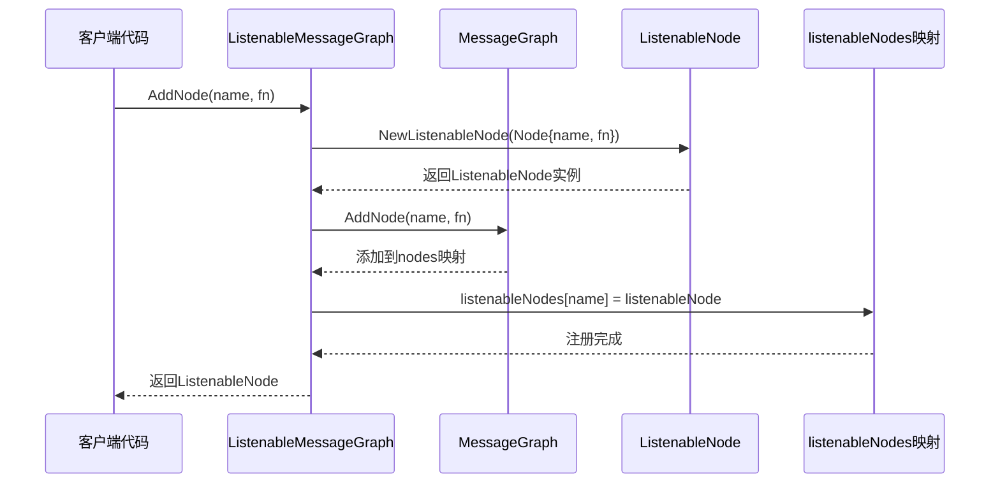
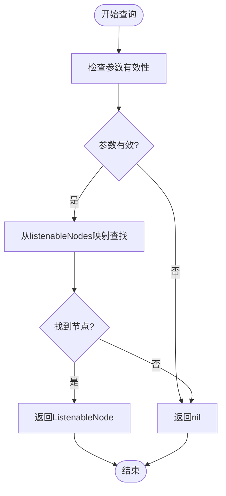
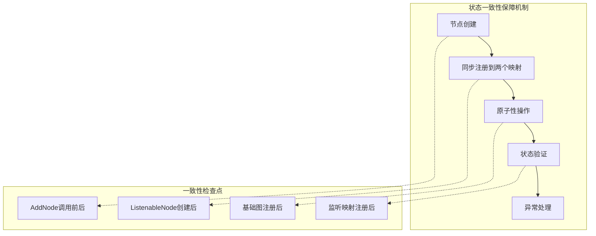
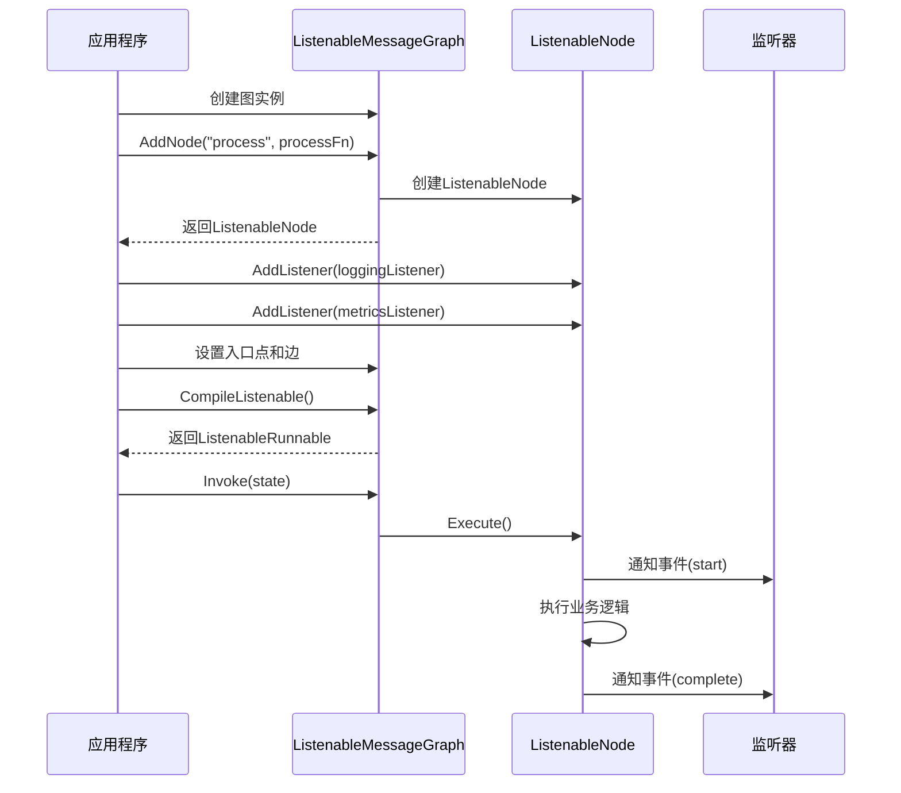
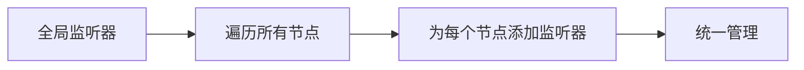
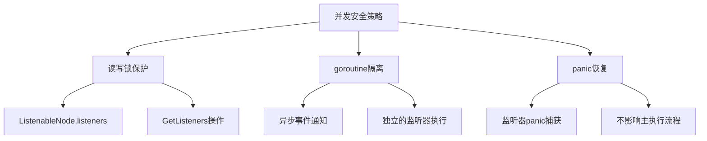

# 可监听节点管理

<cite>
**本文档引用的文件**
- [listeners.go](file://graph/listeners.go)
- [graph.go](file://graph/graph.go)
- [listeners_test.go](file://graph/listeners_test.go)
- [main.go](file://examples/listeners/main.go)
- [streaming.go](file://graph/streaming.go)
</cite>

## 目录
1. [简介](#简介)
2. [核心架构](#核心架构)
3. [AddNode 方法的双重注册机制](#addnode-方法的双重注册机制)
4. [GetListenableNode 方法的查询逻辑](#getlistenablenode-方法的查询逻辑)
5. [状态一致性保障](#状态一致性保障)
6. [实际应用示例](#实际应用示例)
7. [并发安全与性能考虑](#并发安全与性能考虑)
8. [故障排除指南](#故障排除指南)
9. [总结](#总结)

## 简介

LangGraphGo 的可监听节点管理系统提供了一套完整的事件驱动架构，允许开发者在图执行过程中监控和响应节点的生命周期事件。该系统通过双重注册机制确保节点既能在基础消息图中正常执行，又能接收外部监听器的通知。

## 核心架构

可监听节点管理系统由以下核心组件构成：

```mermaid
classDiagram
class MessageGraph {
+nodes map[string]Node
+edges []Edge
+AddNode(name string, fn func) void
+Compile() Runnable
}
class ListenableMessageGraph {
+MessageGraph *MessageGraph
+listenableNodes map[string]*ListenableNode
+AddNode(name string, fn func) *ListenableNode
+GetListenableNode(name string) *ListenableNode
+AddGlobalListener(listener NodeListener)
+RemoveGlobalListener(listener NodeListener)
}
class ListenableNode {
+Node Node
+listeners []NodeListener
+mutex sync.RWMutex
+Execute(ctx, state) (interface{}, error)
+AddListener(listener NodeListener) *ListenableNode
+RemoveListener(listener NodeListener)
+NotifyListeners(ctx, event, state, err)
+GetListeners() []NodeListener
}
class NodeListener {
<<interface>>
+OnNodeEvent(ctx, event, nodeName, state, err)
}
class NodeEvent {
<<enumeration>>
NodeEventStart
NodeEventProgress
NodeEventComplete
NodeEventError
EventChainStart
EventChainEnd
EventToolStart
EventToolEnd
EventLLMStart
EventLLMEnd
EventToken
EventCustom
}
MessageGraph <|-- ListenableMessageGraph : 继承
ListenableMessageGraph --> ListenableNode : 管理
ListenableNode --> NodeListener : 使用
NodeListener --> NodeEvent : 处理
```

**图表来源**
- [listeners.go](file://graph/listeners.go#L89-L220)
- [graph.go](file://graph/graph.go#L75-L109)

**章节来源**
- [listeners.go](file://graph/listeners.go#L89-L220)
- [graph.go](file://graph/graph.go#L75-L109)

## AddNode 方法的双重注册机制

### 双重注册的核心原理

`AddNode` 方法实现了独特的双重注册机制，确保节点在两个独立但关联的数据结构中正确注册：



**图表来源**
- [listeners.go](file://graph/listeners.go#L202-L215)

### 具体实现步骤

1. **创建基础节点**：首先创建一个标准的 `Node` 对象
2. **包装为可监听节点**：使用 `NewListenableNode` 将基础节点包装为 `ListenableNode`
3. **注册到基础图**：调用 `MessageGraph.AddNode` 将节点添加到基础图的 `nodes` 映射中
4. **注册到监听映射**：将 `ListenableNode` 实例存储到 `listenableNodes` 映射中

### 关键实现细节

双重注册机制的关键在于保持两个数据结构的一致性：

- **基础图注册**：确保节点能够被图执行引擎识别和调用
- **监听映射注册**：确保外部监听器能够通过名称查找和操作节点

**章节来源**
- [listeners.go](file://graph/listeners.go#L202-L215)

## GetListenableNode 方法的查询逻辑

### 查询机制设计

`GetListenableNode` 方法提供了对可监听节点的直接访问能力，其查询逻辑简洁而高效：



**图表来源**
- [listeners.go](file://graph/listeners.go#L217-L220)

### 外部监听器配置的关键作用

`GetListenableNode` 方法在外部监听器配置中发挥着关键作用：

1. **节点发现**：允许监听器通过节点名称定位特定的可监听节点
2. **动态配置**：支持运行时添加或移除监听器
3. **全局管理**：配合 `AddGlobalListener` 和 `RemoveGlobalListener` 实现批量操作

### 查询性能特性

- **时间复杂度**：O(1)，基于哈希表的直接查找
- **空间复杂度**：O(n)，其中 n 是已注册节点的数量
- **线程安全**：依赖底层映射的并发安全性

**章节来源**
- [listeners.go](file://graph/listeners.go#L217-L220)

## 状态一致性保障

### 双重注册的一致性保证

双重注册机制通过以下策略确保状态一致性：



**图表来源**
- [listeners.go](file://graph/listeners.go#L202-L215)

### 并发环境下的安全保障

系统通过多种机制确保在并发环境下的状态一致性：

1. **互斥锁保护**：`ListenableNode` 的监听器列表使用读写锁保护
2. **原子操作**：双重注册被视为原子操作序列
3. **错误恢复**：完善的错误处理和回滚机制

### 状态验证机制

系统在关键节点进行状态验证：

- **节点存在性检查**：`GetListenableNode` 返回前验证节点是否存在
- **监听器完整性**：`Execute` 方法确保所有监听器都被正确通知
- **资源清理**：`RemoveListener` 确保监听器被完全移除

**章节来源**
- [listeners.go](file://graph/listeners.go#L104-L125)
- [listeners.go](file://graph/listeners.go#L160-L175)

## 实际应用示例

### 基础节点添加示例

以下是典型的节点添加和监听器配置流程：



**图表来源**
- [main.go](file://examples/listeners/main.go#L32-L64)

### 多监听器配置示例

系统支持为单个节点配置多个不同类型的监听器：

- **进度监听器**：跟踪执行进度和状态变化
- **指标监听器**：收集性能指标和统计信息
- **聊天监听器**：提供用户友好的执行反馈
- **日志监听器**：记录详细的执行日志

### 全局监听器配置

系统还支持全局监听器配置，可以一次性为所有节点添加相同的监听器：



**图表来源**
- [listeners.go](file://graph/listeners.go#L223-L234)

**章节来源**
- [main.go](file://examples/listeners/main.go#L1-L132)
- [listeners.go](file://graph/listeners.go#L223-L234)

## 并发安全与性能考虑

### 并发安全机制

系统采用多层次的并发安全机制：



**图表来源**
- [listeners.go](file://graph/listeners.go#L93-L94)
- [listeners.go](file://graph/listeners.go#L128-L157)

### 性能优化策略

1. **异步事件通知**：使用 goroutine 并发通知所有监听器
2. **监听器复用**：支持全局监听器减少重复配置
3. **内存池化**：事件对象的高效复用
4. **延迟清理**：优雅的资源清理机制

### 内存管理

系统通过以下方式优化内存使用：

- **事件缓冲**：使用带缓冲的通道避免阻塞
- **监听器去重**：防止重复添加相同的监听器
- **及时清理**：执行完成后自动清理临时资源

**章节来源**
- [listeners.go](file://graph/listeners.go#L128-L157)
- [streaming.go](file://graph/streaming.go#L290-L334)

## 故障排除指南

### 常见问题及解决方案

| 问题类型 | 症状 | 可能原因 | 解决方案 |
|---------|------|----------|----------|
| 节点未找到 | GetListenableNode返回nil | 节点未正确注册 | 检查AddNode调用是否成功 |
| 监听器不触发 | 事件监听器没有响应 | 监听器未正确添加 | 验证AddListener调用 |
| 并发冲突 | 数据竞争或死锁 | 多线程访问冲突 | 检查锁使用是否正确 |
| 内存泄漏 | 内存使用持续增长 | 监听器未正确移除 | 使用RemoveListener清理 |

### 调试技巧

1. **启用详细日志**：使用 `LoggingListener` 记录所有事件
2. **监控指标**：通过 `MetricsListener` 跟踪性能指标
3. **断点调试**：在关键事件点设置断点
4. **单元测试**：编写专门的测试用例验证功能

### 性能监控

建议监控以下关键指标：

- **事件处理延迟**：监听器响应时间
- **内存使用量**：监听器和事件对象的内存占用
- **并发吞吐量**：每秒处理的事件数量
- **错误率**：监听器异常导致的失败比例

**章节来源**
- [listeners_test.go](file://graph/listeners_test.go#L1-L510)

## 总结

LangGraphGo 的可监听节点管理系统通过精心设计的双重注册机制，实现了高效的事件驱动架构。该系统的核心优势包括：

1. **双重注册机制**：确保节点在基础图和监听映射中的一致性
2. **灵活的查询接口**：`GetListenableNode` 提供便捷的节点访问能力
3. **强大的扩展性**：支持多种类型的监听器和配置方式
4. **优秀的并发安全**：通过多层保护机制确保线程安全
5. **完善的错误处理**：健壮的异常恢复和资源清理机制

这套系统为构建可观测、可监控的图执行应用提供了坚实的基础，是 LangGraphGo 架构中的重要组成部分。