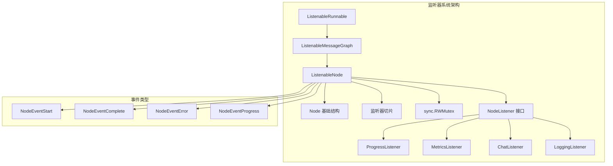
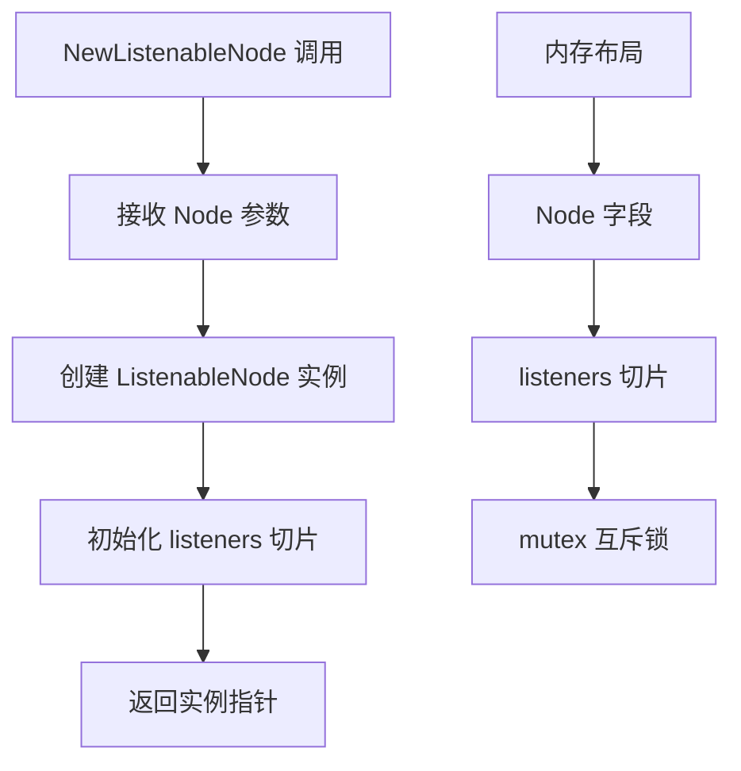
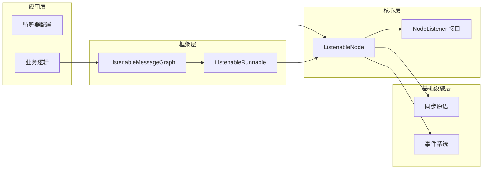
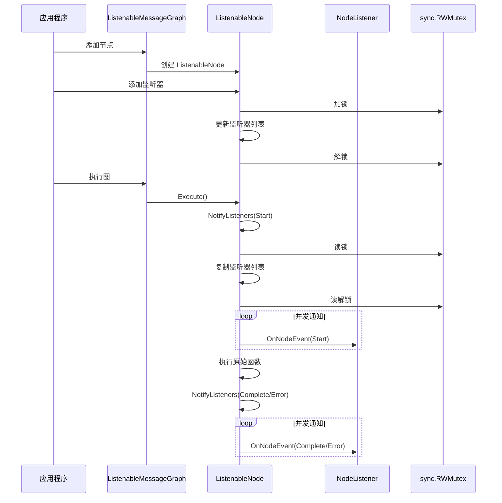
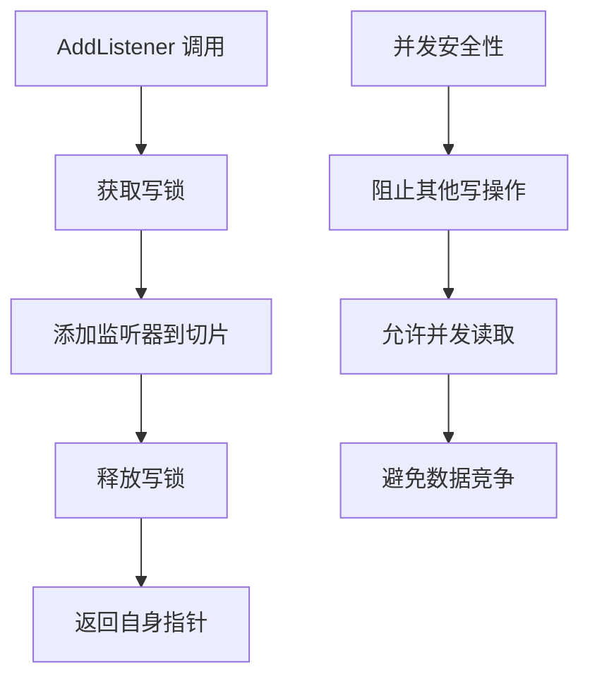
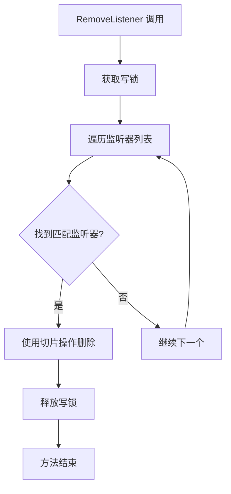
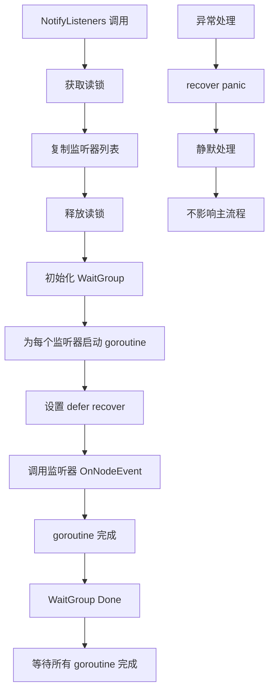
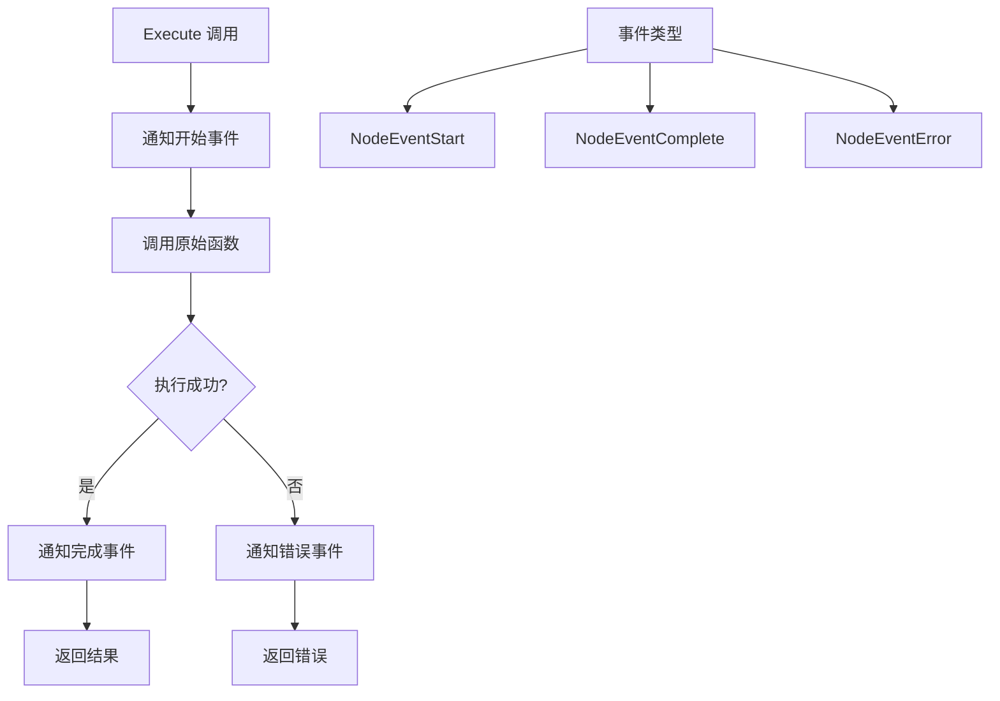
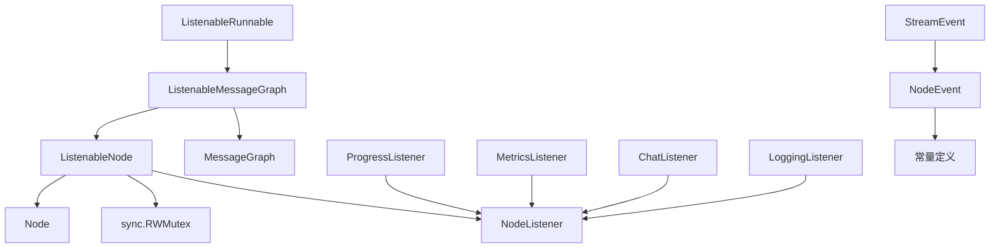

# 可监听节点

<cite>
**本文档中引用的文件**
- [examples/listeners/main.go](file://examples/listeners/main.go)
- [graph/listeners.go](file://graph/listeners.go)
- [graph/builtin_listeners.go](file://graph/builtin_listeners.go)
- [graph/schema.go](file://graph/schema.go)
- [graph/graph.go](file://graph/graph.go)
</cite>

## 目录
1. [简介](#简介)
2. [项目结构概览](#项目结构概览)
3. [核心组件分析](#核心组件分析)
4. [架构设计](#架构设计)
5. [详细组件分析](#详细组件分析)
6. [依赖关系分析](#依赖关系分析)
7. [性能考虑](#性能考虑)
8. [故障排除指南](#故障排除指南)
9. [结论](#结论)

## 简介

ListenableNode 是 LangGraphGo 框架中的核心组件，它通过组合模式包装了基础的 Node 结构体，并添加了监听器管理功能。该设计允许开发者在节点执行过程中插入各种监控、日志记录、指标收集等监听器，从而实现对执行链路的全面监控和调试。

ListenableNode 的主要特点包括：
- **组合模式设计**：基于现有 Node 结构体扩展功能
- **线程安全的监听器管理**：使用 sync.RWMutex 确保并发安全
- **异步事件通知**：通过 goroutine 和 WaitGroup 实现非阻塞的通知机制
- **异常恢复机制**：防止监听器崩溃影响主流程执行

## 项目结构概览



**图表来源**
- [graph/listeners.go](file://graph/listeners.go#L89-L94)
- [graph/listeners.go](file://graph/listeners.go#L51-L55)

**章节来源**
- [graph/listeners.go](file://graph/listeners.go#L1-L335)
- [examples/listeners/main.go](file://examples/listeners/main.go#L1-L132)

## 核心组件分析

### ListenableNode 结构体设计

ListenableNode 采用了优雅的组合模式设计，通过嵌入基础 Node 结构体来扩展功能：

```mermaid
classDiagram
class Node {
+string Name
+func Function
+Execute(ctx, state) (interface{}, error)
}
class ListenableNode {
+Node embedded
+[]NodeListener listeners
+sync.RWMutex mutex
+NewListenableNode(node) *ListenableNode
+AddListener(listener) *ListenableNode
+RemoveListener(listener)
+NotifyListeners(ctx, event, state, err)
+Execute(ctx, state) (interface{}, error)
+GetListeners() []NodeListener
}
class NodeListener {
<<interface>>
+OnNodeEvent(ctx, event, nodeName, state, err)
}
Node <|-- ListenableNode : 组合
ListenableNode --> NodeListener : 管理
```

**图表来源**
- [graph/listeners.go](file://graph/listeners.go#L89-L94)
- [graph/graph.go](file://graph/graph.go#L52-L59)
- [graph/listeners.go](file://graph/listeners.go#L51-L55)

### NewListenableNode 构造函数

构造函数采用简洁的设计模式，初始化必要的数据结构：



**图表来源**
- [graph/listeners.go](file://graph/listeners.go#L96-L101)

**章节来源**
- [graph/listeners.go](file://graph/listeners.go#L96-L101)

## 架构设计

### 整体架构图



**图表来源**
- [graph/listeners.go](file://graph/listeners.go#L187-L190)
- [graph/listeners.go](file://graph/listeners.go#L236-L240)

### 执行流程架构



**图表来源**
- [graph/listeners.go](file://graph/listeners.go#L159-L174)
- [graph/listeners.go](file://graph/listeners.go#L127-L156)

**章节来源**
- [graph/listeners.go](file://graph/listeners.go#L159-L174)
- [graph/listeners.go](file://graph/listeners.go#L127-L156)

## 详细组件分析

### AddListener 方法的并发控制机制

AddListener 方法展示了典型的读写锁使用模式：



**图表来源**
- [graph/listeners.go](file://graph/listeners.go#L104-L110)

关键特性：
- **写锁保护**：确保监听器列表的原子性更新
- **链式调用**：返回 *ListenableNode 支持方法链
- **零拷贝优化**：直接操作切片引用

**章节来源**
- [graph/listeners.go](file://graph/listeners.go#L104-L110)

### RemoveListener 方法的实现策略

RemoveListener 方法采用了对象比较的方式移除特定监听器：



**图表来源**
- [graph/listeners.go](file://graph/listeners.go#L113-L124)

实现细节：
- **对象比较**：使用 `l == listener` 进行精确匹配
- **切片操作**：利用 Go 的切片特性高效删除元素
- **提前退出**：找到目标后立即返回，避免不必要的迭代

**章节来源**
- [graph/listeners.go](file://graph/listeners.go#L113-L124)

### NotifyListeners 方法的核心实现

NotifyListeners 是整个监听器系统的核心，其实现体现了多个设计原则：



**图表来源**
- [graph/listeners.go](file://graph/listeners.go#L127-L156)

#### 关键设计亮点

1. **读写分离**：读锁用于安全读取监听器列表，写锁用于修改
2. **列表快照**：复制监听器列表避免并发修改问题
3. **异步通知**：使用 goroutine 避免阻塞主执行流程
4. **异常隔离**：通过 defer recover 防止监听器崩溃影响主流程
5. **同步机制**：使用 WaitGroup 确保所有通知完成后再继续

**章节来源**
- [graph/listeners.go](file://graph/listeners.go#L127-L156)

### Execute 方法的事件驱动执行模型

Execute 方法展示了事件驱动的执行模式：



**图表来源**
- [graph/listeners.go](file://graph/listeners.go#L159-L174)

这种设计的优势：
- **透明性**：原始 Node 函数无需修改即可支持监听
- **一致性**：所有节点都遵循相同的事件通知模式
- **灵活性**：监听器可以自由决定如何处理不同类型的事件

**章节来源**
- [graph/listeners.go](file://graph/listeners.go#L159-L174)

### 内置监听器类型分析

框架提供了多种内置监听器，每种都有特定的用途：

| 监听器类型 | 主要功能 | 使用场景 |
|-----------|---------|---------|
| ProgressListener | 进度跟踪和可视化 | 开发调试、用户界面 |
| MetricsListener | 性能指标收集 | 性能监控、容量规划 |
| ChatListener | 实时聊天风格更新 | 用户交互、实时反馈 |
| LoggingListener | 结构化日志记录 | 生产环境监控 |

**章节来源**
- [graph/builtin_listeners.go](file://graph/builtin_listeners.go#L1-L433)

## 依赖关系分析

### 组件间依赖关系



**图表来源**
- [graph/listeners.go](file://graph/listeners.go#L89-L94)
- [graph/listeners.go](file://graph/listeners.go#L187-L190)

### 外部依赖

- **sync 包**：提供并发控制原语
- **context 包**：支持取消和超时控制
- **time 包**：提供时间测量功能

**章节来源**
- [graph/listeners.go](file://graph/listeners.go#L1-L8)

## 性能考虑

### 并发性能优化

1. **读写分离**：读操作不阻塞写操作，提高并发性能
2. **异步通知**：监听器通知不阻塞主执行流程
3. **列表快照**：避免频繁的锁竞争
4. **goroutine 池化**：合理控制并发数量

### 内存使用优化

1. **切片复用**：使用 make 预分配监听器列表
2. **对象池**：避免频繁的内存分配和回收
3. **延迟初始化**：按需创建监听器实例

### 监听器选择建议

- **轻量级监听器**：优先选择无状态、快速执行的监听器
- **异步处理**：对于耗时操作，考虑在监听器内部使用 goroutine
- **资源限制**：控制单个节点上的监听器数量

## 故障排除指南

### 常见问题及解决方案

#### 监听器崩溃导致程序终止

**问题描述**：监听器中的 panic 导致整个应用程序崩溃

**解决方案**：NotifyListeners 方法已经包含了 recover 机制，但需要注意：
- 监听器应该避免抛出 panic
- 对于可能失败的操作，使用错误返回而非 panic

#### 监听器通知延迟

**问题描述**：监听器通知明显滞后于节点执行

**解决方案**：
- 检查监听器的处理逻辑是否过于复杂
- 考虑将耗时操作移到单独的 goroutine
- 监控系统资源使用情况

#### 内存泄漏

**问题描述**：长时间运行后内存使用持续增长

**解决方案**：
- 确保正确移除不再需要的监听器
- 检查监听器内部是否有未释放的资源
- 使用内存分析工具定位泄漏源

**章节来源**
- [graph/listeners.go](file://graph/listeners.go#L143-L148)

### 监控和调试技巧

1. **启用详细日志**：使用 LoggingListener 记录详细的执行信息
2. **性能分析**：使用 MetricsListener 收集性能指标
3. **事件追踪**：通过自定义监听器实现事件追踪
4. **并发分析**：监控 goroutine 数量和锁竞争情况

## 结论

ListenableNode 结构体展现了优秀的软件设计原则：

### 设计优势

1. **组合优于继承**：通过组合基础 Node 实现功能扩展
2. **接口隔离**：NodeListener 接口定义清晰的职责边界
3. **并发安全**：完善的同步机制确保多线程环境下的正确性
4. **异常隔离**：健壮的错误处理机制保证系统稳定性
5. **扩展性强**：支持多种类型的监听器和自定义扩展

### 技术价值

ListenableNode 在执行链路中插入监控点的技术价值体现在：

1. **可观测性增强**：提供完整的执行过程监控能力
2. **调试效率提升**：简化复杂工作流的调试和分析
3. **质量保障**：通过指标收集和错误监控提高系统可靠性
4. **用户体验改善**：实时反馈和进度跟踪提升用户满意度

### 最佳实践建议

1. **合理选择监听器**：根据具体需求选择合适的内置监听器
2. **避免过度监听**：控制监听器数量，避免性能影响
3. **异常处理**：在监听器中妥善处理可能出现的异常
4. **资源管理**：及时清理不再使用的监听器和相关资源

ListenableNode 不仅是一个技术实现，更是现代软件架构中关注点分离和横切关注点处理的优秀范例，为构建可观测、可维护的分布式系统提供了强有力的支持。