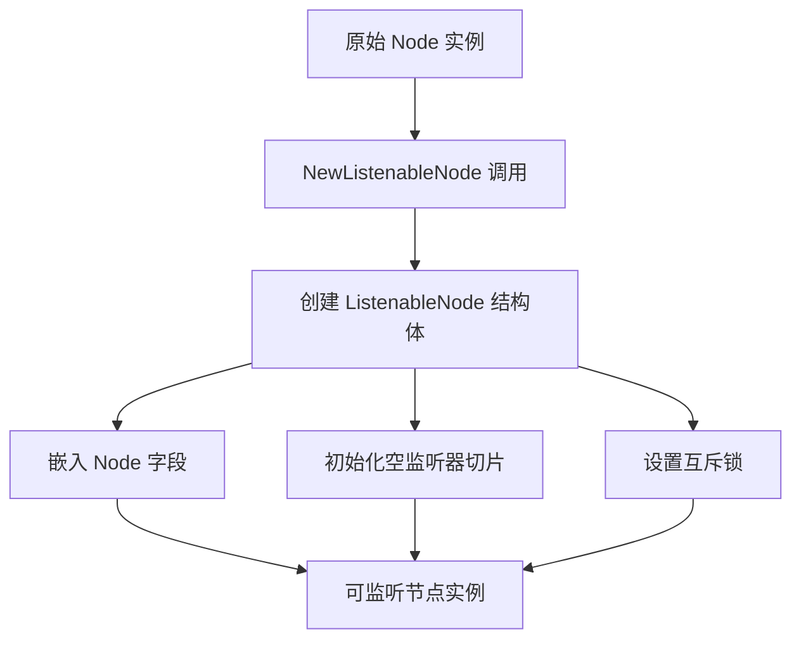
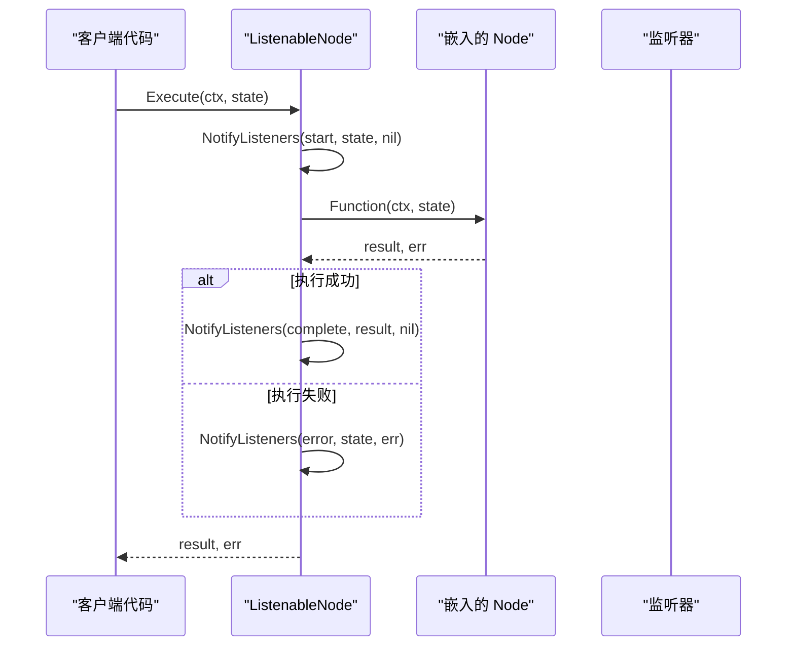
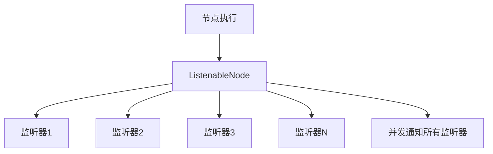
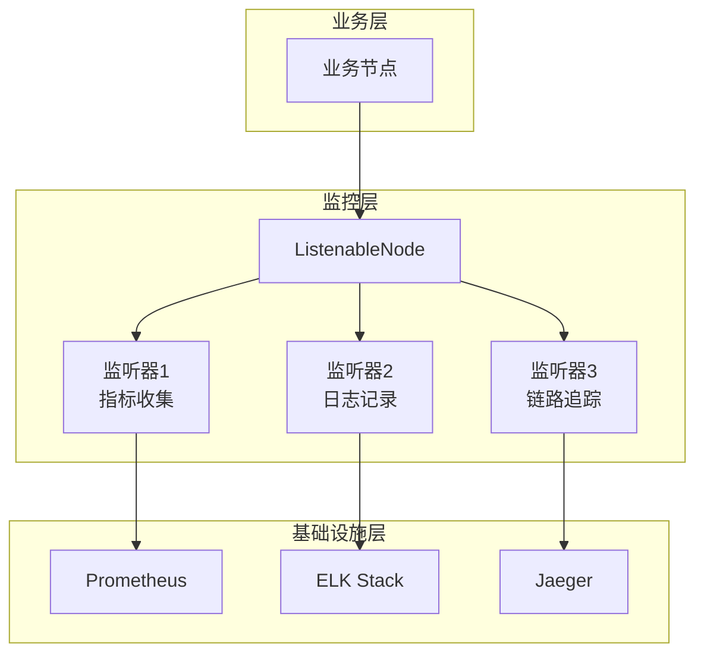
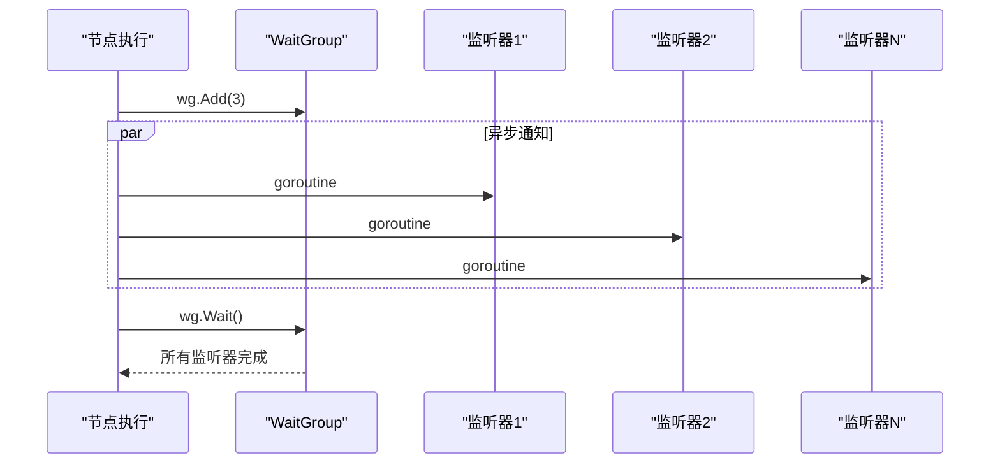

# 可监听节点构造器

<cite>
**本文档中引用的文件**
- [listeners.go](file://graph/listeners.go)
- [listeners_test.go](file://graph/listeners_test.go)
- [graph.go](file://graph/graph.go)
- [main.go](file://examples/listeners/main.go)
</cite>

## 目录
1. [简介](#简介)
2. [构造函数概述](#构造函数概述)
3. [核心数据结构](#核心数据结构)
4. [构造函数实现详解](#构造函数实现详解)
5. [组合模式分析](#组合模式分析)
6. [监听器切片初始化](#监听器切片初始化)
7. [使用示例](#使用示例)
8. [技术意义与架构价值](#技术意义与架构价值)
9. [性能考虑](#性能考虑)
10. [总结](#总结)

## 简介

NewListenableNode 构造函数是 langgraphgo 框架中的核心组件，它负责创建可监听的节点包装器，为传统的 Node 接口实例添加事件监听能力。这个构造函数采用了组合模式设计，通过将原始 Node 实例嵌入到 ListenableNode 结构体中，实现了对节点执行过程的全方位监控和事件通知。

## 构造函数概述

NewListenableNode 函数是一个简洁而高效的构造器，它接受一个标准的 Node 接口实例作为参数，返回一个配置完善的 ListenableNode 实例。这个构造函数的设计体现了 Go 语言的简洁性和组合模式的优势。



**图表来源**
- [listeners.go](file://graph/listeners.go#L96-L101)

## 核心数据结构

### ListenableNode 结构体

ListenableNode 是 NewListenableNode 构造函数的核心输出，它扩展了基础的 Node 接口，增加了监听器管理和并发控制能力。

```mermaid
classDiagram
class Node {
+string Name
+func Function
}
class ListenableNode {
+Node embedded
+[]NodeListener listeners
+sync.RWMutex mutex
+Execute(ctx, state) (interface{}, error)
+AddListener(listener) ListenableNode
+RemoveListener(listener) void
+NotifyListeners(ctx, event, state, err) void
+GetListeners() []NodeListener
}
class NodeListener {
<<interface>>
+OnNodeEvent(ctx, event, nodeName, state, err) void
}
Node <|-- ListenableNode : "嵌入"
NodeListener --> ListenableNode : "管理"
```

**图表来源**
- [listeners.go](file://graph/listeners.go#L89-L94)

**节来源**
- [listeners.go](file://graph/listeners.go#L89-L94)

## 构造函数实现详解

NewListenableNode 构造函数的实现极其简洁，只包含三行代码，却包含了完整的初始化逻辑：

### 参数处理

构造函数接受一个 Node 类型的参数，这个参数代表了要包装的基础节点。Node 结构体包含了节点的名称和执行函数，这是节点功能的核心组成部分。

### 返回值创建

构造函数直接返回一个新的 ListenableNode 实例，采用字面量语法进行初始化。这种写法不仅简洁，而且清晰地表达了初始化意图。

### 初始化过程

初始化过程分为三个关键步骤：

1. **Node 字段赋值**：将传入的 Node 实例赋值给 ListenableNode 的嵌入字段
2. **监听器切片初始化**：创建一个空的 NodeListener 切片
3. **结构体返回**：返回完全初始化的 ListenableNode 实例

**节来源**
- [listeners.go](file://graph/listeners.go#L96-L101)

## 组合模式分析

NewListenableNode 构造函数巧妙地运用了 Go 语言的组合模式，通过嵌入 Node 字段实现了对原有功能的透明扩展。

### 嵌入式继承

ListenableNode 通过嵌入 Node 字段获得了所有基础 Node 的功能，包括名称访问和函数调用。这种设计使得 ListenableNode 完全兼容 Node 接口，可以在任何需要 Node 的地方使用。

### 功能增强

虽然嵌入了 Node 字段，ListenableNode 并没有改变原有行为，而是在其基础上增加了监听器管理功能。这种设计遵循了开放封闭原则，对扩展开放，对修改封闭。



**图表来源**
- [listeners.go](file://graph/listeners.go#L159-L174)

**节来源**
- [listeners.go](file://graph/listeners.go#L89-L94)

## 监听器切片初始化

监听器切片的初始化是 NewListenableNode 构造函数的一个重要特点。构造函数将 listeners 字段初始化为空切片，而不是 nil，这是一个重要的设计决策。

### 空切片 vs nil 切片

Go 语言中，空切片和 nil 切片是有区别的：
- **空切片**：len(listeners) = 0，cap(listeners) = 0，可以安全地进行迭代操作
- **nil 切片**：len(listeners) = 0，cap(listeners) = 0，但不能直接进行迭代或追加操作

### 设计优势

将监听器切片初始化为空切片有以下优势：

1. **安全性**：避免了在 NotifyListeners 方法中需要检查 nil 的情况
2. **一致性**：确保 listeners 字段始终是一个有效的切片
3. **性能**：减少了条件判断，提高了执行效率
4. **语义清晰**：明确表示当前没有监听器，而不是未初始化

### 并发安全考虑

虽然构造函数本身不涉及并发操作，但空切片的初始化为后续的并发操作奠定了良好的基础。AddListener 和 RemoveListener 方法都使用了互斥锁来保证线程安全。

**节来源**
- [listeners.go](file://graph/listeners.go#L99-L100)

## 使用示例

### 基本使用模式

NewListenableNode 最常见的使用场景是在构建消息图时为节点添加监听能力：


**图表来源**
- [main.go](file://examples/listeners/main.go#L32-L47)

### 在 ListenableMessageGraph 中的应用

在 ListenableMessageGraph 中，NewListenableNode 被广泛用于创建具有监听能力的节点：

1. **节点创建**：通过 AddNode 方法自动创建 ListenableNode
2. **监听器绑定**：支持为单个节点或全局添加监听器
3. **执行监控**：在节点执行过程中触发各种事件

### 多监听器支持

NewListenableNode 创建的节点可以同时支持多个监听器，每个监听器都可以独立处理事件：



**图表来源**
- [main.go](file://examples/listeners/main.go#L51-L64)

**节来源**
- [main.go](file://examples/listeners/main.go#L32-L64)

## 技术意义与架构价值

### 监控链路起点

NewListenableNode 作为监控链路的起点，具有重要的架构价值：

1. **统一入口**：为整个系统提供了一个统一的监控入口点
2. **事件标准化**：定义了标准的节点事件类型和格式
3. **解耦设计**：将业务逻辑与监控逻辑分离
4. **可扩展性**：支持动态添加和移除监听器

### 观察性基础设施

从架构角度来看，NewListenableNode 是构建观察性基础设施的重要组件：



### 错误恢复机制

NewListenableNode 的设计考虑了错误恢复机制，即使某个监听器发生 panic，也不会影响主流程的执行：

1. **goroutine 隔离**：每个监听器在独立的 goroutine 中执行
2. **panic 捕获**：使用 defer recover 捕获监听器中的 panic
3. **故障隔离**：单个监听器的失败不会影响其他监听器

**节来源**
- [listeners.go](file://graph/listeners.go#L128-L156)

## 性能考虑

### 内存分配优化

NewListenableNode 构造函数在内存分配方面进行了优化：

1. **零拷贝初始化**：直接使用字面量语法初始化结构体
2. **预分配策略**：监听器切片的初始容量为 0，避免不必要的内存分配
3. **并发友好**：使用 RWMutex 支持高并发读取

### 执行性能

构造函数本身的性能开销极小，主要体现在以下几个方面：

1. **时间复杂度**：O(1)，常数时间内完成初始化
2. **空间复杂度**：O(1)，只增加固定大小的结构体开销
3. **并发性能**：读写分离的锁机制支持高并发访问

### 监听器通知性能

NotifyListeners 方法采用了异步通知机制，确保主流程不受监听器执行时间的影响：



**图表来源**
- [listeners.go](file://graph/listeners.go#L134-L156)

**节来源**
- [listeners.go](file://graph/listeners.go#L128-L156)

## 总结

NewListenableNode 构造函数是 langgraphgo 框架中一个精心设计的核心组件，它通过简洁的实现提供了强大的功能。这个构造函数不仅完成了从普通节点到可监听节点的转换，更重要的是为整个系统的可观测性奠定了基础。

### 关键特性总结

1. **简洁高效**：三行代码完成完整的初始化
2. **组合模式**：优雅地扩展了 Node 接口功能
3. **并发安全**：内置互斥锁保护监听器列表
4. **错误恢复**：完善的 panic 恢复机制
5. **性能优化**：异步通知和零拷贝设计

### 架构价值

NewListenableNode 不仅仅是一个简单的构造函数，它是整个监控体系的起点，为构建可观测、可调试的分布式系统提供了坚实的基础。通过这个构造函数，开发者可以轻松地为任意节点添加监控能力，而不必修改原有的业务逻辑。

这种设计体现了现代软件架构中关注点分离和可观察性的最佳实践，是 Go 语言组合模式和接口设计思想的完美体现。