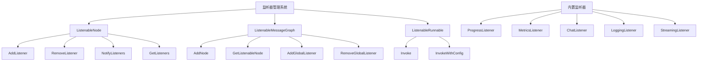
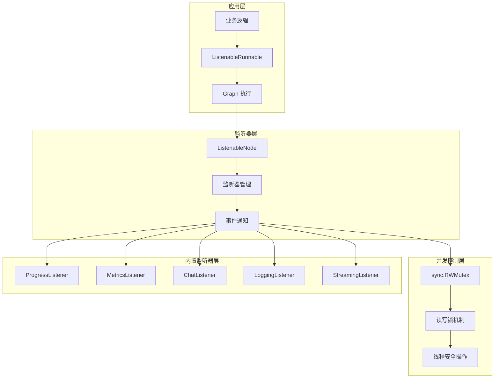
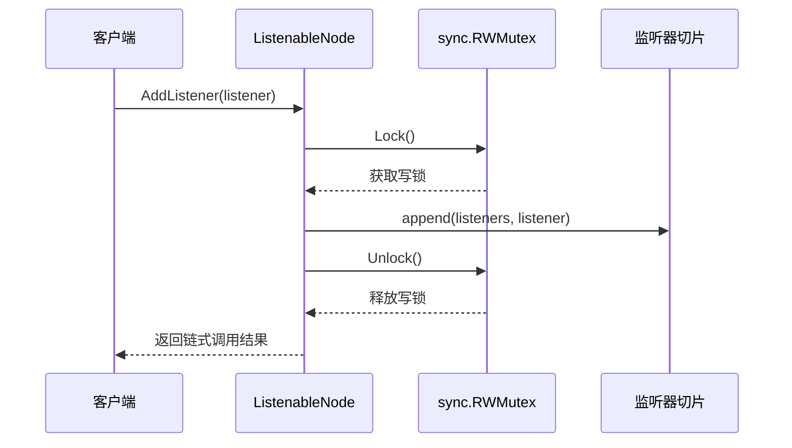
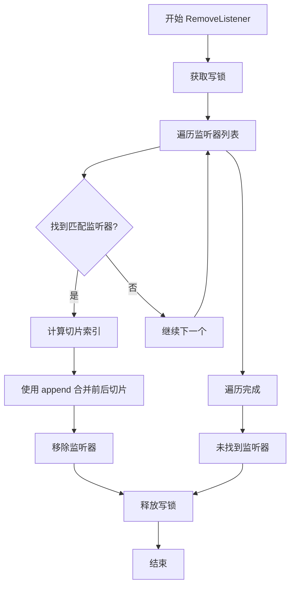
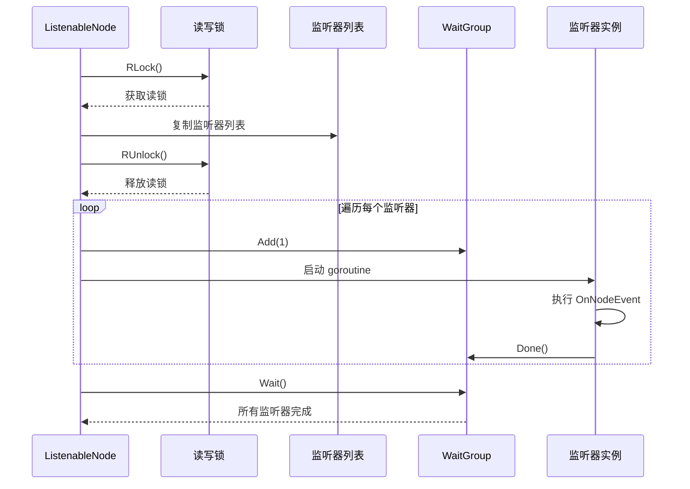
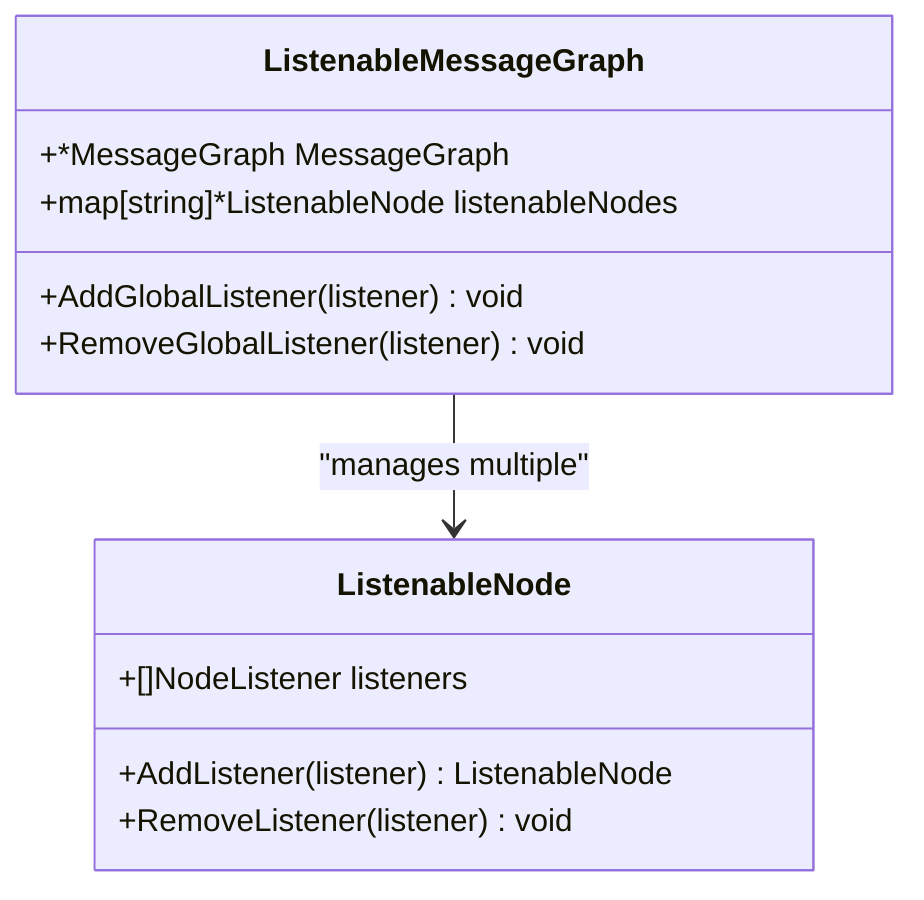
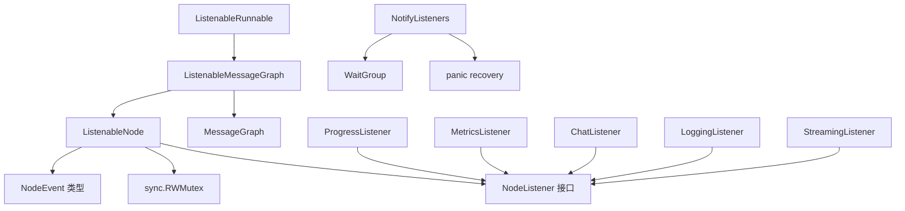

# 监听器管理机制

<cite>
**本文档中引用的文件**
- [listeners.go](file://graph/listeners.go)
- [listeners_test.go](file://graph/listeners_test.go)
- [builtin_listeners.go](file://graph/builtin_listeners.go)
- [main.go](file://examples/listeners/main.go)
- [streaming.go](file://graph/streaming.go)
- [builtin_listeners_test.go](file://graph/builtin_listeners_test.go)
</cite>

## 目录
1. [简介](#简介)
2. [项目结构](#项目结构)
3. [核心组件](#核心组件)
4. [架构概览](#架构概览)
5. [详细组件分析](#详细组件分析)
6. [依赖关系分析](#依赖关系分析)
7. [性能考虑](#性能考虑)
8. [故障排除指南](#故障排除指南)
9. [结论](#结论)

## 简介

LangGraphGo 的监听器管理机制是一个高度并发安全的事件通知系统，它通过 `sync.RWMutex` 实现对监听器列表的线程安全操作。该系统支持动态添加和移除监听器，同时确保在高并发环境下的一致性和性能。

监听器机制是 LangGraphGo 架构中的关键组件，为节点执行过程提供了丰富的事件通知能力，包括进度跟踪、错误处理、性能监控等多种功能。

## 项目结构



**图表来源**
- [listeners.go](file://graph/listeners.go#L89-L335)
- [builtin_listeners.go](file://graph/builtin_listeners.go#L1-L433)

**章节来源**
- [listeners.go](file://graph/listeners.go#L1-L335)
- [builtin_listeners.go](file://graph/builtin_listeners.go#L1-L433)

## 核心组件

### ListenableNode 结构体

`ListenableNode` 是监听器系统的核心数据结构，它扩展了基础的 `Node` 类型并添加了监听器管理功能：

```mermaid
classDiagram
class ListenableNode {
+Node node
+[]NodeListener listeners
+sync.RWMutex mutex
+AddListener(listener) ListenableNode
+RemoveListener(listener) void
+NotifyListeners(ctx, event, state, err) void
+GetListeners() []NodeListener
+Execute(ctx, state) (interface{}, error)
}
class NodeListener {
<<interface>>
+OnNodeEvent(ctx, event, nodeName, state, err) void
}
class NodeListenerFunc {
+func(ctx, event, nodeName, state, err)
}
ListenableNode --> NodeListener : "manages"
NodeListenerFunc ..|> NodeListener : "implements"
```

**图表来源**
- [listeners.go](file://graph/listeners.go#L89-L102)
- [listeners.go](file://graph/listeners.go#L51-L63)

### 内置监听器类型

系统提供了多种内置监听器，每种都针对特定的使用场景进行了优化：

| 监听器类型 | 主要功能 | 并发安全特性 | 使用场景 |
|-----------|---------|-------------|----------|
| ProgressListener | 进度跟踪和可视化 | RWMutex 读写锁 | 开发调试、用户界面显示 |
| MetricsListener | 性能指标收集 | RWMutex 读写锁 | 性能监控、负载分析 |
| ChatListener | 聊天风格消息输出 | RWMutex 读写锁 | 实时通信、用户反馈 |
| LoggingListener | 结构化日志记录 | RWMutex 读写锁 | 系统监控、问题诊断 |
| StreamingListener | 实时事件流传输 | RWMutex + 通道控制 | WebSocket、实时更新 |

**章节来源**
- [builtin_listeners.go](file://graph/builtin_listeners.go#L14-L433)

## 架构概览

监听器管理系统采用分层架构设计，从底层的并发控制到高层的应用接口，形成了一个完整的事件通知生态系统。



**图表来源**
- [listeners.go](file://graph/listeners.go#L89-L335)
- [builtin_listeners.go](file://graph/builtin_listeners.go#L14-L433)

## 详细组件分析

### AddListener 方法的并发安全设计

`AddListener` 方法是监听器管理系统中最关键的并发安全操作之一，它通过写锁确保监听器列表的原子性添加。



**图表来源**
- [listeners.go](file://graph/listeners.go#L104-L111)

#### 关键设计特点

1. **写锁保护**：使用 `mutex.Lock()` 确保在同一时间只有一个 goroutine 可以修改监听器列表
2. **原子操作**：`append` 操作在锁保护下进行，避免数据竞争
3. **链式调用**：返回 `*ListenableNode` 支持方法链式调用

#### 实现细节分析

AddListener 方法的实现展示了 Go 语言并发编程的最佳实践：

- **锁的生命周期**：在方法开始时获取锁，在方法结束前释放锁
- **defer 保证**：使用 `defer ln.mutex.Unlock()` 确保即使发生 panic 也能正确释放锁
- **最小锁定范围**：只在必要的代码段持有锁，最大化并发性能

**章节来源**
- [listeners.go](file://graph/listeners.go#L104-L111)

### RemoveListener 方法的并发安全设计

`RemoveListener` 方法比 `AddListener` 更复杂，因为它需要找到指定的监听器并从切片中移除，这涉及到指针比较和切片操作。



**图表来源**
- [listeners.go](file://graph/listeners.go#L113-L124)

#### 指针比较的匹配逻辑

RemoveListener 方法使用了 Go 的指针比较来精确匹配监听器对象：

```go
// 对于 StreamingListener，我们可以比较实际对象
if l == listener {
    ln.listeners = append(ln.listeners[:i], ln.listeners[i+1:]...)
    break
}
```

这种设计的优势：
- **精确匹配**：确保移除的是正确的监听器实例
- **类型安全**：编译器会检查类型兼容性
- **性能优化**：指针比较比值比较更高效

#### 切片扩容与元素移除的实现

切片的移除操作使用了 Go 的切片合并模式：

```go
ln.listeners = append(ln.listeners[:i], ln.listeners[i+1:]...)
```

这种方法的优点：
- **内存效率**：避免创建新的切片，直接复用现有内存
- **性能优化**：减少内存分配和拷贝操作
- **一致性**：保持切片的连续性和索引不变性

**章节来源**
- [listeners.go](file://graph/listeners.go#L113-L124)

### NotifyListeners 方法的并发通知机制

`NotifyListeners` 方法实现了高效的异步事件通知，采用了读锁和 goroutine 并发模式。



**图表来源**
- [listeners.go](file://graph/listeners.go#L127-L157)

#### 并发通知的设计优势

1. **读锁优化**：使用读锁允许多个通知同时进行
2. **无阻塞复制**：在持有读锁期间复制监听器列表
3. **goroutine 并发**：每个监听器在独立 goroutine 中执行
4. **异常隔离**：使用 defer 和 recover 防止单个监听器异常影响其他监听器

#### Panic 恢复机制

系统实现了完善的 panic 恢复机制：

```go
defer func() {
    if r := recover(); r != nil {
        // Panic recovered, but not logged to avoid dependencies
        _ = r // Acknowledge the panic was caught
    }
}()
```

这种设计的好处：
- **系统稳定性**：单个监听器的 panic 不会影响整体执行
- **最小化影响**：只捕获 panic 而不记录，避免引入额外依赖
- **优雅降级**：即使发生异常，其他监听器仍能正常执行

**章节来源**
- [listeners.go](file://graph/listeners.go#L127-L157)

### 全局监听器管理

系统提供了全局监听器管理功能，可以在整个图级别统一管理监听器。



**图表来源**
- [listeners.go](file://graph/listeners.go#L187-L234)

#### 全局监听器的优势

1. **简化管理**：一次添加即可应用于所有节点
2. **一致性**：确保所有节点使用相同的监听器配置
3. **性能优化**：避免重复添加相同的监听器

**章节来源**
- [listeners.go](file://graph/listeners.go#L222-L234)

## 依赖关系分析

监听器管理系统与其他模块存在密切的依赖关系：



**图表来源**
- [listeners.go](file://graph/listeners.go#L1-L335)
- [builtin_listeners.go](file://graph/builtin_listeners.go#L1-L433)

**章节来源**
- [listeners.go](file://graph/listeners.go#L1-L335)
- [builtin_listeners.go](file://graph/builtin_listeners.go#L1-L433)

## 性能考虑

### 并发修改时的性能表现

监听器系统的性能特征取决于具体的使用场景：

#### 添加监听器的性能
- **时间复杂度**：O(1)，因为只是简单的切片追加操作
- **空间复杂度**：O(n)，其中 n 是监听器数量
- **并发性能**：由于使用写锁，同一时间只能有一个添加操作

#### 移除监听器的性能
- **时间复杂度**：O(n)，最坏情况下需要遍历整个监听器列表
- **空间复杂度**：O(1)，原地修改切片
- **并发性能**：同样受写锁限制

#### 通知监听器的性能
- **时间复杂度**：O(k)，其中 k 是活跃监听器数量
- **空间复杂度**：O(k)，需要复制监听器列表
- **并发性能**：读锁允许多个通知同时进行，但写锁会阻塞添加/移除操作

### 潜在风险与优化建议

#### 锁竞争风险
当大量 goroutine 同时尝试添加或移除监听器时，可能会出现锁竞争：

**优化策略**：
1. **批量操作**：尽可能批量添加/移除监听器
2. **延迟初始化**：在合适的时间点再添加监听器
3. **监听器池**：重用监听器实例而不是频繁创建销毁

#### 内存使用优化
随着监听器数量增加，内存使用也会线性增长：

**优化策略**：
1. **定期清理**：及时移除不再需要的监听器
2. **弱引用**：对于临时监听器考虑使用弱引用模式
3. **分层管理**：根据重要性对监听器进行分层管理

#### 通知性能优化
大量监听器可能导致通知性能下降：

**优化策略**：
1. **异步处理**：确保监听器内部处理也是异步的
2. **优先级队列**：为不同类型的监听器设置不同的处理优先级
3. **背压控制**：实现监听器处理速度的自适应调节

## 故障排除指南

### 常见并发问题

#### 监听器丢失问题
**症状**：添加的监听器没有收到任何事件通知

**可能原因**：
1. 监听器被意外移除
2. 事件发生在监听器添加之前
3. 监听器内部发生 panic

**解决方案**：
```go
// 添加调试日志确认监听器状态
fmt.Printf("Current listeners: %d\n", len(node.GetListeners()))
```

#### 死锁问题
**症状**：程序在添加/移除监听器时卡死

**可能原因**：
1. 在监听器回调中尝试修改监听器列表
2. 锁的嵌套使用不当

**解决方案**：
```go
// 避免在监听器回调中修改监听器列表
func (l *MyListener) OnNodeEvent(...) {
    // 使用异步方式处理，避免直接修改
    go func() {
        // 异步处理逻辑
    }()
}
```

#### 性能问题
**症状**：大量监听器导致系统响应缓慢

**诊断方法**：
```go
// 监控监听器通知耗时
startTime := time.Now()
node.NotifyListeners(ctx, event, state, err)
duration := time.Since(startTime)
fmt.Printf("Notification took: %v\n", duration)
```

**章节来源**
- [listeners_test.go](file://graph/listeners_test.go#L371-L423)

### 最佳实践建议

#### 监听器设计原则
1. **单一职责**：每个监听器专注于特定的功能
2. **快速响应**：监听器内部处理应该尽可能快
3. **异常安全**：实现完善的错误处理和恢复机制
4. **资源管理**：及时释放不需要的资源

#### 并发安全实践
1. **最小锁定范围**：只在必要时持有锁
2. **避免锁嵌套**：防止死锁的发生
3. **使用 defer**：确保锁的正确释放
4. **读写分离**：充分利用读锁提高并发性

#### 性能优化建议
1. **合理选择监听器**：根据需求选择合适的内置监听器
2. **批量操作**：减少频繁的小规模操作
3. **异步处理**：将耗时操作移到后台 goroutine
4. **监控和调优**：持续监控系统性能并进行优化

**章节来源**
- [main.go](file://examples/listeners/main.go#L1-L132)
- [builtin_listeners_test.go](file://graph/builtin_listeners_test.go#L1-L200)

## 结论

LangGraphGo 的监听器管理机制通过精心设计的并发控制策略，成功实现了高性能、高可靠性的事件通知系统。其核心特点包括：

1. **完善的并发安全**：通过 `sync.RWMutex` 提供读写锁保护，确保多 goroutine 环境下的数据一致性
2. **灵活的监听器类型**：提供多种内置监听器满足不同应用场景需求
3. **高效的事件通知**：采用异步并发模式，最大化系统吞吐量
4. **健壮的错误处理**：实现完善的 panic 恢复机制，保证系统稳定性

该系统为 LangGraphGo 提供了强大的可观测性和可扩展性，是构建现代分布式系统的重要基础设施。通过遵循最佳实践和性能优化建议，开发者可以充分发挥监听器系统的优势，构建高质量的应用程序。