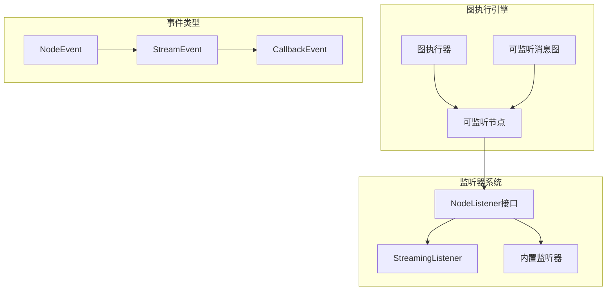
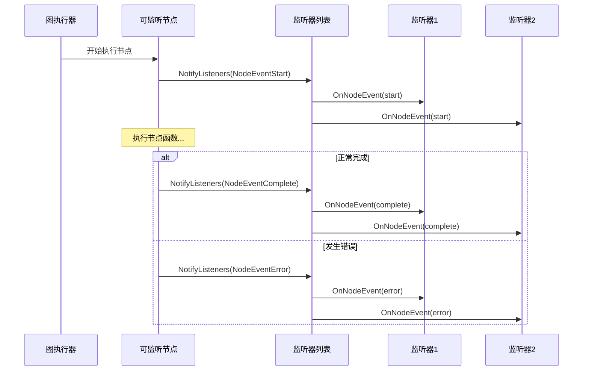
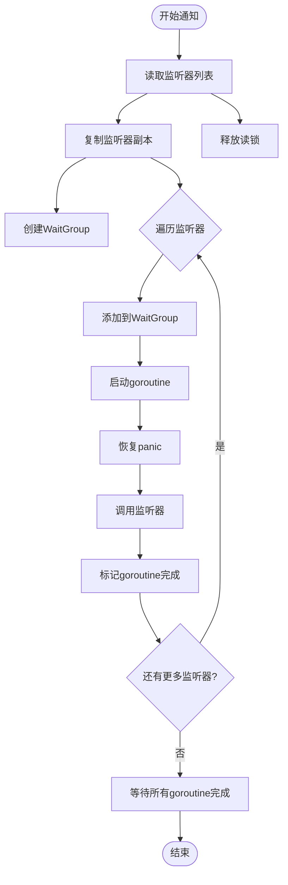
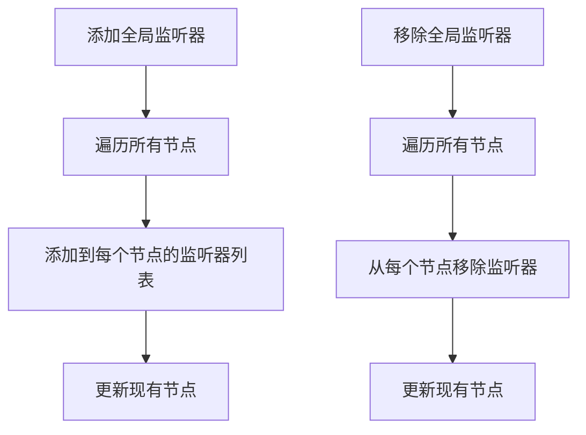
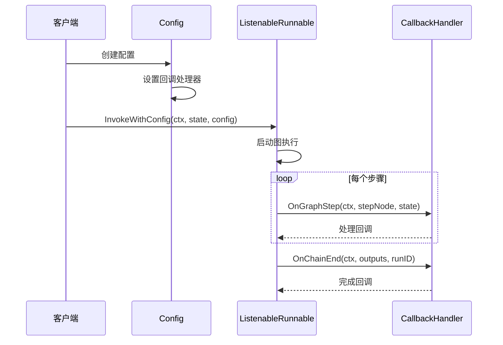
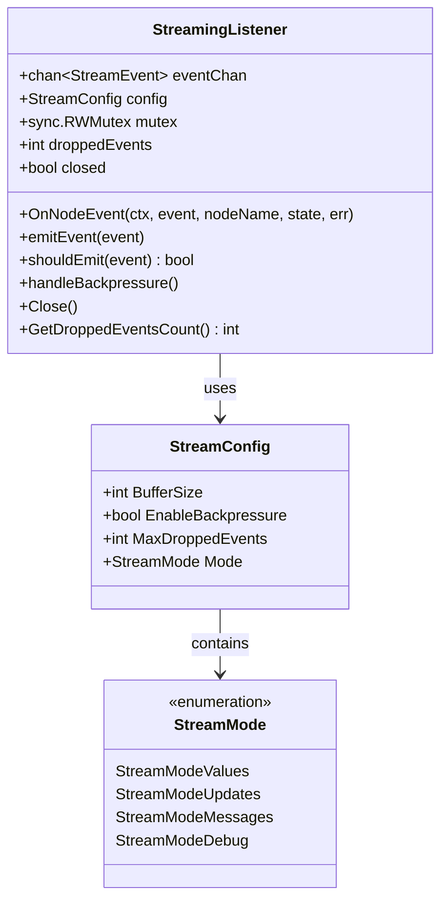
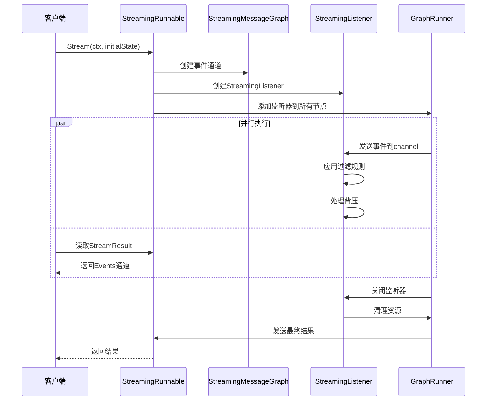
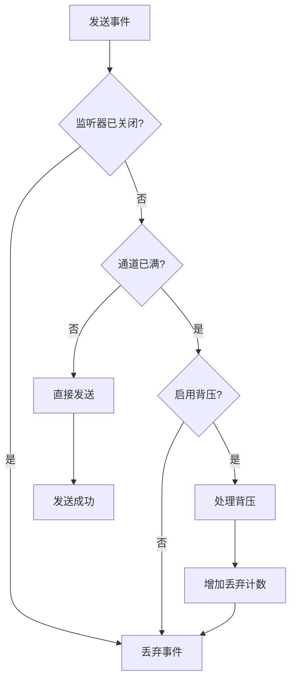

# 监听器

<cite>
**本文档中引用的文件**
- [listeners.go](file://graph/listeners.go)
- [callbacks.go](file://graph/callbacks.go)
- [builtin_listeners.go](file://graph/builtin_listeners.go)
- [streaming.go](file://graph/streaming.go)
- [main.go](file://examples/listeners/main.go)
- [listeners_test.go](file://graph/listeners_test.go)
- [builtin_listeners_test.go](file://graph/builtin_listeners_test.go)
</cite>

## 目录
1. [简介](#简介)
2. [核心概念](#核心概念)
3. [NodeEvent 枚举](#nodeevent-枚举)
4. [NodeListener 接口](#nodelistener-接口)
5. [内置监听器](#内置监听器)
6. [可监听节点设计](#可监听节点设计)
7. [事件驱动架构](#事件驱动架构)
8. [流式监听器](#流式监听器)
9. [最佳实践](#最佳实践)
10. [故障排除](#故障排除)

## 简介

LangGraphGo 的监听器（Listeners）系统是一个强大的事件驱动架构，允许外部系统实时感知图执行的生命周期。通过监听器模式，开发者可以轻松实现流式输出、性能监控、审计日志和调试工具等功能。

监听器系统的核心价值在于：
- **非侵入性**：监听器不会干扰正常的图执行流程
- **并发安全**：支持高并发的监听器通知机制
- **灵活配置**：提供多种内置监听器类型和自定义扩展能力
- **事件丰富**：涵盖从节点启动到完成的完整生命周期

## 核心概念

### 事件驱动架构

监听器系统基于事件驱动架构设计，主要包含以下组件：



**图表来源**
- [listeners.go](file://graph/listeners.go#L90-L335)
- [callbacks.go](file://graph/callbacks.go#L8-L94)

### 监听器层次结构

```mermaid
classDiagram
class NodeListener {
<<interface>>
+OnNodeEvent(ctx, event, nodeName, state, err)
}
class NodeListenerFunc {
+OnNodeEvent(ctx, event, nodeName, state, err)
}
class ListenableNode {
+Node
+listeners []NodeListener
+mutex sync.RWMutex
+Execute(ctx, state) (interface{}, error)
+NotifyListeners(ctx, event, state, err)
+AddListener(listener)
+RemoveListener(listener)
}
class ListenableMessageGraph {
+MessageGraph
+listenableNodes map[string]*ListenableNode
+AddNode(name, fn) *ListenableNode
+AddGlobalListener(listener)
+RemoveGlobalListener(listener)
}
class ProgressListener {
+writer io.Writer
+nodeSteps map[string]string
+showTiming bool
+showDetails bool
+OnNodeEvent(ctx, event, nodeName, state, err)
}
class LoggingListener {
+logger *log.Logger
+logLevel LogLevel
+includeState bool
+OnNodeEvent(ctx, event, nodeName, state, err)
}
class MetricsListener {
+nodeExecutions map[string]int
+nodeDurations map[string][]time.Duration
+GetNodeExecutions() map[string]int
+GetNodeAverageDuration() map[string]time.Duration
}
NodeListener <|-- NodeListenerFunc
NodeListener <|-- ProgressListener
NodeListener <|-- LoggingListener
NodeListener <|-- MetricsListener
ListenableNode --> NodeListener
ListenableMessageGraph --> ListenableNode
```

**图表来源**
- [listeners.go](file://graph/listeners.go#L51-L185)
- [builtin_listeners.go](file://graph/builtin_listeners.go#L13-L433)

## NodeEvent 枚举

NodeEvent 定义了图执行过程中可能发生的各种事件类型，为监听器提供了精确的事件识别能力。

### 事件类型详解

| 事件类型 | 描述 | 触发时机 |
|---------|------|----------|
| `NodeEventStart` | 节点开始执行 | 节点函数被调用时 |
| `NodeEventProgress` | 节点执行进度 | 节点执行过程中的中间状态 |
| `NodeEventComplete` | 节点成功完成 | 节点函数正常返回结果时 |
| `NodeEventError` | 节点执行出错 | 节点函数返回错误时 |
| `EventChainStart` | 图执行开始 | 整个图的执行流程启动时 |
| `EventChainEnd` | 图执行结束 | 整个图的执行流程完成时 |
| `EventToolStart` | 工具执行开始 | 调用外部工具或函数时 |
| `EventToolEnd` | 工具执行结束 | 外部工具或函数返回结果时 |
| `EventLLMStart` | LLM调用开始 | 调用语言模型服务时 |
| `EventLLMEnd` | LLM调用结束 | 语言模型服务返回响应时 |
| `EventToken` | 生成令牌 | 流式输出过程中的单个令牌 |
| `EventCustom` | 自定义事件 | 用户定义的特殊事件 |

**节来源**
- [listeners.go](file://graph/listeners.go#L13-L48)

### 事件生命周期



**图表来源**
- [listeners.go](file://graph/listeners.go#L128-L174)

## NodeListener 接口

NodeListener 是监听器系统的核心接口，定义了监听器必须实现的方法。

### 接口定义

NodeListener 接口简洁而强大，只包含一个方法：

```go
type NodeListener interface {
    OnNodeEvent(ctx context.Context, event NodeEvent, nodeName string, state interface{}, err error)
}
```

### 函数适配器

为了方便使用，框架提供了 NodeListenerFunc 类型作为函数适配器：

```go
type NodeListenerFunc func(ctx context.Context, event NodeEvent, nodeName string, state interface{}, err error)

func (f NodeListenerFunc) OnNodeEvent(ctx context.Context, event NodeEvent, nodeName string, state interface{}, err error) {
    f(ctx, event, nodeName, state, err)
}
```

**节来源**
- [listeners.go](file://graph/listeners.go#L51-L63)

### 并发安全的通知机制

NotifyListeners 方法实现了安全的并发通知机制：



**图表来源**
- [listeners.go](file://graph/listeners.go#L128-L157)

## 内置监听器

框架提供了多种内置监听器，满足常见的监控和调试需求。

### ProgressListener（进度监听器）

ProgressListener 提供可视化的进度跟踪功能：

#### 特性
- 支持自定义节点步骤消息
- 可配置时间戳显示
- 支持详细状态输出
- 可自定义前缀图标

#### 使用场景
- 命令行工具的进度显示
- 长时间运行任务的状态跟踪
- 用户友好的执行流程可视化

**节来源**
- [builtin_listeners.go](file://graph/builtin_listeners.go#L13-L116)

### LoggingListener（日志监听器）

LoggingListener 提供结构化的日志记录功能：

#### 特性
- 多级别日志支持（Debug、Info、Warn、Error）
- 可配置的日志格式
- 状态信息可选包含
- 自定义日志器支持

#### 日志级别映射

| NodeEvent | LogLevel | 前缀 |
|-----------|----------|------|
| `NodeEventStart` | Info | START |
| `NodeEventComplete` | Info | COMPLETE |
| `NodeEventProgress` | Debug | PROGRESS |
| `NodeEventError` | Error | ERROR |

**节来源**
- [builtin_listeners.go](file://graph/builtin_listeners.go#L118-L200)

### MetricsListener（指标监听器）

MetricsListener 专注于性能和执行统计：

#### 收集的指标
- **执行次数**：每个节点的总执行次数
- **平均持续时间**：节点执行的平均耗时
- **错误计数**：节点执行失败的次数
- **总执行次数**：整个图的执行次数

#### 数据结构

```mermaid
erDiagram
MetricsListener {
map nodeExecutions
map nodeDurations
map nodeErrors
map startTimes
int totalExecutions
}
nodeExecutions {
string nodeName
int executionCount
}
nodeDurations {
string nodeName
[]time.Duration durations
}
nodeErrors {
string nodeName
int errorCount
}
MetricsListener ||--o{ nodeExecutions : tracks
MetricsListener ||--o{ nodeDurations : measures
MetricsListener ||--o{ nodeErrors : counts
```

**图表来源**
- [builtin_listeners.go](file://graph/builtin_listeners.go#L202-L351)

### ChatListener（聊天监听器）

ChatListener 提供类似聊天界面的实时更新：

#### 特性
- 机器人风格的消息提示
- 自定义节点消息
- 时间戳可选显示
- 实时状态更新

**节来源**
- [builtin_listeners.go](file://graph/builtin_listeners.go#L353-L433)

## 可监听节点设计

### ListenableNode 结构

ListenableNode 通过组合模式将普通节点包装成可监听的实体：

```mermaid
classDiagram
class Node {
+string Name
+NodeFunction Function
}
class ListenableNode {
+Node
+[]NodeListener listeners
+sync.RWMutex mutex
+Execute(ctx, state) (interface{}, error)
+NotifyListeners(ctx, event, state, err)
+AddListener(listener)
+RemoveListener(listener)
+GetListeners() []NodeListener
}
Node <|-- ListenableNode : 组合
```

**图表来源**
- [listeners.go](file://graph/listeners.go#L89-L102)

### 创建可监听节点

```go
// 创建普通节点
node := Node{
    Name: "my_node",
    Function: func(ctx context.Context, state interface{}) (interface{}, error) {
        return result, nil
    },
}

// 包装成可监听节点
listenableNode := NewListenableNode(node)
```

**节来源**
- [listeners.go](file://graph/listeners.go#L96-L102)

### 全局监听器管理

ListenableMessageGraph 提供全局监听器管理功能：



**图表来源**
- [listeners.go](file://graph/listeners.go#L222-L234)

## 事件驱动架构

### 回调处理器接口

框架提供了更高级的回调处理接口：

```mermaid
classDiagram
class CallbackHandler {
<<interface>>
+OnChainStart(ctx, serialized, inputs, runID, parentRunID, tags, metadata)
+OnChainEnd(ctx, outputs, runID)
+OnChainError(ctx, err, runID)
+OnLLMStart(ctx, serialized, prompts, runID, parentRunID, tags, metadata)
+OnLLMEnd(ctx, response, runID)
+OnLLMError(ctx, err, runID)
+OnToolStart(ctx, serialized, inputStr, runID, parentRunID, tags, metadata)
+OnToolEnd(ctx, output, runID)
+OnToolError(ctx, err, runID)
+OnRetrieverStart(ctx, serialized, query, runID, parentRunID, tags, metadata)
+OnRetrieverEnd(ctx, documents, runID)
+OnRetrieverError(ctx, err, runID)
}
class GraphCallbackHandler {
<<interface>>
+CallbackHandler
+OnGraphStep(ctx, stepNode, state)
}
class Config {
+[]CallbackHandler Callbacks
+map[string]interface{} Metadata
+[]string Tags
+map[string]interface{} Configurable
+string RunName
+*time.Duration Timeout
+[]string InterruptBefore
+[]string InterruptAfter
+[]string ResumeFrom
+interface{} ResumeValue
}
CallbackHandler <|-- GraphCallbackHandler
Config --> CallbackHandler : contains
```

**图表来源**
- [callbacks.go](file://graph/callbacks.go#L8-L94)

### 配置传递机制



**图表来源**
- [listeners.go](file://graph/listeners.go#L315-L322)

## 流式监听器

### StreamingListener 设计

StreamingListener 将监听器事件转换为流式数据：



**图表来源**
- [streaming.go](file://graph/streaming.go#L66-L268)

### 流式执行流程



**图表来源**
- [streaming.go](file://graph/streaming.go#L289-L358)

### 背压处理机制



**图表来源**
- [streaming.go](file://graph/streaming.go#L84-L109)

## 最佳实践

### 1. 监听器选择指南

| 场景 | 推荐监听器 | 配置要点 |
|------|------------|----------|
| 生产环境监控 | MetricsListener | 启用持久化存储 |
| 开发调试 | LoggingListener | 设置Debug级别 |
| 用户界面 | ChatListener | 自定义友好消息 |
| 性能分析 | MetricsListener + LoggingListener | 双重记录 |
| 审计日志 | LoggingListener | 结构化JSON格式 |

### 2. 并发安全注意事项

- **避免阻塞**：监听器不应执行耗时操作
- **错误恢复**：监听器中的panic会被自动恢复
- **资源管理**：及时清理监听器资源
- **内存泄漏**：定期移除不再需要的监听器

### 3. 性能优化建议

```go
// 推荐：使用无操作监听器进行基准测试
type NoOpListener struct{}

func (l *NoOpListener) OnNodeEvent(ctx context.Context, event NodeEvent, nodeName string, state interface{}, err error) {
    // 无操作实现
}

// 推荐：批量处理事件而非逐个处理
type BatchListener struct {
    events []StreamEvent
    mutex  sync.Mutex
}

func (l *BatchListener) OnNodeEvent(ctx context.Context, event NodeEvent, nodeName string, state interface{}, err error) {
    l.mutex.Lock()
    defer l.mutex.Unlock()
    l.events = append(l.events, StreamEvent{
        Timestamp: time.Now(),
        NodeName:  nodeName,
        Event:     event,
        State:     state,
        Error:     err,
    })
}
```

### 4. 自定义监听器开发

```go
type CustomListener struct {
    // 自定义字段
    config map[string]interface{}
}

func NewCustomListener(config map[string]interface{}) *CustomListener {
    return &CustomListener{
        config: config,
    }
}

func (l *CustomListener) OnNodeEvent(ctx context.Context, event NodeEvent, nodeName string, state interface{}, err error) {
    // 实现自定义逻辑
    switch event {
    case NodeEventStart:
        // 处理开始事件
    case NodeEventComplete:
        // 处理完成事件
    case NodeEventError:
        // 处理错误事件
    }
}
```

## 故障排除

### 常见问题及解决方案

#### 1. 监听器未被调用

**症状**：添加的监听器没有收到任何事件

**原因分析**：
- 节点未正确添加监听器
- 监听器被意外移除
- 图执行未触发相应事件

**解决方案**：
```go
// 检查监听器是否正确添加
listeners := node.GetListeners()
fmt.Printf("当前监听器数量: %d\n", len(listeners))

// 确保监听器在执行前添加
node.AddListener(myListener)
```

#### 2. 性能问题

**症状**：图执行变慢，怀疑监听器影响性能

**诊断步骤**：
```go
// 使用性能分析器
import "net/http"
import _ "net/http/pprof"

func main() {
    go http.ListenAndServe("localhost:6060", nil)
    
    // 运行带有监听器的图
    // 访问 http://localhost:6060/debug/pprof/
}
```

**优化策略**：
- 使用异步处理监听器逻辑
- 实现事件过滤减少不必要的处理
- 考虑使用采样策略

#### 3. 内存泄漏

**症状**：长时间运行后内存使用持续增长

**排查方法**：
```go
// 监控监听器数量
func monitorListeners() {
    ticker := time.NewTicker(1 * time.Minute)
    for range ticker.C {
        fmt.Printf("活跃监听器: %d\n", getCurrentListenerCount())
    }
}
```

**预防措施**：
- 在适当时候移除监听器
- 使用弱引用避免循环依赖
- 定期清理过期的监听器

### 调试技巧

#### 1. 事件追踪

```go
type TracingListener struct {
    tracer *trace.Tracer
}

func (l *TracingListener) OnNodeEvent(ctx context.Context, event NodeEvent, nodeName string, state interface{}, err error) {
    l.tracer.Record(nodeName, string(event), err)
}
```

#### 2. 性能监控

```go
type PerformanceListener struct {
    metrics *prometheus.HistogramVec
}

func (l *PerformanceListener) OnNodeEvent(ctx context.Context, event NodeEvent, nodeName string, state interface{}, err error) {
    if event == NodeEventComplete {
        duration := time.Since(startTime)
        l.metrics.WithLabelValues(nodeName).Observe(duration.Seconds())
    }
}
```

**节来源**
- [listeners_test.go](file://graph/listeners_test.go#L371-L423)

通过遵循这些最佳实践和故障排除指南，开发者可以充分利用 LangGraphGo 监听器系统的强大功能，构建高效、可维护的图执行监控和调试解决方案。