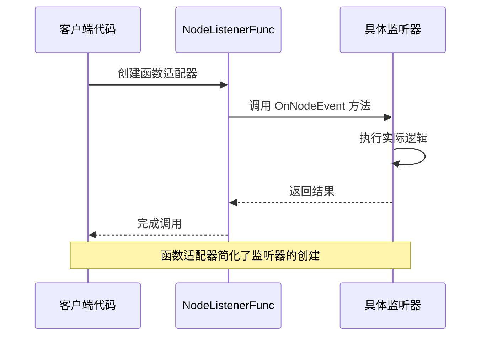
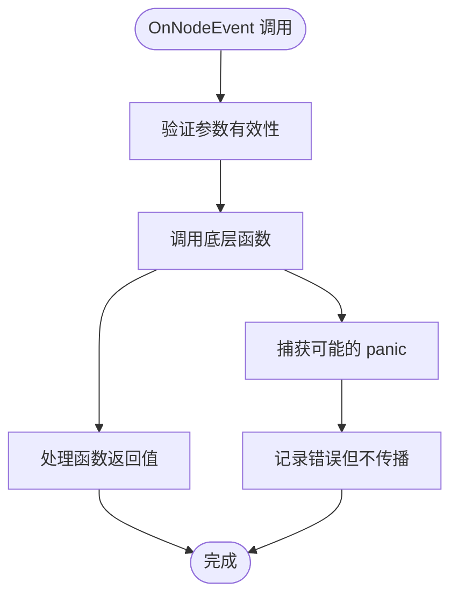
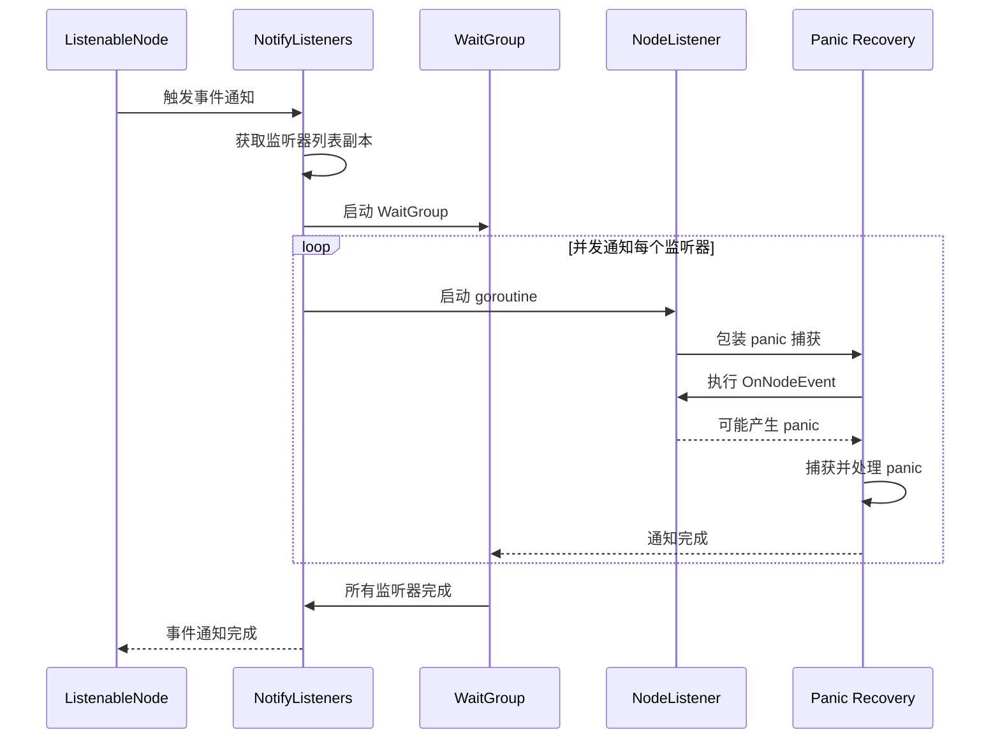
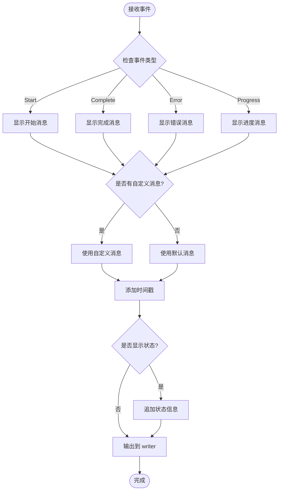
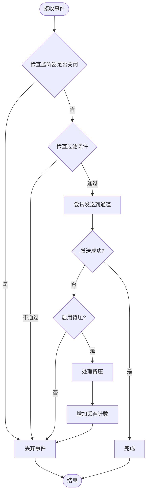
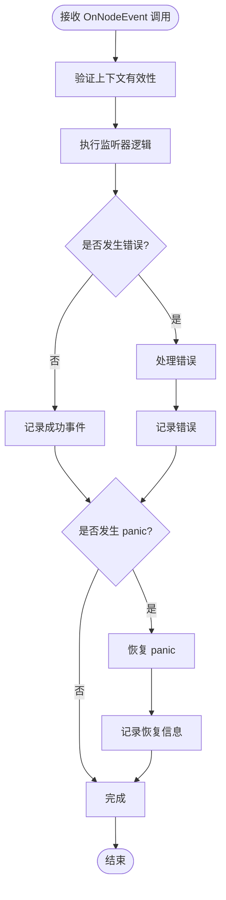
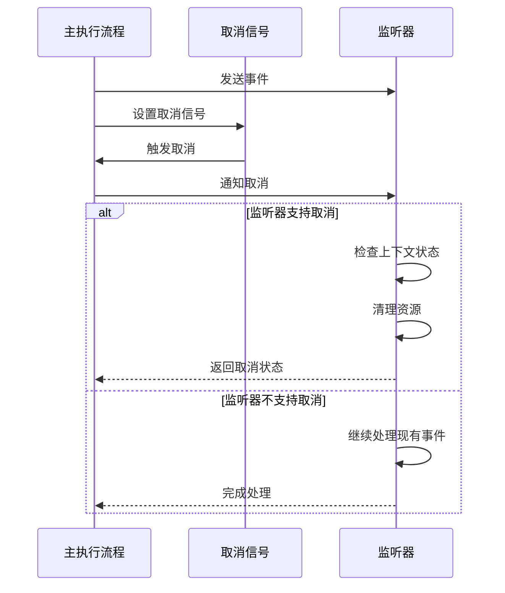
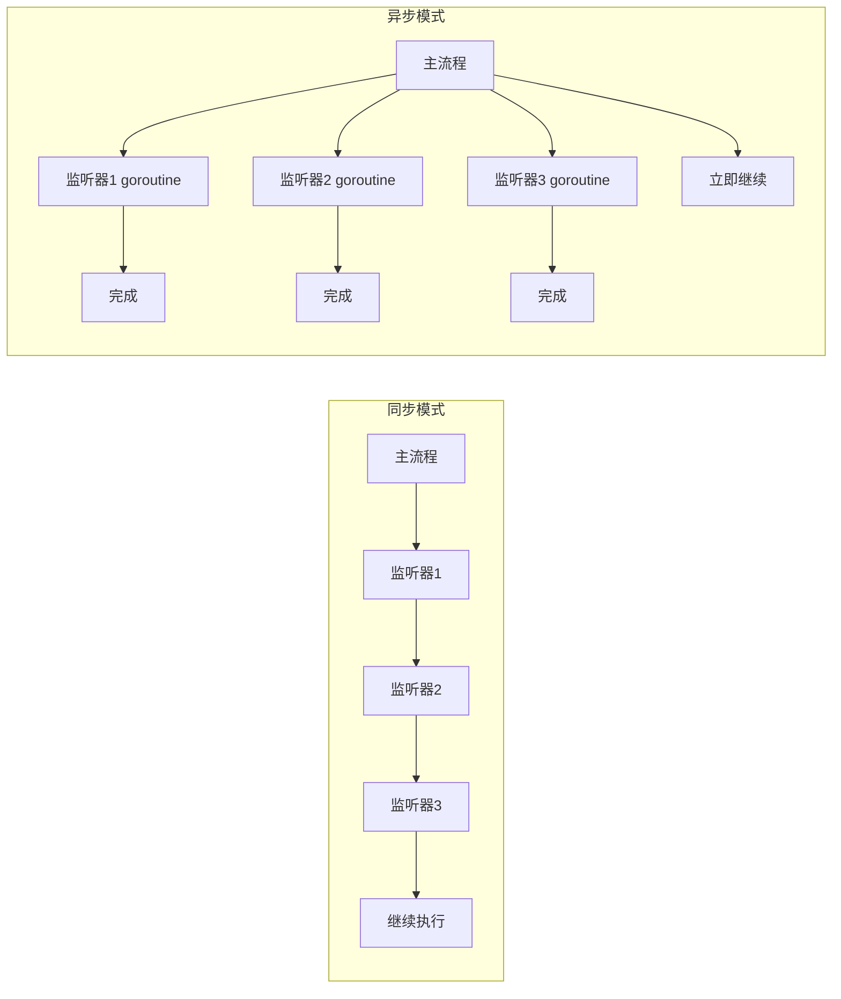
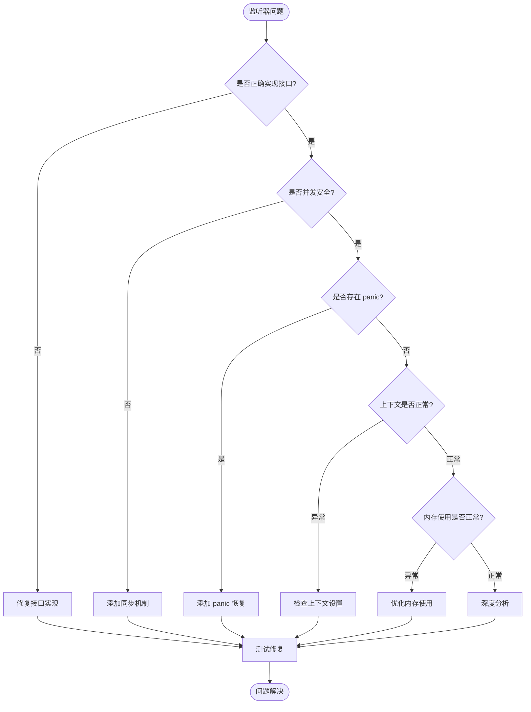

# 监听器接口

<cite>
**本文档中引用的文件**
- [listeners.go](file://graph/listeners.go)
- [builtin_listeners.go](file://graph/builtin_listeners.go)
- [streaming.go](file://graph/streaming.go)
- [main.go](file://examples/listeners/main.go)
- [listeners_test.go](file://graph/listeners_test.go)
</cite>

## 目录
1. [简介](#简介)
2. [NodeListener 接口设计](#nodelistener-接口设计)
3. [NodeListenerFunc 函数适配器](#nodelistenerfunc-函数适配器)
4. [事件类型系统](#事件类型系统)
5. [核心组件架构](#核心组件架构)
6. [内置监听器实现](#内置监听器实现)
7. [自定义监听器开发](#自定义监听器开发)
8. [最佳实践指南](#最佳实践指南)
9. [性能优化考虑](#性能优化考虑)
10. [故障排除指南](#故障排除指南)
11. [总结](#总结)

## 简介

NodeListener 接口是 langgraphgo 框架中的核心设计模式，它提供了一种灵活且可扩展的方式来监控和响应图执行过程中的各种事件。通过观察者模式，该接口允许开发者在不修改核心业务逻辑的情况下，添加日志记录、指标收集、错误处理等横切关注点。

该接口的设计体现了 Go 语言的简洁性和灵活性，利用接口的隐式实现特性，使得任何满足特定方法签名的类型都可以自动成为 NodeListener 的实现。

## NodeListener 接口设计

### 接口定义

NodeListener 是一个简单的接口，只包含一个核心方法：

```mermaid
classDiagram
class NodeListener {
<<interface>>
+OnNodeEvent(ctx Context, event NodeEvent, nodeName string, state interface{}, err error) void
}
class NodeListenerFunc {
+OnNodeEvent(ctx Context, event NodeEvent, nodeName string, state interface{}, err error) void
}
class ProgressListener {
+OnNodeEvent(ctx Context, event NodeEvent, nodeName string, state interface{}, err error) void
-writer io.Writer
-nodeSteps map[string]string
-mutex sync.RWMutex
-showTiming bool
-showDetails bool
-prefix string
}
class LoggingListener {
+OnNodeEvent(ctx Context, event NodeEvent, nodeName string, state interface{}, err error) void
-logger *log.Logger
-logLevel LogLevel
-includeState bool
}
class MetricsListener {
+OnNodeEvent(ctx Context, event NodeEvent, nodeName string, state interface{}, err error) void
-mutex sync.RWMutex
-nodeExecutions map[string]int
-nodeDurations map[string][]time.Duration
-nodeErrors map[string]int
-totalExecutions int
-startTimes map[string]time.Time
}
NodeListener <|-- NodeListenerFunc : 实现
NodeListener <|-- ProgressListener : 实现
NodeListener <|-- LoggingListener : 实现
NodeListener <|-- MetricsListener : 实现
```

**图表来源**
- [listeners.go](file://graph/listeners.go#L51-L54)
- [builtin_listeners.go](file://graph/builtin_listeners.go#L13-L433)

### OnNodeEvent 方法详解

OnNodeEvent 方法是 NodeListener 接口的核心，其参数设计具有明确的语义：

| 参数名 | 类型 | 描述 | 使用场景 |
|--------|------|------|----------|
| ctx | context.Context | 上下文对象，用于控制执行生命周期和传递请求范围的值 | 支持取消操作、超时控制、请求追踪 |
| event | NodeEvent | 事件类型，表示当前发生的节点事件 | 区分不同类型的事件（开始、完成、错误等） |
| nodeName | string | 触发事件的节点名称 | 标识事件发生的具体节点，便于定位问题 |
| state | interface{} | 当前状态快照，可以是任意类型的数据 | 记录事件发生时的系统状态，用于调试和分析 |
| err | error | 错误信息，如果事件是错误类型则包含具体错误 | 提供详细的错误信息，支持错误处理和恢复 |

**节来源**
- [listeners.go](file://graph/listeners.go#L51-L54)

## NodeListenerFunc 函数适配器

### 设计原理

NodeListenerFunc 是一个函数类型，它实现了 NodeListener 接口，充当函数适配器的角色。这种设计充分利用了 Go 语言的函数类型特性，允许开发者直接使用函数作为监听器，而无需显式定义结构体。



**图表来源**
- [listeners.go](file://graph/listeners.go#L57-L63)

### 实现机制

NodeListenerFunc 的实现非常简洁，它将函数调用直接转发给底层的函数：



**图表来源**
- [listeners.go](file://graph/listeners.go#L60-L63)

**节来源**
- [listeners.go](file://graph/listeners.go#L57-L63)

## 事件类型系统

### 事件常量定义

NodeListener 框架定义了丰富的事件类型，覆盖了图执行过程中的各个阶段：

| 事件类型 | 常量名 | 触发时机 | 用途 |
|----------|--------|----------|------|
| 节点开始 | NodeEventStart | 节点开始执行时 | 监控执行进度、启动计时器 |
| 节点进度 | NodeEventProgress | 执行过程中的进度更新 | 实时反馈、状态同步 |
| 节点完成 | NodeEventComplete | 节点成功执行完成 | 结束计时器、记录结果 |
| 节点错误 | NodeEventError | 节点执行失败时 | 错误处理、重试机制 |
| 链开始 | EventChainStart | 整个图执行开始 | 初始化全局状态 |
| 链结束 | EventChainEnd | 整个图执行完成 | 清理资源、汇总结果 |
| 工具开始 | EventToolStart | 工具调用开始 | 监控外部服务调用 |
| 工具结束 | EventToolEnd | 工具调用完成 | 记录工具执行结果 |
| LLM 开始 | EventLLMStart | 大语言模型调用开始 | 监控 AI 服务调用 |
| LLM 结束 | EventLLMEnd | 大语言模型调用完成 | 记录 AI 服务结果 |
| Token 生成 | EventToken | 流式输出生成 token | 实时流式处理 |
| 自定义事件 | EventCustom | 用户自定义事件 | 扩展功能 |

**节来源**
- [listeners.go](file://graph/listeners.go#L13-L48)

## 核心组件架构

### ListenableNode 架构

ListenableNode 是 Node 的扩展，增加了监听器支持：

```mermaid
classDiagram
class Node {
+Name string
+Function func(Context, interface{}) (interface{}, error)
}
class ListenableNode {
+Node
-listeners []NodeListener
-mutex sync.RWMutex
+AddListener(NodeListener) ListenableNode
+RemoveListener(NodeListener) void
+NotifyListeners(Context, NodeEvent, interface{}, error) void
+Execute(Context, interface{}) (interface{}, error)
+GetListeners() []NodeListener
}
class ListenableMessageGraph {
+*MessageGraph
-listenableNodes map[string]*ListenableNode
+AddNode(string, func) *ListenableNode
+GetListenableNode(string) *ListenableNode
+AddGlobalListener(NodeListener) void
+RemoveGlobalListener(NodeListener) void
}
Node <|-- ListenableNode : 继承
ListenableNode --> NodeListener : 管理多个
ListenableMessageGraph --> ListenableNode : 管理多个
```

**图表来源**
- [listeners.go](file://graph/listeners.go#L89-L234)

### 事件通知流程

事件通知采用异步并发模式，确保不会阻塞主执行流程：



**图表来源**
- [listeners.go](file://graph/listeners.go#L127-L157)

**节来源**
- [listeners.go](file://graph/listeners.go#L89-L234)

## 内置监听器实现

### ProgressListener - 进度监听器

ProgressListener 提供可视化的进度跟踪功能：



**图表来源**
- [builtin_listeners.go](file://graph/builtin_listeners.go#L70-L116)

### MetricsListener - 性能指标监听器

MetricsListener 收集详细的执行指标：

```mermaid
erDiagram
MetricsListener {
map nodeExecutions
map nodeDurations
map nodeErrors
int totalExecutions
map startTimes
sync.RWMutex mutex
}
NodeMetrics {
string nodeName
int executionCount
duration[] durations
int errorCount
time startTime
}
MetricsListener ||--o{ NodeMetrics : contains
```

**图表来源**
- [builtin_listeners.go](file://graph/builtin_listeners.go#L202-L351)

### StreamingListener - 流式监听器

StreamingListener 将事件发送到流通道，支持实时数据流：



**图表来源**
- [streaming.go](file://graph/streaming.go#L84-L109)

**节来源**
- [builtin_listeners.go](file://graph/builtin_listeners.go#L13-L433)
- [streaming.go](file://graph/streaming.go#L66-L265)

## 自定义监听器开发

### 实现步骤

开发自定义监听器需要遵循以下步骤：

1. **定义监听器结构体**：包含必要的状态和配置字段
2. **实现 NodeListener 接口**：提供 OnNodeEvent 方法的具体实现
3. **处理并发安全**：使用互斥锁保护共享状态
4. **优雅处理错误**：避免监听器错误影响主执行流程

### 示例实现模式

```mermaid
classDiagram
class CustomListener {
-storage []EventRecord
-mutex sync.Mutex
-config Config
+OnNodeEvent(ctx Context, event NodeEvent, nodeName string, state interface{}, err error) void
+GetRecords() []EventRecord
+Reset() void
}
class EventRecord {
+Timestamp time.Time
+EventType NodeEvent
+NodeName string
+State interface{}
+Error error
}
class Config {
+BufferSize int
+FilterPattern string
+OutputFormat string
}
CustomListener --> EventRecord : stores
CustomListener --> Config : uses
```

### 最佳实践模板

自定义监听器应遵循以下设计原则：

| 设计原则 | 实现要点 | 示例代码路径 |
|----------|----------|--------------|
| 单一职责 | 每个监听器专注于特定功能 | [builtin_listeners.go](file://graph/builtin_listeners.go#L13-L433) |
| 并发安全 | 使用互斥锁保护共享状态 | [builtin_listeners.go](file://graph/builtin_listeners.go#L15-L21) |
| 错误隔离 | 捕获并处理可能的 panic | [listeners.go](file://graph/listeners.go#L143-L148) |
| 上下文支持 | 正确使用传入的 context | [builtin_listeners.go](file://graph/builtin_listeners.go#L166-L200) |
| 资源管理 | 及时清理和释放资源 | [streaming.go](file://graph/streaming.go#L246-L250) |

**节来源**
- [builtin_listeners.go](file://graph/builtin_listeners.go#L13-L433)
- [listeners.go](file://graph/listeners.go#L143-L148)

## 最佳实践指南

### 错误处理策略

监听器应该具备良好的错误处理能力：



### 上下文取消响应

监听器应该能够响应上下文取消：



### 并发安全注意事项

| 安全措施 | 实现方式 | 适用场景 |
|----------|----------|----------|
| 读写锁 | sync.RWMutex | 读多写少的场景 |
| 原子操作 | atomic.Value | 简单状态更新 |
| 通道通信 | channel | 异步数据传输 |
| 条件变量 | sync.Cond | 条件等待和通知 |
| 互斥锁 | sync.Mutex | 临界区保护 |

**节来源**
- [listeners.go](file://graph/listeners.go#L143-L148)
- [builtin_listeners.go](file://graph/builtin_listeners.go#L15-L21)

## 性能优化考虑

### 异步处理优势

监听器采用异步处理模式带来以下性能优势：



### 内存管理优化

| 优化技术 | 应用场景 | 效果 |
|----------|----------|------|
| 对象池 | 重复创建的临时对象 | 减少 GC 压力 |
| 缓冲区复用 | 大量小对象分配 | 提高内存利用率 |
| 延迟初始化 | 可选功能模块 | 减少启动内存占用 |
| 数据结构选择 | 不同访问模式 | 优化时间和空间复杂度 |

### 性能监控指标

关键性能指标包括：

- **事件处理延迟**：从事件发生到处理完成的时间
- **并发处理能力**：同时处理的事件数量
- **内存使用情况**：监听器占用的内存大小
- **错误率统计**：监听器失败的比例
- **吞吐量测量**：每秒处理的事件数量

**节来源**
- [listeners.go](file://graph/listeners.go#L134-L157)

## 故障排除指南

### 常见问题诊断



### 调试技巧

| 调试方法 | 适用场景 | 实现方式 |
|----------|----------|----------|
| 日志记录 | 事件流跟踪 | 在 OnNodeEvent 中添加日志 |
| 断点调试 | 逻辑错误定位 | 使用 IDE 断点调试 |
| 性能分析 | 性能瓶颈识别 | 使用 pprof 分析 |
| 单元测试 | 功能验证 | 编写专门的测试用例 |
| 集成测试 | 端到端验证 | 测试完整执行流程 |

### 监控和告警

建议实施的监控措施：

- **事件计数监控**：跟踪不同类型事件的数量
- **处理时间监控**：监控事件处理的平均时间
- **错误率监控**：跟踪监听器错误的发生频率
- **内存使用监控**：监控监听器的内存占用
- **并发度监控**：监控同时运行的监听器数量

**节来源**
- [listeners_test.go](file://graph/listeners_test.go#L371-L449)

## 总结

NodeListener 接口设计体现了 langgraphgo 框架的核心设计理念：简洁性、灵活性和可扩展性。通过接口的隐式实现特性和函数适配器模式，开发者可以轻松地添加各种监听器功能，而无需修改核心框架代码。

### 关键优势

1. **接口简洁**：单一的 OnNodeEvent 方法提供了足够的表达能力
2. **函数适配**：NodeListenerFunc 简化了监听器的创建过程
3. **异步处理**：并发事件通知不会阻塞主执行流程
4. **错误隔离**：监听器错误被有效隔离，不影响整体执行
5. **内置丰富**：提供了多种实用的内置监听器实现

### 设计亮点

- **Go 语言特性充分利用**：接口隐式实现、函数类型、并发原语
- **事件驱动架构**：基于观察者模式的松耦合设计
- **扩展性强**：支持自定义监听器和组合使用
- **生产就绪**：内置的错误处理和性能优化

### 应用建议

在实际项目中使用 NodeListener 接口时，建议：

1. **根据需求选择合适的内置监听器**
2. **对于特殊需求开发自定义监听器**
3. **注意并发安全和错误处理**
4. **合理配置监听器的性能参数**
5. **建立完善的监控和告警机制**

通过深入理解和正确使用 NodeListener 接口，开发者可以构建出更加可观测、可维护和高性能的图执行系统。