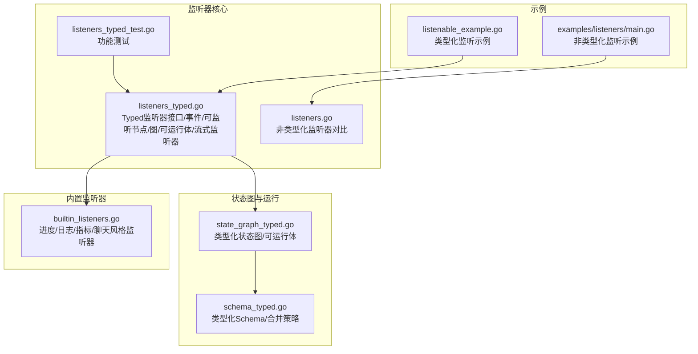
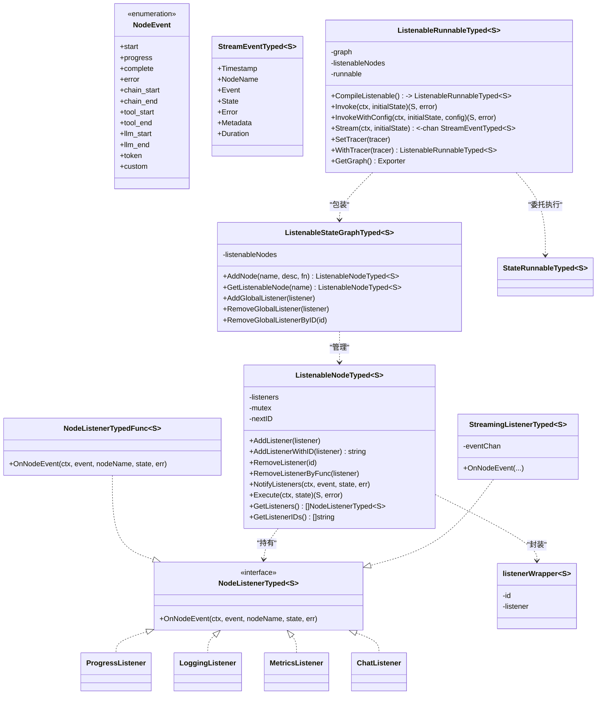
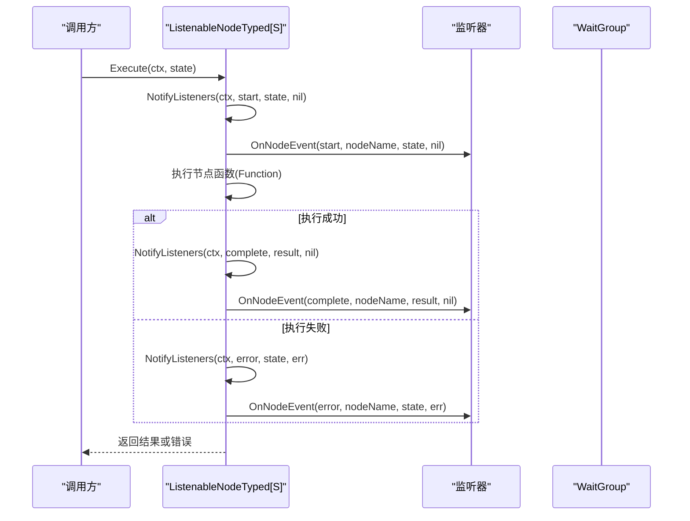
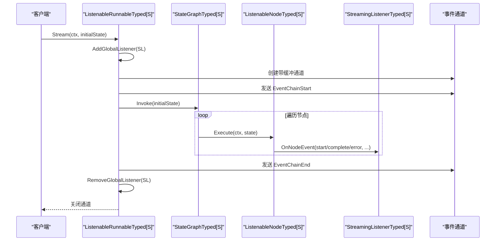
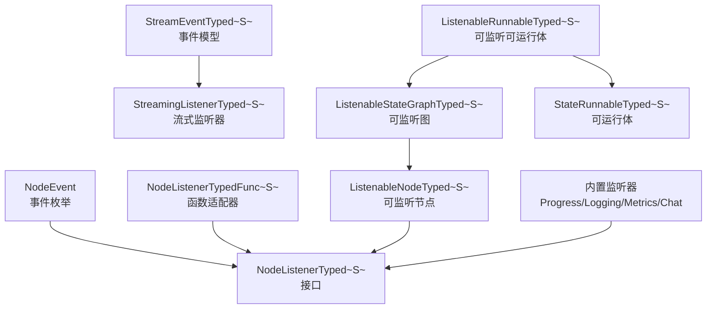

# 类型化事件监听器

<cite>
**本文引用的文件**
- [graph/listeners_typed.go](file://graph/listeners_typed.go)
- [graph/listeners_typed_test.go](file://graph/listeners_typed_test.go)
- [examples/generic_state_graph_listenable/listenable_example.go](file://examples/generic_state_graph_listenable/listenable_example.go)
- [graph/listeners.go](file://graph/listeners.go)
- [graph/builtin_listeners.go](file://graph/builtin_listeners.go)
- [graph/state_graph_typed.go](file://graph/state_graph_typed.go)
- [graph/schema_typed.go](file://graph/schema_typed.go)
- [examples/listeners/main.go](file://examples/listeners/main.go)
</cite>

## 目录
1. [简介](#简介)
2. [项目结构](#项目结构)
3. [核心组件](#核心组件)
4. [架构总览](#架构总览)
5. [详细组件分析](#详细组件分析)
6. [依赖关系分析](#依赖关系分析)
7. [性能考量](#性能考量)
8. [故障排查指南](#故障排查指南)
9. [结论](#结论)
10. [附录](#附录)

## 简介
本文件系统性阐述“类型化事件监听器”在该代码库中的设计与实现，重点覆盖：
- 类型安全的节点事件监听接口与实现
- 可监听的有向状态图（Typed）及其编排能力
- 全局与节点级监听器注册、移除与通知机制
- 流式事件通道与可视化导出
- 内置监听器（进度、日志、指标、聊天风格）的使用方式
- 示例工程与测试用例的对照解读

该能力在保持强类型约束的同时，提供可观测性、可扩展的事件通知与流式输出，适用于复杂工作流的调试、监控与交互式展示。

## 项目结构
围绕类型化事件监听器的关键目录与文件如下：
- graph/listeners_typed.go：定义 Typed 版本的监听器接口、事件模型、可监听节点与图、可监听可运行体以及流式监听器
- graph/listeners_typed_test.go：覆盖 Add/Remove/Notify/Execute/Stream 等行为的单元测试
- examples/generic_state_graph_listenable/listenable_example.go：类型化监听示例，包含全局监听器、节点特定监听器、流式执行
- graph/listeners.go：非类型化的通用监听器实现（对比参考）
- graph/builtin_listeners.go：内置监听器（进度、日志、指标、聊天风格）
- graph/state_graph_typed.go：类型化状态图与可运行体的编译与执行流程
- graph/schema_typed.go：类型化状态模式（Schema）与合并策略
- examples/listeners/main.go：非类型化监听示例（对比参考）

图表来源
- [graph/listeners_typed.go](file://graph/listeners_typed.go#L1-L451)
- [graph/listeners_typed_test.go](file://graph/listeners_typed_test.go#L1-L852)
- [graph/listeners.go](file://graph/listeners.go#L1-L289)
- [graph/builtin_listeners.go](file://graph/builtin_listeners.go#L1-L433)
- [graph/state_graph_typed.go](file://graph/state_graph_typed.go#L1-L646)
- [graph/schema_typed.go](file://graph/schema_typed.go#L1-L213)
- [examples/generic_state_graph_listenable/listenable_example.go](file://examples/generic_state_graph_listenable/listenable_example.go#L1-L193)
- [examples/listeners/main.go](file://examples/listeners/main.go#L1-L132)

章节来源
- [graph/listeners_typed.go](file://graph/listeners_typed.go#L1-L451)
- [graph/listeners_typed_test.go](file://graph/listeners_typed_test.go#L1-L852)
- [examples/generic_state_graph_listenable/listenable_example.go](file://examples/generic_state_graph_listenable/listenable_example.go#L1-L193)

## 核心组件
- 节点事件类型与事件模型
  - 事件类型：开始、进度、完成、错误、链路开始、链路结束、工具开始/结束、LLM 开始/结束、令牌、自定义等
  - 事件模型：包含时间戳、节点名、事件类型、当前状态、错误、元数据、耗时等字段
- Typed 监听器接口与函数适配器
  - 接口：OnNodeEvent(ctx, event, nodeName, state, err)
  - 函数适配器：NodeListenerTypedFunc[S] 实现接口，便于以闭包形式快速实现监听器
- 可监听节点与图
  - ListenableNodeTyped[S]：在 NodeTyped[S] 基础上增加监听器集合、并发安全通知、执行前后事件通知
  - ListenableStateGraphTyped[S]：在 StateGraphTyped[S] 基础上增加监听器节点映射、全局监听器管理
- 可监听可运行体
  - ListenableRunnableTyped[S]：包装 StateRunnableTyped[S]，注入 nodeRunner 以调用 ListenableNodeTyped[S].Execute，并支持流式事件通道
- 流式监听器
  - StreamingListenerTyped[S]：将节点事件写入带缓冲的通道，供外部消费；ListenableRunnableTyped[S].Stream 将其作为全局监听器加入所有节点
- 内置监听器
  - 进度监听器：可配置输出位置、是否显示时间、是否显示状态细节、节点步骤消息
  - 日志监听器：可配置日志级别、是否包含状态
  - 指标监听器：统计每个节点执行次数、平均耗时、错误次数、总执行数
  - 聊天风格监听器：以机器人风格的消息输出节点生命周期事件

章节来源
- [graph/listeners_typed.go](file://graph/listeners_typed.go#L1-L451)
- [graph/builtin_listeners.go](file://graph/builtin_listeners.go#L1-L433)

## 架构总览
类型化事件监听器的整体架构围绕“类型化状态图 + 可监听节点/图 + 可监听可运行体 + 流式监听器”的组合展开，既保证了状态与事件的类型安全，又提供了可观测性与可扩展的事件分发。

图表来源
- [graph/listeners_typed.go](file://graph/listeners_typed.go#L1-L451)
- [graph/builtin_listeners.go](file://graph/builtin_listeners.go#L1-L433)

## 详细组件分析

### 组件一：类型化事件与事件模型
- 事件类型定义覆盖节点生命周期、链路生命周期、工具/LLM/令牌等关键阶段
- 事件模型包含时间戳、节点名、事件类型、状态、错误、元数据、耗时等字段，便于下游处理与可视化

章节来源
- [graph/listeners_typed.go](file://graph/listeners_typed.go#L1-L120)

### 组件二：类型化监听器接口与函数适配器
- NodeListenerTyped[S] 提供类型化的 OnNodeEvent 回调签名
- NodeListenerTypedFunc[S] 通过函数适配器实现接口，便于以闭包快速实现监听器

章节来源
- [graph/listeners_typed.go](file://graph/listeners_typed.go#L10-L30)

### 组件三：可监听节点 ListenableNodeTyped[S]
- 并发安全：内部使用读写锁保护监听器列表与 ID 分配
- 生命周期通知：Execute 在节点开始、完成、错误时分别触发对应事件
- 监听器管理：支持按引用或 ID 移除监听器；NotifyListeners 以 goroutine 并发通知，且对单个监听器的 panic 进行捕获，避免影响其他监听器
- 查询接口：返回当前监听器切片与监听器 ID 列表

图表来源
- [graph/listeners_typed.go](file://graph/listeners_typed.go#L129-L177)

章节来源
- [graph/listeners_typed.go](file://graph/listeners_typed.go#L71-L128)
- [graph/listeners_typed.go](file://graph/listeners_typed.go#L129-L177)

### 组件四：可监听状态图 ListenableStateGraphTyped[S]
- 节点注册：AddNode 创建 ListenableNodeTyped[S]，同时注册到基础 StateGraphTyped[S]
- 全局监听：AddGlobalListener/RemoveGlobalListener/RemoveGlobalListenerByID 支持对全图节点批量添加/移除监听器
- 图查询：GetListenableNode 获取指定节点

章节来源
- [graph/listeners_typed.go](file://graph/listeners_typed.go#L203-L259)

### 组件五：可监听可运行体 ListenableRunnableTyped[S]
- 编译：CompileListenable 从 StateGraphTyped[S] 编译 StateRunnableTyped[S]，并重写 nodeRunner 为 ListenableNodeTyped[S].Execute，确保事件通知贯穿执行过程
- 执行：Invoke/InvokeWithConfig 委托底层 StateRunnableTyped[S] 执行
- 流式：Stream 创建 StreamingListenerTyped[S]，将其作为全局监听器加入所有节点，启动 goroutine 执行图并在开始与结束时发送链路事件，最终关闭通道并移除监听器

图表来源
- [graph/listeners_typed.go](file://graph/listeners_typed.go#L296-L348)
- [graph/listeners_typed.go](file://graph/listeners_typed.go#L428-L451)

章节来源
- [graph/listeners_typed.go](file://graph/listeners_typed.go#L260-L348)

### 组件六：流式监听器 StreamingListenerTyped[S]
- 将事件写入带缓冲的通道，采用非阻塞发送策略（默认分支），避免阻塞通知流程
- 事件内容包含时间戳、节点名、事件类型、状态、错误、元数据等

章节来源
- [graph/listeners_typed.go](file://graph/listeners_typed.go#L428-L451)

### 组件七：内置监听器
- 进度监听器：可配置输出位置、是否显示时间、是否显示状态细节、节点步骤消息
- 日志监听器：可配置日志级别、是否包含状态
- 指标监听器：统计每个节点执行次数、平均耗时、错误次数、总执行数，并支持打印汇总与重置
- 聊天风格监听器：以机器人风格的消息输出节点生命周期事件，支持节点消息定制与时间戳控制

章节来源
- [graph/builtin_listeners.go](file://graph/builtin_listeners.go#L1-L433)

### 组件八：类型化状态图与 Schema
- StateGraphTyped[S]/NodeTyped[S]/StateRunnableTyped[S] 提供类型化的节点定义、编译与执行
- Schema 定义状态初始化与更新逻辑，支持结构体 Schema、字段级合并策略等

章节来源
- [graph/state_graph_typed.go](file://graph/state_graph_typed.go#L1-L200)
- [graph/schema_typed.go](file://graph/schema_typed.go#L1-L120)

### 组件九：示例与测试对照
- 类型化监听示例：演示全局监听器、节点特定监听器、流式执行与事件消费
- 单元测试：覆盖监听器添加/移除、通知并发与 panic 容错、节点执行事件、全局监听器管理、编译与执行、流式事件、可视化导出等

章节来源
- [examples/generic_state_graph_listenable/listenable_example.go](file://examples/generic_state_graph_listenable/listenable_example.go#L1-L193)
- [graph/listeners_typed_test.go](file://graph/listeners_typed_test.go#L1-L852)

## 依赖关系分析
- ListenableNodeTyped[S] 依赖 NodeEvent 与 NodeListenerTyped[S]，并通过 WaitGroup 与 goroutine 实现并发通知
- ListenableStateGraphTyped[S] 依赖 StateGraphTyped[S] 与 ListenableNodeTyped[S]，提供全局监听器管理
- ListenableRunnableTyped[S] 依赖 StateRunnableTyped[S] 与 ListenableStateGraphTyped[S]，通过 nodeRunner 注入事件通知
- StreamingListenerTyped[S] 依赖事件通道，用于流式事件输出
- 内置监听器实现 NodeListenerTyped[S] 接口，可直接作为监听器使用

图表来源
- [graph/listeners_typed.go](file://graph/listeners_typed.go#L1-L451)
- [graph/builtin_listeners.go](file://graph/builtin_listeners.go#L1-L433)

章节来源
- [graph/listeners_typed.go](file://graph/listeners_typed.go#L1-L451)
- [graph/builtin_listeners.go](file://graph/builtin_listeners.go#L1-L433)

## 性能考量
- 并发通知：NotifyListeners 使用 WaitGroup 与 goroutine 对监听器进行异步通知，避免阻塞节点执行；对单个监听器的 panic 进行捕获，防止传播
- 通道缓冲：流式事件通道采用带缓冲队列，减少阻塞风险；默认分支丢弃事件，避免阻塞发送端
- 锁粒度：ListenableNodeTyped[S] 使用读写锁，读多写少场景下提升并发性能
- 可视化转换：ListenableRunnableTyped[S].convertToRegularGraph 将类型化图转换为常规图进行可视化，注意类型信息在转换过程中会丢失，仅保留节点、边、条件边、入口点与重试策略

章节来源
- [graph/listeners_typed.go](file://graph/listeners_typed.go#L129-L177)
- [graph/listeners_typed.go](file://graph/listeners_typed.go#L372-L426)

## 故障排查指南
- 监听器未收到事件
  - 检查是否正确添加监听器（AddListener/AddListenerWithID），或是否被 RemoveListener/RemoveGlobalListenerByID 移除
  - 确认监听器是否在编译前已加入（流式场景需在 CompileListenable 前添加全局监听器）
- 事件顺序异常
  - 节点执行顺序由 StateGraphTyped[S] 的边与条件边决定；检查 AddEdge/AddConditionalEdge 设置
- 流式通道无输出
  - 确认 Stream 已启动且未提前关闭；检查通道缓冲大小与消费速度
- 监听器 panic 导致崩溃
  - NotifyListeners 已对单个监听器的 panic 进行捕获；如仍出现异常，请检查监听器实现与上下文
- 指标统计不准确
  - 指标监听器仅统计 start/complete/error 事件；确认节点确实触发了相应事件

章节来源
- [graph/listeners_typed.go](file://graph/listeners_typed.go#L129-L177)
- [graph/listeners_typed_test.go](file://graph/listeners_typed_test.go#L209-L353)
- [examples/generic_state_graph_listenable/listenable_example.go](file://examples/generic_state_graph_listenable/listenable_example.go#L148-L193)

## 结论
类型化事件监听器在该代码库中实现了强类型、可观测、可扩展的事件通知体系。通过 ListenableNodeTyped[S]、ListenableStateGraphTyped[S] 与 ListenableRunnableTyped[S] 的组合，开发者可以在不牺牲类型安全的前提下，灵活地接入全局与节点级监听器，并以流式方式实时消费事件。内置监听器进一步降低了可观测性的门槛，适合快速落地监控、日志与进度展示等场景。

## 附录
- 快速开始建议
  - 使用 NewListenableStateGraphTyped[S] 创建类型化监听图
  - 通过 AddNode 获取 ListenableNodeTyped[S] 并为其添加监听器
  - 使用 AddGlobalListener 为全图节点统一添加监听器
  - 调用 CompileListenable 获取 ListenableRunnableTyped[S]，随后 Invoke/Stream 执行
  - 如需可视化，调用 GetGraph 获取 Exporter
- 常见问题
  - 何时添加监听器：流式场景需在 CompileListenable 前添加全局监听器
  - 监听器移除：支持按引用或 ID 移除；全局场景可用 RemoveGlobalListenerByID
  - 自定义事件：可通过 EventCustom 定义用户自定义事件类型

章节来源
- [examples/generic_state_graph_listenable/listenable_example.go](file://examples/generic_state_graph_listenable/listenable_example.go#L1-L193)
- [graph/listeners_typed.go](file://graph/listeners_typed.go#L203-L348)