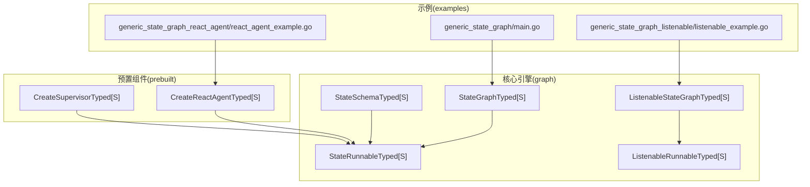
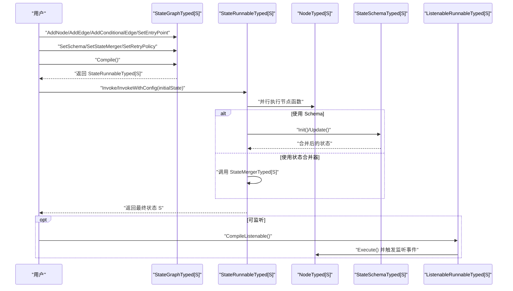
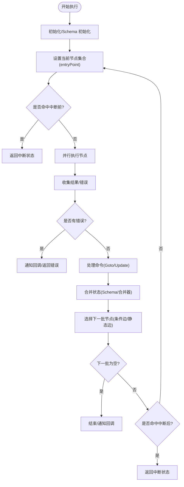
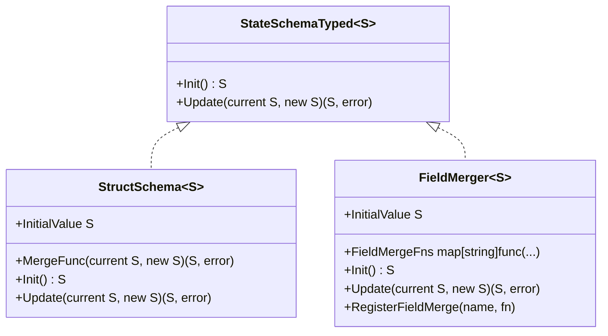
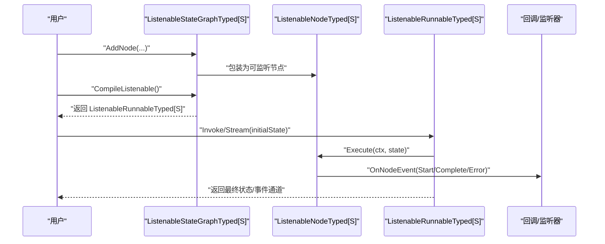
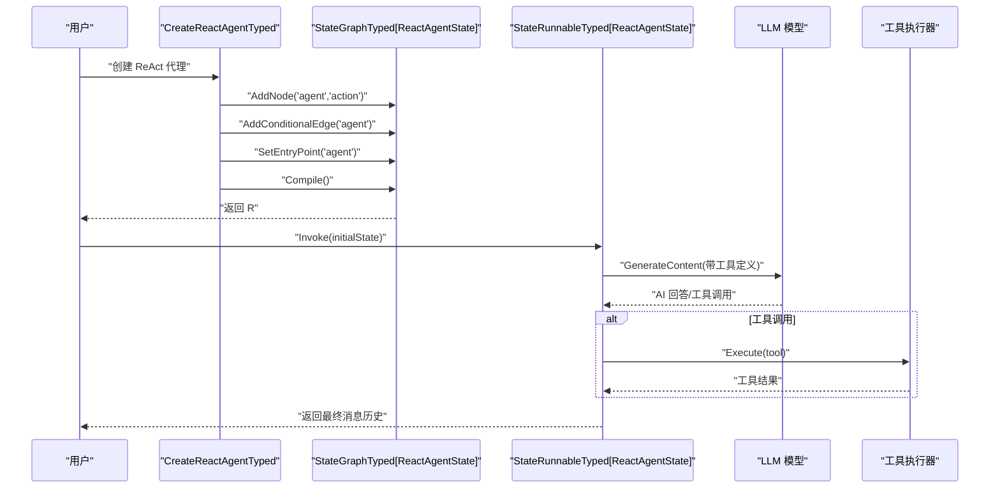
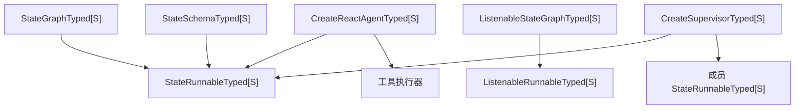

# 类型化状态模式

<cite>
**本文引用的文件**
- [graph/state_graph_typed.go](file://graph/state_graph_typed.go)
- [graph/schema_typed.go](file://graph/schema_typed.go)
- [graph/listeners_typed.go](file://graph/listeners_typed.go)
- [prebuilt/react_agent_typed.go](file://prebuilt/react_agent_typed.go)
- [prebuilt/supervisor_typed.go](file://prebuilt/supervisor_typed.go)
- [examples/generic_state_graph/main.go](file://examples/generic_state_graph/main.go)
- [examples/generic_state_graph_listenable/listenable_example.go](file://examples/generic_state_graph_listenable/listenable_example.go)
- [examples/generic_state_graph_react_agent/react_agent_example.go](file://examples/generic_state_graph_react_agent/react_agent_example.go)
- [graph/doc.go](file://graph/doc.go)
- [graph/state_graph_typed_test.go](file://graph/state_graph_typed_test.go)
- [graph/schema_typed_test.go](file://graph/schema_typed_test.go)
- [graph/listeners_typed_test.go](file://graph/listeners_typed_test.go)
</cite>

## 目录
1. [简介](#简介)
2. [项目结构](#项目结构)
3. [核心组件](#核心组件)
4. [架构总览](#架构总览)
5. [详细组件分析](#详细组件分析)
6. [依赖关系分析](#依赖关系分析)
7. [性能考量](#性能考量)
8. [故障排查指南](#故障排查指南)
9. [结论](#结论)
10. [附录](#附录)

## 简介
本文件系统性阐述“类型化状态模式”的设计与实现，围绕 Go 语言泛型在状态图中的应用，展示如何通过编译期类型约束提升可维护性、减少运行时错误，并提供监听、重试、条件路由、并行执行等工程能力。文档同时结合预置示例（ReAct 代理、监督者工作流）与典型用例（计数器、消息处理），帮助读者快速掌握从概念到实践的完整路径。

## 项目结构
该仓库以“核心引擎 + 预置组件 + 示例”分层组织：
- 核心引擎：graph 包提供有类型与无类型两类状态图、Schema、监听器、可视化、重试、中断等能力。
- 预置组件：prebuilt 提供常见工作流（如 ReAct 代理、监督者）的类型化封装。
- 示例：examples 展示从基础到高级的使用方式，包括通用状态图、可监听状态图、ReAct 代理示例等。

图表来源
- [graph/state_graph_typed.go](file://graph/state_graph_typed.go#L1-L120)
- [graph/schema_typed.go](file://graph/schema_typed.go#L1-L60)
- [graph/listeners_typed.go](file://graph/listeners_typed.go#L1-L60)
- [prebuilt/react_agent_typed.go](file://prebuilt/react_agent_typed.go#L1-L40)
- [prebuilt/supervisor_typed.go](file://prebuilt/supervisor_typed.go#L1-L40)
- [examples/generic_state_graph/main.go](file://examples/generic_state_graph/main.go#L1-L40)
- [examples/generic_state_graph_listenable/listenable_example.go](file://examples/generic_state_graph_listenable/listenable_example.go#L1-L40)
- [examples/generic_state_graph_react_agent/react_agent_example.go](file://examples/generic_state_graph_react_agent/react_agent_example.go#L1-L40)

章节来源
- [graph/doc.go](file://graph/doc.go#L1-L60)

## 核心组件
- 类型化状态图 StateGraphTyped[S]
  - 以泛型参数 S 表示状态类型，所有节点函数、Schema、回调均在编译期绑定到 S，避免运行时断言。
  - 支持静态边、条件边、入口点、重试策略、状态合并器、Schema 初始化与更新。
- 可监听状态图 ListenableStateGraphTyped[S]
  - 在节点上注册监听器，支持全局监听、按节点监听、事件流式输出。
- 类型化 Schema StateSchemaTyped[S]
  - 定义初始状态与合并逻辑，支持默认反射合并、字段级自定义合并、覆盖合并等策略。
- 预置工作流
  - ReAct 代理：基于模型工具调用的状态机，支持迭代上限、消息累积与工具执行。
  - 监督者工作流：多成员协作的路由决策，支持 FINISH 结束与成员回环。

章节来源
- [graph/state_graph_typed.go](file://graph/state_graph_typed.go#L1-L120)
- [graph/schema_typed.go](file://graph/schema_typed.go#L1-L60)
- [graph/listeners_typed.go](file://graph/listeners_typed.go#L1-L60)
- [prebuilt/react_agent_typed.go](file://prebuilt/react_agent_typed.go#L1-L40)
- [prebuilt/supervisor_typed.go](file://prebuilt/supervisor_typed.go#L1-L40)

## 架构总览
类型化状态模式的核心在于“强类型状态 + 可组合节点 + 可观测性”。下图展示了从构建到执行的关键流程与组件交互。

图表来源
- [graph/state_graph_typed.go](file://graph/state_graph_typed.go#L120-L220)
- [graph/listeners_typed.go](file://graph/listeners_typed.go#L260-L320)

## 详细组件分析

### 组件一：类型化状态图 StateGraphTyped[S] 与执行器 StateRunnableTyped[S]
- 设计要点
  - 节点函数签名强制为 func(ctx, S) (S, error)，确保状态在编译期被严格约束。
  - 条件边由函数返回目标节点名，同样强类型访问状态。
  - 编译阶段校验入口点设置；执行阶段支持中断前/后、回调、追踪、重试策略。
  - 并行执行节点，聚合结果后根据 Schema 或合并器决定下一状态。
- 关键流程
  - 编译：检查入口点，生成可执行实例。
  - 执行：初始化状态（若配置 Schema 则先 Init 再 Update），按当前节点列表并行执行，处理命令（如 Goto）、合并状态、确定下一批节点，直至全部完成或中断。
  - 错误处理：区分节点中断与普通错误；支持可重试错误匹配与指数/线性/固定退避。
- 复杂度与性能
  - 并行执行采用 WaitGroup 与 goroutine，节点数量为 n，则单轮执行近似 O(n)。
  - 合并复杂度取决于 Schema/合并器实现；默认 Schema 基于反射，字段级覆盖合并为 O(k)（k 为结构体字段数）。

图表来源
- [graph/state_graph_typed.go](file://graph/state_graph_typed.go#L164-L354)
- [graph/state_graph_typed.go](file://graph/state_graph_typed.go#L445-L520)
- [graph/state_graph_typed.go](file://graph/state_graph_typed.go#L522-L646)

章节来源
- [graph/state_graph_typed.go](file://graph/state_graph_typed.go#L1-L120)
- [graph/state_graph_typed.go](file://graph/state_graph_typed.go#L164-L354)
- [graph/state_graph_typed.go](file://graph/state_graph_typed.go#L445-L646)

### 组件二：类型化 Schema 与状态合并
- 设计要点
  - StateSchemaTyped[S] 定义 Init 与 Update，分别负责初始状态与增量合并。
  - StructSchema[S] 提供默认合并（非零字段覆盖）与自定义合并函数；FieldMerger[S] 支持字段级策略（追加切片、求和、覆盖、保持当前、取最大/最小等）。
- 使用建议
  - 对于简单结构体，使用默认合并即可；需要更细粒度控制时，优先 FieldMerger。
  - 自定义合并函数应保证幂等与可预期的字段覆盖策略。

图表来源
- [graph/schema_typed.go](file://graph/schema_typed.go#L1-L120)
- [graph/schema_typed.go](file://graph/schema_typed.go#L120-L213)

章节来源
- [graph/schema_typed.go](file://graph/schema_typed.go#L1-L213)
- [graph/schema_typed_test.go](file://graph/schema_typed_test.go#L1-L200)

### 组件三：可监听状态图与事件流
- 设计要点
  - ListenableNodeTyped[S] 在 NodeTyped[S] 基础上扩展监听器管理（添加/移除、按 ID/函数移除、并发通知）。
  - ListenableStateGraphTyped[S] 将监听能力注入到编译后的执行器，通过 nodeRunner 指定监听节点执行路径。
  - ListenableRunnableTyped[S] 支持链路开始/结束事件与节点事件流式输出，便于实时可观测与调试。
- 典型场景
  - 进度跟踪、日志记录、指标采集、人类中断与恢复。

图表来源
- [graph/listeners_typed.go](file://graph/listeners_typed.go#L1-L120)
- [graph/listeners_typed.go](file://graph/listeners_typed.go#L200-L320)
- [graph/listeners_typed.go](file://graph/listeners_typed.go#L320-L451)

章节来源
- [graph/listeners_typed.go](file://graph/listeners_typed.go#L1-L200)
- [graph/listeners_typed.go](file://graph/listeners_typed.go#L200-L451)

### 组件四：预置工作流（ReAct 代理与监督者）
- ReAct 代理
  - 以消息历史与迭代次数作为状态，通过模型工具调用驱动状态演进；支持最大迭代限制与工具执行结果拼接。
  - 提供 CreateReactAgentTyped 与 CreateReactAgentWithCustomStateTyped，后者允许自定义状态读写与工具调用判断。
- 监督者工作流
  - 通过工具路由选择下一个成员节点，成员执行完成后回到监督者进行下一步决策；支持 FINISH 结束。

图表来源
- [prebuilt/react_agent_typed.go](file://prebuilt/react_agent_typed.go#L1-L120)
- [prebuilt/react_agent_typed.go](file://prebuilt/react_agent_typed.go#L120-L210)
- [prebuilt/react_agent_typed.go](file://prebuilt/react_agent_typed.go#L210-L367)

章节来源
- [prebuilt/react_agent_typed.go](file://prebuilt/react_agent_typed.go#L1-L367)
- [prebuilt/supervisor_typed.go](file://prebuilt/supervisor_typed.go#L1-L140)
- [prebuilt/supervisor_typed.go](file://prebuilt/supervisor_typed.go#L140-L256)

## 依赖关系分析
- 组件耦合
  - StateGraphTyped[S] 与 StateRunnableTyped[S] 强耦合：前者负责构建，后者负责执行；二者通过 Compile() 产生关联。
  - Schema 与 Runnable 的耦合体现在状态初始化与合并阶段；两者解耦通过接口抽象。
  - 监听器与节点的耦合通过 ListenableNodeTyped[S] 实现，不侵入原节点函数。
- 外部依赖
  - 预置组件依赖 LLM 工具接口与工具执行器，示例中通过工具名称与参数约定进行交互。
- 循环依赖
  - 代码层面未见循环导入；监听器与执行器通过接口与函数指针解耦。

图表来源
- [graph/state_graph_typed.go](file://graph/state_graph_typed.go#L120-L220)
- [graph/listeners_typed.go](file://graph/listeners_typed.go#L260-L320)
- [prebuilt/react_agent_typed.go](file://prebuilt/react_agent_typed.go#L1-L120)
- [prebuilt/supervisor_typed.go](file://prebuilt/supervisor_typed.go#L1-L140)

章节来源
- [graph/state_graph_typed.go](file://graph/state_graph_typed.go#L120-L220)
- [graph/listeners_typed.go](file://graph/listeners_typed.go#L260-L320)
- [prebuilt/react_agent_typed.go](file://prebuilt/react_agent_typed.go#L1-L120)
- [prebuilt/supervisor_typed.go](file://prebuilt/supervisor_typed.go#L1-L140)

## 性能考量
- 并行执行
  - 单轮节点并行执行，WaitGroup 控制同步；节点数量增加时，CPU 并发度提升但需注意锁竞争与回调开销。
- 合并策略
  - 默认反射合并对大结构体存在一定开销；建议在高频路径使用字段级合并器或覆盖合并以降低复杂度。
- 重试与退避
  - 可配置重试次数与退避策略；指数退避在失败频繁时会显著增加等待时间，应结合业务容忍度调整。
- 监听器
  - 监听器并发通知可能带来额外 goroutine 与上下文切换成本；建议在生产环境限制监听器数量与事件频率。

[本节为通用指导，无需列出具体文件来源]

## 故障排查指南
- 常见错误与定位
  - 入口点未设置：编译阶段即报错，检查 SetEntryPoint 是否调用。
  - 节点不存在：执行阶段返回节点未找到错误，检查节点名与注册顺序。
  - 无出边：条件边未返回目标且静态边未找到，检查条件函数与边定义。
  - Schema 更新失败：检查 Update 函数是否正确合并字段，避免字段不可设置或类型不匹配。
  - 监听器 panic：监听器内部 panic 会被捕获，不影响主流程，但需修复监听器实现。
- 调试建议
  - 使用可监听执行器与事件流，观察链路开始/结束与节点事件，定位卡顿或异常节点。
  - 逐步缩小问题范围：先验证节点函数签名与状态类型，再验证边与条件边，最后验证 Schema 合并。
  - 在重试策略下，关注错误字符串匹配与退避延迟，避免无限重试。

章节来源
- [graph/state_graph_typed.go](file://graph/state_graph_typed.go#L140-L220)
- [graph/state_graph_typed.go](file://graph/state_graph_typed.go#L356-L444)
- [graph/listeners_typed.go](file://graph/listeners_typed.go#L120-L180)

## 结论
类型化状态模式通过 Go 泛型将状态类型约束在编译期，显著提升了可维护性与安全性。配合 Schema 的状态合并、监听器的可观测性、重试与中断机制，以及预置的 ReAct 代理与监督者工作流，能够快速搭建复杂、可演进的状态机应用。建议在大型项目中优先采用类型化方案，并结合字段级合并器与监听器体系，持续优化性能与可观测性。

[本节为总结，无需列出具体文件来源]

## 附录

### 快速上手示例
- 通用类型化状态图
  - 参考：[examples/generic_state_graph/main.go](file://examples/generic_state_graph/main.go#L1-L120)
  - 关键点：定义状态结构体，使用 NewStateGraphTyped[State]，AddNode/AddEdge/AddConditionalEdge/SetEntryPoint，Compile 后 Invoke。
- 可监听状态图
  - 参考：[examples/generic_state_graph_listenable/listenable_example.go](file://examples/generic_state_graph_listenable/listenable_example.go#L1-L120)
  - 关键点：NewListenableStateGraphTyped[State]，AddGlobalListener/CompileListenable，Stream 获取事件流。
- ReAct 代理
  - 参考：[examples/generic_state_graph_react_agent/react_agent_example.go](file://examples/generic_state_graph_react_agent/react_agent_example.go#L1-L120)
  - 关键点：CreateReactAgentTyped/CreateReactAgentWithCustomStateTyped，工具定义与工具调用解析。

章节来源
- [examples/generic_state_graph/main.go](file://examples/generic_state_graph/main.go#L1-L120)
- [examples/generic_state_graph_listenable/listenable_example.go](file://examples/generic_state_graph_listenable/listenable_example.go#L1-L120)
- [examples/generic_state_graph_react_agent/react_agent_example.go](file://examples/generic_state_graph_react_agent/react_agent_example.go#L1-L120)

### 测试参考
- 类型化状态图功能测试
  - 参考：[graph/state_graph_typed_test.go](file://graph/state_graph_typed_test.go#L1-L120)
- Schema 合并测试
  - 参考：[graph/schema_typed_test.go](file://graph/schema_typed_test.go#L1-L120)
- 监听器测试
  - 参考：[graph/listeners_typed_test.go](file://graph/listeners_typed_test.go#L1-L120)

章节来源
- [graph/state_graph_typed_test.go](file://graph/state_graph_typed_test.go#L1-L120)
- [graph/schema_typed_test.go](file://graph/schema_typed_test.go#L1-L120)
- [graph/listeners_typed_test.go](file://graph/listeners_typed_test.go#L1-L120)