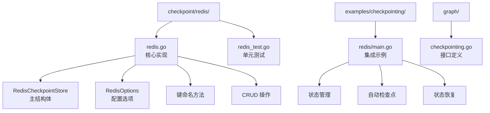
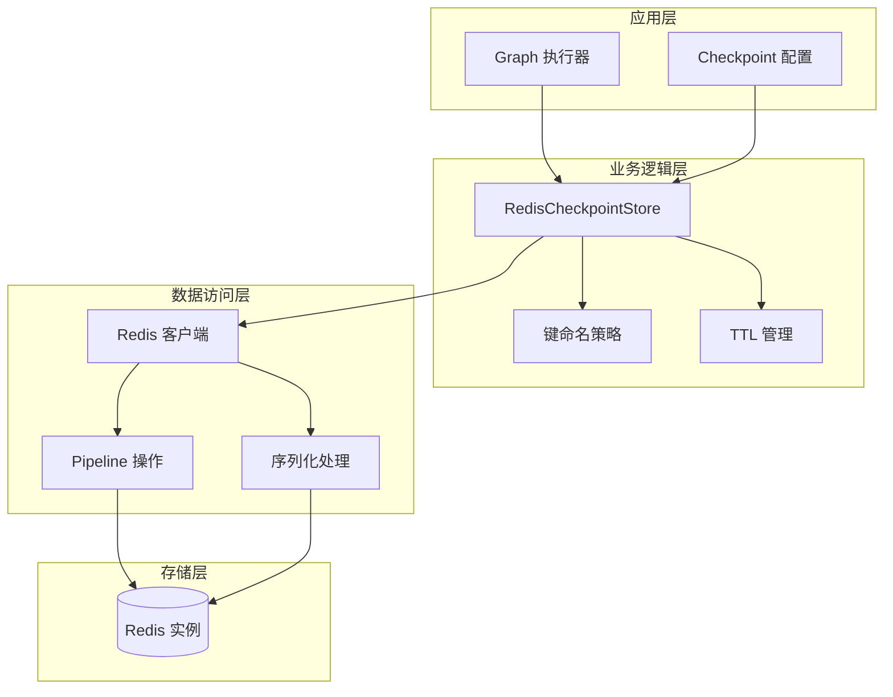
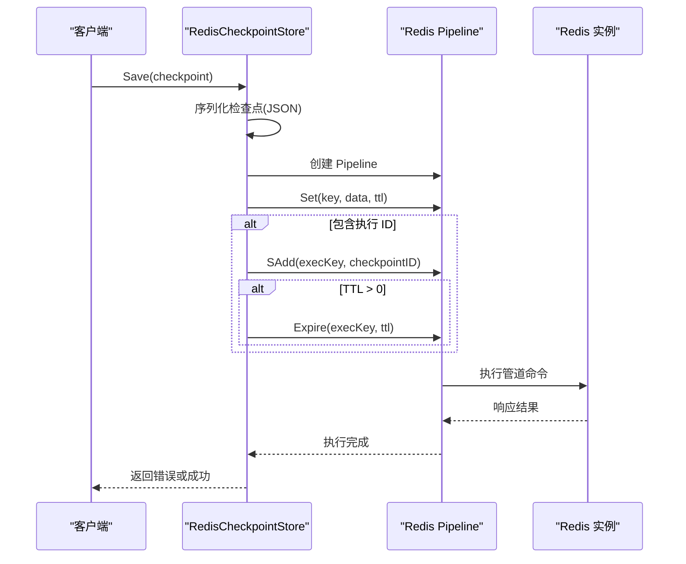
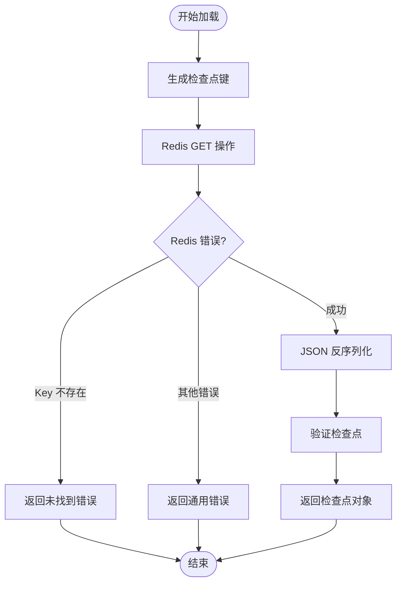
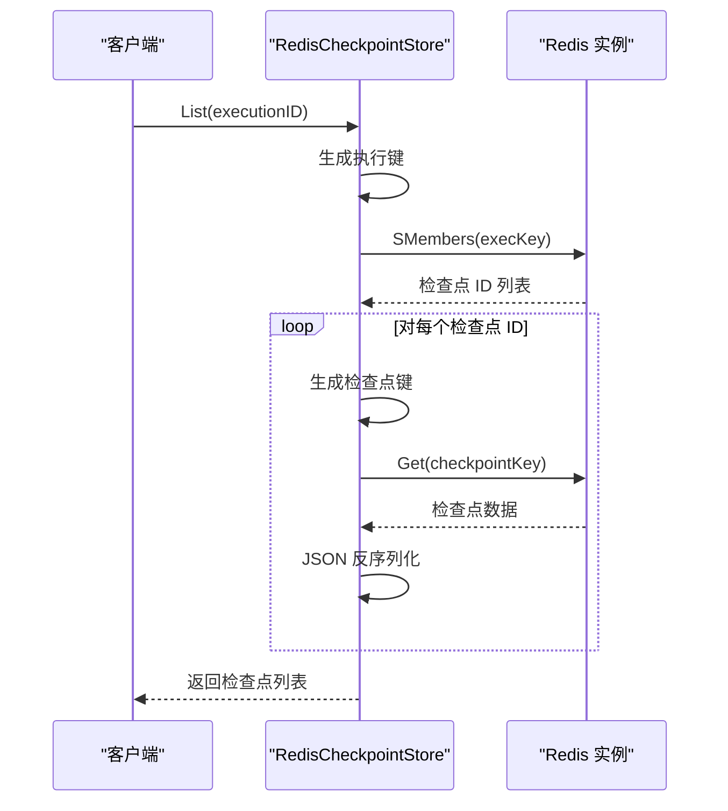
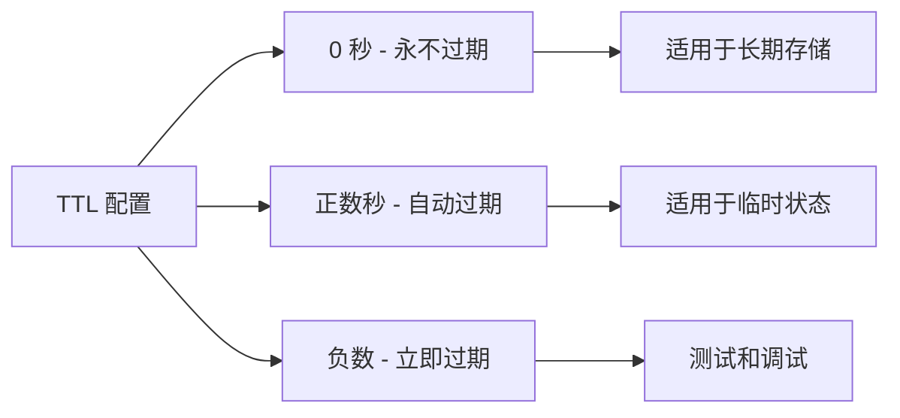
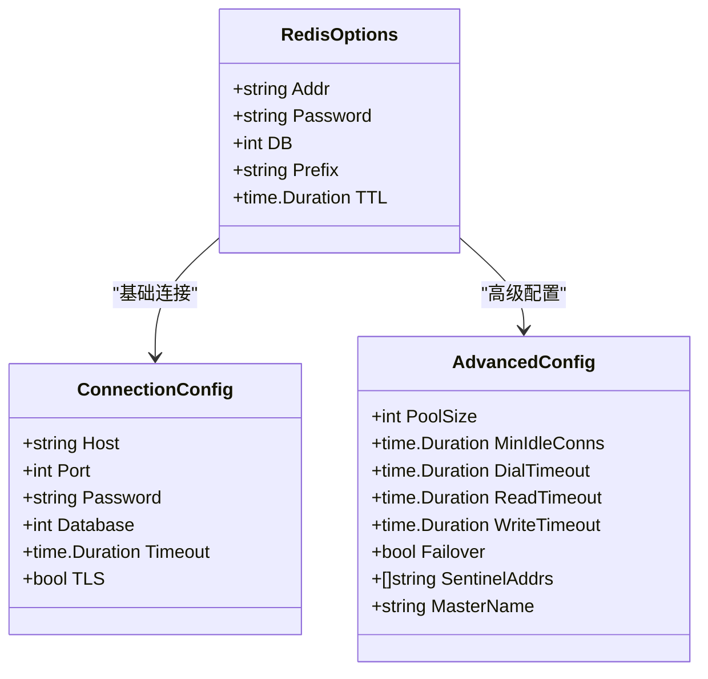
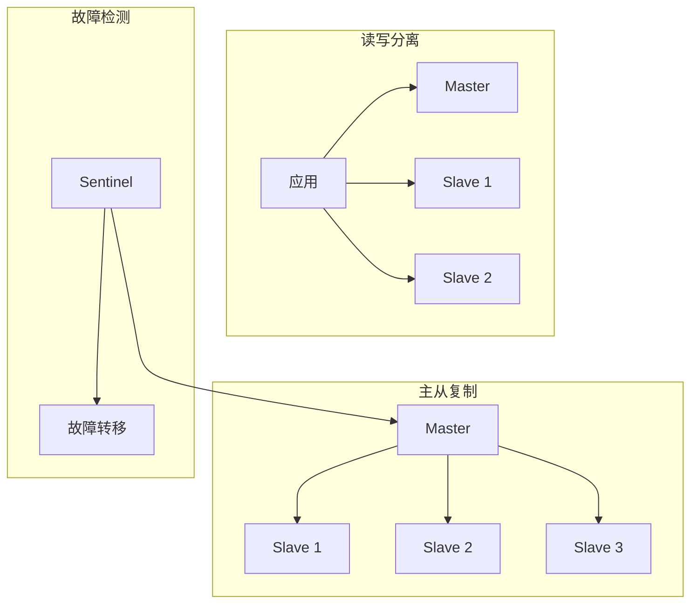
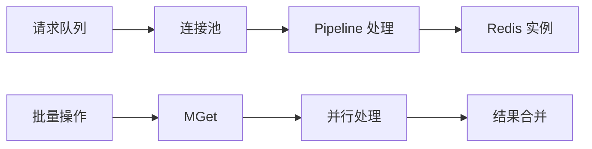
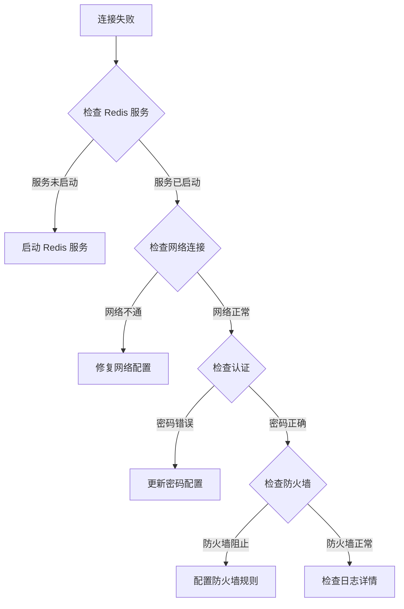

# Redis 检查点存储

<cite>
**本文档中引用的文件**
- [checkpoint/redis/redis.go](file://checkpoint/redis/redis.go)
- [examples/checkpointing/redis/main.go](file://examples/checkpointing/redis/main.go)
- [checkpoint/redis/redis_test.go](file://checkpoint/redis/redis_test.go)
- [go.mod](file://go.mod)
- [graph/checkpointing.go](file://graph/checkpointing.go)
</cite>

## 目录
1. [简介](#简介)
2. [项目结构](#项目结构)
3. [核心组件](#核心组件)
4. [架构概览](#架构概览)
5. [详细组件分析](#详细组件分析)
6. [键命名策略](#键命名策略)
7. [TTL 管理](#ttl-管理)
8. [序列化方式](#序列化方式)
9. [配置指南](#配置指南)
10. [性能考虑](#性能考虑)
11. [故障排除指南](#故障排除指南)
12. [结论](#结论)

## 简介

Redis 检查点存储是 LangGraphGo 框架中的高性能状态持久化解决方案，专为临时状态存储和高吞吐量工作流设计。该实现提供了低延迟、高并发的检查点管理功能，支持自动序列化、TTL 管理和可扩展的键命名策略。

Redis 作为检查点后端的优势在于其内存存储特性，能够提供毫秒级的读写延迟，特别适合需要快速状态恢复和临时数据存储的场景。该实现不仅支持单机 Redis，还具备良好的扩展性，可以适应分布式环境中的各种部署需求。

## 项目结构

Redis 检查点存储的项目结构清晰地分离了核心实现、测试代码和示例应用：



**图表来源**
- [checkpoint/redis/redis.go](file://checkpoint/redis/redis.go#L1-L212)
- [examples/checkpointing/redis/main.go](file://examples/checkpointing/redis/main.go#L1-L145)

**章节来源**
- [checkpoint/redis/redis.go](file://checkpoint/redis/redis.go#L1-L212)
- [examples/checkpointing/redis/main.go](file://examples/checkpointing/redis/main.go#L1-L145)

## 核心组件

Redis 检查点存储的核心组件包括 RedisCheckpointStore 结构体、RedisOptions 配置选项和一系列关键方法。这些组件协同工作，提供完整的检查点管理功能。

### 主要结构体

RedisCheckpointStore 结构体是整个实现的核心，包含 Redis 客户端实例、键前缀和 TTL 设置：

```mermaid
classDiagram
class RedisCheckpointStore {
+client *redis.Client
+prefix string
+ttl time.Duration
+Save(ctx, checkpoint) error
+Load(ctx, id) *Checkpoint
+List(ctx, execID) []*Checkpoint
+Delete(ctx, id) error
+Clear(ctx, execID) error
-checkpointKey(id) string
-executionKey(id) string
}
class RedisOptions {
+Addr string
+Password string
+DB int
+Prefix string
+TTL time.Duration
}
class Checkpoint {
+ID string
+NodeName string
+State map[string]interface{}
+Timestamp time.Time
+Version int
+Metadata map[string]interface{}
}
RedisCheckpointStore --> RedisOptions : "使用"
RedisCheckpointStore --> Checkpoint : "管理"
```

**图表来源**
- [checkpoint/redis/redis.go](file://checkpoint/redis/redis.go#L14-L18)
- [checkpoint/redis/redis.go](file://checkpoint/redis/redis.go#L20-L27)

**章节来源**
- [checkpoint/redis/redis.go](file://checkpoint/redis/redis.go#L14-L47)

## 架构概览

Redis 检查点存储采用分层架构设计，从上到下包括接口层、业务逻辑层和数据访问层：



**图表来源**
- [checkpoint/redis/redis.go](file://checkpoint/redis/redis.go#L57-L84)
- [checkpoint/redis/redis.go](file://checkpoint/redis/redis.go#L86-L103)

## 详细组件分析

### RedisCheckpointStore 实现

RedisCheckpointStore 是检查点存储的核心实现，提供了完整的 CRUD 操作和高级功能：

#### 保存操作 (Save)

保存操作使用 Redis Pipeline 来确保原子性和性能：



**图表来源**
- [checkpoint/redis/redis.go](file://checkpoint/redis/redis.go#L57-L84)

#### 加载操作 (Load)

加载操作负责从 Redis 中检索检查点数据：



**图表来源**
- [checkpoint/redis/redis.go](file://checkpoint/redis/redis.go#L86-L103)

#### 列表操作 (List)

列表操作支持按执行 ID 查找所有相关的检查点：



**图表来源**
- [checkpoint/redis/redis.go](file://checkpoint/redis/redis.go#L105-L155)

**章节来源**
- [checkpoint/redis/redis.go](file://checkpoint/redis/redis.go#L57-L181)

## 键命名策略

Redis 检查点存储采用了精心设计的键命名策略，确保数据的组织性和查询效率：

### 检查点键格式

检查点键采用以下格式：
```
{prefix}checkpoint:{checkpointID}
```

其中：
- `{prefix}`：可配置的键前缀，默认为 "langgraph:"
- `checkpoint:`：固定前缀标识
- `{checkpointID}`：唯一的检查点标识符

### 执行键格式

执行键用于索引特定执行的所有检查点：
```
{prefix}execution:{executionID}:checkpoints
```

这种设计的优势包括：

1. **命名空间隔离**：通过前缀实现不同应用或环境的键隔离
2. **高效查询**：执行键支持快速查找特定执行的所有检查点
3. **自动清理**：执行完成后可以批量删除相关键
4. **可预测性**：键格式固定，便于调试和维护

**章节来源**
- [checkpoint/redis/redis.go](file://checkpoint/redis/redis.go#L49-L55)

## TTL 管理

Redis 检查点存储提供了灵活的 TTL（生存时间）管理机制，支持自动过期和手动控制：

### TTL 配置选项

RedisOptions 中的 TTL 字段控制检查点的过期时间：



### TTL 管理策略

1. **检查点 TTL**：直接设置在 SET 操作中
2. **执行键 TTL**：当存在 TTL 时，自动为执行键设置相同的过期时间
3. **智能过期**：避免过期检查点影响正在使用的执行

### 内存优化建议

为了最大化内存使用效率：

- **合理设置 TTL**：根据业务需求设置合适的过期时间
- **监控内存使用**：定期检查 Redis 内存占用
- **使用内存淘汰策略**：配置适当的 LRU 策略

**章节来源**
- [checkpoint/redis/redis.go](file://checkpoint/redis/redis.go#L26-L27)
- [checkpoint/redis/redis.go](file://checkpoint/redis/redis.go#L67-L76)

## 序列化方式

Redis 检查点存储目前使用 JSON 作为默认序列化方式，但具备扩展为其他格式的能力：

### 当前实现


**图表来源**
- [checkpoint/redis/redis.go](file://checkpoint/redis/redis.go#L59-L62)
- [checkpoint/redis/redis.go](file://checkpoint/redis/redis.go#L97-L100)

### 序列化特点

1. **人类可读**：JSON 格式便于调试和数据查看
2. **跨平台兼容**：广泛的语言和工具支持
3. **类型安全**：Go 类型系统保证序列化安全性
4. **压缩友好**：文本格式适合后续的压缩处理

### 扩展可能性

虽然当前实现使用 JSON，但架构设计允许未来扩展为其他序列化格式：

- **MessagePack**：更紧凑的二进制格式
- **Protocol Buffers**：Google 开发的高效序列化
- **Avro**：Apache Avro 数据序列化框架

**章节来源**
- [checkpoint/redis/redis.go](file://checkpoint/redis/redis.go#L59-L100)

## 配置指南

### 基础配置

Redis 检查点存储的基础配置包括连接参数和基本选项：



**图表来源**
- [checkpoint/redis/redis.go](file://checkpoint/redis/redis.go#L20-L27)

### 连接选项配置

#### 基础连接配置

| 配置项 | 类型 | 默认值 | 说明 |
|--------|------|--------|------|
| Addr | string | localhost:6379 | Redis 服务器地址 |
| Password | string | "" | 认证密码（可选） |
| DB | int | 0 | 数据库编号 |
| Prefix | string | "langgraph:" | 键前缀 |
| TTL | time.Duration | 0 | 检查点过期时间 |

#### 性能优化配置

| 配置项 | 推荐值 | 说明 |
|--------|--------|------|
| PoolSize | CPU 核数 × 2 | 连接池大小 |
| MinIdleConns | CPU 核数 | 最小空闲连接数 |
| DialTimeout | 5s | 连接超时时间 |
| ReadTimeout | 3s | 读取超时时间 |
| WriteTimeout | 3s | 写入超时时间 |

### 分布式环境配置

#### Redis 集群支持

虽然当前实现主要针对单机 Redis，但可以通过以下方式支持集群：

1. **客户端配置**：使用支持集群的 Redis 客户端
2. **键分布**：确保检查点键分布在不同的哈希槽
3. **故障转移**：配置哨兵或集群模式的自动故障转移

#### 高可用配置



**章节来源**
- [checkpoint/redis/redis.go](file://checkpoint/redis/redis.go#L29-L47)
- [examples/checkpointing/redis/main.go](file://examples/checkpointing/redis/main.go#L32-L36)

## 性能考虑

### 延迟优化

Redis 检查点存储在设计时充分考虑了延迟优化：

1. **Pipeline 操作**：批量执行多个 Redis 命令
2. **连接复用**：使用连接池减少连接开销
3. **内存存储**：数据完全存储在内存中
4. **零拷贝**：最小化数据序列化/反序列化开销

### 吞吐量优化



### 内存使用优化

1. **TTL 管理**：自动清理过期数据
2. **键前缀**：便于批量清理和监控
3. **数据压缩**：考虑使用压缩算法
4. **内存监控**：定期检查内存使用情况

### 并发处理

Redis 检查点存储支持高并发访问：

- **线程安全**：Redis 客户端是线程安全的
- **Pipeline 并发**：多个 Pipeline 可以同时执行
- **连接池**：支持多个并发连接

## 故障排除指南

### 常见问题及解决方案

#### 连接问题



#### 性能问题

1. **高延迟**：
   - 检查网络延迟
   - 优化 Redis 配置
   - 考虑本地缓存

2. **高内存使用**：
   - 调整 TTL 设置
   - 监控键数量
   - 优化键前缀策略

3. **连接池耗尽**：
   - 增加连接池大小
   - 检查连接泄漏
   - 优化并发控制

#### 数据一致性问题

1. **检查点丢失**：
   - 检查 TTL 设置
   - 验证 Redis 持久化配置
   - 监控 Redis 内存使用

2. **数据损坏**：
   - 验证序列化格式
   - 检查网络传输
   - 实施数据校验

### 监控指标

推荐监控以下关键指标：

| 指标类别 | 具体指标 | 监控方法 |
|----------|----------|----------|
| 连接 | 连接数、连接池使用率 | Redis INFO 命令 |
| 性能 | 延迟、QPS | 应用日志 |
| 内存 | 使用量、增长率 | Redis MEMORY 命令 |
| 错误 | 连接失败、超时 | 应用错误日志 |

**章节来源**
- [examples/checkpointing/redis/main.go](file://examples/checkpointing/redis/main.go#L100-L105)

## 结论

Redis 检查点存储为 LangGraphGo 提供了一个高性能、可靠的临时状态存储解决方案。其设计充分考虑了现代分布式应用的需求，在性能、可扩展性和易用性之间取得了良好平衡。

### 主要优势

1. **高性能**：内存存储提供毫秒级延迟
2. **高并发**：支持大量并发访问
3. **灵活配置**：丰富的配置选项满足不同需求
4. **易于集成**：简洁的 API 设计
5. **可靠稳定**：经过充分测试验证

### 适用场景

- **临时状态存储**：短期运行的工作流
- **高吞吐量应用**：需要快速状态恢复的场景
- **分布式系统**：需要共享状态的微服务架构
- **实时应用**：对延迟敏感的应用程序

### 未来发展

Redis 检查点存储具备良好的扩展性，未来可以考虑以下改进方向：

1. **支持更多序列化格式**：如 MessagePack、Protocol Buffers
2. **增强集群支持**：更好的 Redis 集群和哨兵支持
3. **监控和诊断**：内置的性能监控和诊断工具
4. **持久化增强**：更灵活的数据持久化策略

通过合理的配置和使用，Redis 检查点存储能够为您的应用程序提供稳定、高效的检查点管理服务。