# SQLite 检查点存储

<cite>
**本文档中引用的文件**
- [checkpoint/sqlite/sqlite.go](file://checkpoint/sqlite/sqlite.go)
- [examples/checkpointing/sqlite/main.go](file://examples/checkpointing/sqlite/main.go)
- [graph/checkpointing.go](file://graph/checkpointing.go)
- [checkpoint/sqlite/sqlite_test.go](file://checkpoint/sqlite/sqlite_test.go)
- [examples/checkpointing/main.go](file://examples/checkpointing/main.go)
</cite>

## 目录
1. [简介](#简介)
2. [项目结构](#项目结构)
3. [核心组件](#核心组件)
4. [架构概览](#架构概览)
5. [详细组件分析](#详细组件分析)
6. [性能考虑](#性能考虑)
7. [使用示例](#使用示例)
8. [故障排除指南](#故障排除指南)
9. [结论](#结论)

## 简介

SQLite 检查点存储是 LangGraphGo 框架中的一个轻量级持久化解决方案，专为资源受限环境、本地开发和边缘设备场景设计。它基于 SQLite 文件数据库，提供了完整的检查点管理功能，包括状态序列化、并发控制和数据完整性保证。

该实现采用文件数据库的打开模式，支持 WAL（Write-Ahead Logging）模式配置，具有以下核心特性：
- 轻量级部署，无需外部数据库服务器
- 自动化的状态序列化和反序列化
- 基于索引的高效查询性能
- 完整的 CRUD 操作支持
- 并发写入的安全保障

## 项目结构

SQLite 检查点存储在 LangGraphGo 项目中的组织结构如下：

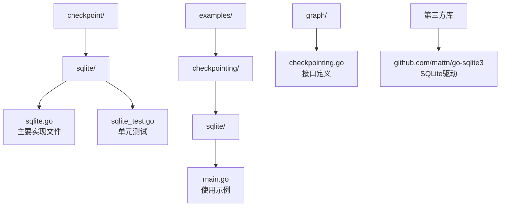

**图表来源**
- [checkpoint/sqlite/sqlite.go](file://checkpoint/sqlite/sqlite.go#L1-L236)
- [examples/checkpointing/sqlite/main.go](file://examples/checkpointing/sqlite/main.go#L1-L147)

**章节来源**
- [checkpoint/sqlite/sqlite.go](file://checkpoint/sqlite/sqlite.go#L1-L236)
- [examples/checkpointing/sqlite/main.go](file://examples/checkpointing/sqlite/main.go#L1-L147)

## 核心组件

SQLite 检查点存储包含以下核心组件：

### 主要数据结构

| 组件 | 类型 | 描述 | 默认值 |
|------|------|------|--------|
| SqliteCheckpointStore | 结构体 | SQLite 检查点存储实现 | - |
| SqliteOptions | 结构体 | SQLite 连接配置选项 | Path: "", TableName: "checkpoints" |
| Checkpoint | 结构体 | 检查点数据模型 | 包含状态、元数据、时间戳等 |

### 关键方法

| 方法名 | 功能描述 | 参数类型 | 返回值 |
|--------|----------|----------|--------|
| NewSqliteCheckpointStore | 创建新的 SQLite 检查点存储 | SqliteOptions | *SqliteCheckpointStore, error |
| InitSchema | 初始化数据库表结构 | context.Context | error |
| Save | 保存检查点 | *graph.Checkpoint | error |
| Load | 加载指定检查点 | string | *graph.Checkpoint, error |
| List | 列出执行的所有检查点 | string | []*graph.Checkpoint, error |
| Delete | 删除指定检查点 | string | error |
| Clear | 清除执行的所有检查点 | string | error |
| Close | 关闭数据库连接 | - | error |

**章节来源**
- [checkpoint/sqlite/sqlite.go](file://checkpoint/sqlite/sqlite.go#L13-L236)

## 架构概览

SQLite 检查点存储的整体架构采用分层设计，确保了良好的可维护性和扩展性：

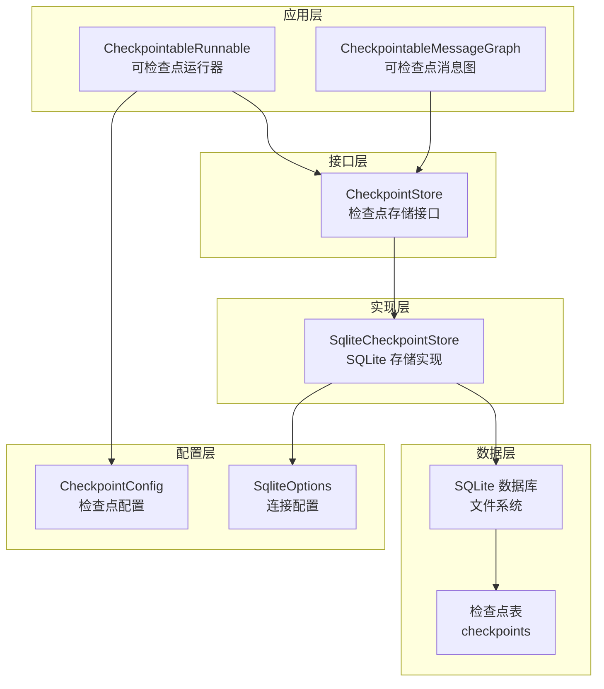

**图表来源**
- [graph/checkpointing.go](file://graph/checkpointing.go#L22-L38)
- [checkpoint/sqlite/sqlite.go](file://checkpoint/sqlite/sqlite.go#L13-L17)

## 详细组件分析

### SQLite 检查点存储实现

#### 数据库连接管理

SQLite 检查点存储通过标准的 Go database/sql 包与 SQLite 数据库交互。连接建立时采用以下模式：

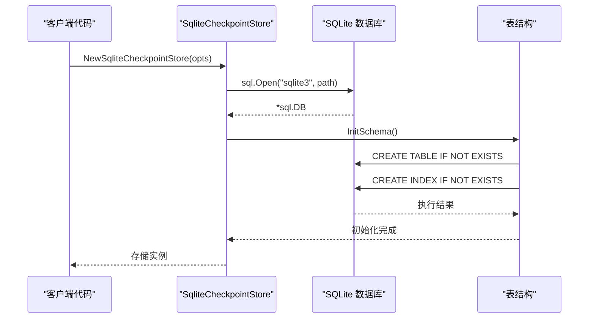

**图表来源**
- [checkpoint/sqlite/sqlite.go](file://checkpoint/sqlite/sqlite.go#L26-L47)

#### 表结构设计

SQLite 检查点存储使用简洁而高效的表结构：

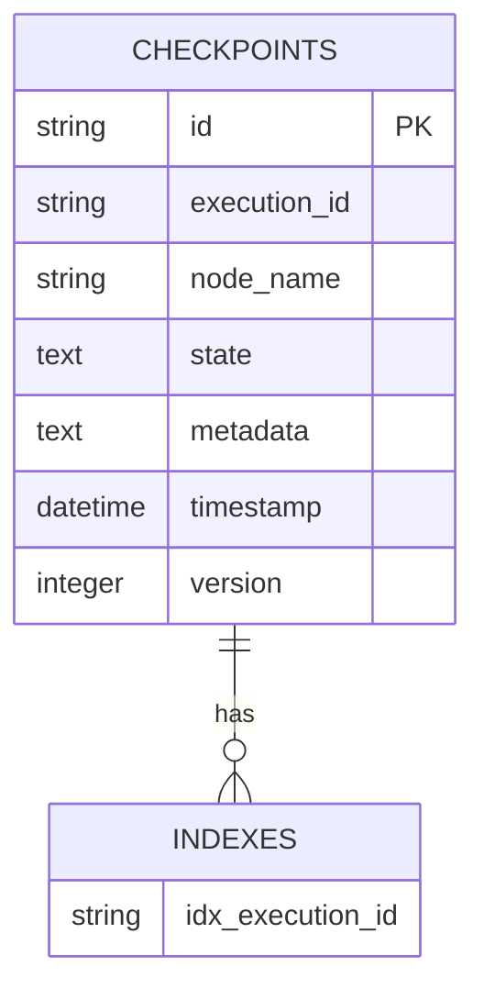

**图表来源**
- [checkpoint/sqlite/sqlite.go](file://checkpoint/sqlite/sqlite.go#L52-L62)

#### 状态序列化机制

检查点状态通过 JSON 序列化进行持久化存储：

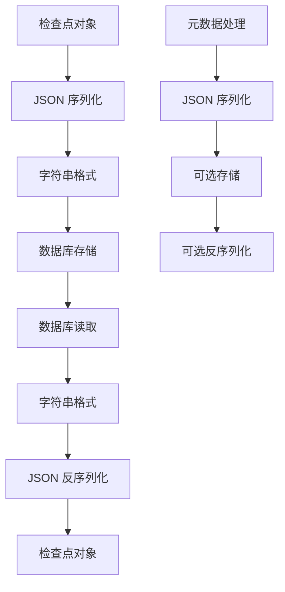

**图表来源**
- [checkpoint/sqlite/sqlite.go](file://checkpoint/sqlite/sqlite.go#L78-L119)

#### 并发控制策略

SQLite 通过内置的事务机制提供并发安全保障：

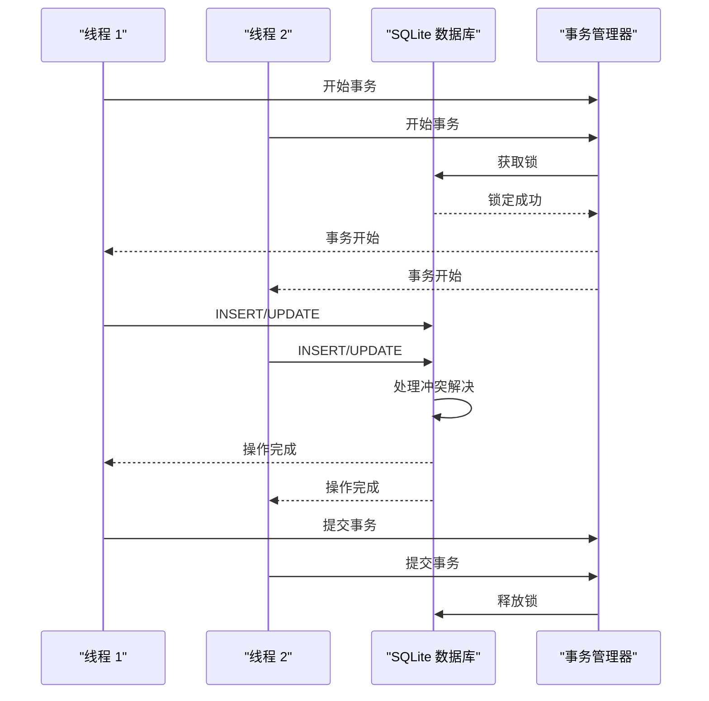

**图表来源**
- [checkpoint/sqlite/sqlite.go](file://checkpoint/sqlite/sqlite.go#L94-L104)

**章节来源**
- [checkpoint/sqlite/sqlite.go](file://checkpoint/sqlite/sqlite.go#L13-L236)

### 使用示例分析

#### 基本配置流程

示例代码展示了从初始化到状态恢复的完整生命周期：

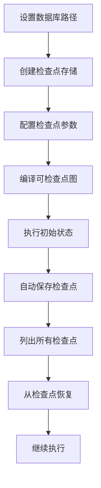

**图表来源**
- [examples/checkpointing/sqlite/main.go](file://examples/checkpointing/sqlite/main.go#L28-L146)

#### 状态恢复机制

状态恢复过程涉及 JSON 反序列化和类型转换：

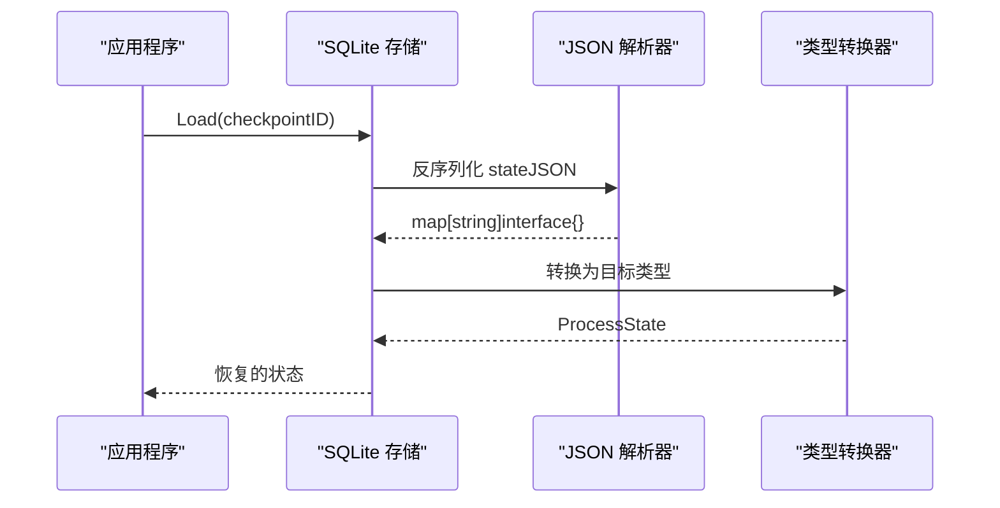

**图表来源**
- [examples/checkpointing/sqlite/main.go](file://examples/checkpointing/sqlite/main.go#L128-L144)

**章节来源**
- [examples/checkpointing/sqlite/main.go](file://examples/checkpointing/sqlite/main.go#L1-L147)

## 性能考虑

### 并发写入限制

SQLite 在并发写入方面存在以下限制：

| 特性 | 限制 | 影响 | 解决方案 |
|------|------|------|----------|
| 同时写入 | 最多 1 个写入者 | 高并发场景下的性能瓶颈 | 使用 WAL 模式优化 |
| 死锁风险 | 表级锁定 | 长时间运行的事务可能导致阻塞 | 合理设计事务范围 |
| 锁竞争 | 全局锁机制 | 多线程访问时的性能下降 | 减少事务持续时间 |

### 性能优化建议

#### WAL 模式配置

虽然当前实现未显式配置 WAL 模式，但可以通过以下方式启用：

```go
// 推荐的 WAL 模式配置
db, err := sql.Open("sqlite3", "file:mydb.sqlite?_journal_mode=WAL")
```

#### 索引优化

当前实现已包含执行 ID 索引，可进一步优化：

```sql
-- 添加复合索引以加速查询
CREATE INDEX IF NOT EXISTS idx_execution_timestamp ON checkpoints(execution_id, timestamp);
```

#### 批量操作

对于大量检查点的场景，建议批量处理：

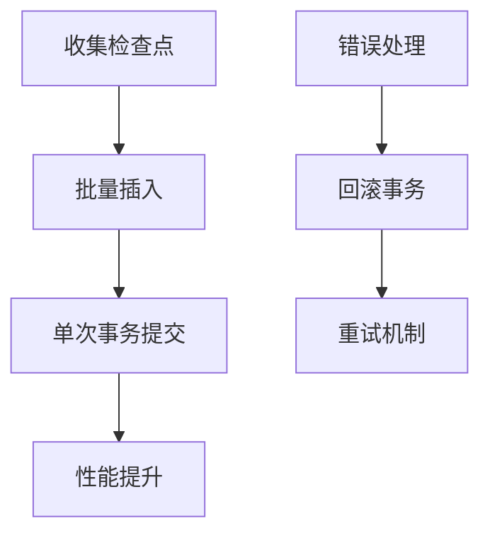

### 内存使用优化

| 优化项 | 当前实现 | 建议改进 | 效果 |
|--------|----------|----------|------|
| JSON 缓冲区 | 每次序列化重新分配 | 使用缓冲池 | 减少 GC 压力 |
| 连接池 | 单一连接 | 实现连接池 | 提高并发性能 |
| 查询缓存 | 无缓存 | 实现查询缓存 | 减少数据库访问 |

**章节来源**
- [checkpoint/sqlite/sqlite.go](file://checkpoint/sqlite/sqlite.go#L50-L70)

## 使用示例

### 基础使用模式

以下是 SQLite 检查点存储的基本使用模式：

#### 初始化配置

```go
// 基本配置示例
store, err := sqlite.NewSqliteCheckpointStore(sqlite.SqliteOptions{
    Path:      "./checkpoints.db",
    TableName: "example_checkpoints",
})
if err != nil {
    log.Fatal(err)
}
defer store.Close()
```

#### 高级配置选项

```go
// 高级配置示例
config := graph.CheckpointConfig{
    Store:          store,
    AutoSave:       true,
    SaveInterval:   2 * time.Second,
    MaxCheckpoints: 5,
}
```

### 文件路径管理

#### 跨平台兼容性

SQLite 支持多种文件路径格式：

| 平台 | 路径格式 | 示例 | 注意事项 |
|------|----------|------|----------|
| Windows | 绝对路径 | `C:\data\checkpoints.db` | 使用双反斜杠转义 |
| Linux/macOS | 相对路径 | `./data/checkpoints.db` | 相对路径相对于工作目录 |
| 内存数据库 | `:memory:` | `:memory:` | 临时数据，进程结束后消失 |

#### 路径安全考虑

```go
// 安全的路径处理
func safePath(baseDir, fileName string) string {
    // 验证路径安全性
    path := filepath.Join(baseDir, fileName)
    // 防止路径遍历攻击
    if strings.HasPrefix(path, "..") {
        return filepath.Join(baseDir, "default.db")
    }
    return path
}
```

### 备份策略

#### 自动备份机制

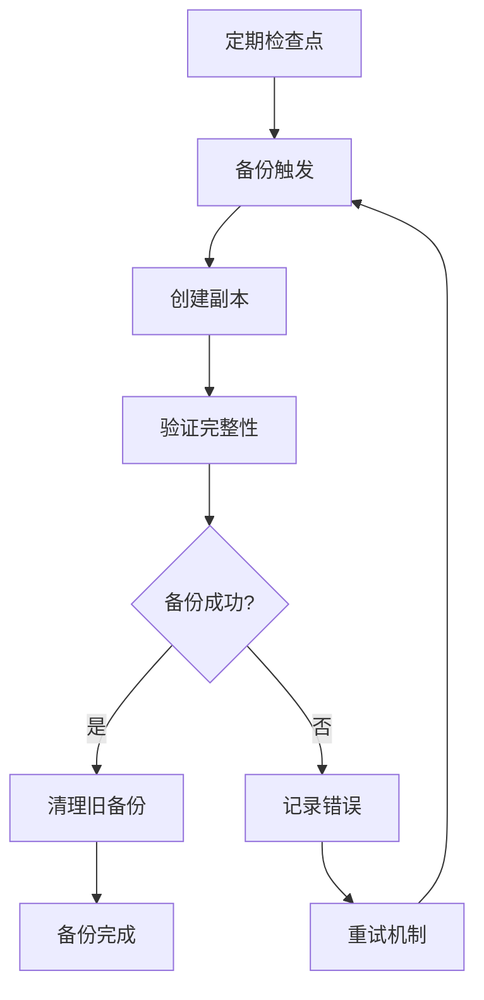

#### 备份最佳实践

| 策略 | 实现方式 | 优点 | 缺点 |
|------|----------|------|------|
| 增量备份 | 基于时间戳 | 节省存储空间 | 恢复复杂度高 |
| 完整备份 | 文件复制 | 恢复简单 | 占用更多空间 |
| 压缩备份 | gzip 压缩 | 节省存储空间 | CPU 开销增加 |

### 错误处理模式

#### 常见错误类型

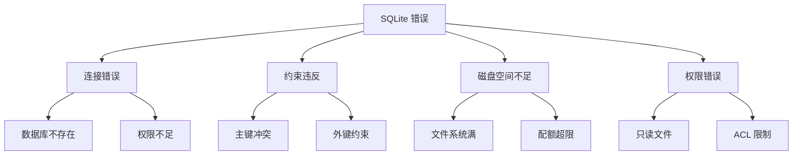

#### 错误恢复策略

```go
// 错误恢复示例
func robustSave(store *sqlite.SqliteCheckpointStore, checkpoint *graph.Checkpoint) error {
    maxRetries := 3
    for i := 0; i < maxRetries; i++ {
        err := store.Save(context.Background(), checkpoint)
        if err == nil {
            return nil
        }
        
        if isRetryableError(err) {
            time.Sleep(time.Duration(i+1) * time.Second)
            continue
        }
        
        return err
    }
    return fmt.Errorf("failed after %d retries", maxRetries)
}
```

**章节来源**
- [examples/checkpointing/sqlite/main.go](file://examples/checkpointing/sqlite/main.go#L21-L40)

## 故障排除指南

### 常见问题诊断

#### 数据库连接问题

| 问题症状 | 可能原因 | 解决方案 |
|----------|----------|----------|
| "unable to open database" | 文件权限不足 | 检查文件权限，确保可读写 |
| "database is locked" | 并发访问冲突 | 使用 WAL 模式，减少事务持续时间 |
| "disk I/O error" | 磁盘空间不足 | 清理磁盘空间，检查磁盘健康状态 |

#### 性能问题排查

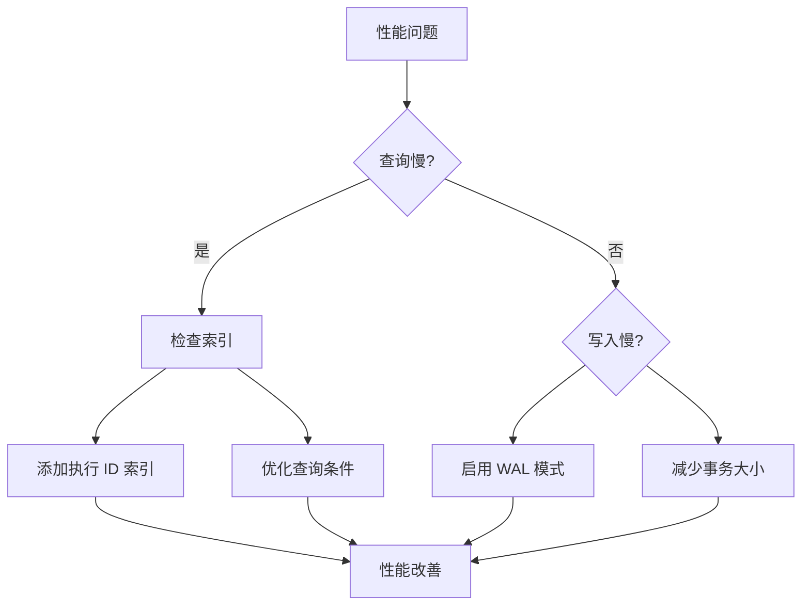

#### 数据一致性问题

| 问题类型 | 症状 | 检测方法 | 修复方案 |
|----------|------|----------|----------|
| 数据损坏 | 查询返回错误 | 校验和检查 | 从备份恢复 |
| 主键冲突 | 插入失败 | 错误日志分析 | 检查唯一性约束 |
| 级联删除 | 数据丢失 | 审计日志追踪 | 恢复删除的数据 |

### 监控和维护

#### 性能监控指标

```go
// 性能监控示例
type SQLiteMonitor struct {
    db *sql.DB
    metrics map[string]prometheus.Counter
}

func (m *SQLiteMonitor) RecordOperation(operation string, duration time.Duration) {
    if counter, exists := m.metrics[operation]; exists {
        counter.Inc()
    }
    // 记录响应时间
    prometheus.Histogram.WithLabelValues(operation).Observe(duration.Seconds())
}
```

#### 定期维护任务

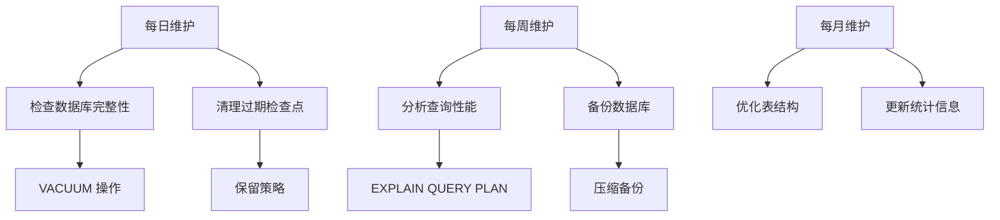

**章节来源**
- [checkpoint/sqlite/sqlite_test.go](file://checkpoint/sqlite/sqlite_test.go#L12-L61)

## 结论

SQLite 检查点存储为 LangGraphGo 提供了一个轻量级、可靠的持久化解决方案，特别适合以下场景：

### 优势总结

1. **部署简单**：无需外部数据库服务器，单文件即可运行
2. **资源友好**：内存占用小，适合边缘设备和嵌入式系统
3. **数据安全**：内置事务支持，保证数据一致性
4. **跨平台**：支持所有主流操作系统
5. **成熟稳定**：经过长期验证的数据库技术

### 适用场景

| 场景类型 | 适用性 | 推荐理由 |
|----------|--------|----------|
| 本地开发 | 高 | 快速原型开发，无需配置外部服务 |
| 边缘计算 | 高 | 资源受限，需要本地数据持久化 |
| 小型应用 | 高 | 单机部署，数据量适中 |
| 测试环境 | 高 | 快速搭建，易于清理 |
| 原型验证 | 高 | 最小化基础设施投入 |

### 局限性与替代方案

#### 局限性

1. **并发写入限制**：单文件写入的竞争限制
2. **大数据量性能**：随着数据增长，查询性能可能下降
3. **集群支持**：不支持多节点共享数据

#### 替代方案

| 方案 | 优势 | 适用场景 |
|------|------|----------|
| PostgreSQL | 高并发，强一致性 | 生产环境，高并发场景 |
| Redis | 内存存储，超高性能 | 缓存场景，临时数据 |
| 文件存储 | 简单直接 | 特殊需求，自定义格式 |

### 最佳实践建议

1. **合理规划存储**：根据预期数据量选择合适的存储策略
2. **定期备份**：建立完善的备份和恢复机制
3. **监控告警**：实施性能监控和异常告警
4. **版本升级**：保持 SQLite 和驱动程序的最新版本
5. **安全防护**：实施适当的文件权限和访问控制

通过遵循这些指导原则，SQLite 检查点存储可以成为 LangGraphGo 应用程序中可靠的数据持久化解决方案，特别是在资源受限和轻量级部署环境中发挥重要作用。