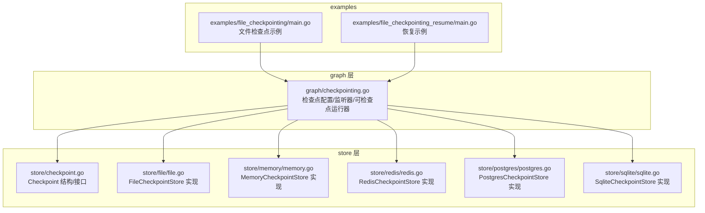
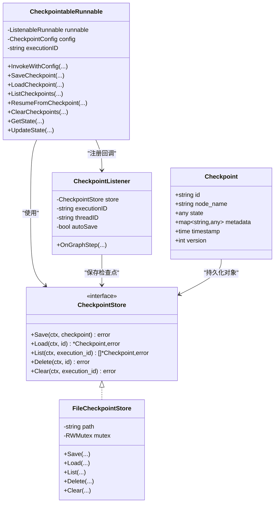
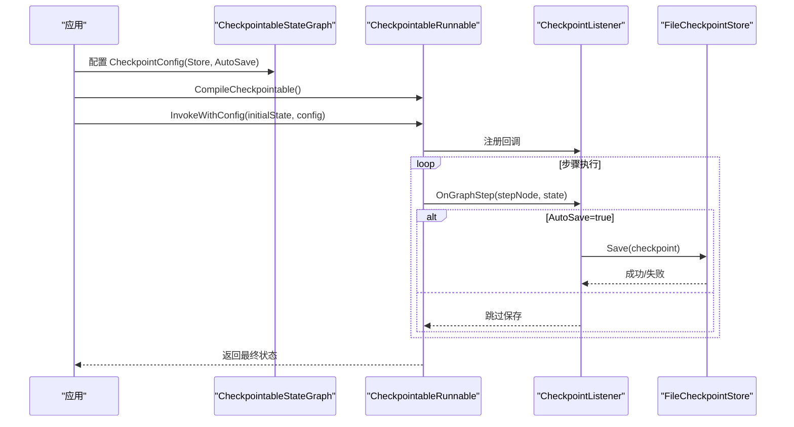
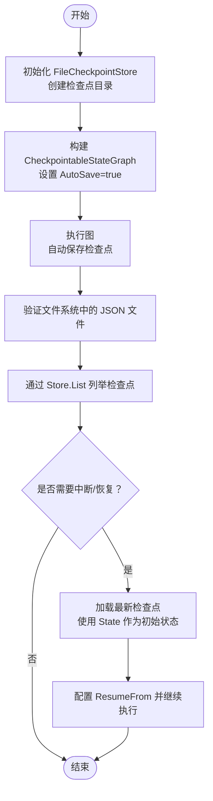
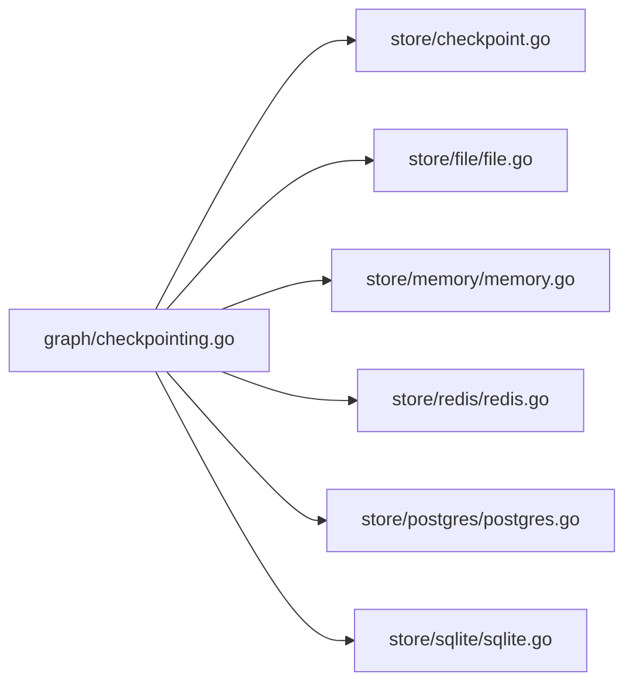

# 文件检查点存储

<cite>
**本文引用的文件**
- [graph/checkpointing.go](file://graph/checkpointing.go)
- [store/checkpoint.go](file://store/checkpoint.go)
- [store/file/file.go](file://store/file/file.go)
- [store/memory/memory.go](file://store/memory/memory.go)
- [store/postgres/postgres.go](file://store/postgres/postgres.go)
- [store/redis/redis.go](file://store/redis/redis.go)
- [store/sqlite/sqlite.go](file://store/sqlite/sqlite.go)
- [examples/file_checkpointing/main.go](file://examples/file_checkpointing/main.go)
- [examples/file_checkpointing/README.md](file://examples/file_checkpointing/README.md)
- [examples/file_checkpointing_resume/main.go](file://examples/file_checkpointing_resume/main.go)
- [examples/file_checkpointing_resume/README.md](file://examples/file_checkpointing_resume/README.md)
- [README.md](file://README.md)
</cite>

## 目录
1. [简介](#简介)
2. [项目结构](#项目结构)
3. [核心组件](#核心组件)
4. [架构总览](#架构总览)
5. [组件详解](#组件详解)
6. [依赖关系分析](#依赖关系分析)
7. [性能考量](#性能考量)
8. [故障排查指南](#故障排查指南)
9. [结论](#结论)
10. [附录](#附录)

## 简介
本文件聚焦“文件检查点存储”，系统性梳理 LangGraphGo 中基于文件系统的检查点持久化能力，包括：
- 检查点数据模型与接口定义
- 文件存储实现（序列化、并发安全、列表与清理）
- 图执行与自动保存机制
- 示例用法与恢复流程
- 与其他存储后端（内存、Redis、PostgreSQL、SQLite）的对比与迁移路径

该能力使工作流在中断或重启后可从最近状态恢复，支持调试、审计与生产级可靠性。

## 项目结构
围绕“文件检查点存储”的关键目录与文件如下：
- graph 层：定义检查点配置、监听器、可检查点运行器与状态快照等
- store 层：统一的 CheckpointStore 接口与多种实现（内存、文件、Redis、PostgreSQL、SQLite）
- examples：演示文件检查点的创建、保存、列出与恢复

图表来源
- [graph/checkpointing.go](file://graph/checkpointing.go#L1-L200)
- [store/checkpoint.go](file://store/checkpoint.go#L1-L35)
- [store/file/file.go](file://store/file/file.go#L1-L168)
- [store/memory/memory.go](file://store/memory/memory.go#L1-L101)
- [store/redis/redis.go](file://store/redis/redis.go#L1-L211)
- [store/postgres/postgres.go](file://store/postgres/postgres.go#L1-L250)
- [store/sqlite/sqlite.go](file://store/sqlite/sqlite.go#L1-L241)
- [examples/file_checkpointing/main.go](file://examples/file_checkpointing/main.go#L1-L115)
- [examples/file_checkpointing_resume/main.go](file://examples/file_checkpointing_resume/main.go#L1-L172)

章节来源
- [README.md](file://README.md#L35-L55)

## 核心组件
- Checkpoint 数据模型：包含唯一标识、节点名、状态、元数据、时间戳与版本号
- CheckpointStore 接口：统一的 Save、Load、List、Delete、Clear 能力
- FileCheckpointStore：基于本地文件系统，使用 JSON 序列化，提供互斥锁保证并发安全
- 可检查点运行器：在图执行过程中自动保存检查点，支持手动保存、加载、列出、清理与状态查询
- 示例：展示如何初始化文件存储、编译可检查点图、执行并验证检查点文件

章节来源
- [store/checkpoint.go](file://store/checkpoint.go#L1-L35)
- [graph/checkpointing.go](file://graph/checkpointing.go#L1-L120)
- [store/file/file.go](file://store/file/file.go#L1-L168)
- [examples/file_checkpointing/main.go](file://examples/file_checkpointing/main.go#L1-L115)

## 架构总览
文件检查点存储的整体架构由“接口抽象 + 多后端实现 + 运行时集成”构成。运行时通过监听器在每次步骤中自动保存检查点；应用层可通过 API 查询、更新、清理历史。

图表来源
- [store/checkpoint.go](file://store/checkpoint.go#L1-L35)
- [store/file/file.go](file://store/file/file.go#L1-L168)
- [graph/checkpointing.go](file://graph/checkpointing.go#L1-L200)

## 组件详解

### 1) 数据模型与接口
- Checkpoint：用于记录一次执行步骤的状态快照，包含版本号以便顺序管理
- CheckpointStore：定义统一的持久化接口，便于替换不同存储后端

章节来源
- [store/checkpoint.go](file://store/checkpoint.go#L1-L35)

### 2) 文件存储实现（FileCheckpointStore）
- 初始化：确保目标目录存在，失败则返回错误
- 保存：序列化为 JSON，写入以检查点 ID 命名的 .json 文件，使用互斥锁保护
- 加载：读取对应文件，反序列化为 Checkpoint
- 列表：遍历目录下所有 .json 文件，过滤出匹配 execution_id/thread_id/session_id/workflow_id 的条目，并按版本升序排序
- 删除：删除指定 ID 的文件
- 清理：先列出再逐个删除，避免锁升级问题

并发与一致性要点：
- 读写均加锁，避免竞态
- 列表时对每个文件单独读取与校验，跳过不可读或无效文件
- 清理采用“先收集 ID 再删除”的策略，避免在锁范围内调用可能产生递归锁的函数

章节来源
- [store/file/file.go](file://store/file/file.go#L1-L168)

### 3) 运行时集成与自动保存
- CheckpointConfig：配置存储后端、是否自动保存、保存间隔、最大保留数量
- CheckpointableRunnable：封装 ListenableRunnable，注入 CheckpointListener 作为回调
- CheckpointListener.OnGraphStep：当启用自动保存时，在每一步执行后根据当前已存在的检查点计算新版本并保存
- 手动操作：SaveCheckpoint、LoadCheckpoint、ListCheckpoints、ClearCheckpoints
- 状态查询与更新：GetState、UpdateState 支持基于 Schema 的合并与版本号递增

图表来源
- [graph/checkpointing.go](file://graph/checkpointing.go#L70-L200)
- [store/file/file.go](file://store/file/file.go#L33-L121)

章节来源
- [graph/checkpointing.go](file://graph/checkpointing.go#L1-L200)

### 4) 示例：文件检查点与恢复
- 文件检查点示例：创建临时目录，初始化 FileCheckpointStore，构建简单图，开启自动保存，执行并验证生成的 JSON 文件与通过 Store.List 获取的检查点
- 恢复示例：分阶段执行，第一阶段在某步中断；第二阶段通过 Store.List 获取最新检查点，使用其 State 作为初始状态，结合 ResumeFrom 配置继续执行

图表来源
- [examples/file_checkpointing/main.go](file://examples/file_checkpointing/main.go#L1-L115)
- [examples/file_checkpointing_resume/main.go](file://examples/file_checkpointing_resume/main.go#L1-L172)

章节来源
- [examples/file_checkpointing/README.md](file://examples/file_checkpointing/README.md#L1-L49)
- [examples/file_checkpointing_resume/README.md](file://examples/file_checkpointing_resume/README.md#L1-L51)

### 5) 与其他存储后端的对比
- 内存存储：适合测试与短生命周期场景，不跨进程/进程重启
- Redis 存储：适合高并发、低延迟场景，支持 TTL 与集合索引
- PostgreSQL/SQLite：适合需要强一致、可查询、可审计的生产环境

章节来源
- [store/memory/memory.go](file://store/memory/memory.go#L1-L101)
- [store/redis/redis.go](file://store/redis/redis.go#L1-L211)
- [store/postgres/postgres.go](file://store/postgres/postgres.go#L1-L250)
- [store/sqlite/sqlite.go](file://store/sqlite/sqlite.go#L1-L241)

## 依赖关系分析
- graph 层依赖 store 层的 CheckpointStore 接口，具体实现可替换
- FileCheckpointStore 依赖标准库 os、path/filepath、encoding/json 与 sync
- 其他存储实现分别依赖各自客户端库（如 Redis go-redis、PostgreSQL jackc/pgx、SQLite github.com/mattn/go-sqlite3）

图表来源
- [graph/checkpointing.go](file://graph/checkpointing.go#L1-L120)
- [store/checkpoint.go](file://store/checkpoint.go#L1-L35)
- [store/file/file.go](file://store/file/file.go#L1-L168)
- [store/memory/memory.go](file://store/memory/memory.go#L1-L101)
- [store/redis/redis.go](file://store/redis/redis.go#L1-L211)
- [store/postgres/postgres.go](file://store/postgres/postgres.go#L1-L250)
- [store/sqlite/sqlite.go](file://store/sqlite/sqlite.go#L1-L241)

## 性能考量
- 文件存储优点：无需外部依赖、易部署、易审计；缺点：I/O 开销、锁竞争、大规模历史查询效率较低
- 列表与清理：FileCheckpointStore 在 List 中会扫描目录并反序列化多个文件，建议控制最大检查点数量或定期清理
- 并发：读写均加锁，多线程/多进程同时访问同一目录需谨慎，推荐单实例写入或多实例共享存储（如网络盘）
- 版本排序：按版本升序排列，最新在末尾，查询最新检查点时直接取最后一个即可

章节来源
- [store/file/file.go](file://store/file/file.go#L77-L121)

## 故障排查指南
常见问题与定位思路：
- 无法创建目录或写入文件：检查权限与路径是否存在
- 读取不到检查点：确认文件扩展名为 .json，且文件内容可被正确反序列化
- 列表为空：确认 Metadata 中 execution_id/thread_id/session_id/workflow_id 是否与查询条件一致
- 清理失败：查看返回的错误集合，逐个定位失败原因
- 自动保存未生效：确认 CheckpointConfig.AutoSave 已启用，且监听器已注册到回调链

章节来源
- [store/file/file.go](file://store/file/file.go#L21-L51)
- [store/file/file.go](file://store/file/file.go#L53-L75)
- [store/file/file.go](file://store/file/file.go#L77-L121)
- [store/file/file.go](file://store/file/file.go#L123-L168)

## 结论
文件检查点存储为 LangGraphGo 提供了轻量、易用且可审计的持久化方案。通过统一的 CheckpointStore 接口，开发者可在内存、文件、Redis、PostgreSQL、SQLite 之间灵活切换。结合自动保存与手动操作 API，可满足从开发调试到生产恢复的多种需求。对于大规模或高并发场景，建议评估 Redis、PostgreSQL 或 SQLite 的能力与成本。

## 附录
- 快速上手
  - 初始化文件存储并设置为默认后端
  - 构建可检查点图并启用自动保存
  - 执行图并在文件系统中验证 JSON 文件
  - 使用 Store.List 获取检查点，或在中断后恢复执行

章节来源
- [examples/file_checkpointing/main.go](file://examples/file_checkpointing/main.go#L1-L115)
- [examples/file_checkpointing_resume/main.go](file://examples/file_checkpointing_resume/main.go#L1-L172)
- [README.md](file://README.md#L35-L55)