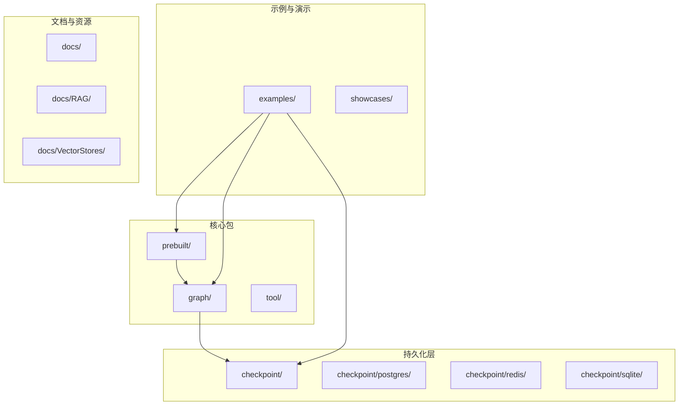
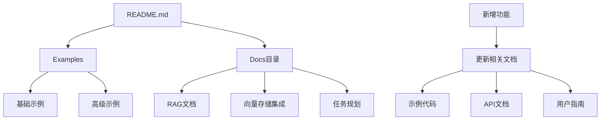
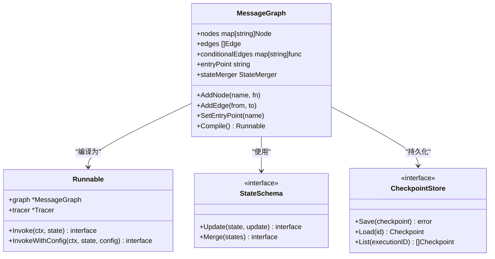
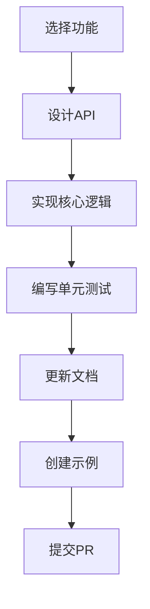
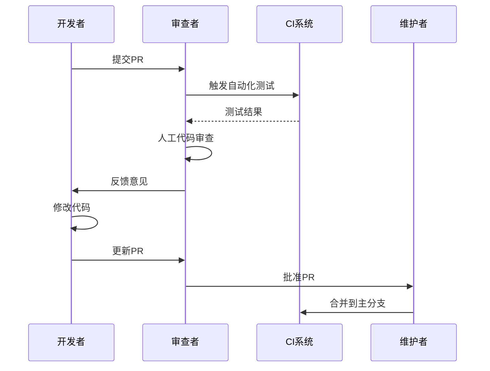

# 贡献指南

<cite>
**本文档中引用的文件**
- [README.md](file://README.md)
- [go.mod](file://go.mod)
- [examples/README.md](file://examples/README.md)
- [examples/basic_example/main.go](file://examples/basic_example/main.go)
- [examples/basic_example/README.md](file://examples/basic_example/README.md)
- [graph/graph.go](file://graph/graph.go)
- [graph/graph_test.go](file://graph/graph_test.go)
- [prebuilt/react_agent.go](file://prebuilt/react_agent.go)
- [checkpoint/postgres/postgres.go](file://checkpoint/postgres/postgres.go)
- [docs/TASKS.md](file://docs/TASKS.md)
- [docs/RAG/RAG.md](file://docs/RAG/RAG.md)
</cite>

## 目录
1. [项目简介](#项目简介)
2. [项目结构概览](#项目结构概览)
3. [贡献流程](#贡献流程)
4. [开发环境设置](#开发环境设置)
5. [代码风格规范](#代码风格规范)
6. [测试要求](#测试要求)
7. [文档更新准则](#文档更新准则)
8. [模块化结构详解](#模块化结构详解)
9. [常见贡献类型](#常见贡献类型)
10. [代码质量与审查标准](#代码质量与审查标准)
11. [故障排除指南](#故障排除指南)
12. [总结](#总结)

## 项目简介

LangGraphGo 是一个强大的工作流编排框架，旨在为 Go 开发者提供类似 Python LangGraph 库的功能。该项目专注于构建可扩展、可维护的智能代理系统，支持并行执行、持久化、高级状态管理、预构建代理和人机交互等核心特性。

### 核心特性
- **并行执行**: 支持扇出/扇入模式的并发节点执行
- **持久化与可靠性**: 提供 Redis、PostgreSQL 和 SQLite 检查点实现
- **高级能力**: 状态架构、智能消息、命令 API、临时通道等
- **开发者体验**: 可视化、人机交互、可观测性、工具集成

**章节来源**
- [README.md](file://README.md#L1-L184)

## 项目结构概览

LangGraphGo 采用模块化的包结构，每个主要功能领域都有独立的包：



**图表来源**
- [go.mod](file://go.mod#L1-L78)
- [examples/README.md](file://examples/README.md#L1-L60)

### 主要包说明

| 包名 | 功能描述 | 关键特性 |
|------|----------|----------|
| `graph/` | 核心图执行引擎 | 并行执行、状态管理、条件边 |
| `prebuilt/` | 预构建代理工厂 | ReAct、CreateAgent、Supervisor |
| `checkpoint/` | 持久化存储接口 | 多数据库支持、自动保存 |
| `tool/` | 工具集成 | Tavily、Exa 搜索工具 |
| `examples/` | 使用示例 | 基础到高级的各种场景 |
| `showcases/` | 展示应用 | 复杂应用场景演示 |

**章节来源**
- [examples/README.md](file://examples/README.md#L1-L60)

## 贡献流程

### 1. 报告问题 (Bug Report)

在报告问题之前，请先搜索现有的 Issue，避免重复创建。

**提交 Bug 报告的步骤：**
1. 访问 [GitHub Issues](https://github.com/smallnest/langgraphgo/issues)
2. 点击 "New Issue" 创建新问题
3. 选择合适的模板（Bug Report）
4. 填写详细的标题和描述
5. 提供重现步骤和预期行为
6. 包含环境信息（Go 版本、操作系统等）

**问题报告模板：**
```markdown
## Bug 描述
简要描述遇到的问题

## 重现步骤
1. 执行操作 A
2. 触发条件 B
3. 出现错误 C

## 预期行为
描述期望的正确行为

## 实际行为
描述实际发生的错误行为

## 环境信息
- Go 版本：
- 操作系统：
- LangGraphGo 版本：
```

### 2. 提出功能请求 (Feature Request)

功能请求应该包含以下要素：

**功能请求模板：**
```markdown
## 功能描述
详细描述希望添加的新功能

## 使用场景
说明该功能的应用场景和价值

## 解决方案建议
如果已有想法，提供初步的解决方案

## 替代方案
说明是否有其他替代方案

## 附加信息
任何相关的截图、参考链接等
```

### 3. 提交代码变更 (Pull Request)

**PR 流程：**
1. **Fork 仓库**: 在 GitHub 上 Fork 主仓库
2. **创建分支**: 基于 `main` 分支创建功能分支
3. **本地开发**: 进行代码修改和测试
4. **提交更改**: 使用清晰的提交信息
5. **推送分支**: 将更改推送到你的 Fork
6. **创建 PR**: 在 GitHub 上创建 Pull Request

**PR 要求：**
- 遵循项目的代码风格规范
- 添加或更新相应的测试
- 更新相关文档
- 包含清晰的 PR 描述

**章节来源**
- [README.md](file://README.md#L180-L181)

## 开发环境设置

### 系统要求

- **Go 版本**: 1.23.0 或更高版本
- **Git**: 用于版本控制
- **IDE**: 推荐使用 VS Code 或 GoLand

### 安装步骤

1. **克隆仓库**
```bash
git clone https://github.com/smallnest/langgraphgo.git
cd langgraphgo
```

2. **安装依赖**
```bash
go mod download
```

3. **验证安装**
```bash
go test ./...
```

### 开发工具配置

**推荐的编辑器配置：**
- 启用 Go 语言服务器 (gopls)
- 配置自动格式化 (gofmt)
- 设置代码检查 (golint)

**环境变量设置：**
```bash
# 用于测试的 OpenAI API 密钥（可选）
export OPENAI_API_KEY=your_api_key_here
```

**章节来源**
- [go.mod](file://go.mod#L1-L78)
- [README.md](file://README.md#L11-L184)

## 代码风格规范

### Go 语言风格

LangGraphGo 遵循标准的 Go 语言编码规范：

**命名约定：**
- **包名**: 使用小写字母，简洁明了
- **函数名**: 使用 PascalCase（导出函数）或 camelCase（非导出函数）
- **常量**: 使用 UPPER_CASE
- **类型**: 使用 PascalCase

**代码组织：**
```go
// 包声明
package graph

// 导入语句
import (
    "context"
    "errors"
    "fmt"
)

// 常量定义
const (
    END = "END"
)

// 错误定义
var (
    ErrEntryPointNotSet = errors.New("entry point not set")
)

// 类型定义
type Node struct {
    Name     string
    Function func(ctx context.Context, state interface{}) (interface{}, error)
}

// 导出函数
func NewMessageGraph() *MessageGraph {
    return &MessageGraph{
        nodes: make(map[string]Node),
    }
}
```

### 文档注释规范

所有公共接口必须包含清晰的文档注释：

```go
// AddNode adds a new node to the message graph with the given name and function.
// The function takes a context and any state as input and returns the updated state and an error.
func (g *MessageGraph) AddNode(name string, fn func(ctx context.Context, state interface{}) (interface{}, error)) {
    // 实现...
}
```

### 错误处理模式

```go
// 返回自定义错误
return nil, fmt.Errorf("failed to process: %w", err)

// 使用标准错误类型
return nil, ErrInvalidState

// 包装错误上下文
return nil, fmt.Errorf("node %s failed: %w", nodeName, err)
```

**章节来源**
- [graph/graph.go](file://graph/graph.go#L1-L492)

## 测试要求

### 测试覆盖率要求

LangGraphGo 项目要求至少 80% 的代码覆盖率：

**测试文件命名规则：**
- 核心功能测试: `*_test.go`
- 示例测试: `*_example_test.go`
- 性能基准测试: `*_benchmark_test.go`

### 单元测试编写

**基本测试结构：**
```go
func TestMessageGraph(t *testing.T) {
    t.Parallel() // 并行测试以提高效率
    
    testCases := []struct {
        name           string
        buildGraph     func() *graph.MessageGraph
        inputMessages  []llms.MessageContent
        expectedOutput []llms.MessageContent
        expectedError  error
    }{
        // 测试用例定义
    }
    
    for _, tc := range testCases {
        t.Run(tc.name, func(t *testing.T) {
            t.Parallel()
            
            // 测试逻辑
        })
    }
}
```

### 集成测试

对于涉及外部系统的功能（如数据库、API），需要编写集成测试：

```go
func TestPostgresCheckpointStore(t *testing.T) {
    ctx := context.Background()
    
    // 设置测试数据库
    pool, err := pgxpool.New(ctx, testConnectionString)
    require.NoError(t, err)
    defer pool.Close()
    
    store := postgres.NewPostgresCheckpointStoreWithPool(pool, "test_checkpoints")
    defer store.Close()
    
    // 执行测试
    t.Run("save and load checkpoint", func(t *testing.T) {
        // 测试逻辑
    })
}
```

### 测试运行

```bash
# 运行所有测试
go test ./...

# 运行特定包测试
go test ./graph/

# 查看测试覆盖率
go test -cover ./...

# 生成覆盖率报告
go test -coverprofile=coverage.out ./...
go tool cover -html=coverage.out
```

**章节来源**
- [graph/graph_test.go](file://graph/graph_test.go#L1-L190)

## 文档更新准则

### 文档结构

LangGraphGo 的文档分为多个层次：



**图表来源**
- [docs/TASKS.md](file://docs/TASKS.md#L1-L83)
- [docs/RAG/RAG.md](file://docs/RAG/RAG.md#L1-L200)

### 文档类型

| 文档类型 | 文件位置 | 内容要求 | 更新时机 |
|----------|----------|----------|----------|
| API 文档 | 代码注释 | 函数签名、参数说明、返回值 | 新增/修改函数时 |
| 用户指南 | docs/ | 功能使用说明、最佳实践 | 功能发布时 |
| 示例文档 | examples/*/README.md | 使用方法、代码解释 | 示例更新时 |
| 架构文档 | docs/ | 设计原理、技术决策 | 架构变更时 |

### 文档更新流程

1. **功能开发完成**：确保代码有完整注释
2. **编写示例**：在 examples 目录下添加对应示例
3. **更新文档**：根据需要更新相关文档文件
4. **验证文档**：确保示例代码可正常运行
5. **提交 PR**：包含代码和文档变更

**章节来源**
- [examples/basic_example/README.md](file://examples/basic_example/README.md#L1-L85)

## 模块化结构详解

### 核心模块分析

LangGraphGo 的模块化设计遵循单一职责原则：



**图表来源**
- [graph/graph.go](file://graph/graph.go#L74-L167)
- [checkpoint/postgres/postgres.go](file://checkpoint/postgres/postgres.go#L14-L250)

### 功能模块定位

**1. 图执行模块 (graph/)**
- **核心功能**: 图结构定义、节点执行、状态管理
- **关键文件**: `graph.go`, `state_graph.go`, `messages_graph.go`
- **适用场景**: 自定义工作流、复杂业务逻辑编排

**2. 预构建代理模块 (prebuilt/)**
- **核心功能**: 快速创建常用代理类型
- **关键文件**: `react_agent.go`, `create_agent.go`, `supervisor.go`
- **适用场景**: 快速原型开发、标准代理需求

**3. 持久化模块 (checkpoint/)**
- **核心功能**: 状态持久化、检查点管理
- **关键文件**: `postgres/`, `redis/`, `sqlite/`
- **适用场景**: 长时间运行的工作流、状态恢复

**章节来源**
- [graph/graph.go](file://graph/graph.go#L1-L492)
- [prebuilt/react_agent.go](file://prebuilt/react_agent.go#L1-L182)

## 常见贡献类型

### 1. 新功能开发

**适合新手的功能：**
- 添加新的工具集成
- 扩展现有示例
- 改进错误处理
- 添加新的可视化选项

**开发流程：**


### 2. Bug 修复

**常见 Bug 类型：**
- 并发安全问题
- 内存泄漏
- 错误处理不当
- 性能瓶颈

**修复步骤：**
1. 复现问题
2. 分析根本原因
3. 编写修复代码
4. 添加回归测试
5. 验证修复效果

### 3. 性能优化

**优化方向：**
- 减少内存分配
- 优化算法复杂度
- 改进并发性能
- 减少系统调用

### 4. 文档改进

**改进重点：**
- 更新过时的文档
- 添加使用示例
- 改进代码注释
- 翻译多语言版本

**章节来源**
- [docs/TASKS.md](file://docs/TASKS.md#L1-L83)

## 代码质量与审查标准

### 代码审查清单

**功能正确性：**
- [ ] 代码实现了预期功能
- [ ] 边界条件处理正确
- [ ] 错误情况处理完善
- [ ] 并发安全性保证

**代码质量：**
- [ ] 遵循 Go 语言风格规范
- [ ] 代码结构清晰合理
- [ ] 变量和函数命名恰当
- [ ] 注释充分且准确

**测试覆盖：**
- [ ] 单元测试覆盖率达标
- [ ] 集成测试完整
- [ ] 性能测试通过
- [ ] 回归测试有效

### 审查流程



### 质量指标

| 指标 | 目标值 | 测量方法 |
|------|--------|----------|
| 代码覆盖率 | ≥80% | go test -cover |
| 测试通过率 | 100% | CI 自动测试 |
| 代码复杂度 | ≤10 | go vet |
| 静态分析 | 无警告 | go vet, golint |

**章节来源**
- [graph/graph_test.go](file://graph/graph_test.go#L66-L190)

## 故障排除指南

### 常见问题及解决方案

**1. 测试失败**
```bash
# 问题：测试超时或失败
# 解决：检查并发设置和资源限制
go test -timeout 30s ./...
```

**2. 依赖冲突**
```bash
# 问题：go mod tidy 报错
# 解决：清理并重新下载依赖
go clean -modcache
go mod tidy
```

**3. 编译错误**
```bash
# 问题：缺少必要的导入
# 解决：检查 go.mod 文件和导入路径
go mod verify
```

### 调试技巧

**1. 使用调试输出**
```go
import "log"

func debugPrint(v interface{}) {
    log.Printf("DEBUG: %+v", v)
}
```

**2. 启用追踪**
```go
// 在测试中启用详细日志
import "github.com/smallnest/langgraphgo/graph"

tracer := graph.NewTracer()
runnable.SetTracer(tracer)
```

**3. 性能分析**
```bash
# 运行性能基准测试
go test -bench=. -benchmem ./...

# 生成性能分析报告
go test -bench=. -cpuprofile=cpu.pprof -memprofile=mem.pprof
go tool pprof cpu.pprof
```

### 社区支持

**获取帮助的渠道：**
- **GitHub Issues**: 报s告问题和功能请求
- **Discussions**: 技术讨论和经验分享
- **文档**: 参考官方文档和示例
- **社区论坛**: 与其他开发者交流

## 总结

LangGraphGo 项目欢迎各种形式的贡献，无论你是初学者还是经验丰富的开发者。我们鼓励新贡献者从简单的任务开始，逐步深入了解项目架构和开发流程。

### 贡献建议

**对于新手：**
1. 从文档改进开始
2. 修复明显的 bug
3. 添加简单的测试用例
4. 改进示例代码

**对于有经验的贡献者：**
1. 设计新功能架构
2. 优化性能瓶颈
3. 扩展测试覆盖
4. 改进开发工具

### 项目愿景

LangGraphGo 致力于成为 Go 生态系统中最强大、最易用的工作流编排框架。我们相信通过社区的共同努力，能够不断改进和完善这个项目，为更多的开发者提供价值。

**章节来源**
- [README.md](file://README.md#L180-L184)