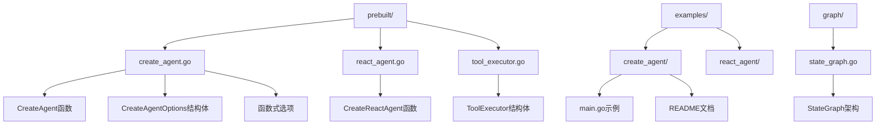
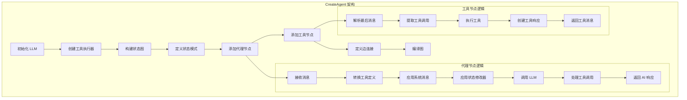
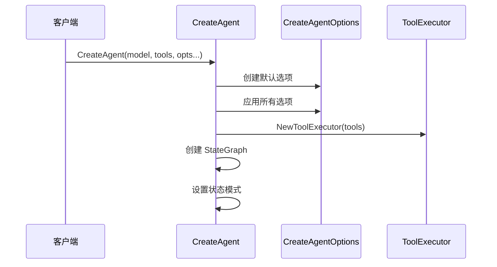
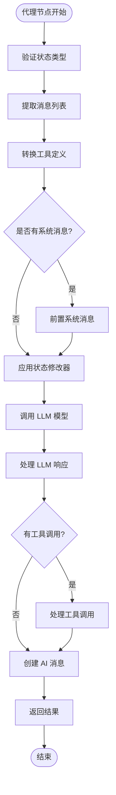
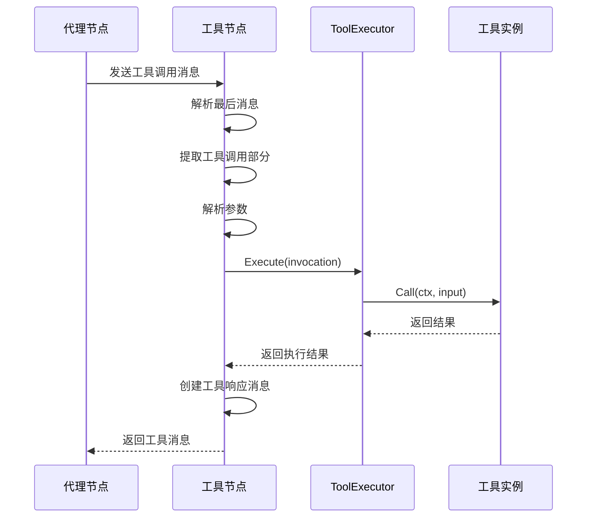
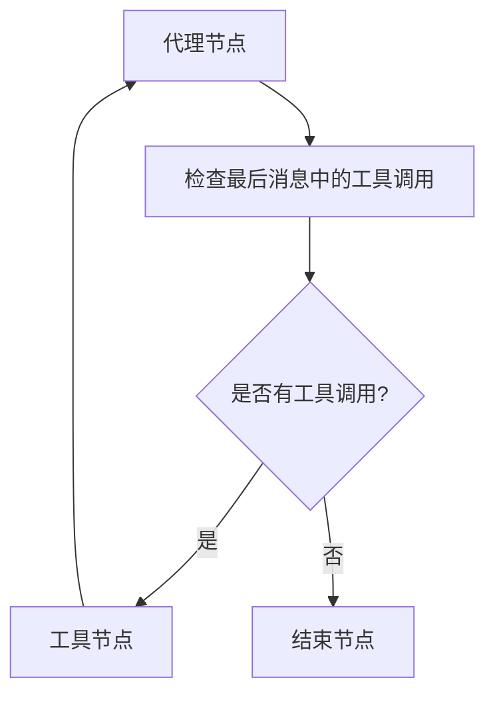
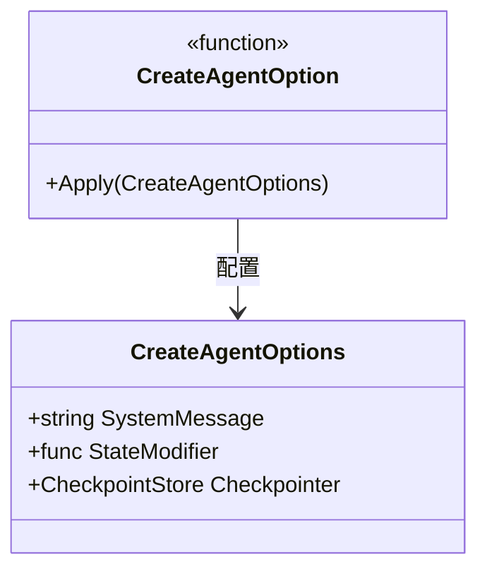
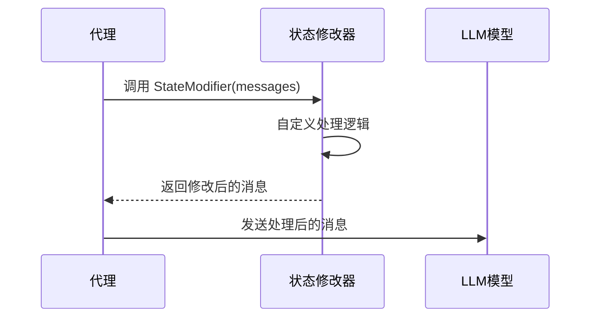
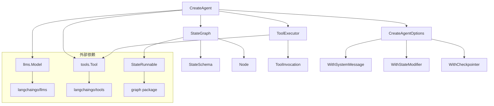
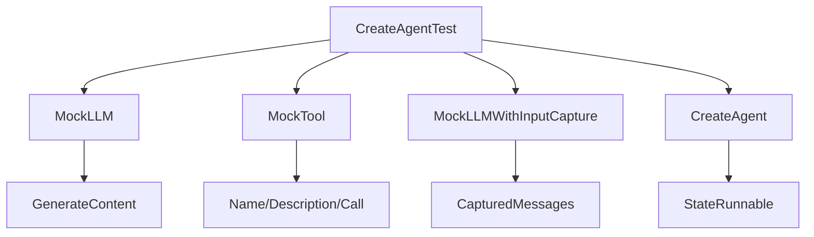

# Create Agent

<cite>
**本文档中引用的文件**
- [prebuilt/create_agent.go](file://prebuilt/create_agent.go)
- [examples/create_agent/main.go](file://examples/create_agent/main.go)
- [examples/react_agent/main.go](file://examples/react_agent/main.go)
- [prebuilt/react_agent.go](file://prebuilt/react_agent.go)
- [prebuilt/tool_executor.go](file://prebuilt/tool_executor.go)
- [graph/state_graph.go](file://graph/state_graph.go)
- [prebuilt/create_agent_test.go](file://prebuilt/create_agent_test.go)
- [examples/create_agent/README.md](file://examples/create_agent/README.md)
</cite>

## 目录
1. [简介](#简介)
2. [项目结构](#项目结构)
3. [核心组件](#核心组件)
4. [架构概览](#架构概览)
5. [详细组件分析](#详细组件分析)
6. [依赖关系分析](#依赖关系分析)
7. [性能考虑](#性能考虑)
8. [故障排除指南](#故障排除指南)
9. [结论](#结论)

## 简介

`prebuilt.CreateAgent` 是 LangGraphGo 框架中的一个核心工厂函数，专门用于基于函数式选项模式（Functional Options Pattern）构建灵活的智能代理。该函数简化了 ReAct 模式代理的创建过程，提供了比基础 `CreateReactAgent` 更强大和可扩展的功能集。

### 主要特性

- **函数式选项模式**: 支持优雅的配置方式，如 `WithSystemMessage` 和 `WithStateModifier`
- **状态图构建**: 内部创建复杂的 `StateGraph` 来管理代理执行流程
- **消息累加器**: 注册 `AppendReducer` 处理消息历史
- **工具集成**: 自动处理工具定义和执行
- **条件路由**: 实现智能的代理-工具交互逻辑

## 项目结构



**图表来源**
- [prebuilt/create_agent.go](file://prebuilt/create_agent.go#L1-L252)
- [examples/create_agent/main.go](file://examples/create_agent/main.go#L1-L86)
- [graph/state_graph.go](file://graph/state_graph.go#L1-L458)

**章节来源**
- [prebuilt/create_agent.go](file://prebuilt/create_agent.go#L1-L252)
- [examples/create_agent/main.go](file://examples/create_agent/main.go#L1-L86)

## 核心组件

### CreateAgentOptions 结构体

`CreateAgentOptions` 是 `CreateAgent` 函数的配置选项容器，包含以下关键字段：

| 字段名 | 类型 | 描述 |
|--------|------|------|
| SystemMessage | string | 预设的系统提示消息，定义代理行为 |
| StateModifier | func([]llms.MessageContent) []llms.MessageContent | 状态修改器函数，用于修改消息历史 |
| Checkpointer | graph.CheckpointStore | 检查点存储接口，用于状态持久化 |

### 函数式选项模式

该函数采用经典的 Go 函数式选项模式，提供以下配置函数：

- **WithSystemMessage**: 设置系统消息
- **WithStateModifier**: 配置状态修改器
- **WithCheckpointer**: 设置检查点存储（目前是占位符）

**章节来源**
- [prebuilt/create_agent.go](file://prebuilt/create_agent.go#L13-L43)

## 架构概览

`CreateAgent` 函数构建了一个完整的状态图代理系统，其架构如下：



**图表来源**
- [prebuilt/create_agent.go](file://prebuilt/create_agent.go#L46-L250)
- [graph/state_graph.go](file://graph/state_graph.go#L50-L113)

## 详细组件分析

### CreateAgent 函数实现

#### 初始化阶段



**图表来源**
- [prebuilt/create_agent.go](file://prebuilt/create_agent.go#L46-L56)

#### 代理节点实现

代理节点是整个系统的核心，负责：

1. **消息验证**: 确保状态格式正确
2. **工具定义转换**: 将工具列表转换为 LLM 可识别的格式
3. **系统消息处理**: 在消息历史前添加系统提示
4. **状态修改器应用**: 执行自定义的消息处理逻辑
5. **LLM 调用**: 发送处理后的消息并获取响应
6. **响应处理**: 解析 LLM 输出，包括文本内容和工具调用



**图表来源**
- [prebuilt/create_agent.go](file://prebuilt/create_agent.go#L65-L164)

#### 工具节点实现

工具节点负责处理代理发出的工具调用：



**图表来源**
- [prebuilt/create_agent.go](file://prebuilt/create_agent.go#L167-L224)

#### 条件路由逻辑

系统使用条件边来决定执行流程：



**图表来源**
- [prebuilt/create_agent.go](file://prebuilt/create_agent.go#L229-L246)

**章节来源**
- [prebuilt/create_agent.go](file://prebuilt/create_agent.go#L46-L250)

### 函数式选项实现机制

#### WithSystemMessage 实现

系统消息选项通过闭包捕获配置值：



**图表来源**
- [prebuilt/create_agent.go](file://prebuilt/create_agent.go#L24-L27)

#### WithStateModifier 实现

状态修改器允许开发者在消息发送给 LLM 前进行自定义处理：



**图表来源**
- [prebuilt/create_agent.go](file://prebuilt/create_agent.go#L133-L135)

**章节来源**
- [prebuilt/create_agent.go](file://prebuilt/create_agent.go#L24-L43)

### ToolExecutor 组件

工具执行器是代理系统的重要组成部分，负责：

- **工具映射**: 将工具名称映射到实际工具实例
- **单次执行**: 执行单个工具调用
- **批量执行**: 并行执行多个工具调用（未来扩展）
- **状态节点**: 提供图节点函数接口

```mermaid
classDiagram
class ToolExecutor {
+map[string]tools.Tool tools
+Execute(ctx, invocation) string, error
+ExecuteMany(ctx, invocations) []string, error
+ToolNode(ctx, state) interface{}, error
}
class ToolInvocation {
+string Tool
+string ToolInput
}
class Tool {
<<interface>>
+Name() string
+Description() string
+Call(ctx, input) string, error
}
ToolExecutor --> Tool : 管理
ToolExecutor --> ToolInvocation : 处理
```

**图表来源**
- [prebuilt/tool_executor.go](file://prebuilt/tool_executor.go#L17-L84)

**章节来源**
- [prebuilt/tool_executor.go](file://prebuilt/tool_executor.go#L17-L84)

## 依赖关系分析

### 核心依赖关系



**图表来源**
- [prebuilt/create_agent.go](file://prebuilt/create_agent.go#L1-L11)
- [graph/state_graph.go](file://graph/state_graph.go#L1-L11)

### 测试依赖关系



**图表来源**
- [prebuilt/create_agent_test.go](file://prebuilt/create_agent_test.go#L12-L31)

**章节来源**
- [prebuilt/create_agent.go](file://prebuilt/create_agent.go#L1-L11)
- [prebuilt/create_agent_test.go](file://prebuilt/create_agent_test.go#L1-L182)

## 性能考虑

### 并发处理

- **工具执行**: 单次工具调用按顺序执行，支持未来并行化
- **消息处理**: 状态修改器同步执行，避免并发问题
- **LLM 调用**: 每次调用独立处理，确保状态一致性

### 内存管理

- **消息累积**: 使用 `AppendReducer` 高效处理消息历史
- **状态复制**: 每次迭代创建新的状态副本，避免副作用
- **工具映射**: 缓存工具名称到实例的映射关系

### 扩展性

- **插件架构**: 支持任意数量的工具和自定义处理器
- **配置灵活性**: 通过函数式选项轻松扩展功能
- **接口抽象**: 依赖接口而非具体实现，便于测试和替换

## 故障排除指南

### 常见问题及解决方案

#### 1. 系统消息未生效

**问题**: 设置了 `WithSystemMessage` 但 LLM 未使用

**原因**: 状态修改器可能移除了系统消息

**解决方案**: 检查状态修改器逻辑，确保保留系统消息

#### 2. 工具调用失败

**问题**: 代理尝试调用工具但执行失败

**诊断步骤**:
- 验证工具名称匹配
- 检查工具参数格式
- 确认工具实例正确注册

#### 3. 状态类型错误

**问题**: 运行时出现类型断言错误

**解决方案**: 确保输入状态符合预期格式：
```go
initialState := map[string]interface{}{
    "messages": []llms.MessageContent{
        llms.TextParts(llms.ChatMessageTypeHuman, "用户消息"),
    },
}
```

**章节来源**
- [prebuilt/create_agent_test.go](file://prebuilt/create_agent_test.go#L104-L181)

## 结论

`prebuilt.CreateAgent` 函数代表了 LangGraphGo 框架中智能代理构建的最佳实践。通过采用函数式选项模式，它提供了：

### 主要优势

1. **简洁的 API**: 清晰的配置方式，易于理解和使用
2. **高度可扩展**: 支持自定义系统消息和状态处理逻辑
3. **内置智能**: 自动处理工具调用和条件路由
4. **类型安全**: 强类型接口确保运行时稳定性
5. **测试友好**: 清晰的依赖关系便于单元测试

### 使用建议

- **渐进式配置**: 从简单的系统消息开始，逐步添加复杂功能
- **状态修改器**: 利用状态修改器实现动态提示工程
- **工具设计**: 创建职责单一、接口清晰的工具组件
- **错误处理**: 实现健壮的错误处理和重试机制

### 未来发展方向

- **并行工具执行**: 支持多个工具的并发调用
- **高级状态管理**: 更复杂的状态模式和持久化策略
- **监控和追踪**: 内置的性能监控和调试功能
- **插件生态系统**: 更丰富的工具和处理器生态

通过深入理解 `CreateAgent` 的实现原理和最佳实践，开发者可以构建出功能强大、可维护性强的智能代理系统，为用户提供卓越的交互体验。