# RAG 组件

<cite>
**本文档中引用的文件**
- [rag.go](file://prebuilt/rag.go)
- [rag_components.go](file://prebuilt/rag_components.go)
- [rag_test.go](file://prebuilt/rag_test.go)
- [rag_basic/main.go](file://examples/rag_basic/main.go)
- [rag_advanced/main.go](file://examples/rag_advanced/main.go)
- [rag_conditional/main.go](file://examples/rag_conditional/main.go)
- [rag_pipeline/main.go](file://examples/rag_pipeline/main.go)
- [rag_with_embeddings/main.go](file://examples/rag_with_embeddings/main.go)
- [rag_with_langchain/main.go](file://examples/rag_with_langchain/main.go)
</cite>

## 目录
1. [简介](#简介)
2. [核心接口设计](#核心接口设计)
3. [RAGPipeline 架构](#ragpipeline-架构)
4. [内置组件详解](#内置组件详解)
5. [三种 RAG 模式](#三种-rag-模式)
6. [实例分析](#实例分析)
7. [最佳实践](#最佳实践)
8. [总结](#总结)

## 简介

`prebuilt` 包提供了完整的 RAG（检索增强生成）解决方案，基于清晰的接口设计理念，支持从基础到高级的各种 RAG 应用场景。该系统采用模块化架构，允许开发者灵活组合不同的组件来构建适合自己需求的 RAG 系统。

## 核心接口设计

RAG 系统的核心由七个主要接口组成，每个接口都承担特定的功能职责：

```mermaid
classDiagram
class Document {
+string PageContent
+map[string]interface{} Metadata
}
class DocumentLoader {
<<interface>>
+Load(ctx Context) []Document
}
class TextSplitter {
<<interface>>
+SplitDocuments([]Document) []Document
}
class Embedder {
<<interface>>
+EmbedDocuments(ctx Context, []string) [][]float64
+EmbedQuery(ctx Context, string) []float64
}
class VectorStore {
<<interface>>
+AddDocuments(ctx Context, []Document, [][]float64) error
+SimilaritySearch(ctx Context, string, int) []Document
+SimilaritySearchWithScore(ctx Context, string, int) []DocumentWithScore
}
class Retriever {
<<interface>>
+GetRelevantDocuments(ctx Context, string) []Document
}
class Reranker {
<<interface>>
+Rerank(ctx Context, string, []Document) []DocumentWithScore
}
DocumentLoader --> Document : "loads"
TextSplitter --> Document : "splits"
Embedder --> VectorStore : "provides embeddings"
VectorStore --> Retriever : "stores documents"
Retriever --> Reranker : "retrieves documents"
```

**图表来源**
- [rag.go](file://prebuilt/rag.go#L12-L55)

### 接口功能说明

| 接口 | 职责 | 主要方法 |
|------|------|----------|
| `Document` | 文档表示 | 内容和元数据存储 |
| `DocumentLoader` | 文档加载 | 从各种源加载文档 |
| `TextSplitter` | 文本分割 | 将长文档分割为较小块 |
| `Embedder` | 嵌入生成 | 生成文本的向量表示 |
| `VectorStore` | 向量存储 | 存储和检索嵌入向量 |
| `Retriever` | 文档检索 | 根据查询检索相关文档 |
| `Reranker` | 重排序 | 对检索结果进行重新排序 |

**节来源**
- [rag.go](file://prebuilt/rag.go#L12-L55)

## RAGPipeline 架构

`RAGPipeline` 是整个 RAG 系统的核心控制器，它基于消息图（MessageGraph）构建，支持三种不同的执行模式：

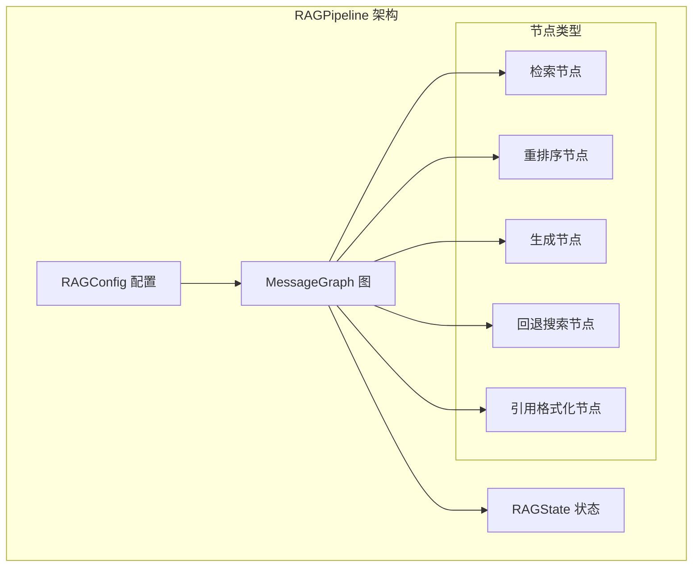

**图表来源**
- [rag.go](file://prebuilt/rag.go#L108-L123)

### 状态管理

RAG 系统维护一个统一的状态结构，包含查询、文档、上下文和答案等信息：

```mermaid
classDiagram
class RAGState {
+string Query
+[]Document Documents
+[]Document RetrievedDocuments
+[]DocumentWithScore RankedDocuments
+string Context
+string Answer
+[]string Citations
+map[string]interface{} Metadata
}
class DocumentWithScore {
+Document Document
+float64 Score
}
RAGState --> DocumentWithScore : "contains"
RAGState --> Document : "manages"
```

**图表来源**
- [rag.go](file://prebuilt/rag.go#L57-L67)

**节来源**
- [rag.go](file://prebuilt/rag.go#L57-L67)

## 内置组件详解

### SimpleTextSplitter

简单文本分割器提供基本的文档分割功能，支持自定义块大小和重叠：

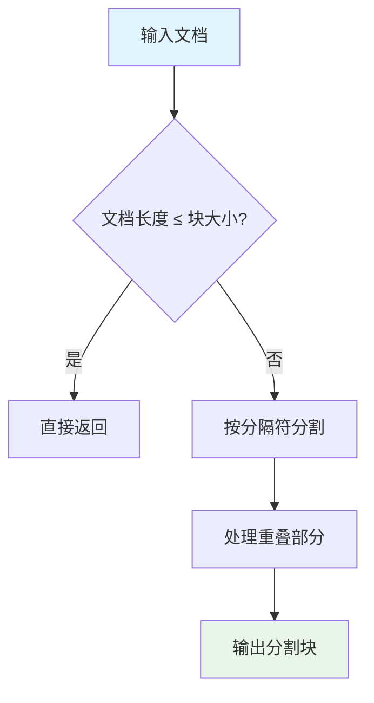

**图表来源**
- [rag_components.go](file://prebuilt/rag_components.go#L54-L92)

### InMemoryVectorStore

内存向量存储提供高效的相似性搜索功能：

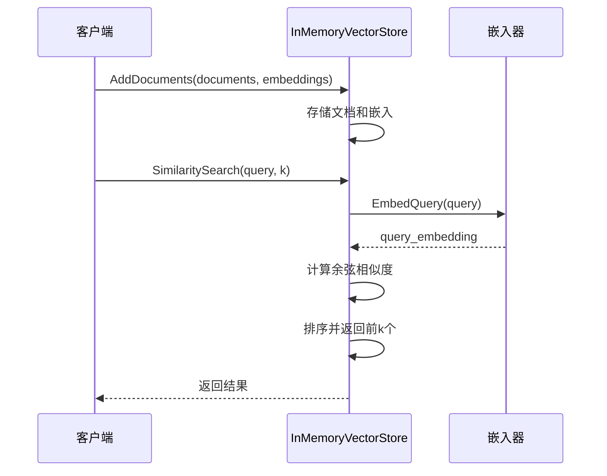

**图表来源**
- [rag_components.go](file://prebuilt/rag_components.go#L94-L204)

### SimpleReranker

简单重排序器基于关键词匹配进行文档评分：

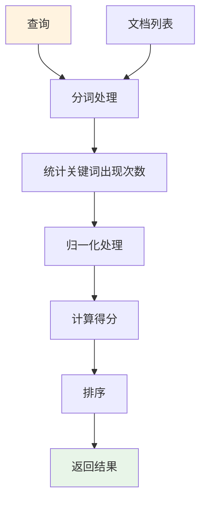

**图表来源**
- [rag_components.go](file://prebuilt/rag_components.go#L206-L261)

### VectorStoreRetriever

向量存储检索器结合向量存储和检索功能：

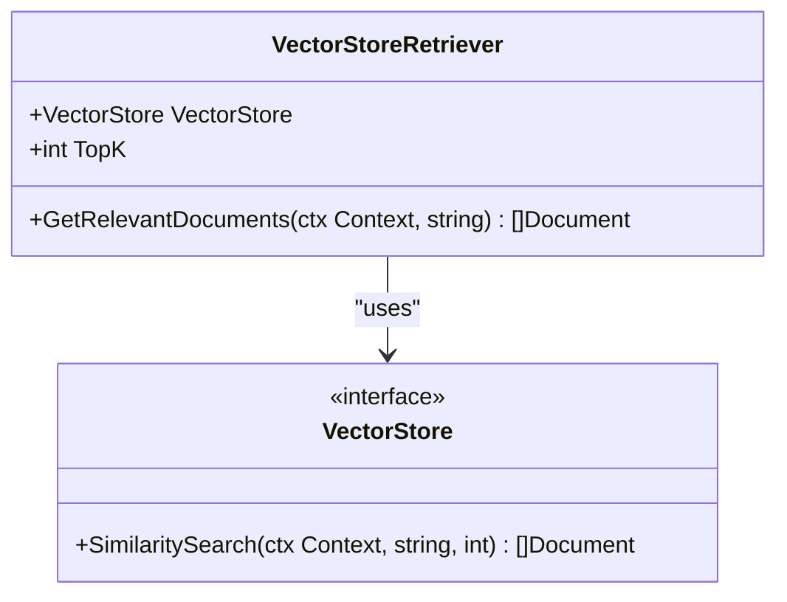

**图表来源**
- [rag.go](file://prebuilt/rag.go#L374-L391)

**节来源**
- [rag_components.go](file://prebuilt/rag_components.go#L10-L333)

## 三种 RAG 模式

### 基础 RAG 模式

基础 RAG 模式是最简单的实现，包含检索和生成两个阶段：

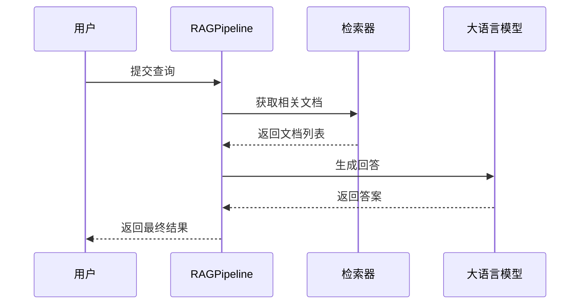

**图表来源**
- [rag.go](file://prebuilt/rag.go#L125-L146)

### 高级 RAG 模式

高级 RAG 模式增加了重排序和引用生成功能：

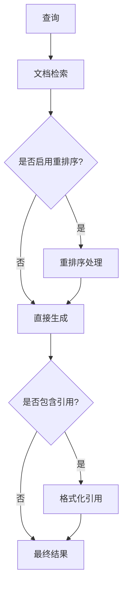

**图表来源**
- [rag.go](file://prebuilt/rag.go#L148-L191)

### 条件 RAG 模式

条件 RAG 模式根据相关性分数进行智能路由：

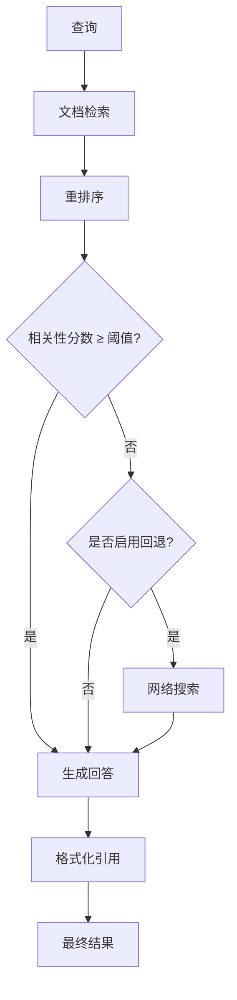

**图表来源**
- [rag.go](file://prebuilt/rag.go#L193-L249)

**节来源**
- [rag.go](file://prebuilt/rag.go#L125-L249)

## 实例分析

### 基础 RAG 示例

基础 RAG 示例展示了最简单的 RAG 实现流程：

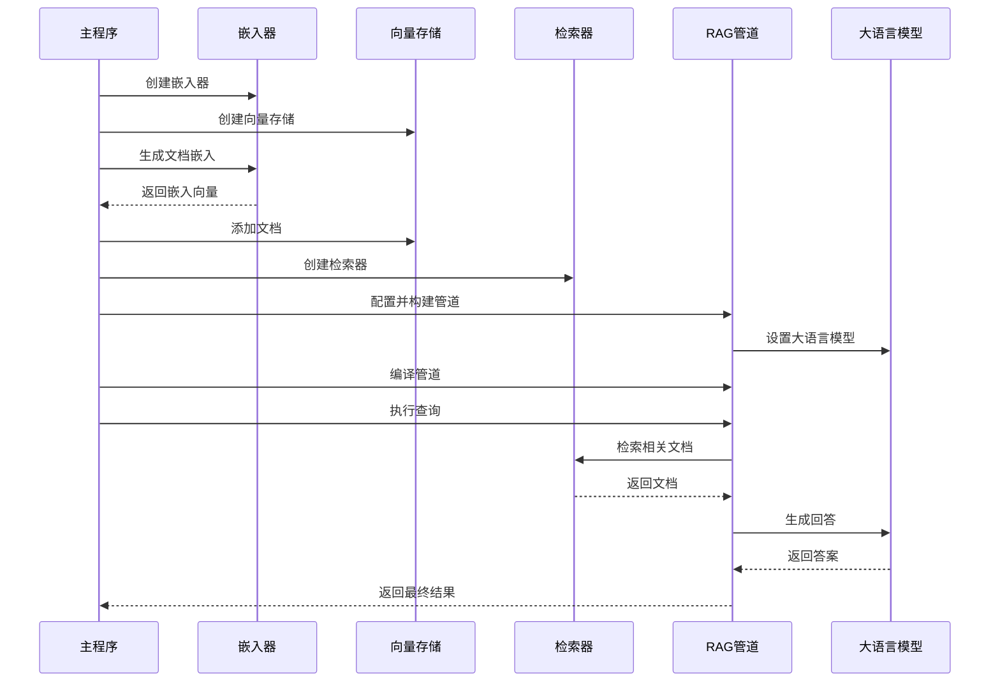

**图表来源**
- [rag_basic/main.go](file://examples/rag_basic/main.go#L14-L155)

### 高级 RAG 示例

高级 RAG 示例包含了更复杂的文档处理和重排序功能：

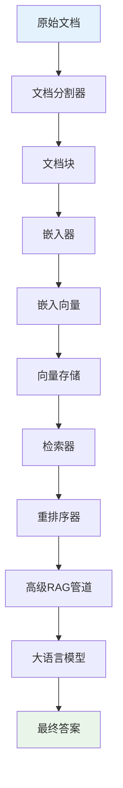

**图表来源**
- [rag_advanced/main.go](file://examples/rag_advanced/main.go#L14-L223)

### 条件 RAG 示例

条件 RAG 示例演示了基于相关性阈值的智能路由：

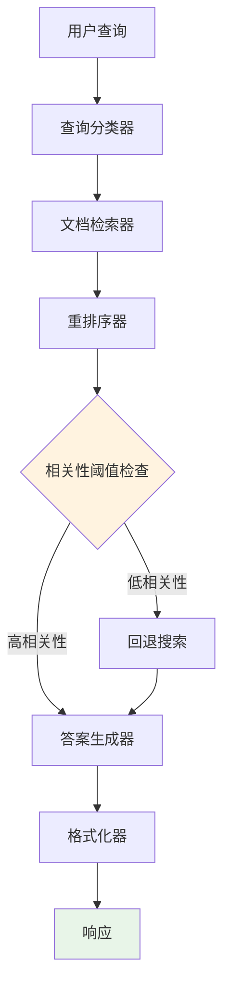

**图表来源**
- [rag_conditional/main.go](file://examples/rag_conditional/main.go#L14-L212)

**节来源**
- [rag_basic/main.go](file://examples/rag_basic/main.go#L14-L155)
- [rag_advanced/main.go](file://examples/rag_advanced/main.go#L14-L223)
- [rag_conditional/main.go](file://examples/rag_conditional/main.go#L14-L212)

## 最佳实践

### 组件选择指南

| 场景 | 推荐组件 | 说明 |
|------|----------|------|
| 快速原型 | MockEmbedder + InMemoryVectorStore | 开发测试友好 |
| 生产环境 | LangChainEmbedder + ChromaVectorStore | 性能和稳定性 |
| 多模态 | VisionEmbedder + MultiModalVectorStore | 支持图像和文本 |
| 海量数据 | 分布式向量存储 + 并行处理 | 可扩展性 |

### 性能优化建议

1. **嵌入维度权衡**：平衡质量和性能
2. **缓存策略**：缓存常用查询的嵌入
3. **批处理**：批量处理多个文档
4. **索引优化**：使用合适的相似性度量

### 错误处理模式

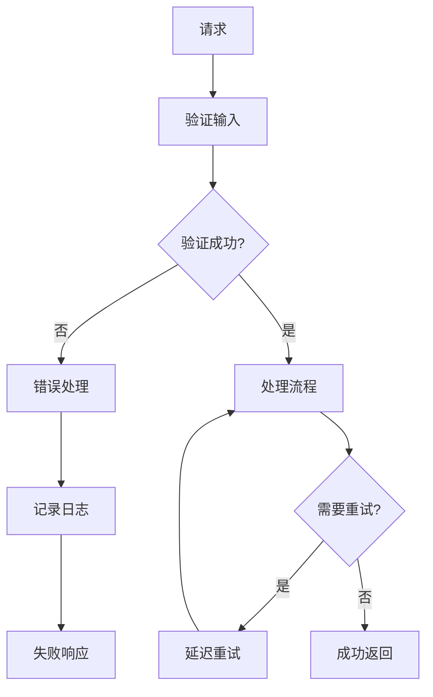

## 总结

`prebuilt` 包的 RAG 组件提供了一个完整、灵活且可扩展的解决方案。通过清晰的接口设计和模块化架构，开发者可以轻松构建从基础到高级的各种 RAG 应用。系统支持多种执行模式，能够满足不同复杂度的需求，同时提供了丰富的内置组件和适配器，便于与现有系统集成。

关键优势：
- **模块化设计**：清晰的接口分离，易于扩展和替换
- **多种模式**：支持基础、高级和条件三种执行模式
- **丰富组件**：提供多种内置实现和适配器
- **测试友好**：完整的单元测试和集成测试覆盖

通过合理选择和配置这些组件，开发者可以快速构建高质量的 RAG 系统，为用户提供准确、相关性强的问答服务。