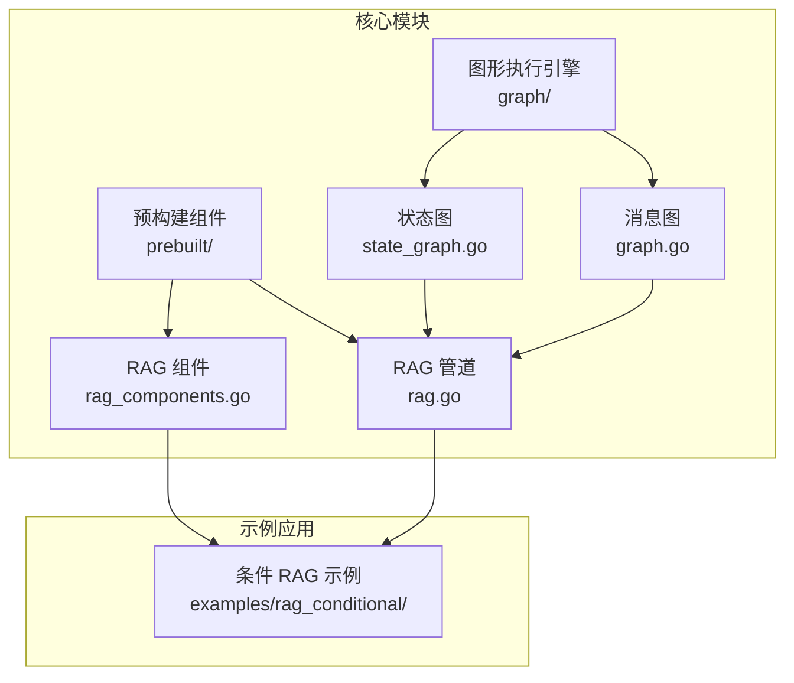
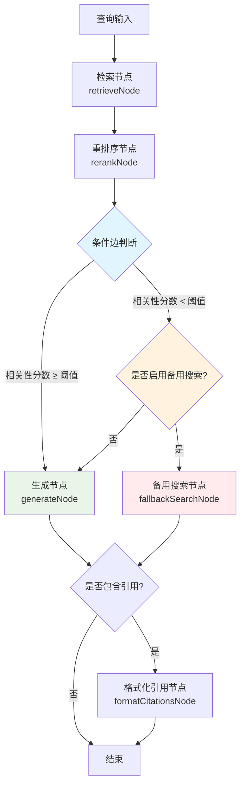
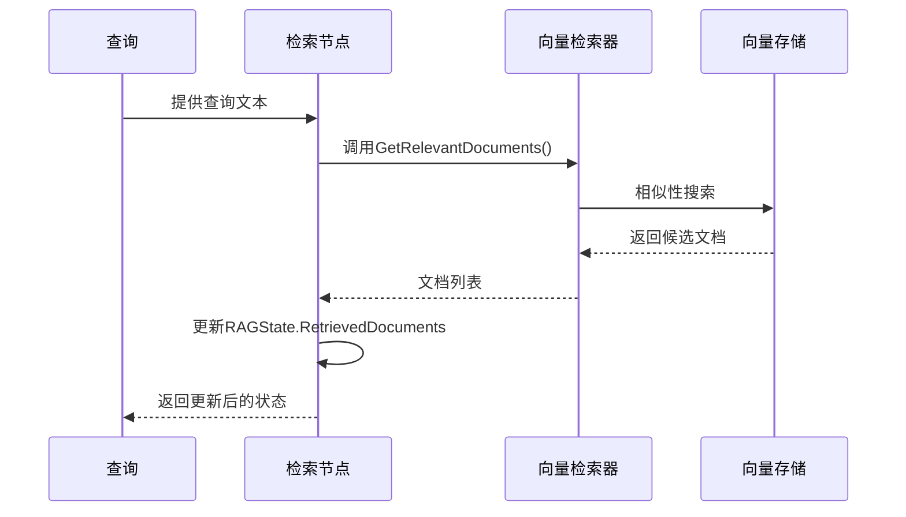
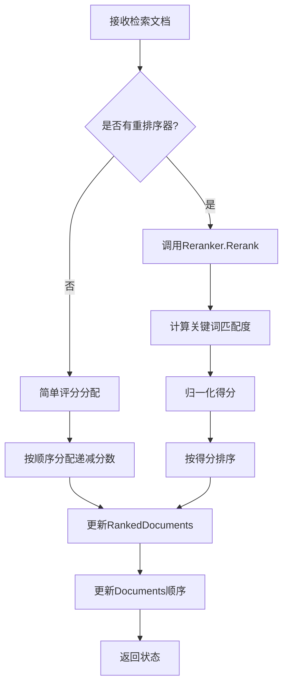
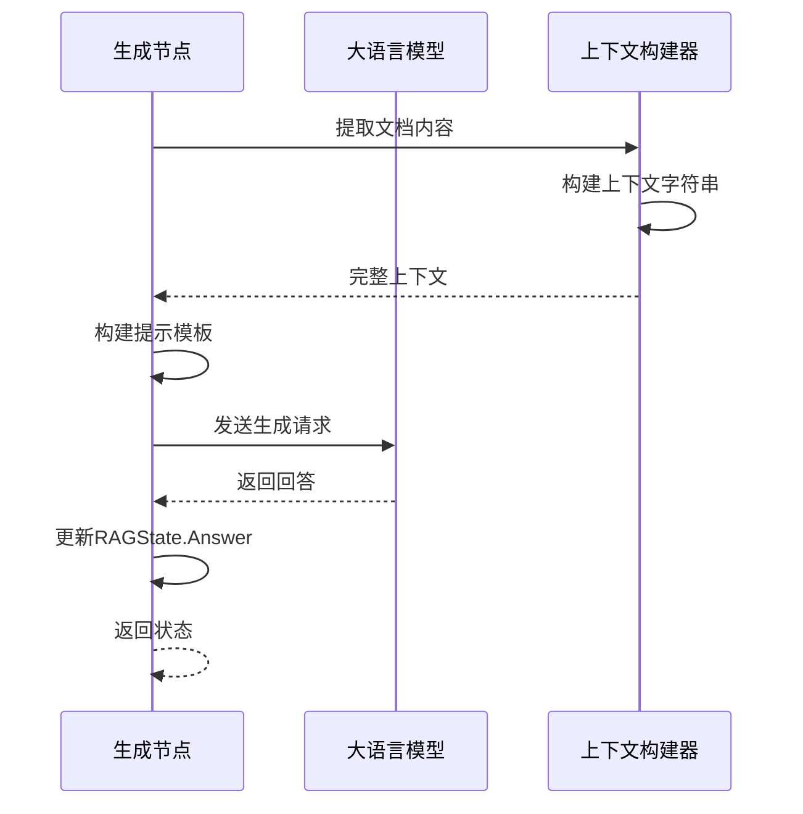
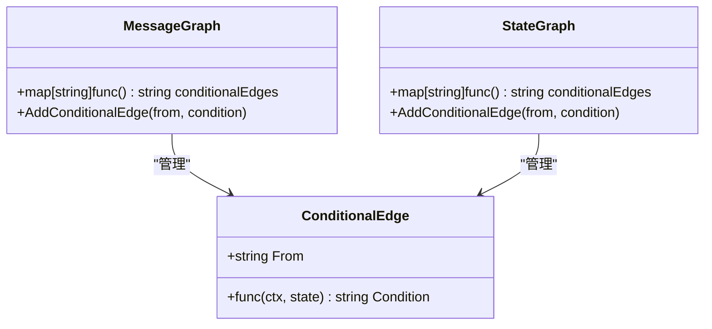
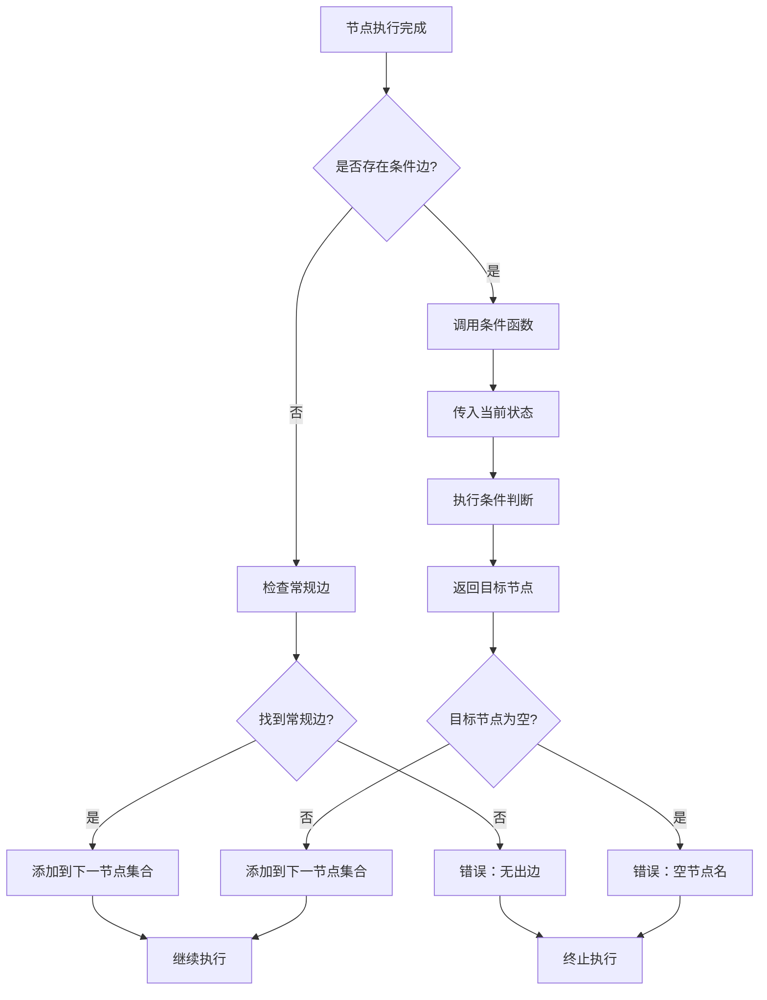
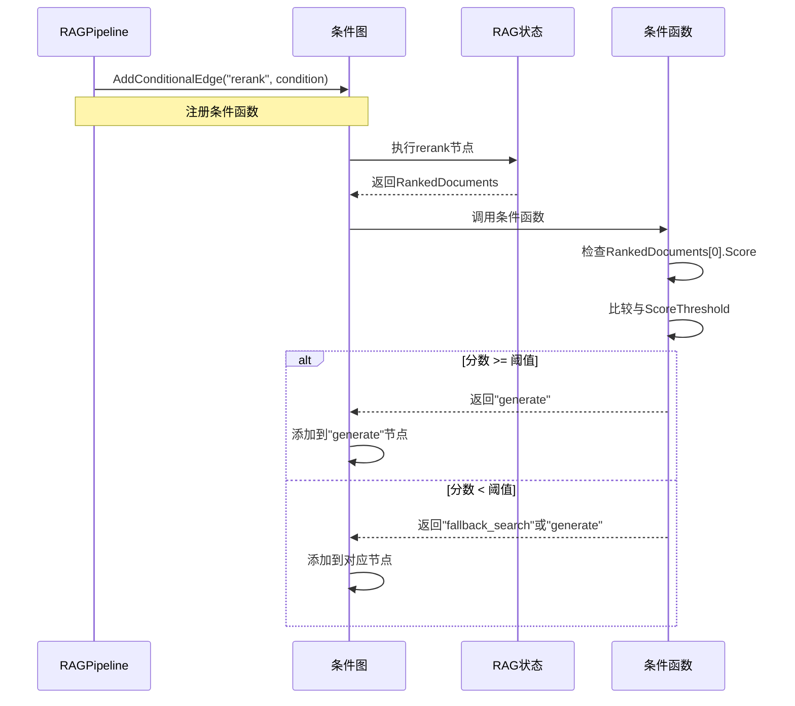
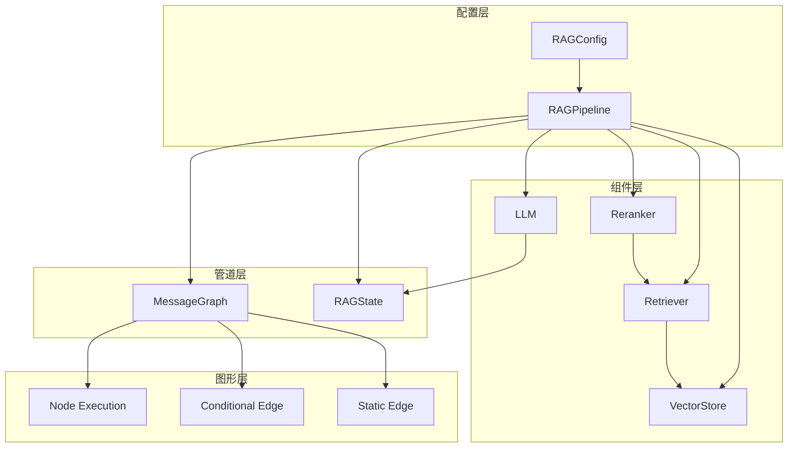

# 条件 RAG 管道深度解析

<cite>
**本文档引用的文件**
- [examples/rag_conditional/main.go](file://examples/rag_conditional/main.go)
- [prebuilt/rag.go](file://prebuilt/rag.go)
- [prebuilt/rag_components.go](file://prebuilt/rag_components.go)
- [graph/graph.go](file://graph/graph.go)
- [graph/state_graph.go](file://graph/state_graph.go)
- [graph/conditional_edges_test.go](file://graph/conditional_edges_test.go)
- [examples/rag_conditional/README.md](file://examples/rag_conditional/README.md)
</cite>

## 目录
1. [引言](#引言)
2. [项目结构概览](#项目结构概览)
3. [核心组件分析](#核心组件分析)
4. [架构概览](#架构概览)
5. [详细组件分析](#详细组件分析)
6. [条件路由机制](#条件路由机制)
7. [依赖关系分析](#依赖关系分析)
8. [性能考虑](#性能考虑)
9. [故障排除指南](#故障排除指南)
10. [结论](#结论)

## 引言

条件 RAG（Retrieval-Augmented Generation）是一种先进的信息检索和生成技术，它在传统的 RAG 模型基础上引入了智能路由机制。该系统的核心创新在于基于相关性分数的动态决策，能够根据检索到的文档质量自动选择最优的处理路径。

传统的 RAG 系统通常采用固定的处理流程：检索 → 生成 → 格式化。然而，在实际应用中，这种固定流程可能无法适应所有查询场景。当检索到的文档质量较低时，直接使用这些文档可能会导致生成质量下降甚至产生错误信息。条件 RAG 通过引入阈值判断和备用搜索机制，显著提升了系统的鲁棒性和应对未知问题的能力。

## 项目结构概览

条件 RAG 系统采用模块化设计，主要包含以下核心模块：



**图表来源**
- [prebuilt/rag.go](file://prebuilt/rag.go#L1-L50)
- [graph/graph.go](file://graph/graph.go#L1-L50)

**章节来源**
- [examples/rag_conditional/main.go](file://examples/rag_conditional/main.go#L1-L30)
- [prebuilt/rag.go](file://prebuilt/rag.go#L1-L100)

## 核心组件分析

### RAG 状态管理

条件 RAG 系统的核心是 `RAGState` 结构体，它定义了整个管道中传递的状态信息：

```mermaid
classDiagram
class RAGState {
+string Query
+[]Document Documents
+[]Document RetrievedDocuments
+[]DocumentWithScore RankedDocuments
+string Context
+string Answer
+[]string Citations
+map[string]interface{} Metadata
}
class Document {
+string PageContent
+map[string]interface{} Metadata
}
class DocumentWithScore {
+Document Document
+float64 Score
}
RAGState --> Document : "包含"
RAGState --> DocumentWithScore : "排序后文档"
DocumentWithScore --> Document : "关联"
```

**图表来源**
- [prebuilt/rag.go](file://prebuilt/rag.go#L58-L67)
- [prebuilt/rag.go](file://prebuilt/rag.go#L41-L45)

### 配置系统

系统提供了灵活的配置选项，支持多种工作模式：

| 配置项 | 类型 | 默认值 | 描述 |
|--------|------|--------|------|
| TopK | int | 4 | 检索的文档数量 |
| ScoreThreshold | float64 | 0.7 | 相关性阈值 |
| UseReranking | bool | false | 是否启用重排序 |
| UseFallback | bool | false | 是否启用备用搜索 |
| IncludeCitations | bool | true | 是否包含引用 |

**章节来源**
- [prebuilt/rag.go](file://prebuilt/rag.go#L69-L91)
- [examples/rag_conditional/main.go](file://examples/rag_conditional/main.go#L78-L90)

## 架构概览

条件 RAG 管道采用流水线架构，结合了静态边和条件边的混合路由策略：



**图表来源**
- [prebuilt/rag.go](file://prebuilt/rag.go#L193-L248)
- [examples/rag_conditional/main.go](file://examples/rag_conditional/main.go#L105-L113)

**章节来源**
- [prebuilt/rag.go](file://prebuilt/rag.go#L193-L248)

## 详细组件分析

### 检索节点（Retrieve Node）

检索节点负责从向量数据库中获取最相关的文档：



**图表来源**
- [prebuilt/rag.go](file://prebuilt/rag.go#L263-L274)

### 重排序节点（Rerank Node）

重排序节点对检索结果进行质量评估和排序：



**图表来源**
- [prebuilt/rag.go](file://prebuilt/rag.go#L277-L307)

**章节来源**
- [prebuilt/rag.go](file://prebuilt/rag.go#L277-L307)

### 生成节点（Generate Node）

生成节点利用上下文信息和查询构建最终的回答：



**图表来源**
- [prebuilt/rag.go](file://prebuilt/rag.go#L322-L354)

**章节来源**
- [prebuilt/rag.go](file://prebuilt/rag.go#L322-L354)

## 条件路由机制

### AddConditionalEdge 实现原理

条件路由是条件 RAG 的核心特性，通过 `AddConditionalEdge` 方法实现动态路径选择：



**图表来源**
- [graph/graph.go](file://graph/graph.go#L119-L122)
- [graph/state_graph.go](file://graph/state_graph.go#L73-L76)

### 路由逻辑详解

条件边的执行过程遵循以下步骤：



**图表来源**
- [graph/state_graph.go](file://graph/state_graph.go#L239-L268)

### 具体实现分析

在 `BuildConditionalRAG` 方法中，条件边的具体实现如下：



**图表来源**
- [prebuilt/rag.go](file://prebuilt/rag.go#L225-L235)

**章节来源**
- [prebuilt/rag.go](file://prebuilt/rag.go#L225-L235)

## 依赖关系分析

### 组件间依赖关系

条件 RAG 系统的组件间存在复杂的依赖关系：



**图表来源**
- [prebuilt/rag.go](file://prebuilt/rag.go#L108-L122)
- [graph/graph.go](file://graph/graph.go#L115-L130)

### 外部依赖

系统依赖以下外部组件：

| 组件 | 用途 | 实现方式 |
|------|------|----------|
| 向量存储 | 文档相似性搜索 | InMemoryVectorStore |
| 嵌入生成 | 文本向量化 | MockEmbedder |
| 重排序器 | 文档质量评估 | SimpleReranker |
| 大语言模型 | 答案生成 | OpenAI LLM |
| 图形引擎 | 流程编排 | MessageGraph |

**章节来源**
- [prebuilt/rag_components.go](file://prebuilt/rag_components.go#L1-L50)
- [examples/rag_conditional/main.go](file://examples/rag_conditional/main.go#L54-L77)

## 性能考虑

### 计算复杂度分析

条件 RAG 系统的性能特征如下：

| 操作 | 时间复杂度 | 空间复杂度 | 说明 |
|------|------------|------------|------|
| 文档检索 | O(log n) | O(k) | 基于向量相似性搜索 |
| 文档重排序 | O(d × t) | O(d) | d=文档数，t=词元数 |
| 条件判断 | O(1) | O(1) | 固定时间复杂度 |
| 答案生成 | O(c) | O(c) | c=上下文长度 |

### 优化策略

1. **缓存机制**：缓存常用的嵌入向量和重排序结果
2. **批量处理**：对多个查询进行批量处理以提高吞吐量
3. **阈值调优**：根据具体应用场景调整相关性阈值
4. **异步执行**：利用 Go 协程实现并行处理

## 故障排除指南

### 常见问题及解决方案

#### 1. 条件边未生效
**症状**：无论相关性分数如何，都只执行单一路径
**原因**：条件函数返回值不正确或状态数据缺失
**解决**：检查条件函数逻辑和状态传递

#### 2. 相关性分数异常
**症状**：重排序后分数分布不合理
**原因**：重排序算法参数不当或文档质量差
**解决**：调整重排序算法或改进文档预处理

#### 3. 备用搜索未触发
**症状**：即使分数低于阈值也不执行备用搜索
**原因**：UseFallback 配置未启用或备用节点未添加
**解决**：确保正确配置 UseFallback 并添加备用节点

**章节来源**
- [prebuilt/rag.go](file://prebuilt/rag.go#L225-L235)

## 结论

条件 RAG 管道代表了现代信息检索和生成系统的重要发展方向。通过引入基于相关性分数的智能路由机制，该系统实现了以下关键优势：

### 技术创新点

1. **动态路由决策**：基于实时相关性评估的自适应路径选择
2. **多模态处理**：结合检索、重排序和生成的端到端解决方案
3. **容错机制**：备用搜索功能确保系统在各种查询场景下的稳定性
4. **透明性设计**：清晰的路由决策过程便于调试和优化

### 应用价值

条件 RAG 系统特别适用于以下场景：
- **混合搜索系统**：结合向量搜索和传统搜索的优势
- **多领域问答**：处理跨领域的复杂查询
- **生产级应用**：提供可靠的服务质量和用户体验
- **知识库扩展**：有效处理知识库覆盖不足的问题

### 未来发展方向

1. **更智能的重排序算法**：集成更先进的语义理解和质量评估模型
2. **多模态内容处理**：支持文本、图像、音频等多种内容类型
3. **实时学习能力**：根据用户反馈动态调整路由策略
4. **分布式架构**：支持大规模部署和高并发访问

通过深入理解和合理应用条件 RAG 技术，开发者可以构建更加智能、可靠和高效的问答系统，为用户提供优质的智能化服务体验。