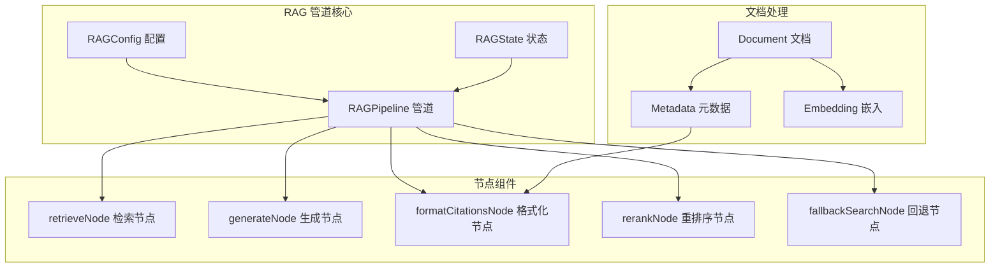
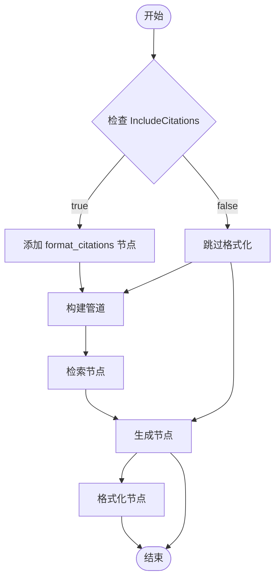
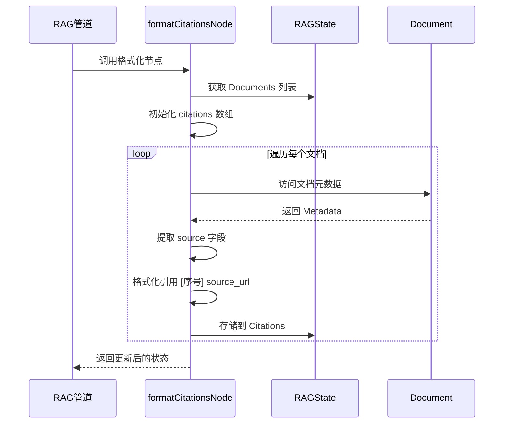
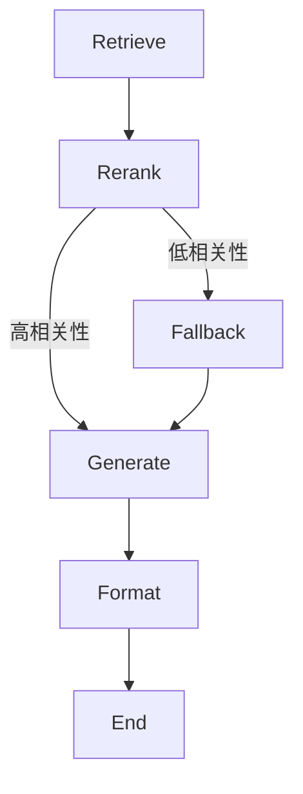
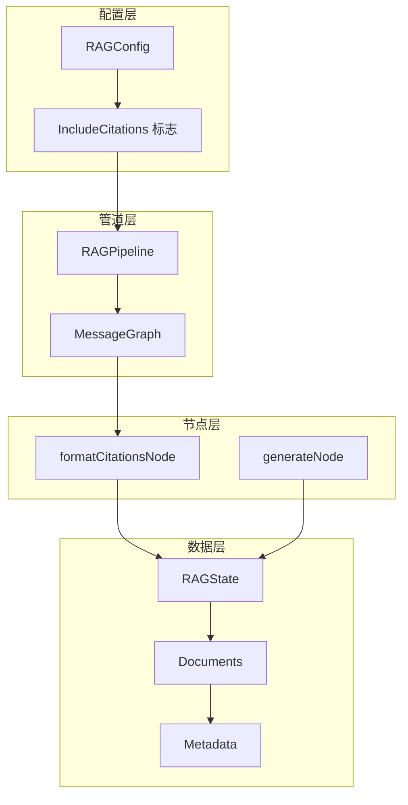

# 引用格式化

<cite>
**本文档中引用的文件**
- [prebuilt/rag.go](file://prebuilt/rag.go)
- [examples/rag_advanced/main.go](file://examples/rag_advanced/main.go)
- [examples/rag_conditional/main.go](file://examples/rag_conditional/main.go)
- [examples/rag_basic/main.go](file://examples/rag_basic/main.go)
- [examples/rag_chroma_example/main.go](file://examples/rag_chroma_example/main.go)
- [prebuilt/rag_test.go](file://prebuilt/rag_test.go)
</cite>

## 目录
1. [简介](#简介)
2. [项目结构概览](#项目结构概览)
3. [核心组件分析](#核心组件分析)
4. [架构概览](#架构概览)
5. [详细组件分析](#详细组件分析)
6. [依赖关系分析](#依赖关系分析)
7. [性能考虑](#性能考虑)
8. [故障排除指南](#故障排除指南)
9. [结论](#结论)

## 简介

引用格式化是 LangGraphGo 高级 RAG（检索增强生成）管道中的一个关键功能，它通过 `IncludeCitations` 配置项启用。当该选项设置为 `true` 时，系统会在 `generate` 节点后自动添加 `format_citations` 节点，为用户提供可追溯的答案来源信息。这一功能显著增强了答案的可信度和学术严谨性，在需要透明度和可验证性的应用场景中具有重要价值。

## 项目结构概览

LangGraphGo 的 RAG 系统采用模块化架构设计，主要包含以下核心组件：



**图表来源**
- [prebuilt/rag.go](file://prebuilt/rag.go#L58-L67)
- [prebuilt/rag.go](file://prebuilt/rag.go#L69-L91)

**章节来源**
- [prebuilt/rag.go](file://prebuilt/rag.go#L1-L392)

## 核心组件分析

### RAGState 结构体

`RAGState` 是 RAG 管道中流动的核心状态结构，包含了整个处理过程中的所有关键信息：

```mermaid
classDiagram
class RAGState {
+string Query
+[]Document Documents
+[]Document RetrievedDocuments
+[]DocumentWithScore RankedDocuments
+string Context
+string Answer
+[]string Citations
+map[string]interface{} Metadata
}
class Document {
+string PageContent
+map[string]interface{} Metadata
}
class DocumentWithScore {
+Document Document
+float64 Score
}
RAGState --> Document : "contains"
RAGState --> DocumentWithScore : "contains"
```

**图表来源**
- [prebuilt/rag.go](file://prebuilt/rag.go#L58-L67)
- [prebuilt/rag.go](file://prebuilt/rag.go#L12-L16)
- [prebuilt/rag.go](file://prebuilt/rag.go#L41-L45)

### IncludeCitations 配置项

`IncludeCitations` 是 RAG 配置中的一个重要标志，控制是否启用引用格式化功能：

| 配置项 | 类型 | 默认值 | 描述 |
|--------|------|--------|------|
| IncludeCitations | bool | true | 是否在生成节点后添加引用格式化节点 |

**章节来源**
- [prebuilt/rag.go](file://prebuilt/rag.go#L79)
- [prebuilt/rag.go](file://prebuilt/rag.go#L101)

## 架构概览

引用格式化功能在 RAG 管道中的集成遵循条件路由模式，根据配置动态添加处理节点：



**图表来源**
- [prebuilt/rag.go](file://prebuilt/rag.go#L148-L191)
- [prebuilt/rag.go](file://prebuilt/rag.go#L193-L249)

**章节来源**
- [prebuilt/rag.go](file://prebuilt/rag.go#L148-L249)

## 详细组件分析

### formatCitationsNode 函数实现

`formatCitationsNode` 是引用格式化功能的核心实现函数，负责从文档元数据中提取引用信息并格式化为标准的引用列表：



**图表来源**
- [prebuilt/rag.go](file://prebuilt/rag.go#L357-L371)

#### 实现逻辑详解

`formatCitationsNode` 函数的执行流程如下：

1. **状态获取与初始化**：
   - 从输入状态中提取 `RAGState.Documents` 列表
   - 创建与文档数量相同的引用数组

2. **文档遍历与元数据提取**：
   - 对每个文档进行迭代处理
   - 从 `Metadata` 字典中提取 `source` 字段
   - 如果 `source` 字段不存在，则使用默认值 `'Unknown'`

3. **引用格式化**：
   - 使用 `[序号] source_url` 的标准格式
   - 序号基于文档在列表中的位置（从1开始）
   - 确保格式的一致性和可读性

4. **结果存储**：
   - 将格式化后的引用列表存储到 `RAGState.Citations`
   - 保持与其他状态字段的同步

**章节来源**
- [prebuilt/rag.go](file://prebuilt/rag.go#L357-L371)

### 管道构建中的条件集成

引用格式化功能在不同类型的 RAG 管道中以不同的方式集成：

#### 基础 RAG 管道


#### 高级 RAG 管道


#### 条件 RAG 管道



**图表来源**
- [prebuilt/rag.go](file://prebuilt/rag.go#L148-L191)
- [prebuilt/rag.go](file://prebuilt/rag.go#L193-L249)

**章节来源**
- [prebuilt/rag.go](file://prebuilt/rag.go#L148-L249)

### 示例应用分析

#### 高级 RAG 示例

在 `examples/rag_advanced/main.go` 中，引用格式化功能展示了其在复杂查询场景中的应用：

- **配置启用**：`config.IncludeCitations = true`
- **多文档处理**：支持多个相关文档的引用
- **分类信息**：除了源文件名，还包含文档分类信息
- **评分系统**：结合相关性评分提供上下文

#### 条件 RAG 示例

`examples/rag_conditional/main.go` 展示了在条件路由场景下的引用格式化：

- **阈值控制**：基于相关性分数决定是否触发回退搜索
- **一致性输出**：无论是否使用回退搜索，都保持引用格式的一致性
- **元数据追踪**：记录回退搜索的使用情况

**章节来源**
- [examples/rag_advanced/main.go](file://examples/rag_advanced/main.go#L133-L134)
- [examples/rag_conditional/main.go](file://examples/rag_conditional/main.go#L86-L87)

## 依赖关系分析

引用格式化功能与系统的其他组件存在密切的依赖关系：



**图表来源**
- [prebuilt/rag.go](file://prebuilt/rag.go#L69-L91)
- [prebuilt/rag.go](file://prebuilt/rag.go#L108-L122)
- [prebuilt/rag.go](file://prebuilt/rag.go#L357-L371)

### 关键依赖关系

1. **配置依赖**：`IncludeCitations` 控制节点的添加
2. **状态依赖**：需要访问 `RAGState.Documents` 和 `RAGState.Citations`
3. **元数据依赖**：依赖文档的 `Metadata.source` 字段
4. **管道依赖**：必须在 `generate` 节点之后执行

**章节来源**
- [prebuilt/rag.go](file://prebuilt/rag.go#L169-L171)
- [prebuilt/rag.go](file://prebuilt/rag.go#L217-L219)

## 性能考虑

### 时间复杂度分析

引用格式化功能的时间复杂度为 O(n)，其中 n 是文档的数量：

- **遍历操作**：线性扫描文档列表
- **元数据访问**：常数时间访问 `Metadata.source`
- **字符串格式化**：常数时间格式化引用字符串

### 空间复杂度分析

空间复杂度同样为 O(n)，主要用于存储引用列表：

- **引用数组**：存储 n 个格式化后的引用
- **临时变量**：少量局部变量占用常数空间

### 优化建议

1. **批量处理**：对于大量文档，考虑分批处理
2. **缓存机制**：对重复查询的结果进行缓存
3. **异步处理**：在高并发场景下考虑异步格式化

## 故障排除指南

### 常见问题及解决方案

#### 1. 引用未显示

**症状**：`RAGState.Citations` 为空或缺失

**可能原因**：
- `IncludeCitations` 配置为 `false`
- 文档缺少 `Metadata.source` 字段
- 格式化节点未正确添加到管道中

**解决方案**：
- 确认配置中启用 `IncludeCitations`
- 检查文档元数据是否包含 `source` 字段
- 验证管道构建过程中格式化节点的添加

#### 2. 引用格式错误

**症状**：引用显示为 `[序号] Unknown`

**可能原因**：
- 文档元数据中缺少 `source` 字段
- `source` 字段值为 `nil` 或空值

**解决方案**：
- 确保每个文档都有有效的 `source` 元数据
- 使用有意义的源文件名而非空值

#### 3. 管道构建失败

**症状**：调用 `BuildAdvancedRAG` 或 `BuildConditionalRAG` 失败

**可能原因**：
- 缺少必要的组件配置
- `IncludeCitations` 设置不当

**解决方案**：
- 检查所有必需的组件是否已正确配置
- 验证 `IncludeCitations` 的布尔值设置

**章节来源**
- [prebuilt/rag.go](file://prebuilt/rag.go#L357-L371)
- [prebuilt/rag_test.go](file://prebuilt/rag_test.go#L290-L322)

## 结论

引用格式化功能是 LangGraphGo 高级 RAG 系统中的一个重要特性，它通过 `IncludeCitations` 配置项实现了答案可追溯性的增强。该功能的核心实现 `formatCitationsNode` 函数简洁高效，能够从文档元数据中提取引用信息并格式化为标准的引用列表。

### 主要优势

1. **增强可信度**：为生成的答案提供明确的来源信息
2. **学术严谨性**：满足学术研究和专业应用的需求
3. **透明度提升**：让用户了解答案的依据来源
4. **灵活配置**：通过配置项控制功能的启用与否

### 应用场景

- **学术研究**：需要严格引用来源的研究问答系统
- **企业知识管理**：需要验证信息来源的企业内部系统
- **法律咨询**：需要可追溯的法律咨询服务
- **医疗健康**：需要权威信息来源的医疗问答系统

### 最佳实践建议

1. **元数据标准化**：确保文档元数据中包含可靠的 `source` 信息
2. **配置一致性**：在相同类型的查询中保持 `IncludeCitations` 配置一致
3. **性能监控**：关注引用格式化对整体性能的影响
4. **用户教育**：向用户解释引用格式的意义和使用方法

引用格式化功能的成功实施证明了 LangGraphGo 在构建高质量、可信赖的 RAG 系统方面的强大能力，为各种需要信息透明度的应用场景提供了坚实的技术基础。