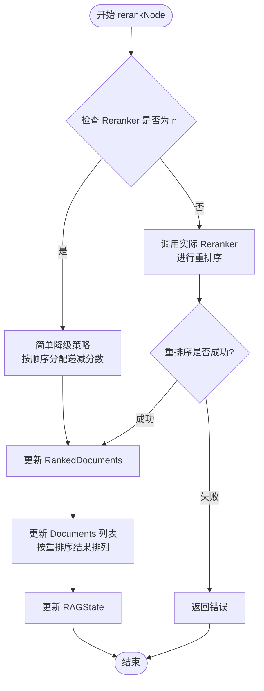
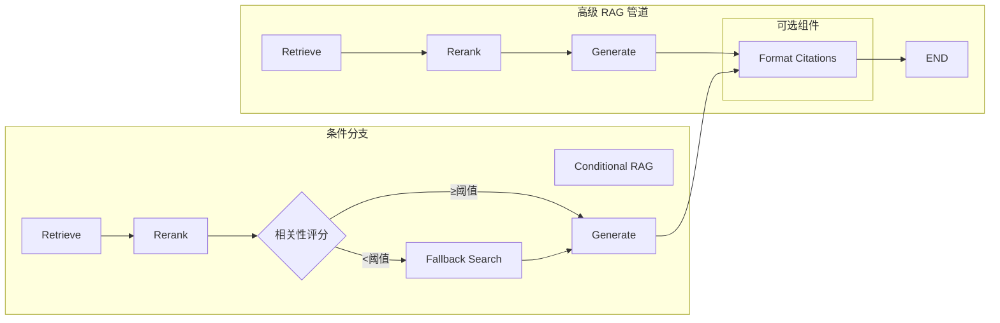
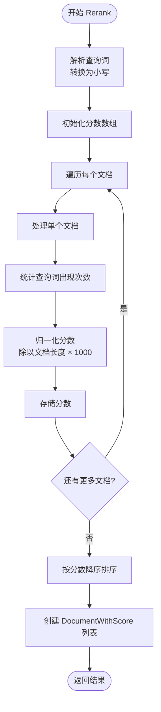

# 重排序机制

<cite>
**本文档中引用的文件**
- [prebuilt/rag.go](file://prebuilt/rag.go)
- [prebuilt/rag_components.go](file://prebuilt/rag_components.go)
- [examples/rag_advanced/main.go](file://examples/rag_advanced/main.go)
- [examples/rag_basic/main.go](file://examples/rag_basic/main.go)
- [examples/rag_conditional/main.go](file://examples/rag_conditional/main.go)
- [prebuilt/rag_test.go](file://prebuilt/rag_test.go)
</cite>

## 目录
1. [简介](#简介)
2. [Reranker 接口设计](#reranker-接口设计)
3. [重排序节点实现](#重排序节点实现)
4. [高级 RAG 管道中的重排序](#高级-rag-管道中的重排序)
5. [SimpleReranker 实现](#simpleranker-实现)
6. [重排序对 RAG 性能的影响](#重排序对-rag-性能的影响)
7. [配置和使用指南](#配置和使用指南)
8. [总结](#总结)

## 简介

重排序机制是高级 RAG（检索增强生成）管道中的关键组件，它在传统的相似度检索基础上提供了更精细的文档相关性评估。通过 `Reranker` 接口和 `rerankNode` 函数的协同工作，系统能够在检索到初步文档后，基于查询语义重新计算文档的相关性得分，从而确保最终生成的答案基于最相关的上下文。

重排序机制的核心价值在于：
- 提升检索结果的质量和相关性
- 确保生成模型获得最佳的上下文信息
- 在高精度问答场景下提供更准确的答案
- 支持复杂的条件路由和降级策略

## Reranker 接口设计

`Reranker` 接口是整个重排序机制的核心抽象，定义了重排序操作的标准契约。

```mermaid
classDiagram
class Reranker {
<<interface>>
+Rerank(ctx Context, query string, documents []Document) ([]DocumentWithScore, error)
}
class SimpleReranker {
+Rerank(ctx Context, query string, documents []Document) ([]DocumentWithScore, error)
}
class DocumentWithScore {
+Document Document
+Score float64
}
class Document {
+PageContent string
+Metadata map[string]interface{}
}
Reranker <|.. SimpleReranker : 实现
SimpleReranker --> DocumentWithScore : 创建
DocumentWithScore --> Document : 包含
```

**图表来源**
- [prebuilt/rag.go](file://prebuilt/rag.go#L52-L55)
- [prebuilt/rag_components.go](file://prebuilt/rag_components.go#L206-L261)

### 接口方法详解

`Reranker` 接口仅包含一个核心方法：

| 方法 | 参数 | 返回值 | 功能描述 |
|------|------|--------|----------|
| `Rerank` | `ctx Context`<br/>`query string`<br/>`documents []Document` | `[]DocumentWithScore`<br/>`error` | 基于查询重新计算文档相关性得分 |

该方法的设计遵循以下原则：
- **语义理解优先**：重排序器能够理解查询与文档之间的语义关系
- **分数标准化**：返回的得分应该具有可比性，便于后续处理
- **错误处理**：提供详细的错误信息以便调试和监控

**章节来源**
- [prebuilt/rag.go](file://prebuilt/rag.go#L52-L55)

## 重排序节点实现

`rerankNode` 函数是 RAG 管道中的核心处理节点，负责协调重排序操作并管理状态流转。



**图表来源**
- [prebuilt/rag.go](file://prebuilt/rag.go#L277-L307)

### 内部逻辑分析

`rerankNode` 函数的执行流程体现了系统设计的优雅性和容错性：

#### 1. 降级策略
当 `Reranker` 为 `nil` 时，系统采用简单的递减分数策略：
- 文档按原始检索顺序排列
- 第一个文档得分为 1.0
- 后续文档分数递减 0.1
- 这种策略确保至少有合理的排序依据

#### 2. 正常重排序流程
当 `Reranker` 存在时：
- 调用 `Reranker.Rerank()` 方法
- 处理可能的错误情况
- 更新 `RankedDocuments` 字段
- 根据重排序结果重新排列 `Documents` 列表

#### 3. 状态更新
重排序完成后，系统会：
- 更新 `RankedDocuments`：存储带分数的文档列表
- 更新 `Documents`：按重排序结果重新排列
- 维护状态一致性

**章节来源**
- [prebuilt/rag.go](file://prebuilt/rag.go#L277-L307)

## 高级 RAG 管道中的重排序

在高级 RAG 管道中，重排序机制被集成到完整的执行链中，形成 "Retrieve -> Rerank -> Generate" 的三阶段流程。



**图表来源**
- [prebuilt/rag.go](file://prebuilt/rag.go#L148-L248)

### BuildAdvancedRAG 方法详解

`BuildAdvancedRAG` 方法展示了重排序节点如何被动态添加到管道中：

#### 条件添加逻辑
```go
// 添加重排序节点的条件判断
if p.config.UseReranking && p.config.Reranker != nil {
    p.graph.AddNode("rerank", p.rerankNode)
}
```

#### 执行链构建
根据重排序节点的存在与否，系统构建不同的执行路径：
- **启用重排序**：`retrieve → rerank → generate`
- **禁用重排序**：`retrieve → generate`

这种设计允许系统根据配置灵活调整处理流程，既支持基础功能，又提供高级特性。

**章节来源**
- [prebuilt/rag.go](file://prebuilt/rag.go#L148-L190)

## SimpleReranker 实现

`SimpleReranker` 是系统提供的默认重排序实现，展示了重排序机制的基本原理和实现方式。



**图表来源**
- [prebuilt/rag_components.go](file://prebuilt/rag_components.go#L216-L261)

### 关键算法细节

#### 查询词处理
- 将查询转换为小写以提高匹配准确性
- 使用 `strings.Fields` 按空格分割提取关键词
- 支持多词查询的精确匹配

#### 分数计算公式
```go
score = (查询词出现次数 / 文档长度) × 1000
```

这个公式的优点：
- **长度无关**：通过归一化消除文档长度影响
- **可扩展性**：系数 1000 提供足够的分数范围
- **简单高效**：基于词频的简单但有效的相关性度量

#### 排序策略
- 使用冒泡排序算法对文档进行降序排列
- 时间复杂度 O(n²)，适用于小型文档集合
- 确保最高相关性的文档排在首位

**章节来源**
- [prebuilt/rag_components.go](file://prebuilt/rag_components.go#L216-L261)

## 重排序对 RAG 性能的影响

重排序机制对 RAG 系统的整体性能和质量产生显著影响，特别是在高精度问答场景下。

### 性能优势对比

| 特性 | 不使用重排序 | 使用重排序 |
|------|-------------|-----------|
| **检索质量** | 基于向量相似度的初步排序 | 基于语义理解的精细排序 |
| **上下文相关性** | 可能包含低相关文档 | 确保高质量上下文 |
| **生成准确性** | 受限于检索质量 | 显著提升答案准确性 |
| **计算开销** | 低（仅向量搜索） | 中等（额外重排序计算） |
| **内存使用** | 低 | 中等（需要存储中间结果） |

### 高精度问答场景的应用

在需要高准确性的问答场景中，重排序机制的价值尤为突出：

#### 场景 1：技术文档问答
- **挑战**：技术术语的同义表达和上下文依赖
- **解决方案**：重排序能够识别语义相似但表达不同的文档
- **效果**：显著提高技术问题回答的准确性

#### 场景 2：法律咨询问答
- **挑战**：法律条文的专业性和上下文重要性
- **解决方案**：重排序确保最关键的法律条款优先显示
- **效果**：提供更可靠和准确的法律建议

#### 场景 3：医疗知识问答
- **挑战**：医学术语的精确性和安全性要求
- **解决方案**：重排序过滤掉不相关或过时的信息
- **效果**：确保医疗建议的安全性和准确性

### 性能权衡分析

重排序机制的引入涉及以下权衡：

#### 计算成本
- **正面**：提升下游生成质量
- **负面**：增加推理时间（通常 20-50%）

#### 内存消耗
- **正面**：改善最终输出质量
- **负面**：需要额外内存存储中间结果

#### 实际部署考虑
- 对于实时性要求高的应用，可以考虑异步重排序
- 对于批处理场景，重排序带来的延迟影响较小
- 可以根据查询复杂度动态决定是否启用重排序

## 配置和使用指南

### 基本配置

在 `RAGConfig` 中启用重排序功能：

```go
config := prebuilt.DefaultRAGConfig()
config.UseReranking = true
config.Reranker = prebuilt.NewSimpleReranker()
```

### 完整使用示例

参考 `examples/rag_advanced/main.go` 中的完整配置：

#### 1. 文档准备和向量化
```go
// 创建文档和分块
splitter := prebuilt.NewSimpleTextSplitter(200, 50)
chunks, _ := splitter.SplitDocuments(documents)

// 生成嵌入并存储
embedder := prebuilt.NewMockEmbedder(256)
vectorStore := prebuilt.NewInMemoryVectorStore(embedder)
embeddings, _ := embedder.EmbedDocuments(ctx, texts)
vectorStore.AddDocuments(ctx, chunks, embeddings)
```

#### 2. 检索器和重排序器配置
```go
// 创建检索器和重排序器
retriever := prebuilt.NewVectorStoreRetriever(vectorStore, 5)
reranker := prebuilt.NewSimpleReranker()

// 配置 RAG 管道
config := prebuilt.DefaultRAGConfig()
config.Retriever = retriever
config.Reranker = reranker
config.LLM = llm
config.TopK = 5
config.UseReranking = true
config.IncludeCitations = true
```

#### 3. 管道构建和执行
```go
pipeline := prebuilt.NewRAGPipeline(config)
pipeline.BuildAdvancedRAG()
runnable, _ := pipeline.Compile()

// 执行查询
result, _ := runnable.Invoke(ctx, prebuilt.RAGState{
    Query: "What is LangGraph?",
})
finalState := result.(prebuilt.RAGState)
```

### 最佳实践建议

#### 1. 性能优化
- 根据硬件资源选择合适的 TopK 值
- 考虑使用异步重排序处理
- 对于高频查询，实施重排序结果缓存

#### 2. 质量控制
- 设置合理的相关性阈值
- 监控重排序前后的文档分布变化
- 定期评估重排序器的性能指标

#### 3. 错误处理
- 实现重排序失败的降级策略
- 监控重排序过程中的异常情况
- 提供详细的日志记录以便调试

**章节来源**
- [examples/rag_advanced/main.go](file://examples/rag_advanced/main.go#L123-L138)

## 总结

重排序机制作为高级 RAG 管道的核心组件，通过 `Reranker` 接口和 `rerankNode` 函数的协同工作，实现了从粗粒度向量相似度到细粒度语义相关性的跃迁。

### 关键技术特点

1. **接口设计优雅**：`Reranker` 接口简洁明了，易于扩展和替换
2. **执行流程清晰**：`rerankNode` 函数逻辑分明，支持降级策略
3. **管道集成完善**：与高级 RAG 管道无缝集成，形成完整的处理链
4. **实现方案多样**：从简单的关键词匹配到复杂的语义理解

### 应用价值

重排序机制在以下方面展现出显著价值：
- **提升检索质量**：通过语义理解改善文档排序
- **确保生成质量**：为生成模型提供最佳上下文
- **支持复杂场景**：满足高精度问答的严格要求
- **提供降级保障**：在重排序器缺失时仍能正常工作

### 发展方向

未来的重排序机制可以在以下方面进一步发展：
- **更复杂的语义模型**：集成预训练的语言模型进行深度重排序
- **多模态支持**：处理文本、图像等多种类型的内容
- **实时学习能力**：根据用户反馈动态优化重排序策略
- **跨语言支持**：处理多语言环境下的文档重排序

重排序机制的成功实现证明了 LangGraphGo 在构建复杂、高性能 RAG 系统方面的强大能力，为构建下一代智能问答系统奠定了坚实的基础。