# 预构建组件

<cite>
**本文档中引用的文件**
- [prebuilt/create_agent.go](file://prebuilt/create_agent.go)
- [prebuilt/react_agent.go](file://prebuilt/react_agent.go)
- [prebuilt/supervisor.go](file://prebuilt/supervisor.go)
- [prebuilt/rag.go](file://prebuilt/rag.go)
- [prebuilt/tool_executor.go](file://prebuilt/tool_executor.go)
- [prebuilt/tool_node.go](file://prebuilt/tool_node.go)
- [prebuilt/rag_components.go](file://prebuilt/rag_components.go)
- [examples/create_agent/main.go](file://examples/create_agent/main.go)
- [examples/react_agent/main.go](file://examples/react_agent/main.go)
- [examples/supervisor/main.go](file://examples/supervisor/main.go)
- [examples/rag_basic/main.go](file://examples/rag_basic/main.go)
- [examples/rag_advanced/main.go](file://examples/rag_advanced/main.go)
- [examples/rag_conditional/main.go](file://examples/rag_conditional/main.go)
- [examples/rag_with_embeddings/main.go](file://examples/rag_with_embeddings/main.go)
- [README.md](file://README.md)
</cite>

## 目录
1. [简介](#简介)
2. [项目结构概览](#项目结构概览)
3. [核心预构建组件](#核心预构建组件)
4. [CreateAgent 组件详解](#createagent-组件详解)
5. [ReAct Agent 实现原理](#react-agent-实现原理)
6. [Supervisor 协调器组件](#supervisor-协调器组件)
7. [RAG 检索增强生成组件](#rag-检索增强生成组件)
8. [工具执行器架构](#工具执行器架构)
9. [组件依赖关系分析](#组件依赖关系分析)
10. [最佳实践与定制指南](#最佳实践与定制指南)
11. [总结](#总结)

## 简介

LangGraphGo 是一个强大的库，专门用于构建具有状态感知的多参与者应用程序。它扩展了 LangChain 表达式语言，提供了协调多个链（或参与者）跨多个计算步骤的循环能力。本文档全面介绍了 LangGraphGo 中的所有预构建高级组件，这些组件旨在加速常见 AI 应用的开发。

这些预构建组件基于核心图引擎构建，为开发者提供了开箱即用的解决方案，同时保持了高度的可定制性。每个组件都经过精心设计，以解决特定的 AI 应用场景需求。

## 项目结构概览

LangGraphGo 的预构建组件主要位于 `prebuilt` 目录下，包含了各种高级功能模块：

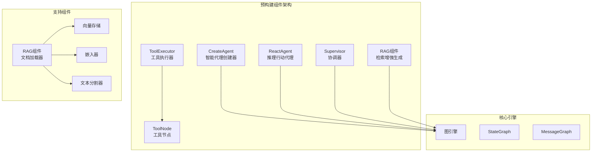

**图表来源**
- [prebuilt/create_agent.go](file://prebuilt/create_agent.go#L1-L50)
- [prebuilt/react_agent.go](file://prebuilt/react_agent.go#L1-L50)
- [prebuilt/supervisor.go](file://prebuilt/supervisor.go#L1-L50)
- [prebuilt/rag.go](file://prebuilt/rag.go#L1-L50)

## 核心预构建组件

LangGraphGo 提供了四个主要的预构建组件，每个组件都针对特定的应用场景进行了优化：

### 组件功能对比表

| 组件 | 主要用途 | 核心特性 | 适用场景 |
|------|----------|----------|----------|
| CreateAgent | 智能代理创建 | 灵活配置、系统消息、状态修改 | 通用智能助手、对话系统 |
| ReactAgent | 推理行动模式 | 自动工具调用、循环推理 | 任务导向对话、问题解决 |
| Supervisor | 多代理协调 | 角色分配、工作流编排 | 多智能体系统、复杂工作流 |
| RAG | 检索增强生成 | 文档检索、上下文生成 | 知识问答、文档分析 |

**章节来源**
- [prebuilt/create_agent.go](file://prebuilt/create_agent.go#L45-L252)
- [prebuilt/react_agent.go](file://prebuilt/react_agent.go#L13-L182)
- [prebuilt/supervisor.go](file://prebuilt/supervisor.go#L13-L153)
- [prebuilt/rag.go](file://prebuilt/rag.go#L1-L392)

## CreateAgent 组件详解

### 架构设计

CreateAgent 是一个工厂函数，用于为智能代理构建状态图（StateGraph）。它提供了比基础 ReactAgent 更灵活的配置选项，支持函数式选项模式来轻松配置系统消息、状态修改器等。

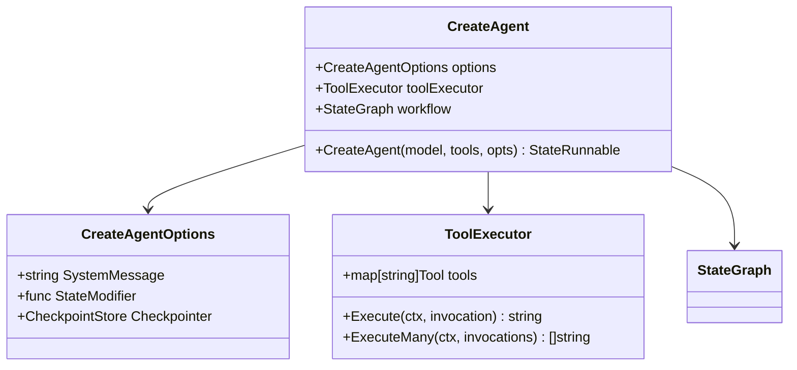

**图表来源**
- [prebuilt/create_agent.go](file://prebuilt/create_agent.go#L13-L43)
- [prebuilt/tool_executor.go](file://prebuilt/tool_executor.go#L16-L84)

### 函数式选项模式

CreateAgent 支持多种配置选项，采用函数式选项模式：

#### 可用选项
- **WithSystemMessage**: 设置代理的系统提示词
- **WithStateModifier**: 定义状态修改函数
- **WithCheckpointer**: 配置状态检查点存储

#### 配置示例

```go
// 基础配置
agent, err := CreateAgent(model, tools)

// 高级配置
agent, err := CreateAgent(model, tools,
    WithSystemMessage("你是一个有用的天气助手。始终保持礼貌。"),
    WithStateModifier(func(msgs []llms.MessageContent) []llms.MessageContent {
        log.Printf("当前消息数量: %d", len(msgs))
        return msgs
    }),
)
```

### 工作流程

CreateAgent 的执行遵循以下工作流程：

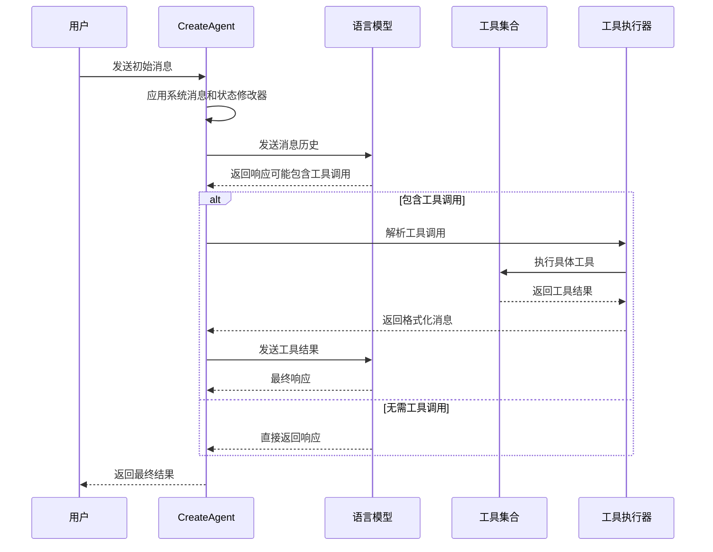

**图表来源**
- [prebuilt/create_agent.go](file://prebuilt/create_agent.go#L65-L250)

### API 说明

#### 核心函数签名
```go
func CreateAgent(
    model llms.Model, 
    inputTools []tools.Tool, 
    opts ...CreateAgentOption
) (*graph.StateRunnable, error)
```

#### 配置选项类型
```go
type CreateAgentOption func(*CreateAgentOptions)
```

#### 状态结构
代理维护的消息状态结构：
- **messages**: []llms.MessageContent - 对话历史记录

**章节来源**
- [prebuilt/create_agent.go](file://prebuilt/create_agent.go#L45-L252)
- [examples/create_agent/main.go](file://examples/create_agent/main.go#L30-L86)

## ReAct Agent 实现原理

### 核心理念

ReAct（Reasoning and Acting）代理结合了推理（Reasoning）和行动（Acting）的能力。它能够分析问题、制定计划、执行工具调用，并根据结果迭代改进。

### 架构实现

ReAct Agent 的实现相对简洁，专注于推理和工具调用的循环：

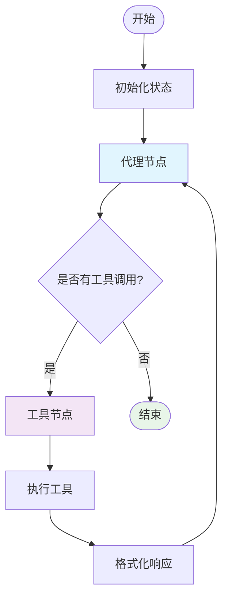

**图表来源**
- [prebuilt/react_agent.go](file://prebuilt/react_agent.go#L28-L181)

### 工具调用机制

ReAct Agent 的工具调用遵循标准的函数调用模式：

#### 工具定义格式
```go
// 工具接口
type Tool interface {
    Name() string
    Description() string
    Call(ctx context.Context, input string) (string, error)
}
```

#### 工具调用流程
1. **消息解析**: 从 AI 消息中提取工具调用部分
2. **参数解析**: 将 JSON 参数字符串转换为工具输入
3. **工具执行**: 调用相应的工具函数
4. **结果格式化**: 将工具结果包装为工具消息

### 与 CreateAgent 的区别

| 特性 | ReactAgent | CreateAgent |
|------|------------|-------------|
| 配置灵活性 | 基础配置 | 函数式选项 |
| 系统消息 | 不支持 | 支持 |
| 状态修改 | 不支持 | 支持 |
| 检查点 | 不支持 | 支持 |
| 适用场景 | 简单工具调用 | 复杂对话管理 |

**章节来源**
- [prebuilt/react_agent.go](file://prebuilt/react_agent.go#L13-L182)
- [examples/react_agent/main.go](file://examples/react_agent/main.go#L66-L122)

## Supervisor 协调器组件

### 设计目标

Supervisor 组件负责协调多个代理或工作流，实现复杂的多智能体协作。它充当中央控制器，决定哪个代理应该执行下一个任务。

### 协调机制

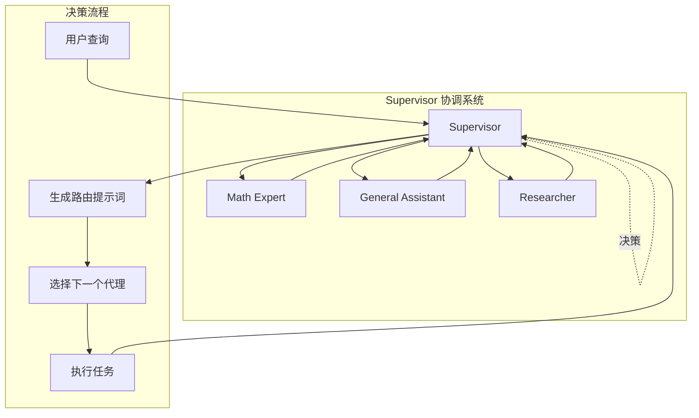

**图表来源**
- [prebuilt/supervisor.go](file://prebuilt/supervisor.go#L29-L153)

### 成员管理

Supervisor 支持动态成员管理：

#### 成员配置
```go
members := map[string]*graph.StateRunnable{
    "MathExpert":       mathAgent,
    "GeneralAssistant": generalAgent,
    "Researcher":       researchAgent,
}
```

#### 决策过程
1. **提示词生成**: 根据可用成员生成系统提示词
2. **工具调用**: 使用路由工具选择下一个执行者
3. **状态更新**: 将选择结果存储在状态中
4. **条件边**: 根据选择结果路由到相应代理

### 工作流程

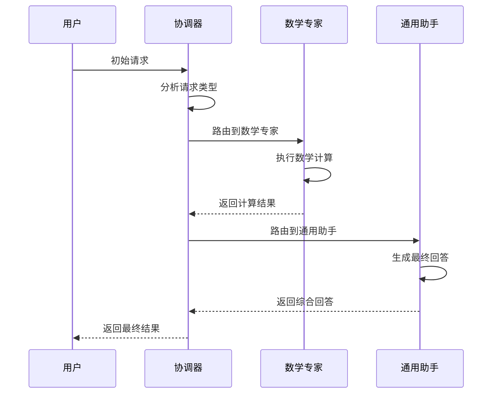

**图表来源**
- [examples/supervisor/main.go](file://examples/supervisor/main.go#L71-L138)

### API 设计

#### 核心函数
```go
func CreateSupervisor(
    model llms.Model, 
    members map[string]*graph.StateRunnable
) (*graph.StateRunnable, error)
```

#### 状态结构
```go
type SupervisorState struct {
    messages []llms.MessageContent
    next     string  // 下一个执行的代理名称
}
```

**章节来源**
- [prebuilt/supervisor.go](file://prebuilt/supervisor.go#L13-L153)
- [examples/supervisor/main.go](file://examples/supervisor/main.go#L52-L138)

## RAG 检索增强生成组件

### 整体架构

RAG（Retrieval-Augmented Generation）组件提供了完整的检索增强生成解决方案，支持多种检索策略和生成模式。

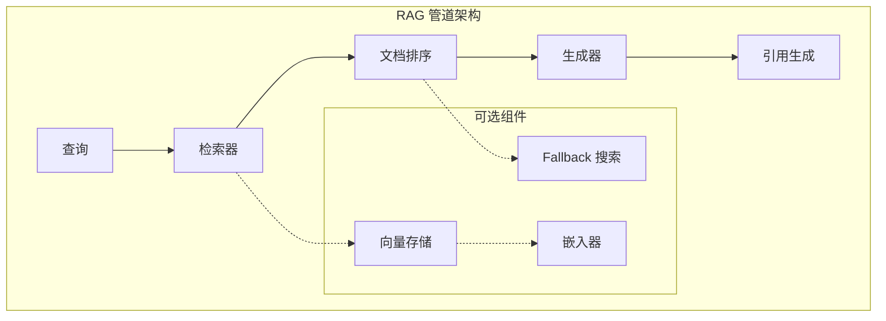

**图表来源**
- [prebuilt/rag.go](file://prebuilt/rag.go#L125-L392)

### 核心组件

#### 1. 文档处理管道

RAG 组件包含多个可插拔的组件：

| 组件类型 | 接口 | 功能 | 实现示例 |
|----------|------|------|----------|
| DocumentLoader | Load() | 加载文档 | StaticDocumentLoader |
| TextSplitter | SplitDocuments() | 文本分割 | SimpleTextSplitter |
| Embedder | EmbedDocuments(), EmbedQuery() | 生成嵌入 | MockEmbedder, LangChainEmbedder |
| VectorStore | AddDocuments(), SimilaritySearch() | 向量存储 | InMemoryVectorStore |
| Retriever | GetRelevantDocuments() | 文档检索 | VectorStoreRetriever |
| Reranker | Rerank() | 文档重排序 | SimpleReranker |

#### 2. 状态管理

RAGState 结构体管理整个管道的状态：

```go
type RAGState struct {
    Query              string              // 查询字符串
    Documents          []Document          // 检索到的文档
    RetrievedDocuments []Document          // 原始检索文档
    RankedDocuments    []DocumentWithScore // 重排序后的文档
    Context            string              // 构建的上下文
    Answer             string              // 生成的答案
    Citations          []string            // 引用列表
    Metadata           map[string]interface{} // 元数据
}
```

### 管道类型

#### 基础 RAG 管道
最简单的实现：检索 → 生成

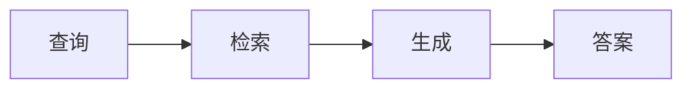

#### 高级 RAG 管道
包含重排序和引用生成：检索 → 重排序 → 生成 → 引用

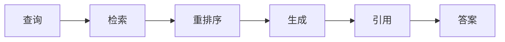

#### 条件 RAG 管道
基于相关性阈值的智能路由：检索 → 重排序 → 条件判断 → 生成/Fallback

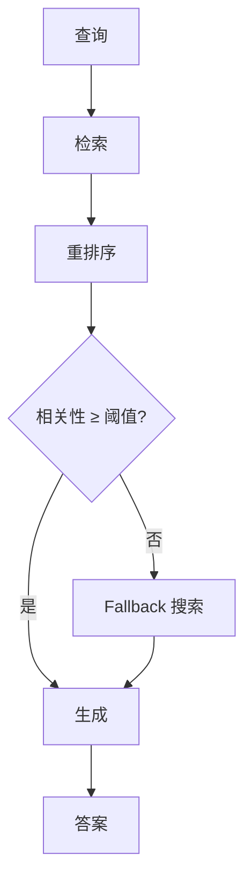

**图表来源**
- [prebuilt/rag.go](file://prebuilt/rag.go#L125-L249)

### 配置选项

#### 默认配置
```go
func DefaultRAGConfig() *RAGConfig {
    return &RAGConfig{
        TopK:             4,                    // 检索前4个文档
        ScoreThreshold:   0.7,                 // 相关性阈值
        UseReranking:     false,               // 是否使用重排序
        UseFallback:      false,               // 是否使用回退搜索
        SystemPrompt:     "You are a helpful assistant.",
        IncludeCitations: true,                // 是否包含引用
        MaxTokens:        1000,                // 最大令牌数
        Temperature:      0.0,                 // 温度参数
    }
}
```

#### 高级配置选项
- **TopK**: 控制检索的文档数量
- **ScoreThreshold**: 相关性阈值，用于条件路由
- **UseReranking**: 启用文档重排序
- **UseFallback**: 启用回退搜索机制
- **IncludeCitations**: 生成引用列表

**章节来源**
- [prebuilt/rag.go](file://prebuilt/rag.go#L69-L105)
- [examples/rag_basic/main.go](file://examples/rag_basic/main.go#L83-L155)
- [examples/rag_advanced/main.go](file://examples/rag_advanced/main.go#L138-L223)
- [examples/rag_conditional/main.go](file://examples/rag_conditional/main.go#L78-L212)

## 工具执行器架构

### 设计原则

工具执行器采用松耦合设计，支持多种工具类型和执行模式：

```mermaid
classDiagram
class ToolExecutor {
+map[string]Tool tools
+Execute(ctx, invocation) string
+ExecuteMany(ctx, invocations) []string
+ToolNode(ctx, state) interface{}
}
class ToolInvocation {
+string Tool
+string ToolInput
}
class Tool {
<<interface>>
+Name() string
+Description() string
+Call(ctx, input) string
}
ToolExecutor --> Tool
ToolExecutor --> ToolInvocation
```

**图表来源**
- [prebuilt/tool_executor.go](file://prebuilt/tool_executor.go#L10-L84)

### 执行模式

#### 单工具执行
```go
type ToolInvocation struct {
    Tool      string `json:"tool"`
    ToolInput string `json:"tool_input"`
}

// 执行单个工具调用
result, err := executor.Execute(ctx, ToolInvocation{
    Tool:      "calculator",
    ToolInput: "2 + 2",
})
```

#### 批量执行
```go
// 并行执行多个工具调用
invocations := []ToolInvocation{
    {Tool: "calculator", ToolInput: "2 + 2"},
    {Tool: "web_search", ToolInput: "最新新闻"},
}
results, err := executor.ExecuteMany(ctx, invocations)
```

### 工具节点

ToolNode 提供了标准化的工具执行接口：

#### 输入支持
- **ToolInvocation**: 单个工具调用
- **[]ToolInvocation**: 多个工具调用
- **map**: 包含 tool 和 tool_input 键的映射

#### 错误处理
- 工具不存在时返回错误
- 工具执行失败时返回错误信息
- 支持部分成功的情况

**章节来源**
- [prebuilt/tool_executor.go](file://prebuilt/tool_executor.go#L10-L84)
- [prebuilt/tool_node.go](file://prebuilt/tool_node.go#L12-L108)

## 组件依赖关系分析

### 核心依赖图

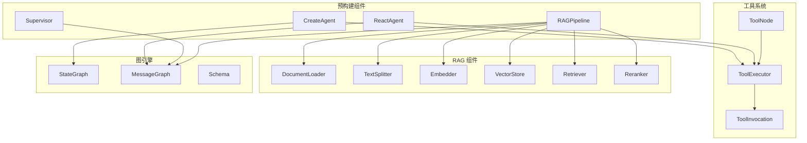

**图表来源**
- [prebuilt/create_agent.go](file://prebuilt/create_agent.go#L1-L12)
- [prebuilt/react_agent.go](file://prebuilt/react_agent.go#L1-L12)
- [prebuilt/supervisor.go](file://prebuilt/supervisor.go#L1-L12)
- [prebuilt/rag.go](file://prebuilt/rag.go#L1-L12)

### 组件间交互

#### CreateAgent 与 ReactAgent
- 共享相同的工具执行器
- CreateAgent 提供更多配置选项
- ReactAgent 更适合简单工具调用场景

#### Supervisor 与其他组件
- 协调多个代理的工作流
- 可以与其他组件组合使用
- 支持动态成员管理

#### RAG 组件的可插拔性
- 支持多种文档加载器
- 可替换的嵌入器和向量存储
- 灵活的检索和重排序策略

**章节来源**
- [prebuilt/create_agent.go](file://prebuilt/create_agent.go#L52-L53)
- [prebuilt/react_agent.go](file://prebuilt/react_agent.go#L15-L16)
- [prebuilt/supervisor.go](file://prebuilt/supervisor.go#L14-L15)

## 最佳实践与定制指南

### 1. CreateAgent 定制指南

#### 系统消息优化
```go
// 针对不同场景的系统消息
var systemMessages = map[string]string{
    "customer_service": "你是一个专业的客户服务代表，始终保持友好和耐心。",
    "technical_support": "你是一个技术专家，能够准确解释技术概念。",
    "creative_writer": "你是一个创意作家，能够产生富有想象力的内容。",
}
```

#### 状态修改器示例
```go
func createStateModifier(maxHistory int) func([]llms.MessageContent) []llms.MessageContent {
    return func(messages []llms.MessageContent) []llms.MessageContent {
        if len(messages) > maxHistory {
            return messages[len(messages)-maxHistory:]
        }
        return messages
    }
}
```

### 2. ReactAgent 扩展

#### 自定义工具开发
```go
type CustomTool struct {
    Name        string
    Description string
    Handler     func(string) string
}

func (t *CustomTool) Name() string {
    return t.Name
}

func (t *CustomTool) Description() string {
    return t.Description
}

func (t *CustomTool) Call(ctx context.Context, input string) (string, error) {
    return t.Handler(input), nil
}
```

### 3. Supervisor 工作流设计

#### 多阶段工作流
```go
// 设计分层的代理结构
layers := map[string][]*graph.StateRunnable{
    "planning": {plannerAgent},
    "execution": {executorAgent, researcherAgent},
    "review": {reviewerAgent},
}
```

#### 动态路由策略
```go
// 基于内容类型的动态路由
func contentTypeRouter(content string) string {
    if strings.Contains(content, "计算") {
        return "calculator"
    } else if strings.Contains(content, "搜索") {
        return "web_search"
    }
    return "general_assistant"
}
```

### 4. RAG 管道优化

#### 性能优化策略
```go
// 缓存配置
cacheConfig := CacheConfig{
    MaxSize: 1000,
    TTL:     3600, // 1小时
}

// 批量处理配置
batchConfig := BatchConfig{
    MaxBatchSize: 10,
    Timeout:      100 * time.Millisecond,
}
```

#### 多模态支持
```go
// 扩展文档类型支持
type MultimodalDocument struct {
    Document
    Images []ImageMetadata
    Audio  []AudioMetadata
}
```

### 5. 错误处理与监控

#### 统一错误处理
```go
type ErrorHandler struct {
    Logger *log.Logger
    Metrics *MetricsCollector
}

func (h *ErrorHandler) HandleError(err error, context string) error {
    h.Logger.Printf("Error in %s: %v", context, err)
    h.Metrics.Increment("errors.total")
    return fmt.Errorf("operation failed: %w", err)
}
```

#### 性能监控
```go
type PerformanceMonitor struct {
    TimingHistogram prometheus.Histogram
    MemoryGauge     prometheus.Gauge
}

func (m *PerformanceMonitor) RecordLatency(operation string, duration time.Duration) {
    m.TimingHistogram.Observe(duration.Seconds())
}
```

### 6. 生产环境部署

#### 配置管理
```go
type AppConfig struct {
    Environment string
    LogLevel    string
    Timeout     time.Duration
    RetryConfig RetryConfig
}

func LoadConfig() (*AppConfig, error) {
    // 从环境变量或配置文件加载
}
```

#### 资源管理
```go
type ResourceManager struct {
    Pool      *sync.Pool
    Limiter   *rate.Limiter
    Telemetry *TelemetryClient
}
```

## 总结

LangGraphGo 的预构建组件为开发者提供了强大而灵活的 AI 应用开发框架。通过合理使用这些组件，可以快速构建复杂的智能应用：

### 核心优势

1. **模块化设计**: 每个组件都可以独立使用或组合
2. **高度可定制**: 支持丰富的配置选项和扩展点
3. **生产就绪**: 提供错误处理、监控和性能优化
4. **生态系统**: 与 LangChain 生态系统无缝集成

### 选择指南

- **简单工具调用**: 使用 ReactAgent
- **复杂对话管理**: 使用 CreateAgent
- **多智能体协作**: 使用 Supervisor
- **知识问答系统**: 使用 RAG 组件

### 发展方向

随着 AI 技术的发展，这些预构建组件将继续演进，支持更多先进的功能，如：

- 多模态处理能力
- 实时协作功能
- 更智能的路由算法
- 更高效的缓存机制

通过掌握这些预构建组件的使用方法和定制技巧，开发者可以充分发挥 LangGraphGo 的潜力，构建出更加智能和高效的 AI 应用。