# 人机协作

<cite>
**本文档中引用的文件**
- [examples/human_in_the_loop/main.go](file://examples/human_in_the_loop/main.go)
- [examples/dynamic_interrupt/main.go](file://examples/dynamic_interrupt/main.go)
- [graph/graph.go](file://graph/graph.go)
- [graph/state_graph.go](file://graph/state_graph.go)
- [graph/interrupt_test.go](file://graph/interrupt_test.go)
- [graph/resume_test.go](file://graph/resume_test.go)
- [graph/context.go](file://graph/context.go)
- [graph/callbacks.go](file://graph/callbacks.go)
- [graph/listeners.go](file://graph/listeners.go)
- [graph/schema.go](file://graph/schema.go)
</cite>

## 目录
1. [简介](#简介)
2. [动态中断机制概述](#动态中断机制概述)
3. [核心组件架构](#核心组件架构)
4. [静态中断配置](#静态中断配置)
5. [动态中断实现](#动态中断实现)
6. [状态恢复机制](#状态恢复机制)
7. [实际应用场景](#实际应用场景)
8. [高级特性与扩展](#高级特性与扩展)
9. [生产环境最佳实践](#生产环境最佳实践)
10. [故障排除指南](#故障排除指南)
11. [总结](#总结)

## 简介

LangGraphGo 提供了强大的人机协作功能，通过动态中断（Dynamic Interrupt）机制实现了灵活的工作流控制。这种机制允许工作流在特定节点处暂停执行，等待人工干预或外部输入，然后从断点恢复执行。这对于需要人工审核、决策或数据输入的业务流程至关重要。

本文档将深入探讨 LangGraphGo 的人机协作功能，重点介绍动态中断机制的实现方式，包括静态中断配置、状态恢复、异常处理等核心概念，并提供实际应用示例和最佳实践建议。

## 动态中断机制概述

动态中断是 LangGraphGo 实现人机协作的核心机制，它允许节点在运行时暂停执行并等待外部输入。与静态中断不同，动态中断可以在节点逻辑内部根据条件决定是否中断。

### 核心概念

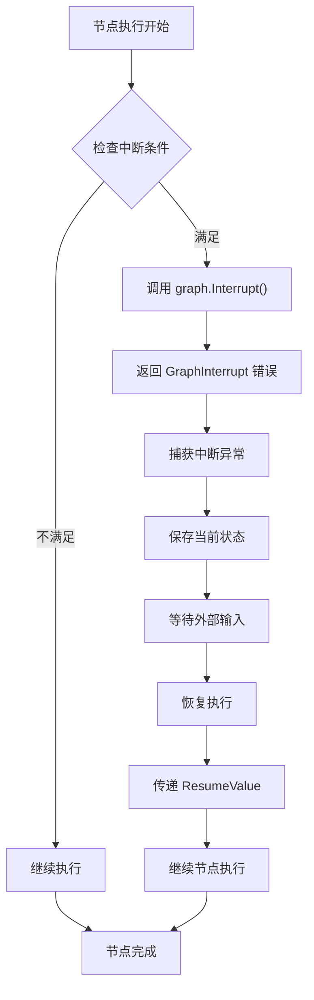

**图表来源**
- [graph/graph.go](file://graph/graph.go#L43-L50)
- [examples/dynamic_interrupt/main.go](file://examples/dynamic_interrupt/main.go#L17-L30)

### 中断类型

LangGraphGo 支持两种主要的中断类型：

1. **静态中断（Static Interrupt）**：通过配置在特定节点前或后暂停
2. **动态中断（Dynamic Interrupt）**：在节点执行过程中根据条件决定是否中断

## 核心组件架构

### GraphInterrupt 结构体

动态中断的核心是 `GraphInterrupt` 结构体，它包含了中断发生时的所有关键信息：

```mermaid
classDiagram
class GraphInterrupt {
+string Node
+interface{} State
+[]string NextNodes
+interface{} InterruptValue
+Error() string
}
class Config {
+[]string InterruptBefore
+[]string InterruptAfter
+[]string ResumeFrom
+interface{} ResumeValue
+[]CallbackHandler Callbacks
+map[string]interface{} Metadata
+[]string Tags
}
class Node {
+string Name
+func(ctx, state) (interface{}, error) Function
}
GraphInterrupt --> Config : "配置"
GraphInterrupt --> Node : "中断节点"
```

**图表来源**
- [graph/graph.go](file://graph/graph.go#L24-L34)
- [graph/callbacks.go](file://graph/callbacks.go#L40-L71)

**章节来源**
- [graph/graph.go](file://graph/graph.go#L24-L41)
- [graph/callbacks.go](file://graph/callbacks.go#L40-L71)

### 上下文管理

中断机制依赖于上下文（Context）系统来传递恢复值：

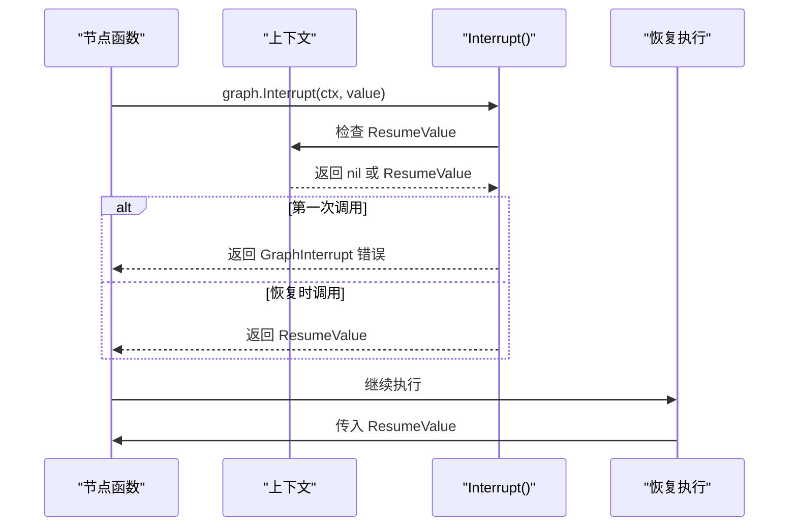

**图表来源**
- [graph/graph.go](file://graph/graph.go#L43-L50)
- [graph/context.go](file://graph/context.go#L8-L16)

**章节来源**
- [graph/graph.go](file://graph/graph.go#L43-L50)
- [graph/context.go](file://graph/context.go#L8-L16)

## 静态中断配置

静态中断通过 `Config` 结构体中的 `InterruptBefore` 和 `InterruptAfter` 字段来配置。

### InterruptBefore 配置

`InterruptBefore` 在指定节点执行之前暂停执行：

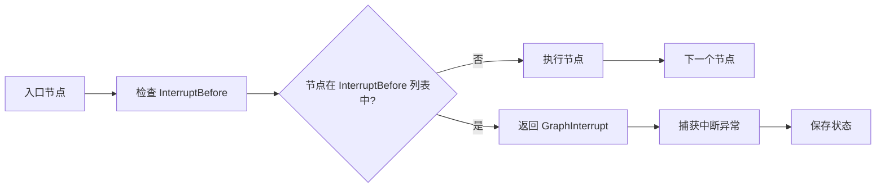

**图表来源**
- [graph/graph.go](file://graph/graph.go#L238-L246)

### InterruptAfter 配置

`InterruptAfter` 在指定节点执行之后暂停执行：

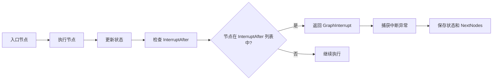

**图表来源**
- [graph/graph.go](file://graph/graph.go#L439-L451)

**章节来源**
- [graph/graph.go](file://graph/graph.go#L238-L246)
- [graph/graph.go](file://graph/graph.go#L439-L451)

## 动态中断实现

动态中断通过 `graph.Interrupt()` 函数实现，可以在节点内部的任何位置调用。

### Interrupt 函数机制

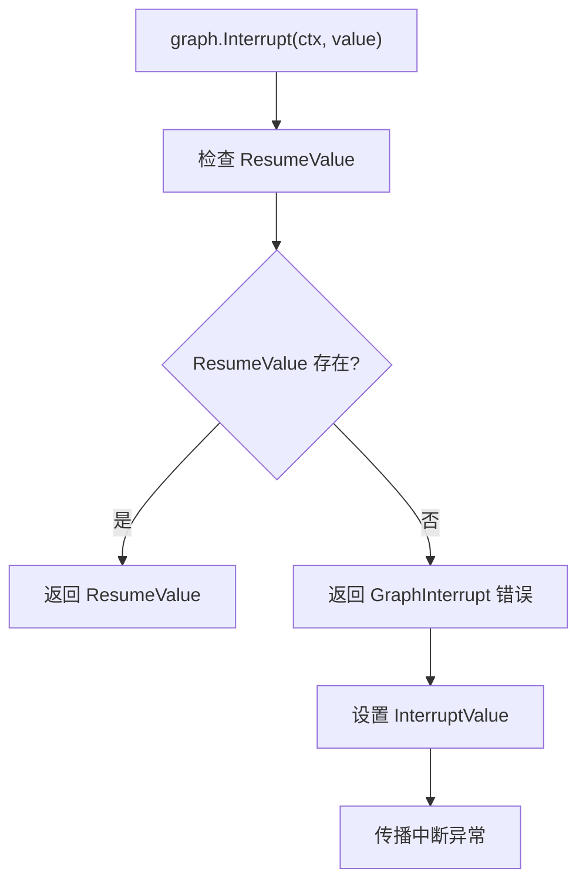

**图表来源**
- [graph/graph.go](file://graph/graph.go#L43-L50)

### 动态中断示例

以下是一个典型的动态中断实现模式：

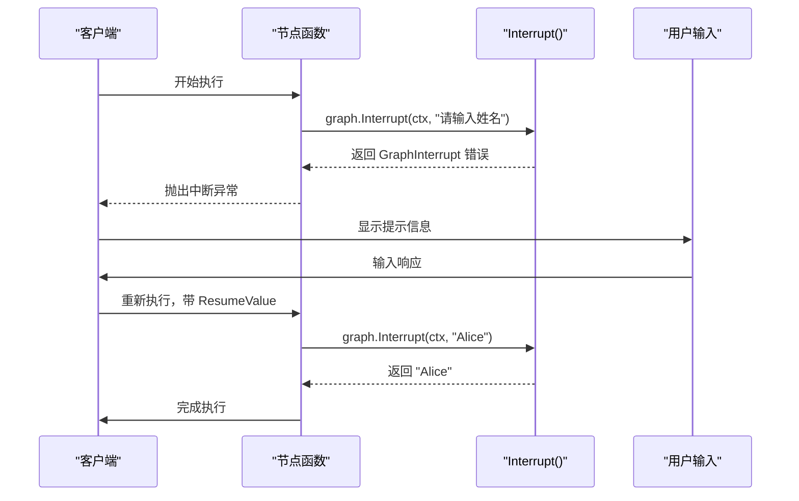

**图表来源**
- [examples/dynamic_interrupt/main.go](file://examples/dynamic_interrupt/main.go#L17-L30)

**章节来源**
- [graph/graph.go](file://graph/graph.go#L43-L50)
- [examples/dynamic_interrupt/main.go](file://examples/dynamic_interrupt/main.go#L17-L30)

## 状态恢复机制

状态恢复是人机协作的关键功能，确保中断后可以从正确的位置继续执行。

### ResumeFrom 配置

`ResumeFrom` 指定从哪个节点开始恢复执行：

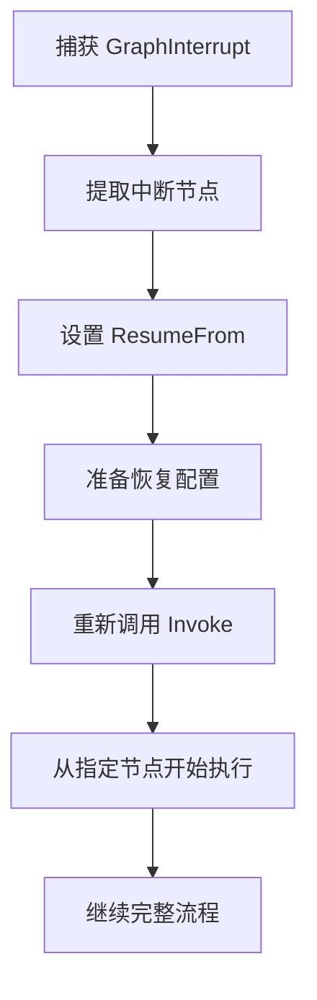

**图表来源**
- [graph/graph.go](file://graph/graph.go#L186-L189)

### 状态一致性保证

LangGraphGo 通过以下机制保证状态一致性：

1. **不可变状态设计**：状态在节点间传递时保持不可变
2. **原子操作**：每个节点的执行是原子性的
3. **回滚支持**：可以通过重新执行恢复到一致状态

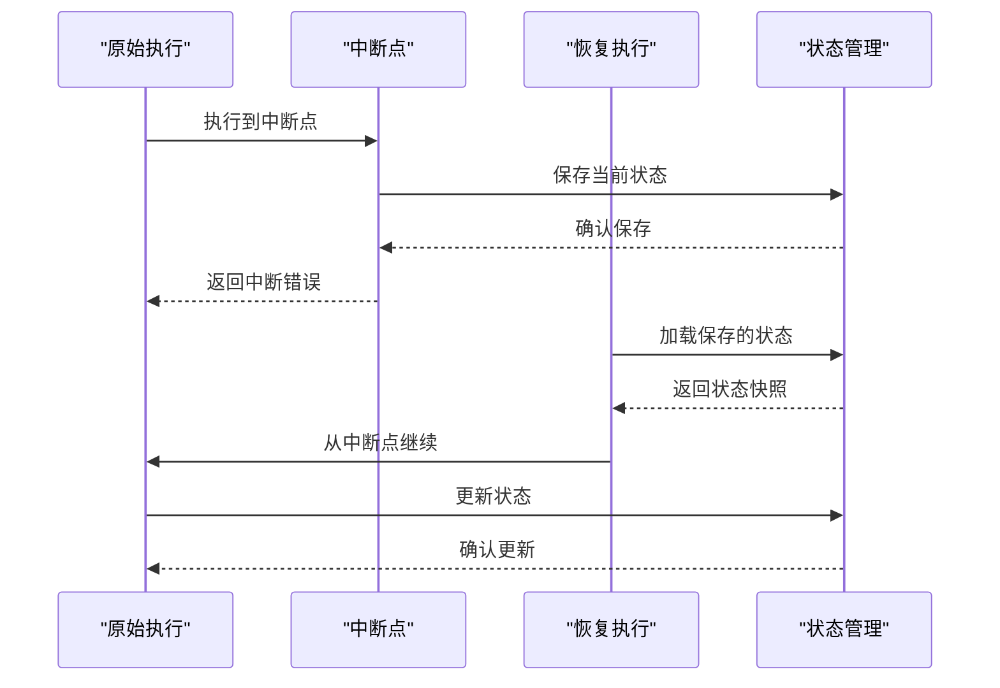

**图表来源**
- [graph/graph.go](file://graph/graph.go#L186-L202)
- [graph/resume_test.go](file://graph/resume_test.go#L45-L56)

**章节来源**
- [graph/graph.go](file://graph/graph.go#L186-L202)
- [graph/resume_test.go](file://graph/resume_test.go#L45-L56)

## 实际应用场景

### 审批流程示例

以下是基于 `examples/human_in_the_loop/main.go` 的审批流程实现：

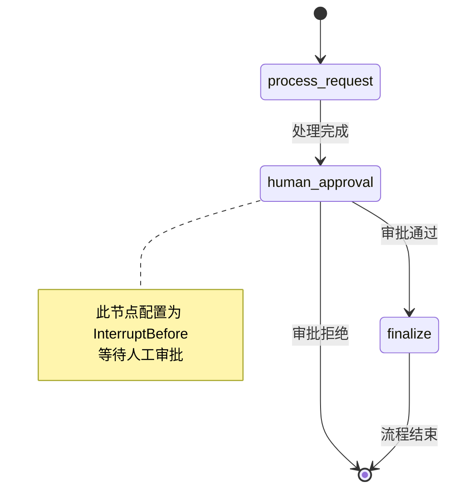

**图表来源**
- [examples/human_in_the_loop/main.go](file://examples/human_in_the_loop/main.go#L24-L47)

### 用户界面集成

在实际应用中，动态中断通常与用户界面集成：

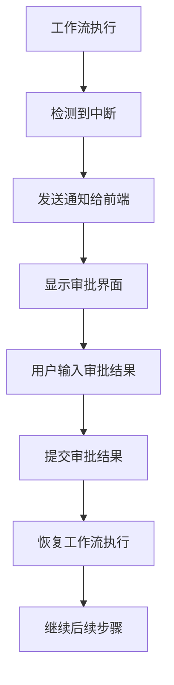

**章节来源**
- [examples/human_in_the_loop/main.go](file://examples/human_in_the_loop/main.go#L24-L47)

## 高级特性与扩展

### 回调机制

LangGraphGo 提供了丰富的回调机制来监控和控制中断过程：

```mermaid
classDiagram
class CallbackHandler {
<<interface>>
+OnChainStart()
+OnChainEnd()
+OnChainError()
+OnToolStart()
+OnToolEnd()
+OnToolError()
}
class GraphCallbackHandler {
<<interface>>
+OnGraphStep(stepNode, state)
}
class Config {
+[]CallbackHandler Callbacks
+map[string]interface{} Metadata
+[]string Tags
}
CallbackHandler <|-- GraphCallbackHandler
Config --> CallbackHandler : "包含多个"
```

**图表来源**
- [graph/callbacks.go](file://graph/callbacks.go#L8-L37)

### 监听器系统

通过监听器系统可以实时监控中断事件：

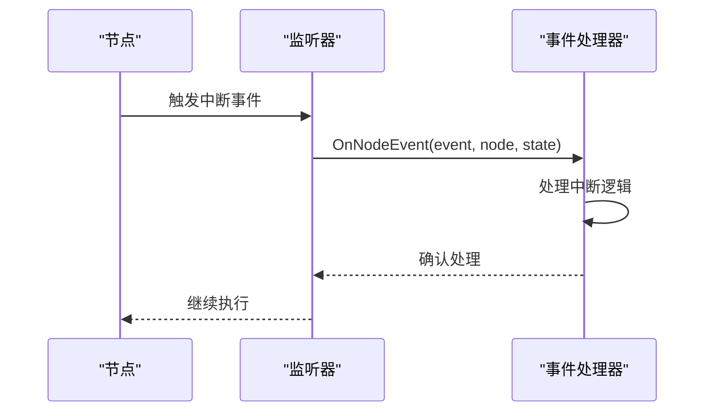

**图表来源**
- [graph/listeners.go](file://graph/listeners.go#L51-L55)

**章节来源**
- [graph/callbacks.go](file://graph/callbacks.go#L8-L37)
- [graph/listeners.go](file://graph/listeners.go#L51-L55)

## 生产环境最佳实践

### 超时处理

在生产环境中，必须考虑超时处理：

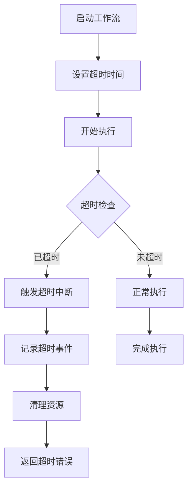

### 异常恢复策略

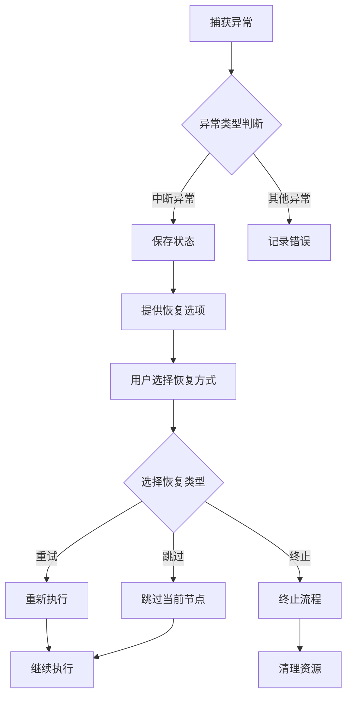

### 安全考量

1. **访问控制**：确保只有授权用户可以恢复中断的工作流
2. **审计日志**：记录所有中断和恢复操作
3. **状态验证**：验证恢复时的状态完整性
4. **并发控制**：防止并发恢复导致的状态冲突

**章节来源**
- [graph/callbacks.go](file://graph/callbacks.go#L57-L58)
- [graph/listeners.go](file://graph/listeners.go#L128-L157)

## 故障排除指南

### 常见问题及解决方案

| 问题类型 | 症状 | 可能原因 | 解决方案 |
|---------|------|----------|----------|
| 中断未触发 | 工作流正常完成 | 配置错误或条件不满足 | 检查 InterruptBefore/After 配置 |
| 恢复失败 | 恢复时出现错误 | 状态不一致或节点不存在 | 验证状态和节点配置 |
| 死锁 | 工作流无法继续 | 循环依赖或条件错误 | 检查节点依赖关系 |
| 性能问题 | 中断处理缓慢 | 监听器过多或回调复杂 | 优化回调逻辑 |

### 调试技巧

1. **启用详细日志**：使用监听器记录详细的执行信息
2. **状态快照**：在关键节点保存状态快照
3. **单元测试**：为中断逻辑编写专门的测试
4. **可视化工具**：使用图形化工具查看工作流状态

**章节来源**
- [graph/interrupt_test.go](file://graph/interrupt_test.go#L10-L64)
- [graph/resume_test.go](file://graph/resume_test.go#L10-L82)

## 总结

LangGraphGo 的人机协作功能通过动态中断机制提供了强大而灵活的工作流控制能力。主要特点包括：

1. **双重中断机制**：同时支持静态和动态中断，适应不同的应用场景
2. **完善的状态管理**：确保中断和恢复过程中的状态一致性
3. **丰富的扩展性**：通过回调和监听器系统提供高度可定制的功能
4. **生产就绪特性**：包含超时处理、异常恢复和安全考量

这些特性使得 LangGraphGo 成为构建复杂业务流程的理想选择，特别是在需要人工干预或外部数据输入的场景中。通过合理使用这些功能，开发者可以构建既高效又灵活的人机协作系统。