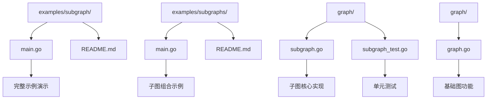
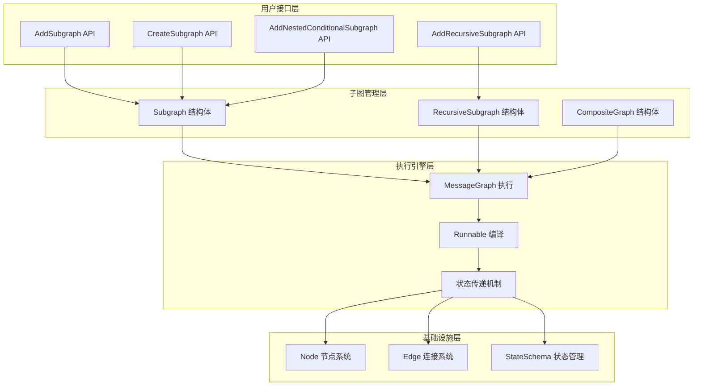
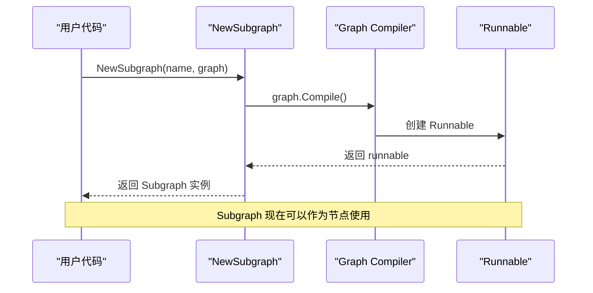
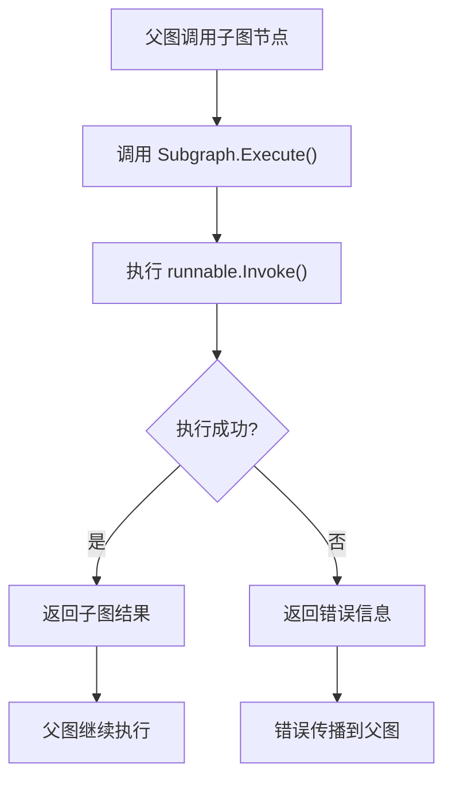
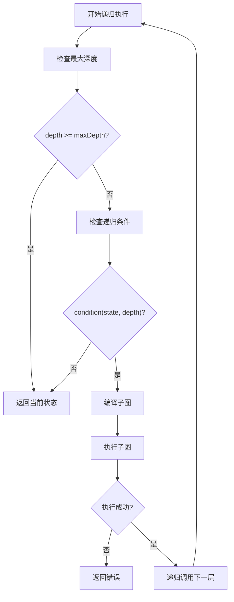
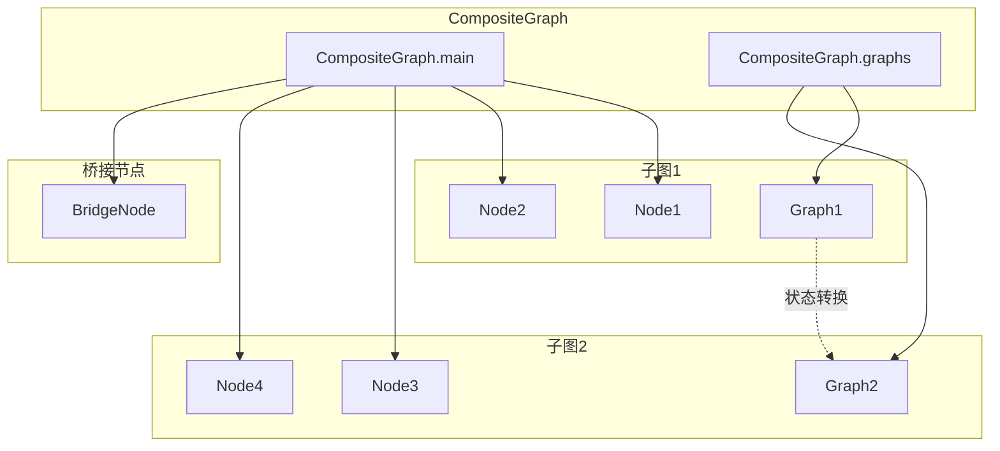
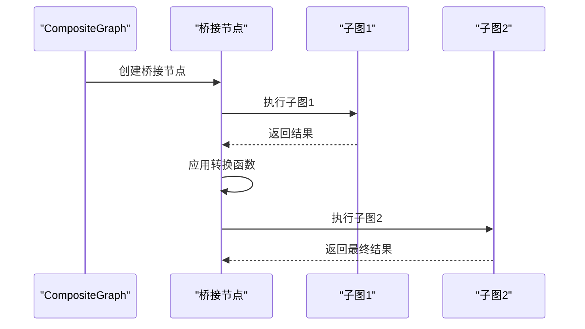
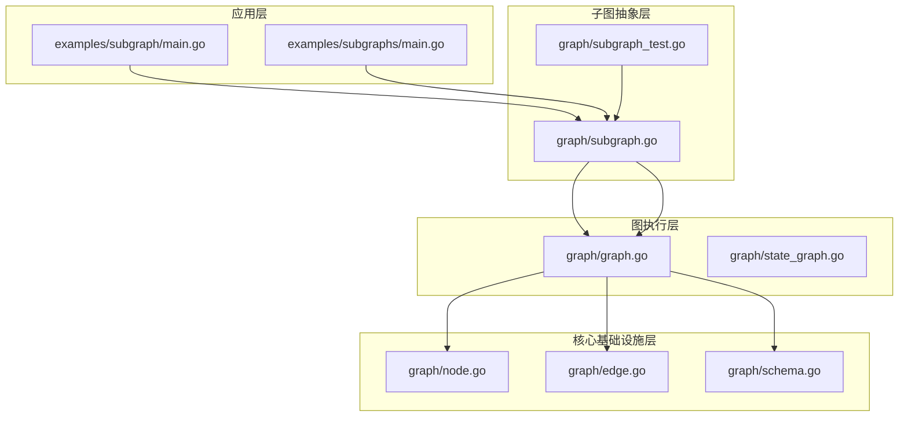

# 子图

<cite>
**本文档中引用的文件**
- [examples/subgraph/main.go](file://examples/subgraph/main.go)
- [examples/subgraphs/main.go](file://examples/subgraphs/main.go)
- [examples/subgraph/README.md](file://examples/subgraph/README.md)
- [examples/subgraphs/README.md](file://examples/subgraphs/README.md)
- [graph/subgraph.go](file://graph/subgraph.go)
- [graph/subgraph_test.go](file://graph/subgraph_test.go)
- [graph/graph.go](file://graph/graph.go)
</cite>

## 目录
1. [简介](#简介)
2. [项目结构](#项目结构)
3. [核心组件](#核心组件)
4. [架构概览](#架构概览)
5. [详细组件分析](#详细组件分析)
6. [依赖关系分析](#依赖关系分析)
7. [性能考虑](#性能考虑)
8. [故障排除指南](#故障排除指南)
9. [结论](#结论)

## 简介

LangGraphGo 的子图功能是一个强大的模块化工作流设计特性，允许开发者将复杂的业务流程分解为可复用的、独立的子图组件。通过子图，可以构建层次化的、可维护的工作流架构，实现逻辑封装、代码复用和状态管理的统一。

子图功能的核心价值在于：
- **模块化设计**：将复杂的工作流拆分为更小、更易管理的组件
- **状态共享**：在父图和子图之间自动传递和合并状态
- **可重用性**：创建通用的工作流组件，在多个场景中重复使用
- **层次化结构**：支持嵌套的、递归的工作流架构

## 项目结构

LangGraphGo 的子图功能主要分布在以下目录结构中：



**图表来源**
- [examples/subgraph/main.go](file://examples/subgraph/main.go#L1-L166)
- [examples/subgraphs/main.go](file://examples/subgraphs/main.go#L1-L59)
- [graph/subgraph.go](file://graph/subgraph.go#L1-L200)

**章节来源**
- [examples/subgraph/README.md](file://examples/subgraph/README.md#L1-L25)
- [examples/subgraphs/README.md](file://examples/subgraphs/README.md#L1-L46)

## 核心组件

LangGraphGo 的子图功能包含以下核心组件：

### Subgraph 结构体
Subgraph 是子图功能的基础数据结构，代表一个可以作为节点使用的嵌套图。

### RecursiveSubgraph 结构体  
RecursiveSubgraph 支持递归调用的子图，允许子图在其内部调用自身。

### CompositeGraph 结构体
CompositeGraph 提供了多个子图的组合能力，支持跨图的状态传递和连接。

### 主要 API 函数
- `AddSubgraph()`：将现有子图添加为父图的节点
- `CreateSubgraph()`：使用构建器函数创建并添加子图
- `AddRecursiveSubgraph()`：添加支持递归调用的子图
- `AddNestedConditionalSubgraph()`：添加具有条件路由的子图

**章节来源**
- [graph/subgraph.go](file://graph/subgraph.go#L8-L200)

## 架构概览

子图功能的整体架构采用分层设计，从底层的图执行到高层的组合管理：



**图表来源**
- [graph/subgraph.go](file://graph/subgraph.go#L38-L171)
- [graph/graph.go](file://graph/graph.go#L74-L138)

## 详细组件分析

### Subgraph 实现原理

Subgraph 是子图功能的核心实现，它将一个 MessageGraph 包装成可以在父图中作为普通节点使用的组件。

#### Subgraph 结构体定义

```mermaid
classDiagram
class Subgraph {
+string name
+MessageGraph graph
+Runnable runnable
+Execute(ctx, state) (interface{}, error)
}
class MessageGraph {
+map[string]Node nodes
+[]Edge edges
+string entryPoint
+AddNode(name, fn)
+AddEdge(from, to)
+Compile() (Runnable, error)
}
class Runnable {
+MessageGraph graph
+Invoke(ctx, state) (interface{}, error)
}
Subgraph --> MessageGraph : "包含"
Subgraph --> Runnable : "编译为"
MessageGraph --> Runnable : "编译结果"
```

**图表来源**
- [graph/subgraph.go](file://graph/subgraph.go#L8-L13)
- [graph/graph.go](file://graph/graph.go#L74-L93)

#### Subgraph 创建流程



**图表来源**
- [graph/subgraph.go](file://graph/subgraph.go#L15-L27)

#### Subgraph 执行机制

当子图作为节点在父图中执行时，其执行过程如下：



**图表来源**
- [graph/subgraph.go](file://graph/subgraph.go#L29-L36)

**章节来源**
- [graph/subgraph.go](file://graph/subgraph.go#L8-L36)

### RecursiveSubgraph 递归子图

RecursiveSubgraph 允许子图在其内部调用自身，实现递归处理逻辑。

#### 递归执行流程



**图表来源**
- [graph/subgraph.go](file://graph/subgraph.go#L135-L159)

#### 递归子图配置参数

| 参数 | 类型 | 描述 | 默认值 |
|------|------|------|--------|
| name | string | 递归子图名称 | 必需 |
| maxDepth | int | 最大递归深度 | 必需 |
| condition | func | 递归继续条件函数 | 必需 |

**章节来源**
- [graph/subgraph.go](file://graph/subgraph.go#L108-L159)

### CompositeGraph 复合图

CompositeGraph 提供了多个子图的组合能力，支持跨图的状态传递和连接。

#### 复合图架构



**图表来源**
- [graph/subgraph.go](file://graph/subgraph.go#L56-L96)

#### 复合图连接机制



**图表来源**
- [graph/subgraph.go](file://graph/subgraph.go#L75-L94)

**章节来源**
- [graph/subgraph.go](file://graph/subgraph.go#L56-L96)

### 子图 API 使用详解

#### AddSubgraph 方法

AddSubgraph 是最常用的子图添加方法，直接将现有的 MessageGraph 添加为父图的节点。

**使用示例**：
```go
// 创建子图
validationSubgraph := graph.NewMessageGraph()
validationSubgraph.AddNode("check_format", validationFunc)
validationSubgraph.SetEntryPoint("check_format")

// 添加到父图
err := parentGraph.AddSubgraph("validation", validationSubgraph)
```

#### CreateSubgraph 方法

CreateSubgraph 使用构建器模式创建子图，提供了更简洁的语法。

**使用示例**：
```go
err := parentGraph.CreateSubgraph("simple_sub", func(sg *graph.MessageGraph) {
    sg.AddNode("step1", step1Func)
    sg.AddNode("step2", step2Func)
    sg.SetEntryPoint("step1")
})
```

#### AddRecursiveSubgraph 方法

AddRecursiveSubgraph 支持递归调用的子图，适用于需要迭代处理的场景。

**使用示例**：
```go
parentGraph.AddRecursiveSubgraph("recursive_process", 10, 
    func(state interface{}, depth int) bool {
        return shouldContinue(state, depth)
    },
    func(sg *graph.MessageGraph) {
        sg.AddNode("process_step", processFunc)
        sg.SetEntryPoint("process_step")
    })
```

**章节来源**
- [graph/subgraph.go](file://graph/subgraph.go#L38-L171)

## 依赖关系分析

子图功能的依赖关系体现了清晰的分层架构：



**图表来源**
- [examples/subgraph/main.go](file://examples/subgraph/main.go#L1-L10)
- [examples/subgraphs/main.go](file://examples/subgraphs/main.go#L1-L10)
- [graph/subgraph.go](file://graph/subgraph.go#L1-L10)
- [graph/graph.go](file://graph/graph.go#L1-L10)

### 关键依赖关系

1. **Subgraph 依赖 MessageGraph**：Subgraph 包含一个 MessageGraph 实例
2. **Runnable 依赖 MessageGraph**：Runnable 是 MessageGraph 的编译结果
3. **状态传递依赖 StateSchema**：确保父子图之间的状态兼容性
4. **错误处理依赖 graph 包**：继承了整个 graph 包的错误处理机制

**章节来源**
- [graph/subgraph.go](file://graph/subgraph.go#L1-L200)
- [graph/graph.go](file://graph/graph.go#L1-L200)

## 性能考虑

### 编译优化

子图的性能主要体现在编译阶段的优化：

1. **延迟编译**：子图只在首次执行时编译，避免不必要的开销
2. **缓存机制**：编译后的 Runnable 被缓存，避免重复编译
3. **内存管理**：及时释放不再需要的编译资源

### 执行效率

1. **状态传递优化**：最小化状态复制和序列化开销
2. **递归深度限制**：防止栈溢出和无限递归
3. **条件检查优化**：递归子图中的条件检查应尽量高效

### 最佳实践建议

1. **合理设置递归深度**：根据实际需求设置合适的最大深度
2. **优化子图大小**：保持子图的粒度适中，既不过于庞大也不过于细碎
3. **状态结构设计**：设计扁平化的状态结构，减少嵌套层级

## 故障排除指南

### 常见问题及解决方案

#### 1. 子图编译失败

**问题描述**：调用 `AddSubgraph` 或 `CreateSubgraph` 时返回编译错误

**可能原因**：
- 子图缺少入口点（entryPoint）
- 子图中存在循环依赖
- 子图节点函数返回类型不匹配

**解决方案**：
```go
// 确保设置入口点
subgraph.SetEntryPoint("initial_node")

// 检查节点函数签名
func myNode(ctx context.Context, state interface{}) (interface{}, error) {
    // 确保返回类型正确
    return processedState, nil
}
```

#### 2. 状态传递异常

**问题描述**：子图执行后状态丢失或格式不正确

**可能原因**：
- 父子图状态结构不兼容
- 子图节点未正确返回状态
- 状态合并函数冲突

**解决方案**：
```go
// 确保状态结构兼容
type SharedState struct {
    CommonField string
    SpecificField interface{}
}

// 在子图节点中正确返回状态
func nodeFunc(ctx context.Context, state interface{}) (interface{}, error) {
    // 处理状态
    newState := state.(SharedState)
    newState.CommonField = "updated"
    return newState, nil
}
```

#### 3. 递归子图死循环

**问题描述**：递归子图无法终止，导致无限递归

**可能原因**：
- 递归条件始终为真
- 最大深度设置不合理
- 状态变化不符合预期

**解决方案**：
```go
// 设置合理的递归条件
func recursiveCondition(state interface{}, depth int) bool {
    currentState := state.(ProcessingState)
    // 确保条件最终会变为 false
    return currentState.RemainingItems > 0 && depth < MAX_DEPTH
}
```

**章节来源**
- [graph/subgraph_test.go](file://graph/subgraph_test.go#L10-L47)
- [graph/subgraph.go](file://graph/subgraph.go#L15-L36)

## 结论

LangGraphGo 的子图功能为复杂工作流的设计提供了强大而灵活的解决方案。通过模块化的设计理念，它实现了：

### 核心优势

1. **架构清晰**：支持层次化的、可维护的工作流设计
2. **开发效率**：提高代码复用率，减少重复开发工作
3. **调试友好**：独立的子图便于单元测试和调试
4. **扩展性强**：支持递归和条件路由等高级功能

### 设计原则

1. **单一职责**：每个子图专注于特定的功能领域
2. **状态隔离**：保持子图内部状态的封装性
3. **接口统一**：所有子图都遵循相同的节点接口规范
4. **错误透明**：子图错误能够正确传播到父图

### 应用场景

- **业务流程分解**：将复杂的业务流程拆分为验证、处理、输出等子步骤
- **微服务集成**：将独立的服务封装为子图组件
- **算法实现**：递归算法的可视化和模块化
- **状态机设计**：复杂的有限状态机实现

### 发展方向

随着 LangGraphGo 的持续发展，子图功能有望在以下方面得到进一步增强：
- 更丰富的组合操作符
- 更强的类型安全保证
- 更完善的调试和监控工具
- 更高效的执行引擎

通过合理运用子图功能，开发者可以构建出既强大又优雅的工作流系统，为复杂的业务需求提供可靠的解决方案。