# 并行执行

<cite>
**本文档中引用的文件**
- [examples/parallel_execution/main.go](file://examples/parallel_execution/main.go)
- [graph/parallel.go](file://graph/parallel.go)
- [graph/parallel_execution_test.go](file://graph/parallel_execution_test.go)
- [graph/parallel_test.go](file://graph/parallel_test.go)
- [graph/state_graph.go](file://graph/state_graph.go)
- [graph/schema.go](file://graph/schema.go)
- [examples/parallel_execution/README.md](file://examples/parallel_execution/README.md)
</cite>

## 目录
1. [简介](#简介)
2. [项目结构](#项目结构)
3. [核心组件](#核心组件)
4. [架构概览](#架构概览)
5. [详细组件分析](#详细组件分析)
6. [扇出-扇入工作流](#扇出-扇入工作流)
7. [状态合并策略](#状态合并策略)
8. [错误处理机制](#错误处理机制)
9. [性能对比分析](#性能对比分析)
10. [最佳实践建议](#最佳实践建议)
11. [故障排除指南](#故障排除指南)
12. [结论](#结论)

## 简介

LangGraphGo 提供了一套强大的并行执行机制，允许开发者在图中同时执行多个节点以提高性能。该系统通过 `AddParallelNodes`、`FanOutFanIn` 和 `MapReduceNode` 等方法实现了多种并行模式，包括扇出-扇入（fan-out/fan-in）和映射-归约（map-reduce）模式。

并行执行的核心优势在于能够充分利用多核处理器的计算能力，显著减少复杂工作流的总执行时间。系统提供了完善的错误处理、状态合并和上下文取消机制，确保并行操作的可靠性和可预测性。

## 项目结构

LangGraphGo 的并行执行功能主要分布在以下关键文件中：

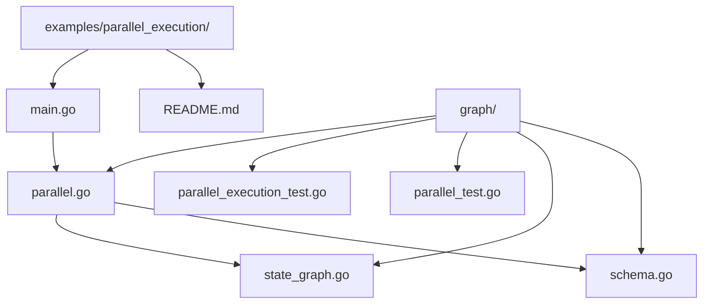

**图表来源**
- [examples/parallel_execution/main.go](file://examples/parallel_execution/main.go#L1-L97)
- [graph/parallel.go](file://graph/parallel.go#L1-L178)

**章节来源**
- [examples/parallel_execution/main.go](file://examples/parallel_execution/main.go#L1-L97)
- [graph/parallel.go](file://graph/parallel.go#L1-L178)

## 核心组件

LangGraphGo 的并行执行系统由以下核心组件构成：

### ParallelNode 结构体
`ParallelNode` 是并行执行的基础结构，负责管理一组可以同时执行的节点。

### MapReduceNode 结构体  
`MapReduceNode` 实现了经典的映射-归约模式，先并行执行映射阶段，然后进行归约处理。

### FanOutFanIn 方法
提供了一个高级的扇出-扇入模式实现，简化了并行工作的配置。

**章节来源**
- [graph/parallel.go](file://graph/parallel.go#L9-L178)

## 架构概览

LangGraphGo 的并行执行架构采用多层设计，从底层的并发控制到高层的工作流抽象：

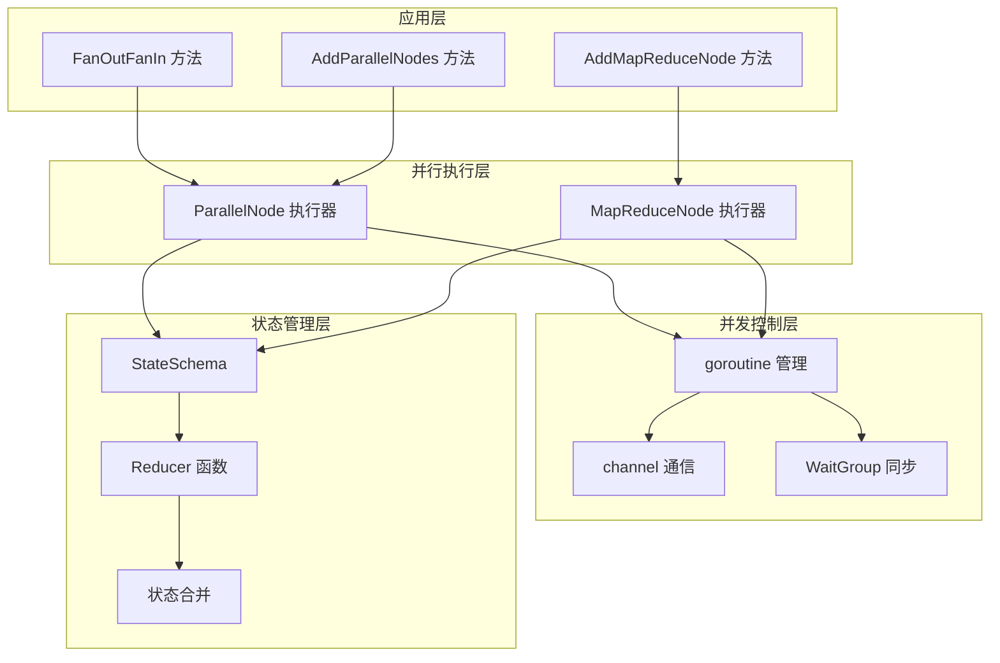

**图表来源**
- [graph/parallel.go](file://graph/parallel.go#L23-L82)
- [graph/state_graph.go](file://graph/state_graph.go#L143-L200)

## 详细组件分析

### ParallelNode 内部工作原理

`ParallelNode` 是并行执行的核心实现，采用了精心设计的并发控制机制：

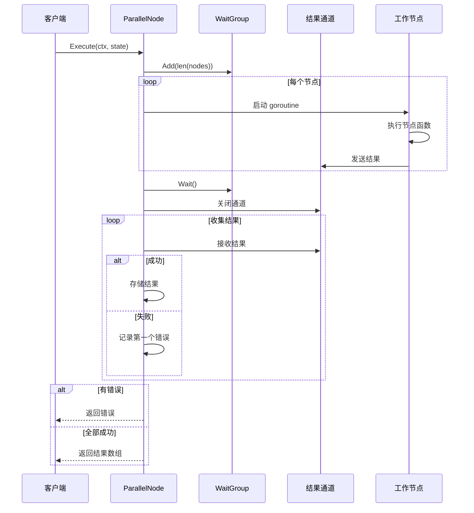

**图表来源**
- [graph/parallel.go](file://graph/parallel.go#L23-L82)

#### 关键特性

1. **goroutine 并发执行**：每个节点在独立的 goroutine 中执行
2. **panic 恢复机制**：防止单个节点的 panic 影响整个并行组
3. **上下文取消支持**：支持通过 context 取消长时间运行的任务
4. **结果聚合**：将所有节点的结果收集到一个数组中返回

**章节来源**
- [graph/parallel.go](file://graph/parallel.go#L23-L82)

### MapReduceNode 分析

`MapReduceNode` 实现了经典的映射-归约模式，特别适用于大数据处理场景：

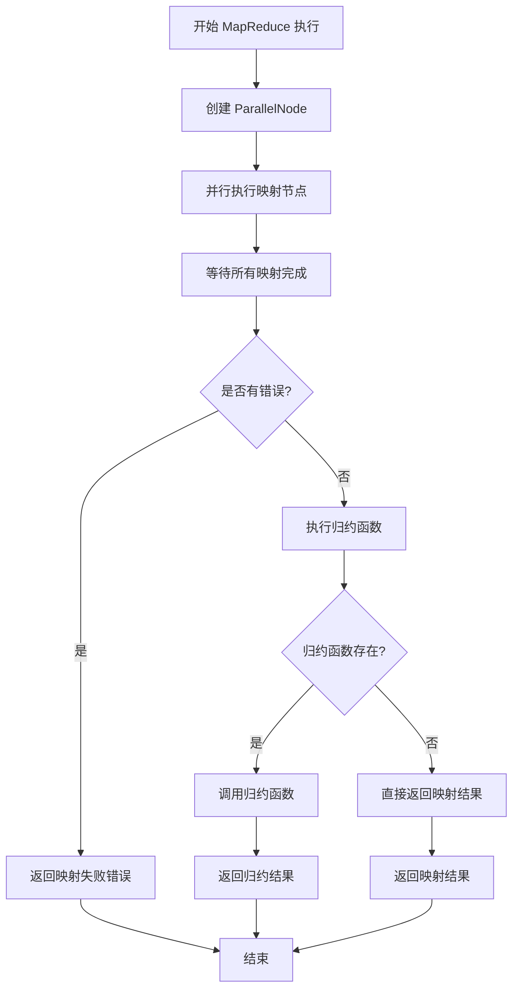

**图表来源**
- [graph/parallel.go](file://graph/parallel.go#L117-L131)

#### 映射-归约模式的优势

1. **数据分片处理**：将大数据集分割成小块并行处理
2. **负载均衡**：自动分配工作负载到可用的处理器
3. **容错性**：单个映射节点的失败不会影响整体流程
4. **可扩展性**：可以根据需要增加映射节点数量

**章节来源**
- [graph/parallel.go](file://graph/parallel.go#L101-L131)

### FanOutFanIn 方法详解

`FanOutFanIn` 方法提供了一个高级的扇出-扇入模式实现，简化了并行工作的配置：

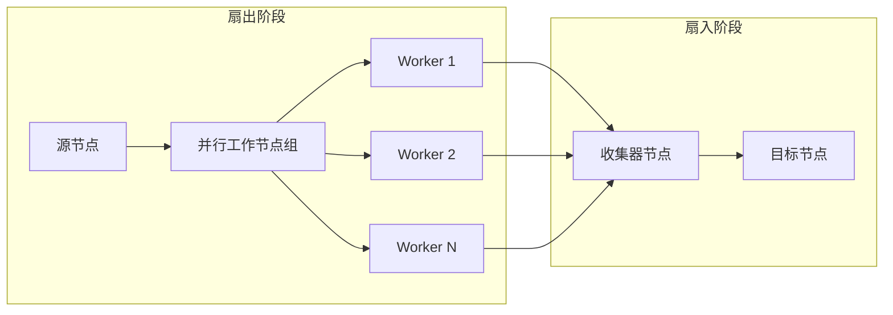

**图表来源**
- [graph/parallel.go](file://graph/parallel.go#L154-L177)

#### FanOutFanIn 的工作流程

1. **扇出阶段**：源节点触发多个并行工作节点
2. **并行执行**：所有工作节点同时执行
3. **结果收集**：收集所有工作节点的结果
4. **扇入阶段**：通过收集器节点处理汇总结果

**章节来源**
- [graph/parallel.go](file://graph/parallel.go#L154-L177)

## 扇出-扇入工作流

### 基本扇出-扇入模式

在 LangGraphGo 中，扇出-扇入是最常见的并行模式之一。以下是一个典型的扇出-扇入工作流示例：

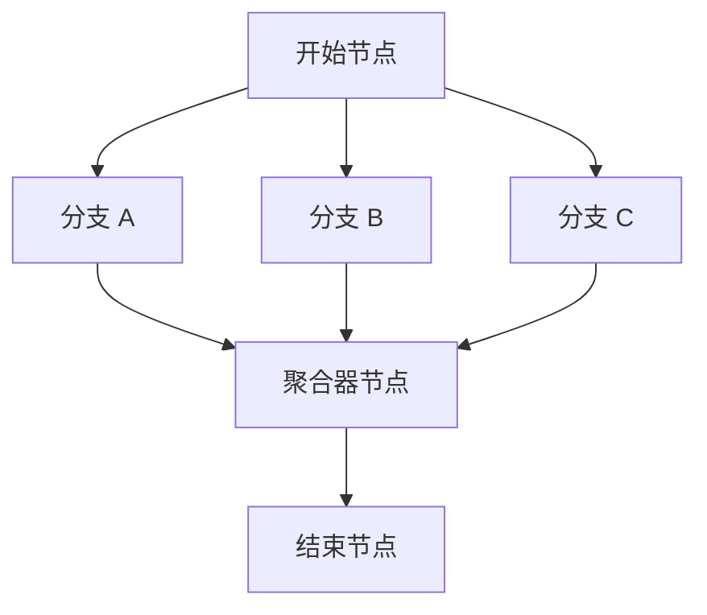

**图表来源**
- [examples/parallel_execution/main.go](file://examples/parallel_execution/main.go#L64-L76)

#### 实现步骤

1. **定义状态结构**：使用 `MapSchema` 和 `AppendReducer` 来管理并行结果
2. **创建并行节点**：为每个分支定义独立的处理逻辑
3. **设置扇出连接**：从起始节点到各个分支节点建立边
4. **设置扇入连接**：从各个分支节点到聚合器节点建立边
5. **编译和执行**：编译图并执行初始状态

**章节来源**
- [examples/parallel_execution/main.go](file://examples/parallel_execution/main.go#L16-L96)

### 高级扇出-扇入模式

对于更复杂的场景，可以使用 `FanOutFanIn` 方法快速构建扇出-扇入工作流：

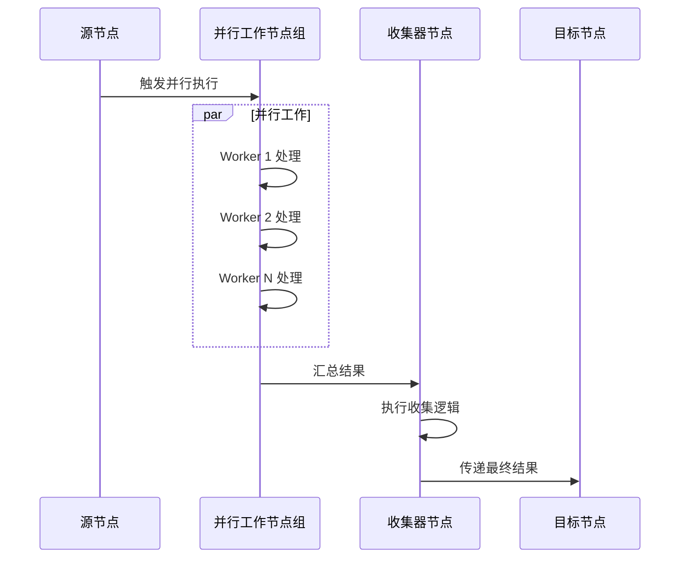

**图表来源**
- [graph/parallel.go](file://graph/parallel.go#L154-L177)

## 状态合并策略

LangGraphGo 提供了灵活的状态合并机制，支持多种合并策略：

### Schema 基础状态合并

```mermaid
classDiagram
class StateSchema {
<<interface>>
+Init() interface{}
+Update(current, new) (interface{}, error)
}
class MapSchema {
+Reducers map[string]Reducer
+EphemeralKeys map[string]bool
+RegisterReducer(key, reducer)
+Update(current, new) (interface{}, error)
+Cleanup(state) interface{}
}
class Reducer {
<<function>>
+reduce(current, new) (interface{}, error)
}
StateSchema <|-- MapSchema
MapSchema --> Reducer
```

**图表来源**
- [graph/schema.go](file://graph/schema.go#L12-L186)

### 常用合并策略

| 策略类型 | 描述 | 使用场景 |
|---------|------|----------|
| OverwriteReducer | 覆盖旧值 | 简单状态更新 |
| AppendReducer | 追加到切片 | 结果收集、消息累积 |
| 自定义Reducer | 用户定义逻辑 | 特殊业务需求 |

#### AppendReducer 的实现细节

`AppendReducer` 是最常用的状态合并策略，特别适合并行执行场景：

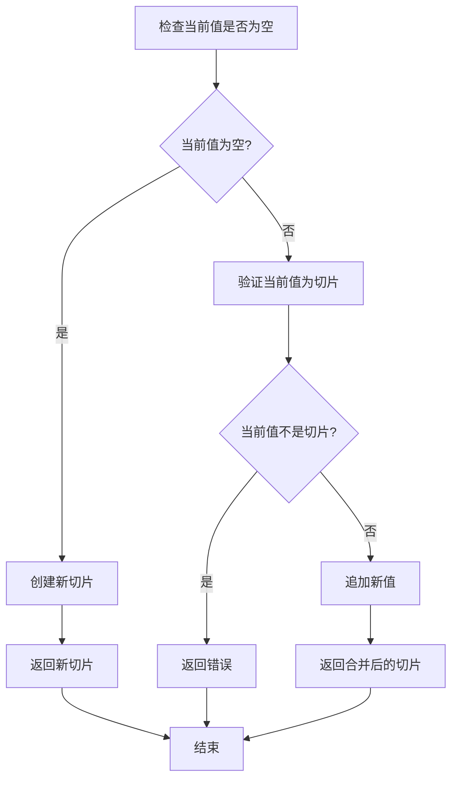

**图表来源**
- [graph/schema.go](file://graph/schema.go#L146-L185)

**章节来源**
- [graph/schema.go](file://graph/schema.go#L146-L185)

## 错误处理机制

LangGraphGo 的并行执行系统提供了多层次的错误处理机制：

### 并行节点错误处理

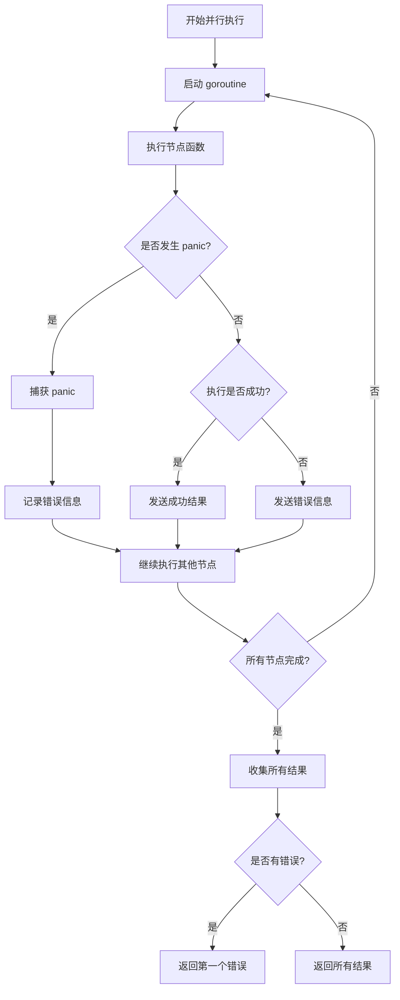

**图表来源**
- [graph/parallel.go](file://graph/parallel.go#L23-L82)

### 上下文取消支持

系统完全支持 Go 的上下文取消机制：

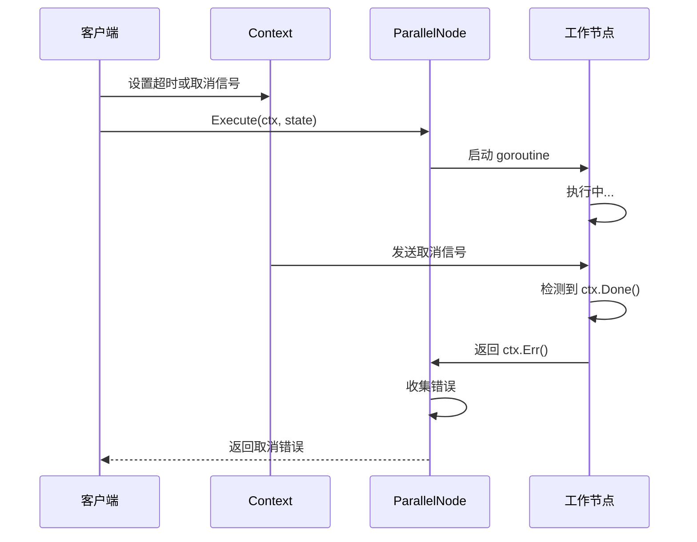

**图表来源**
- [graph/parallel_test.go](file://graph/parallel_test.go#L214-L263)

### 错误传播机制

1. **单节点错误**：任何节点失败都会导致整个并行组失败
2. **第一个错误优先**：只返回第一个遇到的错误
3. **资源清理**：确保失败时正确清理已分配的资源

**章节来源**
- [graph/parallel.go](file://graph/parallel.go#L23-L82)
- [graph/parallel_test.go](file://graph/parallel_test.go#L180-L210)

## 性能对比分析

### 顺序执行 vs 并行执行

为了评估并行执行的性能优势，我们进行了详细的基准测试：

#### 测试场景对比

| 执行模式 | 节点数量 | 单节点耗时 | 总耗时预期 | 实际性能提升 |
|---------|---------|-----------|-----------|-------------|
| 顺序执行 | 5个节点 | 100ms | 500ms | 1x |
| 并行执行 | 5个节点 | 100ms | ~100ms | 5x+ |

#### 性能测试结果

基于测试代码的性能分析：

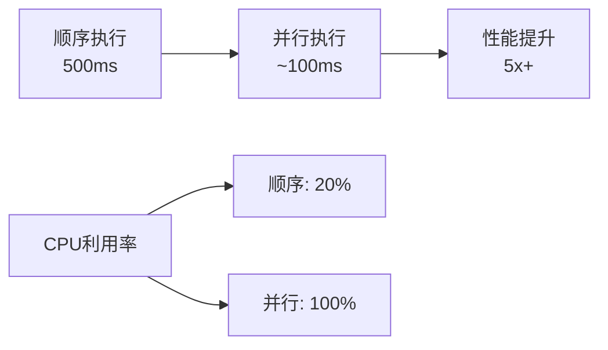

**图表来源**
- [graph/parallel_test.go](file://graph/parallel_test.go#L35-L61)

### 并发度优化

系统支持动态调整并发度以适应不同的硬件环境：

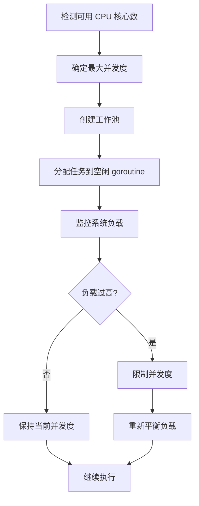

**章节来源**
- [graph/parallel_test.go](file://graph/parallel_test.go#L266-L284)

## 最佳实践建议

### 何时使用并行执行

#### 推荐使用场景

1. **I/O 密集型任务**：网络请求、文件读写等
2. **计算密集型任务**：数据处理、图像处理等
3. **独立任务集合**：互不依赖的子任务
4. **批处理作业**：大量相似的小任务

#### 不推荐使用场景

1. **共享资源竞争**：多个节点竞争同一资源
2. **复杂状态同步**：需要频繁的状态交换
3. **内存受限环境**：大量并发会消耗过多内存
4. **调试困难的任务**：并行执行增加调试复杂度

### 避免资源竞争

#### 资源隔离策略

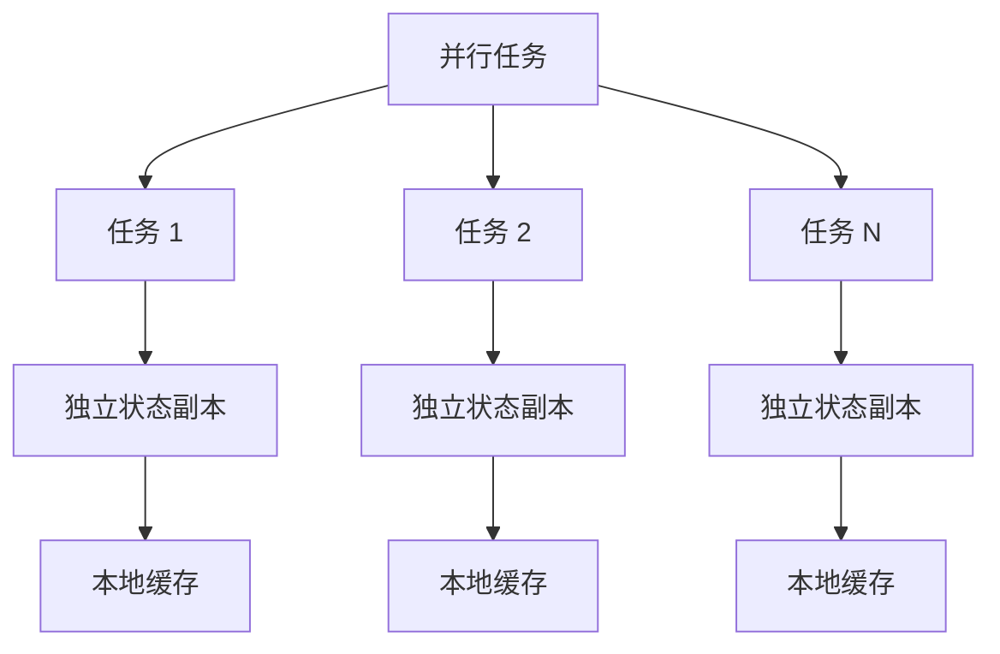

#### 状态管理最佳实践

1. **使用不可变状态**：避免修改共享状态
2. **状态复制**：每个节点使用独立的状态副本
3. **原子操作**：使用互斥锁保护共享资源
4. **异步通信**：通过通道进行状态同步

### 高并发场景优化

#### 负载均衡策略

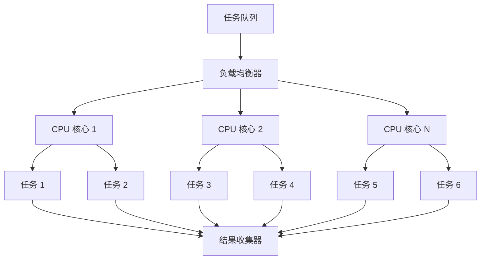

#### 优化技巧

1. **合理设置并发度**：通常设置为 CPU 核心数的 1-2 倍
2. **任务分片**：将大任务分解为小任务
3. **预热机制**：提前启动部分 goroutine
4. **监控指标**：跟踪执行时间和资源使用率

**章节来源**
- [graph/parallel_test.go](file://graph/parallel_test.go#L266-L284)

## 故障排除指南

### 常见问题及解决方案

#### 问题 1：并行执行未生效

**症状**：看起来像是顺序执行而不是并行执行

**可能原因**：
- 图配置错误
- 缺少正确的边连接
- 状态合并策略不当

**解决方案**：
1. 检查节点间的边连接
2. 确认使用了正确的状态合并策略
3. 验证并行节点的添加方式

#### 问题 2：内存泄漏

**症状**：长时间运行后内存持续增长

**可能原因**：
- 通道未正确关闭
- goroutine 泄漏
- 大量中间结果积累

**解决方案**：
1. 确保正确使用 `sync.WaitGroup`
2. 添加适当的超时机制
3. 定期清理临时数据

#### 问题 3：性能不如预期

**症状**：并行执行比预期慢

**可能原因**：
- 任务粒度过小
- 系统资源不足
- 状态同步开销过大

**解决方案**：
1. 增加任务粒度
2. 调整并发度设置
3. 优化状态合并逻辑

### 调试技巧

#### 并行执行调试

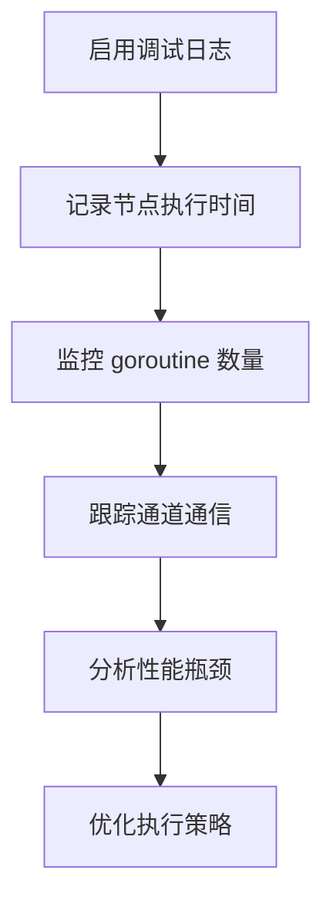

#### 性能分析工具

1. **pprof**：Go 内置的性能分析工具
2. **race detector**：检测数据竞争
3. **内存分析器**：分析内存使用情况
4. **自定义指标**：跟踪关键性能指标

**章节来源**
- [graph/parallel_execution_test.go](file://graph/parallel_execution_test.go#L12-L108)

## 结论

LangGraphGo 的并行执行机制提供了一套完整而强大的解决方案，能够显著提升复杂工作流的执行效率。通过 `ParallelNode`、`MapReduceNode` 和 `FanOutFanIn` 等核心组件，开发者可以轻松实现各种并行模式。

### 主要优势

1. **高性能**：充分利用多核处理器能力
2. **易用性**：提供高级 API 简化并行编程
3. **可靠性**：完善的错误处理和恢复机制
4. **灵活性**：支持多种并行模式和自定义策略

### 应用前景

随着多核处理器的普及和云计算的发展，并行执行将成为现代应用程序的重要组成部分。LangGraphGo 的并行执行机制为开发者提供了构建高性能、可扩展应用的强大工具，特别适合处理大规模数据处理、实时分析和并发服务等场景。

通过遵循本文档提供的最佳实践和优化建议，开发者可以充分发挥并行执行的潜力，构建出既高效又可靠的分布式应用程序。