# 高级特性

<cite>
**本文档引用的文件**
- [examples/parallel_execution/main.go](file://examples/parallel_execution/main.go)
- [examples/human_in_the_loop/main.go](file://examples/human_in_the_loop/main.go)
- [examples/subgraph/main.go](file://examples/subgraph/main.go)
- [examples/visualization/main.go](file://examples/visualization/main.go)
- [graph/parallel.go](file://graph/parallel.go)
- [graph/subgraph.go](file://graph/subgraph.go)
- [graph/visualization.go](file://graph/visualization.go)
- [graph/interrupt_test.go](file://graph/interrupt_test.go)
- [graph/parallel_test.go](file://graph/parallel_test.go)
- [graph/checkpointing.go](file://graph/checkpointing.go)
</cite>

## 目录
1. [简介](#简介)
2. [并行执行（Parallel Execution）](#并行执行parallel-execution)
3. [子图（Subgraph）](#子图subgraph)
4. [人在回路（Human-in-the-loop）](#人在回路human-in-the-loop)
5. [图结构可视化（Visualization）](#图结构可视化visualization)
6. [状态检查点（Checkpointing）](#状态检查点checkpointing)
7. [性能优化与最佳实践](#性能优化与最佳实践)
8. [常见陷阱与解决方案](#常见陷阱与解决方案)
9. [总结](#总结)

## 简介

LangGraphGo 提供了丰富的高级功能，使开发者能够构建复杂的、生产级别的工作流系统。这些特性包括并行执行、子图模块化设计、人在回路交互、可视化工具以及状态持久化等。本文档将深入探讨这些高级特性的实现原理、使用方法和最佳实践。

## 并行执行（Parallel Execution）

### 核心概念

并行执行是 LangGraphGo 的重要特性之一，它允许工作流中的多个节点同时执行，显著提升处理效率。系统通过 Go 协程实现真正的并发执行。

### 实现机制

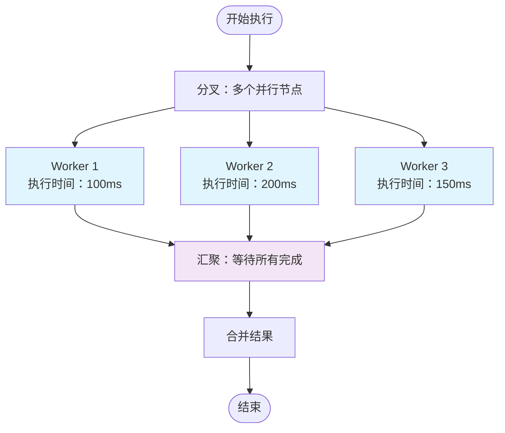

**图表来源**
- [graph/parallel.go](file://graph/parallel.go#L24-L82)
- [examples/parallel_execution/main.go](file://examples/parallel_execution/main.go#L23-L52)

### 主要功能

#### 1. ParallelNode 结构

ParallelNode 是并行执行的核心组件，负责管理一组可以同时执行的节点：

```mermaid
classDiagram
class ParallelNode {
+nodes []Node
+name string
+Execute(ctx, state) interface{}
}
class MessageGraph {
+AddParallelNodes(groupName, nodes)
+FanOutFanIn(source, workers, collector, funcs, reducer)
}
class MapReduceNode {
+name string
+mapNodes []Node
+reducer func
+Execute(ctx, state) interface{}
}
ParallelNode --> Node : "管理多个节点"
MessageGraph --> ParallelNode : "创建并行组"
MessageGraph --> MapReduceNode : "创建MapReduce模式"
```

**图表来源**
- [graph/parallel.go](file://graph/parallel.go#L9-L21)
- [graph/parallel.go](file://graph/parallel.go#L101-L132)

#### 2. 并行执行模式

系统提供了多种并行执行模式：

| 模式 | 描述 | 使用场景 |
|------|------|----------|
| **并行节点组** | 多个独立节点同时执行 | 数据处理、计算密集型任务 |
| **MapReduce** | 分布式计算模式 | 大数据处理、统计分析 |
| **扇出扇入** | 批量处理后汇总 | 批量数据转换、聚合计算 |

### 性能对比分析

基于基准测试结果，我们可以看到明显的性能优势：

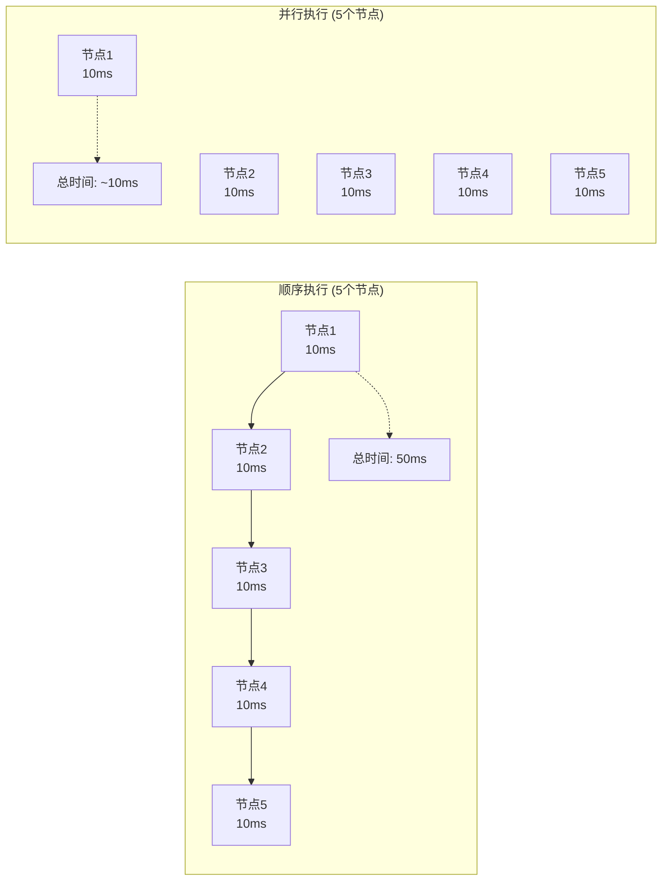

**图表来源**
- [graph/parallel_test.go](file://graph/parallel_test.go#L304-L360)

### 最佳实践

1. **合理设计并行粒度**：避免过度并行化导致资源竞争
2. **错误处理**：确保单个节点失败不影响整体流程
3. **状态同步**：使用适当的 reducer 函数合并结果
4. **资源监控**：监控并发执行的系统资源使用情况

**章节来源**
- [graph/parallel.go](file://graph/parallel.go#L1-L178)
- [examples/parallel_execution/main.go](file://examples/parallel_execution/main.go#L1-L97)
- [graph/parallel_test.go](file://graph/parallel_test.go#L1-L361)

## 子图（Subgraph）

### 核心概念

子图允许将复杂的工作流分解为可复用的模块化组件，支持层次化的架构设计。

### 实现架构

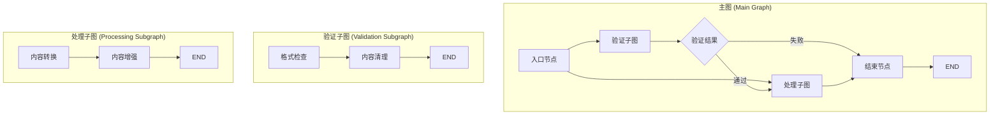

**图表来源**
- [examples/subgraph/main.go](file://examples/subgraph/main.go#L18-L100)
- [graph/subgraph.go](file://graph/subgraph.go#L8-L36)

### 子图类型

#### 1. 基础子图（Basic Subgraph）

最简单的子图实现，支持基本的状态传递：

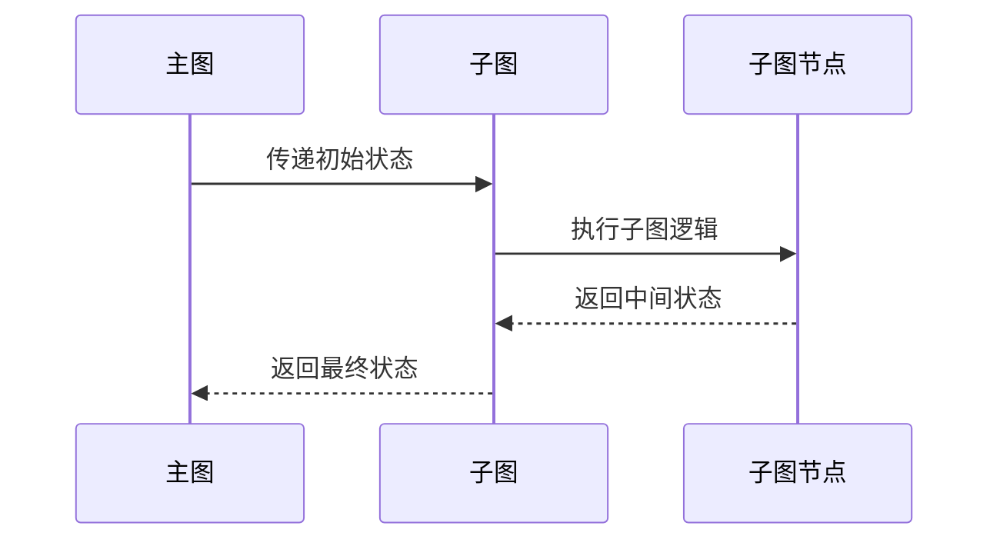

**图表来源**
- [graph/subgraph.go](file://graph/subgraph.go#L29-L36)

#### 2. 复合图（Composite Graph）

支持多个子图组合的高级架构：

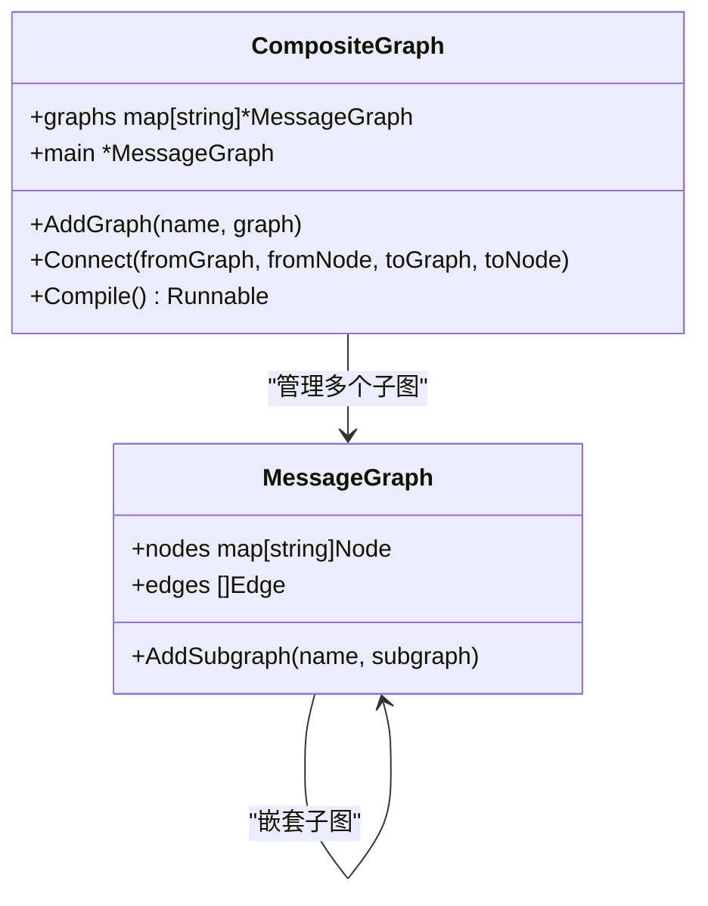

**图表来源**
- [graph/subgraph.go](file://graph/subgraph.go#L56-L106)

#### 3. 递归子图（Recursive Subgraph）

支持自调用的子图，适用于迭代处理场景：

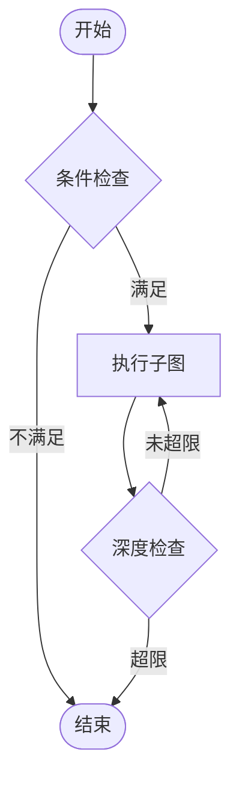

**图表来源**
- [graph/subgraph.go](file://graph/subgraph.go#L108-L171)

### 使用示例

子图的典型应用场景包括：

1. **模块化工作流**：将复杂业务逻辑分解为独立模块
2. **状态共享**：在父子图之间传递和修改状态
3. **可重用组件**：创建可在多个工作流中使用的组件
4. **层次化设计**：构建具有清晰层次结构的系统

**章节来源**
- [graph/subgraph.go](file://graph/subgraph.go#L1-L200)
- [examples/subgraph/main.go](file://examples/subgraph/main.go#L1-L166)

## 人在回路（Human-in-the-loop）

### 核心机制

人在回路功能允许工作流在关键决策点暂停，等待人工干预。这是构建可控AI系统的重要特性。

### 中断类型

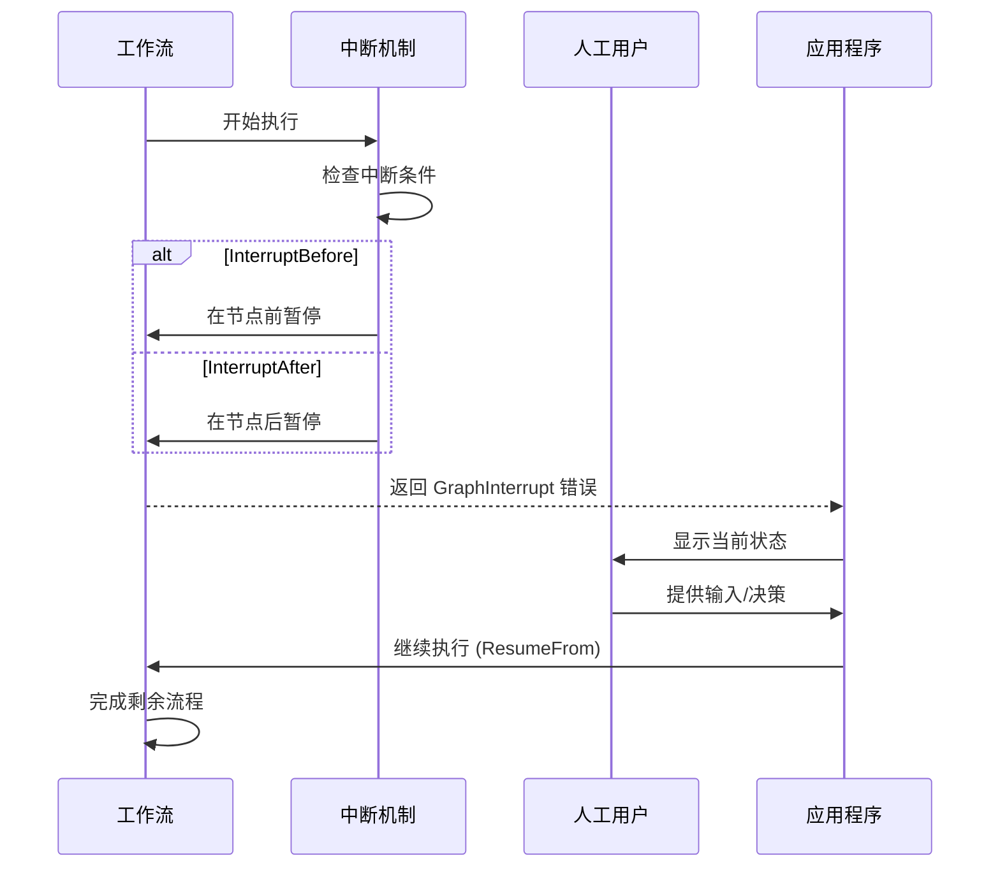

**图表来源**
- [examples/human_in_the_loop/main.go](file://examples/human_in_the_loop/main.go#L67-L118)
- [graph/interrupt_test.go](file://graph/interrupt_test.go#L30-L63)

### 动态中断（Dynamic Interrupt）

动态中断允许节点在运行时决定是否暂停：

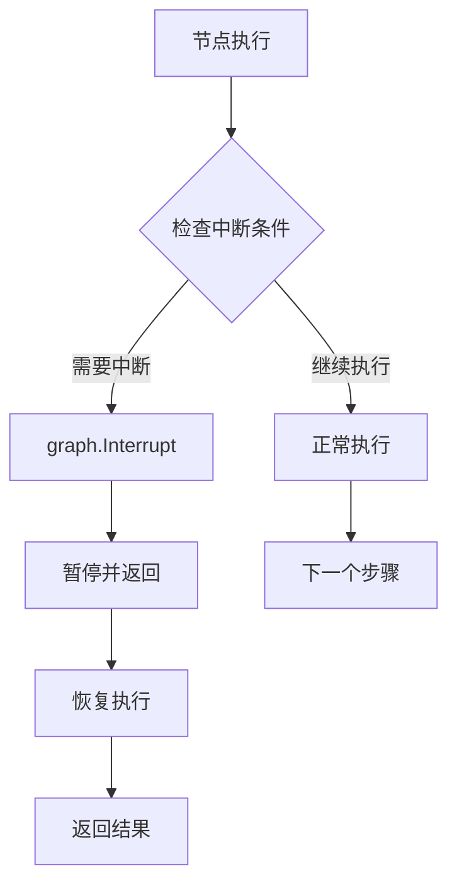

**图表来源**
- [examples/dynamic_interrupt/README.md](file://examples/dynamic_interrupt/README.md#L1-L35)

### 实现细节

#### 1. 中断配置

| 配置项 | 类型 | 描述 |
|--------|------|------|
| `InterruptBefore` | `[]string` | 在指定节点前暂停 |
| `InterruptAfter` | `[]string` | 在指定节点后暂停 |
| `ResumeFrom` | `[]string` | 从指定节点恢复 |
| `ResumeValue` | `interface{}` | 恢复时提供的值 |

#### 2. 状态保存与恢复

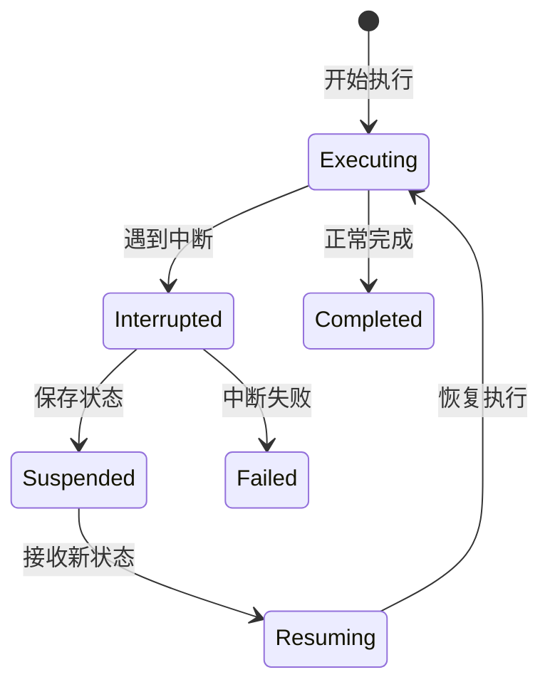

### 应用场景

1. **审批流程**：关键决策需要人工确认
2. **质量控制**：重要输出需要人工审核
3. **调试模式**：开发和测试期间的状态检查
4. **安全控制**：高风险操作的人工确认

**章节来源**
- [examples/human_in_the_loop/main.go](file://examples/human_in_the_loop/main.go#L1-L119)
- [graph/interrupt_test.go](file://graph/interrupt_test.go#L1-L64)

## 图结构可视化（Visualization）

### 可视化格式

LangGraphGo 提供多种可视化输出格式，满足不同需求：

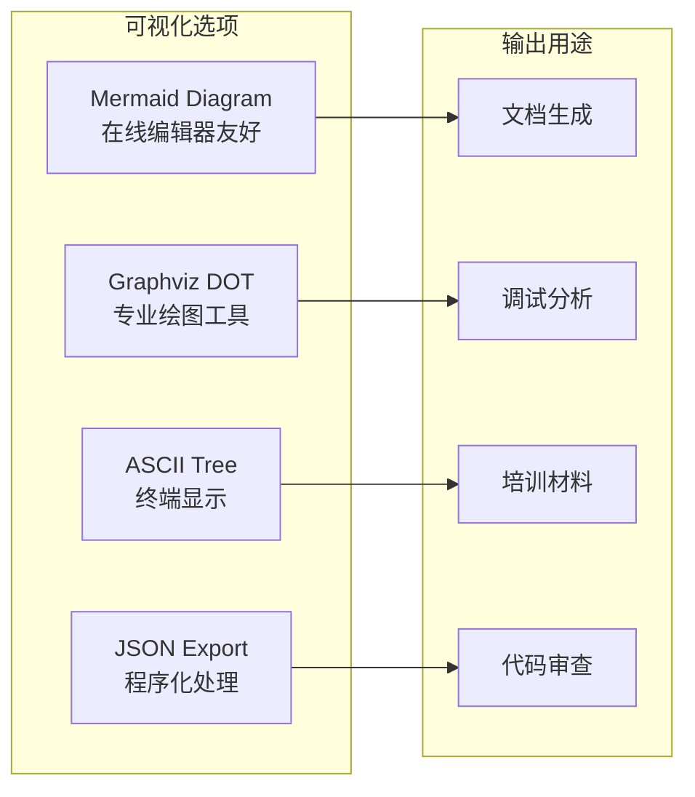

**图表来源**
- [examples/visualization/main.go](file://examples/visualization/main.go#L66-L96)
- [graph/visualization.go](file://graph/visualization.go#L9-L226)

### 可视化功能详解

#### 1. Mermaid 图表

Mermaid 格式最适合在线分享和文档集成：


**图表来源**
- [graph/visualization.go](file://graph/visualization.go#L25-L96)

#### 2. Graphviz DOT 格式

适合生成高质量的图形输出：

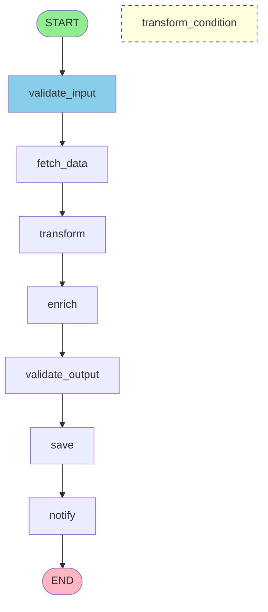

**图表来源**
- [graph/visualization.go](file://graph/visualization.go#L98-L142)

#### 3. ASCII 树形表示

适合在终端环境中快速查看：

```
Graph Execution Flow:
├── START
├── validate_input
├── fetch_data
├── transform
├── enrich
├── validate_output
├── save
└── notify
```

**图表来源**
- [graph/visualization.go](file://graph/visualization.go#L145-L220)

### 可视化最佳实践

1. **选择合适的格式**：根据使用场景选择最适合的输出格式
2. **保持简洁**：避免过于复杂的图表影响可读性
3. **添加注释**：为重要的决策点添加说明
4. **版本控制**：将可视化输出纳入版本控制系统

**章节来源**
- [graph/visualization.go](file://graph/visualization.go#L1-L226)
- [examples/visualization/main.go](file://examples/visualization/main.go#L1-L97)

## 状态检查点（Checkpointing）

### 检查点系统架构

```mermaid
classDiagram
class Checkpoint {
+ID string
+NodeName string
+State interface{}
+Metadata map[string]interface{}
+Timestamp time.Time
+Version int
}
class CheckpointStore {
<<interface>>
+Save(ctx, checkpoint) error
+Load(ctx, id) *Checkpoint
+List(ctx, execID) []*Checkpoint
+Delete(ctx, id) error
+Clear(ctx, execID) error
}
class MemoryCheckpointStore {
+checkpoints map[string]*Checkpoint
+mutex sync.RWMutex
}
class SqliteCheckpointStore {
+db *sql.DB
+tableName string
}
class RedisCheckpointStore {
+client *redis.Client
+prefix string
}
CheckpointStore <|-- MemoryCheckpointStore
CheckpointStore <|-- SqliteCheckpointStore
CheckpointStore <|-- RedisCheckpointStore
CheckpointStore --> Checkpoint : "管理"
```

**图表来源**
- [graph/checkpointing.go](file://graph/checkpointing.go#L12-L212)

### 存储后端

#### 1. 内存存储（MemoryCheckpointStore）

最适合开发和测试环境：

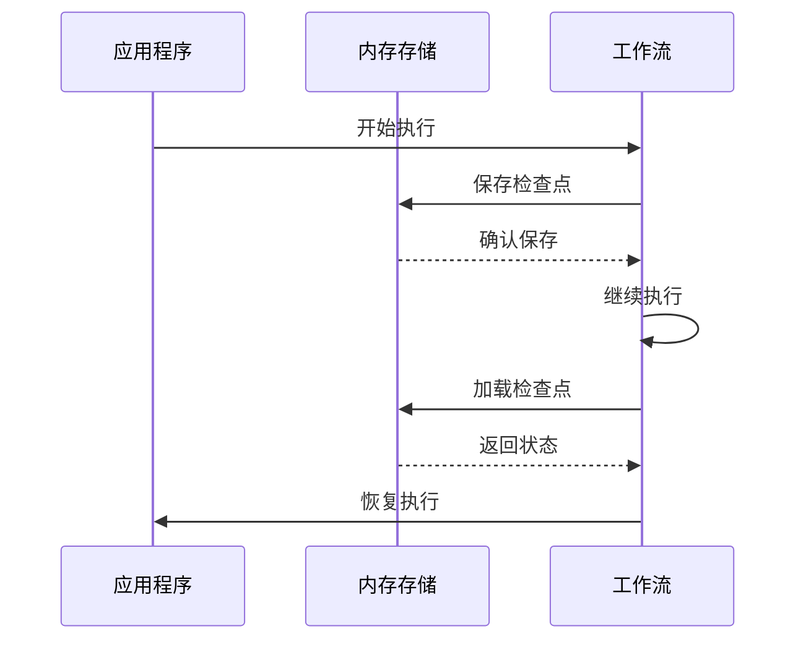

#### 2. SQLite 存储

适合单机部署和小型应用：

| 特性 | 描述 |
|------|------|
| **持久性** | 数据永久保存在本地数据库 |
| **事务支持** | 支持 ACID 事务 |
| **查询能力** | 支持复杂的查询和过滤 |
| **性能** | 适合中小规模数据 |

#### 3. Redis 存储

适合分布式环境和高性能需求：

| 特性 | 描述 |
|------|------|
| **内存存储** | 高速访问，适合频繁读写 |
| **分布式** | 支持多实例共享状态 |
| **过期策略** | 自动清理过期检查点 |
| **集群支持** | 支持 Redis 集群部署 |

### 检查点配置

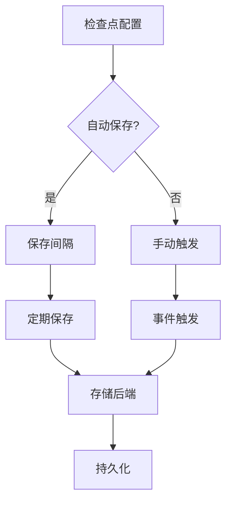

**图表来源**
- [graph/checkpointing.go](file://graph/checkpointing.go#L188-L211)

**章节来源**
- [graph/checkpointing.go](file://graph/checkpointing.go#L1-L212)

## 性能优化与最佳实践

### 并行执行优化

1. **合理设置并发度**：根据系统资源调整并行节点数量
2. **资源隔离**：为不同类型的任务分配不同的资源池
3. **错误传播**：实现快速失败机制，避免无效等待
4. **上下文取消**：支持优雅的中断和取消操作

### 内存管理

1. **状态压缩**：对大型状态对象进行序列化优化
2. **垃圾回收**：及时释放不再需要的检查点数据
3. **缓存策略**：实现智能的检查点缓存机制

### 网络优化

1. **连接池**：复用数据库和Redis连接
2. **批量操作**：减少网络往返次数
3. **异步处理**：使用异步方式保存检查点

## 常见陷阱与解决方案

### 并行执行陷阱

#### 1. 资源竞争

**问题**：多个并行节点竞争同一资源
**解决方案**：使用互斥锁或队列机制

#### 2. 死锁风险

**问题**：并行节点间存在循环依赖
**解决方案**：严格控制执行顺序和依赖关系

#### 3. 状态不一致

**问题**：并发修改共享状态
**解决方案**：使用原子操作或状态锁

### 子图设计陷阱

#### 1. 状态污染

**问题**：子图修改了不应该修改的状态字段
**解决方案**：实现状态深拷贝或只读访问

#### 2. 循环依赖

**问题**：子图之间形成循环引用
**解决方案**：使用接口和抽象层解耦

### 可视化陷阱

#### 1. 过度复杂

**问题**：生成的图表过于复杂难以理解
**解决方案**：提供图表简化选项

#### 2. 格式兼容性

**问题**：不同格式间的转换丢失信息
**解决方案**：保持元数据的完整性

### 检查点陷阱

#### 1. 数据一致性

**问题**：检查点数据损坏或不完整
**解决方案**：实现数据校验和恢复机制

#### 2. 性能影响

**问题**：频繁的检查点操作影响性能
**解决方案**：优化保存频率和批量操作

## 总结

LangGraphGo 的高级特性为构建复杂、可靠的工作流系统提供了强大的基础设施。通过合理使用并行执行、子图模块化、人在回路、可视化工具和状态检查点等功能，开发者可以构建出既高效又易于维护的系统。

### 关键要点

1. **并行执行**：显著提升处理性能，但需要注意资源管理和错误处理
2. **子图设计**：支持模块化和可重用性，提高代码组织能力
3. **人在回路**：确保AI系统的可控性和安全性
4. **可视化工具**：提高开发效率和系统可维护性
5. **状态管理**：保证系统的可靠性和可恢复性

### 发展方向

随着 AI 技术的发展，LangGraphGo 的高级特性将继续演进，为构建更复杂、更智能的工作流系统提供更强的支持。开发者应该持续关注这些特性的更新，并将其应用到实际项目中，以获得最佳的开发体验和系统性能。